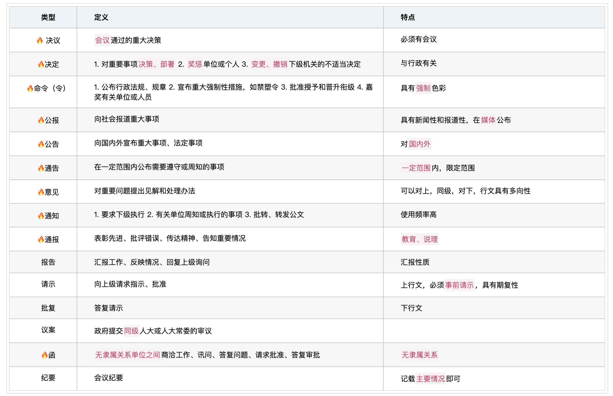
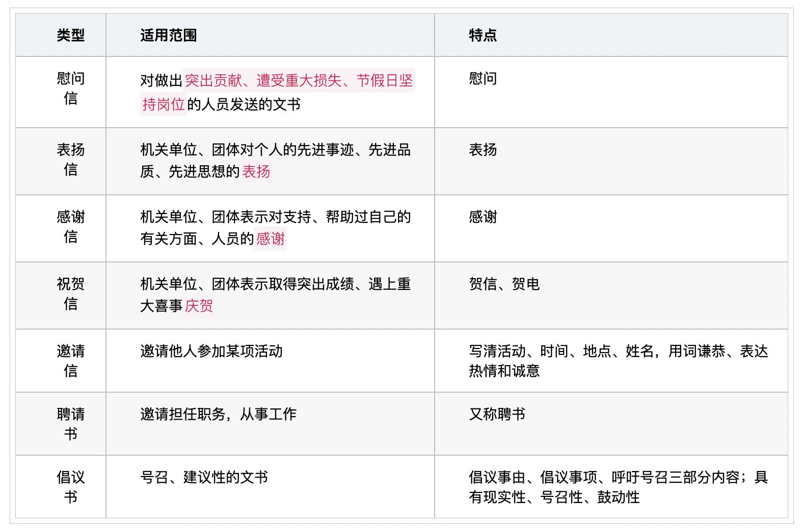
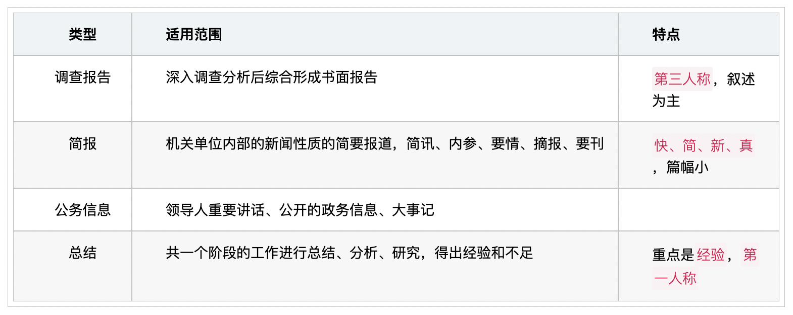
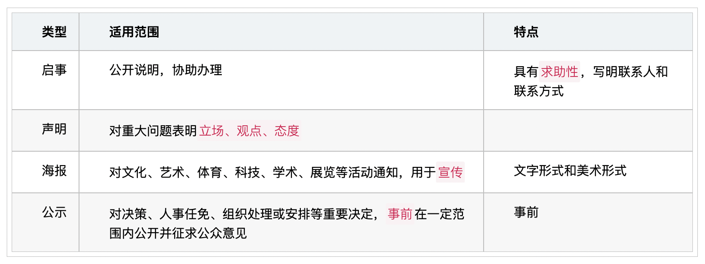

# 《公文》概述及类型

`2023/04/12 19:55:38  by: 程序员·小李`

#### 公文是什么

> **公文**是`党政机关`用于`实施领导、履行职能、处理公务`的具有**特定效力**和**规范体式**的文书。

#### 公文的特点

> **作者的法定性**：公文的作者一定是`机关单位`。
> 
> **法定的权威性**：公文是`必须`执行的。
>
> **效用的现实性**：效用具有`时间限定`。
>
> **体式的规范性**：`格式、语言、文体`要符合规范，语言要准确、简洁、庄重、严谨、朴实。`准确`是第一要求。表达方式要规范，可以采用`说明、议论、叙述`三种方式。
>
> **处理的程序性**：公文的`拟制、办理、管理`需要经过必要的`程序`。

#### 稿本

> **草稿**：起草形成的稿件
>
> **定稿**：草稿审核无误后，经`负责人审批签发`的即为定稿。

> **正本**：具有法律效力的正式文本，与定稿内容一致。
>
> **副本**：再现公文正本的部分或全部外形特征的`公文复制本或复印本`。
>
> **试行本**：规定`试行期间`，具有正式公文效力的`特殊文本`。
>
> **修订本**：已经发布生效的文本，修订补充后再发布的文本。
>
> **暂行本**：在`规定期限内`试行的文本，具有正式公文效力的公文文本

#### 公文的种类

> **通告、通知、通报的区分**：通告`禁止`你做什么，通知`要求`你做什么，通报主要是`批评教育`。
>
> **公告和通告的区分**：公告面向`国内外`，一般不涉及强制性，通告面向`一定范围`，有强制性。
>
> **命令、决定、通报的区分**：命令一般适用于`国务院及其各部委、直属机构`，对`重大、紧急`情况下的`卓越表现`进行嘉奖，也`只能嘉奖`，不涉及惩罚；决定和通报是`各级行政机关、部门`均可使用。决定和通报`可以嘉奖也可以惩罚`，涉及嘉奖的决定需要满足一定的条件。通报往往具有`教育、说理`的意图。
>
> **报告与请示的区分**：报告不一定要求上级答复，请示则具有`期复性`。报告可以随时进行，请示必须在`事前`。报告可以多事合并一起，请示必须`一文一事`。

#### 日常事务性文书

#### 信息反馈文书

#### 告启文书

