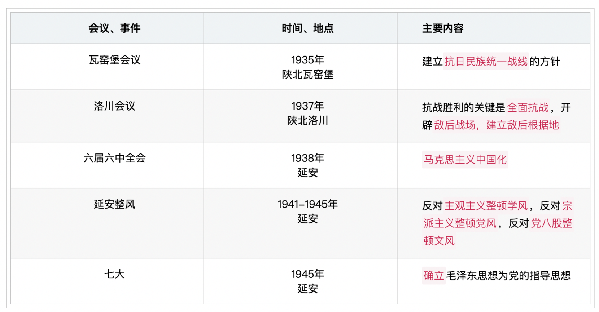
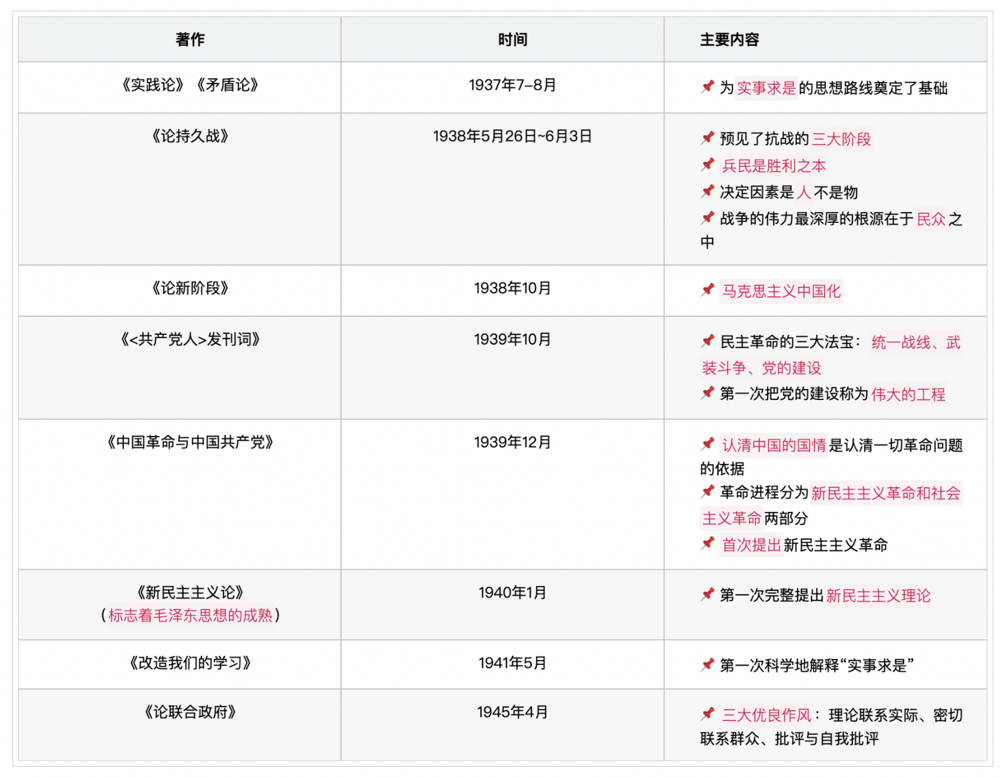
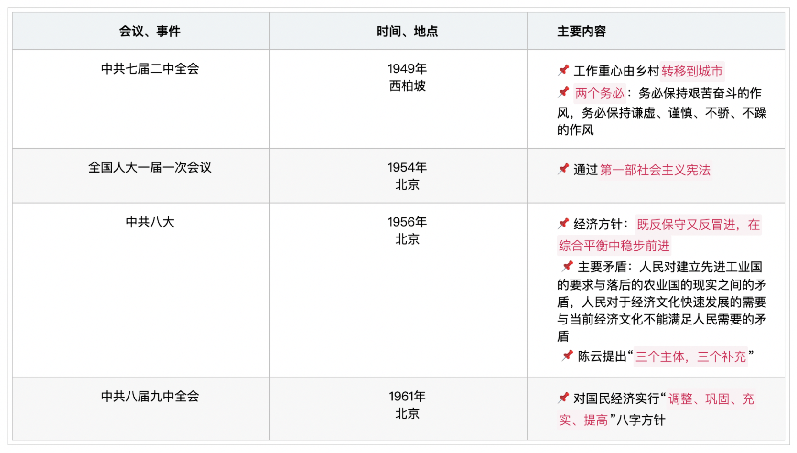
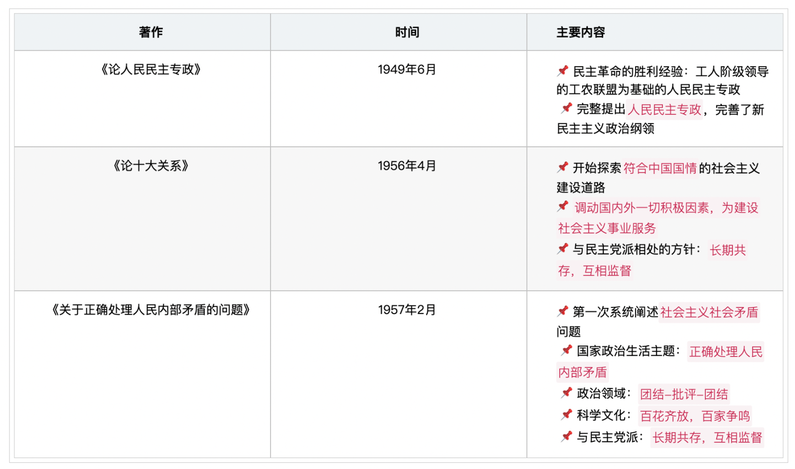
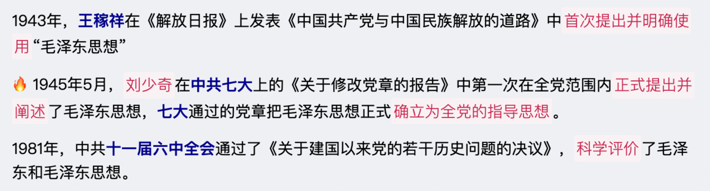
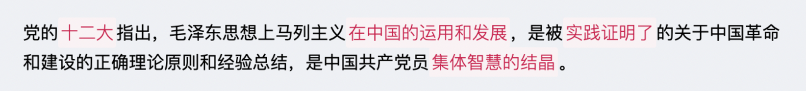
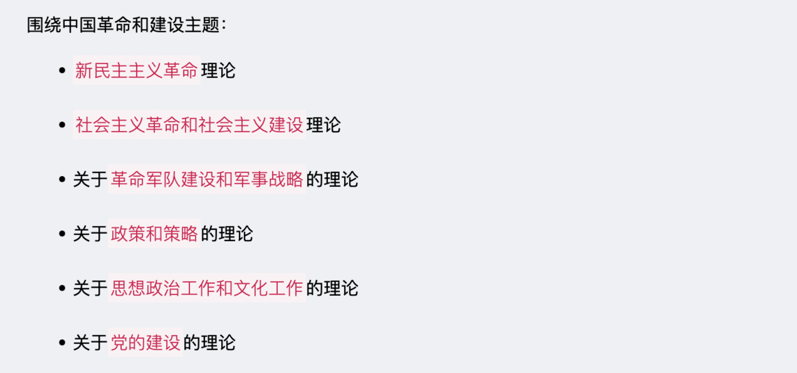
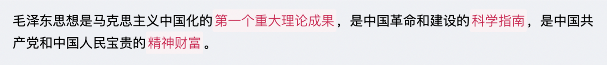
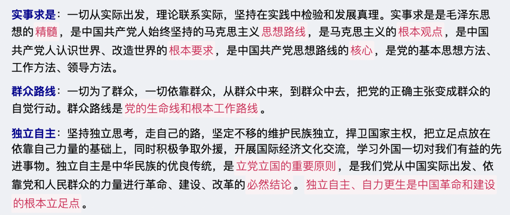

# 《毛泽东思想》概述

`2023/04/08 12:43:19  by: 程序员·小李`

#### 🔥 形成前提和条件

> 社会背景：`半殖民地半封建社会`的社会性质
>
> 理论基础：`马列主义`
> 
> 实践基础：中国共产党领导的革命与建设的实践
> 
> 阶级基础：`工人阶级`的不断壮大
> 
> 文化基础：优秀的传统文化
> 
> 时代背景：战争与革命是时代主题，`俄国十月革命`的胜利

1915年9月，`陈独秀`在上海创办《新青年》，`标志着新文化运动开始`，其口号是`民主与科学`。

`李大钊`是中国`宣传马克思主义的第一人`，代表作《法俄革命之比较观》、《布尔什维克主义的胜利》、《庶民的胜利》。

第一个翻译《共产党宣言》的是`陈望道`。

#### 🔥 毛泽东思想萌芽阶段（1921~1927 中国共产党成立到大革命失败）

主要内容：
> * **一大**：`共产党的成立`，选举`陈独秀`为中央局书记
> * **二大**：第一次提出`彻底的反帝反封建`；最低纲领——清除内乱、打倒军阀、推翻帝国主义压迫，实现民族独立，统一民主共和国；最高纲领——采用阶级斗争，逐次达到共产主义
> * 三大：`国共合作`、统一战线，集体加入国民党
> * **四大**：`无产阶级领导权的问题`是统一战线的根本问题，提出`工农联盟`问题
> * 五大：批评陈独秀的机会主义，选举产生`中央监察委员`

代表作：
> **《中国社会各阶级的分析》**——`标志毛泽东思想的萌芽`
> * 抨击陈独秀为代表的右倾机会主义，张国焘为代表的左倾机会主义
> * `分清敌友是首要问题`（哪些是可以团结的力量，哪些是敌对势力）
>
> 《国民革命与农民运动》
> * `农民问题`是国民革命的中心问题
>
> 《湖南农民运动考察报告》
> * 充分肯定`农民`在革命中的作用

#### 🔥 毛泽东思想形成阶段（1927~1935 土地革命战争前中期）

主要内容：
> * **南昌起义**：打响了`武装反抗国民党反动统治的第一枪`；中国共产党`开始创建军队`，独立领导革命战争
> * **八七会议**：`枪杆子里面出政权`
> * 秋收起义：`开辟第一个农村革命根据地`——井冈山革命根据地
> * **三湾改编**：`党指挥枪`；支部建在连上
> * 六大：唯一一次在外国开的会议，做艰苦的群众工作，仍属于资产阶级性质的民主革命
> * **古田会议**：`思想建党、政治建军`；`重申党对军队的领导`；确立人民军队建设原则
> * **遵义会议**：生死攸关的转折点；确立`毛泽东`的领导地位；`首次使用马克思主义解决路线、方针、政策问题`

代表作：
> 《中国红色政权为什么能够存在》
> * 提出`工农武装割据`
>
> 《井冈山的斗争》
> * 系统阐述`工农武装割据`
>
> **《星星之火，可以燎原》**——标志毛泽东思想的基本形成
> * 农村包围城市，武装夺取政权
>
> **《反对本本主义》**
> * 反对`教条主义、经验主义`
> * `没有调查就没有发言权`
> * `一切从实际出发`
> * 第一篇关于`实事求是`的文章

#### 🔥 毛泽东思想成熟阶段（1935~1945 土地革命后期到全面抗战时期）

#### 🔥 毛泽东思想继续发展阶段（1945~ 解放战争时期及新中国成立以后）

#### 提出

#### 🔥 内涵

#### 主要内容

#### 意义

#### 🔥 活的灵魂

