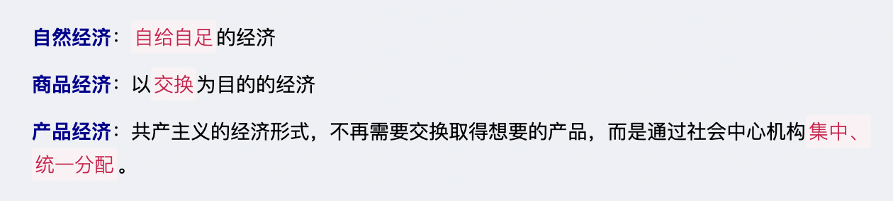

# 《经济学》商品经济理论

`2023/04/10 22:45:28  by: 程序员·小李`

#### 商品经济

#### 商品

> 商品是`用来交换`的能够`满足`人们某种`需要`的`劳动产品`，
>
> 商品具有`使用价值`和`价值`两种属性。其中，使用价值是商品的`自然属性`，价值是商品的`社会属性`，`特有的`属性。
> * 商品的使用价值是能够满足人们某种需要的作用，即有用性。
> * 价值是凝结在商品中`无差别的人类劳动`。

> 商品的使用价值和价值是`对立统一`的，二者不可兼得，也必须有两种价值属性。使用价值是价值的`物质承担者`，没有使用价值的物品则没有价值，`价值寓于使用价值`之中。生产者只能让渡使用价值获取价值，消费者通过让渡价值获得使用价值。

> 商品`一定是`劳动产品，但劳动产品`不一定`是商品，`用于交换`的劳动产品才是商品。

#### 劳动二重性

> 商品一定是劳动产品，其劳动分为具体劳动和抽象劳动。具体劳动生产使用价值，抽象劳动生产价值。

#### 商品的价值量

> 商品的价值量是商品价值的大小，通常指单位商品的价值量，由生产该商品的`社会必要劳动时间`决定的。
>
> 生产商品所需要的社会必要劳动时间随着劳动生产率的变化而变化，若其他因素不变，单位商品的价值量与生产该商品的社会必要劳动时间成正比，与社会劳动生产率成反比。

#### 价值规律

> 价值规律是商品经济的基本规律：商品的价值量由生产该商品的`社会必要劳动时间`决定；商品交换以`价值量`为基础实行`等价交换`。
>
> 价格围绕`价值`上下波动
>
> 价值规律自发地`调节生产资料和劳动力`在社会各生产部门之间`按比例分配`
>
> 价值规律自发地刺激生产者改进技术，改善经营者管理，`促进社会生产力的发展`
>
> 价值规律引起、促进商品`生产者的两极分化`，造成优胜劣汰的结果。

#### 货币

> 货币是在商品交换中固定充当一般等价物的特殊商品。`价值尺度`和`流通手段`是最基本的职能：

> 价值尺度：用于衡量其他物品的价值，例如标价。（观念上的货币）
>
> 流通手段：用于商品交换的功能，例如付款。（现实货币）
>
> 支付手段：支付手段用于清偿债务，缴纳租金、税金、发放工资等。
>
> 贮藏手段：作为金属的收藏价值。（足值的金属货币或条块）
>
> 世界货币：用于国家之间的商品贸易。

> 数字货币是人民银行发行的数字形式的法定货币，与实物人民币等价，具有价值特征和法偿性。
> * 兼顾账户和价值
> * 不计付利息
> * 低成本
> * 支付即结算
> * 可控匿名性
> * 安全性
> * 可编程性