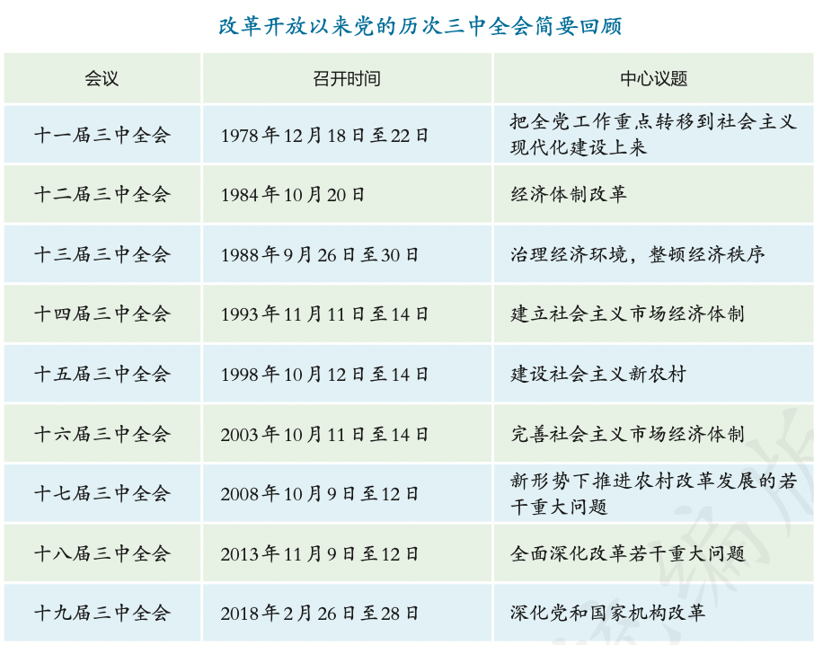
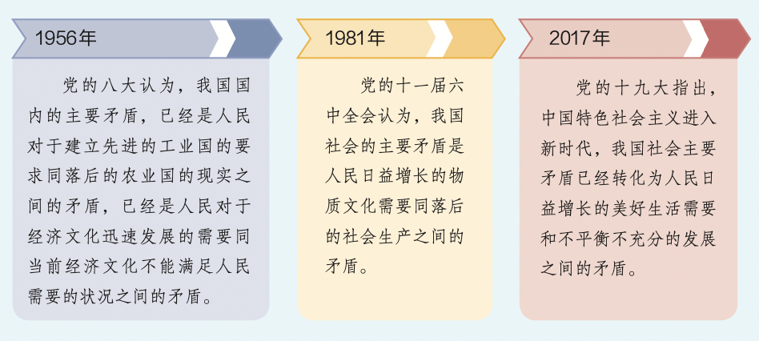
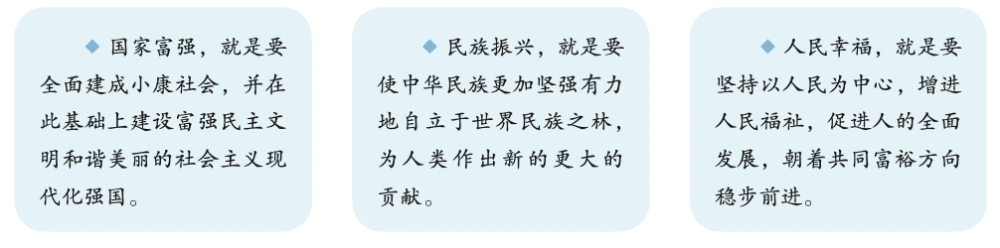

# 【中国特色社会主义】概述

`2023/08/15 05:36:01  by: 程序员·小李`

#### 阶级社会的发展

资本主义生产关系的建立条件：一是有大量出卖劳动力的人；二是有大量货币资本。

>资本主义发展到一定阶段，会发生以`生产过剩`为基本特征的经济危机
>
>直接原因是:`生产无限扩大`的趋势与劳动人民`有支付能力的需求相对缩小`之间的矛盾，以及`个别企业内部生产的有组织性与整个社会生产的无政府状态之间的矛盾`。
>
>根本原因：`生产社会化和生产资料私有之间的矛盾`。

资本主义基本矛盾是`生产力与生产关系`之间的矛盾，是资本主义社会一切矛盾和冲突的总根源。

---

社会主义社会

> **思想来源**：`空想社会主义`
> 
> **历史现实**：十九世纪三四十年代，先后爆发了`法国里昂工人起义`、`英国宪章运动`、`德意志西里西亚纺织工人起义`。工人阶级开始作为独立的政治力量登上历史舞台，反抗资产阶级统治。
> 
> **历史前提**：`资本主义的发展和工人运动的兴起`

>马克思、恩格斯批判吸收了`德国古典哲学`，创立了**唯物史观**
>
>马克思批判继承了`英国古典政治经济学`，创立了**剩余价值学说**，揭示了`剩余价值的来源`，揭示了`资本家剥削工人、占有工人剩余劳动的秘密`，揭示了`无产阶级与资产阶级利益的根本对立`，找到了变革资本主义社会的坚定力量，为无产阶级的斗争指明了方向。

>1848年《共产党宣言》发表，标志着科学社会主义的诞生。
>* 《共产党宣言》分析了资本主义生产方式的内在矛盾与人类社会的发展规律，科学论证了资本主义必然灭亡和社会主义必然胜利的历史必然性。
>* 《共产党宣言》总结了工人运动的经验和教训，第一次系统论述了无产阶级政党的性质、特点、任务和策略原则，阐明了建立无产阶级政党的必要性。共产党是代表无产阶级的政党，是无产阶级先锋队。共产党只代表整个无产阶级的根本利益。无产阶级只有在共产党的领导下，才能有组织地进行斗争，团结绝大多数人，推翻资产阶级的统治，建立无产阶级政权，继续发展社会生产力，使全体社会成员全面发展，从而为建立共产主义新社会创造必要条件。
>* 《共产党宣言》阐述了未来共产主义社会的理想目标。《共产党宣言》指出:“在那里，`每个人的自由发展`是一切人的自由发展的条件。”。

>◆ 马克思主义是`科学`的理论，创造性地揭示了人类社会发展规律。
>
>◆ 马克思主义是`人民`的理论，第一次创立了人民实现自身解放的思想体系。
>
>◆ 马克思主义是`实践`的理论，指引着人民改造世界的行动。
>
>◆ 马克思主义是`不断发展的开放的`理论，始终站在时代前沿。

#### 俄国十月革命

1917年，俄国爆发了`十月革命`，俄国无产阶级通过革命斗争推翻了资产阶级的统治，建立了无产阶级政权，确立了社会主义生产关系。

社会主义生产关系的特点是:`劳动者共同占有生产资料`；消灭剥削制度，建立起`互助合作`的关系；个人消费品实行`按劳分配`。十月革命建立了世界上`第一个社会主义国家`，实现了社会主义从理论、运动到实践、制度的伟大跨越。

#### 新民主主义革命

1921年，中国共产党成立。探索出一条`农村包围城市、武装夺取政权`的新民主主义革命道路。

 

🔥 新民主主义革命是`无产阶级领导`的，`工农联盟`为基础的，`人民大众的`，反对`帝国主义、封建主义和官僚资本主义`的民主革命。中国半殖民地半封建社会的基本国情，决定了中国革命必须分为`民主革命和社会主义革命`两个步骤。新民主主义革命是社会主义革命的必要准备，社会主义革命是新民主主义革命的必然趋势。

> 新民主主义革命的“新”主要体现在三个方面:一是就`领导权`来说，新民主主义革命是由`无产阶级领导`；二是就`革命前途`来说，是建立无产阶级领导下的各革命阶级的联合专政，并最终过渡到`社会主义`社会；三是就所属世界革命范畴来说，它是`无产阶级革命`的一部分。

新中国的成立，彻底结束了旧中国半殖民地半封建社会的历史，彻底结束了极少数剥削者统治广大劳动人民的历史，彻底废除了列强强加给中国的不平等条约和帝国主义在中国的一切特权，实现了中国从几千年封建 专制政治向人民民主的伟大飞跃。

 

#### 社会主义制度确立

🔥 从新中国成立到`社会主义改造基本完成`，这是一个过渡时期。总路线和总任务是一化三改：社会主义工业化，农业、手工业、资本主义工商业的社会主义改造

🔥 1956年，社会主义改造取得胜利，标志着我国进入了社会主义社会。

中共八大是新中国成立后，党的第一次全国代表大会。党的八大指出，社会主义改造完成后，我国社会的主要矛盾已经不再是无产阶级同资产阶级之间的矛盾，而是`人民对于建立先进的工业国的要求同落后的农业国的现实之间的矛盾`，是`人民对于经济文化迅速发展的需要同当前经济文化不能满足人民需要的状况之间的矛盾`。因此，党和全国人民的主要任务是`集中力量发展社会生产力`，尽快把我国由落后的农业国变为先进的工业国。

>◆ 1956年4月，毛泽东发表《论十大关系》，初步总结了我国社会主义建设的经验，提出了探索适合中国国情的社会主义建设道路的任务。
>
>◆ 1957年2月，毛泽东发表《关于正确处理人民内部矛盾的问题》，创造性地论述了社会主义社会矛盾的学说，提出把`正确处理人民内部矛盾`作为国家政治生活的主题，严格区分和正确处理`社会主义社会的敌我矛盾和人民内部矛盾`两类不同性质的矛盾，并确立了处理人民内部矛盾的指导方针。

毛泽东思想是马克思列宁主义在中国的创造性运用和发展，是被实践证明了的关于`中国革命和建设`的正确的理论原则和经验总结，是马克思主义中国化的`第一次`飞跃。

#### 改革开放

1978年`十一届三中全会`重新确立了马克思主义的思想路线、政治路线和组织路线，开启了`改革开放`和社会主义现代化建设新时期，实现了新中国成立以来党的历史上具有深远意义的伟大转折。

> `农村改革`率先取得突破，`家庭联产承包责任`制得以推行。
>
>🔥 1984年，党的十二届三中全会召开，标志着中国改革重点从`农村转向城市`，企业改革迈出重要步伐。
>
>🔥 1980 年，党和国家批准在`深圳、珠海、汕头、厦门`设置经济特区。
>
>🔥 1984 年，开放了`大连、青岛`等14个沿海港口城市。
>
>1988年，设立海南省，建立`海南经济特区`。
>
>1990年，开发开放`上海浦东`。 
>
>1992年，开放沿长江的5个城市。之后，又开放17个内陆省会城市，同时从东北、西北到西南开放了一系列沿边城市，我国`全方位、多层次、宽领域`的对外开放格局基本形成。

> 邓小平指出:“改革是中国的第二次革命”，“改革是一场解放生产力的革命”，“改革是社会主义制度的`自我完善`”。

>以1992年邓小平`南方谈话`和党的`十四大`明确建立`社会主义市场经济体制`目标为标志，改革开放和社会主义现代化建设进入一个新的阶段。
>
>1993年召开的党的`十四届三中全会`就建立社会主义市场经济体制进行部署，此后改革重点围绕`社会主义市场经济体制的建立和完善`展开。
>
>2001年，我国成功加入世界贸易组织，标志着我国对外开放进入了一个新的阶段。
>
>2003年召开的党的`十六届三中全会`围绕`完善社会主义市场经济体制`进行了部署。
>
>2013年召开的党的`十八届三中全会`作出`全面深化改革`的重要部署，提出要使市场在资源配置中起决定性作用和更好发挥政府作用，全面深化改革取得重大突破。
>
>2013年设立中国(上海)自由贸易试验区。
>
>2017年，党的`十九大`提出形成`全面对外开放新格局`。
>
>2018年，党的`十九届三中全会`作出`深化党和国家机构改革`的部署。
>
>2019年，党的`十九届四中全会`专题研究了`坚持和完善中国特色社会主义制度、推进国家治理体系和治理能力现代化问题`。
>
>2020年，党的`十九届五中全会`审议通过了`《中共中央关于制定国民经济和社会发展第十四个五年规划和二〇三五年远景目标的建议》`。
>
>2021年，`《中华人民共和国国民经济和社会发展第十四个五年规划和2035年远景目标纲要》`对全面深化改革和实行高水平对外开放作出部署。这使得改革开放向纵深推进，推动经济社会发展取得历史性伟大成就。

改革开放极大改变了中国的面貌。中华民族迎来了从站起来、富起来到强起来的伟大飞跃，中国特色社会主义迎来了从创立、发展到完善的伟大飞跃，中国人民迎来了从温饱不足到小康富裕的伟大飞跃。

`改革开放`是党和人民大踏步赶上时代的重要法宝，是坚持和发展中国特色社会主义的`必由之路`，是决定当代中国命运的`关键一招`，也是决定实现“两个一百年”奋斗目标、实现中华民族伟大复兴的`关键一招`。对外开放是中国的基本国策。改革开放只有进行时，没有完成时。

#### 中国特色社会主义建立

十一届三中全会以后，`围绕什么是社会主义、怎样建设社会主义`问题，创立了`邓小平理论`，解放思想，实事求是，党和国家工作中心转移到`经济建设`上来、`实行改革开放`，深刻揭示社会主义本质，确立社会主义初级阶段基本路线，明确建设中国特色社会主义，科学回答了建设中国特色社会主义的一系列基本问题，制定了到二十一世纪中叶`分三步走`、基本实现社会主义现代化的发展战略，成功开创了中国特色社会主义。

1982年`十二大`，邓小平提出`建设有中国特色的社会主义`。

> 坚持以`经济建设`为中心，坚持`四项基本原则`，坚持`改革开放`，制定社会主义初级阶段基本路线;
>
>正确认识我国所处的发展阶段和根本任务，制定`“三步走”`发展战略;
>
>展开各方面体制改革，实现全方位多层次宽领域的`对外开放`;
>
>“两手抓、两手都要硬”，抓好`精神文明建设和民主法制建设`，实现社会全面进步;
>
>深刻`揭示社会主义本质`，把人们对社会主义的认识提高到新的科学水平;
>
>强调加强党的领导必须`改善党的领导`，必须聚精会神抓党的建设，使党的建设充满新的生机活力，逐步形成了建设中国特色社会主义的路线、方针、政策，阐明了在中国建设、巩固和发展社会主义的基本问题，科学回答了建设中国特色社会主义的一系列基本问题。

`十三届四中全会`以后，加深了建设什么样的党、怎样建设党的认识，形成了`“三个代表”`重要思想，确立了社会主义市场经济体制的改革目标和基本框架，确立了社会主义初级阶段公有制为主体、多种所有制经济共同发展的`基本经济制度`和按劳分配为主体、多种分配方式并存的`分配制度`，开创全面改革开放新局面。

> **三个代表**
>
> 代表中国`先进生产力的发展要求`，代表中国`先进文化的前进方向`，代表中国`最广大人民的根本利益`。
>
>“三个代表”是党的`立党之本、执政之基、力量之源`。

>贯彻“三个代表”，关键是`与时俱进`，核心是`坚持党的先进性`，本质是`执政为民`。

十六大以后，以`胡锦涛`同志为主要代表的中国共产党人，在全面建设小康社会进程中推进`实践创新、理论创新、制度创新`，深刻认识和回答了新形势下`实现什么样的发展、怎样发展`等重大问题，形成了`科学发展观`，抓住重要战略机遇期，聚精会神搞建设，一心一意谋发展，强调坚持`以人为本、全面协调可持续发展`，着力保障和改善民生，促进社会公平正义，推进党的执政能力建设和先进性建设，成功在新形势下坚持和发展了中国特色社会主义。

> 科学发展观，第一要义是`发展`，核心是`以人为本`，基本要求是`全面协调可持续`，根本方法是`统筹兼顾`。

十八大以来，以`习近平`同志为主要代表的中国共产党人，坚持把马克思主义基本原理同中国具体实际相结合、同中华优秀传统文化相结合，坚持毛泽东思想、邓小平理论、“三个代表”重要思想、科学发展观，深刻总结并充分运用党成立以来的历史经验，从新的实际出发，创立了习近平新时代中国特色社会主义思想，推动党和国家事业取得历史性成就、发生历史性变革，中国特色社会主义进入了新时代。

中国特色社会主义道路，就是在党的领导下，立足基本国情，以经济建设为中心，坚持四项基本原则，坚持改革开放，解放和发展社会生产力，建设社会主义市场经济、社会主义民主政治、社会主义先进文化、社会主义和谐社会、社会主义生态文明，促进人的全面发展，逐步实现全体人民共同富裕，建设富强民主文明和谐美丽的社会主义现代化强国。

中国特色社会主义理论体系，从新的实践和时代特征出发坚持和发展马克思主义，科学回答了建设中国特色社会主义的发展道路、发展阶段、根本任务、发展动力、发展战略、政治保证、祖国统一、外交和国际战略、领导力量和依靠力量等一系列基本问题， 实现了马克思主义中国化新的飞跃。

我国国家治理体系和治理能力是中国特色社会主义制度及其执行能力的集中体现。制度优势是一个国家的最大优势，制度竞争是国家间最根本的竞争。中国特色社会主义制度和国家治理体系是以马克思主义为指导、植根中国大地、具有深厚中华文化根基、深得人民拥护的制度和治理体系，是具有强大生命力和巨大优越性的制度和治理体系，是能够持续推动拥有十四亿多人口大国进步和发展、确保拥有五千多年文明史的中华民族实现“两个一百年”奋斗目标进而实现伟大复兴的制度和治理体系。

中国特色社会主义文化，源自于中华民族五千多年文明历史所孕育的中华优秀传统文化，熔铸于党领导人民在革命、建设、改革中创造的革命文化和社会主义先进文化，植根于中国特色社会主义伟大实践。发展中国特色社会主义文化，就是以马克思主义为指导，坚守中华文化立场，立足当代中国现实，结合当今时代条件，发展`面向现代化、面向世界、面向未来`的，`民族的、科学的、大众的`社会主义文化，推动社会主义`精神文明和物质文明`协调发展。

在当代中国，坚持和发展中国特色社会主义，就是真正坚持社会主义。我们要始终高举中国特色社会主义伟大旗帜，坚定道路自信、理论自信、制度自信、文化自信。

#### 新时代

新时代是承前启后、继往开来、在新的历史条件下继续夺取中国特色社会主义伟大胜利的时代，是决胜全面建成小康社会、进而全面建设社会主义现代化强国的时代，是全国各族人民团结奋斗、不断创造美好生活、逐步实现全体人民共同富裕的时代，是全体中华儿女勠力同心、奋力实现中华民族伟大复兴中国梦的时代，是我国不断为人类作出更大贡献的时代。

> 进入新时代，
> 
> 意味着中华民族迎来了从站起来、富起来到强起来的伟大飞跃，迎来了实现中华民族伟大复兴的光明前景;
> 
> 意味着科学社会主义在二十一世纪的中国焕发出强大生机活力，在世界上高高举起了中国特色社会主义伟大旗帜;
> 
> 意味着中国特色社会主义道路、理论、制度、文化不断发展，拓展了发展中国家走向现代化的途径，给世界上那些既希望加快发展又希望保持自身独立性的国家和民族提供了全新选择，为解决人类问题贡献了中国智慧和中国方案。

党的十九大提出，我国社会主要矛盾已经转化为人民日益增长的美好生活需要和不平衡不充分的发展之间的矛盾。

我国社会主义初级阶段的`基本国情没有变`，我国是世界最大发展中国家的`国际地位没有变`。要牢牢把握社会主义初级阶段基本国情，牢牢立足社会主义初级阶段这个最大实际，牢牢`坚持党的基本路线`。

> ◆ 十三大报告:“我国正处在社会主义的初级阶段，包括两层含义。第一，我国`已经是`社会主义社会。第二，我国的社会主义社会`还处在初级阶段`。我们必须从这个实际出发，而不能超越这个阶段。”
>
>◆ 十五大报告:“社会主义初级阶段，是逐步摆脱不发达状态，基本实现社会主义现代化的历史阶段;是由农业人口占很大比重、主要依靠手工劳动的农业国，逐步转变为非农业人口占多数、包含现代农业和现代服务业的工业化国家的历史阶段;是由自然经济半自然经济占很大比重，逐步转变为经济市场化程度较高的历史阶段;是由文盲半文盲人口占很大比重、科技教育文化落后，逐步转变为科技教育文化比较发达的历史阶段;是由贫困人口占很大比重、人民生活水平比较低，逐步转变为全体人民比较富裕的历史阶段;是由地区经济文化很不平衡，通过有先有后的发展，逐步缩小差距的历史阶段;是通过改革和探索，建立和完善比较成熟的充满活力的社会主义市场经济体制、社会主义民主政治体制和其他方面体制的历史阶段;是广大人民牢固树立建设有中国特色社会主义共同理想，自强不息，锐意进取，艰苦奋斗，勤俭建国，在建设物质文明的同时努力建设精神文明的历史阶段;是逐步缩小同世界先进水平的差距，在社会主义基础上实现中华民族伟大复兴的历史阶段。”

> 党的十九届四中全会指出，坚持和完善中国特色社会主义制度、推进国家治理体系和治理能力现代化，要坚持和完善`党的领导`制度体系，提高党`科学执政、民主执政、依法执政`水平;坚持和完善人民当家作主制度体系，发展社会主义`民主政治`;坚持和完善中国特色社会主义`法治体系`，提高党`依法治国、依法执政`能力;坚持和完善中国特色社会主义行政体制，构建职责明确、依法行政的政府治理体系;坚持和完善社会主义基本经济制度，推动经济高质量发展;坚持和完善繁荣发展社会主义先进文化的制度，巩固全体人民团结奋斗的共同思想基础;坚持和完善统筹城乡的民生保障制度，满足人民日益增长的美好生活需要;坚持和完善共建共治共享的社会治理制度，保持社会稳定、维护国家安全;坚持和完善生态文明制度体系，促进人与自然和谐共生;坚持和完善党对人民军队的绝对领导制度，确保人民军队忠实履行新时代使命任务;坚持和完善“一国两制”制度体系，推进祖国和平统一;坚持和完善独立自主的和平外交政策，推动构建人类命运共同体;坚持和完善党和国家监督体系，强化对权力运行的制约和监督;加强党对坚持和完善中国特色社会主义制度、推进国家治理体系和治理能力现代化的领导。

习近平新时代中国特色社会主义思想，是时代的产物，是党和人民实践经验和集体智慧的结晶，实现了马克思主义中国化新的飞跃。世界多极化、经济全球化、社会信息化、文化多样化深入发展，全球治理体系和国际秩序 变革加速推进，新兴市场国家和发展中国家快速崛起，国际力量对比更趋均衡，世界各国人民的命运从未像今天这样紧紧相连。同时，世界面临的不稳定性不确定性突出，世界经济增长乏力，贸易保护主义、孤立主义、民粹主义等思潮不断抬头，贫富分化日益严重，地区热点问题此起彼伏，恐怖主义、网络安全、重大传染性疾病、气候变化等非传统安全威胁持续蔓延。习近平新时代中国特色社会主义思想，正是在`把握世界发展大势、应对全球共同挑战、维护人类共同利益`的过程中创立并不断丰富发展的。

我们党在带领人民进行伟大社会革命的同时，不断进行伟大自我革命，这是我们党不断从胜利走向新的胜利的关键所在。习近平新时代中国特色社会主义思想，正是在不断推进党的自我革命，实现党`自我净化、自我完善、自我革新、自我提高`的过程中创立并不断丰富发展的。习近平新时代中国特色社会主义思想，正是在`对科学社会主义理论与实践的深邃思考、深刻总结`，对`坚持和发展中国特色社会主义的不懈探索、砥砺前行`中创立并不断丰富发展的。

习近平新时代中国特色社会主义思想内容十分丰富，涵盖改革发展稳定、内政外交国防、治党治国治军等各个领域、各个方面，核心内容是“十个明确”和“十四个坚持”。

>“十个明确”：
>* 明确中国特色社会主义`最本质的特征`是中国共产党领导，中国特色社会主义制度的最大优势是`中国共产党领导`， 中国共产党是最高政治领导力量，全党必须增强“四个意识”、坚定“四个自信”、做到“两个维护”;
>* 明确坚持和发展中国特色社会主义，总任务是实现`社会主义现代化和中华民族伟大复兴`，在全面建成小康社会的基础上，分两步走在本世纪中叶建成`富强民主文明和谐美丽`的社会主义现代化强国，以中国式现代化推进中华民族伟大复兴;
>* 明确新时代我国社会`主要矛盾`是人民日益增长的美好生活需要和不平衡不充分的发展之间的矛盾，必须坚持以人民为中心的发展思想，发展全过程人民民主，推动人的全面发展、全体人民共同富裕取得更为明显的实质性进展;
>* 明确中国特色社会主义事业总体布局是`经济建设、政治建设、文化建设、社会建设、生态文明建设`五位一体，战略布局是`全面建设社会主义现代化国家、全面深化改革、全面依法治国、全面从严治党`四个全面;
>* 明确全面深化改革总目标是`完善和发展中国特色社会主义制度、推进国家治理体系和治理能力现代化`;
>* 明确全面推进依法治国总目标是`建设中国特色社会主义法治体系、建设社会主义法治国家`;
>* 明确必须坚持和完善社会主义基本经济制度，使市场在资源配置中起决定性作用，更好发挥政府作用，把握新发展阶段，贯彻`创新、协调、绿色、开放、共享`的新发展理念，加快构建以国内大循环为主体、国内国际双循环 相互促进的新发展格局，推动高质量发展，统筹发展和安全;
>* 明确党在新时代的强军目标是建设一支`听党指挥、能打胜仗、作风优良`的人民军队，把人民军队建设成为世界一流军队;
>* 明确中国特色大国外交要服务民族复兴、促进人类进步，推动建设新型国际关系，推动构建`人类命运共同体`;
>* 明确全面从严治党的战略方针，提出新时代党的建设总要求，全面推进党的`政治建设、思想建设、组织建 设、作风建设、纪律建设`，把制度建设贯穿其中，深入推进反腐败斗争，落实管党治党政治责任，以伟大自我革命引领伟大社会革命。

“十个明确”是最为核心关键的组成部分，是支撑习近平新时代中国特色社会主义思想的“四梁八柱”。“十个明确”中的每一个“明确”都是具有原创性的新思想新观点，集中反映着我们党对科学社会主义在当今时代的理论思考和理论贡献。

>党的十九大提出并概括了新时代坚持和发展中国特色社会主义的基本方略，即“十四个坚持”，
>* 坚持党对一切工作的领导; 
>* 坚持以人民为中心;
>* 坚持全面深化改革;
>* 坚持新发展理念;
>* 坚持人民当家作主;
>* 坚持全面依法治国;
>* 坚持社会主义核心价值体系;
>* 坚持在发展中保障和改善民生;
>* 坚持人与自然和谐共生;
>* 坚持总体国家安全观;
>* 坚持党对人民军队的绝对领导;
>* 坚持“一国两制”和推进祖国统一;
>* 坚持推动构建人类命运共同体;
>* 坚持全面从严治党。 

党的十九大提出，必须全面贯彻党的基本理论、基本路线、基本方略，更好引领党和人民事业发展。

“十四个坚持”的基本方略，涵盖坚持党的领导和“五位一体”总体布局、“四个全面”战略布局，涵盖国防和军队建设、维护国家安全、对外战略，是对党的治国理政重大方针、原则的最新概括，是实现“两个一百年”奋斗目标、实现中华民族伟大复兴中国梦的“路线图”和“方法论”。

习近平新时代中国特色社会主义思想是当代中国马克思主义、二十一世纪马克思主义，是中华文化和中国精神的时代精华，实现了马克思主义中国化新的飞跃。在当代中国，坚持和发展习近平新时代中国特色社会主义思想，就是真正坚持和发展马克思主义，就是真正坚持和发展科学社会主义。必须高举马克思主义、中国特色社会主义伟大旗帜不动摇，必须坚持习近平新时代中国特色社会主义思想指导地位不动摇!

四个意识：政治意识、大局意识、核心意识、看齐意识。

四个自信：道路自信、理论自信、制度自信、文化自信。

两个维护：坚决维护习近平总书记党中央的核心、全党的核心地位，坚决维护党中央权威和集中统一领导。

两个确立：确立习近平同志党中央的核心、全党的核心地位，确立习近平新时代中国特色社会主义思想的指导地位。

#### 中国梦

中国梦就是要实现`国家富强、民族振兴、人民幸福`。

中国梦是`人民的梦`，必须紧紧依靠人民来实现，必须不断为人民造福。人民是中国梦的主体，是中国梦的创造者和享有者。中国梦的深厚源泉在于人民，根本归宿也在于人民，只有同人民对美好生活的向往结合起来才能取得成功。

中国梦是`国家的梦、民族的梦`，也是`每一个中华儿女的梦`。中国梦就是要让每个人获得发展自我和奉献社会的机会，共同享有人生出彩的机会，共同享有梦想成真的机会，共同享有同祖国和时代一起成长与进步的机会。只要每个人都把人生理想融入国家和民族的伟大梦想之中，把小我融入大我，敢于有梦、勇于追梦、勤于圆梦，就会汇聚起实现中国梦的强大力量。中国梦是中国人民追求幸福的梦，也同世界人民的梦想息息相通。中国一心一意办好自己的事情，实现国家发展和稳定，既是对自己负责，也是为世界作贡献。中国将同国际社会一道，推动实现持久和平、共同繁荣的世界梦，为人类和平与发展的崇高事 业作出新的更大的贡献!

实现中华民族伟大复兴的历史使命，必须进行伟大斗争、建设伟大工程、推进伟大事业。实现伟大梦想，必须进行伟大斗争。中国共产党要团结带领人民有效应对重大挑战、抵御重大风险、克服重大阻力、解决重大矛盾，必须进行具有许多新的历史特点的伟大斗争。要充分认识这场伟大斗争的长期性、复杂性、艰巨性，发扬斗争精神，提高斗争本领，不断夺取伟大斗争新胜利。

实现伟大梦想，必须`深入推进党的建设`新的伟大工程。中国共产党要始终成为时代先锋、民族脊梁，始终成为马克思主义执政党，自身必须始终过硬。中国共产党要不断增强政治领导力、思想引领力、群众组织力、社会号召力，以永葆旺盛生命力和强大战斗力。

实现伟大梦想，必须`推进中国特色社会主义伟大事业`。坚持和发展中国特色社会主义是改革开放以来党的全部理论和实践的主题。我们要更加自觉地增强道路自信、理论自信、制度自信、文化自信，既不走封闭僵化的老路，也不走改旗易帜的邪路，保持政治定力，坚持实干兴邦，始终坚持和发展中国特色社会主义。

伟大斗争，伟大工程，伟大事业，伟大梦想，紧密联系、相互贯通、相互作用，其中起决定性作用的是党的建设新的伟大工程。推进伟大工程，要结合伟大斗争、伟大事业、伟大梦想的实践来进行，确保党在世界形势深刻变化的历史进程中始终走在时代前列，在应对国内外各种风险和考验的历史进程中始终成为全国人民的主心骨，在 坚持和发展中国特色社会主义的历史进程中始终成为坚强领导核心。

> 十九大明确了新时代中国特色社会主义发展的战略安排。
> 
> 第一个阶段，从2020年到2035年，在全面建成小康社会的基础上，再奋斗十五年，基本实现社会主义现代化。
> 
> 第二个阶段，从2035年到本世纪中叶，在基本实现现代化的基础上，再奋斗十五年，把我国建成富强民主文明和谐美丽的社会主义现代化强国。

要贯彻新发展理念，建设现代化经济体系;健全人民当家作主制度体系，发展社会主义民主政治;坚定文化自信，推动社会主义文化繁荣兴盛;提高保障和改善民生水平，加强和创新社会治理;加快生态文明体制改革，建设美丽中国;坚持走中国特色强军之路，全面推进国防和军队现代化;坚持“一国两制”，推进祖国统一;坚持和平发展道路，推动构建人类命运共同体;坚定不移全面从严治党，不断提高党的执政能力和领导水平。机遇千载难逢，机遇稍纵即逝，要抓住大有可为的历史机遇期。新时代历史机遇期，是中华民族强起来、实现伟大复兴的机遇，是中国特色社会主义道路、理论、制度、文化更加成熟、更具引领力感召力的机遇，是中国人民创造美好生活、走向共同富裕的机遇，是中国共产党从建党百年迈向执政百年、进而铸就千秋伟业的机遇。只有紧紧抓住这个大有可为的历史机遇期，锐意进取、埋头苦干、善于创新、永不懈怠，才能不负时代的要求、历史的期待。

一百多年来，党领导人民进行伟大奋斗，积累了宝贵的历史经验，这就是:坚持党的领导，坚持人民至上，坚持理论创新，坚持独立自主，坚持中国道路，坚持胸怀天下，坚持开拓创新，坚持敢于斗争，坚持统一战线，坚持自我革命。以上十个方面，是经过长期实践积累的宝贵经验，是党和人民共同创造的精神财富，必须倍加珍惜、长期坚持，并在新时代实践中不断丰富和发展。

青年兴则国家兴，青年强则国家强。青年一代有理想、有本领、有担当，国家就有前途，民族就有希望。中国梦是历史的、现实的，也是未来的。中华民族伟大复兴的中国梦终将在一代代青年的接力奋斗中变为现实。广大青年要坚定理想信念，志存高远，脚踏实地，勇做时代的弄潮儿，在实现中国梦的生动实践中放飞青春梦想，在为人民利益的不懈奋斗中书写人生华章!