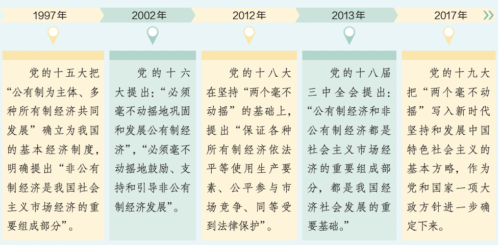
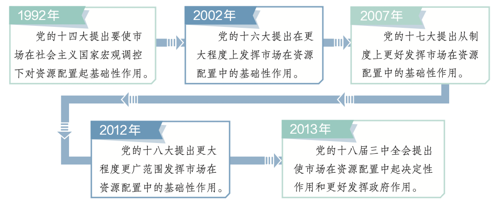
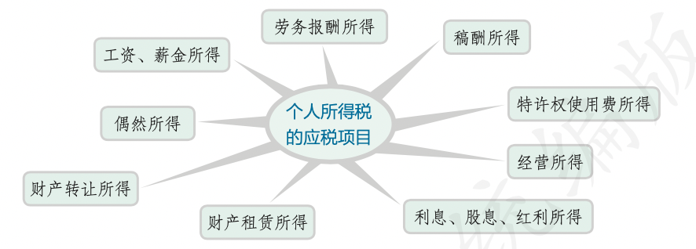

# 【中国特色社会主义经济】概述

`2023/08/15 08:48:38  by: 程序员·小李`

#### 生产资料所有制

**劳动**是物质财富的源泉，是价值的`唯一源泉`；生产资料是创造物质财富和价值的条件。**生产资料所有制**在生产关系中起着`决定性作用`，是生产关系的核心，是经济制度的基础。占支配地位的生产资料所有制决定着一个社会的基本性质和发展方向。

> **公有制为主体、多种所有制经济共同发展**
> 
> * 这是中国特色社会主义制度的`重要支柱`，体现了中国特色社会主义制度的优越性。
> * 这是社会主义初级阶段经济制度的`根本特征`。公有制经济为国家建设、国防安全、人民生活改善作出了突出贡献，是社会主义经济制度的基础。
> * 这是促进生产力发展的`根本要求`。以公有制为主体是实现共同富裕的基本前提。

> 公有制的主体地位主要体现在:
> * 公有资产在社会总资产中占优势;（要有量的优势，更要注重质的提高）
> * 国有经济控制国民经济命脉，对经济发展起主导作用。

> 🔥 `公有制占主体`，`共同富裕`，是我们所必须坚持的社会主义的根本原则。
>
>🔥 社会主义的本质，是`解放生产力，发展生产力，消灭剥削，消除两极分化，最终达到共同富裕。`

国有经济起主导作用，主要体现在`控制力`上。对关系国民经济命脉的重要行业和关键领域，国有经济必须占支配地位。在其他领域，可以通过资产重组和结构调整，以加强重点，提高国有资产的整体质量。`国有企业`是国有经济最主要的实现形式，是中国特色社会主义的重要物质基础和政治基础，是推进国家现代化、保障人民共同利益的重要力量，是我们党执政兴国的重要支柱和依靠力量。

在我国现阶段，非公有制经济包括`个体经济、私营经济、港澳台投资经济、外商投资经济以及混合所有制经济中的非国有成分和非集体成分`。个体经济是指生产资料归劳动者个人所有，并由劳动者个人支配和使用的一种非公有制经济形式。私营经济是指企业资产属于私人所有、存在雇佣劳动关系的一种非公有制经济形式。外商投资经济是指外国投资者根据我国法律法规在我国境内设立的独资企业以及中外共同设立企业的外商投资部分。港澳台地区在内地(大陆) 的投资参照外商投资。

非公有制经济是社会主义市场经济的重要组成部分。改革开放以来，非公有制经济不断发展壮大，成为稳定经济增长和改善民生的重要力量、创业就业的主要领域、技术创新的重要主体、国家税收的重要来源，为我国社会主义市场经济发展、政府职能转变、农村富余劳动力转移、国际市场开拓等发挥了重要作用。

在社会主义初级阶段，多种所有制经济共同发展，有利于发挥各种所有制的长处，调动不同经济主体的积极性和创造性，有效利用各方面的资源，取长补短，激发社会主义市场经济的活力，推动经济持续健康发展。

毫不动摇巩固和发展公有制经济，必须发展壮大国有经济。

>发展壮大国有经济，要以解放和发展社会生产力为标准，以提高国有资本效率、增强国有企业活力为中心，全面推进依法治企，坚持党对国有企业的全面领导，做强做优做大国有资本和国有企业，不断增强国有经济竞争力、创新力、控制力、影响力、抗风险 能力。
>
>发展壮大国有经济，要推进国有经济布局优化和结构调整。推动国有经济进一步聚焦战略安全、产业引领、国计民生、公共服务等功能，向关系国家安全、国民经济命脉的重要行业集中，向提供公共服务、应急能力建设和公益性等关系国计民生的重要行业集中，向前瞻性战略性新兴产业集中。
>
>发展壮大国有经济，要探索公有制多种实现形式，发展国有资本、集体资本、非公有资本等交叉持股、相互融合的混合所有制经济，积极稳妥推进国有企业混合所有制改革，规范有序发展混合所有制经济。混合所有制经济通常采用的是股份制形式。

毫不动摇巩固和发展公有制经济，必须发展壮大农村集体经济。发展壮大农村集体经济，要深化农村集体产权制度改革，保障农民财产权益。发展壮大农村集体经济，要完善农村基本经营制度，培育新型农业经营主体，健全农业社会化服务体系，建立符合市场经济要求 的集体经济运行机制。

改革开放以来，我国非公有制经济是在坚持公有制主体地位和发挥国有经济主导作用的前提下，在党和国家方针政策的鼓励和支持下发展起来的，是推动经济社会发展的重要力量。因此，必须毫不动摇鼓励、支持、引导非公有制经济发展。鼓励、支持、引导非公有制经济发展，要培育更多充满活力的市场主体，营造支持非公有制经济高质量发展的制度环境;营造各种所有制主体依法平等使用资源要素、公开公平公正参与竞争、同等受到法律保护的市场环境;要健全支持非公有制经济发展的法治环境，贯彻落实包括市场准入、企业融资等在内的促进非公有制经济健康发展的各项政策措施，形成促进非公有制经济发展的良 好环境和社会氛围。

>鼓励、支持、引导非公有制经济发展，要支持和帮助非公有制企业提高企业管理水平，完善管理体制机制，提高生产技术水平和研发能力，从而不断提高企业的效率和市场竞争力。
>
>鼓励、支持、引导非公有制经济发展，要促进非公有制经济人士健康成长，推动非公有制经济人士做合格的中国特色社会主义事业建设者。非公有制经济人士要坚持爱国敬业，坚持守法经营、诚信经营，构建亲清政商关系，坚持回报社会、积极承担社会责任，树立企业的良好社会形象。

新时代坚持和发展中国特色社会主义，必须坚持和完善我国社会主义基本经济制度，毫不动摇巩固和发展公有制经济，毫不动摇鼓励、支持、引导非公有制经济发展。  

#### 我国社会主义市场经济

`计划和市场`是配置资源的两种基本手段。如果计划在资源配置中起决定性作用，就是计划经济体制;如果市场在资源配置中起决定性作用，就是市场经济体制。

`市场决定资源配置`是市场经济的一般规律。市场经济主要通过`价格、供求、竞争`等机制来调节。市场机制就像一只“看不见的手”，引导和调节着资源在全社会的配置。市场价格及其波动，能够`反映供求状况及其变化`，市场供求的变化`也会影响市场价格`。市场竞争能够引导资源流向效率高的领域和企业，推动科学技术和经营管理进步，实现`优胜劣汰`。

`统一开放、竞争有序`的市场体系，是使市场在资源配置中起决定性作用的基础。要加快形成企业`自主经营、公平竞争`，消费者`自由选择、自主消费`，商品和要素自由流动、平等交换的现代市场体系，提高资源配置效率和公平性。建设现代市场体系要建立`公平、开放、透明`的市场规则。要完善公平竞争制度，强化竞争政策基础地位，落实公平竞争审查制度，加强和改进反垄断和反不正当竞争执法;要建立健全社会征信体系，褒扬诚信，惩戒失信;要健全优胜劣汰市场化退出机制，从而实现市场准入畅通、市场开放有序、市场竞争充分、市场秩序规范。

>1. 能由市场形成价格的都交给市场，政府不进行干预。政府定价主要限定在重要`公用事业、公益性服务、网络型自然垄断环节`等方面。政府定价要提高透明度，接受社会监督。
>
>2. 市场调节`不是万能的`。国防、治安、消防等公共物品；枪支、弹药、爆炸物等特殊物品；教育、医疗等与民生息息相关的重要服务不能完全由市场来调节，否则就不能保障国家安全、人民生命财产安全和人民生活，严重影响社会安定。

>市场调节有局限性，它存在着`自发性、盲目性、滞后性`等弊病。
>* 自发性：在市场经济中，为了自身不正当利益和眼前利益，生产经营者可能会损害社会的公共利益和长远利益，甚至可能会损害国家利益。
>* 盲目性：由于生产经营者不可能完全和及时掌握市场上所有的信息，因而其决策必然带有一定的盲目性。
>* 滞后性：由于从价格形成、价格信号传递到生产的调整有一定的时间差，市场调节往往具有滞后性。
>
>总之，单靠市场调节，会影响资源配置效率，导致资源浪费；导致经济运行大起大落，社会经济不稳定；产生不正当竞争、垄断，损害社会公平；会导致收入差距拉大。

>**党的领导是中国特色社会主义最本质的特征**和中国特色社会主义制度的`最大优势`。坚持党的领导，发挥党`总揽全局、协调各方`的领导核心，是我国社会主义市场经济体制的一个`重要特征`。
>
>**实现共同富裕是社会主义市场经济体制的根本目标**。公有制为主体、多种所有制经济共同发展，按劳分配为主体、多种分配方式并存，使得社会主义市场经济体制既能调动劳动者和各类市场主体的积极性和创造性，促进效率提高，又能避免两极分化，让全体人民共享发展成果。
>
>**科学的宏观调控、有效的政府治理，是社会主义市场经济体制优势的内在要求**。社会主义市场经济体制能够通过更好发挥政府作用，把人民的当前利益与长远利益、局部利益与整体利益结合起来，发挥全国一盘棋、调动各方面积极性、集中力量办大事的显著优势，促进经济社会持续健康发展。

我国政府的经济职能和作用主要包括:
* 通过实施`国家重大发展战略和中长期经济社会发展规划制度`，实现经济社会发展目标;
* 通过实施`宏观经济政策`，保持宏观经济稳定;
* 通过实施`产业政策`，促进产业结构不断优化升级，增强国民经济竞争力;
* 通过实施`区域政策和环境政策`，推动区域经济协调发展和可持续发展;
* 通过`市场监管、质量监管、安全监管`，规范市场秩序，保障公平竞争，弥补市场缺陷;
* 通过`加强和优化公共服务`，保障社会公平正义，促进共同富裕，更好满足人民日益增长的美好生活需要。

科学的宏观调控是政府的主要经济职能之一。宏观调控是指国家综合运用各种手段`对经济总量`进行调节和控制。主要目标是`促进经济增长、增加就业、稳定物价、保持国际收支平衡`。

> 📣 宏观调控
>
> 我国宏观调控的主要任务是保持经济总量平衡，促进重大经济结构协调和生产力布局优化，减缓经济周期波动影响，防范区域性、系统性风险，稳定市场预期，实现经济持续健康发展。
>
>**总量平衡**是指经济平稳运行要求社会`总供给与社会总需求`基本上保持平衡，避免出现大起大落。
>
>**社会总供给**是一个国家或地区在一定时期内(通常为一年)向社会提供的最终产品和劳务的总量
>
>**社会总需求**是一个国家或地区在一定时期内(通常为一年)实际形成的最终产品和劳务的购买力总量。
>
>**经济周期**是指经济运行中呈现的扩张与紧缩不断交替的波浪式运动的过程。在扩张期，经济增长速度处于较高水平，直至达到“顶峰”;在紧缩期，经济增长速度则会降低，直至降到“谷底”。

`财政政策和货币政策`是宏观调控最常用的经济手段。国家通过`财政收入与支出`政策，通过`公开市场业务`、`存款准备金`、`中央银行贷款`等货币政策工具，`调节社会总需求`，实现国民经济平稳运行。财政政策和货币政策按照政策力度的不同，可以分为不同的类型。在不同的经济形势下，政府可选择财政政策和货币政策的不同 组合，实现宏观调控目标。

#### 新发展理念

> **以人民为中心的发展理念**
>
>坚持`以人民为中心`的发展思想，就是把`实现人民幸福`作为发展的`目的和归宿`，做到发展为了人民、发展依靠人民、发展成果由人 民共享。
>* 发展为了人民，就是要`从人民群众的根本利益出发`谋发展、促发展，不断满足人民对美好生活的需要，努力促进人的全面发展。 
>* 发展依靠人民，就是要把人民作为发展的`力量源泉`，充分尊重人民主体地位和人民群众的首创精神，不断从人民群众中汲取智慧和力量，依靠人民创造历史伟业。
>* 发展成果由人民共享，就是要使`发展成果惠及全体人民`，不断保障和改善民生、增进人民福祉，走共同富裕道路，彰显制度优势。

> **创新、协调、绿色、开放、共享**
>
> 理念是行动的先导，一定的发展实践是由一定的发展理念来引领的。新时代需要新发展理念。要着力解决好发展不平衡不充分问题，破解发展难题、增强发展动力、厚植发展优势，更好满足人民在经济、政治、文化、社会、生态等方面日益增长的美好生活需要，必须牢固树立并切实贯彻`创新、协调、绿色、开放、共享`的新发展理念。
>
>**创新**发展注重的是解决`发展动力问题`。发展动力决定发展速度、效能、可持续性，创新是引领发展的第一动力。坚持创新发展，要`把创新摆在国家发展全局的核心位置`，不断推进理论创新、制度创新、科技创新、文化创新等各方面创新，让创新贯穿党和国家一切工作，让创新在全社会蔚然成风。
>
>**协调**发展注重的是`解决发展不平衡问题`。协调发展是持续健康发展的内在要求，是发展平衡和不平衡的统一。坚持协调发展，要正确处理发展中的重大关系，重点促进城乡区域协调发展，促进经济社会协调发展，促进新型工业化、信息化、城镇化、农业现代化 同步发展，不断增强发展的整体性。
>
>**绿色**发展注重的是解决`人与自然和谐共生问题`。绿色发展是永续发展的必要条件和人民对美好生活追求的重要体现，生态文明建设是关系中华民族永续发展的千年大计。坚持绿色发展，要坚持节约资源和保护环境的基本国策，坚持可持续发展，坚定走生产发展、生活富裕、生态良好的文明发展道路，建设美丽中国，形成节约资源和保护环境的空间格局、产业结构、生产方式、生活方式， 建设人与自然和谐共生的现代化。
>
>**开放**发展注重的是解决`发展内外联动问题`。开放是国家繁荣发展的必由之路。坚持开放发展，要顺应我国经济深度融入世界经济的趋势，奉行`互利共赢`的开放战略，遵循`共商、共建、共享`原则，发展更高层次的开放型经济，推动`构建人类命运共同体`。
>
>**共享**发展注重的是解决`社会公平正义问题`。广大人民群众共享改革发展成果，是社会主义的`本质要求`。共享发展是我们党坚持全心全意为人民服务`根本宗旨`的重要体现。坚持共享发展，要作出更有效的制度安排，坚持`全民共享、全面共享、共建共享、渐进共享`，使全体人民有更多获得感、幸福感、安全感，朝着共同富裕方向稳步前进。

新发展理念是习近平新时代中国特色社会主义经济思想的主要内容。创新、协调、绿色、开放、共享的新发展理念，相互贯通、相互促进，是具有内在联系的集合体。我们要把新发展理念完整、准确、全面贯穿发展全过程和各领域，构建新发展格局，切实转变发展方式，推动质量变革、效率变革、动力变革，实现更高质量、更有效率、更加公平、更可持续、更为安全的发展。

#### 现代化经济体系

建设现代化经济体系是`转变经济发展方式、优化经济结构、转换经济增长动力`的迫切要求。随着我国经济发展进入新时代，我国经济已由高速增长阶段转向高质量发展阶段。推动经济高质量发展，必须建设好现代化经济体系。

现代化经济体系，它包括`创新引领、协同发展`的产业体系，`统一开放、竞争有序`的市场体系，`体现效率、促进公平`的收入分配体系，`彰显优势、协调联动`的城乡区域发展体系，`资源节约、环境友好`的绿色发展体系，`多元平衡、安全高效`的全面开放体系，`充分发挥市场作用、更好发挥政府作用`的经济体制。

建设创新引领、协同发展的产业体系，实现实体经济、科技创新、现代金融、人力资源协同发展，使科技创新在实体经济发展中的贡献份额不断提高，现代金融服务实体经济的能力不断增强，人力资源支撑实体经济发展的作用不断优化。

大力发展实体经济必须深化`供给侧结构性改革`，加快发展先进制造业，推动互联网、大数据、人工智能同实体经济深度融合，营造脚踏实地、勤劳创业、实业致富的发展环境和社会氛围。

建设彰显优势、协调联动的城乡区域发展体系，实现区域良性互动、城乡融合发展、陆海统筹整体优化，培育和发挥区域比较优势，加强区域优势互补，塑造区域协调发展新格局。实施乡村振兴战略和区域协调发展战略。

全面实施`乡村振兴战略`。农业农村农民问题是关系国计民生的根本性问题，必须始终把解决好“三农”问题作为全党工作重中之重。要坚持农业农村优先发展，全面推进乡村振兴，走中国特色社会主义乡村振兴道路，强化以工补农、以城带乡，推动形成工农互促、城乡互补、协调发展、共同繁荣的新型工农城乡关系，加快农业农村现代化。深入实施区域协调发展战略。深入推进西部大开发、东北全面振兴、中部地区崛起、东部率先发展，支持特殊类型地区加快发展，在发展中促进相对平衡。

建设更高水平开放型经济新体制，推动开放朝着优化结构、拓展深度、提高效益方向转变。着力发展开放型经济，提高现代化经济体系的国际竞争力。要更好利用全球资源和市场，继续积极推进“一带一路”框架下的国际交流合作，形成陆海内外联动、东西双向互济的开放格局，共同推动经济全球化朝着更加开放、包容、普惠、平衡、共赢的方向发展。总之，要坚定不移贯彻创新、协调、绿色、开放、共享的新发展理念，坚持稳中求进工作总基调，以推动高质量发展为主题，以深化供给侧结构性改革为主线，以改革创新为根本动力，以满足人民日益增长的美好生活需要为根本目的，统筹发展和安全，加快建设现代化经济体系，加快构建以国内大循环为主体、国内国际双循环相互促进的新发展格局。

#### 收入分配和社会保障

**生产资料所有制决定分配方式**。我国坚持公有制为主体、多种所有制经济共同发展，决定了分配制度必然是`按劳分配为主体、多种分配方式并存`。实行按劳分配，有助于充分`调动劳动者的积极性和创造性`，激励劳动者努力学习科学技术、提高劳动技能，促进社会生产的发展。

按劳分配的基本内容和要求是:有劳动能力的社会成员必须参加劳动;在作了必要的扣除后，以劳动者提供的劳动(包括劳动数量和质量)为尺度对个人进行分配，多劳多得、少劳少得。

坚持按劳分配为主体、多种分配方式并存，要让`劳动、资本、土地、知识、技术、管理、数据`等生产要素参与收入分配。这有利于推动资源优化配置，促进经济发展。

>居民收入主要包括`劳动性收入`（通过劳动获得的收入，包括工资、奖金、津贴等）、`财产性收入`（通过各类财产获得的收入，包括存款利息、房屋租金等）、`经营性收入`（通过生产经营活动所获得的收入）和`转移性收入`（国家、单位、社会团体对住户的各种经常性转移支付和住户之间的经常性收入转移，包括养老金、社会救济和补助、政策性生产补贴、政策性生活补贴、救灾款等）。

收入分配是民生之源，是改善民生、实现发展成果由人民共享最重要、最直接的方式。为此，必须完善个人收入分配，理顺国家、企业和个人三者的收入分配关系，健全体现效率、促进公平的收入分配制度。完善个人收入分配，要坚持居民收入增长和经济增长基本同步、劳动报酬提高和劳动生产率提高基本同步。

>**完善个人收入分配**
>
>初次分配方面，要坚持`多劳多得，着重保护劳动所得，增加劳动者特别是一线劳动者劳动报酬，提高劳动报酬在初次分配中的比重`；要健全`各类生产要素由市场决定报酬的机制`。
>
>再分配方面，要健全以`税收、社会保障、转移支付`等为主要手段的再分配调节机制，强化税收调节。
>
>`重视发挥第三次分配作用`，发展慈善等社会公益事业。
>
>`规范收入分配秩序`，调节过高收入，取缔非法收入，增加低收入者收入，稳步扩大中等收入群体，推动形成橄榄型分配格局。
>
>`坚持消除贫困`。贫困是经济发展过程中难以避免的社会现象，是全世界面临的共同难题。经过全党全国各族人民共同努力，我国脱贫攻坚战取得了全面胜利，标志着我们党在团结带领人民创造美好生活、实现共同富裕的道路上迈出了坚实的一大步。同时，脱贫摘帽不是终点，而是新生活、新奋斗的起点。我们要切实做好巩固拓展脱贫攻坚成果同乡村振兴有效衔接各项工作，让脱贫基础更加稳固、成效更可持续。

> 个人所得税是国家对个人所得征收的一种税，是调节个人收入分配、实现社会公平的有效手段。居民个人的综合所得，以每一纳税年度的收入额减除费用六万元以及专项扣除、专项附加扣除和依法确定的其他扣除后的余额，为应纳税所得额。专项扣除，包括居民个人按照国家规定的范围和标准缴纳的基本养老保险、基本医疗保险、失业保险等社会保险费和住房公积金等;专项附加扣除，包括子女教育、继续教育、大病医疗、住房贷款利息或者住房租金、赡养老人等支出。

社会保障作为精巧的“社会减震器”，通过防范和化解社会成员的生存危机，保障他们的基本生活权利，能够有效维护社会生活秩序的稳定。社会保障通过国民收入再分配，能够调节不同社会群体之间的利益关系，化解社会矛盾和冲突，促进社会公平正义。

社会保障主要由社会保险、社会救助、社会福利、社会优抚组成，还包括其他社会保障形式，它们共同构成了我国的社会保障 体系。

社会保险是我国社会保障体系的核心。它通过政府、单位、个人三方共同筹集资金，保障公民在年老、疾病、工伤、失业、生育等情况下依法从国家和社会获得物质帮助。在我国，社会保险主要包括基本养老保险、基本医疗保险、工伤保险、失业保险、生 育保险等。

社会救助是最先形成的、历史最悠久的社会保障形式。它是政府通过国民收入再分配，对因自然灾害或其他经济社会原因而无法维持最低生活水平的公民给予无偿帮助，以保障其最低生活水平。社会救助是保障社会成员生活安全和生存权利的“最后一道防线”。

社会福利是政府和社会向老年人、残疾人、妇女、儿童和其他社会成员提供的社会化服务、实物供给或者福利津贴，以满足社会成员的生活需要并促使其生活质量不断得到改善和提高，是最高层次的社会保障。社会优抚是国家和社会依法对现役军人、复员退伍军人以及军烈属等优抚对象实行物质照顾、生活和工作安置、精神抚慰的褒扬 性、补偿性、优待性、综合性的特殊社会保障。

完善社会保障体系，要公平对待每个公民并确保其享受相应的社会保障权益。为此，要建立起覆盖全民、统筹城乡的社会保障体系，形成没有漏洞的“安全网”。同时，完善社会保障体系要更多地维护好弱势群体的利益，缩小贫富差距，促进社会和谐发展。

完善社会保障体系，既要尽力而为，又要量力而行，要坚持社会保障水平与经济社会发展相适应。随着经济社会的发展，人民对生活安全保障的要求越来越高，我们要通过加强社会保障体系建设，不断满足人民的社会保障需求。同时，经济发展是社会保障的基础。如果没有相应的经济实力作支撑，社会保障即使建立起来也无法维持下去。只有建立起与经济发展水平相适应、保障适度的社 会保障体系，才能使社会保障持续发展。

完善社会保障体系要做到权责清晰。享受社会保障是社会成员的一项法定权利，也是现代社会文明进步的重要标志。同时，社会保障资金的筹集涉及政府、企业、个人和其他单位的经济利益，需要各方合理分担责任。完善社会保障体系，必须明确各方的权利与 责任，严格依法监管。

总之，健全多层次社会保障体系，要坚持应保尽保原则，按照兜底线、织密网、建机制的要求，加快健全覆盖全民、统筹城乡、 公平统一、可持续的多层次社会保障体系。