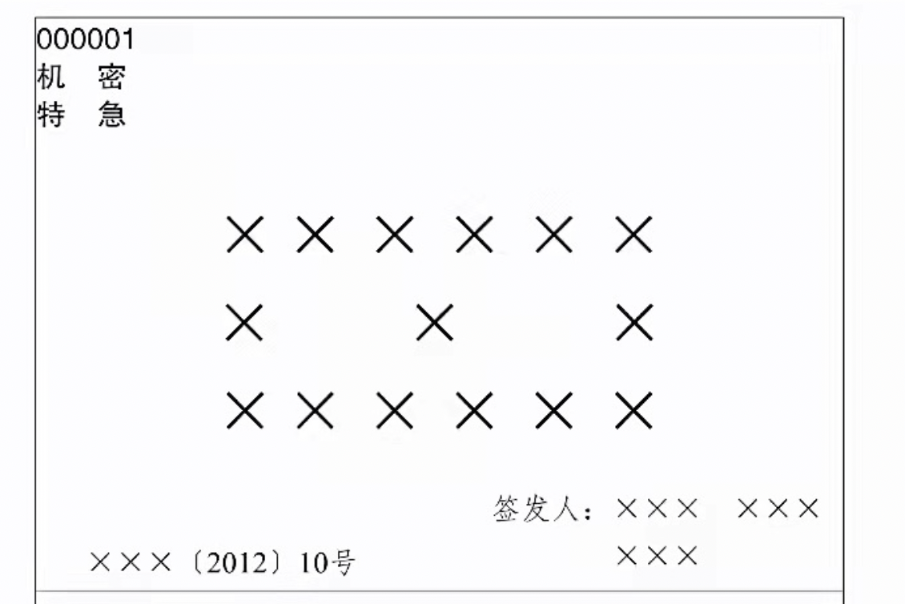

# 《公文》格式要求

`2023/04/12 21:46:29  by: 程序员·小李`

#### 基本规则

> `确有必要、讲求实效、注重针对性和可操作性`。

> 一般`逐级行文`，不得越级。特殊情形需要越级的，需要`抄送`越过的机关，特殊情况如下：
> * 事出突然，情况紧急
> * 多次请示，未予答复的
> * 上级交办，指定越级上报或直接上报的事项

#### 上行文规则

> 1. 原则上`只主送一个机关`，根据需要抄送相关的`上级、同级机关`，不抄送下级机关。
> 2. 党委、政府的部门向上级主管部门请示、报告重大事项，需要经过同级党委、政府的同意或授权，属于职权范围内的部分，可直接报送。
> 3. 对请示来源于下级部门，本级仍需向上级部门继续请示的情形中，不能原文转发，而`必须`提出倾向性意见。
> 4. 请示应当`一文一事`
> 5. 除上级机关负责人`直接交办`的事项，不得以`本机关`名义向`上级机关负责人`报送，也不得以`本机关负责人`的名义向`上级机关`报送，只能以`本机关`名义向`上级机关`报送。
> 6. 双重领导的向其中一个领导机关行文，必要时抄送另外的领导机关。（非必须）

#### 下行文规则

> 1. 主送受理机关，根据需要抄送相关机关。重要行文应同时抄送发文机关的直接上级机关。
> 2. 党委、政府的办公厅或办公室（职能部门）根据党委和政府授权可以向下级党委、政府行文，其他职能部门不可以。
> 3. 党委、政府的部门可以向下级党委、政府的相关部门行文。
> 4. 涉及多个部门职权范围的事务，尚未协商一致不得行文，擅自行文的，上级机关责令纠正或撤销。
> 5. 上级机关向受双重领导的下级机关行文，必要时抄送另外一个领导部门。（非必须）

#### 特殊行文规则

> 1. 同级党政机关、党政机关与其他同级机关必要时可以联合行文，属于各自职权范围内的不得联合行文。上下级不得联合行文。
> 2. 党委、政府的部门可以依据职权相互行文
> 3. 部门内设机构除办公厅外不得对外正式行文。

#### 版头

> 公文首页红色分割线以上的部分是版头

> **份号**
> * 份号是公文印制的顺序号，涉密公文应当标注份号
> * 6位3号阿拉伯数字，顶格编排在版心左上角第一行，不足6位的前置补0。
>
> **密级和保密期限**
> * 密级包含绝密（绝对机密，30年）、机密（重要，20年）、秘密（一般保密，10年）
> * 3号黑体字，顶格编排在版心左上角第二行，用黑色五角星连接
> 
> **紧急程度**：送达和办理的时限要求
> * 公文分为特急、加急；电报分为特提、特急、加急、平急
> * 3号黑体，顶格编排在版心左上角。
> * 按份号-密级和保密期限-紧急程度自上而下分行排列
>
> **发文机关标志**：应发文机关全称或简称+文件组成，也可不加“文件”二字
> * 可以以主办机关签名，也可以联合签名
> * 发文机关标志居中排布，上边缘至版心上边缘35mm, 红色小标宋体
>
> **发文字号**，由发文机关代字，年份，发文顺序号组成，联合范文使用主办机关的发文字号
> * 在发文机关标志下空两行，居中排布。均用阿拉伯数字，如“国发〔2023〕2号”
> * 上行文的发文字号居左空一字编排，与最后一个签发人姓名在同一行。否则居中排布。
> 
> **签发人**
> * `上行文`应当标注签发人姓名，在发文机关标志下空两行，居右空一字，“签发人：xxx”，其中签发人三个字用3号仿宋，姓名3号楷体。
> * 如有多个签发人，姓名按照发文机关排列顺序从左到右，从上到下，依次均匀编排，一般每行排两个姓名，回行时，与上一行第一个签发人姓名对齐。  

版头示例：

   

多发文机关时，发文机关标志的排版：

   

不带签发人时，发文字号排版：

多个签发人时的排版：

#### 主体

> 公文首页红色分割线以下，末页首条分割线以上的部分是主体。

> **标题**：[发文机关名称]+[事由]+文种
> * 2号小标宋体，红色分割线下空两行处
> * 居中排布，可以换行，标题排列呈现梯形或菱形。
>
> **主送机关**：使用全称、简称或统称。
> * 标题下空一行，顶格居左，中间逗号分隔，最后一个单位后使用全角冒号。
> * 主送机关过多时，建议使用统称，还是无法在首页写完的，移至版记
>
> **正文**：首页必须显示正文。
> * 3号仿宋，主送机关下一行，自然段首行缩进2字符，回行顶格。序号可以使用“一、”，“(一)”，“1.”，“(1)”，一般第一层用黑体，第二层用楷体
>
> **附件说明**：附件的序号+名称
> * 正文下方空一行，居左缩进2字符，回行与上一行名称对齐，如“附件：1.XXXX”
> * 名称后无标点符号
>
> 发文机关署名：以简称或全称，以成文日期居中。在成文日期上方。
>
> 成文日期：签发日期，联合发文是最后一个机关签发的日期
> * 有印章时，右空4字
> * 使用阿拉伯数字，不编虚位，年月日标全
> 
> 印章：有发文机关署名的，应加盖印章，不得出现空白印章，为红色。
> * 印章位置要求：端正居中下压发文机关署名和发文日期，使得单位和日期在印章居中偏下的位置，印章上边缘与正文相距一行以内。
> * 多发文机关应当自上而下，从左到右编排，第一排印章上边缘与正文相距一行以内，最后一个印章端正居中下压发文机关署名和发文日期，印章之间排列整齐，不交叉，不相切。
> * 有特定标记的普发性的公文和电报可以不加印章
> 
> 附注：对发送范围的说明，在发文日期下一行，居左缩进两字符，加括号说明。
>
> 附件：另面编排，在版记之前，与正文一起装订。
> * 一起装订的，在第一行顶格3号黑体，附件：名称
> * 不能一起装订的，首行顶格写`发文字号`并标注附件+名称。

附件

印章

#### 版记

> 末页首条红色分割线以下，最后分割线以上部分为版记

> **抄送机关**：除除送机关以外的机关简称或全称，4号仿宋，左右各空一字，在印发机关和印发日期上一行，抄送：xxx机关，回行对齐冒号后的首字，最后一个机关后加句号。
>
> **印发机关和日期**：4号仿宋，左右各空一字 + 印发二字，编排于末尾分割线上方，印发机关居左，日期居右。日期是阿拉伯数字，年月日标齐全。印发机关一般是办公室或办公厅。

抄送部分及印发机关、日期

#### 页码

> 页码位于版心下边缘7mm，单页居右空一字，双页居左空一字，4号半角阿拉伯数字，左右使用一字线。

