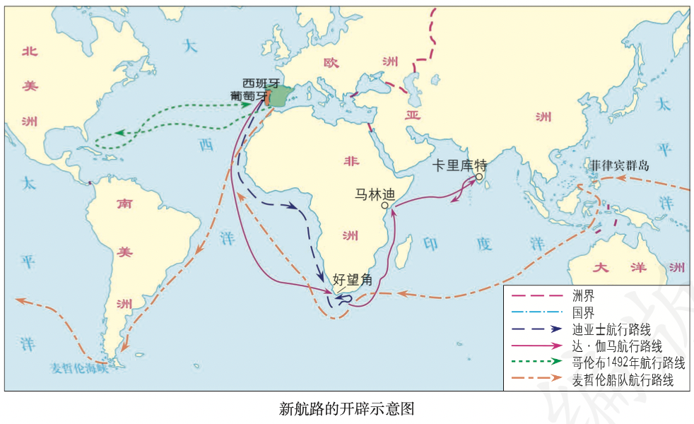
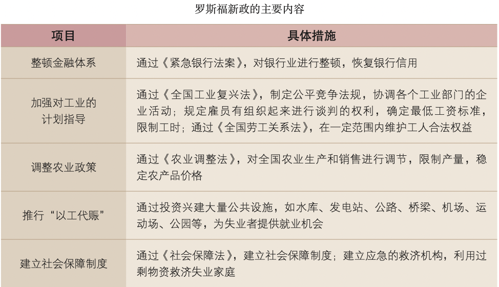

# 【历史】世界古代史
`2023/08/09 08:36:58  by: 程序员·小李`

#### 古埃及——尼罗河流域

古埃及位于非洲东北角，`尼罗河`（世界上最长的河流）贯穿南北。古埃及被认为是“尼罗河的赠礼”。

> **发展史**
>
> 🚩 约从公元前3500年开始，在尼罗河下游陆续出现了若干个小国家。
>
> 🚩  公元前3100年左右，古埃及初步实现了统一。在法老`图特摩斯三世`统治时期，古埃及成为强大的军事帝国，版图向北延伸至叙利亚与小亚细亚交界处，以及幼发拉底河上游，向南扩展到尼罗河“第四瀑布”。
>
> 🚩 公元前525年，`波斯帝国`吞并`古埃及`；
>
> 🚩 `亚历山大帝国`和`罗马帝国`先后占领古埃及。

> **🔥 发明成就——太阳历、象形文字**
>
> 古埃及`天文学、数学和医学`成就突出，有著名的`太阳历`、`象形文字`

> **🔥 文明象征——金字塔**
>
> 古埃及法老为自己修建呈角锥体状的陵墓，中国人称之为“金字塔”。金字塔是古埃及文明的象征，反映了古埃及社会经济发展的较高水平，是古埃及人智慧的结晶。最大的金字塔是`胡夫金字塔`，在胡夫金字塔旁的`哈夫拉金字塔`前，还有一座`狮身人面像`。金字塔的修建，反映了古埃及国王的`无限权力`。法老作为全国最高的统治者，集军、政、财、神等大权于一身，具有无上的权威。

#### 两河流域——幼发拉底河、底格里斯河流域

两河流域，又称“美索不达米亚”，大体上是以今天伊拉克首都`巴格达`为中心的狭长地带。

> **发展史**
>
> 🚩 约从公元前3500年起，两河流域南部逐渐产生了一些以城市为中心的小国，小国之间混战不止。
>
> 🚩 大约在公元前24世纪，两河流域实现了初步统一。

公元前18世纪，古巴比伦第六代国王`汉谟拉比`，完成了两河流域中下游地区的统一事业，建立了统一、强大的`奴隶制`国家。汉谟拉比实行`君主专制`制度，加强中央集权，还制定了一部较为系统和完整的法典（`《汉谟拉比法典》是迄今已知世界上第一部较为完整的成文法典`）。

> 📣 扩展知识
>
>古巴比伦分为`拥有公民权的自由民、无公民权的自由民和奴隶`三个严格的社会等级。`战俘`是奴隶的主要来源，也有买卖奴隶的现象。`家庭奴隶制`是古巴比伦的一大特征，男性家长对奴隶有生杀予夺之权，对妻子儿女有绝对权威，在欠债时甚至可以将妻儿送去抵债。同时，法典中有许多关于`租赁、雇佣、交换、借贷`等方面的规定， 说明商品经济在古巴比伦比较活跃。

#### 古印度

古代印度文明最早出现于`印度河流域`。印度河发源于青藏高原，流经今巴基斯坦境内，入阿拉伯海，水量丰沛。

公元前1500年左右，来自中亚的一支游牧部落侵入印度。他们自称雅利安人，陆续在印度河流域和恒河流域定居下来，从事农业生产，印度北部逐渐出现了许多小国家。`孔雀王朝统治时期`是古代印度文明的鼎盛时期。农业和工商业都比较繁荣，出现了许多工商业中心城市，首都`华氏城`是当时世界上最繁华、人口最多的大城市之一。

>**种姓制度**
>
>雅利安人逐渐建立了社会等级制度，史称`“种姓制度”`。第一等级`婆罗门`（祭祀）;第二等级`刹帝利`（军事和行政）;第三等级是`吠舍`（农业、畜牧业和商业）;第四等级是`首陀罗`（从事农业、畜牧业、捕鱼业和手工业，要为前三个等级服务）。在四个等级之外，还有最卑贱的“不可接触者”——`贱民`，在社会上遭到歧视和凌辱。各等级世代相袭，等级之间贵贱分明，低等级的人不得从事高等级的人的职业，不同等级的人不得通婚。

>**佛教的发展**
>
> 🚩 佛教创立于公元前6世纪，创始人`乔达摩·悉达多`（“释迦牟尼”）。早期反对婆罗门的特权，提出`“众生平等”`，不拒绝低种姓的人入教；佛教宣扬“忍耐顺从”，得到国王和一些富人的支持。
>
> 🚩 公元前3世纪后，佛教开始向外传播。
>
> 🚩 公元前1世纪，佛教经中亚传到`中国新疆`，再传入中国内地，后又传到朝鲜、日本和越南等国。佛教往南经锡兰，传到缅甸、泰国、柬埔寨等国。

#### 希腊城邦

古希腊大致包括`希腊半岛、爱琴海诸岛、小亚细亚半岛西岸、黑海沿岸、意大利南部以及西西里岛`等地区。

希腊最早的文明产生于`爱琴海地区`。爱琴文明包括`克里特文明`和`迈锡尼文明`。迈锡尼各国后来被攻占，迈锡尼文明中断，希腊进入相对落后的`荷马时代`。

>**希腊城邦——“小国寡民”**
>
>公元前8世纪，希腊出现了城邦，是以一个城市或市镇为中心，把周围的农村联合起来，组成一个小国。希腊城邦的突出特点是`“小国寡民”`。
>* 希腊城邦的居民分为`公民和非公民`。
>* 成年男性公民有`参与统治的权利`。
>* 只有`公民才能占有土地`，占有一定数量的土地也是公民权的必要保障。
>* `参军打仗是公民的义务`。

> 城邦的宗教活动、节庆演出、文体竞赛都以`公民`为主体。非公民包括`外邦人和奴隶`。外邦人虽然是自由人，但没有政治权利，不能占有土地。奴隶几乎没有任何权利和自由。公民与非公民是`统治与被统治`的关系，二者界限分明。

>**伯利克里时期——奴隶制民主政治**
>
>雅典城邦位于希腊中部。雅典建立了民主政体，经济发达，国势强盛，一度成为 200 多个城邦的盟主。公元前 5 世纪中后期`伯里克利`时期，雅典达到全盛，奴隶制民主政治发展到高峰。
>* 扩大了公民的权利，公职人员几乎都是从`全体公民中抽签产生`，使每一名公民都有参政的机会。
>* 代表各地的`10个主席团轮流主持城邦日常事务`，召集公民大会。这些主席团由各地抽签产生，主席团主席也经抽签产生。
>* `公民大会是最高权力机构`，具有立法、司法等多种职能。建立了`津贴制度`，保证贫穷公民参政议政。但是外邦人、奴隶、妇女没有任何政治权利。

>**亚历山大帝国**
>
>🚩 公元前334年，马其顿国王`亚历山大`率军进攻波斯帝国。波斯国王`大流士三世`亲率10万大军，在叙利亚的`伊苏斯平原`迎战。亚历山大出奇制胜，继续南下，攻占地中海东岸地区，随后，兵不血刃进入埃及。
>
>🚩 公元前331，亚历山大从埃及转而进入两河流域，与波斯大军再度会战取胜。一年后，波斯帝国灭亡。
>
>亚历山大建立了空前庞大的帝国，其版图`西起`希腊``，`东到`印度河流域``，`北抵`中亚``，`南达`埃及``，地跨欧、亚、非三洲。这个帝国被称为“亚历山大帝国”，亚历山大被称为`“亚历山大大帝”`。

>**梭伦改革——四百人议事会**
>
>公元前594年，`梭伦`进行了改革：
> * 将城邦公民`按财产多少`划分为4个等级，各等级有不同的权利和义务。
>* 设立公民代表组成的`四百人议事会`，为公民大会准备议案。

>**克利斯提尼改革——陶片放逐法**
>
>公元前509年，`克利斯提尼`进行改革：
>* 重新划分雅典的行政区域
>* 将四百人议事会扩大为`五百人议事会`，所有公民不分等级都可以担任五百人议事会的成员，扩大了议政人员的范围。
>* 创立了“陶片放逐法”:每年召开一次专门的公民大会，如果一半以上出席会议的人员认为有公民将会危害民主或危害国家，便再召开一次公民大会，用`陶片投票方式`决定被放逐的人选。只要出席人数`达到6000人`，得票最多者就要被逐出城邦，10年后方可回国。

#### 罗马城邦

意大利半岛位于地中海中部，三面临海，海岸线很长，`亚平宁山脉`贯穿半岛。

>**从罗马共和国到罗马帝国**
>
>自公元前1000年左右，形成了许多城邦，罗马城邦便是从意大利半岛中部的`台伯河畔`兴起的一个。
>
>🔥 公元前509年，罗马`建立了共和国`。国家统治的决策权掌握在由300名贵族组成的`元老院`手里，两个权力相等的执政官主持日常政务，`公民大会`是形式上的最高权力机关。罗马设立了平民自己选出的两名`保民官`，有 权`否决`执政官与元老院提出的对平民不利的决议。
>
>🔥 公元前450年左右，罗马颁布了成文法`《十二铜表法》`，涉及`诉讼程序、所有权和债务权、宗教法`等内容，使定罪量刑有了文字依据，在一定程度上遏制了贵族对法律的曲解和滥用。
>
>公元前3世纪初，罗马征服了意大利半岛。随后，罗马灭掉迦太基，控制了西地中海地区。
>
>公元前2世纪，罗马又征服东地中海地区，成为整个地中海地区的霸主。在扩张过程中，大量被征服地区的人被掠为奴隶，`奴隶`成为罗马共和国的主要生产者。
>
>🔥 公元前73年，斯巴达克发动了`斯巴达克`奴隶起义，多次打败罗马军团，沉重打击了罗马共和国的统治。
>
>🔥 公元前49年，`凯撒`进攻罗马城，控制了`元老院`，元老院任命他为`终身独裁官`。
>
>🔥 不久，凯撒被谋杀，内战又起。公元前27年，`屋大维`首创`“元首制”`这一政治形式，罗马共和国演变为罗马帝国。2世纪，罗马帝国进入黄金时期，帝国的版图横跨欧、亚、非三洲，地中海成了罗马帝国的“内湖”。

3世纪，罗马帝国陷入长期的政治、经济大危机。统治者争斗混战不断，人民起义此起彼伏，农业萎缩，工商业衰落，民生凋敝。375年，被称为“蛮族”的`日耳曼人`大举侵入罗马帝国。4世纪末，罗马帝国分裂为东西两个帝国。476年，西罗马帝国在日耳曼人的打击下灭亡。

#### 希腊罗马文化

希腊神话影响广泛，特点是“神人同形同性”。《荷马史诗》是宝贵的文学遗产，也是了解早期希腊社会的主要文献。

>**人物雕刻——希腊**
>
>希腊的人物雕刻艺术达到了一种近乎完美的境界。
>* 奥林匹亚神庙中的`宙斯像`是`古代世界七大奇迹之一`。
>* `《掷铁饼者》`是希腊雕塑艺术中的杰作之一。

>**奥林匹克运动会——源于古希腊**
>
>奥林匹克运动会起源于`古希腊`，因举办地在`奥林匹亚`而得名。公元前776年以后，奥林匹克运动会发展为`全希腊`的运动会。运动会期间，各城邦之间所有敌对活动一律停止。比赛项目最初只有赛跑一项，后来不断增加。比赛 获胜者被本城邦人视为英雄。

>**希腊建筑——帕特农神庙**
>
>希腊建筑艺术主要体现在神庙。神庙四周以廊柱环绕，柱身有粗有细。`雅典帕特农神庙`是典型代表。

>**罗马建筑——大竞技场、引水道、凯旋门、万神庙**
>
>罗马建筑吸收了希腊建筑的特点，并有所创新，如石拱门、穹顶等。罗马的代表性建筑，有可容纳近8万名观众的大竞技场，有引水道工程，还有庆祝胜利的`凯旋门`和宏大的宗教场所`万神庙`。

>**德谟克利特、苏格拉底、亚里士多德**
>
>古希腊哲学家`德谟克利特`提出了“原子论”，认为宇宙万物是由微小的“原子”组成的。
>
>`苏格拉底`探讨人的灵魂、美德和幸福等问题，指出求得知识的最好办法是`有系统的问和答`;他还主张人应该“认识你自己”，这对认识人的内心世界具有重要意义。
>
>`亚里士多德`（师从柏拉图）是一位`百科全书式`的学者。他有一句名言:“吾爱吾师，吾更爱真理。”亚里士多德解剖了许多动物，奠定了`动物学`基础。他是`逻辑学`的创始人，提出的`演绎`等方法成为科学研究的方法论基础。

> 罗马人的《十二铜表法》、`万民法`、`经济法`，涉及众多法律概念，它们共同构成了完整的罗马法学系统。

>**罗马历法——儒略历**
>
>罗马的历法来源于`古埃及人的太阳历`。凯撒命人以太阳历为蓝本编制新的历法，称“儒略历”。为纠正每年将近6小时的误差，采取每4年增加1天的办法进行调整，即每逢能被4整除的那一年为闰年，在2月份增加1天。4世纪，罗马皇帝以此作为`基督教历法`。儒略历后来成为公历的基础。

#### 法兰克王国

1世纪，在罗马帝国统治下的`巴勒斯坦`地区，犹太人长期遭受苦难，渴望“救世主”的到来。传道者宣传说，耶稣就是“救世主”，这种信仰耶稣基督的宗教后来被称为“基督教”。

4世纪末，罗马皇帝将基督教确定为`国教`，促进了基督教的传播。

西罗马帝国灭亡前后，日耳曼人在西欧建立了许多大小不同的王国，被称为“蛮族王国”，其中最为强大的是481年建立的`法兰克王国`。法兰克王国的建立者`克洛维`，皈依了基督教，承认`罗马教会`在欧洲的重要地位。克洛维把原属罗马国有的土地和无主土地赐给教会和部下，从而取得了罗马教会、信基督教的高卢罗马人和部下的广泛支持。克洛维统治时期，版图已经延伸至高卢南部地区以及莱茵河以东至多瑙河之间的大部分地区，实力强大。

>**土地封君封臣制度**
>
>8世纪前期，法兰克王国对土地的分封形式进行了改革，要求得到封地的人必须提供`兵役`服务。这样，赐地的人成为`封君`，接受封地的人则成为`封臣`，封臣必须效忠于封君、封君则须保护封臣的观念日益流行开来。
>
>11世纪，这种`以土地的封赐为纽带`而形成的封建制度在西欧已经普遍存在。封臣对封君要忠诚，要无偿地为封君服兵役、提供金钱等;封君不能任意侵害封臣的荣誉、人身和财产安全;当封臣受到外来攻击时，封君必须提供保护。封君与封臣的关系有着严格的等级性，而且权利、义务交织在一起，有一定的契约意义。

>**查理曼帝国与“什一税”**
>
>8世纪，`查理`成为法兰克王国国王。800年前后，法兰克王国的版图扩展到今天的`意大利北部、西班牙北部和德国西部`的广大地区，与原来西罗马帝国的欧洲部分基本相当，成为当时西欧最大的王国。查理继续实行`鼓励基督教发展`的政策，把王国划分为很多教区，命令每个教区的人民把每年收入的1/10贡献给教会，称为“什一税”。
>
>800年，教皇在罗马为查理举行了加冕礼，称查理为`“罗马人的皇帝”`。因此，查理被称为`“查理大帝”`或“查理曼”。他统治时期的法兰克王国，史称`“查理曼帝国”`。
>
>814年，查理曼去世，强盛一时的帝国很快走向分裂。
>
> 843年，查理曼的三个孙子缔结条约，将帝国一分为三，形成以后`德意志、法兰西和意大利`三个国家的雏形，三个王国彼此间不存在隶属关系。

#### 西欧庄园

从9世纪开始，一种新的`农业经济组织形式`逐渐流行开来，这就是`庄园`。在领主统治下，庄园是一个独立的`自给自足的经济和政治单位`。庄园的居民均为领主的`佃户`，包括自由的`农民`和缺少自由的`农奴`。庄园的耕地分为两部分:一部分由领主自己保留直接经营，称为`“自营地”`，通常占庄园全部可耕地的1/3到1/2，收入全部归领主所有;剩下的耕地是佃户的`“份地”`，是佃户的生活来源。佃户取得份地的条件是义务耕种领主的“自营地”，一般每周要在自营地上劳动3天，剩下的时间才属于自己。领主还向佃户征收其他`捐税`。庄园的周围大多是林地、荒地等，被称为`“共用地”`，全体佃户都可以放牧，共同使用。自由农民是独立的小生产者，拥有自己的生产工具和财产，有份地保有权，领主不能随意没收他们的土地。

庄园具有`司法权`，设有`庄园法庭`，主持法庭的是`领主或他的管家`。佃户如果有在劳役中怠工、不能完成劳役或 未按规定缴纳足额租税等侵犯领主利益的行为，会受到起诉与处罚。

庄园法庭没有专门的工作人员，一般是每隔一段时间为解决一批问题而开庭一次。法庭开庭的地点也不固定，有时在领主宅第的厅堂，有时在教堂，有时就在庄园里的大树下。

庄园法庭起着维护庄园公共秩序的作用。佃户之间关于土地、借贷和婚姻的纠纷，违反庄园公共规则的行为，都要通过庄园法庭进行审理。

惩罚各种违法行为的手段通常是处以罚金，罚金全部归领主所有。出席法庭是佃户的义务，没有经过领主允许而无故缺席的佃户，会被罚款。庄园法庭审判依据习惯法或村法。领主可以凭借法庭奴役佃户，佃户有时也可以利用法庭维护自己的权益，甚至有权参与案件的审理。庄园法庭既维护了领主的利益，也一定程度上限制了领主的特权。

#### 中世纪大城市的兴起

西罗马帝国灭亡后，西欧的农业、工商业普遍衰落，罗马时代的很多城市变成了废墟。从10世纪起，西欧开始恢复，旧的城市开始复苏，新的城市不断产生。

>城市一般坐落在封建领主的领地上，领主像控制庄园一样，对城市居民`任意征税`，甚至要求居民像佃户一样履行义务。城市居民采取`金钱赎买和武力斗争`等方式反抗，争取城市的自由和自治。13世纪，许多城市取得了一定程度的自由与特权，成为自由城市。 
>*`市民是自由人`，享有`财产权`，领主不得非法剥夺市民的财产，不得向市民任意征税。
>* 部分城市还有权`选举市长、市政官员`，设立`城市法庭`，成为自治城市。城市取得`自由和自治权`的形式，是从国王或领主手里取得“特许状”。但是，取得自治的城市并不能完全摆脱国王和领主的控制。
>* 手工工匠和商人是城市的基本居民，他们一般是从周围农村的农民转变而来的。很多人进入城市以前还是农奴，一旦进入城市，住满一年零一天，就获得了市民的身份，从此享有自由，领主无权强迫他们重新变成农奴。因此，越来越多的农奴逃离庄园，进入城市，促进了城市的发展。
>* 手工业者主要从事`小商品生产`，拥有简单的生产资料，自己和家属都参加劳动，靠`出卖产品`换取其他生活用品以维持生活。家庭既是生产的作坊，也是店铺。
>* 商人专事商业和贸易，通常比手工业者富裕。

城市手工业者和商人不断分化，出现了富裕的`大手工业作坊主、商人和银行家`等，他们成为早期的资产阶级。

12世纪，西欧开始大学的兴起，被认为是欧洲中世纪教育“最美好的花朵”。巴黎出现了许多`教会学校和教师私人办的学校`，教师私人办校必须从教会取得授课许可证。巴黎的教师组成教师行会，选举`会长`管理学校。

13世纪，巴黎教师行会得到罗马教皇和国王的支持，自治权利得到保证。大学的自治地位主要体现在`免赋税特权、司法特权、教育自主权`。国王一般都尊重大学自治；教皇支持大学，但不允许异端言论。司法特权指大学师生免受地方世俗法官审判，而是按教会法规定由当地主教审理，或由大学法庭独立审理。当时，大学的基础课程包括`文法、修辞、逻辑、算术、几何、天文和音乐`。还有专业课程，如`法学、医学和神学`。大学的课程设置一方面仍受基督教会的影响，另一方面也反映了经济和社会发展的要求。

#### 拜占庭帝国

东罗马帝国的版图涵盖了希腊以及亚洲西部和非洲北部地区，这些地区有农业比较发达的埃及、叙利亚，有许多大都市和国际贸易港口。因此，东罗马帝国的经济比较活跃，社会比较稳定。西罗马帝国灭亡后，东罗马帝国则延续下来，并且进入一个“黄金时代”。

527年，`查士丁尼`继任为东罗马帝国皇帝。528年，他组建了一个法典编纂委员会。529年，委员会编成`《查士丁尼法典》`。后来，委员会把历代罗马法学家有关法律问题的论文和著作汇编为`《法学汇纂》`，又编成指导学习法律文献的`《法理概要》`。查士丁尼还命人将自己执政时期的法令编辑为`《新法典》`。以上这4部法律文献统称为《罗马民法大全》。《罗马民法大全》仍然承认奴隶制，但在一定程度上改善了奴隶的地位。《罗马民法大全》还对财产、买卖、债务、契约关系等作出明确规定，奠定了欧洲民法的基础。

从7世纪起，阿拉伯人不断进攻拜占庭帝国，占领了帝国的部分地区。为了抵御外族的入侵，皇帝把行省改为军区，把自由农民编入军队，军事将领成为地方的行政长官。9世纪以后，拜占庭帝国又面临外部多个军事势力的进攻，帝国版图不断被蚕食。长期的对外战争导致财政枯竭，拜占庭皇帝不得不求助于西欧封建主的军事援助。早就垂涎东方土地和财富的西欧封建主在罗马教皇的号召下组建了`十字军`进行东征。十字军不仅没有给拜占庭以军事援助，反而攻打拜占庭帝国，占领了`君士坦丁堡和拜占庭`的大部分领土。拜占庭帝国国势日渐衰弱。从14世纪初开始，拜占庭帝国受到新崛起的`奥斯曼人`的不断进攻。

1453年，奥斯曼帝国攻破`君士坦丁堡`，改名为`伊斯坦布尔`，拜占庭帝国最终灭亡。

拜占庭帝国是一个地跨欧、亚、非三洲的大帝国。它对基督教、希腊罗马的古典文化传统，以及西亚、北非等地的东方文化因素兼收并蓄，创造出独具特色的拜占庭文化，在世界上产生过重大影响。它保存了大量的希腊、罗马古籍，为 后来西欧的文艺复兴提供了丰富的精神营养。

#### 古代日本

1—2世纪，日本有100多个小国。5世纪，在本州中部兴起的`大和政权`基本实现了统一。大和国的最高统治者称为`“大王”`，大王依靠贵族统治全国。王室和贵族各有自己的私有领地。领地上的居民以“部”的形式组织生产，从事 农业的称为“田部”，从事海洋捕捞的称为“海部”等等。来自中国、朝鲜的移民也依其特长分别被编入锦织部、锻冶部等。部民是贵族的私有民，地位近似于奴隶。

6—9世纪，日本积极吸收中国文化，推动日本进行改革。大和皇族中的改革派发动宫廷政变，孝德天皇即位，年号大化。从646年开始，日本仿效唐朝的典章制度，进行了一系列改革，史称`“大化改新”`。大化改新后，大和正式改称日本国。

大化改新的主要内容有:
* 建立以天皇为中心的`中央集权制度`，地方设国、郡、里三级，由中央派官治理。
* 经济上，废除一切私地、私民，将土地、部民收归国有，成为公地、公民;
* 国家将土地分给公民，每隔六年授田一次，不能终生使用，也不能买卖;
* 统一赋税。

**大化改新**使日本发展成为一个中央集权制的封建国家。大庄园既不向国家纳税，也不准地方官吏进入庄园，干涉庄园事务。中央对地方逐渐丧失了控制能力，社会局势动荡。地方豪强为了保护自己的庄园，把自己家族和仆从中的青壮男子武装起来，组成一种`血缘关系和主从制`相结合的军事集团，成员称为`“武士”`。小的武士团追随、服从一个更强大的首领，组成大的`武士团`。武士团有时代表庄园利益与地方政府对抗，有时也响应朝廷号召去征战。12世纪晚期，`源氏武士集团`击败`平氏武士集团`，源氏首领源赖朝获得`“征夷大将军”`称号，设`幕府`于镰仓。镰仓幕府拥有独立于朝廷的政治、军事权力，日本由此进入近700年的幕府统治时期。幕府首领“征夷大将军”名义上由天皇任命，但实际上天皇大权旁落，成为一种礼仪性的摆设，`幕府将军`实际上把持着国家大权，逐渐形成了武士道。武士效忠的对象不是国家，而是他的主公。

#### 阿拉伯帝国

6世纪末7世纪初，阿拉伯半岛的居民大多过着游牧生活，各部落之间为争夺水源与牧场，相互仇杀。氏族部落盛行多神崇拜，麦加等地信奉安拉，但并不排斥其他神灵。

`穆罕默德`阐述了独尊安拉的宗教思想，于7世纪初创立了`伊斯兰教`。穆罕默德最初在`麦加`城传教，由于遭到当地传统势力的反对，他于622年率领一些信徒迁居`麦地那`，建立了`穆斯林公社`。公社成员都以兄弟姐妹相待，禁止相互仇杀，公社内外事务都要听从穆罕默德的决定。阿拉伯国家的雏形由此诞生。

630年，穆罕默德率穆斯林占领`麦加`。此后，阿拉伯半岛基本统一。穆罕默德逝世后，他的继承者继续扩张，北进叙利亚，东灭波斯，进而征服阿富汗和印度西北部，直抵中国唐朝边境;751年击败唐朝大将高仙芝的军队，控制了中亚大部分地区。阿拉伯人攻克埃及，横扫北非; 阿拉伯人占领了西班牙，接着越过比利牛斯山，为法兰 克王国军队所阻。至8世纪中期，阿拉伯帝国的版图横跨亚、欧、非三大洲，是当时世界上疆域最大的帝国。伴随着帝国的扩张，`伊斯兰教`向阿拉伯半岛以外的地区广泛传播。

阿拉伯帝国繁荣时期，`哈里发`重视知识，认为“人最美的装饰是知识”。830年，哈里发在`巴格达`设立`“智慧宫”`，集科学院、图书馆、翻译馆于一体。哈里发以黄金支付稿酬，其重量与译著重量相等。于是，大量的希腊、波斯、印度的典籍被译为阿拉伯文。

阿拉伯人改造了古印度人从0到9的计数法，形成了我们现在使用的`“阿拉伯数字”`，并创造了完整的代数学。`《医学集成》和《医典》`两部书，长期被欧洲医学界奉为经典。脍炙人口的`《天方夜谭》`，是阿拉伯文学的瑰宝。中国的`造纸术、指南针、火药`等重大发明和印度的`棉花、食糖`等都是由阿拉伯人传入欧洲的。

#### 西欧经济与社会发展

11 世纪以后，各地纷纷开展垦殖运动，大量的林地、荒地、沼泽被开发，土地面积逐渐扩大。垦殖者成为这些新 开发地区的主人，他们按照自己的方式耕种。这些新开发的地区也仿效自治城市，成为具有独立司法权和行政自治权的地区。

西欧越来越多的地区，劳役量被固定在一个特定的范围。农奴可以`用货币购买劳役豁免权`，以此获得对自己劳动力的自由支配;也可以通过`缴纳迁徙税`，获得离开庄园、摆脱领主人身束缚的机会。农民逐渐获得对自己剩余产品的支配权。小块土地越来越不适应新的生产经营活动，在一些地方领主通过`转让、联姻、继承、买卖`等方式，将土地集中在一起。

14世纪中叶以后，越来越多的领主出租`自营地`，他们依靠土地租金生活，不再参与生产管理。一些农民通过`承租、购买`领主的土地，或者`转租、购买`其他佃户的地产等方式将土地集中起来，建立租地农场。他们雇用少地或无地的农民耕种，并将产品推向市场。

农产品的富余，加上城市需求的增加，使得更多的`农产品和畜产品`得以进入市场。法国南部地区的粮食被运到意大利的一些城市，欧洲的呢绒、皮毛等远销东方。这一时期，手工业也不断发展。一方面，手工业者逐 渐脱离农业生产;另一方面，他们更多地为市场而生产。

13世纪，小型手工作坊得到发展。为了缴纳封建赋税，农民也在家里用自己的生产工具从事手工生产。农村出现了分散的手工工场。后来，这种分散的手工工场逐渐转向集中的手工工场。商人不仅向工人提供原料，而且还提供统一的生产工具，工人成为完全`出卖劳动力`的雇佣劳动者，形成彻底的雇佣关系，形成了集中的手工工场。

土地关系的变化和手工业的发展，推动农业和手工业生产组织逐渐资本主义化，开始改变中世纪欧洲社会的整体面貌。大多数贵族不重视或没有能力经营自己的地产，将其抵押或变卖，以偿还债务或应付开支;富裕农民、骑士等通过各种手段不断集中土地，以新的经营方式掌握了生产、交换等环节，还控制了乡村行政事务，成为农村中富有生气的阶级力量。城市中，手工业者、商人成为城市居民，享有新的契约关系赋予的权利。富商巨贾还投资乡村，置办田产，采用新的生产经营方式。他们与贵族联姻或成为官员，抬高自己的身份，政治权利也不断扩大，成为强化王权所需要的政治力量。

#### 文艺复兴

>**文艺复兴——人文主义**
>
>文艺复兴是从`意大利`开始兴起的反对教会`“神权至上”`，提倡`人文主义`的新文化运动，促进了人们思想的大解放，延续了近300年之久。采取复兴古代希腊罗马文化的方式，其中有继承，更有创新。

>**文学三杰——但丁、彼得拉克、薄伽丘**
>
>但丁是文艺复兴的先驱，他的长篇诗作`《神曲》`分“地狱”“炼狱”“天堂”三部分。作者借梦游三界描写现实生 活中的各色人物，抨击教会的贪婪腐化，把许多主教、僧侣甚至教皇都打入地狱，表达了市民阶层的情感与理想。 `但丁`与`彼特拉克`、`薄伽丘`并称为文艺复兴`“文学三杰”`。

>**美术三杰——达芬奇、米开朗基罗、拉斐尔**
>
>达·芬奇思想深邃，学识渊博，兼艺术大师、科学巨匠、文艺理论家、哲学家、诗人、音乐家、工程师和发明家于一身。达·芬奇最大的成就是`绘画`，代表作有`《蒙娜丽莎》和《最后的晚餐》`等，他与`拉斐尔、米开朗琪罗`并称为`文艺复兴“美术三杰”`。

>**文艺复兴在英国**
>
>15、16世纪，文艺复兴开始向西欧其他国家和地区传播。英国的`莎士比亚`就是其中的代表。莎士比亚的作品反映了时代风貌和社会本质，深刻批判了封建道德伦理观念和社会陋习，充分体现了人文主义者的生活理想。`《哈姆雷特》《罗密欧与朱丽叶》`是他的代表作。

#### 新航路与殖民扩张

东方的丝绸、香料、瓷器、宝石和黄金等在欧洲市场极受欢迎。加上意大利人`马可·波罗`《马可波罗行记》描绘的中国、印度等东方国家，引发欧洲社会出现了关注东方的热潮。当时，亚洲的商品要先汇聚到地中海地区，再转运欧洲各地，中间要经过层层转手，价格已经涨了8—10倍。15世纪中期，奥斯曼帝国灭掉拜占庭帝国，控制了东西方贸易的所有重要商道，要求商人缴纳高额关税，使得从东方运往欧洲的商品价格更加昂贵。因此，欧洲人越发想要寻求通往东方的新航路。

随着欧洲地理学的发展，人们逐渐相信地球是圆的，一些人试图环绕地球进行航行。12世纪末至13世纪初，中国人发明的指南针，用于“罗盘”导航技术，经阿拉伯商人传到欧洲。13世纪，欧洲水手已经掌握了罗盘技术。同时，欧洲的造船技术取得重大突破，船的规模变得更大，速度更快，操纵更加灵便。

>新航路的探索
>
>🚩 **迪亚士到达好望角**：1487年，`迪亚士`在葡萄牙王室的支持下，带领由3艘轻便帆船组成的船队沿`非洲西海岸`南下，在第二年到达非洲的`好望角`。迪亚士的航行，实际上已经打开了绕道非洲南端通往东方的航路。
>
>🚩 **达伽马到达印度西海岸**：1497年，`达·伽马`从葡萄牙出发，绕过好望角，溯非洲东海岸北上，横渡印度洋，1498年到达印度西海岸。达·伽马带回大量`胡椒、肉桂`等香料，还带回大量的`黄金`。
>
>🚩 **哥伦布到达美洲**：1492年8月，受西班牙王室资助，`哥伦布`（意大利人）率领由87名船员和3艘船组成的船队从西班牙出发，开始`横渡大西洋`，10月，到达巴哈马群岛中的`圣萨尔瓦多岛`。后来，他们又“发现”了`古巴和海地`。在接下来的10年间，哥伦布先后三次西航，还把当地人称为“印第安人”。
>
>🚩 **麦哲伦环球航行**：1519年，`麦哲伦`奉西班牙国王之命，继续寻找盛产黄金和香料的亚洲。经过3年的航行，船队穿越大西洋、太平洋和印度洋，于1522年返回欧洲。麦哲伦成为`第一位横渡太平洋`的欧洲人，他的船队第一次完成了环球航行，证明了`地圆说`的正确。

中世纪晚期，西欧商品经济空前繁荣，需要拓展市场，寻找原料。新航路开辟后，欧洲人便开始了早期的殖民掠夺。最早进行殖民的国家是葡萄牙和西班牙（他们开辟了新航路）。

葡萄牙人在亚洲、非洲、拉丁美洲建立了一些殖民据点与商站，如巴西、印度果阿、马六甲和中国澳门，从而控制了从印度洋到太平洋的海上通道，并以殖民据点为基地在当地进行劫掠式的贸易。他们用葡萄牙的手工业品，交换当地人手中的`象牙、珍珠、宝石和香料`，甚至抢劫当地人的`黄金`。

16世纪，西班牙拥有一支强大的海军舰队，横行于地中海和大西洋，自称`“无敌舰队”`，在美洲建立起一个殖民大帝国。西班牙殖民者使用武力强迫印第安人无偿开采金银矿，还在当地开发种植园，强迫印第安人和黑人作为奴隶在种植园里劳作。

16世纪，随着资本主义生产方式的确立，英国的手工业尤其是毛纺织业迅速发展，促使英国开拓海外市场。英国位于海上贸易航道的要冲，只有打破西班牙的海上霸权才能向海外发展。1588年，英国海军在`英吉利海峡`与西班牙的“无敌舰队”进行了一场以少胜多的大海战，“无敌舰队”遭遇惨败。英国逐渐成为海上霸主，开始在海外扩张殖民地。

17世纪，英国在`北美`建立了殖民地。英国殖民者在北美建立大种植园，生产`棉花、烟草、蓝靛、蔗糖`等原材料。英国殖民者也从事`贩卖非洲黑奴`的活动。英国商船从英国各地的港口出发，将`火器、机械制品和酒`等物品运往非洲倾销;在非洲掳获黑奴，运往`西印度群岛和美洲殖民地`，卖给当地的种植园主;再购进`蔗糖、烟草`等产品返回英国。这个航程的路线呈三角形，故这个以贩卖黑奴为中心的贸易被称为“三角贸易”。

荷兰一度控制着`波罗的海、印度及美洲`的全部贸易，有`“海上马车夫”`之称。进入17世纪，荷兰入侵印度尼西亚的`爪哇岛`;从葡萄牙人手中夺取了`马六甲和锡兰`;一度强占了中国的`台湾`;在非洲的`好望角`建立了殖民地;在`北美洲`建立了新尼德兰殖民地。

17世纪下半叶，法国先后在北美洲、非洲和亚洲 建立了法属殖民地。

为争夺殖民地和世界市场，从17世纪下半叶起，`英国与荷兰、法国`发生了一系列战争。`英国`凭借强大的实力最终战胜了荷兰和法国，在世界各地夺取了大片殖民地，自诩为`“日不落帝国”`。欧洲殖民者在殖民地掠夺了大量的`黄金、白银`，他们还将殖民地的`马铃薯、玉米、番茄、烟草、可可、茶叶`等作物运回欧洲;把欧洲的`葡萄酒、啤酒和毛纺织品`销往殖民地。

#### 君主立宪制——英国

17世纪初，英国开始了`斯图亚特王朝`的统治。国王`詹姆士一世`推崇“君权神授”理论，渴望王权专断。他不经议会批准，强行征税，使议会与王权处于对立状态。13世纪末，英格兰基本确立`议会制度`。议会由上下两院构成，上院由`贵族`组成，下院由`骑士和平民`代表组成，征税权掌握在议会手中。

`查理一世`继续推行君主专断政策，无视议会的权力。1628年，议会向国王呈递了一份《权利请愿书》，重申查理一世在没有得到议会同意的情况下，不得征税;不经法院判决不能随意逮捕人;和平时期不能随意在居民家中驻军。查理一世先是假意应允，在得到拨款后却解散了议会，议会和王权的矛盾激化。

1640年，议会重新召开，议员们不断`抨击国王专权`，揭开了英国资产阶级革命的序幕。议会限制专制王权的活动激化了议会和国王之间的矛盾。1642年，查理一世宣布讨伐议会，挑起了内战。经过几年的反复斗争，议会军队打败国王军队。1649年，查理一世被推上断头台。随后，英国宣布为共和国。

然而，共和国的权力却落在了以`克伦威尔`为首的军队手中，议会有名无实。议会尊克伦威尔为“护国主”，克伦威尔独揽大权。1660年，`查理二世`接受议会有条件的邀请，做了英国国王。英国恢复了君主制，但国王的权 力受到了很大限制。

>**玛丽威廉入主——光荣革命**
>
>詹姆士二世在英国恢复天主教和专制制度，进行反攻倒算，激起了人民的反抗。1688年，英国发生政变，议会作出决定: 废黜`詹姆士二世`，迎请他的女儿`玛丽`和女婿`威廉`入主英国，这次政变史称“光荣革命”。

>**权利法案与君主立宪制**
>
>1689年，议会通过了`《权利法案》`，重申议会定期召开、议员享有讨论国事和言论自由的权利、征税权属于议会、国民可以自由请愿等。《权利法案》规定，国王不经议会许可，不能随意废除法律，也不能停止法律的执行，不得征收捐税。议会还规定，今后任何天主教徒都不能担任英国国王，英国国王也不能与天主教徒结婚。威廉夫妇接受了《权利法案》和议会的要求。此后，英国议会的权力日益超过国王，君主立宪制逐渐形成。英国资产阶级革命`推翻了封建君主专制`，为英国的资本主义发展开辟了道路，并对世界近代历史的发展产生了重要的影响。

#### 美国独立战争

从17世纪开始，英国和欧洲其他国家的移民来到北美，促进了当地经济的发展。1765年以后，英国政府在北美殖民地颁布了一系列新税法，激化了北美人民与英国殖民者之间的矛盾。1773年，英国政府授权东印度公司垄断北 美的茶叶贸易，引发了新的抗税浪潮。

>**来克星顿的枪声——独立战争开始**
>
>1775年4月19日凌晨，800名开赴`波士顿`西北郊搜查军火的英军，在`来克星顿`与埋伏在那里的武装村民交火，美国独立战争爆发。来克星顿的枪声激发了北美殖民地人民的抵抗热情，各地人民纷纷组织起来，武装支援波士顿。

1775年5月，北美13个殖民地的代表聚集`费城`，召开了`第二届大陆会议`。会上，华盛顿强烈主张`武力反抗英军`。会议一致决定把民兵整编为大陆军，委任`华盛顿`为总司令。

>**1776年《独立宣言》**
>
>1776年7月4日，大陆会议通过了由`杰斐逊`起草的`《独立宣言》`，宣布人人生而平等，享有`生命权、自由权和追求幸福的权利`。宣言列举了英国殖民统治的种种暴政，号召殖民地人民反对英国的殖民统治，宣告北美13个殖民地脱离英国而独立。《独立宣言》是第一个以国家名义明确表述资产阶级政治要求的纲领性文献，被称为“第一个人权宣言”。

1777年，一支6000余人的英军在萨拉托加陷入大陆军的包围，被迫投降。`萨拉托加大捷`是独立战争的转折点。之后，法国承认美国，公开参战。欧洲很多国家也因与英国的矛盾结成了“武装中立同盟”，英国陷入孤立。1781 年，美法联军在`约克镇`与英军激战，英将`康华利`率部下投降。

>**1783年美国独立**
>
>1783年，英国被迫承认美国独立。美国独立战争既是一次`民族解放战争`，也是一场`资产阶级革命`。

>**1787年美国宪法——华盛顿**
>
>美国建立后，各州各行其是，矛盾重重。1787年，各州派出代表齐聚费城，由`华盛顿`主持召开了制宪会议，经过争论和妥协，最终制定出`美国宪法`。宪法依据`分权制衡`原则设计了一个联邦制共和国:`行政、立法、司法`三权分立，`总统、国会与最高法院及其相关机构`各司其职，相互制衡；联邦政府与地方政府分享权力；总统和议员由选举产生。1787年美国宪法是`世界上第一部资产阶级成文宪法`，对后来许多国家的政治变革产生了重要影响。

#### 法国大革命

18世纪开始，法国国王`路易十五`实施的加重税收等措施阻碍了资本主义的发展。进步思想家猛烈抨击法国的封建制度，称之为“旧制度”。他们著书立说，宣传自由、平等和民主，反对专制，提倡对民众进行启蒙教育，用理性之光驱散愚昧的黑暗。这场以法国为中心，波及欧洲其他国家的反对旧制度的思想文化运动被称为`“启蒙运动”`。

国王路易十六不得不于1789年5月召开三级会议，讨论征税的问题。按照原来的方式，三级会议分三个等级分别开会，每个等级，都只有一票表决权。在这次会议中，第三等级坚决要求增加自身的政治权利，主张三个等级合并开会，实行一人一票的表决制度。此后，第三等级的代表自行成立“国民议会”，作为民众的唯一代表，提出制定宪法的要求。国王被迫让步，一方面同意国民议会改名为“制宪议会”，要求第一等级和第二等级的代表都加入;另一方面却暗中调集军队，企图以武力控制局面。消息传开， 巴黎民众不断聚集并武装起来，支持制宪议会。 

1789年7月14日，巴黎民众以死伤近百人的代价，攻占了象征国王统治的`巴士底狱`，由此引发了全国城乡的暴动。法国大革命开始了。1789年8月，制宪议会通过了`《人权宣言》`，宣告了人权、法治、自由、分权、平等和保护私有财产等基本原则。1791年，制宪议会制定了宪法，废除了旧制度，确立了新制度的基本框架。国王路易十六被迫接受宪法，但暗地里致信欧洲各国君主，呼吁他们武装干涉法国。奥地利和普鲁士组成联军，进逼巴黎。法国各地人民拿起武器，组织义勇军救援巴黎。法国军队在`瓦尔密`击退侵略者，将敌人赶出国境。

1792年9月，法国宣布废除君主制，成立`法兰西第一共和国`。1793年，国王`路易十六`以叛国罪被送上断头台。

英、荷、西与普、奥等国结成反法联盟，从几个方向进攻法国。法国国内的保王党势力乘机抬头，妄图复辟。在异常严峻的形势下，以`罗伯斯庇尔`为首的雅各宾派组成了救国委员会，采取一系列严厉措施，平息了国内叛乱，打退了反法联军，把法国大革命推向高潮。不久，新的反法联军又卷土重来。法国大革命摧毁了法国的君主统治，传播了资产阶级自由民主思想，具有世界性影响。

1799年11月，`拿破仑·波拿巴`发动政变，组成了一个新的政府。他十分重视改善财政和发展经济，大力发展工商业和农业。拿破仑主持制定了《拿破仑法典》，体现了自由平等和私有财产神圣不可侵犯等原则。这部法典于1804年颁布实施，此后经过多次修改，今天仍然在法国施行。

1804年，经公民投票，法国改为帝国，史称`“法兰西第一帝国”`，拿破仑加冕称帝。1812年，拿破仑远征俄国，大败而归。1815年， 法兰西第一帝国覆灭。

#### 第一次工业革命

英国资本主义经济迅速发展，国内外市场不断扩大，对棉纺织品的需求迅速增长，刺激了生产方式的改进和新技术的发明。
1733年，`凯伊`发明了`飞梭`，提高了织布速度。
1765年，`哈格里夫斯`发明了纺纱机，将它命名为`“珍妮机”`。
人们把生产领域的这种革命性变化称为“工业革命”。

18世纪中期，`瓦特`对蒸汽机作了一系列改进。1785年，瓦特改进的蒸汽机投入使用，化工、冶金、采矿等许多生产部门都开始使用蒸汽机。到19世纪30年代，蒸汽机成为主要的动力来源，它极大地提高了生产力，使工业革命得以更快地向纵深发展。

进入19世纪，传统的手工工场逐渐被大工厂替代，现代工厂制度最终确立。1825年，由`斯蒂芬森`设计的蒸汽机车拖着车厢载着450名乘客正式试车，标志着`铁路时代的开始`。1830年以后，英国掀起投资建设铁路的狂潮，到1851年，英国建成了总长约1万千米的铁路网。工业革命极大地提高了社会生产力水平，人类进入**“蒸汽时代”**。19世纪中期，英国已成为世界上`第一个工业国家`。

#### 马克思主义的诞生

马克思、恩格斯批判地继承了前人思想的精华，形成了马克思主义理论。主要包括`马克思主义哲学、政治经济学和科学社会主义`三个组成部分。
* 马克思主义是`人民`的理论，第一次创立了`人民实现自身解放`的思想体系。
* 马克思主义是`实践`的理论，指引着人民改造世界的行动。
* 马克思主义是`不断发展的开放`的理论，始终站在时代前沿。

> **1848——《共产党宣言》**
>
>1848年，马克思、恩格斯起草的纲领`《共产党宣言》`在`伦敦`正式出版。《共产党宣言》指出，有文字记载的全部历史都是`阶级斗争`的历史。人类进入资本主义时代，整个社会日益分裂为两大对立阶级:`资产阶级和无产阶级`。资本主义社会必将被没有阶级剥削和压迫的共产主义社会所取代。《共产党宣言》的发表，标志着马克思主义的诞生。

《共产党宣言》号召`工人阶级`组织起来，建立`无产阶级`政党，用`暴力`推翻资产阶级统治，进行无产阶级革命。从此，无产阶级的斗争有了科学理论的指导，国际共产主义运动兴起并蓬勃发展。

1864年，英国、法国、德国等国的工人代表联合起来成立了国际工人协会，史称“第一国际”。马克思是第一国际的创始人之一。第一国际成立后，在各国建立支部，努力把各国工人阶级的斗争联合起来，以提高工资、缩短工时、改善劳动条件为目标进行经济斗争。

1870年，法国在普法战争中失败，社会矛盾激化。 

1871年3月18日，巴黎的无产阶级和人民群众举行武装起义，推翻了资产阶级反动统治。

1871年3月28日，建立了世界上第一个无产阶级政权——`巴黎公社`。公社得到了第一国际的支持，公社的很多领导人都是第一国际的成员。

1871年5月28日，资产阶级反动政府勾结普军联合反扑，公社失败。

#### 拉美解放

拉丁美洲指今天美国以南的所有美洲地区，大约从16世纪开始成为西班牙和葡萄牙的殖民地。18世纪末19世纪初，在 `美国独立战争`和`法国大革命`的影响下，拉丁美洲掀起了一场反抗殖民统治、争取民族独立的运动。起义烽火燃遍了`北起墨西哥、南到阿根廷`的广大地区。

在南美洲北部地区，`玻利瓦尔`宣布解放黑人奴隶，承诺胜利后分给起义士兵土地。大批印第安人、黑人和混血种人参加起义部队。1819年，玻利瓦尔率领队伍，越过安第斯山脉，打败西班牙军队。玻利瓦尔解放了`哥伦比亚、委内瑞拉和厄瓜多尔`等地，成立了“大哥伦比亚共和国”。当选总统后，他继续领导南美洲的独立运动。

在南美洲南部地区，`圣马丁`领导了`阿根廷、智利和秘鲁`的独立运动。他和玻利瓦尔被誉为南美的“解放者”。

#### 印度解放

19世纪中期，印度已沦为`英国`的殖民地。印度的手工棉纺织业本来很发达，手工棉纺织品大量行销英国。为了发展本国的棉纺织业，英国从印度进口大量棉花，并向印度倾销机器生产的棉纺织品。印度的手工棉纺织业遭到沉重打击，许多手工业者因此破产。英国殖民者还以种种借口兼并印度王公的领地，规定王公死后若无直系后嗣，其领地就归英国所有。随着在印度统治的稳固，英国殖民者取消了对印度土兵的较优厚待遇，并且不尊重他们的宗教信仰。这些做法激起印度各阶层人民的强烈不满，人们反抗情绪日益高涨。

1857年，印度土兵首先起来反抗英国殖民者，农民、手工业者以及一些被剥夺了权力的印度王公也参加起义，起义浪潮席卷了印度北部和中部。起义军夺取了`德里`。英军虽然武器先进，但还是用了几个月的时间才攻陷德里。英军乘势进攻章西，年轻的章西女王领导军民与英军展开激战。章西失陷后，她率军转战外地，直到壮烈牺牲。

#### 俄国改革

俄罗斯人的祖先是东斯拉夫人的一支，9世纪晚期在东斯拉夫人活动区域形成基辅罗斯等早期国家，后受拜占庭帝国影响进入基督教文化圈。13世纪上半叶，该地区被蒙古征服。在反抗蒙古统治的过程中，莫斯科公国崛起，并逐渐兼并其 他公国，到16世纪初建立统一的俄罗斯国家。

伊凡四世执政时期采用“沙皇”称号，强化了专制统治，盛行农奴制，是一个封闭落后的国家。农业和手工业主要使用农奴劳动，工商业的发展极其缓慢。

彼得一世即位后，他发出向西方学习的号召，颁布一系列法令，全面推行改革。彼得一世`改组行政机构`，建立了中央集权的行政体制，进一步加强了沙皇的专制权力。
* 创建了一支纪律严明的`新式常备军`，要求贵族必须到军队或行政机构为国家服务，按功劳和才能提拔人才
* 鼓励兴办手工工场，准许工场主购买整个村庄的农奴
* 推行文化教育，派遣留学生，创办科学院，开办学校，创办报纸
* 还提倡人们学习西方的礼节与生活方式。

1700—1721年，俄国与瑞典进行战争。俄国获胜， 夺取了`波罗的海`的出海口，并在战争过程中，营建了新首都— `圣彼得堡`。彼得一世改革以强兵和学习西方科学技术为目标，开启了俄国近代化的进程。

19世纪中期，俄国资本主义经济有所发展，使用机器生产的工场越来越多，交通运输与对外贸易也比以前发达。但是，农奴制严重制约了这一时期俄国的经济发展。在内外交困的情况下，沙皇政府开始酝酿新的改革方案。

1861年，`亚历山大二世`颁布了废除农奴制的法令。法令规定: 
* 农奴获得人身自由，可以改变身份，自由转换职业
* 农奴在获得解放的同时，可以获得一份土地，但是必须出钱赎买。

农奴制改革是俄国历史上的一个重要转折点，推动俄国走上了发展资本主义的道路。但是，农奴制的残余仍然存在，影响着俄国经济与社会的发展。

#### 美国内战

19世纪中期，美国工业生产居世界第四位。北方完成了工业革命;南方却以`种植园`经济为主，大量使用黑奴劳动。美国南北方不同的经济类型的发展，加剧了南北矛盾。南方为了扩大棉花等原料出口，换取英国廉价的工业品，反对提高关税;北方为发展本国工业，要求提高关税，抵制外国商品的输入。同时，对美国西部新增加的土地，南北方的态度也不相同。南方力图扩展奴隶制，建立新的蓄奴州;北方主张建立自由州，发展资本主义工商业。双方针锋相对，互不相让。

> **“南北战争”——林肯**
>
> 北方一些有识之士坚决主张废除奴隶制，开展废奴运动。他们揭露奴隶制的罪恶，积极帮助奴隶逃往北方。1860年，共和党候选人`林肯`当选为美国第16任总统。林肯主张限制奴隶制的发展，这成为南方奴隶主发动战争的借口。不久，南方7个州宣布退出联邦，成立`“南部同盟”`。
>
>1861年4月，南方军队挑起战争。美国内战爆发，史称`“南北战争”`。战争初期，北方在军事上屡屡失利，首都华盛顿也险些被攻占。1862年，联邦政府审时度势，颁布了《宅地法》，鼓励农民到西部耕种;不久，林肯发表了《解放黑人奴隶宣言》，宣布从1863年元旦起，南方叛乱地区的奴隶永远获得自由，并可美以国以自由人的身份加入北方军队。
>
>1864年，北方军队围攻“南部同盟”的“首都”`里士满`。
>
>1865年，南方军队投降。美国内战以北方获胜告终，避免了美国分裂。
>
>1865年，`林肯`被拥护奴隶制的狂热分子刺杀。林肯为维护国家统一和解放黑人奴隶作出了杰出贡献，得到了美国人民衷心的爱戴，成为美国历史上的著名总统。

美国内战实质上是美国历史上`第二次资产阶级革命`。美国维护了国家统一，废除了`奴隶制`，清除了资本主义发展的最大障碍，为以后经济的迅速发展创造了条件。

#### 日本明治维新

19世纪中期，日本处于`德川幕府`统治之下。天皇是名义上的君主，幕府将军掌握了实权。德川幕府推行锁国政策，只允许日本同中国、荷兰进行有限的贸易。锁国政策造成日本与外界隔绝，也阻碍了日本社会、经济的发展。

1853—1854年，美国海军舰队两次强行进入日本港口，要求日本打开国门，否则开战。日本被迫在不平等条约上签字，开放港口。其他西方国家接踵而至，幕府统治发生动摇。开港通商后，日本经济受到很大冲击，许多手工工场倒闭。当时，日本的黄金价格低于世界市场的黄金价格，外国人用白银套购黄金，造成日本黄金大量外流，引起市场混乱，物价飞涨。 农民、城市贫民和下级武士的处境不断恶化。

面对民族危机和社会危机，一部分中下级武士联合西南强藩和朝廷公卿，发动了倒幕运动。1868年1月，倒幕派在京都发动 `“王政复古”`政变，支持天皇亲政，强令幕府将军“辞官纳地”。同年，倒幕派粉碎了幕府的武力反扑，结束了幕
府统治，改年号为`“明治”`。1869年，天皇及政府机构迁到东京。1868年，明治政府开始实行一系列改革，以西方为榜样，全面改造日本，史称“明治维新”。主要措施有:
* 政治上，废藩置县，加强中央集权;
* 军事上，实行征兵制，建立新式军队;
* 经济上，推行地税改革，以“殖产兴业”为口号，大力发展近代经济;
* 社会生活上，提倡“文明开化”，向西方学习，改造日本的教育、文化和生活方式。

明治维新成为日本历史的重大转折点。日本迅速走上了发展资本主义的道路，实现了富国强兵，开始跻身资本主义强 国之列。但是，明治维新保留了大量旧制度的残余，军国主义色彩浓厚。日本强大起来后，很快走上了对外侵略扩张的道路。

#### 第二次工业革命

19世纪六七十年代，第二次工业革命开始，特点是科学研究同工业生产紧密结合。`电力`成为新的能源进入生产生活领域，是第二次工业革命最显著的成就。

1831年，英国科学家`法拉第`发现了电磁感应现象。后来，人们根据这一现象发明了早期的发电机。到19世纪70年代，经过不断完善的发电机进入生产领域，电力开始作为动力带动机器。美国发明家爱迪生发明了耐用的`白炽灯泡、碱性蓄电池、电影摄影机和放映机`等。他还在纽约建立了美国第一座火力发电站。发电站为电灯提供了能源，促进了电灯的广泛使用。发电机、电动机、电焊机、电钻、电话、电车、电报等纷纷问世。人类社会进入了“电气时代”。

`内燃机的发明`是第二次工业革命中应用技术领域的另一重大成就。1876年，德国人`奥托`制造出一台煤气内燃机。1883年，德国工程师`戴姆勒`研制出汽油内燃机。几年后，德国工程师`狄塞尔`发明了柴油内燃机。内燃机的发明解决了交通运输工具的发动机问题。19世纪80年代，德国人`本茨`制造出一辆由内燃机驱动的汽车。1913年，美国的`福特汽车公司`使用流水线生产汽车，带来了汽车制造业的革命。汽车的价格大幅下降，汽车开始成为中等收入家庭的交通工具。

19世纪60——80年代，人们已经能够使用新方法生产碱、硫酸、人造染料等产品，而且产品的成本更低、性能更好。1867年，瑞典化学家`诺贝尔`经过多年的研究，发明了`现代炸药`，后来他又研制出`无烟炸药`。诺贝尔的发明在`军事、工程`等方面得到了广泛应用。1869年，美国人`海厄特`发明了`赛璐珞`的制造技术，现代`塑料`工业由此诞生。1884年，法国人`夏尔多内`发明了`人造纤维`，开辟了新的纺织品生产领域。

#### 工业化国家的社会变化

19世纪前50年，英国人口从约900万增加到约1800万。

19世纪20年代，美国的人口约为1000万，到 1914 年，美国的人口已超过1 亿。

工人阶级队伍不断壮大，劳动力结构发生了巨大变化，越来越多的人放弃农业生产，专门从事工业和商业。以英国为例，19世纪初，农业劳动力人数仍多于工业劳动力人数，但到20世纪初，农业劳动力人数已经不足工业劳动力人数的 1 / 5。同时，越来越多的妇女走出家庭，成为工业劳动者，她们的社会角色发生了变化，这为妇女社会地位的提高创造了条件。

19世纪以后，欧美主要国家开始推广大众教育。19世纪初，德国推行教育改革，建立由`初等学校、中等学校、大学`组成的系统教育体系。1802年，法国通过法律开设政府资助的中等学校。1870年以后，英国、法国开始对儿童实行免费义务教育。教育的普及，提高了欧美国家的大众文化水平，促进了社会发展。

工业革命开始后，城市规模越来越大。19世纪中期以后，城市的环境开始得到改善，一些基础设施建立起来。随着城市的发展，人们的生活方式也在发生着变化。在工业化进程中，西方国家出现了许多问题，环境污染严重，贫富分化加剧。工厂排放大量的废气和废水，严重污染了大气和河流，危害着人们的身体健康。资本家攫取了大部分社会财富，他们日益富裕;广大工人每天在恶劣的环境中长时间从事高强度的劳动，获得的收入却难以糊口，他们对不公平的社会现状越来越不满，工人的反抗斗争日益激烈。

#### 近代科学文化

> **万有引力、微积分、光学分析——牛顿**
>
>`英国`科学家`牛顿`是近代自然科学的奠基人之一。`万有引力定律、光学分析和微积分学`是他的三大成就。1687年，牛顿的《自然哲学的数学原理》出版，物理学成为一门独立的学科。牛顿的科学发现，使人类对客观世界的探索向前迈了一大步。

> **物种起源、进化论——达尔文**
>
>1859年，`英国`生物学家`达尔文`的著作`《物种起源》`出版，提出了`进化论`的观点，指出:物种都处于不断变化之中，经历了由低等到高等、从简单到复杂的演变过程;生物的发展和进化是遗传变异、生存斗争和自然选择的结果;人类也是进化来的，不是上帝创造的。《物种起源》的出版，打破了千百年来“上帝创造万物”的神创论，在生物科学领域掀起了一场伟大革命。

> **《高老头》——巴尔扎克**
>
>`巴尔扎克`是19世纪法国著名作家，完成了一套名为“人间喜剧”的小说集。巴尔扎克的经典之作《欧也妮·葛朗台》《高老头》等，再现了法国 19 世纪早期纷繁复杂的社会图景。

> **《战争与和平》、《复活》——托尔斯泰**
>
>俄国也出现了一位伟大的作家——列夫·托尔斯泰。他的小说如`《战争与和平》《安娜·卡列尼娜》《复活》`等，描绘 出俄国社会各阶层的生活场景。托尔斯泰在小说中一方面猛烈抨击了俄国的沙皇专制和地主对农民的残酷压榨，另一方面又否定暴力革命，宣扬道德上的博爱。托尔斯泰被列宁称为“俄国革命的镜子”。

> **《英雄交响曲》——贝多芬**
>
>18世纪，德国诞生了一位天才的作曲家——贝多芬。他创作的音乐充满了想象力和激情，富有感染力。`《英雄交响曲》`是他的代表作。这首交响曲完成于1804年，是一部反映重大社会题材的作品，标志着贝多芬在思想上和艺术上的成熟。

> **《向日葵》、《夜间的咖啡馆》——梵高**
>
>荷兰的`梵高`是著名画家，代表作有`《夜间的咖啡馆》《向日葵》`等。《向日葵》中明亮、艳丽的黄色花瓣，表达了画家对生命的赞美和对美好生活的向往。

#### 第一次世界大战

19世纪后半期，法国与德国之间、俄国与奥匈帝国之间、英国与德国之间的矛盾不断激化。

1882年，由`德国、奥匈帝国和意大利`组成的三国同盟正式形成;（同盟国）

20世纪初，`英国分别与法国、俄国`缔约，建立起三国协约。（协约国）

> **导火索：萨拉热窝事件**
>
>1908年，奥匈帝国企图吞并`波斯尼亚和黑塞哥维那`，遭到塞尔维亚的强烈反对。1914年6月28日，奥匈帝国皇储斐迪南大公夫妇在`萨拉热窝`被塞尔维亚族青年`普林西普`刺杀。这就是萨拉热窝事件。这一事件成为第一次世界大战的导火索。一个月后，`奥匈帝国`以萨拉热窝事件为借口，向塞尔维亚宣战，第一次世界大战爆发。

> **协约国、同盟国加入**
>
>同盟国：`德国、奥匈帝国`；协约国：`俄、英、法` + `意大利`

> **凡尔登战役——德法之战**
>
>1916年，`德、法`两国军队在法国的`凡尔登`展开了一场历时约10个月的阵地战。交战双方损失近百万人。由于死亡人数太多，凡尔登战役有“绞肉机”“地狱”“屠场”之称。战争进行到1917年，交战各国都已精疲力竭。

> **美国参与协约国一方，俄国退出**
>
>美国参加协约国一方作战，大大增强了协约国的力量。俄国爆发十月革命，不久，退出第一次世界大战。

> **1918年11月德国投降——一战结束**
>
>1918 年下半年，德军败局已定。11月，德国投降，第一次世界大战以同盟国的失败而结束。

第一次世界大战是人类历史上一次规模空前的战争，是西方列强为重新瓜分世界、争夺世界霸权而发动的一场帝国主义战争。这场战争`历时4年多`，先后参战的国家共计30多个，约15亿人卷入战争，超过当时世界总人口数的一半。交战国在战争中使用了很多新式武器装备，如坦克、潜艇等，造成了大量人员伤亡。据统计，参战各国的死伤人数超过3000 万。

第一次世界大战大大削弱了欧洲的力量，从根本上动摇了欧洲的优势地位。这场战争还削弱了帝国主义的殖民力量，进一步促进了殖民地半殖民地国家的民族觉醒。

#### 俄国十月革命

1861年农奴制改革后，俄国资本主义发展起来。1917年3月，俄国发生`二月革命`，推翻了沙皇专制统治，建立了资产阶级临时政府。临时政府宣布继续履行沙皇政府的“义务”，将第一次世界大战进行到底，引起人民的更大不满。

1917年7月，临时政府下令前线的俄军大举进攻，结果俄军惨败。这年秋天，饥荒再度袭来，俄国经济濒于全面崩溃。临时政府还迫害`布尔什维克党人`，布尔什维克党被迫转入地下状态。

列宁分析了革命形势，指出“武装起义是不可避免的，并且业已完全成熟”，布尔什维克党必须通过`武装起义`夺取政权。1917年11月6日晚，列宁秘密来到`彼得格勒`的起义总指挥部——`斯莫尔尼宫`，亲自领导起义。第二天，彼得格勒武装起义取得胜利。这次革命因发生在俄历10月，被称为“十月革命”。

1917年11月7日晚，`全俄工兵代表苏维埃第二次代表大会`在斯莫尔尼宫正式开幕。大会宣告全部地方政权一律转归当地的`工兵农代表苏维埃`。大会通过了`《和平法令》`，建议参加第一次世界大战的各交战国立即停战或开始和谈，缔结不割地、不赔款的和约。大会`宣布成立苏维埃政府`，新政府由布尔什维克党组建，列宁任`人民委员会主席`。

苏维埃政府采取了一系列措施:
* 废除了旧的国家机器，创建了新的政权机关;
* 废除了旧的常备军，组建了红军;
* 将大工业、铁路和银行收归国有，建立社会主义公有制;
* 废除土地私有制， 没收地主、皇室和教会的土地，分给农民耕种; 
* 废除沙皇政府和临时政府与外国签订的一切不平等条约;
* 退出第一次世界大战。

十月革命胜利后，国内外敌对势力相互勾结，企图将新生的苏维埃政权扼杀在摇篮中。经过3年的艰苦斗争，苏维埃政府粉碎了外国的武装干涉和国内的反革命叛乱，巩固了新生政权。十月革命是人类历史上`第一次胜利的社会主义革命`，建立了`第一个无产阶级专政的国家`，推动了国际无产阶级革命运动，鼓舞了殖民地半殖民地人民的解放斗争。

#### 《凡尔赛条约》与《九国公约》

1919年1月，战胜的协约国在巴黎近郊的`凡尔赛宫`召开会议，讨论对德和约及战后安排，这就是巴黎和会。参加和会的有27个战胜国的代表，苏维埃俄国未被邀请，德国等战败国被排斥在和会之外。

英国首相`劳合·乔治`、法国总理`克里孟梭`和美国总统`威尔逊`操纵了和会。和会最后，协约国与德国签订了《协约及参战各国对德和约》，即`《凡尔赛条约》`。条约的主要内容包括:
* 重划德国疆界，阿尔萨斯—洛林归还法国，萨尔煤矿归法国开采;
* 莱茵河西岸的德国领土由协约国占领15年，莱茵河东岸50千米内，德国不得设防;
* 禁止德国实行义务兵役制，不许德国拥有空军，限制德国陆军的人数;
* 德国承认奥地利、波兰等国独立;
* 由协约国设立赔偿委员会，决定德国战争赔款的总数;
* 德国的全部海外殖民地由英、法、日 等国瓜分。

此后，协约国还分别与其他战败国签订了一系列和约，这些和约与《凡尔赛条约》一起构成了凡尔赛体系。巴黎和会还决定建立国际联盟，但战败国和苏维埃俄国被排斥在外。美国因为夺取世界领导权的野心未能实现，既不批准《凡尔赛 条约》，也不加入国际联盟。

日本实力增强，几乎独霸中国，英、美对此极度不安，力图遏制日本的扩张，三国之间展开了激烈的海军军备竞赛。 为了调整帝国主义国家在这一地区的关系，由美国倡议，1921年11月，`美、英、法、日、意、荷、比、葡和中国`等9个国家的代表在华盛顿举行会议。主导会议的是美国。1922年，九国代表签署了`《九国公约》`等条约。《九国公约》是针对中国问题而签署的条约。公约宣称尊重中国的主权、独立与领土完整，建立并维护各国在中国的商务实业机会均等原则。但只是做表面文章。列强对中国提出的`取消治外法权、关税自主和收回租界`等正义要求，都予以拒绝。《九国公约》实现了美国长期追求的“门户开放”等目的，使日本独霸中国的企图未能实现。然而中国仍未摆脱被几个帝国主义国家共同支配的局面。

`华盛顿会议`是巴黎和会的继续，它重新调整和确立了战胜国在东亚和太平洋地区的关系。在这两个会议的基础上，战后国际秩序得以重建， 这一秩序通常被称为`“凡尔赛—华盛顿体系”`。

#### 苏联社会主义建设

1921年春，苏维埃政府开始实施`新经济政策`。新经济政策的内容包括:
* 以征收`粮食税`代替余粮收集制;
* 允许使用雇佣劳动力和出租土地，农民可以自由买卖纳税后的剩余产品，实行自由贸易;
* 允许私人经营中小企业;
* 实行按劳取酬的工资制。

新经济政策从苏维埃俄国的国情出发，调动了生产者的积极性，迅速缓解了危机，巩固了工农联盟，促使国民经济稳步发展。

1922年年底，`苏维埃社会主义共和国联盟`成立，简称“苏联”。

1925年，`斯大林`提出实现`国家工业化`的设想。

1926 年，苏联开始进行社会主义工业化建设。

1928—1937 年，苏联先后完成了第一个、第二个五年计划，由落后的农业国变成了强大的工业国。

苏联的工业化是在`高度集中的指令性计划`下完成的，一方面使苏联能够在短时期内，集中全国的人力、物力和财力实 现工业化;另一方面，这种`排斥市场和商品经济`的发展模式逐步被固定下来，致使后来苏联的经济体制日益僵化。

1927年年底至1928年年初，苏联发生了严重的粮食收购危机。斯大林决心用行政手段加快农业集体化进程，解决粮食问题。

20世纪30年代初，苏联开始进行大规模的`农业集体化`运动。在农业集体化的过程中，苏联开展了`消灭富农`运动。同时，政府也从多方面支持集体农庄的建设，加快组建`拖拉机站`，为集体农庄提供机械服务，监督集体农庄执行国家的生产计划。

1936年，苏联公布了新宪法。新宪法规定，苏联是工农社会主义国家。新宪法也标志着苏联模式的形成。苏联模式在特定的历史条件下促进了苏联经济社会快速发展，也为苏联军民夺取反法西斯战争胜利发挥了重要作用。但由于没有尊重经济规律，随着时间推移，苏联模式的弊端日益暴露， 成为经济社会发展的严重体制障碍。

#### 亚非拉民主运动

1918——1919年，印度农业歉收、疾病流行，1000多万印度人丧生。印度人民与英国殖民者的矛盾激化。1920年，`甘地`号召印度人民开展`非暴力不合作运动`。内容包括:
* 抵制在殖民政府和法院中工作;
* 拒绝在英国学校读书;
* 鼓励发展手工纺织业，抵制英国商品;
* 拒绝纳税;

1922年发生了农民焚烧警察局的事件，甘地认为这超出了非暴力不合作运动的范围，决定停止运动。1930年，甘地再次发起非暴力不合作运动。这次运动主要采取`不服从`形式，所以又被称为“文明不服从运动”。甘地向殖民政府提出了`降低田赋、释放政治犯、废除食盐专卖法`等要求。遭到拒绝后，甘地以反对食盐专卖法为突破口，带领数十名追随者步行到海边，自取海水制盐。几个月间，印度城乡掀起反对殖民政府的运动，一些地方发生武装暴动。殖民政府发布镇压令，逮捕甘地，数万人被判刑。后来，印度总督与甘地谈判，双方妥协。甘地发动的非暴力不合作运动，动员了广大 群众，打击了英国的殖民统治，增强了印度人民的民族自尊心和自信心。同时，甘地为防止爆发革命，控制了群众的斗争方式，保证了资产阶级对运动的领导权。

第一次世界大战期间，埃及成为英国的殖民地。战争期间，埃及经济快速发展，资产阶级逐渐壮大。战争结束后，英国继续维持在埃及的统治，激起埃及人民的强烈反对。1918年，`扎格鲁尔`等人向英国政府提出让埃及完全独立的要求。他们组织代表团准备到伦敦同英国政府谈判，这些人后来发展为`华夫脱党`。

1919年，殖民政府逮捕了扎格鲁尔等人，激起了埃及人民的反英斗争。埃及各大城市出现和平示威浪潮，部分地区爆发武装起义。

1922年，英国政府被迫有条件地承认埃及独立。

1910年，墨西哥发生资产阶级革命。1917年，墨西哥政府颁布了一部资产阶级性质的宪法。但这部宪法并未得到有效实施。1934年，`卡德纳斯`当选为墨西哥总统，他推动进行了一系列改革:打击寡头势力，确立中央集权的资产阶级民主政治体制;推行土地改革，在全国范围内分配土地，打破少数人占有大量土地的局面;将服务业和大型工业收归国有，谋求民族经济的独立与发展;发展教育，提高人民的文化水平;等等。

#### 罗斯福新政

20世纪20年代，美国经济空前繁荣。生产力不断提高，企业利润大幅增加，但工人的工资却增长缓慢，购买力严重不足，导致生产过剩。同时，大量资金进入股票市场，股票价格狂涨，资本家兴风作浪，普通民众把有限的积蓄用来购买股票，于是出现了全国性的股票投机活动。资本主义制度的基本矛盾最终导致经济大危机的爆发。

1929年10月下旬，美国股票价格突然暴跌，一场规模空前的经济大危机迅速席卷了整个资本主义世界。

1929——1933年，整个资本主义世界的工业产量下降了三分之一以上，贸易额减少了2/3。大量企业破产，银行倒闭，失业人数激增，穷人们想尽一切办法艰难度日，常常食不果腹，衣不御寒;资本家为了维持商品价格，保证利润，不惜销毁大量商品。

1933年3月，`富兰克林·罗斯福`就任美国总统，宣布实施新政，采用国家干预手段来扭转经济形势。新政期间，美国经济开始缓慢复苏，工业生产有所恢复，就业人数逐步增加，人民生活得到改善。新政增强了美国政府的`宏观调控能力`，恢复了美国人民的信心，对资本主义世界产生了深远影响。但是，新政是美国政府在维护资本主义制度的前提下作出的政策调整，它没有改变资本主义的本质，无法解决美国社会的根本矛盾。

#### 法西斯扩张

第一次世界大战后初期，意大利经济衰退，政治混乱，工农运动高涨，中央政府几乎瘫痪。`墨索里尼`乘机组织法西斯党。

1922年，法西斯党徒向罗马进军，法西斯政权在意大利建立起来。经济大危机爆发后，意大利法西斯政权在对外扩张中寻找出路。1935年，意大利发动了侵略`埃塞俄比亚`的战争，第二年宣布正式吞并埃塞俄比亚。

经济大危机沉重打击了德国。以`希特勒`为首的`纳粹党徒`乘机大肆活动。他们进行蛊惑宣传，煽动复仇情绪，从而赢得了广泛的支持。1932年，在国会选举中，纳粹党成为第一大党。1933年，希特勒出任`德国`总理。不久，他解散国会，禁止其他政党活动，建立了`法西斯专政`，第二次世界大战的欧洲战争策源地形成。希特勒上台以后，纳粹党利用“国会纵火案”，打击德国共产党，逮捕和迫害大批共产党人和进步人士，接着，纳粹党乘机解散了工会。法西斯政权为加强思想控制，还焚烧了大量的进步书籍。法西斯政权残酷迫害`犹太人`，犹太人的财产被无情地剥夺。在纳粹统治下，几百万犹太人惨遭屠杀，成千上万的包括犹太科学家在内的优秀人士被迫流亡国外，其中有杰出物理学家爱因斯坦。

希特勒大力发展`军事工业`，积极扩军备战。

1935年，德国公开撕毁《凡尔赛条约》，实行`义务兵役制`，建立起庞大的军队。

1936年，德国派兵进驻`莱茵`非军事区;

1938年，吞并了奥地利;

1939年3月，又吞并了捷克斯洛伐克。

1927年，日本内阁宣称“欲征服中国，必先征服满蒙;欲征服世界，必先征服中国”。1931年，日本关东军策划九一八事变，发动了蓄谋已久的侵华战争，中国人民开始了艰苦卓绝的抗战。九一八事变成为中国人民抗日战争的起点，揭开了世界反法西斯战争的序幕。此后，日本迅速占领了中国的东北三省，扶植傀儡政权“满洲国”，并进一步蚕食中国的华北地区。

1936年，受军部控制的`广田弘毅`上台组阁，建立法西斯专政，第二次世界大战的亚洲战争策源地形成。日本加紧扩充军备，军费开支占全部财政收入的近一半。日本还制定了《国策基准》，把“在确保帝国在东亚大陆地位之同时，向南 方海洋发展”定为日本的根本国策。 1937年7月7日，日本制造七七事变，发动全面侵华战争。

#### 第二次世界大战

1937年七七事变后，中国全民族抗战开始。 

1939年9月1日凌晨，德军以“闪电战”方式突袭波兰。波兰的盟国英、法被迫宣战，第二次世界大战全面爆发。随着战争的推进，出现了欧洲西线战场、北非战场、欧洲东线战场及太平洋战场等主要战场。

1940年4月，德国进攻北欧的丹麦、挪威。不久，荷兰、比利时投降。5月，德军出其不意地突入法国北部，直逼英吉利海峡。

德军对英国实施了猛烈的轰炸。英国军民坚持战斗。

1941年6月，德国集结了550多万大军、几千辆坦克和几千架飞机，在约1500千米的战线上，向苏联发动突然进攻。仅几个月时间，德军便占领了大片苏联领土。10月，德军逼近莫斯科。但是，苏联军民顽强抵抗，赢得了`莫斯科保卫战`的胜利，粉碎了德军不可战胜的神话。

1941年12月7日，日军偷袭位于`珍珠港`的美国海军基地。次日，美、英对日宣战。德、意也对美宣战。日本还向东南亚等地区发动了进攻。第二次世界大战达到最大规模。在亚洲，中国牵制着大部分日本陆军，为世界反法西斯战争的胜利作出了巨大贡献。中国战场是世界反法西斯战争的东方主战场。法西斯国家的大肆侵略，激起世界各国人民的愤怒， 全世界反法西斯国家开始逐渐走向联合。

1942年1月，`美、英、苏、中`等26个国家的代表在华盛顿签署《联合国家宣言》。签字国保证使用自己的全部军事和经济资源，对`德、日、意`及其仆从国作战，相互合作，决不单独同敌人停战议和。以后又有21个国家在宣言上签字。《联合国家宣言》的签署，标志着`世界反法西斯同盟的正式形成`。各国为了一个共同的目标，相互支援，协同作战，逐渐扭转了战争的形势。

1942年7月，德国集中兵力进攻苏联战略重镇`斯大林格勒`。次年2月，德军投降。斯大林格勒保卫战是第二次世界大战的转折点，此后，苏军连续进攻，扭转了苏德战场的形势。

1943年7月，`墨索里尼`政府垮台，不久，意大利宣布无条件投降。 

1944年6月，`美、英`盟军成功登陆法国`诺曼底`，开辟了欧洲第二战场，德国陷入东西两个战场的夹击之中。

1945年，世界反法西斯战争形势发生根本转变。同年2月，美、英、苏三国首脑`罗斯福、丘吉尔、斯大林`在雅尔塔召开会议。会议决定彻底消灭德国法西斯主义，战后德国由美、英、苏等国实行分区占领;决定战后成立联合国。苏联承诺在欧洲战事结束后3个月内，参加对日作战。

7月，美、英、苏三国的首脑在`波茨坦`召开会议。会议重申了雅尔塔会议的精神，并以中、美、英三国的名义发表了敦促日本投降的`《波茨坦公告》`，公告重申`《开罗宣言》`的条件必须实施。

1945年春，苏军与英、美军队分别从东西两面进入德国本土作战。

1945年5月8日，德国正式签署无条件投降书，欧洲战事结束。

在亚洲和太平洋地区，中国和亚洲其他国家的人民对日本侵略者展开了猛烈反攻。8月上旬，美国在日本投下两枚原子弹，苏联也出兵中国东北和朝鲜，参加对日作战。8月15日，日本法西斯宣布无条件投降。9月2日，日本正式签署投降书。第二次世界大战结束。

第二次世界大战是人类历史上规模空前的战争，世界上大部分地区和人口卷入其中。第二次世界大战的胜利，彻底粉碎了`法西斯主义和军国主义`通过战争称霸世界的野心，彻底结束了列强通过争夺殖民地瓜分世界的历史，促进了世界殖 民体系的瓦解，对维护世界和平、促进共同发展产生了重大而深远的影响。

#### 美苏冷战与两极格局

第二次世界大战后的40多年间，以美、苏为首的两大集团之间既非战争又非和平的对峙与竞争状态。

第二次世界大战后，美国成为世界上军事、经济实力最强大的国家，在世界各地建立了几百个军事基地，并建立起以美元为中心的资本主义货币体系和以美国为中心的资本主义国际贸易体系，称霸的欲望十分强烈。美国认为它的制度和观念是最优越的，全世界都应该实行和它一样的制度。

第二次世界大战后，苏联的西部边界大大地向西推移。苏联还在东欧国家建立起与苏联类似的社会主义制度。苏联认为战争是资本主义垄断和竞争的产物，美国作为最强大的资本主义国家，自然也是苏联潜在的防御对象。美、苏两国的国家战略的对立和社会制度的巨大差异，使双方的对抗、冲突不断加剧。

1947年3月，美国总统`杜鲁门`在国会发表演说，声称希腊和土耳其受到共产主义威胁。杜鲁门要求国会拨款援助这两个国家。在演说中，他把世界分为“自由国家”和“极权政体”两个对立的营垒，宣称美国将领导和帮助所有选择“自由制度”、抵抗极权统治的力量。这篇演说提出的政策被称为`“杜鲁门主义”`。杜鲁门主义的出台，标志着美、苏战时同盟关系正式破裂，冷战开始。

1947年，美国国务卿`马歇尔`提出“欧洲复兴计划”，即马歇尔计划，企图通过援助西欧恢复经济，稳定资本主义制度。马歇尔计划是杜鲁门主义的一次大规模运用，也是美国实施冷战政策的又一重要步骤。德国法西斯政权垮台以后，美、苏、英、法四国分区占领了德国及其首都柏林。随着杜鲁门主义的出台，美、英、法三国与苏联在处理德国问题上的分歧越来越大。

1948年2月，美、英、法三国计划将占领区合并，准备发行货币，筹建政权，引起苏联的抗议。

6月，苏联切断美、英、法占领区与柏林之间的水陆交通，停止向西柏林供应煤、电、食品等生活物资，美、英立即对苏占区实行反封锁。“柏林危机” 爆发。

当时，苏联没有封锁空中通道， 美、 英 通过空运向西柏林供应物资。美国也没有采取武力手段解除苏联对水陆交通的 封锁。双方都留有余地。大约11个月后，美、苏通过秘密谈判达成协议，双方同时解除封锁。

1949年9月，在美、英、法占领区成立了`德意志联邦共和国`，又称“联邦德国”或“西德”。10月，在苏占区成立了`德意志民主共和国`，又称“民主德国”或“东德”。美国把欧洲看作全球战略的重点和遏制苏联扩张的第一线，而尚未复苏的西欧各国也需要美国的援助。经过两年多的酝酿和磋商，1949 年， 美、英、法等 12 个国家的代表在华盛顿签署`《北 大西洋公约》`。“北大西洋公约组织”成立，简称“北约”，总部设在比利时的布鲁塞尔。《北大西洋公约》规定:任何一个成员国如果受到武装攻击，缔约国将作出集体反应;各缔约国决心维护共同的社会制度和文化传统。

1955年，苏联同7个东欧社会主义国家缔结了`《华沙条约》`。“华沙条约组织”成立，简称“华约”。《华沙条约》规定:任何一个成员国如果受到武装攻击，其他缔约国将以一切方式进行援助。华约实际上处在苏联的控制之下。美苏双方互相敌对，进而发展为两大集团的全面冷战对峙，两极格局形成。

#### 二战后的资本主义发展

第二次世界大战后，西欧国家凭借原有的工业基础和马歇尔计划的援助，采用最先进的科学技术成果，制定恰当的经
济发展政策，促进了经济的恢复和发展。 20世纪 50—70 年代，西欧经济持续繁荣。

20世纪50年代初，法国和联邦德国等六国组建`欧洲煤钢共同体`。1958年，六国又建立了`欧洲经济共同体和欧洲原子能共同体`。1967年，这三个组织合并为欧洲共同体，简称“欧共体”。欧共体成员国加强经济合作，并努力用一个声音在国际舞台上说话，这促进了西欧国家经济的发展和国际地位的提高。

1993年，大部分西欧国家在欧共体的基础上组成了欧洲联盟，大大加快了欧洲一体化的进程。

第二次世界大战后，美国积极拓展世界市场，成为资本主义世界的霸主。20世纪七八十年代，美国经济发展速度放缓。20世纪90年代以后，美国出现了以全球化和 信息化为特征的“新经济”，美国的经济进一步发展。

第二次世界大战后，美国单独占领了日本。美国在日本推行非军事化和民主化改革，推动日本政府颁布了`“和平宪法”`。1968 年，日本成为资本主义世界仅次于美国的第二经济大国。随着经济的发展，日本的国际地位也得到提升。20 世纪七八十年代以来，日本谋求成为政治大国的欲望日益强烈，军费开支不断增加，引起亚洲邻国的关注和不安。

罗斯福新政期间，美国颁布了《`社会保障法》`，实行`养老金制度、失业保险制度`，向无依无靠者提供救济。 

1948 年，英国宣布建成“福利国家”。不久，法国和联邦德国等国也宣布成为“福利国家”。

20世纪50年代，美国几次修订《社会保障法》，扩大受益群体，提高最低工资，资助贫困学生。西方主要资本主义国家逐步 建立起包括`医疗保健服务、养老、住房、失业保险和教育`等在内的社会保障制度。

#### 社会主义发展

第二次世界大战后，东欧、亚洲和拉丁美洲等地出现一些社会主义国家，如:东欧的`民主德国、南斯拉夫、波兰`等;亚洲的`中国、朝鲜、越南`等;拉丁美洲的`古巴`。社会主义力量逐渐壮大。

1949年，苏联同`保加利亚、匈牙利、波兰、罗马尼亚、捷克斯洛伐克`等国家建立了经济互助委员会，简称“经互会”。苏联通过经互会帮助东欧国家克服了战后经济困难，但也利用经互会将各成员国的经济纳入苏联计划经济的轨道。苏共还加强了对东欧各国共产党的控制，按照苏联模式对这些国家进行了全方位的内部改造。

1949年，中华人民共和国成立后不久，苏联就与中国建立了外交关系，这对新中国是很重要的支持。

1950年，中苏缔结了《中苏友好同盟互助条约》，加强了社会主义阵营的力量。 新中国掀起了学习苏联的热潮。

1953年，斯大林逝世。不久，赫鲁晓夫上台执政。赫鲁晓夫在经济上进行了一些改革，如:发动`垦荒运动`;发展饲料生产，广种玉米;取消农产品的义务交售制，改行收购制;改革工业管理体制;等等。但是，赫鲁晓夫的改革没有从根本上解决苏联模式高度集中的经济体制弊端，并且存在严重偏差。

1964年，`勃列日涅夫`开始执政，在经济上推行“新政策”，要求加速科技进步、完善经济管理体制和加强经济刺激。但是，改革仍然没有从根本上突破高度集中的计划经济体制。为了同美国展开军备竞赛，苏联把科技进步的重心放在军 事方面，国民经济呈现出畸形发展状态。苏联的一些重工业产品的产量居世界首位，常规武器、核武器、航天技术可以同美国抗衡，但是，苏联的轻工业产品和新兴产业明显落后。高投入、高消耗、低效率成为苏联经济的痼疾。

1985年，`戈尔巴乔夫`担任苏联领导人。不久，他开始实施加速经济改革的方案，但直到1988年，总体效果仍然不佳。戈尔巴乔夫又转向政治体制改革，放弃马克思主义指导思想，取消苏共领导地位，实行多党制，倡导“公开性”和
“政治多元化”，主动放弃党对新闻舆论的领导权。这些措施使人们的思想发生混乱，无政府状态蔓延，局势迅速失控。各加盟共和国的分离趋势也随之加剧。

20世纪60年代以后，东欧社会主义国家在政治、经济上都出现严重问题。各国虽然进行了一些改革，但成效不大，社会矛盾日益尖锐。同时，西方国家对苏联和东欧社会主义国家加紧推行“和平演变”战略。20世纪80年代末，受戈尔巴乔夫改革的影响，东欧各国开始实行政治多元化，全盘否定自身的历史。此后，东欧政局剧烈动荡。 

在短短的两三年里，东欧各国的社会制度都发生了根本性变化:在政治上，实行`议会民主制和多党制`;在经济上，实行私有化基础上的市场经济。

1991年8月19日，8名苏共高级官员发动政变，试图维护原联盟体制，但不到3天，即宣告失败。这次事件后，戈尔巴乔夫辞去苏共中央总书记职务。俄罗斯领导人`叶利钦`控制了全局，苏联的分裂进一步加快。1991年年底，苏联解体。

#### 亚非拉发展

1955年4月，在`印度尼西亚`的万隆，来自亚洲、非洲的29个国家和地区的代表举行了`第一次亚非会议`，也就是万隆会议。会议通过了`和平相处、友好合作`的十项原则。会议体现的亚非国家和地区团结合作、友好相处，共同反对帝国主义和殖民主义，争取和巩固民族独立，保卫世界和平的精神，被称为`“万隆精神”`。万隆会议提高了亚非国家和地区的民族自信，鼓舞了亚非拉人民争取民族独立的斗争。从万隆会议开始，发展中国家作为一支新兴独立的政治力量登上了国际舞台。中国提出的和平共处五项原则受到国际社会的认可，逐渐推行开来。

非洲民族独立运动首先在北非展开。1951年年底，`利比亚`宣布独立。1952年，埃及爆发革命，以纳赛尔为首的“自由军官组织”发动起义，推翻了英国扶持的封建王朝。次年，埃及共和国成立。1962年，`阿尔及利亚`人民经过长期的民族解放战争，推翻了法国的殖民统治，阿尔及利亚获得独立。

1960年，非洲有17个国家获得独立，这一年因此被称为`“非洲年”`。

1990年`纳米比亚`独立，标志着所有非洲国家都摆脱了殖民主义的枷锁。

古巴在政治和经济上长期被美国控制。古巴人民在`卡斯特罗`等人的领导下，经过数年的武装斗争，最终在1959年推翻了美国支持的独裁政权。后来，古巴又挫败了美国支持的雇佣军入侵，走上了社会主义发展道路。

巴拿马不断爆发群众性的反美运动，要求收回运河区主权。1977年，巴拿马与美国签订条约。后来，巴拿马收回了运河区的海关、邮政、司法等主权，并参与运河的管理和营运。1999 年年底，巴拿马收回了运河区的全部主权。

#### 联合国与世贸组织

1945年10月，联合国正式成立。联合国是人类构建世界和平的成果，也是影响最大的国际组织，总部设在美国纽约。联合国的主要机构有`联合国大会、联合国安全理事会、联合国秘书处`等。联合国大会简称“联大”，由全体会员国组成，每年举行一届大会。联合国安全理事会，简称“安理会”，担负着维护国际和平与安全的主要责任。安理会由`中国、法国、俄罗斯、英国、美国`等5个常任理事国和10个非常任理事国组成，常任理事国拥有否决权。联合国秘书处是联合 国的行政秘书事务机构。根据安理会或联大的决议，联合国可以向冲突地区派出军事人员，以恢复或维持和平。以联合国名义派出的武装力量，被人们称为“联合国维持和平部队”。联合国在维护国际和平与安全方面发挥了积极作用，使许多国家和地区避免了一些可能发生的战争。

20世纪八九十年代以来，世界局势趋于缓和，`和平与发展`成为时代主题。各国把发展经济作为首要任务，生产力和科技水平有了新的提高。国家之间的经济联系日益紧密，世界经济全球化的趋势加强。

在经济全球化背景下，国际投资和国际贸易迅速增 长，跨国公司的影响日益增大，生产活动的全球化趋势明显。1995 年1月1日，世界贸易组织正式成立。世界贸易组织的宗旨，是以`非歧视性、开放、公平`等为原则，促进全球贸易和经济发展，保证`就业、收入与需求的增长`，提高人类的生活水平。世界贸易组织的职能主要是制定和规范多边贸易协定、组织贸易谈判、解决贸易争端等。世界贸易组织成立后，其成员的关税水平普遍降低，贸易壁垒进一步减少，促进了全球贸易和世界经济的发展。世界贸易组织已经成为具有重大影响力的国际组织，它与联合国成为支撑、协调世界经济和政治的两大支柱， 推动着世界的和平与发展。

#### 冷战后的格局

冷战的结束使世界形势发展的总趋势走向缓和，`和平与发展`成为时代的主题，但仍然存在着很多矛盾和冲突。

美国为称霸世界，不断加强对其他国家和地区的军事干预，严重干扰着世界的和平与发展。同时，两极格局被打 破后，地区冲突、民族矛盾和宗教纷争不断，恐怖主义抬头， 威胁着世界安全。

霸权主义和强权政治是引发当今世界局部冲突的重要根源。1999 年，以美国为首的北约打着“人权高于主权”的幌 子，越过联合国安理会，对`南斯拉夫联盟共和国`进行了持续 78 天的轰炸。

1999年5月8日，中国驻南大使馆遭到北约导弹袭击，3名中国记者不幸牺牲。

2003年，美国又以伊拉克拥有大规模杀伤性武器为借口，未经联合国授权，拉拢部分国家，发动战争，占领伊拉克。

之后，美国等西方国家又对利比亚、叙利亚等进行军事干涉，导致这些地区矛盾不断，长期动荡，给当地人民带来深重苦难。与此同时，北约也在持续扩张势力范围，严重威胁地区和平与稳定。苏联解体后，美国成为唯一的超级大国。美国认为自己“最有能力领导这个世界”，企图凭借强大的经济、军事和科技力量，建立一个以美国为主导的“单极世界”。但是，欧盟、日本、中国和俄罗斯等一些具备较强综合实力的国家联盟或国家也在国际和地区事务中发挥着重要作用，推动世界朝着多极化方向发展。

欧盟希望摆脱对美国的依赖，发出自己的声音，在国际事务中发挥日益重要的作用。

日本也在积极谋求政治大国的地位。

中国通过改革开放，经济快速发展，国家综合实力显著增强。2010年，中国的经济总量已经位居世界第二，仅次于美国。经过和平发展不断壮大的中国对世界格局产生重大影响。

俄罗斯地大物博，在度过苏联解体的社会动荡期后，凭借丰富的自然资源致力于国家复兴，力求在国际舞台上扮演更重要的角色。

广大发展中国家的人口占全世界人口总数的3/4，它们的总体实力在不断增强，国际影响不断扩大，发展中国家成为推动世界多极化趋势发展的一支不可忽视的力量。

第二次世界大战后，确立了以美国和苏联为主导的国际秩序，形成了两大集团对峙的冷战局面。

1961年，不结盟运动正式成立。不结盟运动的兴起，标志着广大发展中国家已经成为国际政治舞台上的一支重要力量，在一定程度上冲击着两极格局。

中国始终不渝地走和平发展道路，坚定地奉行独立自主的和平外交政策。中国反对各种形式的霸权主义和强权政治，绝不干涉别国内政。中国作为最大的发展中国家，呼吁世界各国弘扬和平、发展、公平、正义、民主、自由的全人类共同价值，深化拓展平等、开放、合作的全球伙伴关系，扩大同各国利益的汇合点，加强同发展中国家团结合作，推进大国协调和合作，构建人类命运共同体，建设持久和平、普遍安全、共同繁荣、开放包容、清洁美丽的世界。同时，中国积极参与全球治理体系改革和建设，推动全球治理朝着更加公正合理的方向发展，为解决人类面临的共同问题贡献中国智慧、中国方案、中国力量。

#### 现代社会

第二次世界大战后，随着电子计算机的发明和普及，数据库和计算机网络建立起来。20世纪90年代以来，互联网在全球迅速普及，成为现代社会重要的基础设施，标志着人类社会开始进入“信息时代”。

19世纪末20世纪初，西方资本主义国家的妇女开始获得选举权。20世纪六七十年代，随着妇女解放运动的发展，欧美发达国家妇女的独立意识增强。她们成立团体，举行各种抗议和示威活动，反对性别歧视，争取平等权利。不少国家制定了专门法规，以保障妇女的权利，妇女的地位有了明显的提高。今天，全世界绝大多数的国家和地区的妇女都有了选举权。

1979 年，联合国大会通过了《消除对妇女一切形式歧视公约》。

随着全球范围内工业化的推进，环境恶化成为严重的问题。人类使用煤炭、石油等矿物燃料，排放了大量的二氧化碳，加剧了温室效应，导致全球气候变暖、冰川融化、海平面上升。化学污染破坏了臭氧层，直接威胁到人类的生存。污染和浪费也使有限的淡水资源面临短缺危机。在干旱和半干旱地区，土地荒漠化越来越严重。对森林资源的乱砍滥伐，导致热带雨林大片消失，直接影响到全球的生态平衡。这些环境危机不仅是生态问题，也是现代社会面临的重大经济和社会问题。

人口过快增长，是人类社会面临的另一个严重问题。2011 年，世界人口达到 70 亿。人口过快增长带来了巨大的环境 压力，世界粮食问题日益凸显。在教 育、就业、住房、社会保障等方面， 人口过快增长也带来了新的挑战。
