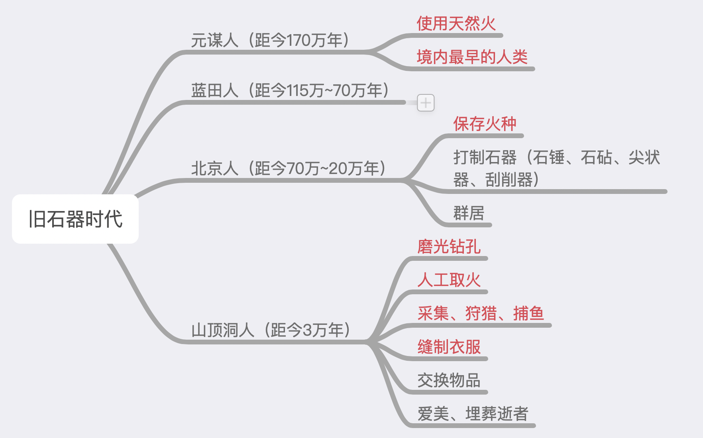
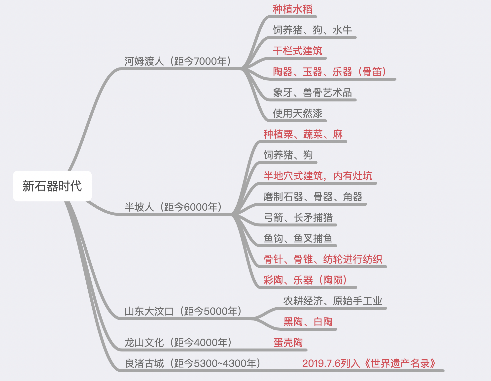
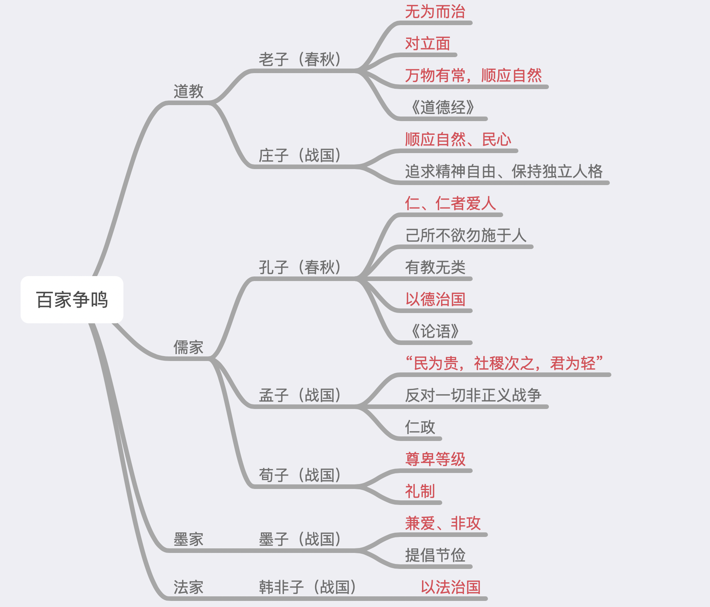
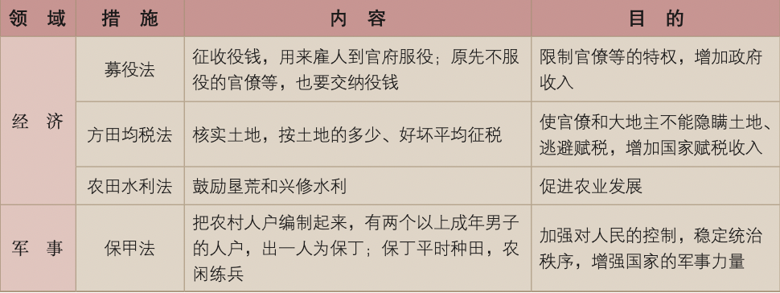

# 【历史】中国古代史

`2023/07/16 12:00:47  by: 程序员·小李`

#### 旧石器时代

#### 新石器时代

世界上`最早的栽培稻、粟和黍`均发现于中国。

原始农业由最初的`刀耕火种`，发展到用`耒耜`等翻土工具进行耕种。🔥 `农作物种植、家畜饲养`的出现以及`聚落、磨制石器`的发展，是原始农业兴起和发展的重要标志。

> 半坡文化的彩陶以红底黑色纹饰为主，纹饰多是几何图案、动植物纹饰，以`鱼纹、鹿纹`为多。

> 以良渚古城为核心的`良渚遗址`，位于浙江省杭州市余杭区，1936年首次发现，良渚古城距今5300—4300年。2019年7月6日，良渚古城遗址被列入`《世界遗产名录》`。
 

#### 炎黄时期

>🔥 **阪泉大战——黄帝与炎帝**
>
>黄帝联合一些部落，在`阪泉`与炎帝展开战争，最后炎帝失败，归顺黄帝，两大部落结成联盟。

> 🔥 **涿鹿之战——炎黄与蚩尤**
>
>炎黄部落与蚩尤部落在`涿鹿`激战，最终打败蚩尤。

炎帝教民`开垦耕种`，`制作生产工具`，种植`五谷和蔬菜`;制作`陶器`，发明`纺织`，会`煮盐`，教人们`交换物品`。制作乐器`琴瑟`，并具有最早的`天文和历法知识`。

🔥 黄帝时期，`仓颉造字、伶伦精通音律、嫘祖缫丝纺织、隶首发明算盘`

> **🔥 禅让制**
>
>尧、舜、禹实行`禅让制`。尧鼓励人们开垦农田，发展历法，适时耕种。舜在位时，制定刑法，完善制度，稳定局势，又派禹治水，解除水患。

> **🔥 大禹治水**
>
> 禹的父亲鲧(gǔn)曾主持治理黄河水患，他用了9年时间都没有成功，后被处死。禹采用`疏导`的方法，`开凿河渠`疏导洪水入海。曾“三过家门而不入”，被尊称为“大禹”。

#### 夏商周

> **🔥 第一个王朝——夏**
>
> `公元前2070年`，`禹`建立中国历史上的第一个王朝——`夏`。夏朝建立了`军队`，制定`刑法`，设置`监狱`。

> **🔥 世袭制代替禅让制，公天下变家天下**
>
> 禹的儿子`启`凭借强大的势力，继承了王位。从此`世袭制代替禅让制`。

夏朝历经 400 多年，`桀`在位时期，国力衰弱，统治残暴，引起民众的反抗。

---

> **🔥 商汤灭夏，建立商朝**
>
> 约`公元前1600年`，商`汤`灭夏，建立商朝，定都亳(bó)。汤任用贤才，发展`农业、手工业和商业`，商朝很快强大起来。

商朝多次迁都，商王`盘庚`时迁到`殷`。为巩固统治，设置`监狱、酷刑`，加强对奴隶和平民的控制。

> **🔥 商纣王荒虐无道，酒池肉林**
>
> 商朝的最后一个王`纣`，他对外征伐，耗费国力，同时修筑豪华宫殿，对百姓征收繁重的赋税，还施用酷刑，残害人民。

---

> **🔥 牧野之战——周武王建周**
>
>公元前1046年，周武王与商军在`牧野`决战，商朝灭亡。周武王建立周朝，定都`镐京`，史称西周。

> **🔥 分封制、宗法制、井田制**
>
>周王根据`血缘关系远近和功劳大小`，分封土地，建立诸侯国。诸侯需要向周王进献贡物，并服从周王调兵。受封者可以在自己的封地内进行再分封，从而确立了周王朝的社会等级制度**“分封制”**。周代的贵族等级分为`天子、 诸侯、卿大夫、士`。
>
> **宗法制**：用父系血缘的亲疏分配国家权力，维护统治秩序，核心是`嫡长子继承制度`
>
> **井田制**：国有土地制度，周王把土地分给各诸侯，受田者只能享用，不能转让、买卖，耕地阡陌交通，如同井字，故称为井田制。

`公元前841年`，周厉王与民争利，引起`“国人暴动”`。

> **🔥 周幽王、褒姒——烽火戏诸侯**
>
>到周幽王(烽火戏诸侯)时，朝政腐败，社会各种矛盾激化。

> **🔥 犬戎族灭西周，周平王建东周**
>
>`公元前771年`，西周王朝被`犬戎族`所灭。后来，周平王东迁`洛邑`，史称东周。

#### 青铜器

> **🔥 商周时期出现青铜器**
>
>商周时期出现青铜器，采用`“泥范铸造法”`。`司母戊鼎`，是迄今世界上出土的`最重的青铜器`，重达832.84千克。

> **🔥 商出现甲骨文——最早的文字**
>
>甲骨文是写在`龟甲和牛、羊等兽骨`上的文字。1899年，清朝人`王懿荣`首次发现甲骨文。甲骨文记载的内容十分丰富，涉及`祭祀、战争、农牧业、官制、刑法、医药、天文历法`等。甲骨文是中国已发现的古代文字中年代最早、体系较为完整的文字，我国有文字可考的历史从`商朝`开始。

#### 春秋时期

> **🔥 春秋时期——铁制农器出现，分封制瓦解**
>
>春秋时期，`铁制农具和牛耕`出现。诸侯国开始设置县、郡，委派官员管理，职位也不再世袭，加强对地方的控制，分封制逐步瓦解。

> **🔥 尊王攘夷，春秋五霸**
>
>春秋时期诸侯国以`“尊王攘夷”`的名义进行征战，争夺霸主。春秋五霸：`齐桓公、晋文公、楚庄王、吴王阖闾、越王勾践`

> 🔥 齐桓公任用`管仲`为相，改革政治、经济、军事，在**葵丘会盟**，成为春秋时期第一个霸主
>
> 🔥 晋文公**城濮之战**，`退避三舍`，大败楚国，成为中原霸主
>
> 楚庄王**一鸣惊人**，问鼎中原
>
> 吴王阖闾以楚国旧臣`伍子胥`为相，齐人`孙武`为将军，成为长江中下游霸主
>
> 🔥 越王勾践**卧薪尝胆**，“苦心人，天不负，三千越甲可吞吴”，灭吴称霸。

#### 战国时期

> **🔥 三家分晋、战国七雄**
>
>战国初年，晋国被`韩、赵、魏`三家大夫瓜分，齐国由大夫`田氏`取代。当时的诸侯国有十几个，其中`齐、楚、燕、韩、 赵、魏、秦`七国的势力较强，史称“战国七雄”。

> **桂陵之战**：历史上一次著名截击战。公元前354年，魏围攻赵都邯郸，次年赵向齐求救。齐王命`田忌、孙膑`率军援救。`孙膑`认为魏以精锐攻邯郸，国内空虚，于是率军`围攻魏都大梁`，使魏将`庞涓`赶回应战。孙膑却在桂陵伏袭，打败魏军，并生擒庞涓。孙膑在此战中避实击虚、攻其必救，创造了`“围魏救赵”`战法，成为两千多年来军事上诱敌就范的常用手段。

> **马陵之战**：公元前343年，魏国发兵攻打韩国，齐威王待韩魏火拼后，派田盼、田婴、孙膑攻打魏国。魏国派太子申抵挡，在马陵全军覆没。随后田盼使用`减灶计谋`，引诱孙膑追击，后孙膑在马陵中伏身亡，齐军大败魏军。

> **长平之战**：秦国散布廉颇投降的谣言，并声称不怕廉颇，怕赵括。赵国换将赵括，变更作战策略，急于求胜。秦国更换白起，利用赵括弱点（纸上谈兵），佯败后退、诱敌深入，最终分割包围、切断粮道，予以歼灭。此役秦军坑杀45万赵军。

> **🔥 商鞅变法**
>
>公元前356年，秦孝公任用`商鞅`主持变法。商鞅推行一系列改革措施，使秦国的国力大为增强，提高了军队的战斗力，一跃成为最强盛的诸侯国，为以后秦国统一全国奠定了基础：
>* 确立`县制`，由国君直接派官吏治理
>* `废除世袭`特权
>* 改革`户籍`制度，加强对人民的管理
>* 严明法度，禁止私斗
>* `废井田，开阡陌`，允许土地自由买卖
>* `重农抑商`，鼓励耕织，生产粮食、布帛多的人可免除徭役
>* `统一度量衡`
>* `奖励军功`，对有军功者授予爵位并赏赐土地

水利工程：春秋楚相`孙叔敖`修建芍陂，战国蜀郡太守`李冰`修建都江堰，韩国的水工`郑国`修建的郑国渠。

>公元前256年，蜀郡郡守`李冰`主持，在成都附近的`岷江`上修建了`都江堰`。都江堰是一座综合性的水利枢纽，使堤防、分洪、排沙、控流等功效合成为一个系统。建成之后，成都平原成为沃野，被称为“天府之国”。

> **🔥 管仲——相地而衰征**
>
>春秋时期，齐桓公任用管仲改革，`相地而衰征`——根据土地多少、好坏征收赋税。

> **🔥 鲁国“初亩税”**
>
>春秋时期，鲁国“初亩税”，按亩征税，这是承认土地私有合法化的开始。

> **🔥 李悝变法——《法经》**
>
>战国时期，`李悝变法`：尽地力之教，发展农业生产，制定中国历史上`第一步比较系统的成文法典`《法经》

#### 百家争鸣

各家学派的代表人物聚众讲学，研讨学术，著书立说。在思想上、政治上的观点不同，学派之间展开激烈的辩论，相互抨击;同时又相互影响，取长补短。历史上称为`“百家争鸣”`。

#### 秦

> **🔥 前221年，秦国建立**
>
>公元前230年，秦国先后攻灭韩、赵、魏、楚、燕、齐六国，统一全国。`公元前221年`，建立秦朝，定都`咸阳`。建立起我国历史上第一个`统一的多民族的`封建国家。

> **🔥 三公九卿、郡县制**
>
>**中央集权制度**：`皇帝`总揽全国`军政大权`。设`丞相、太尉、御史大夫`，分别掌管`行政、军事和监察`事务，最后的决断权由皇帝掌控。
>
>废除分封制，建立**郡县制**。郡的行政长官称`郡守`；郡下设`县`，县的长官称`县令或县长`。郡县的长官都由朝廷`直接任免`。县以下又设`乡、里、亭`等基层组织。

> **🔥 统一文字、货币、度量衡、车辆、道路宽窄**
>
>丞相`李斯`等人**统一文字**，制定`小篆`作为通用文字。
>
>废除六国的货币，以秦国的`圆形方孔半两钱`作为**统一货币**。
>
>以秦制为基础，**统一度量衡制度**， 所有度量衡用器由国家统一监制。
>
>**统一车辆和道路的宽窄**，并修筑贯通全国的道路，使秦朝的陆路交通四通八达。

> **🔥 开凿灵渠**
>
>秦始皇派兵**开凿灵渠**，统一岭南及东南沿海地区。

> **🔥 北击匈奴，修建长期**
>
>秦始皇派大将`蒙恬`北击匈奴，并**修筑长城**。长城西起`临洮`，东到`辽东`，这就是举世闻名的“万里长城”。

> 秦朝的疆域，东至东海，西到陇西，北至长城一带，南达南海，是当时世界上的大国之一。

---

>**王侯将相宁有种乎？——陈胜吴广起义**
> 
> `公元前209年`，900多个农民被征发去`渔阳`戍守长城。途经大泽乡时，遇上大雨，不能按期到达。按照秦律，戍守误期要被处死。领队人`陈胜和吴广`认为，`“壮士不死即已，死即举大名耳，王侯将相宁有种乎!”`，在他们的号召下，大家决心反抗秦朝的残暴统治。中国历史上`第一次农民大起义`——陈胜吴广起义爆发了。在攻占陈县后，陈胜称王，建立了“张楚”政权。后在秦军的强大攻势下，起义军缺乏后援，最终失败。

>**巨鹿之战——以少胜多**
> 
> 项羽在`巨鹿之战`中`以少胜多`，将秦军的主力歼灭。刘邦抓住时机，率军直抵秦都咸阳。公元前207年，秦朝的统治者在起义军的包围下，被迫出城投降，秦朝灭亡。

>**垓下之战——四面楚歌、乌江自刎**
> 
> 项羽自封为`西楚霸王`，封刘邦为`汉王`。双方为争夺帝位，展开争战，史称`“楚汉之争”`。项羽虽势力强大，却刚愎自用，一味依赖武力；刘邦注重收揽民心，善用人才，力量逐渐由弱变强。最终，刘邦的军队将项羽及部下包围在垓(gāi)下。项羽兵败，突围后自刎，刘邦取得了最终的胜利。

#### 西汉

>**刘邦建立西汉**
> 
>刘邦（汉高祖）于`公元前202年`建立汉朝，定都`长安`，史称西汉。

为了巩固政权和稳定社会局势，汉高祖采取了**休养生息**的政策。
* 下令“兵皆罢归家”，让士兵`还乡务农`，以增加农业劳动力
* 采取`轻徭薄赋`

>**文景之治——以农为本、以德化民、勤俭治国**
> 
>汉文帝和汉景帝注重农业生产，提倡**以农为本**，要求各级官吏关心农桑，并进一步减轻赋税和徭役，把田赋降到了`三十税一`。文帝和景帝时期，重视**“以德化民”**，废除了一些严刑峻法，如断残肢体的肉刑。他们还提倡**勤俭治国**，反对奢侈浮华。汉文帝、汉景帝时期，政治清明，经济发展，国力增强，积累了大量的钱粮，库存的粮食和铜钱非常充盈，史称“文景之治”

---

>**汉武帝——推恩令**
> 
>汉武帝采纳`主父偃`的**“推恩”**建议，下诏规定诸侯王除以嫡长子继承王位外，可将封地再次分封给其子弟作为侯国，由皇帝制定封号。侯国越来越多，诸侯王的封地和势力越来越小。汉武帝随后又找各种借口`削爵、夺地甚至除国`，严厉镇压他们的叛乱。诸侯王从此一蹶不振，中央大大加强了对地方的控制。

>**汉武帝——刺史制度**
> 
>汉武帝还建立`刺史`制度，把全国划分为13个州部，每州部派刺史一人，代表朝廷`监视`州部内的地方官吏、豪 强及其子弟，严禁他们为非作歹。

>**汉武帝——罢黜百家、独尊儒术，兴办太学**
> 
>汉武帝接受`董仲舒`的建议，把`儒家学说`立为正统思想，使儒家`忠君守礼`的思想成为大一统政权的精神支柱。汉武帝还在长安兴办`太学`，以儒家的`《诗》《书》《礼》《易》《春秋》`作为教材，培养统治阶级需要的`儒学人才`，儒士也进入各级政权机构。

>**汉武帝——回收铸币权、盐铁官营、统一调配物资，平抑物价**
> 
>汉武帝把`铸币权收归中央`，统一铸造`五铢钱`;还在全国各地设`盐铁官`，把煮盐、冶铁等经营权`收归国有`，实行盐铁官营、专卖;又在全国范围内`统一调配物资，平抑物价`。

汉武帝派`卫青、霍去病`率兵与匈奴进行了三次大战。

> 公元前119年的`漠北战役`，是对抗匈奴的高潮。汉武帝派大将卫青、霍去病率精骑出击匈奴。卫青和霍去病分道北上。卫青行进千余里，穿越浩瀚的大沙漠，在`漠北`同匈奴主力相遇。双方激战一天，未分胜负。临近黄昏，卫青派兵从左右迂回包抄，把匈奴单于的营阵紧紧包围起来。单于慌忙带着数百名骑兵突围逃走。汉军追击 200 多里，大胜而归。霍去病也挥师北进，追击匈奴兵。匈奴经过漠北战役的沉重打击，再无力与西汉对抗，部分匈奴人开始西迁。

`汉武帝`从政治、思想、经济和军事等方面巩固了大一统的局面，使西汉王朝开始进入`鼎盛时期`。

> 📣 扩展知识——汉朝察举制
>
> 汉文帝时，开始采用由各地推荐人才的方法。汉武帝在位时期，将这种新的选官方法定为制度，这就是**“察举制”**。察举制是由各郡国每年向朝廷推举`有道德、有才能`的人，经过考察，授予官职。有时汉武帝还亲自出题考察， 如董仲舒就是通过对策而被任用的。通过察举制，西汉王朝选拔了一大批有杰出才能的人。

#### 东汉

>**王莽篡权、刘秀建东汉**
> 
>西汉后期，朝政越来越腐败。公元9年，外戚`王莽`夺取政权，建立新朝，西汉灭亡。王莽的施政加剧了社会动荡，激起各地农民起义。王莽政权被农民起义推翻后，西汉宗室`刘秀（光武帝）`在公元25年称帝，定都`洛阳`，史称东汉。

>**“光武中兴”**
> 
>光武帝下令释放奴婢，减轻农民的负担，减轻刑罚；合并郡县，裁减官员，加强对官吏的监督，惩处贪官污吏;又允许北方少数民族内迁，缓和民族矛盾。光武帝统治后期，社会出现了比较安定的局面，经济得到恢复和发展，史称**“光武中兴”**。

> 东汉中期以后，继位的皇帝大多年幼，无法主政，大权就由皇帝的母亲太后主持。太后重用自己的亲戚，导致外戚的势力膨胀。皇帝长大后，不甘心被外戚摆布，想亲自行使君权，就依赖身边的宦官，设法除掉外戚，宦官由此得到宠信，把持朝政。如此循环往复，形成了东汉后期`外戚与宦官交替专权`的局面。他们轮流把持朝政，任用亲信，诛杀异己，导致政治腐朽不堪，正直的官员受到排挤陷害，社会混乱，人民遭殃。外戚、宦官交替专权的恶性循环，动摇了东汉的统治，东汉王朝走向衰亡。

> **黄巾起义**：184年，张角等领导黄巾起义。这次农民起义，沉重打击了东汉的统治，使其一蹶不振。

#### 两汉丝绸之路

> 张骞出使西域：公元前138年，张骞率领随从西出`长安`，出使西域。张骞把在西域各国的见闻，以及各国想与汉朝往来的愿望，向汉武帝进行汇报，使汉朝了解到西域的具体情况。
>
> 公元前119年，张骞再次率领300多人的使团，带着万头牛羊，以及金币、丝绸等财物，走访了乌孙等西域许多国家。西域各国也认识到汉朝的富足与强大，纷纷派使节来到长安，促进了汉朝与西域各国之间的相互了解与往来。

开辟通往西域的道路后，东西方的经济文化交流日趋频繁。商人们载着汉朝的丝绸等货物，从`长安`出发，穿过`河西走廊`，经西域运往`中亚、西亚`，再转运到更远的`欧洲`;又把西域的物产和奇珍异宝运到中原。这条沟通欧亚的陆上交通道路，就是著名的“丝绸之路”。汉朝的`丝绸、漆器`等物品，以及`开渠、凿井、铸铁`等技术传到西域;西域的`核桃、葡萄、石榴、苜蓿、良种马、香料、玻璃、宝石`等，以及多种`乐器和歌舞`等传入中原。丝绸之路是古代东西方往来的大动脉，对于中国同其他国家和地区的贸易与文化交流，起到了极大的促进作用。

汉朝时已形成了多条海上航线。从`东南沿海港口`出发，经`中南半岛`南下，绕过`马来半岛`，穿过`马六甲海峡`，通往`孟加拉湾沿岸`，最远抵达`印度半岛南端和锡兰`。这条航线被称为“海上丝绸之路”。

公元前60年，西汉朝廷设置`西域都护`，作为管理西域的最高长官，管辖西域36国，都护府设在`乌垒城`。西域都护颁行汉朝的号令，调遣军队，征发粮草，对西域地区进行有效的管辖。西域都护的设置，标志着西域正式归 属中央政权，其管辖范围包括今`新疆及巴尔喀什湖以东、 以南`的广大地区。

西汉末年，匈奴重新控制了西域，汉朝与西域的往来中断。东汉明帝时，派兵出击匈奴，并派`班超`出使西域。班超克服重重困难，使西域各国重新与汉朝建立联系。他得到了西域各国的信任，长期`留守西域`。班超在西域期间，还派`甘英`出使大秦。甘英到达安息后受阻，未能继续前行，但此行开辟了通往西亚的路线。班超经营西域30多年，到71岁时才回到中原，不久去世。他的儿子`班勇`继承父业，再次出使西域。

#### 两汉科技与文化

西汉时期，人们已经懂得了造纸的基本方法。`东汉时`，宦官**蔡伦**总结前人经验，改进造纸工艺，纸的质量大大提高。 

> `春秋战国`之际的名医**扁鹊**，用`针刺、按摩、汤药等`治疗疾病。他总结出来的`望、闻、问、切`四种诊断疾病的方法。战国问世、西汉编定的《黄帝内经》，是我国现存较早的重要医学文献。

**张仲景**是`东汉末年`的名医，写成了《伤寒杂病论》一书。这部著作发展了`中医学`的理论和治疗方法，提出在诊断上要`辨证分析病情，然后对症治疗`。他还发展了`“治未病”`的思想，提倡`预防疾病`。张仲景是**中医临床理论**体系的开创者，为**中医药学**的发展作出巨大贡献，被后世称为**“医圣”**。

`东汉末年`的另一位名医**华佗**，不仅擅长用`针灸、汤药`为人治病，而且能实施**外科手术**。他发明了**“麻沸散”**。还模仿`虎、鹿、熊、猿、鸟`五种动物的活动姿态，创编出了**“五禽戏”**。

《史记》的作者，是我国古代伟大的史学家`司马迁`。《史记》是中国古代`第一部纪传体通史`，记述了从传说中的`黄帝`到`汉武帝`时的史事。书中记录了帝王将相的历史活动，肯定他们的功绩，也揭露了他们的腐朽和罪恶。 

东汉末年，张角创立了`太平道`，以治病来传道。在`汉中、巴蜀`地区还有张陵创立的`五斗米道`，人们只要出五斗米，就可入道或治病。太平道和五斗米道是早期道教的不同派别，在教义和传播方式上相似，受到下层民 众的信奉。

佛教产生于公元前6世纪的古代印度。创始人是乔达摩·悉达多，又称`释迦牟尼`。张骞通西域后，佛教通过丝绸之路传入中国。`东汉明帝时`，西域的僧人运载佛经到洛阳，得到上层统治阶级的扶持，佛教逐步在社会上传播开来。佛教的传入，丰富了中国文化，在社会、思想、文学以及建筑、雕刻、绘画等方面产生深远影响。

#### 三国时期——魏蜀吴

东汉末期，占据`河南一带`的曹操把`汉献帝`从都城`洛阳`接到`许昌`，借皇帝的名义号令天下，并招揽各种人才。在农业生产上，曹操采用`屯田`的措施，组织军队和流亡的民众从事农业生产，既解决了大批流民的生计，又筹集了军粮。

当时占据黄河以北的`袁绍`，兵多粮足，实力强大。200年，双方在`官渡`进行决战。曹操采取声东击西、 各个击破的战术，偷袭袁军的粮囤，烧掉其全部军粮，迅速歼灭袁军主力， 为以后统一北方打下基础。

> **赤壁之战**：208年，曹操挥师南下，准备进而消灭南方的割据势力，统一全国。曹军占领荆州后，刘备率军从樊城退往夏口。他派诸葛亮联络孙权，共谋抗曹之计。孙权听从将军周瑜和诸葛亮的意见，决定与刘备联合迎战曹军。两军在赤壁对峙。针对曹军不习水战、船舰连接在一起的弱点，周瑜采纳部下`黄盖`的建议，由黄盖向曹操诈降并用火攻。黄盖送去“降书”后，率领几十艘船，上面装载着浇上油的柴草，驶向对岸。曹军官兵以为是来降的吴军，毫无防备。当来船离曹营不远时，突然同时点火，借着风力冲进曹营的船队，不仅烧毁了曹军船舰，还延及岸上营寨，烧死和落水的士兵无数。周瑜随即率领军队攻杀过来，曹军大溃，曹操带着败兵北撤。赤壁之战对当时整个局势有关键性的影响，为三国鼎立局面的形成奠定了基础。

赤壁之战后，曹操转而经营`关中`，完成了北方的统一。刘备占领了`湖北、湖南`的大部分以后，又向西南发展，占取`四川、云贵`地区。孙权一边把他的统治范围延伸到`福建、广东`，一边又抢夺了刘备在`湖北、湖南`的势力范围。220年，曹操的儿子`曹丕`废掉汉献帝，在`洛阳`称帝，国号`魏`。221年，`刘备`在`成都`称帝，国号`汉`，史称蜀汉。229 年，`孙权`称帝， 吴国建立1，定都建业。三国鼎立的局面形成。

曹魏重视`农业生产`，大力`兴修水利`。孙吴开发江东，`造船业`发达，发展了`海外贸易`。230 年，孙权派将军 `卫温`率领万人船队到达夷洲，加强了大陆与台湾的联系。蜀汉在丞相诸葛亮的治理下，发展经济，改善民族关 系，加速了西南地区的开发。

#### 西晋

三国后期，魏国实力增强，吴、蜀两国日益衰落。263年，魏灭蜀。不久，司马懿逐渐控制了魏国的军政大权。266年，司马懿的孙子`司马炎`自立为帝，改国号为`晋`，以`洛阳`为都，史称西晋。司马炎就是`晋武帝`。280 年，西晋灭吴，统一了全国。西晋王朝制定了一系列优待大地主、大贵族的政策，以保护他们的利益。

> **八王之乱**：西晋初年，晋武帝大封同姓诸王。后来，晋武帝又陆续派遣诸王据守州郡重镇。这些出镇的宗室诸王，既手握重兵，又掌管民事，势力日益强大。晋武帝的儿子`晋惠帝`昏庸无能。他在位时，手握重兵的`八个封王`为了争夺中央政权，先后起兵，相互混战，史称**“八王之乱”**。这场内乱导致米价飞涨，人民饱受痛苦。八王之乱历时十几年，西晋从此衰落。中原人口大量死亡，幸存者纷纷逃离，其中逃往南方的即数以十万计，形成我国古代历史上 第一次大规模的人口迁徙高潮。

东汉、魏、晋时期，我国北方的游牧民族不断内迁。原来生活在西北的`氐族和羌族`，由西向东迁入`陕西关中`;分布在蒙古草原上的`匈奴族和羯族`，由北向南迁到`山西`一带;而`鲜卑族`有一部分迁到`辽宁`，有一部分迁到`陕西及河套地区`。西晋统治腐朽，向内迁各族人民收取重税，征兵派役，甚至掠卖少数民族人民为奴婢。这些暴政激起了内迁各族人民的强烈反抗。一些少数民族的首领乘机起兵反晋。从4世纪初到5世纪前期，北方各族统治者先后建立了许多政权。历史上把北方主要的 15 个政权，连同西南的`成汉`，总称为“十六国”。

十六国时期，各国彼此攻战，经济遭到严重破坏，人民颠沛流离。4世纪后期，氐族`苻氏`建立的前秦逐渐强盛，并统一了黄河流域。氐族贵族深受汉族文明影响，苻坚汉文化修养很高。苻坚任用汉人`王猛`为丞相，锐意改革。他们整顿吏治，厉行法治，加强集权，招抚流民，减赋禁奢，还大力兴办学校，提倡`儒学`。那时候，前秦境内胡汉之间的对立和矛盾有所缓和。

> 内迁的各族建立的政权频繁更替，有`前赵、成汉、前凉、后赵、前燕、前秦、后燕、后秦、西秦、后凉、南凉、南燕、西凉、北凉、夏、北燕`十六国。十六国后期，`鲜卑拓跋氏`建立的北魏，逐渐统一北方。北魏又分裂为东魏、西魏。后来，北齐取代东魏，北周取代西魏，最后北周又灭掉北齐。对这些王朝，历史上称之为“北朝”。

> “风声鹤唳”“草木皆兵”“投鞭断流”“东山再起”这 些成语，其典故都与淝水之战有关。
>
> **淝水之战**：383 年，苻坚不顾一致反对，强征各族人民当兵，拼凑了步兵 60 余万、骑兵 27 万，浩浩荡荡南 下，企图灭亡东晋，统一中国。东晋团结一致，从容应对，以8万精兵应战，在淝水与前秦军前锋隔岸对峙。在决战即将爆发时，东晋将领提出要前秦军队稍稍后撤，以便晋军过河交战。苻坚认为在晋军渡河时发动突然袭击，定能一举获胜，随即命令军队后撤。不料，当前秦军后撤时，有人在阵后大喊:“秦兵被打败了!”前秦军顿时阵脚大乱，自相践踏，一溃而不可收拾。晋军乘机发动猛烈攻击，打败前秦军。苻坚中箭负伤，带领残兵逃回北方。淝水之战是中国古代又一次`以少胜多`的著名战役。淝水之战以后，前秦很快土崩瓦解，北方再度陷入分裂和混战的状态。

#### 东晋

316年，内迁的匈奴人灭掉西晋。随后，镇守长江下游的皇族`司马睿`于317年重建晋王朝，以`建康`为都城，史称`东晋`。东晋初期，多次进行北伐，曾收复了黄河以南的部分地区。由于东晋朝廷对北伐将领心存疑虑，多方牵制，使北伐缺少后援，最终未能恢复中原。东晋成功抵御了来自北方的军事威胁，统治局面相对稳定，社会经济有所发展。东晋末年，政权落入武将手中。 420 年，东晋灭亡。

420—589 年，中国南方政权更迭频繁，相继出现`宋、 齐、梁、陈`四个王朝。这些王朝都在`建康`定都，历史上统 称为“南朝”。宋是南朝疆域最大的朝代。宋武帝、宋文帝在位的30余年时间里，轻徭薄赋，江南民殷国富，社会比较安定。梁武帝`萧衍`从地方起兵夺取帝位后，放纵皇室成员和官僚大地主盘剥平民百姓，政治日益败坏。后来发生了大规模的叛乱，建康失守，江东最富庶的地区遭到烧杀抢掠，导致千里绝烟，人迹罕见。从此，在南北实力对比中，南朝处于明显劣势。

西晋末年以来，大批北方人民为躲避战祸南下。北方人的南迁，给江南地区输送了大量的劳动力，也带来了中原先进的生产工具和生产技术，从而使自然条件优越的江南地区得到开发，经济迅速发展。大量荒地被开垦出来，耕地面积不断增加，并兴修了很多水利工程。农业生产技术也有了很大的改进，包括推广和改进`犁耕`，实行精耕细作，以及推广`选种、育种、田间管理和施用粪肥`等比较先进的生产技术。例如，水稻由原来的直播变成育秧移栽，这是水稻生产技术的重大进步;普遍实行了`麦稻兼作`，五岭以南地区还种植了双季稻，使粮食产量有了很大的提高。此外，还发展`种桑养蚕、培植果树、种植药材`等，实行农业多种经营。南方的手工业也有了快速的进步。在`缫丝、织布、制瓷、冶铸、造船、造纸、制盐`等方面都有显著的发展。农业和手工业的发展，促进了商业的交流和城市的繁荣。南朝时的建康，人口众多，是当时商业最为活跃的大都市。

#### 北魏政治

4世纪后期，游牧在阴山地区的`鲜卑族拓跋部`迅速崛起，建立北魏。439年，北魏统一北方，结束了十六国以来分裂割据的局面。

北魏`孝文帝`即位后，立志用`文治`移风易俗。494年迁都洛阳，把百余万包括鲜卑族在内的北方各族人民迁到中原。他进一步推行`汉化`措施， 规定官员在朝廷中`必须使用汉语`，禁用鲜卑语;以`汉服代替鲜卑服`;改鲜卑 姓为`汉姓`;鼓励鲜卑贵族与汉人贵族`联姻`等。这些措施，促进了民族交融， 也增强了北魏的实力。

魏晋以来，内迁的各族人民向汉族人民学习`农业技艺`，逐渐将原来从事畜牧业生产转变为从事农业生产。汉族人民向北方各族人民学习`畜牧经验`，还学习和接受他们的食物、服装、用具等。十六国北朝政权的统治者，与汉族士人合作，沿袭中原地区原有的统治方式，实行`君主专制`制度。北朝后期，我国北方出现了各民族的大交融。各民族不仅在经济上密切交往，在文化上的交流也日益频繁。西晋时期，内迁各族大多使用汉语;西北民族的乐器、歌舞等也受到汉族人民的喜爱。随着经济、文化的交流与融汇，思想感情日益沟通，以往的“胡”“汉”观念逐渐淡薄，民族之间的隔阂与偏见逐渐减少。

#### 魏晋南北朝的科技文化

`北朝`——**贾思勰**——**《齐民要术》**——我国现存`最早的一部完整的农书`。该书总结了农、林、牧、副、渔等生产技术。贾思勰强调农业生产要`遵循自然规律`，种植农作物必须`因地制宜，不误农时`;要改进生产技术和工具; 还提出了`多种经营和商品生产`等重要思想。

`南北朝`——**祖冲之**——运用刘徽的方法，把圆周率`精确到小数点以后的第七位数字`；创制历法**《大明历》**，后来由朝廷正式颁行；设计制造了`指南车、水碓磨、千里船`等，史书上称他造的千里船能“日行百余里”，指南车“圆转不穷，而司方如一”。

>📣 三国时期魏国的数学家`刘徽`最早提出了具有“极限”求圆周率的方法。

`锺繇和胡昭`是曹魏时的书法名家，他们兼采汉末众家书法之长，都擅长`行、草、隶书`，并形成了自己的风格。锺繇独创`楷书`书法，后人称他的楷书为**绝世之作**。西晋设置书博士，教学生学习书法，规定用锺、胡书法作为标准书体。

东晋——**王羲之**——`行、草、楷书`尤为精湛。当时的人就称赞他的书法为**古今之冠**，笔势`“飘若浮云，矫若惊龙”`。代表作是**《兰亭集序》**，达到收放自如、浑然天成的境界。《兰亭集序》被称为**“天下第一行书”**。被后人誉为**“书圣”**。

北魏统治者`崇尚汉族文化`，重视书法艺术，流传下来的`碑刻书体`，苍劲厚重，粗犷雄浑。

魏晋南北朝时期的绘画，由于佛教盛行，宗教画占了主要地位。`东晋`的**顾恺之**是最著名的画家，他擅长的`人物画`，线条优美活泼，人物传神，富有个性。顾恺之一生的创作很多，流传下来的作品有**《女史箴图》和《洛神赋图》**。

南北朝时期，统治阶级为宣扬`佛教`，在一些地方的山崖上，开凿了许多石窟。其中最著名的是山西大同的**云冈石窟**和河南洛阳的**龙门石窟**。

> 敦煌莫高窟是世界上现存规模最大，历史最长久，内容最丰富、保存最完好的佛教石窟艺术宝库。

#### 大事年表

|时间|事件|
|:--:|:--:|
|距今约 170 万年|元谋人|
|距今约 70 万—20 万年|北京人|
|距今约3万年|山顶洞人|
|距今约 7 00O 年|河姆渡文化|
|距今约 6 000 年|半坡文化|
|距今约 6 000—4 000 年|传说中的炎帝、黄帝、尧、舜、禹时期|
|约公元前 2070 年|夏朝建立|
|约公元前 1600 年|商汤灭夏，商朝建立|
|公元前 1046 年|周武王灭商，西周开始|
|公元前 841 年|国人暴动|
|公元前 771 年|西周灭亡|
|公元前 770 年|周平王迁都洛邑，东周开始|
|公元前 356 年|商鞅开始变法|
|公元前 221 年|秦灭六国，统一中国|
|公元前 209 年|陈胜、吴广起义爆发|
|公元前 207 年|秦朝灭亡|
|公元前 202 年|西汉建立|
|公元前 138 年| 张骞第一次出使西域|
|公元9年|王莽夺取西汉政权|
|公元25年|东汉建立|
|东汉明帝时|班超出使西域|
|184 年|黄巾起义爆发|
|200 年|官渡之战|
|208 年|赤壁之战|
|220 年|魏国建立，东汉灭亡|
|221 年|蜀国建立|
|229 年|吴国建立|
|230 年|吴派卫温等率军队到夷洲|
|266 年|西晋建立|
|280 年|西晋灭吴，统一全国|
|316 年|西晋灭亡|
|317 年|东晋建立|
|383 年|淝水之战|
|420 年|东晋灭亡|
|439 年|北魏统一北方|
|494 年|北魏孝文帝迁都洛阳|

#### 隋

**杨坚建立隋朝**：北周末年，外戚`杨坚`掌握大权。581年，杨坚夺取北周政权，建立隋朝，以`长安`为都城，杨坚就是隋文帝。589年，隋文帝灭掉陈朝，统一全国，结束了长期分裂的局面。隋统一后，发展经济，编订户籍，统一南北币制和度量衡制度；加强中央集权，提高行政效率。这一系列措施，促进了社会经济的迅速恢复和发展，使人口数量和垦田面积大幅度增长，隋朝成为疆域辽阔、 国力强盛的王朝。

**开凿运河**：`隋炀帝`开凿了一条贯通南北的大运河。以洛阳为中心，北抵涿郡，南至余杭，连接了海河、黄河、淮河、长江和钱塘江五大水系，全长2700多千米。大运河的开通，加强了南北地区政治、经济和文化交流。

魏晋南北朝时期，官吏的选拔权由上层权贵垄断，选官看重门第，不太注重才能。隋文帝即位后，`废除了前朝的选官制度`，注重考察人才的学识，初步建立起通过考试选拔人才的制度。`隋炀帝`时，`进士科`的创立，标志着**科举制**的正式确立。此后，科举制成为历朝选拔官吏的主要制度，一直维持了约1300年。

隋文帝厉行节俭，隋炀帝，好大喜功，不恤民力，又纵情享乐，奢侈无度，终于导致大规模的农民起义。在起义军的打击下，隋朝的统治面临瓦解。618年，隋炀帝在**江都**被叛军杀死，盛极一时的隋朝随之灭亡。

中国古代桥梁建筑技术高超。隋朝杰出工匠**李春**设计并主持建造的`赵州桥`，是世界上现存最古老的石拱桥之一。

#### 唐

隋炀帝被杀后，618年，`李渊`称帝，建立唐朝，定都`长安`，随后消灭了各支起义军和割据势力，平定了全国。

626年，李世民即位，次年改年号为`“贞观”`，他就是历史上著名的`唐太宗`。

唐太宗开创了唐朝的盛世局面。他勤于政事，虚心纳谏，从善如流。大臣`魏征`敢于直言，前后进谏200多次。唐太宗广纳贤才，`房玄龄`善于谋略，`杜如晦`敢于决断，他们都是贞观时期著名的宰相。

> **唐太宗——“贞观之治”**
>
>贞观时期政治清明，经济进一步发展，国力增强，文教昌盛，史称**“贞观之治”**：
>* 在政治上，进一步完善三省六部制（三省:中书、门下、尚书;六部:吏、户、礼、兵、刑、工。），明确中央机构的职权及决策程序;制定法律，减省刑罚;增加科举考试科目，鼓励士人报考，进士科逐渐成为最重要的科目;严格考察各级官吏的政绩。
>* 在经济上，减轻人民的劳役负担，鼓励发展农业生产。

武则天是`唐高宗`的妃子，多谋善断。她成为皇后以后，与唐高宗共掌朝政。唐高宗去世后，武则天相继废掉两个已经做了皇帝的儿子，自己取而代之，改国号为`周`。她是中国历史上`唯一的女皇帝`。大力发展科举制，`创立殿试`制度。她继续推行贞观以来减轻人民负担的政策和措施，`重视发展生产`。她在位期间，社会经济得以持续发展，人口持续增长，边疆得到巩固和开拓。

> **唐玄宗——“开元盛世”**
>
> 唐玄宗即位以后，稳定政局，励精图治，重用贤能，在贤相`姚崇`和`宋璟`的辅佐下，实行了一系列改革:整顿吏治，裁减冗员;发展经济，改革税制；注重文教，编修经籍。唐玄宗在位的前期，年号为“开元”，当时政治稳定，经济繁荣，国库充盈，民众生活安定，唐朝的国力达到前所未有的强大，进入了鼎盛时期，历史上称为“开元盛世”。

唐朝前期，经济发展迅速。在农业方面，垦田面积逐渐扩大，农业生产技术不断改进，发明并推广了一些重要的生产工具，如曲辕犁和筒车。唐朝修建了很多水利工程。唐朝纺织业品种繁多，尤以`丝织`工艺水平最高，其中蜀锦以色彩艳丽、纹饰精美冠于全国。陶瓷器生产水平也很高，越窑的青瓷如冰如玉，邢窑的白瓷类雪似银，闻名中外的唐三彩，造型精美，色彩亮丽。此外，造船业、矿冶业、造纸业等都颇具规模。唐朝的商业十分繁荣，水陆交通发达，贸易往来频繁，出现了一些繁华的大都市。都城长安规模宏伟，布局严整对称，街道宽敞整齐，商业繁荣，既是当时中国政治、经济和文化交往的中心， 也是一座国际性的大都会。

`唐太宗`发兵击败`东突厥`，加强了对西域的统治。他实行开明的民族政策，得到周边各族的拥戴，被尊奉为各族的`“天可汗”`，意即各族共同的君主。`唐高宗`时，唐朝联合`回纥(hé)`灭西突厥，中央政权完全统一西域。

唐朝先后设置`安西都护府`和`北庭都护府`，管辖西域的天山南北地区。

唐朝时期，汉族和一些北方少数民族杂居、通婚，民族之间的交融进一步发展。在朝廷中，有很多重要的官职由 少数民族人士担任。东北、西北、西南等地区一些少数民族建立的政权与唐朝关系密切，如唐玄宗封渤海国首领为渤海郡王，封回纥首领为怀仁可汗，封南诏首领为云南王。

唐太宗时，吐蕃赞普`松赞干布`统一了青藏高原的各个部落，定都逻些，实行了一系列发展生产、完善制度的措施。他仰慕中原文化，多次派使者到唐朝求婚。唐太宗同意将`文成公主`嫁给他，并派专使护送文成公主远行。641年，文成公主入藏时，带去了`蔬菜种子、茶叶、丝绸、工艺品以及佛经、医药、历法、科学技术`等方面的书籍。松赞干布为了更好地学习中原文化，派遣贵族子弟到长安学习，还请求唐朝给予蚕种，派遣掌握各种专业技能的工匠。唐蕃和亲促进了吐蕃经济和社会的发展。

唐朝时期的社会风气比较开放，充满活力，人们多显示出一种昂扬进取、 积极向上的精神风貌。当时的一些妇女受过文学、音乐等方面的教育，喜好骑 马、打球、拔河、射箭、弈棋等活动。当时的社会风气兼容并包，人们在衣食住行等方面多受西北少数民族习俗的影响，刚健豪迈的尚武风气盛行一时。

唐朝诗坛有李白、杜甫、白居易等。李白的诗歌颂祖国山河的壮美，抒发了昂扬的进取精神，表现出蔑视权贵、超凡脱俗的风骨。他的诗`飘逸洒脱`，充满想象力和感染力，具有浓郁的`浪漫情怀`，李白因此享有`“诗仙”`的美誉。杜甫诗风淳朴厚重，很多诗作反映了战争和政治腐败给人民带来的痛苦，抒发`悲愤凄婉`之情。由于杜甫的诗反映了历史的真情实况，故有“诗史”之称，他被誉为`“诗圣”`。白居易的诗`直面社会现实`，揭示了统治者的腐化和人民的疾苦。他的诗歌平易近人，通俗易懂，妇孺都会吟诵，深受大众欢迎。

唐朝书法名家辈出，最著名的是`颜真卿、柳公权和欧阳询`等。颜真卿的字端正劲美，雄浑敦厚;柳公权的字方折峻丽，笔力劲健。唐朝绘画的题材和类型广泛，有人物画、山水画、花鸟画以及宗教画，著名的画家有`阎立本、吴道子`等。阎立本的人物画，人物形态各异，神形兼备;吴道子的画落笔雄劲，风格奔放。当时的音乐、舞蹈吸收了周边民族的艺术精华，多姿多彩，还涌现出一批技艺超群的舞蹈家、歌唱家和乐器演奏家。

唐朝时期，中国和日本的交流非常频繁。日本派遣使节(“遣唐使”)到中国，他们把唐朝先进的`制度、天文历法、文字、典籍、书法艺术、建筑技术`等传回日本，对日本社会的发展产生了深远的影响。`鉴真`是扬州大明寺的高僧，接受日本僧人的邀请东渡日本，第6次东渡，终于在754年抵达日本。他在日本传授佛经，还传播中国的`医药、文学、书法、建筑、绘画`等，为中日文化交流作出了卓越的贡献。

新罗强盛以后，派遣使节和大批留学生到唐朝学习中国文化。许多新罗商人来到中国经商，新罗物产居唐朝进口首位。新罗仿唐制建立了政治制度，采用`科举制`选拔官吏，还引入了中国的医学、天文、历算等科技成就。朝鲜半岛的`音乐`也传入中国，不仅在唐朝宫廷演出，而且广泛流行于民间。

`贞观初年`，高僧`玄奘`西行前往天竺取经，不畏艰险，历经磨难，经过4年的长途跋涉到达天竺。他遍访天竺的名寺，研习佛法，曾在佛学最高学府`那烂陀寺`游学，成为远近闻名的佛学大师。玄奘携带大量佛经回到长安，此后主持译经工作，为中国佛教的发展作出重大贡献。根据他的口述，由弟子记录成书的`《大唐西域记》`，记载了他游历过的 100 多个国家和地区的山川风物及社会习俗，是研究中外交流史的珍贵文献。

755年，边将`安禄山`借口朝廷出现奸臣，和部将`史思明`一起发动叛乱，史称**“安史之乱”**。太子李亨北上灵武，被拥立为帝，即`唐肃宗`。唐朝将镇守西北地区的精兵悉数内调，并在北方少数民族军队的援助下，最终于763年平乱。唐朝的国势从此由盛转衰，各种矛盾越来越尖锐，逐渐形成`藩镇割据`的局面。

唐朝后期，人民赋役繁重，发动了大规模起义。起义军在`黄巢`的率领下，转战南北，并攻入长安，建立政权，给唐朝统治以致命的打击。原为农民起义军将领的朱温，后投降唐朝，被封为节度使，与其他藩镇联合镇压了黄巢起义。907年，`朱温`建立了后梁政权，唐朝至此灭亡。

唐朝灭亡后，北方黄河流域先后出现后梁、后唐、后晋、后汉、后周五个政权，南方地区出现吴、南唐、吴越、前蜀、后蜀、楚、闽、南汉、南平九个政权，再加上北方割据太原的北汉，史称“五代十国”。

#### 宋

960年，后周大将`赵匡胤`在陈桥驿发动兵变，他的部下拥立他当皇帝。赵匡胤随即回师夺取后周政权，改国号为宋，以开封为东京，作为都城，史称北宋。赵匡胤就是`宋太祖`。宋太祖和他的后继者依照先南后北的统一方针，陆续消灭了南方割据政权，结束了中原和南方的分裂割据局面。

宋太祖加强中央集权。他解除禁军高级将领的兵权，控制对军队的调动，使禁军将领有握兵之重而无发兵之权。他还经常调换军队将领，定期换防，割断将领与士兵和地方的联系。在中央，采取**分化事权**的办法，削弱相权。宰相往往不止一人，在宰相之下又设相当于副宰相的若干人，与宰相共同议政;还设立多重机构，分割宰相的军政、财政大权。在地方，宋太祖为加强控制，派文臣担任各地州县的长官，陆续取代原来藩镇手下的爪牙。为防止知州的权力过大难以控制，实施三年一换的制度，频繁调动州县长官;还在各州府设置通判，以分知州的权力。宋太祖还下令取消节度使收税的权力，除各州留一部分用作地方的必要支出外，其余一切税收由中央掌控。后来又陆续在地方设置转运使，把地方财赋收归中央。通过上述措施，宋朝把中央集权强化到前所未有的程度，皇权大大加强。

宋太祖有意重用文臣掌握军政大权。后继的宋太宗继续采取抑制武将、提升文官地位的政策，使文臣统兵的格局逐渐形成。当时的文官担任中央和地方的要职，甚至主持军务，地位和待遇高于武将。武将受到多方面的牵制，带兵打仗要按照朝廷预授的“阵图”行军布阵，这严重束缚了统军的指挥权。

宋朝大幅度增加科举取士名额，`提高进士地位`，进士不仅授官从优，而且升迁迅速。宋朝的重文轻武政策，有利于政权的稳固和社会的安定。

北宋的政治风气因循保守，行政效率低下。在边疆战事中，北宋屡战屡败，每年被迫送出大量钱物。1069年，宋神宗任用`王安石`主持变法。变法收到一些成效。政府的财政收入有所增加，各地兴修水利工程10000多处。但是，新法触犯了大官僚、大地主的利益，宋神 宗死后，司马光任宰相，新法几乎全部被废除。

#### 辽、西夏、北宋

隋唐时期，游牧在北方的`契丹族`与汉族的经济、文化联系日益密切。唐朝末年，北方汉人纷纷避乱，北出长城，带去了中原先进的生产技术和生活方式。到9世纪后期，契丹已经有了农耕、冶铁和纺织等产业，并开始建筑房屋、城邑。10世纪初，契丹族首领耶律阿保机统一契丹各部，建立政权，都城在上京临潢府。阿保机建国后，发展生产，创制文字，国力不断增强。

生活在我国西北地区的党项族，原属羌族的一支。唐朝时，党项族集中到甘肃东部、陕西北部一带，与中原文化的接触渐多，社会生产有所发展。11世纪前期，党项族首领元昊称大夏皇帝，定都兴庆府，史称`西夏`。元昊仿效唐宋制度，订立官制、军制和法律，并鼓励垦荒，发展农牧经济，还创制了西夏文字。

辽太宗时，占领燕云十六州，从 此，辽与中原王朝的冲突加剧。宋 太祖晚期，北宋与辽保持友好关系，双方互通使节。宋太宗即位后，向辽发动数次战争遭到失败，只好采取防御政策。宋真宗时，辽军大举攻宋，一直打到黄河岸边的澶州城下，威胁都城开封，北宋朝廷一片恐慌。宰相`寇准`力劝皇帝亲征，宋真宗勉强来到澶州城，宋军士气大振，打退辽军。之后，辽与宋议和，辽军撤回，宋朝给辽岁币。澶州旧称澶渊，所以这次宋辽盟约称“澶渊之盟”。此后很长时间，辽宋之间保持着和平局面。

元昊称帝后，多次亲率军队进攻北宋，宋朝被动挨打，节节败退，损失惨重。西夏虽在军事上屡屡获胜，但由于立国时间短，人力和物力有限，连年的战争使西夏遭受很大损耗，人民处于困苦之中。后来，北宋与西夏进行和谈，订立了宋夏和约，元昊向宋称臣，宋给西夏岁币。议和后，宋夏边界贸易兴旺。

#### 金与南宋

`女真族`居住在黑龙江流域和长白山一带。11世纪末，完颜部的首领阿骨打进一步完成了女真各部的统一。12世纪初期，阿骨打起兵抗辽，把辽军打得节节败退。1115年，阿骨打正式建立女真政权，国号大金，他就是`金太祖`。金太祖改革女真部落军政体制，颁行女真文字，发展生产，女真势力迅速壮大。北宋朝廷想借金的势力收复被辽占领的失地，于是遣使与金联系，双方订立盟约，相约夹攻辽朝。1125 年，辽被金灭亡。

金在灭辽后发动了对宋的战争。1127年，金军攻破开封，北宋灭亡。北宋灭亡后，宋钦宗的弟弟`赵构`登上皇位，赵构就是宋高宗，后来定都临安，史称南宋。

南宋初年，岳飞等抗金将领率军北伐，从金军手中收复许多失地。宋高宗和权臣秦桧害怕抗金力量壮大，危及他们的统治，便向金求和，下令岳飞班师。宋金达成和议，南宋向金称臣，并给金岁币， 双方以`淮水至大散关一线`划定分界线，宋金对峙局面形成。 

金迁都燕京，改名为中都。南宋统治者满足于现状，偏安江南一隅。

两宋时期，人口增加，垦田面积扩大，耕作技术提高，农业获得 前所未有的发展。南方的水稻种植面积迅速增长。由越南传入的`占城稻`，成熟早，抗旱力强，北宋时推广到东南地区。南方农民还培育出许多优良品种，从而大大提高了水稻的产量。由于宋朝朝廷的大力提倡，南方的水稻在北方也得到较大推广。宋朝时，水稻产量跃居粮食作物首位。当时，`长江下游和太湖流域`一带成为丰饶的粮仓，出现了“苏湖熟，天下足”或“苏常熟，天下足”的谚语。

南方各地普遍种植茶树，产茶的州县比以往有所增加。北宋至南宋初，植棉地区尚限于广东和福建;到南宋后期，棉花种植区已向北推进到江淮和川蜀一带。

两宋时期，南方的手工业非常繁荣，纺织业、制瓷业、造船业的成就尤为突出。南宋后期，棉纺织业兴起，海南岛已有比较先进的棉纺织工具，棉纺织品种类较多。

河北定窑、河南汝窑等地烧制的瓷器，给人以别致的美感。北宋兴起的江西`景德镇`，后来发展成为著名的瓷都。 

南宋时，江南地区已成为我国制瓷业中心。广州、泉州、明州的造船业，都有很高的水平，在当时世界上居于领先地位。北宋东京郊外，建有世界上现存最早的船坞。

南宋沿海地区制造的海船，不仅规模宏大，设计科学，还配备了指南针。

黄河、长江及运河沿岸兴起了很多商业城市。最大的是开封和杭州，人口多达百万。街道以及宅巷之内到处可以开设店铺;经商的时间也不再受限制，出现了早市和夜市。都市的商贸活动也辐射到乡镇，形成了新的商业区，叫作`草市`;在城市与乡村之间的市镇也发展成为重要的商业贸易区。

北宋前期，四川地区出现“交子”，这是世界上最早的纸币。南宋时，纸币发展成与铜钱并行的货币。

宋朝的海外贸易也超过前代，成为当时世界上从事海外贸易的重要国家。广州、泉州是闻名世界的大商港。中国商船的踪迹，近至朝鲜、日本，远达阿拉伯半岛和非洲东海岸。朝廷鼓励海外贸易，在主要港口设立`市舶司`加以管理。

#### 蒙古族与元

蒙古族原先活动在大兴安岭北段，后来向西迁徙，进入草原地区。蒙古族善于骑射，逐水草而居，过着游牧的生活。铁木真率部多次征讨，逐一打败了草原上各个强大的势力，于1206年建立了蒙古政权，他被拥立为大汗，被尊称为成吉思汗。

成吉思汗首先进攻西夏，1227年西夏灭亡。1234年，蒙古灭金。金朝灭亡后，南宋和蒙古直接对峙的局面形成。蒙古军队南下进攻南宋，双方之间的战争前后持续了40多年。

1260年，忽必烈继承了汗位。他接受了汉族儒臣提出的“行汉法”“行仁政”“不嗜杀”的建议，施行“治国安民”的方略，广开言路，整顿吏治，注重农桑。1271年，忽必烈改国号为大元，次年定都于大都。

1276年，元军攻入南宋都城临安，南宋灭亡。南宋大臣陆秀夫、文天祥等人拥立南逃的宋宗室成员，继续展开抗元斗争。1279年，元军攻灭南宋残部。元灭南宋，完成了全国的统一，结束了我国历史上较长时期的政权分立局面，为统一多民族国家的进一步发展奠定了基础。

元朝是我国历史上`第一个由少数民族贵族为主建立的全国性的统一王朝`，元朝的版图是我国历史上最大的。

元朝境内大规模的人口流动，促进了各族经济、文化的发展与交融。元朝建立后，忽必烈逐步确立了君主专制的中央集权制度。在中央，由`中书省`掌管全国的行政事务，下设`吏、户、礼、兵、刑、工`六部，分管各项政务;设`枢密院`负责全国的军事事务，调度全国的军队;设`御史台`负责监察事务。

元朝把今山东、山西和河北称作“腹里”，直属于中央的中书省;其他地区，除了吐蕃、畏兀儿地区之外，设置了岭北、辽阳、河南、陕西、四川、甘肃、云南、江浙、江西、湖广10个行省。在行省之下，继承前代的制度，设置路、府、州、县。这一行政区划与管理的制度，被称为**“行省制度”**。
 
在东北、西北、东南、西南等地区设置相应的管理机构，加强中央对这些地区的统治。例如在东南地区，元朝在澎湖岛设置了`澎湖巡检司`，负责管辖澎湖和琉球(今台湾)，这是历史上中央政府`首次在台湾地区正式建立的行政机构`。

元朝还设置`北庭都元帅府`等机构管理西域的军政事务，加强了对西域的管辖。蒙古统治者开始在西藏统计户口，设置驿站。元朝建立后，对西藏地区行使行政管理权，在这一地区设立`宣慰使司都元帅府`，由宣政院直接统辖，掌管西藏的军民各项事务。朝廷还在当地设置地方机构，任命官员征收赋税，屯驻军队，实行充分和有效的管理。从此，中央政府对西藏正式行使行政管辖。

#### 宋元文化

北宋的开封，最为繁华的是`大相国寺`，场地宽阔，可容万人，每月举办多次庙会。寺庙内外人流如潮，进行各种商品交易，还有傀儡戏、舞剑、杂技等各种表演。元宵节时，大相国寺的大殿前设乐棚，供皇家乐队演奏，吸引着众人前来观赏，热闹非凡。

开封城内有许多娱乐兼营商业的场所，叫作“瓦子”。大的瓦子，可容几千人。瓦子中圈出许多专供演出的圈子，称为“勾栏”。勾栏内商业广告琳琅满目，有各种艺人在这里卖艺谋生，如说书的、唱曲的、演杂剧的、耍杂技的、表演蹴鞠的，令人眼花缭乱。瓦子里还有许多摊位，有卖饮食、药材、古玩、字画的，还有剃头、相面、算卦的，十分热闹。

南宋临安城中有大瓦、中瓦、下瓦、南瓦等多处，城外还有十多处瓦子。宋元时期戏剧表演的主要形式是`杂剧`，包含了说唱、杂技、歌舞、傀儡等技艺在内，在大城市和地方郡邑的集市、繁华市区、勾栏瓦舍等场所进行演出。杂剧形成于宋代。 元朝建立后，`元杂剧`在以大都为中心的北方地区兴盛起来。

宋朝时，`春节、元宵节、中秋节`等传统节日日益受到人们的重视。一些节日的习俗，如春节的燃放鞭炮、相互拜年，元宵节的挂彩灯、划旱船，端午节的吃粽子、赛龙舟等，一直流传至今。

词在唐朝时已经出现，经五代到两宋，得到很大发展，成为宋代主要的文学形式之一。宋代的词人层出不穷，杰出的有苏轼、李清照、辛弃疾等。

北宋文学家苏轼改进了词的创作，扩大了词的境界，提高了词的格调。他的词风豪迈而飘逸，把写景、抒情和议论结合在一起，达到引人入胜、激发情感的艺术效果。

女词人李清照的词风委婉、细腻、清秀。她的作品以北宋灭亡为界限，此前主要是描写真挚的夫妇感情，此后的作品则充满了血和泪，通过对个人流离不定生活的描写，反映当时战乱带来的灾难，抒写深沉的忧患情怀，在当时产生了较大的影响。

南宋辛弃疾继承了苏轼以来的豪放词风和报国情怀，使词境变得更为雄奇阔大，抒情、写景、叙事、议论，气势磅礴，震撼人心。

元朝戏剧空前发达，出现了元曲。元曲包括散曲、杂剧和南戏等。杂剧把音乐、歌舞、动作、念白融合在一起，成为一种综合性的艺术。元代最优秀的杂剧作家是关汉卿，他一生创作了许多剧本，流传至今的有 10多种，代表作是悲剧《窦娥冤》。与关汉卿齐名的杂剧家还有马致远、郑光祖、白朴、王实甫等。关、马、郑、白四人，在明代以后被誉为“元曲四大家”。

北宋著名史学家、政治家司马光主持编写的《资治通鉴》，是一部编年体的通史巨著。这部史书300多万字，记述了从战国到五代共1300多年的历史，纵贯中国16个朝代。

司马光的《资治通鉴》与司马迁的《史记》，并列为中国史学的不朽巨著， 他们也被后人称为“史学两司马”。

隋唐时期就有了雕版印刷术，宋代的印刷技术有了新的突破，这就是活字印刷术的问世。活字印刷术是由`北宋`时的匠人`毕昇`发明的。他用胶泥刻字，然后用火烧制，使字模变硬。制版时，在一块四周有框的铁板上撒上松脂、石蜡和纸灰等，将烧制好的字模在铁板上排成版，用火将铁板中的松脂熔化，将字版压平，这样就可以印书了。印完之后，再将松脂熔化，泥字拆开，然后又可以再次排版。

此后，能工巧匠们又发明了木活字。到了元代，著名的科学家`王祯`在《农书》中对木活字技术作了系统的总 结并有所创新，发明了`转轮排字法`。元朝中期，出现了`铜活字印刷`。13世纪时，活字印刷术传入朝鲜，之后传到日本及东南亚地区，又经丝绸之路传到波斯，后来经过蒙古人的西征等途径传入欧洲。

战国时人们利用`天然磁铁`做成指南工具，称为“司南”。

宋代开始用人造磁铁制成指南的工具。人们用带有磁性的钢针放在碗边，或用线将针悬起，钢针就可以灵活地指向南方，后来就制成了罗盘。北宋末年，中国的海船上开始使用指南针。

唐朝时，中国人已经发明了`火药`。唐朝末年，火药开始运用到军事领域。宋元时期，火药武器广泛用于战争。

宋金战争中宋军使用了火器，而金人从宋人那里学会了制造、使用火药武器。蒙古人在灭金、灭宋的战争中， 也大量使用了火器。元朝发明了火铳。

`宋朝`由于航海技术的进步，南方的海上贸易频繁，海路交通发达。元朝建立后，陆路和海路交通的范围进一步扩大，开创了中外交通的新局面。

宋代的海路形成了多条航线，可通往日本、高丽、东南亚、印度、阿拉伯等国家和地区，远至波斯湾及东非海岸。`元朝`时，海上交通范围有更大的拓展，海上丝绸之路进入鼎盛时期。宋元时，中国与阿拉伯、波斯以及东非之间有大量的商船往返。宋代时与中国有贸易关系的国家和地区有五六十个，元代时达到140多个。陆路和海路交通的畅通，使中外经济、文化和科技的交流进一步发展起来。中国的`印刷术、火药、指南针、纸币和驿站制度`等输往西方，`天文、历法、农业、手工业生产技术`传入亚洲各国，对欧亚国家的社会、经济发展起了重要作用。西方的`药物、天文、历法、数学`等也传到中国，外来的科学技术与文化在元朝受到重视。

#### 明

元朝末年，政治十分腐败，民不聊生。1351年，黄河下游地区爆发农民起义，很快发展到江淮地区，出现了多支反元队伍。1368年，朱元璋称帝，建立明朝，定都`应天府`，他就是明太祖。随后，明军攻占元大都，结束了元 朝的统治。

朱元璋从地方到中央全面改革官制，以强化皇权。在地方，朱元璋设立“三司”，使行省的权力分散。朱元璋还先后分封诸子为王，驻守各地，监控地方，巩固皇室。

在中央，废除了丞相制度和中书省，并使六部直接向皇帝负责。把原来的大都督府分为`中、左、右、前、后`五军都督府，将军队调动和武官任命的权力统归兵部，这样皇帝就直接掌握了军事大权。

朱元璋设立了`锦衣卫`，掌管`侍卫、缉捕、刑狱`诸事，保护皇帝，镇压官民。后来，明成祖又成立了东厂。这两个机构合 称“厂卫”，成为皇帝的耳目和爪牙。

地方和中央的各个部门，既互不统属，又互相牵制，各自直接向皇帝负责，这样就使皇权高度集中，君主专制大为加强。朱元璋以明朝祖宗的身份立下“祖制”，明确规定子子孙孙不得改变他的做法。

明朝提倡`尊孔崇儒`，考试的题目必须来自“四书”“五经”;考生对题目的解释，必须是以朱熹的《四书集注》为标准，不得自己随意发挥。要求答卷由八个部分组成，其中后四个部分为主体，每部分要有两股对仗的文字，因此称为“八股文”。

明代引进了原产于美洲的`玉米、甘薯、马铃薯、花生和向日葵`等。**苏州**是明代的丝织业中心。**景德镇**是全国的制瓷中心，所产的青花瓷器，造型多样，色彩艳丽，花纹优美， 畅销海内外。

北京和南京是全国性的商贸城市，还出现了数十座较大的商业城市。许多富人携带重金，积极从事商贸活动，出 现了有名的商帮，如`晋商、徽商`等。

明成祖时期，派`郑和`率领船队出使西洋，最远到达非洲东海岸和红海沿岸。郑和的远航，时间之长，规模之大，堪称世界航海史上的空前壮举，开创了西太平洋与印度洋之间的亚非海上交通线，为人类的航海事业作出了伟大贡献。

明王朝派年轻将领`戚继光`到东南沿海抗倭。戚继光统领的军队，由于训练有素，纪律严明，能征善战，被人们誉为“戚家军”。戚继光领导的抗倭战争是一场`反侵略的战争`，他是我国历史上一位伟大的民族英雄。

1553年，葡萄牙殖民者攫取了在我国广东澳门的居住权。

李时珍是`明代`杰出的医药学家，编写出《本草纲目》这部规模空前的药物学著作。这部巨著，总结了我国古代药 物学成就，丰富了我国医药学宝库，在世界医药 史上占有重要的地位。

宋应星编写的《天工开物》是一部科技巨著，把各生产部门分为18类，几乎涵盖了当时中国农业和手工业的所有生产、加工部门，被誉为“中国17世纪的工艺百科全书”。

徐光启的《农政全书》也是有关国计民生的科技名著，分为农本、田制、农事、水利、农器、树艺、蚕桑、种植、牧养、制造、荒政等大类。《农政全书》全面总结了我国古代农业生产的先进经验、技术革新和作者关于`农学`的创新研究成果， 是明代末年一部重要的农业科学巨著。

明朝先后18次修筑长城，形成了东起鸭绿江边、西至嘉峪关，总长万余里的明长城。明代长城以城墙为主体，由关隘、城台、烽火台等组成，沿线设立卫所，驻守军队，开展屯田，进行生产，并修建了相连的道路，形成一个完整的军事防御体系。明代修筑长城的规模最大，历时最久，布局更合理，技术更先进，设施更为完善，工程质量更为优异。我们今天所看到的长城，主要是明代修筑的。

朱棣通过“靖难之役”成为明朝第三个皇帝以后，选定北京为都城，从1406年开始对北京城进行大规模的营建，1420年基本建成，1421年正式迁都北京。

明朝北京城有宫城、皇城、内城和外城。宫城即紫禁城，今称故宫，它是由木匠出身的蒯祥等人设计的，占地面 积72万平方米，是北京城的核心。最为雄伟壮丽的是紫禁城， 建筑总面积 16 万余平方米，有各类殿宇等近 9 000 间，是当时世界上最宏大、最辉煌的皇家建筑群。

明朝最著名的是长篇章回体小说《三国志通俗演义》《水浒传》和《西游记》。《三国志通俗演义》成书于元末明初，俗称《三国演义》，作者是罗贯中。这部小说以三国的史实为基础，充分运用文学手段，生动地描写了魏、蜀、吴三国之间政治、军事和相互交往上的各种矛盾冲突，也反映了人民群众要求统一的强烈愿望。

《水浒传》是元末明初另一部优秀的长篇小说，作者是施耐庵。书中以官逼民反为主题，揭示了从皇帝到各级贪官污吏的丑恶嘴脸，描写了宋代梁山泊各路好汉反抗官府压迫的武装斗争，通过生动、曲折的故事情节，成功地 塑造出一批个性鲜明的英雄形象。《水浒传》运用白话描写故事进程和人物性格，洗练明快，生动传神。

《西游记》出现于明代中期，作者是吴承恩。这是一部富于浪漫主义色彩的神话小说，描写唐僧师徒四人取经的艰难历程，突出刻画了胆大艺高、爱憎分明、满怀智慧的孙悟空这一神话英雄。作者运用大胆的想象和夸张的笔调， 勾画出神奇光怪的情境，抒发了铲除邪恶势力的愿望。小说的语言生动流畅， 故事引人入胜。
    
明朝出现了书法名家董其昌、绘画名家徐渭等。`汤显祖`是明朝后期最负盛名的戏剧家。他的代表作《牡丹亭》 曲文流丽，人物内心描写细致，通过`杜丽娘和柳梦梅`神奇的爱情故事，有力地批判了吃人的封建礼教，达到了 很高的艺术水准。

明朝末年，政治腐败，国家财政危机，朝廷不断加派赋税，民众不堪重负，怨声载道，阶级矛盾异常尖锐。李自成率领农民起义军进入中原以后，提出`“均田免赋”`的口号，得到广大农民的热烈拥护。1644年，李自成在 西安建立政权，国号大顺。1644年4月，明王朝最终被农民起义推翻了。

1616年，`努尔哈赤`基本统一了女真各部，建立政权，国号大金，史称后金。1635年，皇太极改族名为满洲;次年，改国号为大清。明朝灭亡以后，正当李自成力图推进全国统一的时候，驻守重镇山海关的明军将领吴三桂降清，引清军入关，并与清军联合夹击李自成的军队，清朝逐步建立起对全国的统治。

清朝在思想文化方面推崇`儒家学说`，继承历代文化传统。明朝末期，荷兰殖民者趁明朝国势衰败之机，出兵侵占了我国台湾，在台湾实行殖民统治。1662年郑成功成功收复台湾，1683年，清军两万人进攻台湾，郑氏军队战败，台湾归入清朝的版图。1684年，清朝设置`台湾府`，隶属福建省。1885年，台湾正式建省，成为中国的一个行省。

清朝入关后，西藏地方藏传佛教格鲁派首领五世达赖喇嘛亲自入京朝贺。顺治皇帝隆重接见，1653年正式赐予他金册、金印和`“达赖喇嘛”`的封号，后来还拨专款重修布达拉宫。1713年，康熙皇帝册封格鲁派另一位首领`“班禅额尔德尼”` 封号。

康熙时，清军入藏平定扰乱地方的准噶尔蒙古势力，稳定了西藏的局势。1727年，清朝在西藏设置`驻藏大臣`，监督西藏地方政务。1751 年，清朝在西藏地方设立噶厦，授达赖喇嘛和驻藏大臣管理政教事务。1793 年，清朝颁布《钦定藏内善后章程》29条，规范了西藏地方行政体制和法规。章程明确驻藏大臣政治上与达赖、班禅地位平等，共同管理西藏政教事务;驻藏大臣还掌管地方军事、外交等事务;西藏地方达赖与班禅等大活佛的转世，需要通过金瓶掣签，依照宗教仪轨和历史定制，最后报请朝廷批准。

在我国西北天山以南的广大地区，居住着维吾尔等族人民，清代把这个地区称为“回部”。康熙时，天山北路的蒙古族准噶尔部首领`噶尔丹`在俄国的唆使下，发动叛乱，占领了青海、蒙古的许多地区。康熙皇帝三次率军亲征，在多次战役中打败噶尔丹，平定了叛乱，稳定了西北部边疆地区。

乾隆时期，回部上层贵族大、小和卓发动叛乱，形成割据势力。在维吾尔等族人民的支持下，清军经过两年战斗，平定了这场分裂祖国的叛乱。 

清朝设置`伊犁将军`，管辖包括巴勒喀什池在内的整个新疆地区。清军驻扎新疆各地，设置哨所，加强了对西北地区的管辖。1771 年，西迁的蒙古族`土尔扈特部`，因不堪忍受沙皇俄国的控制和压迫，在杰出首领`渥巴锡`的 领导下，战胜重重困难，返回新疆，得到清政府的妥善安置。

17 世纪中期，沙皇俄国的势力侵入我国黑龙江流域，在雅克萨和尼布楚修筑城堡，作为扩大侵略的据点。1685 年和1686年，康熙帝命令清军两次进攻盘踞在雅克萨的俄军。沙俄政府被迫同意通过谈判解决中俄两国东段边界问题。1689 年，中俄双方代表在尼布楚进行谈判，经过平等协商，签订了第一个边界条约《尼布楚条约》。 

顺治、康熙、雍正、乾隆诸位帝王，都十分重视农业生产，大力推行垦荒政策，使农业生产很快得到恢复，并有了较大的发展，为清朝前期的兴盛奠定了基础。清朝前期，耕地面积不断扩大，大片土地得到开垦，许多荒山旷野改造成农田，边远地区也得到了开发。

在兴修水利方面，对黄河、淮河等大河以及大运河进行治理，还组织人力修建了许多堤坝、渠堰、海塘。在庄稼种植方面，改进种植技术，改良新品种，推广玉米、甘薯等高产作物，使粮食产量有了大幅度的提高。同时，经济作物的种植也有了较大的发展，品种增加，棉花、甘蔗、烟草、茶叶、药材，以及花卉、水果等作物的种植面积不断扩大。

清朝前期，丝织业、棉织业、印染业、矿冶业、制瓷业、制糖业、制茶业等手工业都有很大的发展。尤其是丝织、棉织、印染、制瓷等方面，品种繁多， 产品精良。

清朝前期的商业很发达，形成了由农村集市、城镇市场、区域性市场和全国性市场组成的商业网。一些农村地区发展为工商业市镇，有的地方居民超过万户，比县城的规模还大。

在商业活动中，形成了一些大的商帮，拥有雄厚的商业资本，在全国进行商业活动。例如，山西商人组成的晋商，主要贩卖粮食、食盐、绸缎等，到乾隆时又专门经营汇兑、放贷和存款业务，在全国各地开设“票号”，便于货币流通。与晋商相匹敌的是江南徽州府商人组成的徽商，他们主要从事食盐、典当、茶叶、木材、粮食、布绸等行业的经营活动。

清朝初期，还保留着专门由满洲贵族组成的`议政王大臣会议`。一切军国大事都要经过议政王大臣会议讨论，而且一旦作出决定，连皇帝也不能改变。到康熙时，设立了南书房，直接为皇帝草拟谕旨和处理奏章，从而绕开议政王大臣会议。

雍正年间，朝廷临时设立`军机房`，处理西北军务，不久改名`军机处`，成为常设机构，由皇帝选派亲信大臣组成。军机处是辅助皇帝处理政务的最重要的`中枢机构`，军政大事完全由皇帝裁决。军机处设立后，议政王大臣会议名存实亡，到乾隆时期索性被撤销。

康熙、雍正和乾隆三朝，经常从知识分子的文章、诗词中摘取只言片语，加以歪曲解释，再借题发挥，罗织罪状，制造了大批冤狱，很多人因此被处死，连亲属、师友都受到迫害。人们把这种做法称为“文字狱”。文字狱的推行，禁锢了人们的思想言论，严重阻碍了思想、学术的发展和进步。清朝统治者为了维护集权统治，在文化上实行专制政策。一方面，大力提倡尊孔读经，组织人力大规模进行整理文献和编纂书籍的活动;另一方面，对全国书籍进行全 面检查，把认为是对清朝统治不利的书籍列为禁书，收缴并销毁。

清朝的官僚体制从整体结构上呈现出日益腐败的趋势。各级官吏为了一己私利，想尽办法中饱私囊，对上蒙骗朝廷，对下敲诈百姓。官场的腐败之风也在军队中蔓延。八旗兵久无战事，昔日的尚武精神荡然无存，军风军纪日 益败坏，将领贪污兵饷现象十分普遍。军队长期养尊处优，军备废弛。

清朝实行“闭关锁国”政策，严格限制对外贸易。顺治时期，颁布“禁海令”，严厉限制海上贸易;又强迫山东至广东沿海居民内迁数十里，不准商船、渔舟“片帆出海”。

清朝在台湾设立行政建制后，开放宁波、漳州等地，作为对外通商口岸，并对出口的商品种类和出海船只的载重量作出严格限制。后来，英国商船几次到宁波贸易，企图在那里建立长期的商业据点。清廷深感疑虑，1757年， 下令关闭了其他港口，只开放广州一处作为对外通商口岸，并规定由朝廷特许的“广州十三行”统一经营对外贸易， 负责承销外商进口货物，代外商收购中国出口商品，并管理外国商人。

《红楼梦》，曹雪芹生前基本定稿了前80回。后来高鹗续写了后40回，题名《红楼梦》，在乾隆晚期时排印面世。严谨的结构、清晰的层次、精练而生动的语言，把故事的进展和人物的形象栩栩如生地展现出来，在艺术上达到了极高的水平。这部思想性强、艺术性高的小说问世以后，虽被统治者列为禁书，但在民间却流传开来，始终无法禁绝。

清代的戏剧创作，紧密联系社会现实，反映人民的心声，受到大众的喜爱。当时，观看戏剧已成为城乡民众的一种主要的文化活动。清朝时期的戏剧，剧种不断增多，剧目繁多，内容丰富多彩，表演艺术推陈出新，流派风格争奇斗艳，雅俗共赏。其中，最有影响的是昆曲和京剧。昆曲，又称昆剧、昆腔，原是流行于苏州昆山一带的 昆山腔。洪昇的《长生殿》、孔尚任的《桃花扇》成为昆曲的传世之作。