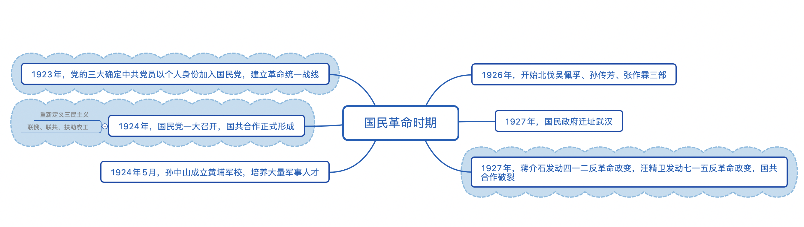
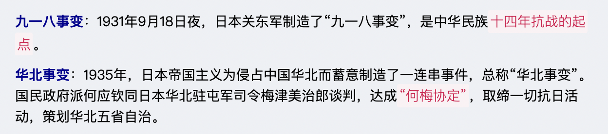
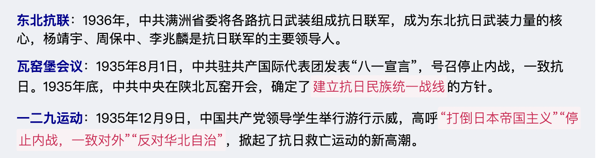
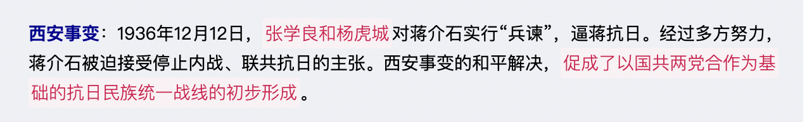
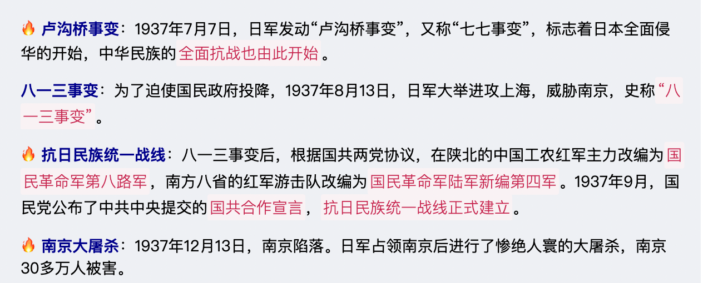
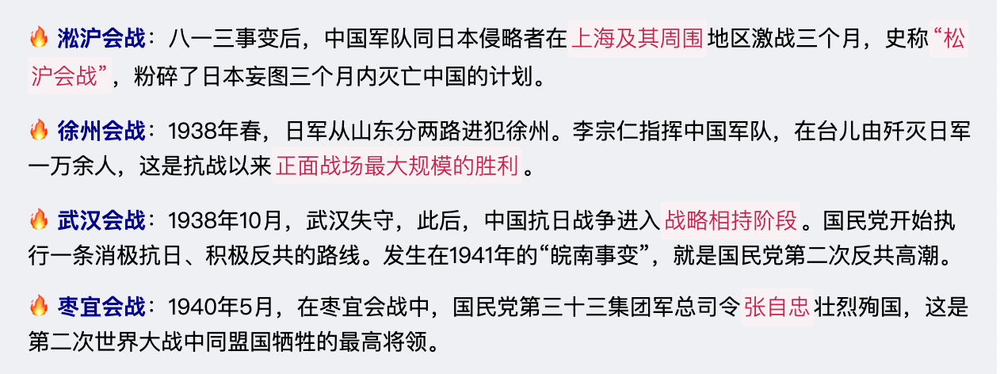
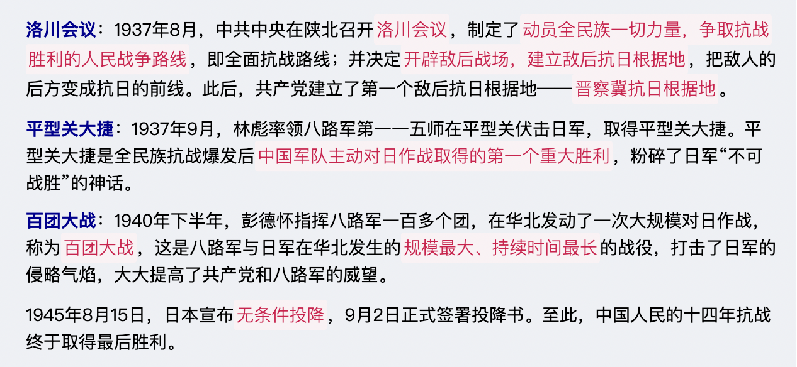
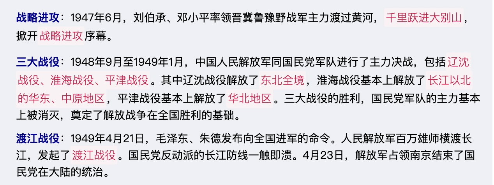
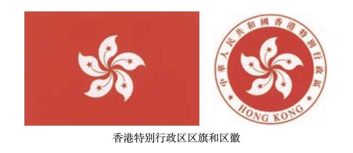
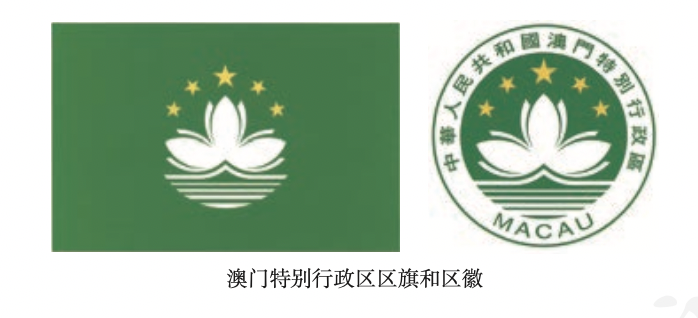

# 【历史】中国现代史

`2023/04/15 19:17:10  by: 程序员·小李`

#### 新文化运动

1915年，陈独秀在上海创办《青年杂志》后改名`《新青年》`，标志着`新文化运动`的开始。

李大钊被称为`中国马克思主义第一人`，代表作《布尔什维主义的胜利》。

> 新文化运动内容：
> * 提倡`民主、科学`，反对专制、迷信
> * 提倡`新道德`，反对旧道德（儒家思想）
> * 提倡`新文学`，反对旧文学。提倡白话文代替文言文（胡适的《文学改良诌议》、陈独秀的《文学革命论》）

#### 五四运动

导火索：1919年，`巴黎和会上中国外交失败`。

五四运动中，学生示威游行，主张“外争国权，内除国贼”、“取消二十一条”、“还我青岛”、“拒绝在和约上签字”。工人罢工、商人罢市。

北洋军阀被迫释放被捕学生，罢免曹汝霖、章宗祥、陆宗舆，没有在巴黎和会上签字。

> 🔥 五四运动是一次`彻底的反帝反封建的爱国运动`，青年学生起到了`先锋队`作用，工人阶级开始登上政治舞台，发挥了`主力军`的作用。
>
> 五四运动`促进了马克思主义的传播`，为党的成立作了思想基础，🔥 五四运动是`新民主主义革命`的开端。

> 为什么说是新民主主义革命？主要在于`领导阶级不同`，新民主主义革命的领导力量是无产阶级，旧民主主义革命领导力量是资产阶级。

#### 党的成立

1920年夏，陈独秀在上海创建党的早期组织。

1921年7月23日，中共一大在`上海、浙江嘉兴南湖游船上`召开。中共一大`宣告了党的成立`，是开天辟地的大事，从此中国革命的面貌焕然一新。 

> * 决定建立中国共产党
> * 选举陈独秀为中央局书记
> * 通过了党的纲领，规定了党的奋斗目标（用无产阶级军队推翻资产阶级政权，实现共产主义）

#### 国共合作与国民革命

1923年，党的三大在广州召开，`决定建立革命统一战线`，共产党以个人名义加入国民党。

🔥 1924年，国民党一大在广州召开，重新解释了三民主义（新三民主义），确立`“联俄、联共、扶助农工”`的三大政策。`标志着第一次国共合作的正式建立`，统一战线正式形成。

1924年5月，孙中山成立`黄埔军校`，蒋介石任校长，周恩来任政治处主任，培养了大批军事人才。

1926年国民革命军正式北伐吴佩孚、孙传芳、张作霖。

🔥 1927年国民政府迁址武汉。蒋介石发动`四一二反革命政变`，汪精卫发动`七一五反革命政变`，国共合作`正式破裂`。

#### 共产党的武装反抗

🔥 1927年8月1日，周恩来、朱德等人在**南昌起义**，`打响了武装反抗国民党反动统治的第一枪`，揭开了共产党开始独立领导武装斗争，创建人民军队，武装夺取政权的序幕。

🔥 1927年8月7日，在汉口召开了**八七会议**，总结了大革命（1926年的国民大革命）失败原因，清算了陈独秀右倾错误，确定了`土地革命、武装反抗国民党反动派`总方针，决定发起秋收起义。毛泽东在此会议上提出`“枪杆子里面出政权”`的说法。

1927年9月，毛泽东领导了湘赣边界的**秋收起义**，打出工农革命军旗号。

秋收起义攻打长沙失败后，退守`文家市`，毛泽东制定了文家市决策，改向山区进军。
🔥 途径三湾村进行了**“三湾改编”**，`从组织上确立了党对军队的领导`。

#### 工农武装割据

🔥 1927年10月，毛泽东在井冈山创建`第一个农村革命根据地`。

1928年4月，朱德、陈毅来到井冈山会师，合编为中国工农红军第四军。

🔥 1929年12月，**古田会议**上重申了`党对红军实行绝对的领导`。

1931年11月，`中华苏维埃共和国临时中央政府成立`，定都瑞金。毛泽东为临时中央政府主席，朱德为中央革命军事委员会主席。

#### 长征

原因：1930年开始，国民党反动派先后五次围剿。`第五次反围剿失败`，红军被迫开始长征。

路线：从江苏瑞金出发，强渡香江，召开遵义会议，四渡赤水、南渡乌江、巧渡金沙江、强渡大渡河、飞夺泸定桥、翻越夹金山、翻越六盘山，陕西吴起镇会师，甘肃会宁会师。

1935年10月，中央红军与陕西红军在`吴起镇`会师

1936年，红一、二、四方面军三大主力在`会宁`会师，长征结束。

> 长征的意义：
> 
> * 粉碎了围剿企图，中国革命转危为安
>
> * 历经磨难的红军成为后续全面抗战、解放战争的主干
>
> * 长征途中宣传了党的思想和政治主张，播下了火种。

#### 抗战的开端

#### 重庆谈判

1945年，蒋介石与毛泽东于重庆进行了43天的和平谈判，10月10日国共双方签订了`《双十协定》`

#### 国民党的进攻

全面进攻：1946年6月，国民党以重点围攻`中原解放区`为起点，发动了对中原解放区的全面进攻。期间，毛泽东提出`“一切反动派都是纸老虎”`的论断。

重点进攻：1947年春，国民党对陕北解放区、山东解放区进行重点进攻，`华东野战军`在`孟良崮战役`大获全胜，粉碎了国民党的重点进攻

#### 战略进攻

#### 新中国成立

1949年9月(建国前)，`中国人民政治协商会议第一届全体会议`在`北平`召开，讨论成立新中国的问题。中国人民政治协商会议的成功召开，标志着中国共产党领导的`多党合作和政治协商制度`正式确立。
* 决定成立`中华人民共和国`
* 通过了`《中国人民政治协商会议共同纲领》`
* 选举了`中央人民政府委员会`，毛泽东当选为中央人民政府`主席`，朱德、刘少奇、宋庆龄、李济深、张澜、高岗为`副主席`
* 决定改`北平`为北京，作为新中国的`首都`
* 以`《义勇军进行曲》（电影《风云儿女》的主题歌曲）`为代国歌（1982年，第五届全国人民代表大会第五次会议正式将它定为国歌。）
* 以`五星红旗`为国旗(象征全国人民在共产党领导下的大团结)
* 采用公元纪年
* 决定在北京天安门广场建立`人民英雄纪念碑`，以表示对革命先烈的崇敬和缅怀

> 国徽中间是五星照耀下的`天安门`，周围是`谷穗和齿轮`。它象征中国人民自五四运动以来的新民主主义革命斗争和工人阶级领导的、以工农联盟为基础的人民民主专政的新中国的诞生。

> 📣 扩展知识
> 
> 共同纲领规定：中国是新民主主义国家，实行`工人阶级领导`的、以`工农联盟为基础`的、团结各民主阶级和国内各民族的`人民民主专政`;国家政权属于`人民`，各级政权机关一律实行`民主集中制`。政治协商会议暂时代行将来召开的全国人大的职权，《中国人民政治协商会议共同纲领》起临时宪法的作用。 

1949年10月1日下午3点，天安门广场隆重举行**开国典礼**。随后，盛大的阅兵仪式开始，`朱德`任检阅司令员，`聂荣臻`任阅兵总指挥。
 
> 中华人民共和国的成立，开辟了中国历史的新纪元。中国人民经过一百多年的英勇斗争，终于`推翻了帝国主义、封建主义和官僚资本主义的统治`;中国真正成为`独立自主的国家`，中国人从此站立起来了。新中国的成立，壮大了世界和平民主和社会主义的力量。

> 1949年10月1日下午，中央人民政府委员会在中南海举行第一次全体会议，国家领导人宣布就职，中央人民政府正式成立。会议推选`林伯渠`为`中央人民政府委员会秘书长`，任命`周恩来`为`中央人民政府政务院总理兼外交部部长`，`毛泽东`为`人民革命军事委员会主席`，`朱德`为`人民解放军总司令`。

**西藏和平解放**：1951年，西藏地方政府派出以`阿沛·阿旺晋美`为首席代表的代表团到达北京，与中央人民政府谈判。双方经过充分协商谈判，达成《中央人民政府和西藏地方政府关于和平解放西藏办法的协议》，西藏`和平解放`，祖国大陆获得统一，各族人民实现了大团结。同年，人民解放军进驻拉萨，受到西藏各界的热烈欢迎。

#### 抗美援朝（1950.10~1953.7）

1950年6月25日，朝鲜内战爆发。美国政府派遣第七舰队侵入`台湾海峡`，操纵联合国安理会通过决议，组成以美国军队为主的“联合国军”，扩大侵朝战争。1950年10月初，美军不顾中国政府一再警告，悍然越过三八线，多次轰炸中国东北边境地区，给人民生命财产造成严重损失，我国安全面临严重威胁。

> 📣 扩展知识
>
> **三八线**是位于朝鲜半岛上北纬38度附近的一条军事分界线。二战结束后，盟国协议以朝鲜国土上北纬 38 度线作为苏、美两国对日军事行动和受降范围的暂时分界线，北部为苏军受降区，南部为美军受降区。后来，三八线南部建立了韩国，北部建立了朝鲜。朝鲜战争结束后，朝鲜与韩国大体以三八线为界。
🔥 1950年10月，`彭德怀`为司令员兼政治委员的中国人民志愿军开赴朝鲜战场。（10月25日被定为抗美援朝纪念日）

1952年10月，美国侵略军发动`上甘岭`战役。志愿军坚守阵地，击退敌军900多次冲击，最终取得上甘岭战役的胜利。

> 🎈 英雄故事——黄继光
>
> `黄继光`是上甘岭战役中的一位战斗英雄。在一次战斗中，当冲锋部队遭到敌人火力阻击时，黄继光在已经受伤、手榴弹用尽的情况下，奋不顾身地冲了上去，用自己的胸膛堵住敌人的机枪射口，为战友开辟了前进道路，自己英勇牺牲。 

> 🎈 英雄故事——邱少云
>
> 与上甘岭战役同时，志愿军某团准备夺取敌人的一个高地。为缩短攻击距离，保证战斗发起的突然性，`邱少云`所在的排，奉命于晚上潜伏在距离敌人只有60米的山脚下，准备配合第二天晚上大部队的进攻。不料，敌人的炮火燃起烈火，烧到邱少云身上。为了保证战斗的胜利和潜伏部队的安全，邱少云严守潜伏纪律，纹丝不动，直至被大火吞噬，壮烈牺牲。

中国人民志愿军在抗美援朝战争中，发扬高度的`爱国主义、革命英雄主义、革命乐观主义、革命忠诚及国际主义精神`，锻造了伟大的抗美援朝精神。他们被誉为`“最可爱的人”`。

🔥 1953年7月，美国投降。抗美援朝战争，抵御了帝国主义侵略扩张，捍卫了新中国安全，保卫了中国人民和平生活;稳定了朝鲜半岛局势，维护了亚洲和世界和平，大大`提高了我国的国际地位`。抗美援朝战争伟大胜利，是中国人民站起来后屹立于世界东方的宣言书，是中华民族走向伟大复兴的重要里程碑。

#### 土地改革（1950~1952）

1950年，中央人民政府颁布`《中华人民共和国土地改革法》`，它规定废除地主阶级封建剥削的土地所有制，实行`农民的土地所有制`。没收地主的土地，分给无地或少地的农民耕种；同时也分给地主一份，让他们自己耕种，在劳动中改造自己。到1952年底，除部分民族地区外，全国大陆基本上完成了土地改革，农民真正获得了解放。

土地改革的完成，彻底摧毁了我国存在2000多年的封建土地制度，消灭了地主阶级；农民翻了身，得到了土地，成为土地的主人。这使人民政权更加巩固，也大大解放了农村生产力。农业生产获得迅速恢复和发展，为国家的工业化建设准备了条件。

#### 工业化起步——“一五规划”

新中国成立以后，我国还是一个落后的农业国。为了有计划地进行社会主义建设，我国政府编制了发展国民经济的第一个五年计划。它的基本任务是:
* 集中主要力量发展`重工业`，建立国家`工业化和国防现代化`的初步基础;
* 发展`交通运输业、轻工业、农业和商业`;
* 培养建设人才;

第一个五年计划从1953年开始执行。第一个五年计划期间，鞍山钢铁公司无缝钢管厂等三大工程、长春第一汽车制造厂、沈阳第一机床厂和飞机制造厂等建成投产。交通运输建设也取得很大成就，新建宝成、鹰厦等铁路 30余条;川藏、青藏、新藏公路相继通车，密切了祖国内地与边疆地区的联系;1957年，武汉长江大桥建成，连接了长江南北的交通。到1957年底，第一个五年计划绝大部分指标大幅度超额完成。我国开始改变工业落后的面貌，向社会主义工业化迈进。

> 我国在第一个五年计划期间，创造了许多历史上的第一。 
> 
> 1953年，中国第一座大型露天煤矿——`辽宁阜新海州露天煤矿`建成投产。
> 
> 1955年，新中国第一套6000千瓦火力发电机组在上海组装成功，开始建立中国的发电设备生产基地。
>
> 1955年，中国第一块国产手表在天津诞生。 
>
> 1956年，中国第一辆解放牌汽车在长春第一汽车制造厂生产出来。
>
> 1956年，中国第一架喷气式歼击机在沈阳试制成功。
>
> 1956年，中国第一个制造机床的工厂——沈阳第一机床厂建成投产。

#### 人民代表大会制度

1954年9月，第一届全国人大第一次会议在北京召开，大会通过了《中华人民共和国宪法》。这是我国`第一部社会主义类型的宪法`。宪法规定，`全国人民代表大会`是最高国家权力机关，以根本法的形式确定了人民代表大会制度。人民代表大会制度是我国的`根本政治制度`，为社会主义民主政治建设奠定了基础。

大会选举毛泽东为中华人民共和国`主席`，朱德为`副主席`，刘少奇为第一届全国人民代表大会`常务委员会委员长`； 决定周恩来为`国务院总理`。

> 1955年9月，武汉长江大桥正式开工。1957年10月，全长近1700米的长江第一座铁路公路两用桥——武汉长江大桥顺利建成通车，实现了`“一桥飞架南北，天堑变通途”`的美好愿望。

#### 三大改造（1954~1956）

国家对`农业`进行社会主义改造，引导农民参加农业生产合作社，走集体化和共同富裕的社会主义道路。农业合作化开始时实行`自愿互利`的原则，通过典型示范逐步推广。它经历了由`农业互助组`、 `初级农业生产合作社`到 `高级农业生产合作社`三个阶段。1955年，全国掀起农业合作化的高潮。1956年，全国绝大多数农户参加了农业生产合作社。

农业合作化运动，推动了`手工业`的社会主义改造。1956年，90%以上的个体手工业者参加了手工业生产合作社。

从1954年起，国家对`资本主义工商业`的社会主义改造，逐步发展为企业的`公私合营`，公私双方共同经营企业，公方代表居于领导地位。在农业合作化高潮的影响下，1956年初，资本主义工商业的社会主义改造出现了全行业公私合营的高潮。在改造过程中，国家对资本家占有的生产资料实行`赎买政策`，即按全行业公私合营时资本家的资本发给定息。这种赎买政策，实现了`和平过渡`，是中国社会主义改造的创举。

到1956年底，我国基本上完成了对`农业、手工业和资本主义工商业`的社会主义改造，实现了生产资料私有制向社会主义公有制的转变。社会主义基本制度在我国建立起来，我国从此进入社会主义初级阶段。

#### 艰苦探索与建设

1956年，中共八大在北京召开。大会分析了当时国内的主要矛盾，指出党和人民的主要任务是`集中力量把我国尽快地从落后的农业国变为先进的工业国`。

1958年，中共八大二次会议提出`“鼓足干劲、力争上游、多快好省地建设社会主义”的总路线`。接着，全国掀起了“大跃进”的高潮和人民公社化运动。总路线反映了人民群众迫切要求改变我国经济落后状况的愿望，但`急于求成`，忽视了客观的经济规律。加上当时自然灾害严重等因素，1959年至1961年，我国的国民经济发生严重困难。

中共中央开始调整国民经济，提出了`“调整、巩固、充实、提高”`的八字方针，于1961年初开始实施。到1965年，工农业生产得到恢复和发展，呈现出物价稳定、市场繁荣的新面貌。

> 小结：
>
> 1956年中共八大开始集中力量发展生产，农业国变工业国。
>
> 1958年八大二次会议提出“鼓足干劲、力争上游、多快好省地建设社会主义”，急于求成，造成大跃进、人民公社化运动。1959~1961造成国民经济严重困难。
>
> 中央调整政策：“调整、巩固、充实、提高” ，1961~1965年实施完成，经济得到恢复。

20世纪60年代中期，毛泽东认为党和国家面临着资本主义复辟的危险。为此，他强调`“以阶级斗争为纲”`，想 通过发动“文化大革命”来防止资本主义复辟。1966年夏，“文化大革命”全面发动起来。

`陈伯达、江青、康生、张春桥`等人组成的中央文革小组，成为“文化大革命”的实际指挥部。他们趁机煽动“打倒一切，全面内战”，许多地方出现造反派组织打、砸、抢事件，学校停课、工厂停工“闹革命”。一些党政机关受到冲击，大批各级领导干部和知识分子遭到批判和揪斗，民主与法制受到践踏，社会和生产秩序陷于混乱。

国家主席刘少奇被诬蔑为“叛徒、内奸、工贼”，遭受了残酷迫害，成为“文化大革命”中最大的冤案。

“文化大革命”开始后，在`林彪`周围形成了一个反革命集团，阴谋策动反革命政变，夺取最高权力。毛泽东、周 恩来机智地粉碎了他们的阴谋。1971年9月13日，林彪等人慌忙外逃，在蒙古人民共和国`温都尔汗`机毁人亡，这就是`“九一三事件”`。林彪反革命集团被粉碎。

“文化大革命”中，`江青、王洪文、张春桥、姚文元`等人勾结起来进行篡党夺权的阴谋活动，毛泽东多 次批评他们，说他们是“四人帮”。1976年9月，毛泽东与世长辞，全国人民无限悲痛。江青反革命集团加紧夺取 党和国家最高领导权的阴谋活动。10月，华国锋、叶剑英等代表中央采取断然措施，将“四人帮”隔离审查，一 举粉碎江青反革命集团，结束了长达十年之久的“文化大革命”。

> 四五运动：
>
> 1976年1月周恩来逝世后，全国各地群众纷纷举行悼念活动。清明节前后，上百万群众来到天安门广场，在人民英雄纪念碑前献花篮、送花圈、贴传单、作诗词，悼念周恩来，声讨“四人帮”。4月5日，活动遭到“四人帮”的镇压。这就是“四五运动”。这场运动为后来粉碎“四人帮”奠定了群众基础。

全面的社会主义建设事业开始后，中国人民取得了巨大成就。`武汉、包头`两大钢铁基地，`大庆油田、胜利油田 和大港油田`，都是这个时期建设起来的。到1965年，我国实现了原油和石油产品的全部自给。工业布局有了明显改善，原有的沿海工业基地得到加强，广大内地也新建了不同规模的现代工业。新兴的电子工业、原子能工业、航天工业从无到有地发展起来。交通方面，修建了`兰新、兰青、包兰`等铁路。水利建设也取得很大成绩。我国首先完成了`人工合成结晶牛胰岛素`，这在世界上居于领先地位。同时，国防尖端技术取得了巨大进展。我国初步形成了独立的、比较完整的工业体系和国民经济体系，为现代化建设打下了坚实的物质基础。

🔥 1967年6月，我国成功爆炸了`第一颗氢弹`；

🔥 1970年4月，我国成功发射了`第一颗人造地球卫星`;

🔥 1973年，我国在世界上首次培育成功强优势的`籼型杂交水稻`。

> 铁人——王进喜：
>
> 1960年春，王进喜率领钻井队到大庆参加石油大会战。他们在茫茫大草原上露营，就着盐水吃野菜，以顽强的意志，用“人拉肩扛”的方法搬运和安装钻机，用“盆端桶提”的办法运送钻机用水，使大庆油田的第一口油井得以提前开钻。当井喷的险情发生时，他不顾腿伤跳进泥浆池，用身体搅拌泥浆，制服了井喷，被誉为“铁人”。以王进喜为代表的石油工人所表现出的艰苦创业精神，被誉为 “铁人精神”。

> 党的好干部——焦裕禄：
>
> 焦裕禄，1962年任河南`兰考`县委书记。当时的兰考县遭受内涝、风沙、盐碱三害，粮食产量降到历史最低水平。为了摸清灾情，焦裕禄亲自带队到灾区，展开了大规模的追洪水、查风口、探流沙的调查研究工作。他得知自己患了癌症后，仍顽强坚持工作，直到生命的最后一息。他被人民称颂为“党的好干部”。

> 向雷锋同志学习：
>
> 雷锋是一名普通的解放军战士。他在每个岗位上都兢兢业业地工作，甘当革命的螺丝钉，默默无闻地为人民做了大量好事。人们流传着这样一句话:“雷锋出差一千里，好事做了一火车。”他多次荣获先进工作者、标兵、红旗手等光荣称号。1962年，雷锋不幸因公殉职。他以公而忘私、助人为乐的共产主义风格和言行一致的工作作风，成为全国人民学习的榜样。1963年3月，《人民日报》刊登毛泽东的题词“向雷锋同志学习”，全国掀起了轰轰烈烈的学雷锋运动。

#### 伟大的转折——十一届三中全会

**两个凡是**：1977年2月7日《人民日报》、《红旗》杂志和《解放军报》发表社论，公开提出“凡是毛主席作出的决策，我们都坚决维护，凡是毛主席的指示，我们都始终不渝地遵循”的方针。它的推行引起普遍不满。

1978年5月，`《光明日报》`发表`《实践是检验真理的唯一标准》`的文章，开始了真理标准问题的讨论。这是一场深刻的思想解放运动。它使人们认识到，只有`实践`才是检验真理的唯一标准。文章尖锐地指出，“四人帮”加在人们身上的精神枷锁还远没有完全解脱，对“四人帮”设置的禁区“要敢于去触及，敢于去弄清是非”。邓小平、叶剑英、胡耀邦等同志都支持这篇文章的观点。

1978年12月，邓小平作了`《解放思想，实事求是，团结一致向前看》`的重要讲话。他指出:“解放思想，开动脑筋，实事求是，团结一致向前看，`首先是解放思想`。只有思想解放了，我们才能正确地以马列主义、毛泽东思想为指导，解决过去遗留的问题，解决新出现的一系列问题，正确地改革同生产力迅速发展不相适应的生产关系和上层建筑，根据我国的实际情况，确定实现四个现代化的具体道路、方针、方法和措施。”

🔥1978年12月，中共`十一届三中全会`在北京召开。这次全会冲破长期“左”的错误的严重束缚，确定了解放思想、开动脑筋、实事求是、团结一致向前看的指导方针；果断`结束“以阶级斗争为纲”`，重新确立马克思主义的思想路线、政治路线、组织路线；作出把党和国家工作中心转移到`经济建设`上来、实行`改革开放`的历史性决策。

> 十一届三中全会是新中国成立以来党的历史上具有`深远意义的伟大转折`，开启了改革开放和社会主义现代化建设新时期。这次会议实际上`形成了以邓小平为核心的党中央领导集体`，中国共产党在思想、政治、组织等方面进行全面拨乱反正。

平反冤假错案的工作在全国全面展开。“文革”中受到迫害的各级党、政、军机关干部陆续得到平反，受到打击、 诬陷或迫害的民主人士和知识分子等也恢复了名誉。1980年，中共中央决定撤销“文革”中强加给刘少奇的种种罪名，恢复刘少奇作为伟大的马克思主义者和无产阶级革命家、党和国家主要领导人之一的名誉，使中华人 民共和国成立以来`最大的冤案`得到平反。

1981年，中共十一届六中全会召开，通过了《中国共产党中央委员会关于建国以来党的若干历史问题的决议》，标志着中国共产党在指导思想上的拨乱反正胜利完成。

> 📣 恢复高考——1977年冬
>
> “文革”开始后，高考招生工作也停顿下来。“文革”结束后，在邓小平主持决策和直接推动下，高考制度得到恢复，1977年冬天进行了高考制度恢复后的第一次考试。

#### 经济体制改革——对内改革

>**农村改革——家庭联产承包责任制**
>
> 改革`先从农村开始`，1978年，`安徽凤阳小岗村`农民实行`分田包干到户`，自负盈亏。农民形象地说:“交够国家的，留足集体的，剩下都是自己的。”农民热烈拥护`家庭联产承包责任制`，生产积极性大大提高，农业连年获得丰收。到1983年，已基本在全国农村普遍实行。

>**企业改革——政企分开、经营责任制**
>
>1984年10月，中共`十二届三中全会`通过了《中共中央关于经济体制改革的决定》，要求加快`以城市为重点`的经济体制改革的步伐。城市改革全面展开，把原来单一的公有制经济，变为公有制为主体、多种所有制经济共同发展；对国有企业实行`政企分开`，逐步扩大企业的生产经营自主权，实行`经营责任制`；实行以按劳分配为主体、多种分配方式并存的制度。

城市经济体制改革的中心环节是`增强企业活力`。通过改革，企业有了经营自主权;实行经营承包责任制，企业的经济利益、职工的经济收入与企业经营成果相联系，大大调动了企业、职工的积极性，增强了企业的活力。

>**十四大——建立社会主义市场经济体制**
>
>1992年，党的`十四大`明确提出要建立`社会主义市场经济体制`。

>**十四届三中全会——市场发挥基础性作用**
>
>1993年，中共`十四届三中全会`通过《中共中央关于建立社会主义市场经济体制若干问题的决定》，指出:社会主义市场经济体制是同社会主义基本制度结合在一起的，建立社会主义市场经济体制，就是要使`市场在国家宏观调控下对资源配置起基础性作用`。

#### 经济特区——对外开放

1980年，中央决定兴办`深圳、珠海、汕头、厦门`4个经济特区，实行特殊的经济政策和经济管理体制，允许外国企业或个人以及华侨、港澳同胞进行投资活动，并在进出口、减免税等方面提供优惠条件。设立经济特区，对引进外资、先进技术和管理经验，推动国内的进一步改革，扩大对外经济交流，发展社会主义现代化事业起到了极为重要的作用。

1984年，我国进一步开放`大连、天津、青岛、上海、 福州、广州`等14个沿海城市。

1985年，我国又把`长江三角洲、珠江三角洲和闽南三角地区`开辟为沿海经济开放区。随后又把经济开放区扩展到`辽东半岛、山东半岛及其他沿海地区`的一些市县。

1988年，建立`海南经济特区`。 1990年，上海浦东开发区也建立起来。

1992年，相继开放了`重庆、武汉`等沿江城市，`满洲里`等陆地边境城市和`昆明、乌鲁木齐`等内地省会和自治区首府，并实施灵活的鼓励外商投资的区域经济政策。我国形成了`“经济特区—沿海开放城市—沿海经济开放区—内地”`的`全方位、多层次、宽领域`的对外开放格局。

>**加入世贸组织**
>
>2001年12月，中国成为世界贸易组织的成员。

#### 建设中国特色社会主义

>**十二大——理论结合实际，建设有中国特色的社会主义**
>
>1982年党的十二大，邓小平明确提出:我们的现代化建设，必须从中国的实际出发。“把马克思主义的普遍真理同我国的具体实际结合起来，走自己的道路，`建设有中国特色的社会主义`”。

>**十三大——社会主义初级阶段及其基本路线**
>
>1987年党十三大，系统阐述了`社会主义初级阶段的理论`，明确概括了党在社会主义`初级阶段的基本路线`，即`以经济建设为中心，坚持四项基本原则，坚持改革开放`。

>**南方谈话——计划和市场都是手段、姓资姓社问题**
>
>1992年初，南方谈话：党的基本路线要管一百年，动摇不得;社会主义的本质，是`解放生产力，发展生产力，消灭剥削，消除两极分化，最终达到共同富裕`；计划和市场都是经济手段；改革开放胆子要大一些，敢于试验;要抓住时机，发展自己，关键是`发展经济`；`发展才是硬道理`。邓小平是我国改革开放和社会主义现代化建设的总设计师。

>**十四大——用邓小平建设有中国特色社会主义理论武装全党**
>
>1992年党的十四大，提出必须`用邓小平建设有中国特色社会主义理论武装全党`。

>**十五大——邓小平理论写入党章**
>
>1997年，党的十五大，江泽民作了《高举邓小平理论伟大旗帜，把建设有中国特色社会主义事业全面推向二十一世纪》的报告。大会通过的党章规定:中国共产党以马克思列宁主义、毛泽东思想、邓小平理论作为自己的行动指南。`把邓小平理论确立为党的指导思想`，对建设中国特色社会主义具有重要意义。

>**十六大——三个代表写入党章、建设小康社会**
>
>2002年党的十六大，江泽民作了《全面建设小康社会，开创中国特色社会主义事业新局面》的报告，“三个代表”重要思想被确立为中国共产党的指导思想。十六大提出的奋斗目标是：
>* 在本世纪头二十年，集中力量，全面建设惠及十几亿人口的更高水平的`小康社会`，使经济更加发展、民主更加健全、科教更加进步、文化更加繁荣、社会更加和谐、人民生活更加殷实。
>* 到本世纪中叶基本实现现代化，把我国建设成为富强民主文明的社会主义国家。

> “三个代表”重要思想的核心内容为中国共产党要`始终代表中国先进生产力的发展要求，代表中国先进文化的前进方向，代表中国最广大人民的根本利益`。它进一步回答了什么是社会主义、怎样建设社会主义的问题，创造性地回答了建设什么样的党、怎样建设党的问题。

>**十七大——科学发展观、全面建设小康社会**
>
>2007年党的十七大，胡锦涛在会上作了《高举中国特色社会主义伟大旗帜，为夺取全面建设小康社会新胜利而奋斗》的报告。大会的主题是:高举中国特色社会主义伟大旗帜，以邓小平理论和“三个代表”重要思想为指导，深入贯彻落实科学发展观，继续解放思想，坚持改革开放，推动科学发展，促进社会和谐，为夺取全面建设小康社会新胜利而奋斗。

> 科学发展观是坚持`以人为本，全面、协调、可持续`的发展观，对新形势下实现什么样的发展、怎样发展等重大 问题作出了新的科学回答，是马克思主义关于发展的世界观和方法论的集中体现。

>**十八大——科学发展观写入党章、中华民族伟大复兴**
>
>2012年党的十八大，大会的主题是:高举中国特色社会主义伟大旗帜，以邓小平理论、“三个代表”重要思想、科学发展观为指导，解放思想，改革开放，凝聚力量，攻坚克难，坚定不移沿着中国特色社会主义道路前进，为全面建成小康社会而奋斗。中共十八大提出了`夺取中国特色社会主义新胜利`的基本要求，确定了`全面建成小康社会和全面深化改革开放`的目标，对新的时代条件下推进中国特色社会主义事业作出了全面部署，对全面提高党的建设科学化水平提出了明确要求。中共十八大选举产生了新一届中央委员会。在中共十八届一中全会上，习近平当选为中共中央总书记。

>**十九大——习近平新时代中国特色社会主义思想**
>
>2017年党的十九大，大会的主题是:不忘初心，牢记使命，高举中国特色社会主义伟大旗帜，决胜全面建成小康社会，夺取新时代中国特色社会主义伟大胜利，为实现中华民族伟大复兴的中国梦不懈奋斗。习近平在会上作了题为《决胜全面建成小康社会，夺取新时代中国特色社会主义伟大胜利》的报告。报告指出，经过长期努力，中国特色社会主义进入了新时代，这是我国发展新的历史方位，我国社会主要矛盾已经转化为人民日益增长的美好生活需要和不平衡不充分的发展之间的矛盾。习近平新时代中国特色社会主义思想是当代中国马克思主义、21世纪马克思主义，是中华文化和中国精神的时代精华，实现了马克思主义中国化时代化新的飞跃。中国共产党确立习近平同志党中央的核心、全党的核心地位，确立习近平新时代中国特色社会主义思想的指导地位，反映了全党全军全国各族人民共同心愿，对新时代党和国家事业发展、对推进中华民族伟大复兴历史进程具有决定性意义。

2022年，党的二十大召开。大会的主题是:高举中国特色社会主义伟大旗帜，全面贯彻新时代中国特色社会主义思想，弘扬伟大建党精神，自信自强、守正创新，踔厉奋发、勇毅前行，为全面建设社会主义现代化国家、全面推进中华民族伟大复兴而团结奋斗。习近平在会上作了题为《高举中国特色社会主义伟大旗帜，为全面建设社会主义现代化国家而团结奋斗》的报告。报告指出，从现在起，中国共产党的中心任务就是团结带领全国各族人民全面建成社会主义现代化强国、实现第二个百年奋斗目标，以中国式现代化全面推进中华民族伟大复兴。

中共十三大指出我国经济建设的战略部署分三步走:
* 第一步，实现国民生产总值比1980年翻一番，解决人民的温饱问题。
* 第二步，到20世纪末，使国民生产总值再增长一倍，人民生活达到小康水平。
* 第三步，到21世纪中叶，人均国民生产总值达到中等发达国家水平，人民生活比较富裕，基本实现现代化。

> 2012年11月，习近平在参观《复兴之路》展览时提出:“实现中华民族伟大复兴，就是中华民族近代以来最伟大的梦想。”

> **中国梦**
>
> 2013 年，习近平在十二届全国人大一次会议上当选为国家主席。在会上，他深刻阐述了中国梦的宏伟蓝图， 强调中国梦就是要实现`国家富强、民族振兴、人民幸福`；实现中国梦，必须走中国道路、弘扬中国精神、凝聚中国力量；中国梦归根到底是人民的梦，必须紧紧依靠人民来实现，必须不断为人民造福。

>**两个一百年奋斗目标**
>
> 为了实现中国梦，中国共产党确立了“两个一百年”奋斗目标，即到`中国共产党成立100年`时，实现国内生产总值和城乡居民人均收入比2010年翻一番，全面建成小康社会;到`中华人民共和国成立100年`时，建成`富强民主文明和谐美丽`的社会主义现代化强国，实现中华民族伟大复兴。

> **四个全面**
>
> 党中央提出了`全面建成小康社会、全面深化改革、全面依法治国、全面从严治党`的“四个全面”战略布局。

2013年，中共十八届三中全会通过了《中共中央关于全面深化改革若干重大问题的决定》，指出要完善和发展中国特色社会主义制度，推进国家治理体系和治理能力现代化，并对经济体制改革、政治体制改革、文化体制改革、社会体制改革、生态文明体制改革和党的建设制度改革进行了全面部署。

2014年10月，中共十八届四中全会通过了《中共中央关于全面推进依法治国若干重大问题的决定》，指出全面推进依法治国的总目标是`建设中国特色社会主义法治体系`，建设`社会主义法治国家`。

2014年12月，习近平在江苏调研时强调，`从严治党`是全党的共同任务，全面从严治党是推进党的建设新的伟大工程的必然要求。

2015年10月，`中共十八届五中全会`对`全面建成小康社会`作出重要部署，提出要牢固树立`创新、协调、绿 色、开放、共享`的新发展理念。

2020年10月召开的`中共十九届五中全会`，对开启`全面建设社会主义现代化国家`新征程作出战略决策。“四个 全面”战略布局的内涵演化为`“全面建设社会主义现代化国家、全面深化改革、全面依法治国、全面从严治党”`。

2021年，中共`十九届六中全会`召开。会议审议通过了《中共中央关于党的百年奋斗重大成就和历史经验的决议》，全面总结党在新民主主义革命时期、社会主义革命和建设时期、改革开放和社会主义现代化建设新时期、 中国特色社会主义新时代的重大成就和历史经验，重点总结新时代党和国家事业取得的历史性成就、发生的历史性变革和积累的新鲜经验。

2022年，中共`二十大`对全面建设社会主义现代化国家、全面推进中华民族伟大复兴进行了战略谋划，对统筹推进“五位一体”总体布局、协调推进“四个全面”战略布局作出了全面部署，为新时代新征程党和国家事业发展、实现第二个百年奋斗目标指明了前进方向、确立了行动指南。

#### 民族团结

根据我国民族问题的`历史特点和现实情况`，中国共产党将`民族区域自治制度`确立为解决我国民族问题的基本政策。民族区域自治制度，是在国家统一领导下，各少数民族聚居的地方实行区域自治，设立自治机关，行使自治权的制度。

民族区域自治制度是我国的一项`基本政治制度`。1949年通过的《中国人民政治协商会议共同纲领》确定实行民族区域自治制度。后来，民族区域自治制度被载入宪法。1984年，《中华人民共和国民族区域自治法》颁布实施。民族自治地方分为`自治区、自治州、自治县`。

1947年，第一个自治区——内蒙古自治区成立。目前，全国已经建立了内蒙古自治区、新疆维吾尔自治区、广西壮族自治区、宁夏回族自治区、西藏自治区5个自治区，30个自治州，120个自治县(旗)。

实行民族区域自治，从制度和政策层面保障了少数民族公民享有平等自由权利以及经济、社会、文化权利。这对维护民族团结、巩固祖国统一和促进民族地区发展具有重大意义，为实现各民族共同发展、共同富裕奠定了基础

进入新时代，中共中央强调以`铸牢中华民族共同体意识为主线`， 坚定不移`走中国特色解决民族问题的正确道 路`，坚持和完善`民族区域自治制度`，民族团结进步呈现新气象。

国家采取许多优惠政策，派出大批人员，还通过技术、资金、物资等多种方式，加强民族地区的经济建设，促进各民族共同团结奋斗、共同繁荣发展。各民族也根据本民族地区的实际情况，发挥自身优势，发展经济，取得了很大成就。民族地区经济有了长足发展，已经成为我国国民经济的重要组成部分，少数民族人民生活水平日益提高。
国家重视少数民族文化的保护与发展。国家按照自愿的原则，帮助侗族等十几个少数民族创制了文字，为这些民族的文化传承创造了条件。国家尊重各民族的宗教信仰和风俗习惯，保护少数民族的历史文化遗产。国家还有组织、有计划地开展了少数民族古籍文献的搜集、整理和出版工作，取得了很大成绩。

20世纪末，中央决定进行西部大开发。有5个自治区、27个自治州和83个自治县。此外，还有3个自治州参照享受西部大开发的相关政策。西部大开发以来，在基础设施建设、科技教育和文化卫生事业等方面建设了一大批项目，极大地带动了民族地区的经济社会发展。2006年，青藏铁路全线通车，大大加强了祖国内地与边疆地区的联系，促进了青海、西藏地区的经济社会发展。国家还实施了旨在推动边疆民族地区加快发展的兴边富民行动，采取特殊措施帮助人口较少民族加快发展，进一步促进了民族地区的发展。

#### 香港澳门回归

> **和平统一、一国两制**
>
>`邓小平`提出了`“一国两制”`的伟大构想：在祖国统一的前提下，国家的主体坚持社会主义制度，同时在台湾、香港、澳门保持原有的资本主义制度和生活方式长期不变，享有高度的自治权。“和平统一、一国两制” 是完成祖国统一大业的`基本方针`。

> **香港回归**
>
>1984年12月正式签署联合声明，宣布中华人民共和国政府将于1997年7月1日对香港恢复行使主权，设立直辖于中央人民政府的香港特别行政区。 

> **澳门回归**
>
>1987年4月，中葡两国政府签署联合声明，宣布中华人民共和国政府将于1999年12月20日对澳门恢复行使主权。

香港、澳门回归后，中央政府坚定不移贯彻`“一国两制”、“港人治港”、“澳人治澳”、高度自治`的方针，全力支持香港、澳门经济社会发展。 2003年，内地与港澳分别签署关于建立更紧密经贸关系的安排，逐步开放内地居民个人赴港澳游。

进入新时代，中央政府全面推进“一国两制”实践，落实“爱国者治港”“爱国者治澳”原则，维护国家主权、安全和发展利益。面对香港局势动荡变化，2020年，全国人大常委会通过`《中华人民共和国香港特别行政区维护国家安全法》`，推动香港进入由乱到治走向由治及兴的新阶段。中央政府深化内地和港澳地区交流合作，深入推进`粤港澳大湾区`建设，支持香港、澳门发展经济、改善民生。

> 香港特别行政区的区旗是一面中间配有五颗星的动态`紫荆花`图案的红旗。红旗代表祖国，紫荆花代表香港，寓意着香港是中华人民共和国不可分割的一部分，在祖国的怀抱中兴旺发达。花蕊上的五颗星象征着香港同胞心中热爱祖国，红、白两色体现了“一国两制”的精神。区徽呈圆形，中间图案与区旗相同，外圈有中文“中华人民共和国香港特别行政区”和英文“香港” 字样。

> 澳门特别行政区的区旗是绘有`五星、莲花、大桥和海水`的绿色旗帜。五星象征国家的统一，表明澳门是中华人民共和国不可分割的组成部分;莲花是澳门居民钟爱的花种，三朵含苞欲放的白莲花代表澳门特别行政区由澳门半岛、氹仔岛和路环岛组成;大桥和海水反映澳门的自然环境;绿色象征着充满生机的祖国。 区徽呈圆形，中间图案与区旗相同，外圈有中文“中华人民共和国澳门特别行政 区”和葡萄牙文“澳门”字样。

#### 台湾问题

新中国成立以后，党和政府明确提出要解放台湾。20世纪50年代中期，党和政府又确立了`争取用和平方式解放台湾`的思想。

改革开放以后，党和政府确立了`和平统一祖国`的大政方针。不久，在邓小平提出“一国两制”的科学构想基础上，形成了`“和平统一、一国两制”`的对台基本方针，并采取了一系列措施，缓和海峡两岸关系，推进祖国统一大业。

从1979年开始，中国人民解放军奉命停止对金门和马祖的炮击。中央人民政府倡议海峡两岸直接实行`通邮、通航、通商`，欢迎台湾同胞 来大陆探亲、旅游、考察、 经商等。海峡两岸局势逐步走向缓和。

1987年，台湾被迫调整“三不”（不接触、不谈判、不妥协）政策，开放台湾居民赴大陆探亲，并在经济、文化交流等方面，逐步采取了一些开放措施，两岸关系发生了历史性的变化。

1990年台湾成立了海峡交流基金会，1991年祖国大陆成立了海峡两岸关系协会。

1992年11月，海峡交流基金会、海峡两岸关系协会达成“海峡两岸同属一个中国，共同努力谋求国家统一”的共识，后被称为`“九二共识”`，海峡两岸关系的发展迈出了历史性的重要一步。

> **汪辜会谈**
>
>1993年，海协会会长汪道涵与海基会董事长辜振甫在新加坡举行第一次会谈，将“加强两岸经济交流，互补互利”写入协议，并就开展两岸经济、文教科技交流达成共识。汪辜会谈对促进两岸关系健康发展发挥了积极作用。

1995年，江泽民提出`发展两岸关系、推进祖国和平统一`的八项主张，强调`坚持一个中国原则`，是实现和平统一的基础和前提。

2005年，`十届全国人大三次会议`通过`《反分裂国家法》`，充分体现了党和政府以最大诚意和尽最大努力争取和平统一的一贯立场，表明了维护国家统一与领土完整的坚定决心。同年，中国国民党主席`连战`率“和平之旅”访问团访问祖国大陆。胡锦涛会见连战一行。双方重申坚持“九二共识”，反对“台独”，主张台海和平稳定。国共两党最高领导人的会见，促进了两岸关系的新发展。

2008 年，两岸达成`空运直航、海运直航、邮政合作`等协议。随后， 两岸同时举行“三通”启动仪式， 两岸关系取得重大进展。

2015年11月，习近平同台湾地区领导人`马英九`在新加坡会晤。双方就进一步推进两岸关系和平发展交换了意见。这是1949年以来两岸领导人的首次会晤，翻开了两岸关系历史性的一页。

十八大后，党和政府坚决开展`反分裂、反干涉`重大斗争，人民解放军多次在台湾周边海域组织实战化演练，展示了维护国家主权和领土完整、反对“台独” 的坚强决心和强大能力，有力维护台海和平稳定。

2022年发布的《台湾问题与新时代中国统一事业》白皮书，全面阐述了新时代解决台湾问题的总体方略，指明了对台工作方向。白皮书强调，我们愿继续以最大诚意、尽最大努力争取和平统一，但决不承诺放弃使用武力。

中共二十大进一步强调，“和平统一、一国两制”方针是实现两岸统一的最佳方式，对两岸同胞和中华民族最有利。我们坚持团结广大台湾同胞，坚定支持岛内爱国统一力量，共同把握历史大势，坚守民族大义，坚定反“独”促统。

#### 三军建设

在新中国成立前夕，中国人民解放军的第一支海军部队——华东军区海军建立。新中国成立后，又建立了东海、 南海和北海舰队。

1971 年，我国自行研制的导弹驱逐舰完成了多次 科学试验和对外出访任务。接着，海军又陆续装备了我国自 己制造的核潜艇。

2012年9月，我国第一艘航空母舰“辽宁舰” 交接入列。

1956年，我国仿制成功歼-5型歼击机。后来，我国又制造了各种型号的歼击机、 轰炸机和强击机。

1966年，中国组建第二炮兵部队。它是中国战略威慑的核心力量， 主要担负遏制他国对中国使用核武器、遂行 核反击和常规导弹精 确打击任务，由核导弹部队、常规导弹部队、作战保障部队等组成， 装备了东风系列弹道 导弹和长剑巡航导弹等。2015年， 第二炮兵部队更名为`火箭军`。

2013年，习近平 正式提出`“听党指挥、能打胜仗、作风优良”`的强军目标。

2014年，全军政治工作会议在福建古田召开，强调军队政治工作要为新形势下的强军目标提供坚强政治保证。

2016年，中国人民解放军成立五大战区，即`东部战区、南部战区、西部战区、北部战区、中部战区`，构建军队联合作战体系。中国人民解放军调整组建五大军种，即`陆军、海军、空军、火箭军、战略支援`部队。国防和军队改革取得历史性突破，形成`军委管总、战区主战、军种主建`的新格局，军队组织架构和力量体系实现革命性重塑，国防和军队的现代化建设取得巨大成就。

#### 独立自主的和平外交

新中国成立以后，奉行`独立自主的和平外交`政策。

> **和平共处五项原则**
>
>1953 年底，`周恩来`在接见`印度`代表团时，首次提出`和平共处五项原则`，作为处理两国关系的原则。和平 共处五项原则现在表述为`互相尊重主权和领土完整、互不侵犯、互不干涉内政、平等互利、和平共处`。

> **万隆会议——求同存异**
>
>1955年，周恩来率中国代表团参加在印度尼西亚`万隆`召开的亚非会议。这是第一次没有西方殖民主义国家参加的亚非会议。会上，针对帝国主义破坏会议的阴谋和各国间的矛盾、分歧，周恩来提出`“求同存异”`的方针，促进了会议的圆满成功。

1954年4月至7月，中国第一次以五大国之一的身份，参加了在`日内瓦`召开的关于解决朝鲜问题和印度支那问题的国际会议。中国代表团团长`周恩来`在会上进行了积极的外交努力。会议最终就恢复印度支那和平问题签署了一系列协议，从而缓和了亚洲及世界的紧张局势，巩固了中国南部边界的安全。在会议期间，周恩来出色的外交才能和政治家风度，为新中国赢得了很高的国际声誉，大大提高了中国的国际地位，为打开新中国外交的新局面作出了巨大贡献。

> **恢复联合国合法席位**
>
>联合国成立于1945年，是由主权国家组成的国际组织。中国是创始会员国之一，也是联合国安理会常任理事国之一。1971年10月，第26届联合国大会通过决议，恢复中华人民共和国在联合国的一切合法权利。

1971年7月，尼克松总统的国家安全事务助理`基辛格`秘密访问中国，同周恩来总理举行会谈。1972年，尼克松访华。毛泽东会见了尼克松，周恩来与尼克松举行了会谈。中美双方正式签署并发表了`《联合公报》`，两国关系开始走向正常化。

> **中美建交——小球转动大球**
>
>1979年，中美`正式`建立外交关系。

> **中日建交**
>
>1972 年，日本首相`田中角荣`访华，中日两国正式建立外交关系。

中国特色大国外交全面推进， 形成`全方位、多层次、立体化`的外交布局。截至 2019 年 9 月，中国已与世 界上180个国家建交，参加了100多个政府间国际组织的工作。中国举办“一带一路”国际合作高峰论坛、亚 太经合组织领导人非正式会议、二十国集团领导人峰会、金砖国家领导人 厦门会晤、亚信峰会等重要国际会 议，加强国际合作。

#### 科技文化发展

1964年10月16日，我国`第一颗原子弹`爆炸成功。

1966年，我国第一次成功进行了发射`导弹核武器`的试验。

1967年， 我国`第一颗氢弹`爆炸成功。

1970年，我国用`长征`号运载火箭，成功地发射了第一颗人造地球卫星—`东方红一号`，成为世界上`第五个`能独立发射人造地球卫星的国家。

>1999年11月，神舟一号无人飞船成功完成`载人航天`工程的第一次飞行试验，开启了我国的飞天之旅。 
>
> 2003年10月，航天员`杨利伟`乘坐`神舟五号`载人飞船升入太空，并成功返回地面。我国成为世界上`第三个`独立掌握载人航天技术的国家。
>
> 2008年9月，`神舟七号`载人飞船升入太空，航天员`翟志刚`成功完成出舱任务，实现了`太空行走`。
>
> 2021年6月，`神舟十二号`载人飞船发射升空，与天和核心舱完成交会对接，中国人`首次进入自己的空间站`。

20世纪70年代，`袁隆平`成功培育出`籼型杂交水稻`。我国将首届`最高科学技术奖`授予了袁隆平。同时，他也是我国第一个`特等发明奖`的获得者，被称为`“杂交水稻之父”`。

药学家`屠呦呦`领导科研团队在20世纪70年代初发现了能够有效抵抗疟疾的`青蒿素`，开创了治疗疟疾的新方法，屠呦呦获得2015年`诺贝尔生理学或医学奖`。

1956年，毛泽东提出在科学文化工作中实行`“百花齐放”“百家争鸣”`的方针，即艺术问题上“百花齐放”，学术问题上“百家争鸣”。长篇小说《红岩》《青春之歌》、话剧《茶馆》、大型音乐舞蹈史诗《东方红》、电影《英雄 儿女》《林则徐》等，都是那一时期的出色作品。

2012年，中国作家`莫言`获得`诺贝尔文学奖`。