# 【历史】中国近代史

`2023/04/15 15:55:17  by: 程序员·小李`

#### 鸦片战争
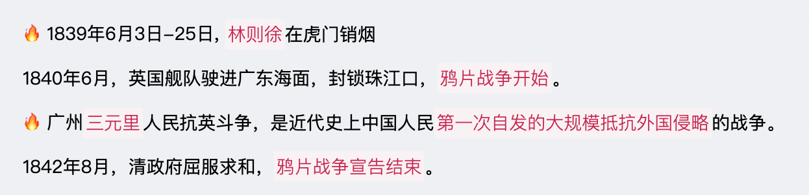

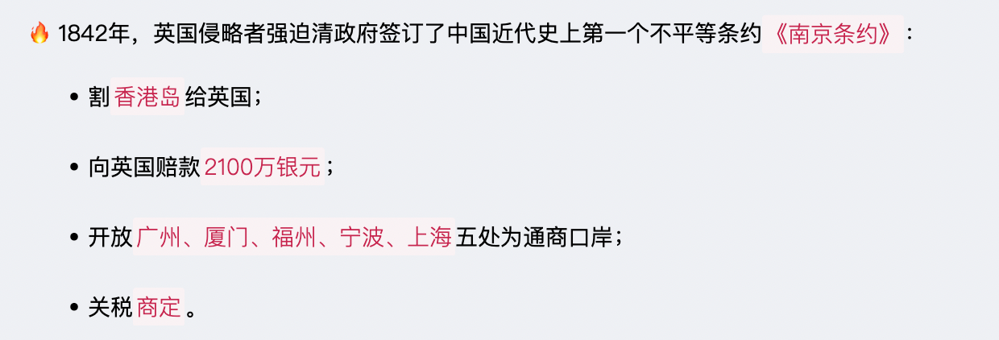

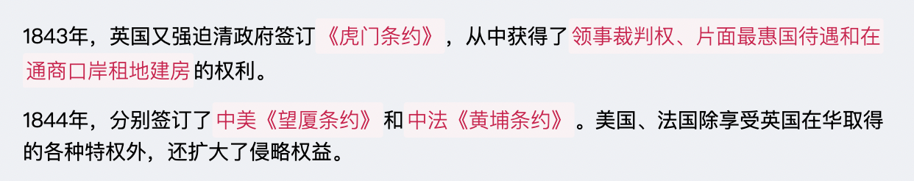

#### 第二次鸦片战争

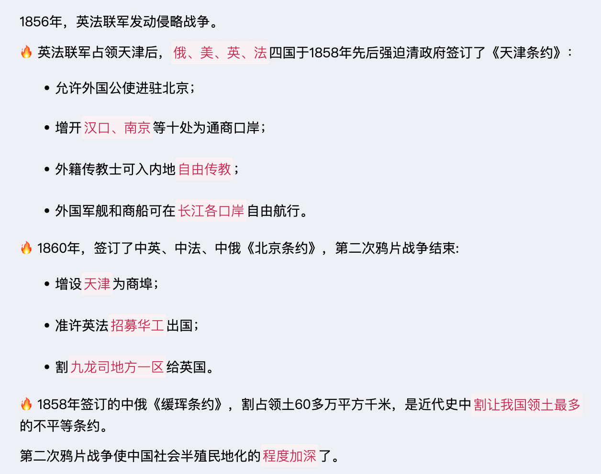

#### 新思想萌发

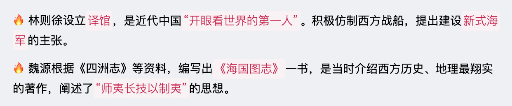

#### 太平天国运动

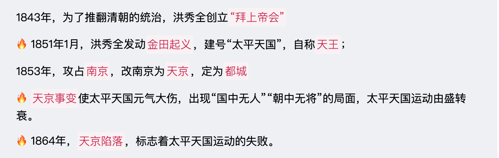

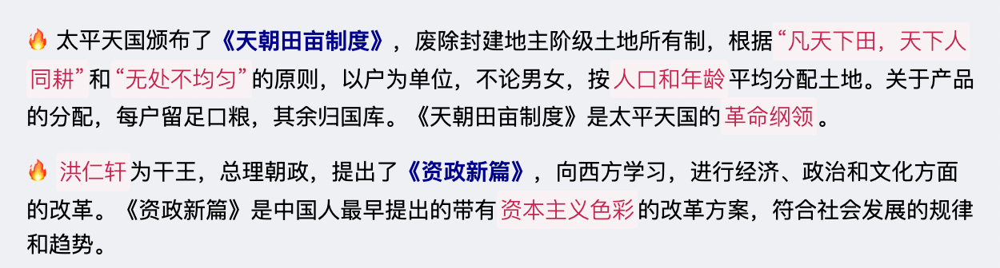

#### 洋务运动

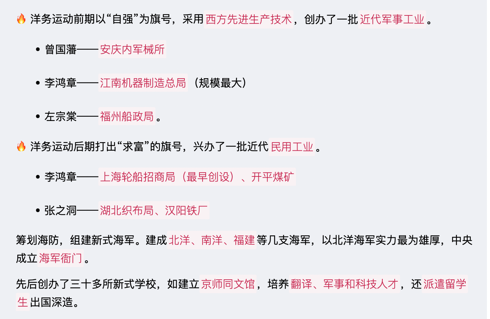

#### 甲午中日战争

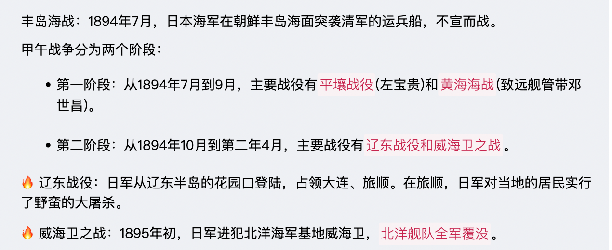

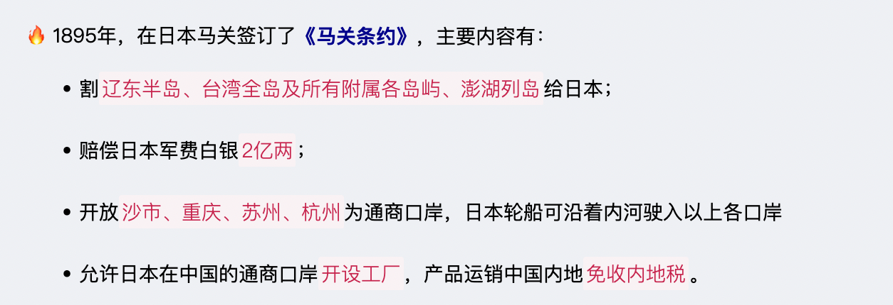

#### 戊戌变法

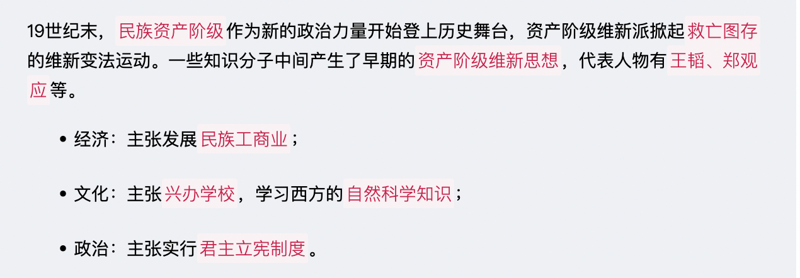

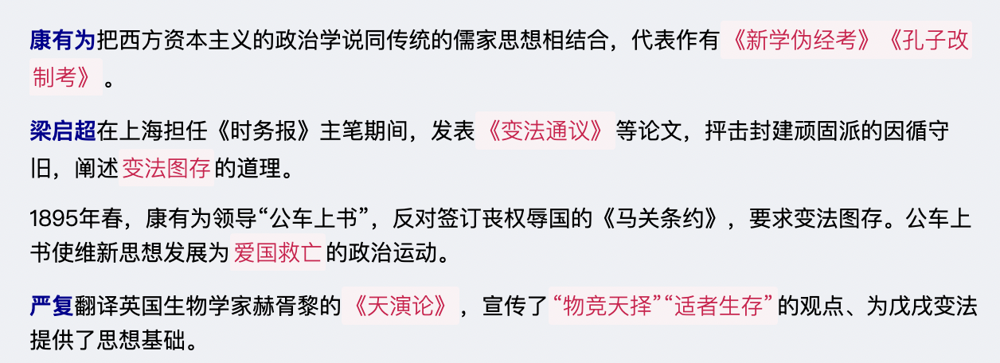

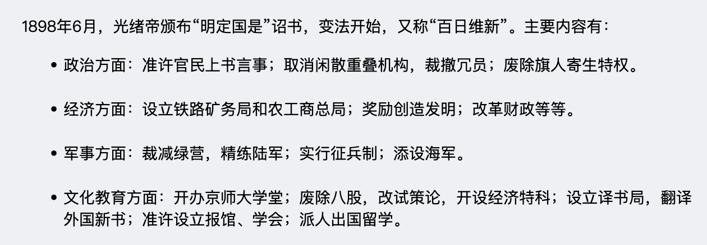

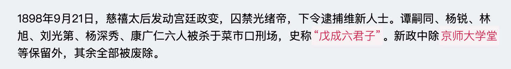

#### 义和团运动

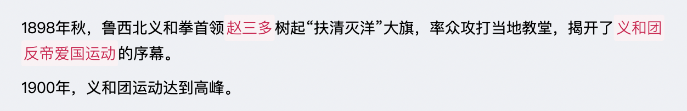

#### 八国联军侵华战争

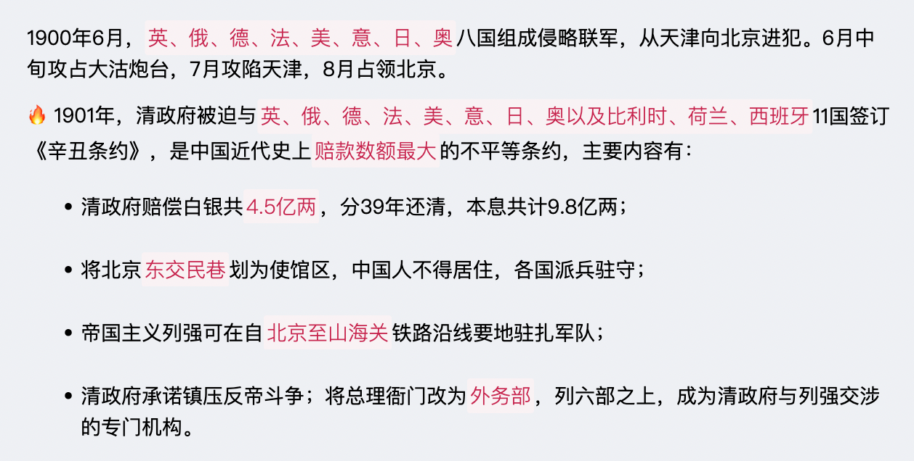

#### 辛亥革命

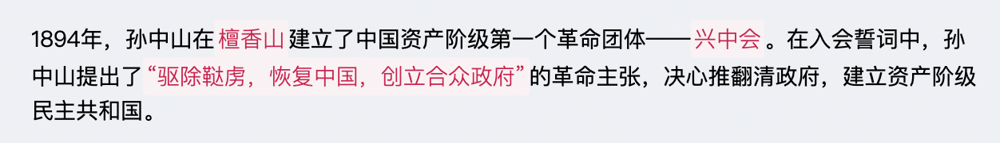

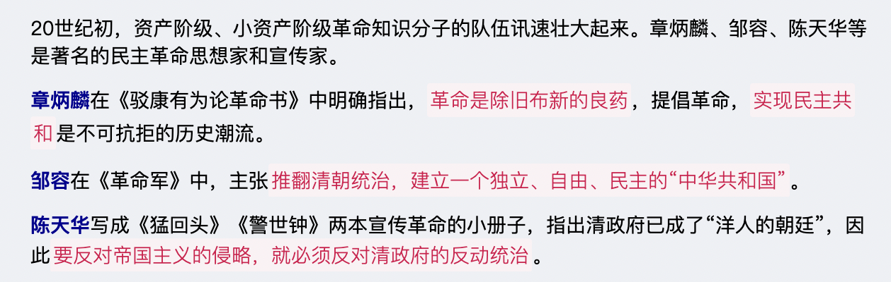

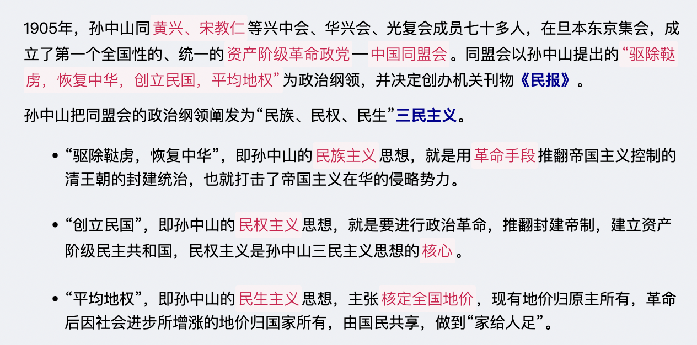

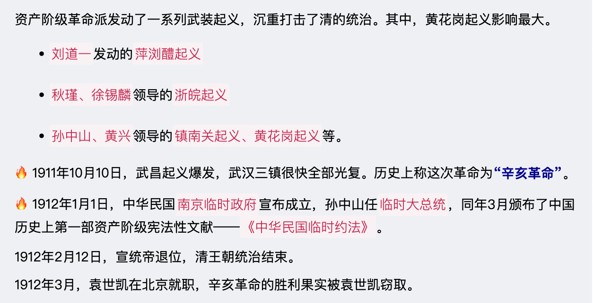

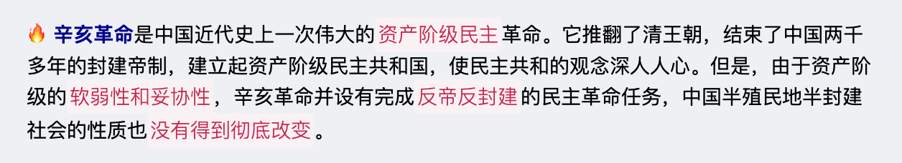