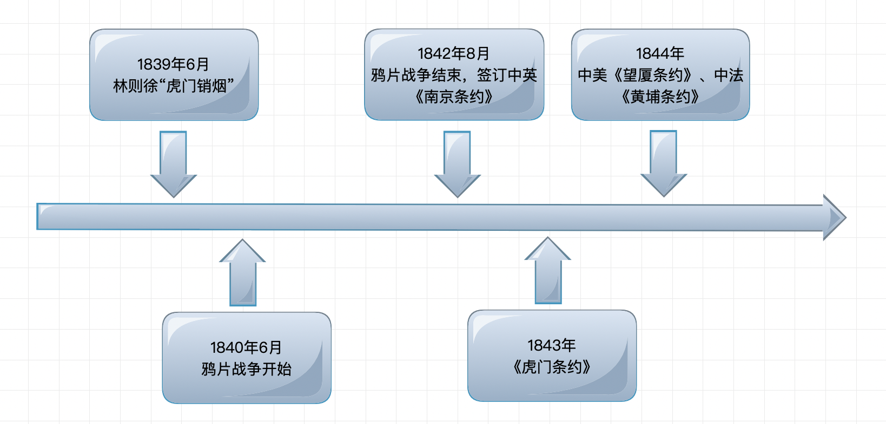
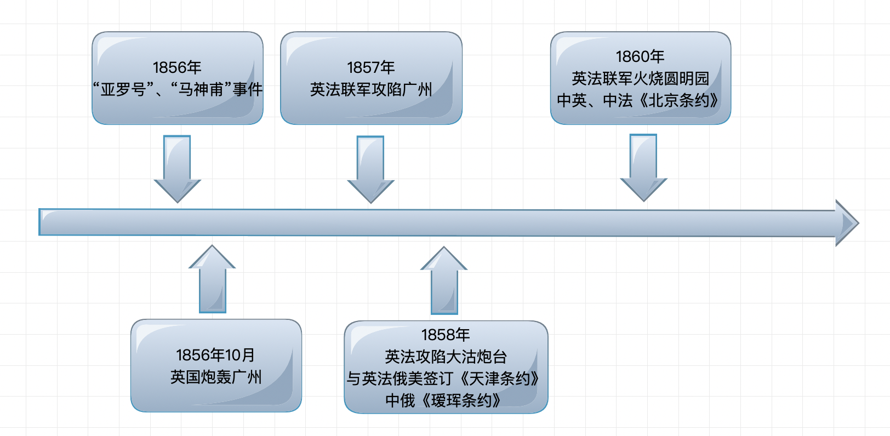
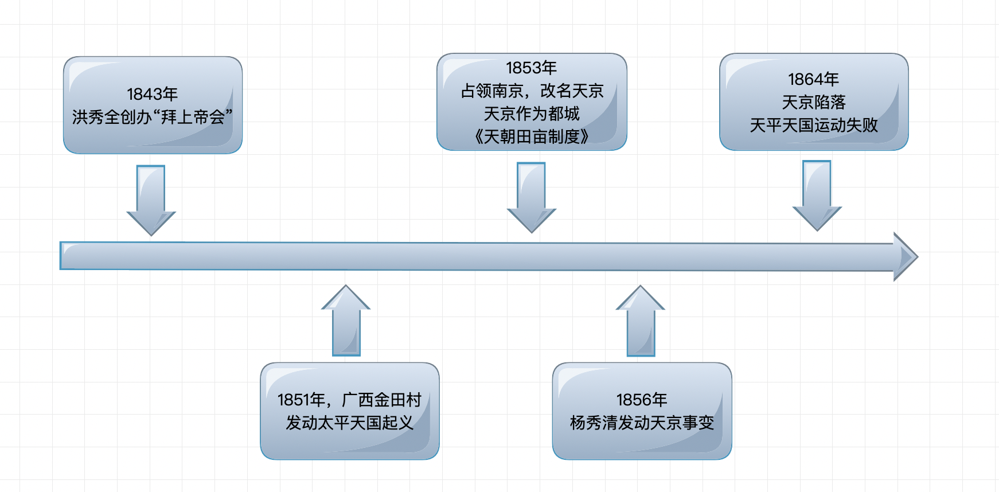

# 【历史】中国近代史

`2023/04/15 15:55:17  by: 程序员·小李`

#### 鸦片战争

白银外流，财政危机，鸦片残害了国民的身体。1838年底，道光帝派`林则徐`到广东禁烟。

> **虎门销烟**
>
> 🔥 1839年6月3日~25日，林则徐在`虎门`销毁收缴的110万千克的鸦片。

> **鸦片战争发展历程——典型人物：关天培、陈化成**
>
>1840年6月，英国舰队先后封锁珠江口，北上浙江定海，直逼天津。道光帝以办事不力裁撤林则徐，改派琦善赴广州谈和。
>
>1841年，英国强占香港岛，道光帝下令对英作战。英军占领虎门炮台，广州水师提督`关天培`战死。后英军又占领广州北的四方炮台，继续北上，先后攻占厦门、定海、宁波。
>
>1842年英军进犯吴淞，江南提督`陈化成`身负重伤仍坚持抵抗，力竭牺牲。8月初，英军抵达南京下关江面，清政府求和，鸦片战争结束。

🔥 广州`三元里人民的抗英斗争`，是近代史上中国人民`第一次自发的大规模抵抗外国侵略`的战争。

> ** 🔥 第一个不平等条约——《南京条约》**
>* 割`香港岛`给英国
>* 赔偿2100万银元
>* 开放`广州、福州、厦门、宁波、上海`五处为通商口岸
>* 关税商定
>
> 1843年，英国又强迫清政府签订**《虎门条约》**，获得`领事裁判权、片面最惠国待遇、通商口岸允许租地建房`的权利。
>
> 1844年，分别签订了中美**《望厦条约》**、中法**《黄埔条约》**。

🔥 鸦片战争以后，中国开始沦为半殖民地半封建社会，鸦片战争是中国近代史的开端。

#### 第二次鸦片战争

`英、法`在`俄、美`的支持下，以`“亚罗号事件”`和`“马神甫事件”`为借口，发动了第二次鸦片战争。

> 📚 历史事件
>
> **“亚罗号”**是一艘中国走私船，曾在香港注册，但已经过期。1856年10月，广东水师在黄埔搜捕了船上的几名海盗和涉嫌船员。英国驻广州代理领事硬说“亚罗号”是英国船，要求中国方面释放被捕人员，并谎称中国士兵扯落英国国旗，要求向英方赔礼道歉。两广总督`叶名琛`为避免事态扩大，同意释放被捕人员，但拒绝道歉。这就是所谓的“亚罗号事件”。
>
>**“马神甫”**即马赖，法国天主教神甫。他从广州非法潜入广西西林县，为非作歹，1856年2月被当地官员逮捕处死。这就是所谓的“马神甫事件”，又称“西林教案”。

> 📚 **第二次鸦片战争发展历程**：
>
>1856年10月，英军炮轰广州，挑起战争。
>
>1857年，英国和法国联合出兵，攻陷广州。
>
>🔥 1858年，英法联军北上，攻陷`大沽炮台`，逼近天津。清政府被迫与`俄、美、英、法`四国分别签订了**《天津条约》**。
> * `允许外国公使进驻北京`
> * 增开`汉口、南京`等十处为通商口岸
> * 外国商船和军舰可以在`长江各口岸自由航行`等特权。
>
>随后与英、法、美签订的《通商章程善后条约》中，清政府`被迫承认了鸦片贸易的合法化`。
>
>🔥 1860年10月，英法联军火烧`圆明园`。奕䜣被迫与英、法交换了《天津条约》批准书，并签订了中英、中法**《北京条约》**。
>* 增开`天津`为商埠
>* 割`九龙司地方一区`给英国
>* 允许英法招募华工出国

🔥 1858年，中俄签订**《瑷珲条约》**割让60多万平方千米，是近代史上`割让土地最多`的不平等条约

第二次鸦片战争使中国丧失更多主权，西方侵略势力由`东南沿海`一带深入到`长江中下游地区`，沙俄占领中国北方大片领土，中国的半殖民地化程度进一步加深。

#### 太平天国运动

1843年，洪秀全创立“拜上帝会”。

> **1851年——广西桂平金田村**
>
>1851年1月11日，洪秀全在`广西桂平县金田村`发动武装起义，建号`太平天国`，起义军称“太平军”。不久，洪秀全自称“天王”，封杨秀清为东王，萧朝贵为西王，冯云山为南王，韦昌辉为北王，石达开为翼王，所封诸王均受东王节制。

> **1853年——定都天京，发布《天朝田亩制度》**
>
>1853年3月，攻占`南京`，改名为`天京`，作为都城。太平天国颁布了`《天朝田亩制度》`，规定不分男女，按`人口和年龄`平均分配土地。意图建立`“有田同耕，有饭同食，有衣同穿，有钱同使，无处不均匀，无人不饱暖”`的理想社会。《天朝田亩制度》带有空想色彩难以施行，但它反映了农民要求得到土地的强烈愿望，对于发动和鼓舞广大农民参加反封建斗争起了积极的作用。

> **1856年天京事变——由盛及衰**
>
>1856年秋，杨秀清意图篡位。结果杨秀清被杀，韦昌辉被处死，石达开率部出走，太平军损失惨重，太平天国由盛转衰。

> **洪仁轩——资政新篇**
>
>洪秀全封`洪仁轩`为干王，总理朝政；提拔`陈玉成、李秀成`等一批青年将领。洪仁轩写成带有资本主义色彩的`《资政新篇》`，提出向西方学习、改革内政等主张，但由于历史条件的限制，未能付诸实践。

> **1864年太平天国运动失败**
>
>1864年，天京陷落，太平天国运动失败。

🔥 太平天国起义是中国历史上`规模最宏大`的一次`农民战争`。由于农民阶级的局限性，太平天国无法提出切合实际的革命纲领，无法制止和克服领导集团的腐败，也无法长期保持领导集团的团结。但沉重地打击了清朝的统治和外国侵略势力，谱写了中国近代史上壮烈的一章。

#### 新思想萌发

🔥 林则徐——`开眼看世界的第一人`，仿制西方战船，建设新式海军

魏源——`《海国图志》`介绍西方历史、地理，阐述“师夷长技以制夷”

#### 洋务运动

第二次鸦片战争后，掀起了一场旨在`“自强”“求富”`的洋务运动，主张`利用西方先进技术，强兵富国，维护清王朝的统治`。

> “洋务派”在中央以恭亲王`奕䜣`为代表，在地方以`曾国藩、李鸿章、左宗棠、张之洞`等人为代表。

>**洋务派的“自强”**：
>* 发展近代军事工业，先后创办了安庆内军械所（曾国藩）、江南机器制造总局（李鸿章）、福州船政局（左宗棠）等一批近代军事工业。
>* 兴办新式学校，培养翻译和军事人才;
>* 设立翻译馆，翻译外国科技书籍;
>* 派遣留学生出国深造等。

>**洋务派的“求富”**：
>* 开办一些近代民用企业。如轮船招商局（李鸿章）、开平煤矿（李鸿章）、汉阳铁厂（张之洞）、湖北织布局（张之洞）等。
>* 组建新式洋枪队，淘汰传统兵器，采用西式兵操练兵，使清朝军队的武器和战术逐渐发生变化。

1875年，清政府任命`左宗棠`为钦差大臣，他采取“先北后南，缓进急战”的策略。成功收复新疆。

1884 年，清政府在新疆`建立行省`。

在直隶总督`李鸿章`的倡议下，大规模进行近代`海防建设`，筹建新式海军。到19世纪80年代，福建、广东、南洋和北洋等海军初步建成，其中以`北洋舰队`规模最大。

1885年，清政府成立`海军衙门`统一协调指挥，同年还在台湾`建立行省`。

> 京师同文馆
>
> 京师同文馆是中国第一所新式学堂。`奕䜣`考虑到中国和外国的“语言不通，文字难辨”，设立同文馆。1862年，同文馆正式成立，选拔14岁以下的八旗子弟进馆学习，后又扩招满汉学员。课程初设英、法、俄文，后增添算学、天文等。同文馆对于培养翻译人才和传播西学，起了一定的作用。

#### 甲午中日战争

丰岛海战：1894年7月，日军进攻驻守朝鲜的中国军队，并在牙山口外丰岛海面袭击清军运兵船，清政府被迫对日宣战

甲午中日战争分为两个阶段：
* 第一阶段：1894年7-9月，主要战役有平壤战役、黄海海战
* 第二阶段：1894年10月~1895年4月，主要战役有辽东战役、威海卫战役

>**平壤战役**：
>
>1894年9月，日军分多路围攻平壤。中国守军奋起反击，清军将领`左宝贵`中炮牺牲，统帅`叶志超`弃城逃跑，平壤陷落。

> **黄海海战**
>
>`北洋舰队`与日本联合舰队在黄海海面也展开激战。致远舰管带`邓世昌`在舰身严重受损、弹药将尽之际，下令开足马力，冲向日舰“吉野号”，准备与敌人同归于尽，不幸被敌人炮弹击中，200余名将士壮烈殉国。

>**辽东战役**：
>
>日军从辽东半岛的花园口登陆，占领大连、旅顺，在旅顺日军实行了野蛮的大屠杀。

>**威海卫战役**：
>
> 1895年初，日本陆海军进攻山东威海卫，北洋舰队陷入绝境。日军写信给北洋水师提督`丁汝昌`，劝其率舰队投降，遭到严词拒绝。在援兵无望的情况下，丁汝昌自杀殉国。北洋舰队全军覆没。

>1895年春，清政府派`李鸿章`为议和全权大臣，前往日本马关议和。双方签订中日**《马关条约》**，规定:
>* 割`辽东半岛、台湾全岛及所有附属各岛屿、澎湖列岛`给日本; 
>* 赔偿日本兵费`白银2亿两`;
>* 开放`沙市、重庆、苏州、杭州`为商埠;
>* 允许日本在通商口岸`开设工厂`等。

《马关条约》使外国侵略势力进一步深入中国腹地，大大加深了中国的半殖民地化程度。

#### 戊戌变法

> **公车上书**
>
> 1895年春，《马关条约》签订后，群情激愤。康有为、梁启超等，联合各省1300多名参加会试的举人，上书光绪帝，请求`拒和、迁都、变法`。这就是著名的“公车上书”，拉开了`变法维新`的序幕。

维新人士在各地组织学会，创办报刊，宣传变法，推动了维新变法思想的广泛传播。其中影响最大的报刊是上海的`《时务报》`和天津的`《国闻报》`。

`梁启超`在《时务报》上发表《变法通议》：“法者天下之公器也，变者天下之公理也”，“变亦变，不变亦变”，日本以变法而强大，中国如果不变法，将会因守旧而灭亡。

> 康有为的《新学伪经考》、《孔子改制考》——将西方资本主义的政治学说与传统儒家思想相结合
>
> 梁启超的《变法通议》——抨击顽固派因循守旧，阐述变法图存的道理
>
> 严复的《天演论》——“物竞天择、适者生存”

`严复`等主持的《国闻报》，以“通上下之情”“通中外之故”为目的，号召变法图强，成为北方最有影响的报纸。

>1898年6月11日，清政府颁布`“明定国是”`诏书，开始戊戌变法。主要内容有:
>* 裁撤冗官冗员，允许官民上书言事;
>* 鼓励私人兴办工矿企业，发展农、 工、商业
>* 改革财政，编制国家预算
>* 废除八股，改试策论，开办新式学堂
>* 裁减绿营，训练新式军队等。

9月21日，慈禧太后等发动政变，`囚禁光绪帝`，搜捕维新人士，废除变法诏令。康有为、梁启超先后出逃。`谭嗣同、刘光第、林旭、杨锐、杨深秀、康广仁`六人被捕遇害，史称“戊戌六君子”。这次变法历时103天，因此又被称为“百日维新”。 

#### 义和团运动、八国联军侵华

义和团由山东、直隶一带的`义和拳`、民间秘密结社和练拳习武的组织发展而来。这些组织树起“扶清灭洋”的大旗，逐渐由反清的秘密结社或单纯的习武团体，转变为具有广泛群众性的`反帝斗争组织`。清政府以“招抚”代替“剿灭”，并承认其合法地位。

1900年6月，为镇压义和团运动，`英、美、俄、日、法、德、意、奥`八国组织联军2000多人，在英国海军司令`西摩尔`的率领下，从天津向北京进犯。义和团破坏沿线铁路，并在廊坊一带阻击敌人。八国联军死伤多人，被迫撤回天津。

8月14日，联军攻陷北京。慈禧太后携光绪帝狼狈西逃，并下令剿杀义和团，并无耻地请求八国联军“助剿”。义和团在中外反动势力的镇压下失败。义和团运动虽然失败了，但它沉重打击了帝国主义瓜分中国的野心。

>1901年9月，清政府被迫同`英、美、俄、日、法、德、意、奥、比、荷、西`11国，签订了丧权辱国的《辛丑条约》:
>* 清政府赔款白银 4.5 亿两，分 39 年还清，本息共计 9.8 亿两，以海关税、盐税等税收作担保;
>* 清政府保证严禁人民参加各种形式的反帝活动
>* 清政府拆毁大沽炮台，允许外国军队驻扎在从北京到山海关的铁路沿线要地
>* 划定北京东交民巷为使馆界，允许各国派兵驻守，不准中国人居住
>* 改总理衙门为外务部，班列六部之前

《辛丑条约》是中国近代史上`赔款数目最庞大`、`主权丧失最严重`的不平等条约。从此，清政府沦为帝国主义列强统治中国的工具，中国`完全陷入`半殖民地半封建社会的深渊。

#### 孙中山与辛亥革命

🔥 1894年11月，孙中山在`檀香山`成立`兴中会`，提出“振兴中华”的宗旨，号召`“驱除鞑虏，恢复中国，创立合众政府”`。

1895年，孙中山回到香港，联络陆皓东等人成立`香港兴中会总会`，同时开展筹款、联络会党和军队等秘密工作，准备在广州发动武装起义，建立革命据点。10月，起义消息泄露，起义失败。

>《辛丑条约》签订后，国内革命情绪日趋高涨。资产阶级革命思想得到迅速传播，出现了很多著作，号召人们推翻清政府的统治，建立`民主共和`制度，各种革命团体也纷纷成立，影响较大的有`华兴会和光复会`。
>* `章炳麟`的《驳康有为论革命书》——革命是除旧布新的良药，实现民主共和是不可抗拒的历史潮流
>* `邹容`的《革命军》——推翻清朝统治，建立独立、自由、民主的“中华共和国”
>* `陈天华`的《猛回头》和《警世钟》——清政府已成为洋人的朝廷，要反对帝国主义侵略，必须反对清政府反动统治

🔥 1905年8月，孙中山联合`兴中会、华兴会、光复会`等革命团体的成员，在日本东京成立了`中国同盟会`。在成立大会上，确定了`“驱除鞑虏，恢复中华，创立民国，平均地权”`的政治纲领，选举孙中山为`同盟会总理`，建立领导机构。大会决定创办`《民报》`，作为同盟会的机关报。中国同盟会是第一个全国规模的、统一的资产阶级革命政党。

孙中山将同盟会的政治纲领阐发为`“民族”“民权”“民生”`三大主义，合称“三民主义”。三民主义成为孙中山领导资产阶级革命的`指导思想`。

>1906年冬，同盟会会员`刘道一、蔡绍南`在江西湖南交界的`萍乡、浏阳、醴陵`发动武装起义，史称“萍浏醴起义”。萍浏醴起义是同盟会成立后领导的`第一次武装起义`。起义虽然失败，但同盟会的声望由此大振。 
>
>1907年夏，光复会会员`徐锡麟`在安庆发动起义，刺杀安徽巡抚恩铭。起义人员与清军激战四小时，因寡不敌众而失败，徐锡麟死难。革命党人`秋瑾`在浙江绍兴准备策应，因歹徒告密，被捕遇难。
>
>1907年，孙中山亲赴`越南河内`，与`黄兴`共同筹划领导`广西起义`，袭取镇南关。起义军奋战七昼夜，因弹药缺乏，最终失败。
>
>1910年，孙中山同`黄兴、赵声`等人商讨在广州举行起义。1911年4月，由于情况发生变化，黄兴在准备尚未就绪的情况下，临时决定提前举事。他亲率一百余名革命党人攻入两广总督衙门，总督张鸣岐吓得爬后墙逃走。革命党人与清军展开激烈巷战，苦战一昼夜，终因众寡悬殊，起义失败，很多革命党人壮烈牺牲，历史上称此次起义为**“黄花岗起义”**。

1911年，湖北革命组织`文学社与共进会`，在同盟会的推动下，积极谋划起义。10月9日，共进会负责人孙武等在汉口租界制造炸弹，不慎爆炸，起义计划泄露。清政府到处搜捕革命党人，形势非常紧迫。10月10日晚，武昌城内`新军工程营`的革命党人首先起义。他们夺取军械库，打开城门迎接驻守城外的炮兵入城，然后步炮联合，进攻总督衙门。一夜之间，武昌全城被起义军占领。随后，汉阳、汉口的新军起义响应，革命在武汉三镇取得胜利。10月11日，起义军成立湖北军政府，推举新军将领`黎元洪`为都督。

> 1911年是农历辛亥年，史称**“辛亥革命”**。辛亥革命`推翻了清王朝的反动统治`，宣告了`中国两千多年君主专制制度的终结`，民主共和深入人心。但没有完成彻底的反帝反封建任务，中国半殖民地半封建社会性质没有改变。

1911年12月，各省代表在南京集会，选举`孙中山`为临时大总统。

> 🔥 1912年1月1日，孙中山在`南京`宣誓就职，宣告中华民国临时政府成立，以1912年为民国元年，改用阳历。随后，又选举`黎元洪`为副总统;成立临时参议院，由各省的会议代表任参议员。 

武昌起义成功后，湖北军政府与清朝内阁总理大臣袁世凯交涉，力图通过和平的方式早日实现共和。南京临时政府成立后，孙中山也曾表示，如果清帝退位，袁世凯宣布赞成共和，他即行辞职，并推举袁世凯继任临时大总统。

1912年2月12日，`宣统帝`下诏退位。 清朝260多年的统治结束。

1912年2月13日，孙中山向临时参议院`提出辞职`，并推荐袁世凯继任临时大总统。

1912年2月15日，临时参议院选举`袁世凯`为临时大总统。

为了限制袁世凯的权力，孙中山提出临时政府设在南京、新任大总统应到南京就职等条件。袁世凯以北方秩序不易维持等为借口，不肯南下，迫使南京参议院同意他在北京就职。

1912年3月，袁世凯在`北京`就任中华民国临时大总统。

1912年4月，孙中山`正式解除临时大总统职务`，临时政府迁往北京， 辛亥革命的胜利果实被袁世凯窃取。

>1912年3月11 日，孙中山以临时大总统名义颁布了由参议院制定的`《中华民国临时约法》`：
>* 中华民国的主权属于全体国民
>* 国民不分种族、阶级、宗教信仰，一律平等
>* 国民有人身、居住、言论、出版、集会、结社、 宗教信仰及请愿、考试、选举、参政等自由和权利 
>* 参议院行使立法权，国务员辅佐临时大总统行使行政权并负其责任
>* 司法独立

《中华民国临时约法》是中国历史上`第一部具有资产阶级共和国宪法性质`的重要文件。它肯定了资产阶级民主共和制度和民主自由原则，是辛亥革命的重要成果，但在当时的历史条件下难有实际的约束效力。

袁世凯就任临时大总统后，公然背弃誓言，一再破坏责任内阁制。同盟会会员`宋教仁`等在征得孙中山同意后，于1912年以同盟会为基础，联合其他几个政党，组成国民党，并在随后的第一届国会选举中占据了明显优势，使袁世凯大为惊恐。

1913年春，宋教仁`遇刺身亡`，袁世凯遭到国内舆论的谴责。他决定以武力镇压国民党。孙中山和黄兴等号召南方各省起来反袁，发动`“二次革命”`。但国民党力量涣散，二次革命很快被袁世凯镇压下去。孙中山、黄兴等被迫流亡日本。

镇压二次革命之后，袁世凯强迫国会选举他为正式大总统，随即又下令`解散国民党`。1914年初，袁世凯解散国会。不久，他又废除《中华民国临时约法》，颁布《中华民国约法》，改责任内阁制为`总统制`。接着，修改总统选举法，规定总统`可无限期连任`，可指定继承人。

袁世凯接受日本`“二十一条”`的大部分内容，以换取日本的支持。“二十一条”的主要内容有承认日本继承德国在山东的一切特权，进一步扩大日本在“南满”和蒙古的权益，规定中国沿海港湾、岛屿不得租借或割让他国，聘用日本人为顾问等。

1915年末，袁世凯下令以1916年为“中华帝国洪宪元年”，准备在元旦举行登基大典。

孙中山发表《讨袁檄文》，号召爱国豪杰共同奋起，维护共和制度。

1915年底，蔡锷、李烈钧、唐继尧在云南宣告独立，组织护国军北上讨袁，**护国战争**爆发。

1916年3月，袁世凯被迫宣布取消帝制，6月在绝望中死去，护国战争结束。

袁世凯死后，北洋军阀分裂，这些军阀为了争夺地盘和巩固政权，不惜出卖国家利益，依附帝国主义。大小军阀 连年混战，中国陷入了军阀割据纷争的动乱之中。
* 以`冯国璋和曹锟`为首的`直系`军阀，控制着江苏、江西、湖北等省
* 以`段祺瑞`为首的`皖系` 军阀掌握着北京政府，并控制着安徽、浙江、山东、福建等省
* `奉系`军阀`张作霖`盘踞`东北`。
* 云南、贵州被`滇系`军阀`唐继尧`所占
* 广东、广西被`桂系`军阀`陆荣廷`所占

> 护法运动
>
> 袁世凯死后，继任的北洋统治者拒绝恢复《中华民国临时约法》和国会。孙中山认为，约法和国会是共和国的象征，为了维护共和制度，他毅然举起了“护法”的大旗。1917年秋，孙中山在广州组织护法军政府，试图借助滇系、桂系等西南军阀的军事力量，开展护法运动。然而，南北军阀最终达成了妥协，孙中山被排挤出军政府。1918年5月，孙中山被迫离开广州回到上海，护法运动失败。