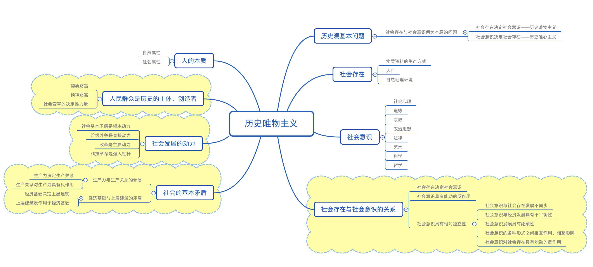
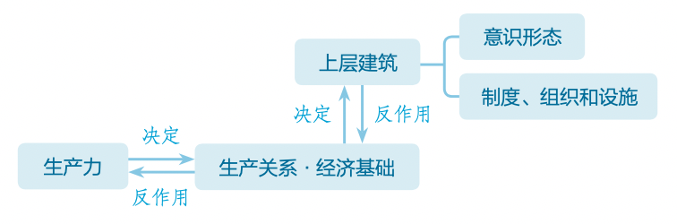

# 【哲学】历史唯物主义

`2023/04/08 10:28:05  by: 程序员·小李`

## 一、唯物史观

#### 1.1 历史观

`劳动`推动了人类社会的产生和发展。

社会生活本质上是`实践`的。`物质生产`的实践构成了社会生活的经济领域，`调整、改革社会关系`的实践构成了社会生活的政治领域，`创造科学文化`的实践构成了社会生活的精神文化领域。

历史观基本问题是`社会存在和社会意识`的关系问题。历史唯物主义认为，社会存在决定社会意识；历史唯心主义认为社会意识决定社会存在。

> **社会存在**：社会实践和生活条件的总和，包含`生产方式、人口、自然地理环境`。生产方式起决定性作用。
>
> **社会意识**：人类生活的`精神、思想方面`，包括社会心理、道德、宗教、法律、政治思想、艺术、科学、哲学等等。包括低层次的社会心理（直接的、不定型的、不系统的、自发的感情、风俗、倾向等）和高层次的社会意识（系统的、稳定的）

#### 🔥 1.2 社会存在与社会意识的关系

社会存在`决定`社会意识，社会意识对社会存在具有`能动的反作用`。

社会意识具有相对独立性，体现在：
* 社会存在和社会意识的发展具有`不完全同步`（有时会落后于社会存在，有时又会先于社会存在而变化、发展）
* 社会意识与经济发展具有`不平衡性`
* 社会意识发展具有`继承性`
* 社会意识之间相互影响
* 社会意识对社会存在具有`能动`的反作用（落后的社会意识对社会发展起阻碍作用，先进的社会意识可以正确地预见社会发展的方向和趋势，对社会发展起积极的推动作用）

#### 🔥 1.3 社会的基本矛盾

人们在生产活动中形成的生产方式决定着社会的性质和面貌，生产方式的变革决定着社会形态的更替。

社会的基本矛盾是：生产力和生产关系的矛盾、经济基础和上层建筑的矛盾

> 生产力：人类改造自然、创造物质的能力。包含实体性要素（劳动者、劳动对象、生产资料）和渗透性要素（技术、管理等）。**生产工具**是生产力发展的`主要标志`。

> 生产关系：物质生产和经济生活中产生的关系，包括生产资料所有制关系、人与人的关系、产品分配制度等。其中生产资料所有制形式上决定性的。

生产力是生产方式中最革命、最活跃的因素，生产力`决定`生产关系，决定生产关系的产生、发展、变更。

生产关系`反作用于`生产力：生产关系适应生产力的时候会促进生产力的发展，反之会阻碍生产力发展。

> 经济基础：社会发展到一定阶段的生产力所决定的生产关系的总和。

> 上层建筑：建立在经济基础上的意识形态、制度、组织、设施总和。包括政治上层建筑（政治制度、法律制度、军队、警察、监狱、法庭、政府部门、党派等）、思想上层建筑（宗教、艺术、哲学、美学、法律思想、政治思想、道德），`国家政权`是上层建筑的核心。

经济基础决定上层建筑，决定上层建筑的产生、发展、性质。

上层建筑反作用于经济基础，由基本适应到基本的不适用，再到基本的相适应。上层建筑适应生产力发展时促进社会发展，否则会阻碍社会发展。

#### 1.4 社会形态

阶级是社会生产发展到一定阶段但生产不足才产生的，是一种社会历史现象

🔥国家是`阶级矛盾无法调和`的产物，是`阶级统治`的工具，根本属性是`阶级性`。

#### 1.5 社会发展的动力

社会发展的总趋势是`前进的、上升的`，发展的过程是`曲折的`。社会发展是在生产力与生产关系、经济基础与上层建筑的矛盾运动中，不断产生、发展和解决中实现的。

🔥**社会基本矛盾**是社会发展的`根本动力`

🔥**阶级斗争**是社会发展的`直接动力`

**改革**是社会发展的`重要动力`，是`自我完善和发展`。

**科技革命**是推动社会发展的`强大杠杆`。科学技术是第一生产力，`科技进步和创新`是增强综合国力的决定性因素。

> 生产力与生产关系、经济基础与上层建筑之间的矛盾是`非对抗性`的矛盾，可以通过社会主义的`自我发展、自我完善`加以解决。改革的根本目的，就是使生产关系`适应`生产力的发展，使上层建筑`适应`经济基础的发展。

#### 1.6 历史的主体和创造者——人民群众

>人民群众是`社会历史的主体`。
>
>人民群众是社会`物质财富的创造者`。人民群众的生产活动是社会存在和发展的基础。
>
>人民群众是推动社会历史发展的决定力量。
>
>人民群众是社会`精神财富的创造者`。人民群众的生活和实践是一切精神财富形成和发展的`源泉`。人民群众的实践为精神财富的创造提供了必要的物质条件。人民群众还直接创造了丰硕的社会精神财富。
>
>人民群众是`社会变革的决定力量`。人民群众在任何时期都是社会变革的`主力军`。在阶级社会中，生产关系的变革、社会制度的更迭，都是通过人民群众的革命实现的。人民群众通过推动生产力的发展而不断创造和改变社会关系，从而不断推动社会历史进步和发展。

群众观点的基本内容：相信人民群众自己解放自己，全心全意为人民服务，一切向人民群众负责，虚心向人民群众学习。群众观点是无产阶级政党的`根本立场和根本观点`，是党制定路线、方针、政策的`根本出发点`。

群众路线的基本内容：一切为了群众，一切依靠群众，从群众中来，到群众中去。群众路线是无产阶级政党的根本的`领导方法和工作方法`，是我们党的生命线和根本工作路线,是我们党永葆青春活力和战斗力的重要传家宝。保持党的先进性和纯洁性、巩固党的执政基础和执政地位，最重要的就是靠`坚持群众观点和群众路线、密切联系群众`。

#### 1.7 人的本质和价值

人的属性分为`自然属性`和`社会属性（本质）`

人的`自我价值`就是为了生存和自身发展产生的行为价值。人的`社会价值（首位的）`是对社会需要的满足。

哲学上的价值是指`客体对主体的积极意义`，即一事物所具有的能够满足主体需要的积极功能和属性，具有高度的概括性和普遍性。

人的价值在于通过自己的活动满足社会、他人和自己的需要，但主要在于对`社会`的贡献。评价一个人价值的大小，就是看他为人类、社会、国家和人民贡献了什么。

人们在认识各种具体事物价值的基础上，会形成对事物价值的`总的看法和根本观点`，这就是价值观。价值观直接影响一个人的理想、信念、生活目标。

## 价值与价值观

#### 2.1 价值观

>价值观对人们认识和改造世界的活动有重要导向作用。一方面，价值观影响人们`对事物的认识和评价`。价值观不同，人们对事物的认识和评价就不同。另一方面，价值观影响人们`改造世界的活动`，影响人们的`行为选择`。选择正确，才能在改造世界的活动中取得成功;选择错误，就会遭到失败。
>
>价值观是人生的重要向导。一个人走什么样的人生道路，选择什么样的生活方式，都是在一定世界观和价值观的指导下进行的。 价值观不同，人们在面对公义与私利、生与死等冲突时作出的选择也不同。
>
>价值观承载着一个民族和国家的精神追求，体现着一个社会评判是非曲直的标准。人类社会发展的历史表明，对一个民族和国家来说，最持久、最深层的精神力量是全社会共同认可的核心价值观。

社会主义核心价值观是当代中国精神的集中体现，凝结着全体人民共同的价值追求。`富强、民主、文明、和谐`是国家层面的价值目标，`自由、平等、公正、法治`是社会层面的价值取向，`爱国、敬业、诚信、友善`是公民个人层面的价值准则。这24个字是社会主义核心价值观的基本内容，回答了我们要建设什么样的国家、建设什么样的社会、培育什么样的公民的重大问题，为培育和践行社会主义核心价值观提供了基本遵循。

#### 2.2 价值判断与选择

>人们从事各种实践活动，要不断进行判断和选择。人们既要对事物的客观状况及其本质属性、发展规律作出判断，又要进一步对事物能否满足主体的需要以及满足的程度作出判断（后者叫价值判断）。价值判断和价值选择是`社会存在在不同人的头脑中的反映`，是在`社会实践`的基础上形成的。人们选择的目标能否实现以及实现的程度如何，取决于人们的认识`是否符合`社会发展的客观规律。因此，要树立正确的价值观，就必须`坚持真理，遵循社会发展的客观规律`，走历史的必由之路。
>
>1. 价值判断和价值选择会因`时间、地点和条件`的变化而不同，这就是价值判断和价值选择的社会历史性特征。把握价值判断和价值选择的社会历史性，有助于我们正确评价历史和现实中的各种价值观念，防止简单化和片面化倾向;有助于我们的价值观念与时俱进，从而作出正确的价值判断，进行正确的价值选择。
>
>2. 社会地位不同、需要不同，价值判断和价值选择也就不同。在阶级社会中，价值判断和价值选择`具有阶级性`。
>
>3. 价值判断与价值选择往往因人而异。面对同一问题，产生不同价值判断与价值选择的冲突。这就要求我们明确价值判断和价值选择的`标准`，分辨什么是对的、 什么是错的，应该怎么做、不应该怎么做。

必须坚持人民至上，把`人民群众的利益`作为最高的价值标准。我们想事情、做工作，想得对不对、做得好不好，要有一个根本的衡量尺度，这就是人民拥护不拥护、人民赞成不赞成、人民高兴不高兴、人民答应不答应。我们要自觉站在最广大人民的立场上，牢固树立为人民服务的思想，把献身人民的事业、维护人民的利益作为自己最高的价值追求。

我们应当正确反映并妥善处理各种利益关系，认真考虑和兼顾不同阶层、不同方面群众的利益。最重要的是必须首先考虑并满足`最大多数人的利益要求`。最大多数人的利益是最紧要和最具有决定性的因素。要把个人、集体、社会利益三者的统一作为选择的标准。当个人利益同人民群众的利益发生冲突时，要自觉站在人民群众的立场上进行选择;当个人利益与他人利益发生冲突时，要善于从不同角度思考，理解和尊重他人的正当选择。

#### 2.3 价值创造

劳动是人类`最基本的实践活动`，也是人的存在方式。人只有在劳动中才能自由地彰显和发挥自己的智力和体力、意志和情感，创造和实现自己的价值。一个人在劳动中创造的财富越多，意味着他为满足社会和他人的需要所作的贡献就越大，他自身的价值就越大。

在社会主义社会，劳动是创造美好生活、促进人的自由全面发展的重要手段。当代中国，人民对美好生活的向往就是中国共产党 的奋斗目标，而美好生活必须通过全体人民共同奋斗才能得到。

努力奉献的人是幸福的。走不出自我狭隘天地的人，不想为他人和社会奉献的人，永远不可能拥有真正的幸福。爱我们的家人， 爱我们身边的朋友，爱我们的事业，爱我们的祖国，积极投身于为人民服务的实践，是实现人生价值的必由之路，也是拥有幸福人生的根本途径。

`社会提供的客观条件`是人们创造和实现人生价值的前提。人在实践活动中创造和实现自己价值的时候，必须利用社会和他人提 供的各种物质条件和知识成果。完全脱离社会的“个人奋斗”和“自我实现”，实际上是不可能的。人的价值只能在`社会`中实现。 只有正确处理个人与集体、个人与社会的关系，才能在奉献社会中创造和实现自己的价值。

我们强调在与社会的统一中创造和实现个人的价值，并不否认追求人的个性发展。但是，这种个性不应表现为人的怪异和陋习， 而应表现为对他人、对社会的独特的贡献方式。

>创造和实现人生价值，需要`充分发挥主观能动性`，需要`顽强拼搏、自强不息`的精神。人的先天条件是无法改变的，后天的努力却人人都能做得到，关键是看我们愿不愿做、怎样去做。在人生旅途上，每个人都难免会遇到挫折和失败。有的人遇到它们就失去继续前行的信心和勇气;有的人却在不断克服困难、战胜挫折中增强信心和能力，从而越走越远。在新时代，我们更要奋斗。只有奋斗的人生才称得上幸福的人生，奋斗本身就是一种幸福。
>
>创造和实现人生价值，需要`努力增长自己的才干`，`全面提高个人素质`。人生价值的创造和实现过程是个人在实践和认识活动中施展自己能力的过程。一般来说，能力卓越的人，更有可能创造出卓越的人生。全面的能力可以帮助人们应对不同的生活场景，解决多样的人生难题，把握难得的人生机遇，从而为人生价值的创造和实现提供更加广阔的空间。
>
>创造和实现人生价值，需要`有坚定的理想信念`，需要`正确价值观`的指引。人不可能生活在真空之中，各种错误思想和消极因素会对我们产生各种各样的冲击。这就需要我们学会辨别是与非，排除外界的干扰，坚持正确的理想信念，时刻用正确的价值观指导自己，沿着正确的人生道路前进。
>
>创造和实现人生价值，需要`锤炼品德修为，不断打牢道德根基`。品德是为人之本，我们应自觉树立和践行社会主义核心价值观，善于从中华民族传统美德中汲取道德滋养，从英雄人物和时代楷模的身上感受道德风范，从自身内省中提升道德修为，把正确的道德认知、自觉的道德养成、积极的道德实践紧密结合起来，不断修身立德，打牢道德根基。只有这样，我们才能在人生道路上走得更正、走得更远。

## 文化

#### 3.1 文化的内涵

一般来说，文化一词有广义和狭义两种理解。广义的文化是指人类认识和改造世界的一切活动及其创造的`物质成果和精神成果`。狭义的文化是相对于经济、政治而言的`人类全部精神现象`，既包括世界观、人生观、价值观等具有意识形态性质的内容，又包括自然科学和技术等非意识形态的内容。 

文化是人类社会实践的产物，纯粹自然的东西不能称为文化。经济是基础，政治是经济的集中表现，文化是经济和政治的`反映`。一定的文化由一定的经济、政治所决定，又反作用于一定的经济、政治，给予经济、政治以重大影响。`世界观、人生观、价 值观`是文化的核心，`支配和影响`着人们的文化实践与文化生活。

文化与文明既有区别又有联系。文明与野蛮相对立，是人类进步和开化状态的标志。物质方面的进步称为物质文明，精神方面的 进步称为精神文明，制度方面的进步称为制度文明，生态方面的进步称为生态文明。只要是文明就是积极向上的。文化则有先进与落后的区分，反映先进的经济和政治的文化形成了先进文化，反映腐朽落后的经济和政治的文化形成了落后文化。文化与文明都是`实践`的产物，其`创造主体都是人`。先进文化是人类文明的一项重要内容。

文化要通过`载体`呈现出来。所谓文化载体，是指文化的`记录、记载、标识、传承和表现`的物化形式。文化载体承载、表达和展现着文化的内容。文化载体是多种多样的，`器物、行为、制度`等是文化的载体。

#### 3.2 文化的功能

文化具有`引领风尚、教育人民、服务社会、推动发展`的功能。文化可以引导人们认识真善美，为人们提供精神指引，提升全民族的文明素养。文化可以教化育人，帮助人们提高思想道德素质、科学文化素质和身心健康素质，促进人的全面发展。文化可以服务社会，满足人们过上美好生活的新期待，为人们提供丰富的精神食粮。文化可以推动发展，是国家繁荣振兴取之不尽、用之不竭的力量源泉，对提高社会文明程度具有重要作用。

文化是民族的`血脉和灵魂`。文化兴国运兴，文化强民族强。当代中国，铸牢中华民族共同体意识，要以认同、传承和发展中华优秀传统文化为前提。没有高度的文化自信，没有文化的繁荣兴盛， 就没有中华民族的伟大复兴。

#### 3.3 中华民族传统文化

中华文化是我国各民族在交流、碰撞、交锋中发展起来的，也是在与世界各国文化的交流、碰撞、交锋中发展起来的。一方面，各民族文化`相互交融、相互促进`，共同熔铸了灿烂的中华文化，成为中华民族独特的精神标识;另一方面，中华文化注重`吸收和借鉴外来文化`的有益成果，不断增强其包容性，促进了自身的发展。

>中华优秀传统文化的主要内容：`核心思想理念、中华传统美德、中华人文精神`等。
>* 核心思想理念：`讲仁爱、重民本、守诚 信、崇正义、尚和合、求大同`等;
>* 中华传统美德：`自强不息、敬业乐群、扶危济困、见义勇为、孝老爱亲`等;
>* 中华人文精神：`促进社会和谐、鼓励人们向上向善`等。

中华文化具有强大的凝聚力和连续性，是中华民族共同文化特质的体现。中华文化很长时间一直走在世界前列，对周边国家和世界文明进程产生了深远影响，中华民族为人类文明进步作出了不可磨灭的贡献。中华优秀传统文化是中华民族的突出优势，也是我们最深厚的文化软实力。

学习、研究、应用传统文化，既是一个`“取其精华、去其糟粕”`，改造传统文化的过程，也是一个`“推陈出新、革故鼎新”`，创造新文化、发展先进文化的过程。今天，我们要坚持`古为今用、推陈出新`，`有鉴别地`加以对待，`有批判地`予以继承，努力用中华民族创造的一切精神财富来以文化人、以文育人。

不忘本来才能开辟未来，善于继承才能更好创新。`优秀传统文化`是一个国家、一个民族传承和发展的根本。只有坚持从历史走向未来，从延续民族文化血脉中开拓前进，我们才能办好今天的事情，推动国家发展。

中华文化是中华民族`共同的精神标识`，涵养着中华民族共同的价值观。传承和弘扬中华优秀传统文化，能够激发民族自信心和自豪感，有助于促进民族团结，维护国家的安全和统一，铸牢中华民族共同体意识。中华优秀传统文化中所蕴含的诸如革故鼎新、与时俱进的思想，脚踏实地、实事求是的思想，惠民利民、安民富民的思想，道法自然、天人合一的思想等，能够为解决当代中国和世界发展中的许多问题提供有益借鉴。中华优秀传统文化强调求同存异、和而不同、和平发展，这些思想观念有助于正确认识和处理国际关系，推动建立以合作共赢为核心的新型国际关系，构建人类命运共同体。

#### 3.4 弘扬中华民族传统文化和民族精神

实现中华优秀传统文化创造性转化，必须按照当今时代的特点和要求，对传统文化中有借鉴意义的内涵和陈旧的表达形式予以`改造`，转化为符合时代特点和要求的`新内涵`和`新的呈现形式`，使之与当代文化相适应、与现代社会相协调。

实现中华优秀传统文化创新性发展，必须按照当今时代社会生活和社会实践的进步和发展，对中华优秀传统文化的内涵进行`补充、拓展和完善`，使之成为适合当今时代实践和社会发展要求的文化形式。

**民族精神**：中华民族形成了以`爱国主义`为核心，`团结统一、爱好和平、勤劳勇敢、自强不息`的伟大民族精神。无论什么时候，爱国主义都是动员和鼓舞中国人民团结奋斗的一面旗帜，是各族人民风雨同舟、自强不息的精神支柱。

中国人民在长期奋斗中培育、继承、发展起来的伟大民族精神，为中国发展和人类文明进步提供了强大精神动力。中国人民是具有伟大创造精神、伟大奋斗精神、伟大团结精神、伟大梦想精神的人民。中华民族精神集中体现了中华民族的整体风貌和精神特征，体现了中华民族共同的价值追求，是中华民族永远的精神火炬。

民族精神的形成和发展既是长期历史积淀的过程，也是随着时代变化而不断丰富的过程。
* 新民主主义革命时期，中国共产党团结带领人民浴血奋战、百折不挠，推翻了三座大山，建立了中华人民共和国，铸就了`井冈山精神、长征精神、遵义会议精神、延安精神、西柏坡精神`等。
* 社会主义革命和建设时期，党团结带领人民自力更生、发愤图强，确立了社会主义制度，推进了社会主义建设，铸就了`抗美援朝精神、红旗渠精神、大庆精神和铁人精神、雷锋精神、焦裕禄精神、“两弹一星”精神`等。
* 改革开放和社会主义现代化建设新时期，党团结带领人民解放思想、锐意进取，开创、坚持、捍卫、发展了中国特色社会主义，铸就了`特区精神、抗洪精神、 抗击“非典”精神、载人航天精神、抗震救灾精神`等。
* 中国特色社会主义新时代，党团结带领人民自信自强、守正创新，推动党和国家事业取得历史性成就、发生历史性变革，铸就了`探月精神、新时代北斗精神、伟大抗疫精神、脱贫攻坚精神、北京冬奥精神`等。

在同新冠肺炎疫情的殊死较量中，中国人民和中华民族以敢于斗争、敢于胜利的大无畏气概，铸就了`生命至上、举国同心、舍生忘死、尊重科学、命运与共`的伟大抗疫精神。伟大抗疫精神，同中华民族长期形成的特质禀赋和文化基因一脉相承，是爱国主义、集体主义、社会主义精神的传承和发展，是中国精神的生动诠释，丰富了民族精神和时代精神的内涵。

在新时代，弘扬和培育民族精神，必须培育和践行社会主义核心价值观。要以培养担当民族复兴大任的时代新人为着眼点，强化教育引导、实践养成、制度保障，发挥社会主义核心价值观的引领作用，实现中华民族伟大复兴的中国梦。

#### 3.5 借鉴外来文化

民族文化是一个民族区别于其他民族的独特标识。每个民族的文化都是这个民族历史发展的产物和人民智慧的结晶。民族文化起着维系社会生活、维持社会稳定、激发民族创造力和凝聚力的重要作用，是一个民族生存与发展的精神根基。 

**价值观**是民族文化的`核心和灵魂`。民族文化体现在民族的生活方式、生产方式、思维方式，以及民族节日、民族服饰等方面。

文化多样性表征文化存在的丰富程度。各国和各民族的政治、经济等社会条件不同，形成了各具特色的民族文化。**文化多样性**是发展本民族文化的`内在要求`，也是实现世界文化繁荣的必然要求。只有保持世界文化的多样性，世界才更加丰富多彩，充满生机与活力。

面对文化多样性，我们要在坚持各民族平等的基础上，尊重差异，理解个性，既要认同本民族文化，又要尊重其他民族文化，相互借鉴，求同存异，共同促进人类文明繁荣进步。

文化交流构成了文化发展的重要动力。各民族文化之间的差异和交流会对不同民族文化的发展和创新产生重要的推动作用。正是坚持求同存异、取长补短的原则，积极推进不同民族文化的交流，才推动了人类文化的发展。

在经济全球化的今天，我们应该维护各国各民族文化多样性，加强相互交流、相互学习、相互借鉴，而不应该相互隔膜、相互排斥、相互取代，这样世界文明之园才能万紫千红、生机盎然。

文化交融推动文化的发展。文化因交流而多彩，文化因交融而丰富。一个民族的文化成就，既是本民族人民劳动智慧的结晶，也融入了其他民族文化的有益成果;它不仅属于这个民族，而且属于整个世界。古代两河流域人民在法律和天文学上的成就、古代埃及人民在建筑和医学上的成就、古代中国人民的四大发明、古代希腊人民的哲学和艺术成就等，都以其鲜明的民族特色丰富了世界文化。

纵观几千年文化发展历程，人类正是通过文化交融，积极借鉴别国别民族思想文化的长处和精华，才为本国本民族文化的发展汲取丰富营养，增强本国本民族文化的自尊、自信、自立，也为世界文化发展繁荣作出了贡献。推进人类文化交融，是让世界变得更加美丽、各国人民生活得更加美好的必由之路。

近代以来，围绕如何对待外来文化，中国文化界曾有过两种激进的观点:彻底拒斥外来文化的文化复古主义、盲目照搬西方文化的全盘西化论。历史和实践证明，这两种观点都是错误的。

文化发展必须坚持胸怀天下，保持开放的心态。我们要学习借鉴一切有利于我国社会主义文化建设的有益经验、一切有利于丰富我国人民文化生活的积极成果、一切有利于发展我国文化事业和文化产业的经营管理理念和运行机制，以发展中国特色社会主义文化。

外来文化的有益成果只有与中国具体国情相结合，才能发挥积极作用。中国共产党人把马克思主义基本原理同中国具体实际相结合、同中华优秀传统文化相结合，实现了马克思主义中国化时代化，推动了 中国革命、建设和改革的发展。

实现不同文化的交流互鉴，应当坚持“洋为中用”，坚持以我为主，为我所用，坚守中华文化立场，吸收外来有益文化，推动当代中国文化发展。

#### 3.6 中国特色社会主义文化

在五千多年文明发展中孕育的中华优秀传统文化，中国共产党领导人民在革命、建设、改革中创造的革命文化和社会主义先进文化，积淀着中华民族最深层的精神追求，代表着中华民族独特的精神标识。革命文化承载着党和人民对`国家独立、民族解放、人民幸福`的不懈追求，是中国革命的精神标识。

发展社会主义先进文化，就要以马克思主义为指导，坚持`为人民服务、为社会主义服务`，坚持`百花齐放、百家争鸣`，牢牢把握先进文化的前进方向，大力发展`面向现代化、面向世界、面向未来的`，`民族的、科学的、大众的、社会主义文化`，推动社会主义精神文明和物质文明协调发展，不断铸就中华文化新辉煌。

>一种文化有没有生命力，就是要看它是不是`代表先进文化发展的方向`，就是要看它`有没有生存发展的实践土壤`，`人民有没有对它的需求`。走中国特色社会主义文化发展道路：
>* 是由`人民群众根本利益`决定的
>* 是由`中国共产党的性质宗旨`决定的
>* 是由我国`社会制度、发展道路`决定的
>* 是由`继承和创新中华优秀传统文化、弘扬革命文化、发展社会主义先进文化的要求`决定的
>* 是由我国`文化自身发展规律`决定的。

只有走中国特色社会主义文化发展道路，才能建设社会主义文化强国，才能与中国特色社会主义事业“五位一体”总体布局相适应，与建设富强民主文明和谐美丽的社会主义现代化强国目标相衔接，与我国深厚的文化底蕴和丰富的文化资源相匹配。

发展中国特色社会主义文化，必须坚持以马克思主义为指导，坚定共产主义理想信念，坚持以人民为中心，把增进人民福祉、促进人的全面发展作为出发点和落脚点。

发展中国特色社会主义文化，必须坚持自信自立。我们要坚持对马克思主义的坚定信仰、对中国特色社会主义的坚定信念，坚定`道路自信、理论自信、制度自信、文化自信`。

人民是文化发展的主体，文化发展要`依靠人民`。文化是在人民群众伟大的社会实践活动中孕育和创造的。`人民的生活`是一切文化产品取之不尽、用之不竭的`创作源泉`。要坚持以人民为中心的创作导向，贴近人民的精神生活，热情讴歌人民群众的伟大实践，生动展示人民奋发有为的精神风貌和创造历史的辉煌业绩。

人民是文化成果的`最终享有者和受益者`。社会主义文化是为人民大众服务的。不断满足人民多样化、多层次、多方面的精神文化需求，提高人民群众的思想道德素质，是发展社会主义文化的根本目的。加强社会公共文化服务体系建设，实现好、维护好、发展好人民群众基本文化权益，生产创作出人民喜闻乐见的优秀文化作品，让文化发展成果更好地惠及人民群众，丰富高品质文化消费产品的供给，让人民精神文化生活不断迈上新台阶。

每一种文化都是特定时代的产物，打上了深刻的时代烙印，是时代精神的展现。文化作品只有符合人类历史前进的时代潮流，具有鲜明的时代特色，体现时代特征，反映时代风貌，才能具有恒久的魅力。文化创新和发展的关键是回答时代问题，完成时代任务。问题是时代的声音，只有立足时代、解决特定的时代问题，才能推动社会进步;只有倾听特定的时代声音，才能吹响促进经济社会发展的 时代号角。

发展中国特色社会主义文化，要融通古今中外各种资源，特别是要把握好中华优秀传统文化、国外优秀文化等资源。我们要坚持不忘本来、吸收外来、面向未来。既向内看，深入研究关系国计民生的重大课题，又向外看，积极探索关系人类前途命运的重大问题;既向前看，准确判断中国特色社会主义发展趋势，又向后看，善于继承和弘扬中华优秀传统文化精华。通过综合创新，形成民族的科学的大众的社会主义文化。

> 建设文化强国
>
>1. 要`塑造主流舆论新格局，弘扬主旋律，传播正能量，建设具有强大凝聚力和引领力的社会主义意识形态`。大力发展先进文化，支持健康有益文化，努力改造或剔除落后文化，坚决抵制、依法取缔腐朽文化，是我们加强文化建设的必然要求。
>
>2. 要`培育和践行社会主义核心价值观`。要用社会主义核心价值观凝魂聚力，发挥社会主义核心价值观对国民教育、精神文明创建、精神文化产品创作生产传播的引领作用，为中国特色社会主义事业提供源源不断的精神动力和道德滋养。
>
>3. 要`提高人们的道德修养和科学文化修养，提高全社会文明程度`。人民有信仰，国家有力量，民族有希望。要广泛开展理想信念教育，引导人们树立正确的历史观、民族观、国家观、文化观。要加强社会公德、职业道德、家庭美德、个人品德教育，大力弘扬中华传统美德，激励人们向上向善、孝老爱亲，忠于祖国、忠于人民。要弘扬科学精神，普及科学知识，弘扬时代新风。
>
>4. 要`推动文化事业和文化产业发展`。建立健全把社会效益放在首位、社会效益和经济效益相统一的文化创作生产体制机制，繁荣发展社会主义文艺，大力发展文化事业，加快发展现代文化产业，提高公共文化服务水平，提升文化产品的质量。
>
>5. 要`增强中华文明传播力影响力，加强国际传播能力建设`。要讲好中国故事，传播好中国声音，展现可信、可爱、可敬的中国形象，让国外民众深化对中国的认识，加深对中华文化的认识和理解，展示中华文化独特魅力。

文化自信是一个国家、一个民族发展中更基本、更深沉、更持久的力量。坚定文化自信，事关国运兴衰、事关文化安全、事关民族精神独立性。没有高度的文化自信，没有文化的繁荣兴盛，就没有中华民族伟大复兴。文化自信离不开经济的发展和政治制度的完善。我们坚持中国特色社会主义道路、理论和制度，社会主义民主政治不断发展，经济社会发生了翻天覆地的变化，经济总量跃居世界第二，综合国力显著增强，人民生活水平不断提高，社会活力不断迸发，国际地位不断提升，社会主义中国以前所未有的雄姿屹立在世界东方。中国特色社会主义伟大实践取得的巨大成就，增强了我们文化自信的底气。我们要继续大力发展社会主义经济，完善社会主义民主政治，不断夯实文化自信的基础。
