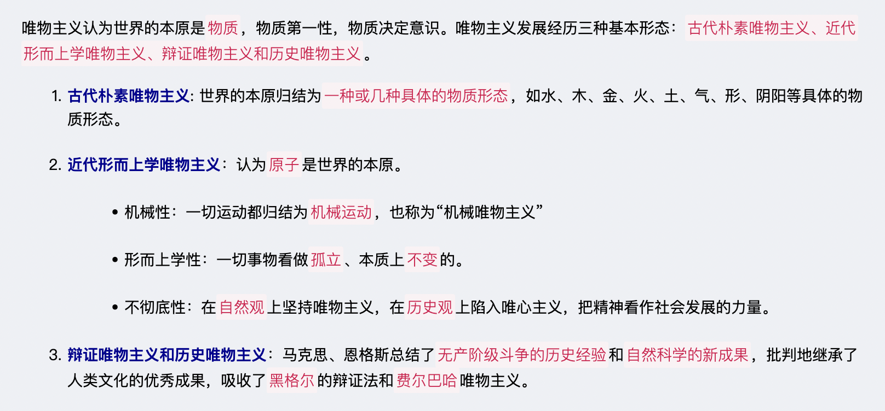

# 【哲学】总论

`2023/04/03 22:45:33  by: 程序员·小李`

#### 哲学的含义

> 哲学是`系统化、理论化`的世界观，包括`世界观和方法论`
> * 世界观：对世界的`看法`和`观点`（怎么看待世界）
> * 方法论：`认识世界、改造世界`的根本方法（怎么认识和改造世界）
> * 🔥 世界观决定方法论，方法论体现世界观

#### 具体科学与哲学的关系

> 具体哲学研究`具体`的领域，哲学研究`最普遍、最一般`的规律；具体科学是哲学的`基础`，哲学给具体科学以世界观和方法论的`指导`。

#### 哲学的基本问题

> `思维和存在的关系`是哲学的基本问题：
>
> 1. 思维和存在、物质和意识`何为本原（何为第一性）`的问题。按照不同的回答，分为`唯物主义和唯心主义`。
> 2. 思维和存在`有无同一性`的问题，即思维能否正确认识存在的问题，根据不同的回答，分为`可知论和不可知论`。

> **唯物主义**：世界的本原是`物质`，`物质决定意识`；**唯心主义**：世界的本原是`意识`，`意识决定物质`

> **可知论**：思维`可以`正确认识客观事物及其规律；**不可知论**：思维`不可以`正确认识客观事物及其规律。

#### 唯物主义

> 🔥 唯物主义认为物质是第一性的，是本原，因此`物质`是唯物主义的基石

#### 唯心主义

#### 马克思主义

#### 马克思主义哲学

#### 其他

> 🔥 “三大差别”，指`工农差别、城乡差别、脑力劳动和体力劳动`的差别

> “人不能两次踏进同一条河流。”是`古希腊`哲学家`赫拉克利特`说的，这句话承认了物质是运动的，一切物质都在永恒不断地变化着，是辩证唯物主义观点。

> “人不能两次踏进同一条河流。”是`古希腊`哲学家`赫拉克利特`说的，这句话承认了物质是运动的，一切物质都在永恒不断地变化着，是辩证唯物主义观点。