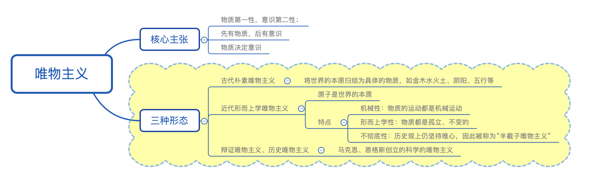
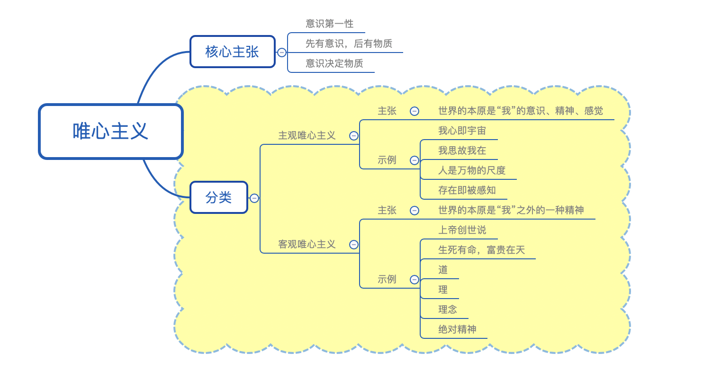
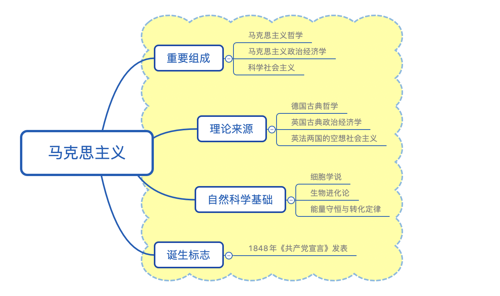
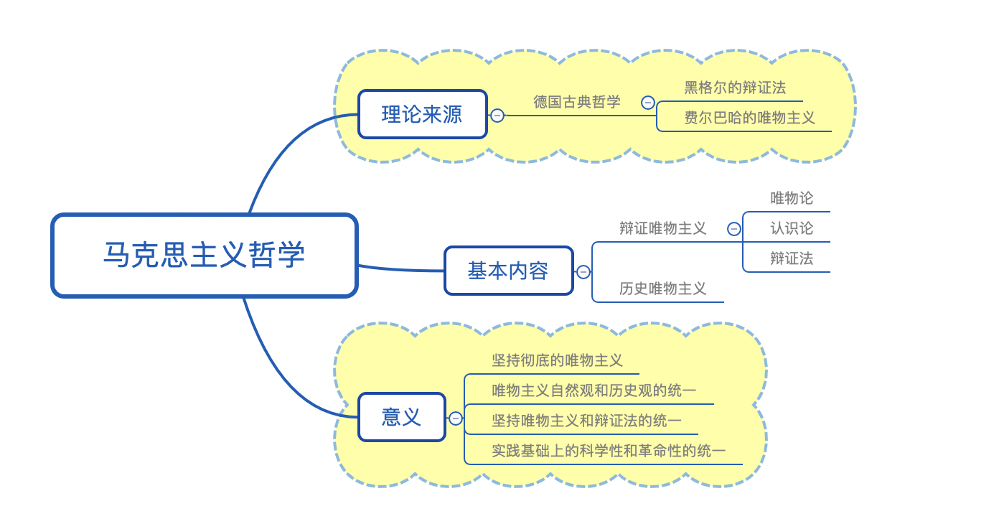

# 【哲学】总论

`2023/04/03 22:45:33  by: 程序员·小李`

## 一、哲学及哲学的基本问题

#### 1.1 什么是哲学？

哲学是`系统化、理论化`的世界观，包括`世界观和方法论`
* 世界观：对世界的看法和观点
* 方法论：认识世界、改造世界的根本方法 

> 🔥 世界观`决定`方法论，方法论`体现`世界观

> 人们关于世界是什么、怎么样的根本观点是世界观，用这种观点作指导去认识世界和改造世界，就成了方法论。一般说来，有什么样的世界观就有什么样的方法论。不存在脱离世界观的方法论，也不存在脱离方法论的世界观。哲学是世界观和方法论的统一。

#### 🔥 1.2 具体科学与哲学的关系

> 具体哲学研究`具体`的领域，哲学研究`最普遍、最一般`的规律；
> 
> 具体科学是哲学的`基础`，哲学给具体科学以世界观和方法论的`指导`。

####  🔥 1.3 哲学的基本问题

> `思维和存在的关系`是哲学的基本问题：
>
> 1. 思维和存在、物质和意识`何为本原（何为第一性）`的问题。按照不同的回答，分为`唯物主义和唯心主义`。
> 2. 思维和存在`有无同一性`的问题，即思维能否正确认识存在的问题，根据不同的回答，分为`可知论和不可知论`。

> **唯物主义**：世界的本原是`物质`，`物质决定意识`
>
> **唯心主义**：世界的本原是`意识`，`意识决定物质`

> **可知论**：思维`可以`正确认识客观事物及其规律；
>
> **不可知论**：思维`不可以`正确认识客观事物及其规律。

## 二、唯物主义

#### 2.1 基本观点

世界的本原是物质，先有物质后有意识，物质决定意识。

 🔥 `物质`是唯物主义的`基石`

#### 🔥 2.2 三种形态

唯物主义有三种形态：古代朴素唯物主义、近代形而上学唯物主义、辩证和历史唯物主义。

> **古代朴素唯物主义**：认为世界的本原是几种`具体的物质`，如金、木、水、火、土
>
> **近代形而上学唯物主义**：世界的本原是`原子`，认为一切运动都是机械运动（机械性）；事物都是孤立、不变的（形而上学性）；自然观上坚持唯物主义，历史观上唯心主义，是半截子唯物主义（不彻底性）。
>
> **辩证和历史唯物主义**：马克思、恩格斯总结了无产阶级斗争经验和自然科学的成果，批判吸收了黑格尔的辩证法、费尔巴哈的唯物主义。

## 三、唯心主义

#### 3.1 基本观点

意识第一性，先有意识后有物质，意识决定物质。

#### 🔥 3.2 分类

唯心主义有两个派别：主观唯心主义和客观唯心主义。

> **主观唯心主义**：`人的精神或意志`是世界的本原。
>
> **客观唯心主义**：`客观存在的某种精神`作为世界的本原，例如上帝、命运、道、理等等

## 四、马克思主义

马克思主义的组成部分：马克思主义哲学、政治经济学、科学社会主义

马克思主义的直接来源：德国古典哲学、英国古典政治经济学、英法两国科学社会主义

马克思主义的自然科学基础：细胞学说、能量守恒与转化定律、生物进化论

马克思主义的诞生标志：1848年《共产党宣言》发表

## 五、马克思主义哲学

直接来源：德国古典哲学（黑格尔的辩证法、费尔巴哈的唯物主义）

基本内容：辩证唯物主义和历史唯物主义

意义：
* 坚持了唯物主义一元论，与二元论、唯心主义一元论划清界限
* 唯物主义自然观和历史观的统一（相对于形而上学）
* 坚持唯物主义和辩证法的统一
* 坚持实践基础上的科学性和革命性的统一

>`实践`观点是马克思主义哲学的核心观点。马克思主义哲学在科学实践观的基础上，坚持从实际出发认识周围世界，第一次在科学的基础上实现了唯物主义与辩证法的有机结合，它把唯物辩证的观点贯穿于社会历史研究领域，实现了`唯物辩证的自然观与历史观`的统一。

> 马克思主义哲学实现了`实践`基础上的`科学性和革命性`的统一。马克思主义哲学之所以是科学的，就在于它正确揭示了世界的本质和运动规律，它的全部理论都来自实践，又经过实践的反复检验。马克思主义哲学之所以是革命的，就在于它是改变世界的科学、指导人类解放的科学，是无产阶级的科学的世界观和方法论。

>`与时俱进`是马克思主义哲学`独特的理论品质`。一部马克思主义哲学发展史就是马克思、恩格斯以及他们的后继者们不断根据时代、实践、认识发展而发展的历史，是不断吸收人类历史上一切优秀思想文化成果丰富自己的历史。马克思主义哲学虽然产生于19世纪，但它依然具有强大的现实生命力。

## 其他

> “人不能两次踏进同一条河流。”是`古希腊`哲学家`赫拉克利特`说的，这句话承认了物质是运动的，一切物质都在永恒不断地变化着，是辩证唯物主义观点。

作为哲学范畴的价值，主客体之间的价值关系是`创造性的关系`

“方生方死”（刚出现就趋近于灭亡），从哲学角度看，`只见运动，不见静止`。