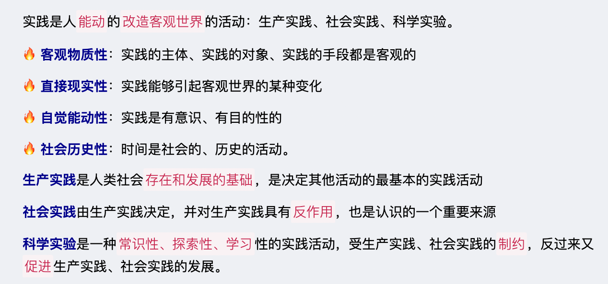
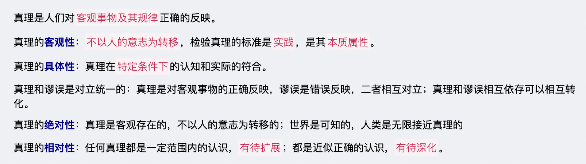

# 【哲学】辩证唯物主义

`2023/04/04 21:36:38  by: 程序员·小李`

## 一、唯物论

#### 🔥 1.1 物质的唯一特性——客观实在性

物质的唯一特性是`客观实在性`。物质的存在是`客观`的，是`不以人的意志为转移的`。

#### 1.2 物质的根本属性——运动

物质的`根本属性`和`存在方式`是**运动**。运动是标志一切事物和现象的`变化及其过程`的哲学范畴。

> 运动的形式包括：`机械运动`（位移）、`物理运动`（声、光、电）、`化学运动`（白磷自燃）、`生物运动`（人体新陈代谢）、`社会运动`（最高级、最复杂，例如社会发展）。

#### 1.3 静止与运动

静止是一种特殊的运动状态。

运动是`绝对的、无条件的、永恒的`，静止是`相对的、有条件的、暂时的`

一切事物的存在都是`绝对运动和相对静止`的统一。

#### 1.4 物质的存在形式——时间与空间

物质以时间和空间作为`存在形式`。

> ☆ 时间是指物质运动的过程是`持续性和顺序性`的，具有一维性
>
> ☆ 空间是指运动着的物质的`广延性和伸张性`，具有三维性。

#### 1.5 意识

#### 1.6 物质和意识的辩证关系

物质决定意识，意识对物质有反作用（正确的意识促进事物发展，错误的意识阻碍事物发展）

🔥 一切从实际出发，`尊重客观规律的基础上`，发挥主观能动性

## 二、认识论

#### 2.1 实践

#### 2.2 感性认识和理性认识

> **感性认识**是通过感官获得的认识，包括`感觉、知觉、表象`三种形式，是认识的初级阶段
>
> **理性认识**是在感性认识的基础上，对事物的`本质和规律`的认识，包括`概念、判断、推理`三种形式，是认识的高级阶段。
>
> * 理性认识`依赖`感性认识
> * 感性认识`有待发展`为理性认识
> * 感性认识和理性认识是`相互渗透`的

#### 2.3 认识的两次飞跃

> 认识的过程是`感性认识到理性认识`，`理性认识到实践`的两次飞跃。
>
> 认识的`根本任务`是经过感性认识上升到理性认识，透过现象抓住事物的本质和规律。
>
> 认识的`最终目的`是把理性认识应用于实践，

> 感性认识到理性认识的**必备条件**
> * 丰富的感性认识材料
> * 运用科学的思维方法将感性材料去粗存精、去伪存真，形成概念和理论的系统。

#### 2.4 认识的特点

> **认识具有反复性**：认识的过程是感性认识到理性认识，理性认识到实践，是`实践-认识-再实践-再认识`，循环往复以至无穷的辩证发展过程
>
> **认识具有无限性**：人类对事物的认识是永无止境的，无限发展的。

#### 2.5 实践与认识的关系

#### 2.6 真理

## 三、唯物辩证法

#### 3.1 两大特征

唯物辩证法的两大特征是：`联系和发展`。

> 联系：事物与事物之间，事物内部各要素之间存在着联系，相互依赖、相互影响、相互制约。
> * **普遍性**：联系`广泛存在于`事物内部、事物之间。
> * **客观性**：联系是事物`固有`的，不以人的意志为转移的。
> * **多样性**：联系是`多种多样`的，内部联系与外部联系、本质联系与非本质联系、直接联系与间接联系、必然联系与偶然联系。
> * **条件性**：在一定`条件`下，事物之间构成联系。
>
> 整体与部分的联系：
> 1. 整体`统率、支配、决定`部分
> 2. `关键部分`对整体起`决定性`作用
> 3. 整体是各个部分的`有机结合`，整体有各个部分没有的功能

> 发展是具有`前进性质`的运动，从简单到复杂，从低级到高级，从无序到有序的过程。
>
> 🔥 发展的`实质`是`新事物的产生和旧事物的灭亡`。新事物是符合客观规律、具有强大生命力、发展前景的事物，旧事物是丧失必然性、日趋消亡的事物。
>
> ⭐️新旧事物的本质区别：`是否符合事物发展的必然趋势`。

#### 3.2 联系和发展具有规律性

规律本质上还是联系，是`固有的、本质的、必然的`联系

🔥 规律具有`客观性`，不以人的意志为转移

#### 3.3 三大规律

> 🔥 `对立统一、质量互变、否定之否定`是辩证法的三大规律。

> 🔥 **对立统一规律**是唯物辩证法的`核心`，揭示了事物发展的`源泉和动力`——`矛盾`。
> 1. 矛盾的**同一性和斗争性**
>  * 同一性：矛盾双方`相互依存、相互贯通`的关系，一定条件下`可以相互转化`。（一个不存在，另一个也就没意义了）
>  * 斗争性：矛盾双方`相互排斥、对立`
> 2. 矛盾具有**普遍性和特殊性**：运用矛盾分析法分析一切事物，并且要具体问题具体分析
>  * 普遍性：时时有矛盾，处处有矛盾，强调的是共性
>  * 特殊性：具体某一个矛盾有自己的特点，并不是完全一样的，强调的是个性
>  * 矛盾的`普遍性`寓于`特殊性`之中，并`通过特殊性表现出来`
> 3. 矛盾的发展具有**不平衡性**
>  * 主要矛盾指的是处于`支配地位`，对事物发展起`决定性`作用的矛盾；次要矛盾指的是处于从属地位、不起决定作用的矛盾。
>  * 矛盾的主要方面指处于`支配地位`的方面，次要方面是`被支配`的方面
>  * 矛盾发展的不平衡性要求我们`两点论（全面的看问题）和重点论（有重点地看问题）`结合起来。

> **质量互变定律**：揭示了事物发展的`形式和状态`。
> * 量变：`数量上、程度上`的变化
> * 质变：`性质`的变化
> 
> 🔥 量变是质变的`必要准备`，质变是量变的`必然结果`
>
> 要坚持`适度原则`，重视量的积累，不失时机地促成质变，实现质的飞跃

> **否定之否定规律**：揭示了事物发展的`方向和道路`
> * 肯定：是事物`保持自身存在`的方面
> * 否定：事物自身`趋向灭亡`，转化为其他事物的趋势
> * 辩证否定的实质是“扬弃”：既克服又保留
> * 🔥 任何事物的发展都要经历`“肯定-否定-否定之否定”`的过程
> * 🔥 事物的发展是`前进性和曲折性`（螺旋式上升或波浪式前进）的统一

#### 3.4 内因和外因

> * 内因是事物发展变化的`根本原因`（内在本质），是第一位的
> * 外因是事物发展变化的`条件`（客观条件），`外因通过内因起作用`
> * 事物发展是内因外因`共同作用的结果`

#### 3.5 五大范畴

> 内容与形式：
> * 内容是构成事物一切要素的总和，包括内在矛盾及事物的特征、成分、运动过程、发展趋势，是事物存在的`基础`。
> * 把内容统一起来的`结构与表现形式`是形式

> 现象和本质：
> * 现象是事物的`外部表现`
> * 本质是事物的`根本属性`，是各个要素之间的内在联系，✅ 事物的本质是固有的`特殊矛盾`决定的。

> 原因与结果：
> * 原因是引起的`条件或缘由`
> * 结果是引来的`结局或现象`

> 现实性与可能性：
> * 现实性是相互联系着的实际存在的事物综合，是`已经实现了`的可能性。
> * 可能性是预示发展前途的`种种趋势`

> 必然性与偶然性：
> * 必然性是合乎规律、`一定要发生、确定不移`的趋势
> * 偶然性是`不确定`的趋势。
> * 必然性寓于偶然性中，通过大量的偶然性表现出来（大量的偶然就组成了必然）

## 其他

19世纪前期出现的著名`空想社会主义者`的主要代表人物是法国的`圣西门`、`傅立叶`和英国的`欧文`。