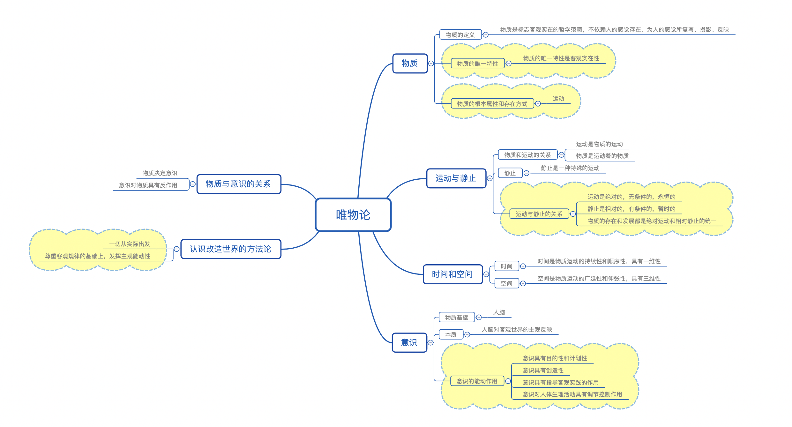
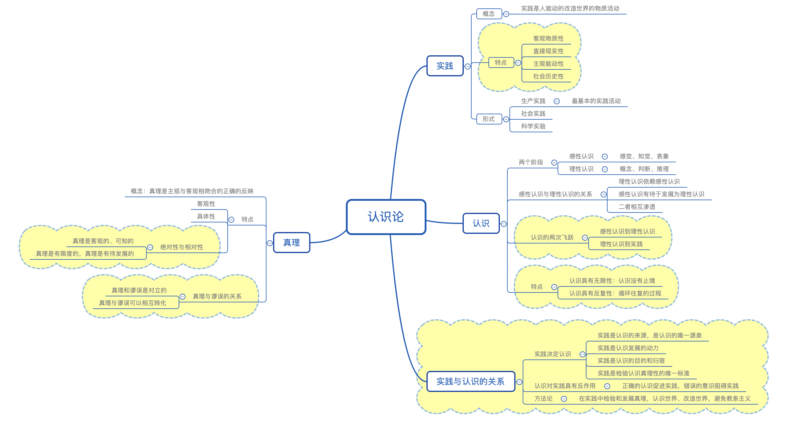
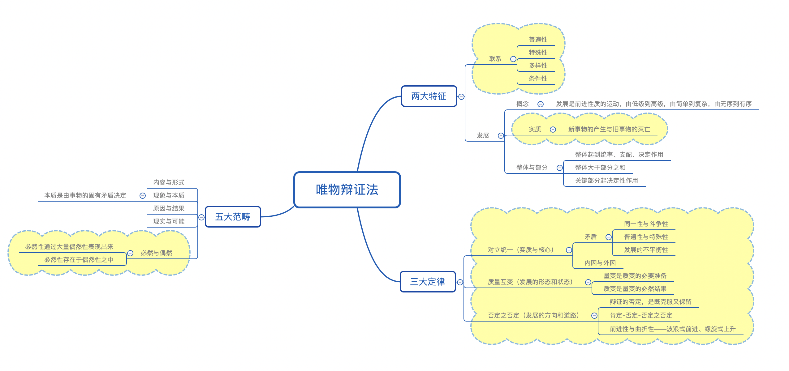

# 【哲学】辩证唯物主义

`2023/04/04 21:36:38  by: 程序员·小李`

## 一、唯物论

#### 🔥 1.1 物质的唯一特性——客观实在性

物质的唯一特性是`客观实在性`。物质的存在是客观的，不以人的意志为转移的。

物质是不依赖于人的意识，并能为人的意识所反映的客观实在。辩证唯物主义的物质概念，概括了宇宙间客观存在着的一切事物和现象的共同本质，而不是指某一种具体的物质形态。

人类社会是物质世界长期发展的产物。在从古猿到人的演化过程中，`劳动`起了决定性的作用。劳动创造了人和人类社会，没有劳动就没有人，就没有人类社会。人类社会在本质上是一个客观的物质体系，构成社会物质生活条件的基本要素是`地理环境、人口因素和生产方式`。这三者都是客观的物质的要素。这些要素的客观性，集中体现了人类社会的物质性。

#### 1.2 物质的根本属性——运动

运动是标志一切事物和现象的变化及其过程的哲学范畴。

>🔥 物质的**根本属性和存在方式**是运动。

> 运动的形式包括：`机械运动`（位移）、`物理运动`（声、光、电）、`化学运动`（白磷自燃）、`生物运动`（人体新陈代谢）、`社会运动`（最高级、最复杂，例如社会发展）。

运动是物质固有的`根本属性和存在方式`，世界上不存在脱离运动的物质，脱离物质的运动是根本不存在的。物质运动是有其客观规律的。规律是事物运动过程中`固有的、本质的、必然的、稳定的联系`。规律是客观的，是不以人的意志为转移的，`既不能被创造，也不能被消灭`。没有规律的物质运动是不存在的。

#### 1.3 静止与运动

静止是一种特殊的运动状态。

🔥 运动是`绝对的、无条件的、永恒的`，静止是`相对的、有条件的、暂时的`

一切事物的存在都是`绝对运动和相对静止`的统一。

#### 1.4 物质的存在形式——时间与空间

物质以时间和空间作为`存在形式`。

> ☆ 时间是指物质运动的过程是`持续性和顺序性`的，具有一维性
>
> ☆ 空间是指运动着的物质的`广延性和伸张性`，具有三维性。

#### 1.5 意识

意识的结构基础是`人脑`，意识客观存在的主观映像，是人脑特有的机能。

>🔥 意识的特点：
>* 目的性和计划性：反映客观世界的时候，抱有一定的目的，行动前还要确定目标、步骤
>* 主动创造性：会有加工、修饰的成分
>* 指导实践的作用：指导人们的实践，把意识变为现实
>* 调控人的心理活动和行为：高昂的精神使人奋进，萎靡的精神使人失去斗志。

意识不是从来就有的，它是`自然界长期发展的产物`，也是`社会发展的产物`。从一切物质都具有的反应特性，到低等生物的刺激感应，到动物的感觉和心理，再到人类意识的产生，是一个漫长的过程。劳动和社会交往促进了意识的物质器官即人脑的生成，促进了意识的表达手段即语言的产生和发展，提供和丰富了意识的内容。

意识不仅是人脑的机能，而且是对物质世界的反映。不管什么样的意识，都是人脑`对客观存在的反映`，都是客观存在通过生活和实践的环节进入人脑，并在人脑中加工改造的结果。自然界在本质上是物质的，`人的意识本身就根源于物质`。物质是本原，意识是物质的派生物，物质决定意识。因此，世界是物质的世界，世界的真正统一性在于它的物质性。我们应当自觉坚持辩证唯物主义的物质统一性原则，坚定马克思主义无神论立场，反对一切有神论。

意识活动不仅可以认识事物的外部现象，而且能够把握深藏于事物内部的本质和规律。世界上只有尚未认识之物，没有不可认识之物。人能够`能动地改造世界`。意识不仅能够能动地反映客观世界，而且可以`能动地指导人们改造世界`，即通过实践把观念的东西变成现实的东西，创造出符合人的目的的客观事物。

#### 1.6 物质和意识的辩证关系

物质决定意识，意识对物质有反作用（正确的意识促进事物发展，错误的意识阻碍事物发展）

意识的能动作用是巨大的，但不是无条件的。`尊重客观规律`是正确发挥主观能动性的前提条件。意识的能动性受到客观规律的制约。

🔥 一切从实际出发，实事求是，`尊重客观规律的基础上`，充分发挥主观能动性，不断解放思想，与时俱进，以求真务实的精神探求事物的本质和规律，用科学的理论武装头脑、指导实践。

## 二、认识论

#### 2.1 实践

实践是人能动的改造世界的活动，包括`生产实践（最基本）、社会实践、科学实验`

>🔥 实践的特点
> * 直接现实性：实践`可以引起客观世界的变化`
> * 自觉能动性：实践是`有意识、有目的性`的
> * 客观物质性：实践的主体、对象、手段都是客观的
> * 社会历史性：实践是社会性的，历史活动

#### 2.2 感性认识和理性认识

> **感性认识**是通过感官获得的认识，是认识的初级阶段，包括`感觉、知觉、表象`
>
> **理性认识**是对事物`本质和规律`的认识，包括`概念、判断、推理`三种形式，是认识的高级阶段。
>
> * 理性认识`依赖`感性认识
> * 感性认识`有待发展`为理性认识
> * 感性认识和理性认识是`相互渗透`的

#### 2.3 认识的两次飞跃

> 认识的过程是`感性认识到理性认识`，`理性认识到实践`的两次飞跃。
>
> 认识的`根本任务`是经过感性认识上升到理性认识，透过现象抓住事物的本质和规律。
>
> 认识的`最终目的`是把理性认识应用于实践，

> 感性认识到理性认识的**必备条件**
> * 丰富的感性认识材料
> * 运用科学的思维方法将感性材料去粗存精、去伪存真，形成概念和理论的系统。

#### 2.4 认识的特点

> **认识具有反复性**：认识的过程是感性认识到理性认识，理性认识到实践，是`实践-认识-再实践-再认识`，循环往复以至无穷的辩证发展过程
>
> **认识具有无限性**：人类对事物的认识是永无止境的，无限发展的。

#### 🔥 2.5 实践与认识的关系

* 实践是认识的`源泉`（唯一源泉）
* 实践是认识`发展的动力`
* 实践是认识的`目的和归宿`
* 实践是检验真理的`唯一标准`
* 认识`反作用`于实践，正确的认识指导实践，错误的认识阻碍实践

在实践中检验和发展真理，认识世界、改造世界的过程中避免教条主义。

#### 2.6 真理

真理是主观与客观相一致的哲学范畴

>🔥 真理的特点
>* 真理是客观的：真理不以人的意志为转移，是客观存在的
>* 真理是具体的：真理是具体、有条件的
>* 真理是绝对的：世界是可知的，人类是无限接近真理的
>* 真理是相对的：真理是对一定范围的认识，有待扩展和深化

真理和谬误是对立统一的，真理是主观与客观相符，谬误是错误的反映，二者相互对立的同时，可以相互转化。

## 三、唯物辩证法

#### 3.1 两大特征

唯物辩证法的两大特征是：`联系和发展`。

> 联系：事物与事物之间，事物内部各要素之间存在着联系，相互依赖、相互影响、相互制约。
> * **普遍性**：联系`广泛存在于`事物内部、事物之间。
> * **客观性**：联系是事物`固有`的，不以人的意志为转移的。
> * **多样性**：联系是`多种多样`的，内部联系与外部联系、本质联系与非本质联系、直接联系与间接联系、必然联系与偶然联系。
> * **条件性**：在一定`条件`下，事物之间构成联系。
>
> 整体与部分的联系：
> 1. 整体`统率、支配、决定`部分
> 2. `关键部分`对整体起`决定性`作用
> 3. 整体是各个部分的`有机结合`，整体具有部分所不具备的功能

我们在认识世界和改造世界的过程中，要善于分析和把握事物存在和发展的各种条件。既要注重客观条件，又要恰当运用主观条件;既要把握事物的内部条件，又要关注事物的外部条件;既要认识事物的有利条件，又要重视事物的不利条件。总之，要一切以时间、地点和条件为转移。

>整体与部分是互相区别的。整体是事物的全局或发展的全过程，部分是事物的局部或发展的各个阶段。整体居于主导地位，整体统率着部分，具有部分所不具备的功能;部分在事物的存在和发展过程中处于被支配的地位，部分服从和服务于整体。
>
>整体与部分又是相互联系、密不可分的。整体是由部分构成的，离开了部分，整体就不复存在。部分的功能及其变化会影响整体的功能。部分是整体中的部分，离开了整体，部分就不成其为部分。整体的功能、状态及其变化也会影响部分。

我们应当`树立全局观念`，掌握系统优化的方法，用综合的思维方法认识事物。要`立足整体`，把各个部分、各个要素联系起来考察，优化组合，选择最佳方案，实现整体的最优目标，从而达到整体功能大于部分功能之和的理想效果;同时必须`重视部分`的作用，用局部的发展推动整体的发展。

> 发展是具有`前进性质`的运动，从简单到复杂，从低级到高级，从无序到有序的过程。
>
> 🔥 发展的`实质`是`新事物的产生和旧事物的灭亡`。新事物是符合客观规律、具有强大生命力、发展前景的事物，旧事物是丧失必然性、日趋消亡的事物。
>
> ⭐️新旧事物的本质区别：`是否符合事物发展的必然趋势`。

#### 3.2 联系和发展具有规律性

规律本质上还是联系，是`固有的、本质的、必然的`联系

🔥 规律具有`客观性`，不以人的意志为转移

#### 3.3 三大规律

> 🔥 `对立统一、质量互变、否定之否定`是辩证法的三大规律。

> 🔥 **对立统一规律**是唯物辩证法的`核心`，揭示了事物发展的`源泉和动力`——`矛盾`。
> 1. 矛盾的**同一性和斗争性**
>  * 同一性：矛盾双方`相互依存，彼此互为前提`；相互贯通，一定条件下`可以相互转化`。（一个不存在，另一个也就没意义了）
>  * 斗争性：矛盾双方`相互排斥、对立`
> 2. 矛盾具有**普遍性和特殊性**：运用矛盾分析法分析一切事物，并且要具体问题具体分析
>  * 普遍性：事事有矛盾，时时有矛盾，强调的是共性
>  * 特殊性：具体某一个矛盾有自己的特点，并不是完全一样的，强调的是个性
>  * 矛盾的`普遍性`寓于`特殊性`之中，并`通过特殊性表现出来`
> 3. 矛盾的发展具有**不平衡性**
>  * 主要矛盾指的是处于`支配地位`，对事物发展起`决定性`作用的矛盾；次要矛盾指的是处于从属地位、不起决定作用的矛盾。
>  * 矛盾的主要方面指处于`支配地位`的方面，次要方面是`被支配`的方面
>  * 矛盾发展的不平衡性要求我们`两点论（全面的看问题）和重点论（有重点地看问题）`结合起来。

矛盾的同一性是`相对的`，矛盾的斗争性是`绝对的`。矛盾的同一性不能脱离斗争性而存在，矛盾双方的同一是对立中的同一，是包含着差别的同一;矛盾的斗争性也不能脱离同一性而存在，斗争性寓于同一性之中，并为同一性所制约。矛盾双方的对立统一推动事物的运动、变化和发展，由此构成`事物发展的源泉和动力`。

承认矛盾的普遍性是坚持唯物辩证法的前提。在任何时候，对任何事物，我们都要`坚持问题导向，敢于承认矛盾，勇于直面矛 盾，善于分析矛盾，积极寻找正确的方法解决矛盾`。

矛盾的普遍性和特殊性的关系，也就是矛盾的`共性和个性`、绝对和相对的关系。矛盾的普遍性和特殊性相互联结。一方面，`普遍性寓于特殊性之中`，并通过特殊性表现出来，没有特殊性就没有普遍性;另一方面，`特殊性离不开普遍性`，任何事物都是普遍性与特殊性的对立统一，世界上的事物无论怎样特殊，它总是在特殊性中包含着普遍性，不包含普遍性的事物是没有的。

在复杂事物的发展过程中，必有一种矛盾，它的存在和发展，决定或影响着其他矛盾的存在和发展。这种在事物发展过程中处于`支配地位`、对事物发展起决定作用的矛盾就是主要矛盾。其他处于从属地位、对事物发展不起决定作用的矛盾则是次要矛盾。主要矛盾与次要矛盾相互依赖、相互贯通，并在一定条件下相互转化。

不论是主要矛盾还是次要矛盾，每一矛盾中的两个方面的力量都是不平衡的。其中，必有一方处于支配地位，起着主导作用，而 另一方则处于被支配地位。前者是矛盾的主要方面，后者是矛盾的次要方面。事物的性质主要是由`主要矛盾的主要方面`决定的。矛盾的主要方面与次要方面既相互依赖，又相互贯通，并在一定条件下相互转化。

主要矛盾与次要矛盾、矛盾的主要方面与次要方面辩证关系的原理要求我们，要`坚持两点论与重点论相统一`的方法。坚持两点 论，就是在认识复杂事物的发展过程时，`既要看到主要矛盾，又要看到次要矛盾`;在认识某一矛盾时，`既要看到矛盾的主要方面，又要看到矛盾的次要方面`。坚持重点论，就是在认识复杂事物的发展过程时，要`着重把握主要矛盾`，“牵牛要牵牛鼻子”;在认识某一矛盾时，要`着重把握矛盾的主要方面`，要抓住主流。辩证法的两点论是有重点的两点论，而不是均衡论;重点论是看到两点中的重点，而不是一点论。我们要坚持两点论与重点论相结合的方法，反对形而上学的一点论和均衡论。

具体问题具体分析，是指在矛盾普遍性原理的指导下，具体`分析矛盾的特殊性`，并找出解决矛盾的正确方法。具体问题具体分析是马克思主义的一个重要原则，是马克思主义的`活的灵魂`。具体问题具体分析是正确认识事物的基础。离开了对矛盾特殊性的具体分析，就无法区分事物，就不能正确认识事物。

具体问题具体分析是`正确解决矛盾的关键`。事物的矛盾各不相同，决定了解决矛盾的方法也不相同。只有对具体问题作具体分析，把握事物矛盾的特殊性，才能找到解决矛盾的正确方法。“对症下药”“一把钥匙开一把锁”，就是针对不同的问题，采取不同的解决办法。

> **质量互变定律**：揭示了事物发展的`形式和状态`。
> * 量变：`数量上、程度上`的变化
> * 质变：`性质`的变化
> 
> 🔥 量变是质变的`必要准备`，质变是量变的`必然结果`
>
> 要坚持`适度原则`，重视量的积累，不失时机地促成质变，实现质的飞跃

量变是质变的必要准备，量变达到一定程度必然引起质变，质变是量变的必然结果；质变又为新的量变开辟道路，使事物在新质的基础上开始新的量变。事物的发展就是这样由量变到质变，又在新质的基础上开始新的量变，如此循环往复，不断前进。

我们做任何事情都要从一点一滴的小事做起，脚踏实地，埋头苦干，`重视量的积累`，为实现事物的质变创造条件;在量变已经达到一定程度、只有改变事物原有的性质才能向前发展时，要`果断地抓住时机，促成质变，实现事物的飞跃`。无论一个人还是一个国家，善于抓住机遇，才能赢得主动和优势，加快发展。

> **否定之否定规律**：揭示了事物发展的`方向和道路`
> * 肯定：是事物`保持自身存在`的方面
> * 否定：事物自身`趋向灭亡`，转化为其他事物的趋势
> * 辩证否定的实质是“扬弃”：既克服又保留
> * 🔥 任何事物的发展都要经历`“肯定-否定-否定之否定”`的过程
> * 🔥 事物的发展是`前进性和曲折性`（螺旋式上升或波浪式前进）的统一

事物发展的`前途是光明的`。任何事物都要经历`肯定、否定， 再到否定之否定`的辩证发展过程。辩证否定的实质是`扬弃`，通 过克服旧事物中过时的、消极的内容，保留其中积极合理的因素，自己否定自己，自己发展自己。辩证的否定是联系和发展的 环节。

事物发展的`道路是曲折的`。新事物的发展总要经历一个由小到大、由不完善到比较完善的过程。新事物不可避免地存在着弱点和不完善的地方，人们对新事物的认识也有一个过程。旧事物在开始时往往比较强大，总是顽强抵抗和极力扼杀新事物。新事物战胜旧事物不可能一蹴而就，必然经历曲折的过程。

事物发展的方向是`前进的、上升的`，道路是`曲折的、迂回的`。因此，我们要对未来充满信心，热情支持和悉心保护新事物，促使其成长、壮大，还要做好充分的思想准备，不断克服前进道路上的困难，勇敢地面对挫折与考验。

#### 3.4 内因和外因

> * 内因是事物发展变化的`根本原因`（内在本质），是第一位的
> * 外因是事物发展变化的`条件`（客观条件），`外因通过内因起作用`
> * 事物发展是内因外因`共同作用的结果`

#### 3.5 五大范畴

> 内容与形式：
> * 内容是构成事物一切要素的总和，包括内在矛盾及事物的特征、成分、运动过程、发展趋势，是事物存在的`基础`。
> * 把内容统一起来的`结构与表现形式`是形式

> 现象和本质：
> * 现象是事物的`外部表现`
> * 本质是事物的`根本属性`，是各个要素之间的内在联系，✅ 事物的本质是固有的`特殊矛盾`决定的。

> 原因与结果：
> * 原因是引起的`条件或缘由`
> * 结果是引来的`结局或现象`

> 现实性与可能性：
> * 现实性是相互联系着的实际存在的事物综合，是`已经实现了`的可能性。
> * 可能性是预示发展前途的`种种趋势`

> 必然性与偶然性：
> * 必然性是合乎规律、`一定要发生、确定不移`的趋势
> * 偶然性是`不确定`的趋势。
> * 必然性寓于偶然性中，通过大量的偶然性表现出来（大量的偶然就组成了必然）

## 其他

19世纪前期出现的著名`空想社会主义者`的主要代表人物是法国的`圣西门`、`傅立叶`和英国的`欧文`。