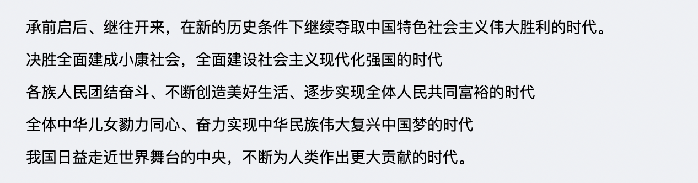
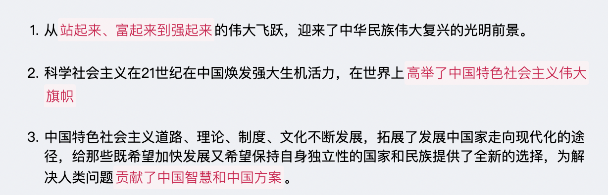
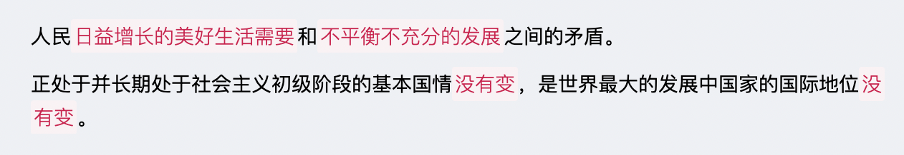
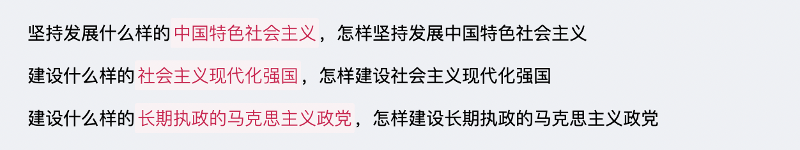
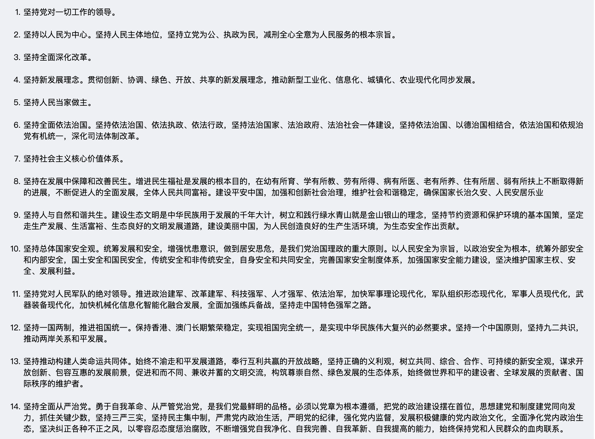
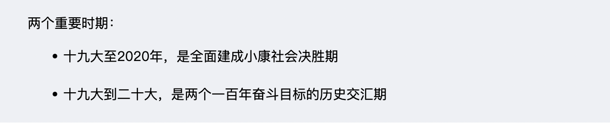
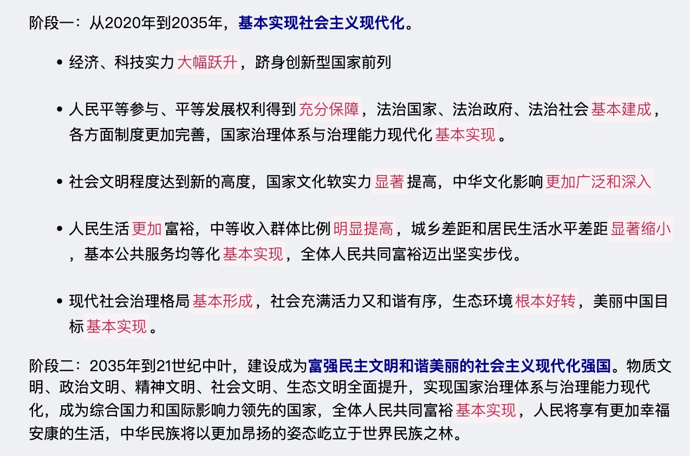

#【新时代社会主义思想】概论

`2023/04/09 20:20:48  by: 程序员·小李`

#### 内涵

#### 意义

#### 🔥 新矛盾

#### 重大时代课题

#### 十大明确

> 1. 中国特色社会主_义最本质的特征是坚持党的领导。必须增强四个意识，坚定四个自信，做到两个维护。 
>  * 四个意识：政_治意识、大局意识、核心意识、看齐意识 
>  * 四个自信：道路自信、理论自信、制度自信、文化自信 
>  * 两个维护：是指坚决维护党_中_央的核心、全党的核心地位，坚决维护党_中_央权威和集中统_一_领_导。 
> 2. 总任务：实现社会主_义现代化、中华民族伟大复兴，在全面建成小康社会的基础上，分两步走在 21 世纪中叶建成富强民主文明和谐美丽的社会主_义现代化强国，以中国式现代化推进中华民族的现代化。 
> 3. 主要矛盾：人民日益增长的美好生活需要和不平衡不充分的发展之间的矛盾 
> 4. 总体布局：经济建设、政_治建设、文化建设、社会建设、生态建设五位一体；战略布局：全面建设社会主_义现代化国家、全面深化改革、全面依法治国、全面从严治党。 
> 5. 全面深化改革总目标：完善和发展中国特色社会主_义制度，推进国家治理体系和治理能力的现代化 
> 6. 全面依法治国总目标：建设中国特色社会主_义法治体系，建设社会主_义法治国家。 
> 7. 坚持完善和发展中国特色社会主_义经济制度，使市场在资源配置中起决定性作用，更好地发挥政_府的作用，把握新发展阶段，贯彻创新、协调、绿色、开放、共享的新发展理念，加快构建以国内大循环为主体，国内国外双循环相互促进的新发展格局，推动高质量发展，统筹发展和安全。 
> 8. 强军目标：建设听党指挥、能打胜仗、作风优良的人_民_军_队。 
> 9. 外交：服务民族复兴、促进人类进步，推动建设新型国际关系，推动构建人类命运共同体。 
> 10. 全面从严治党，推进党的政_治建设、思想建设、组_织建设、作风建设、纪律建设，把制度建设贯穿其中，深入推进反_腐_败斗争，落实管党治党的政_治责任，以伟大自我革_命引领伟大社会革_命。

#### 十四个坚持

#### 活的灵魂

#### 历史地位

> 党的十九大将新时代中国特色社会主_义思想确立为党的指导_思_想，十三届全国人大一次会议写入宪_法。

#### 新征程

