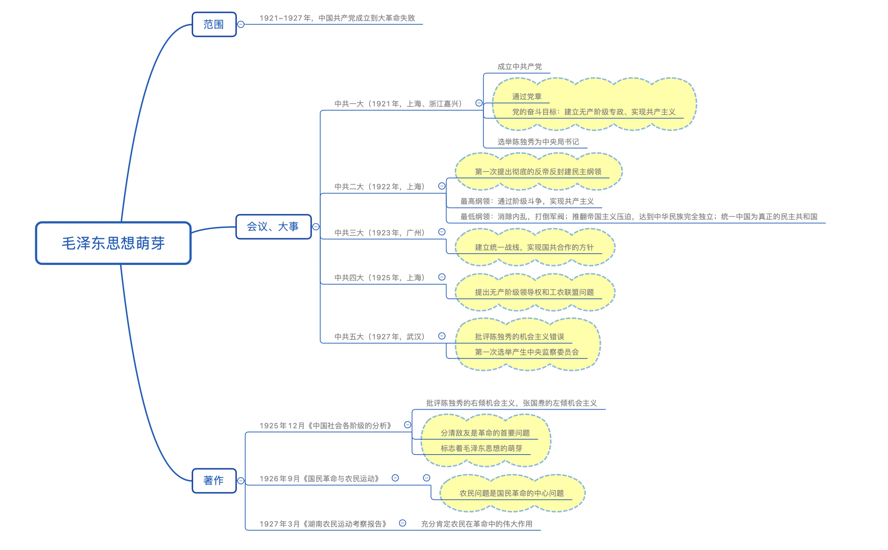
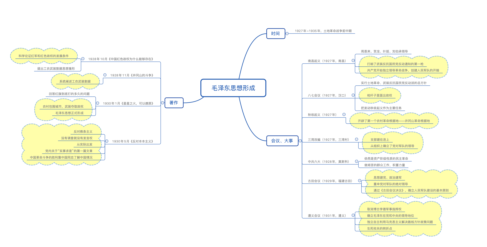
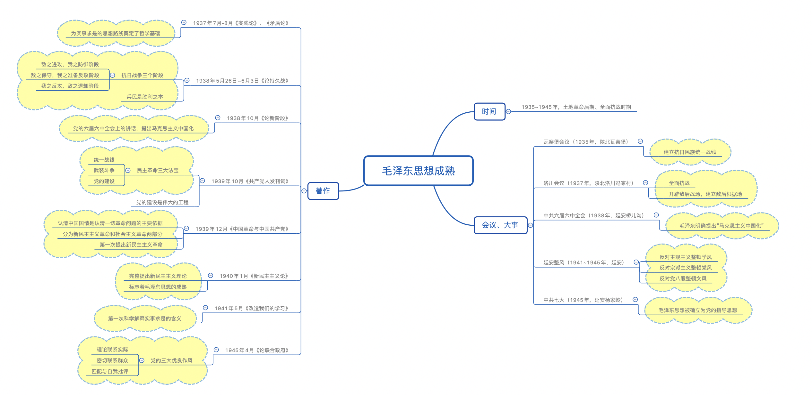

# 《毛泽东思想》概述

`2023/04/08 12:43:19  by: 程序员·小李`

#### 🔥 形成前提和条件

> 社会背景：`半殖民地半封建社会`的社会性质
>
> 🔥 理论基础：`马列主义`
> 
> 🔥 实践基础：中国共产党领导的革命与建设的实践
> 
> 🔥 阶级基础：`工人阶级`的不断壮大
> 
> 文化基础：优秀的传统文化
> 
> 时代背景：战争与革命是时代主题，`俄国十月革命`的胜利

1915年9月，陈独秀在上海创办《新青年》，`标志着新文化运动开始`，口号是`民主与科学`。

`李大钊`是中国宣传马克思主义的第一人，代表作《法俄革命之比较观》、《布尔什维克主义的胜利》、《庶民的胜利》。

第一个翻译《共产党宣言》的是`陈望道`。

#### 🔥 毛泽东思想萌芽阶段（1921~1927 中国共产党成立到大革命失败）

主要内容：
> * **一大**：`共产党的成立`，选举`陈独秀`为中央局书记
> * **二大**：第一次提出`彻底的反帝反封建`；最低纲领——清除内乱、打倒军阀、推翻帝国主义压迫，实现民族独立，统一民主共和国；最高纲领——采用阶级斗争，逐次达到共产主义
> * 三大：`国共合作`、统一战线，集体加入国民党
> * **四大**：`无产阶级领导权的问题`是统一战线的根本问题，提出`工农联盟`问题
> * 五大：批评陈独秀的机会主义，选举产生`中央监察委员`

代表作：
> **《中国社会各阶级的分析》**——`标志毛泽东思想的萌芽`
> * 抨击陈独秀为代表的右倾机会主义，张国焘为代表的左倾机会主义
> * `分清敌友是首要问题`（哪些是可以团结的力量，哪些是敌对势力）
>
> 《国民革命与农民运动》
> * `农民问题`是国民革命的中心问题
>
> 《湖南农民运动考察报告》
> * 充分肯定`农民`在革命中的作用

#### 🔥 毛泽东思想形成阶段（1927~1935 土地革命战争前中期）

主要内容：
> * **南昌起义**：打响了`武装反抗国民党反动统治的第一枪`；中国共产党`开始创建军队`，独立领导革命战争
> * **八七会议**：`枪杆子里面出政权`
> * 秋收起义：`开辟第一个农村革命根据地`——井冈山革命根据地
> * **三湾改编**：`党指挥枪`；支部建在连上
> * 六大：唯一一次在外国开的会议，做艰苦的群众工作，仍属于资产阶级性质的民主革命
> * **古田会议**：`思想建党、政治建军`；`重申党对军队的领导`；确立人民军队建设原则
> * **遵义会议**：生死攸关的转折点；确立`毛泽东`的领导地位；`首次使用马克思主义解决路线、方针、政策问题`

代表作：
> 《中国红色政权为什么能够存在》
> * 提出`工农武装割据`
>
> 《井冈山的斗争》
> * 系统阐述`工农武装割据`
>
> **《星星之火，可以燎原》**——标志毛泽东思想的基本形成
> * 农村包围城市，武装夺取政权
>
> **《反对本本主义》**
> * 反对`教条主义、经验主义`
> * `没有调查就没有发言权`
> * `一切从实际出发`
> * 第一篇关于`实事求是`的文章

#### 🔥 毛泽东思想成熟阶段（1935~1945 土地革命后期到全面抗战时期）

主要内容：
> **瓦窑堡会议**：`建立抗日民族统一战线`
>
> **洛川会议**：建立`敌后根据地`，开辟`敌后战场`，全面抗战
>
> **党的六届六中全会**：`马克思主义中国化`
>
> **延安整风**：反对主观主义整顿文风、反党宗派主义整顿党风、反对党八股整顿文风；宗旨和方针是`惩前毖后，治病救人，从团结的愿望出发`。
>
> **党的七大**：`确立毛泽东思想为党的指导思想`

代表作：
> 《实践论》《矛盾论》
> * 为实事求是奠定基础
>
> **《论持久战》**
> * `兵民是胜利之本`
> * 抗战的三大阶段
>
> **《论新阶段》**
> * `马克思主义中国化`
>
> **《共产党人发刊词》**
> * 民主革命三大法宝：`统一战线、武装斗争、党的建设`
> * 第一次把党的建设称为`伟大的工程`
>
> **《中国革命与中国共产党》**
> * 认清中国国情是认清一切革命问题的依据
> * 革命进程分`新民主主义革命和社会主义革命`两部分
> * 首次提出`新民主主义革命`
>
> **《新民主主义革命论》**——标志毛泽东思想的成熟
> * `完整提出新民主主义`
>
> **《改造我们的学习》**
> * 第一次科学解释`实事求是`
>
> **《论联合政府》**
> * 三大优良传统：`理论联系实际、密切联系群众、批评与自我批评`

#### 🔥 毛泽东思想继续发展阶段（1945~ 解放战争时期及新中国成立以后）

主要内容：
> **党的七届二中全会**：工作`重心转移到城市`；两个务必（务必保持艰苦奋斗的作风；务必保持谦虚、谨慎、不骄、不躁的作风）
>
> 人大一届一次会议：通过`第一部社会主义宪法`
>
> **党的八大**：`既反保守又反冒进，在综合平稳中稳步前进`；三个主体，三个补充；基本矛盾的变化（人民对先进的工业国的要求与落后的农业国之间的矛盾、人民对于经济文化快速发展与经济文化不能满足人民需要的矛盾）。
>
> 党的八届九中全会：国民经济实行`“调整、巩固、充实、提高”` 

代表作：
> 《论人民民主专政》
> * 完整提出人民民主专政，完善新民主主义政治纲领
>
> **《论十大关系》**
> * 探索符合中国国情的社会主义道路
> * `调动国内外一切积极因素，为建设社会主义事业服务`
> * 与民主党派：长期共存、互相监督
>
> **《关于正确处理人民内部矛盾问题》**
> * 第一次系统阐述社会主义社会矛盾
> * 正确处理人民内部矛盾
> * 政治领域：`团结-批评-团结`
> * 文化领域：`百花齐放、百家争鸣`
> * 与民主党派：`长期共存、互相监督`

#### 提出、确立、评价

`王稼祥`首次明确使用“毛泽东思想”

1945年，党的`七大`上，刘少奇正式提出并阐述了毛泽东思想，并写入党章。

1981年，党的`十一届六中全会`通过了《关于建国以来党的若干历史问题的决议》，科学评价了毛泽东和毛泽东思想。

#### 🔥 内涵

党的十二大指出，毛泽东思想是马列主义在中国的运用和发展，是被`实践证明了的`正确理论和经验总结，是中国共产党`集体智慧的结晶`。

#### 主要内容

> `新民主主义革命`理论
> 
> `社会主义革命与建设`理论
> 
> `军队建设、军事战略`理论
> 
> 政策、策略理论
> 
> 思想政治工作、文化工作理论
> 
> `党的建设`理论

#### 意义

毛泽东思想是马克思主义中国化`第一个重大理论成果`，是中国`革命与建设`的科学指南，是宝贵的财富。

#### 🔥 活的灵魂

`实事求是、群众路线、独立自主`是毛泽东思想活的灵魂。

> 实事求是就是一切从实际出发、理论联系实际，在实践中检验和发展真理。实事求是是毛泽东思想的`精髓`，是马克思主义的`根本观点`，是需要始终坚持的马克思主义思想路线，是中国共产党思想路线的`核心`，是党的基本思想方法、工作方法、领导方法。

> 群众路线：一切为了群众，一切依靠群众，从群众中来，到群众中去。群众路线是党的生命线和根本工作路线。

> 独立自主：从中国实际出发，是立党立国的重要原则。独立自主、自力更生是中国革命与建设的`根本立足点`。

#### 其他

> 毛泽东在`对敌斗争的政策和策略思想`方面提出了`“战略上重视敌人，战术上藐视敌人”`

> 1946年8月，毛泽东提出了`“一切反动派都是纸老虎”`的著名论断。

1.毛泽东思想萌芽时期代表著作：《中国社会各阶级的分析》《湖南农民运动考察报告》《国民革命与农民运动》。

2.“农村包围城市、武装夺取政权”革命道路理论的提出，标志着毛泽东思想基本形成。

3.毛泽东思想形成时期代表著作：《中国的红色政权为什么能够存在？》《井冈山的斗争》《星星之火，可以燎原》《反对本本主义》。

4.1940年1月，毛泽东发表《新民主主义论》，提出新民主主义革命理论，标志着毛泽东思想的成熟。

5.毛泽东思想活的灵魂：**实事求是、群众路线、独立自主**。

6.**实事求是**是毛泽东思想的精髓，是中国共产党人始终坚持的马克思主义思想路线。

7.**独立自主、自力更生**是中国革命和建设的基本立足点。

8.群众路线是党的根本工作路线。其内涵：一切为了群众，一切依靠群众；从群众中来，到群众中去。坚持群众观点是中国共产党同一切剥削阶级政党的根本区别。

9.毛泽东在《在晋绥干部会议上的讲话》中完整提出新民主主义革命总路线，即无产阶级领导的，人民大众的，反对帝国主义、封建主义和官僚资本主义的革命。

10.中国共产党在中国革命中的三大法宝**（武装斗争、统一战线、党的建设）**出自毛泽东于1939年10月撰写的《〈共产党人〉发刊词》。

11.党的三大作风：**理论联系实际、密切联系群众、批评与自我批评**。

