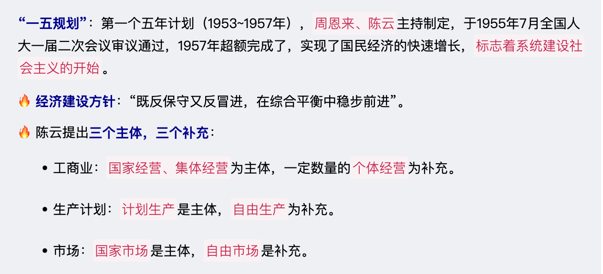
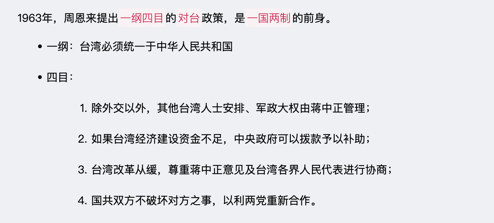
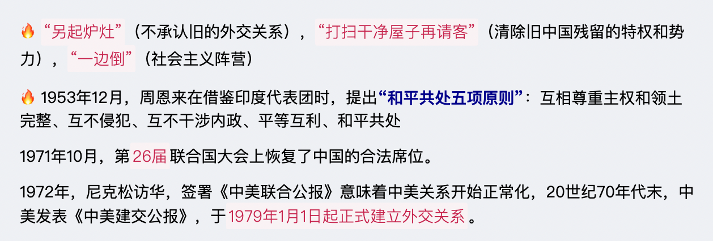
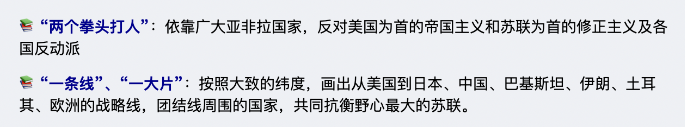
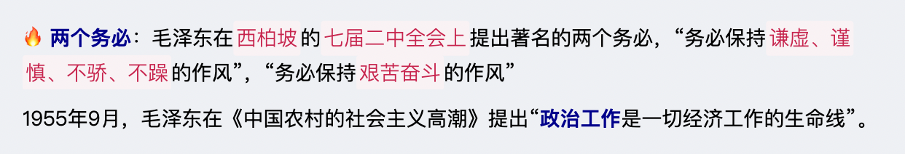

# 【毛泽东思想】社会主义建设理论

`2023/04/09 15:44:38  by: 程序员·小李`

#### 经济建设

#### 🔥 政治建设

> 国家性质、`国体`：人民民主专政

> 根本`政治制度`：人民代表大会制度

> 与各`民主党派`的合作方针：长期共存、互相监督

>`少数民族`管理：实行民族区域自治制度

>三反、五反：党政机关内部`“反贪污、反浪费、反官僚主义”`；私营工商业中`“反行贿、反偷税漏税、反盗骗国家财产、反偷工减料、反盗窃国家情报”`

🔥 1949年，毛泽东发表了《论人民民主专政》，标志着人民民主专政理论的形成。

#### 文化建设

`百花齐放、百家争鸣`；古为今用；洋为中用

建设`工人阶级知识分子队伍`

向科技进军

#### 统一建设

#### 外交建设

#### 党建

