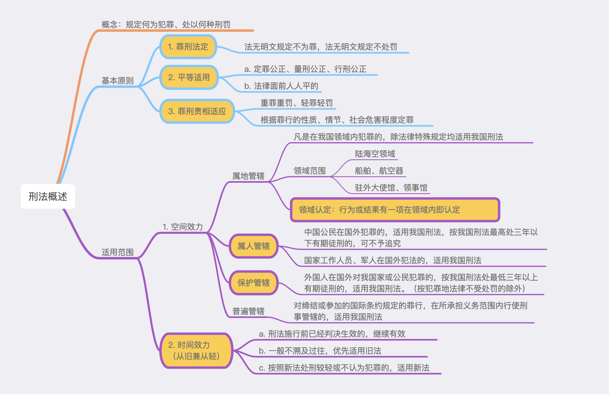

# 【法律】刑法
`2023/03/23 23:29:18  by: 程序员·小李`

#### 概览

#### 刑法的概念

规定什么是犯罪，会受到什么刑罚处罚的问题。

#### 刑罚的原则

> 1. `罪刑法定`。法无明文规定不为罪，法无明文规定不处罚。
> 2. `平等`原则。法律面前人人平等，定罪公正、量刑公正、行刑公正；
> 3. `罪责刑相适应`。重罪重罚、轻罪轻罚。

#### 刑法的适用范围

> 空间范围：对人、对地的限定
> 1. 属地管辖：对`中国境内`（水、陆、空、航空器、船舶、驻外大使馆、领事馆）的犯罪行为，除特别规定外，适用我国刑法。犯罪`行为或结果`有一项在国内，就适用我国刑法。
> 2. 属人管辖：`公民`在国外犯罪的，适用我国刑法，最高处罚`三年以内`有期徒刑的，可以不追究；`国家工作人员、军人`在国外犯罪的，适用我国刑法。
> 3. 保护管辖：外国人在`国外`对我国家、公民犯罪的，按刑法处`三年以上`有期徒刑的，适用我国刑法，但按照犯罪地法律不受处罚的除外。
> 4. 普遍管辖权：缔结条约的情况，执行我国刑法。

#### 刑法的时间效力

> 我国第一部刑法与1979年制定，1997年修订，1997年10月1日开始施行现行《刑法》。
>
> 🔥 对犯罪行为在新法前，审判在新法后的情况，按照`从旧从轻`原则。

