# 【法律】刑法与犯罪

`2023/04/02 20:24:52  by: 程序员·小李`

#### 概览

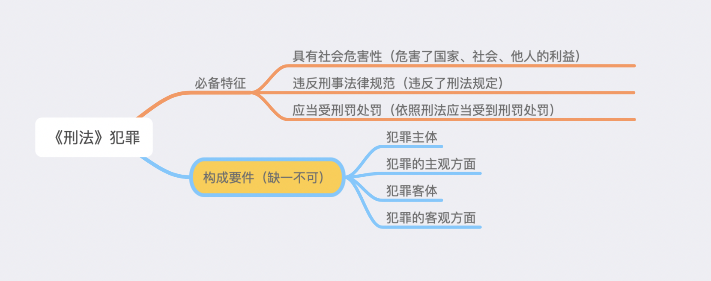

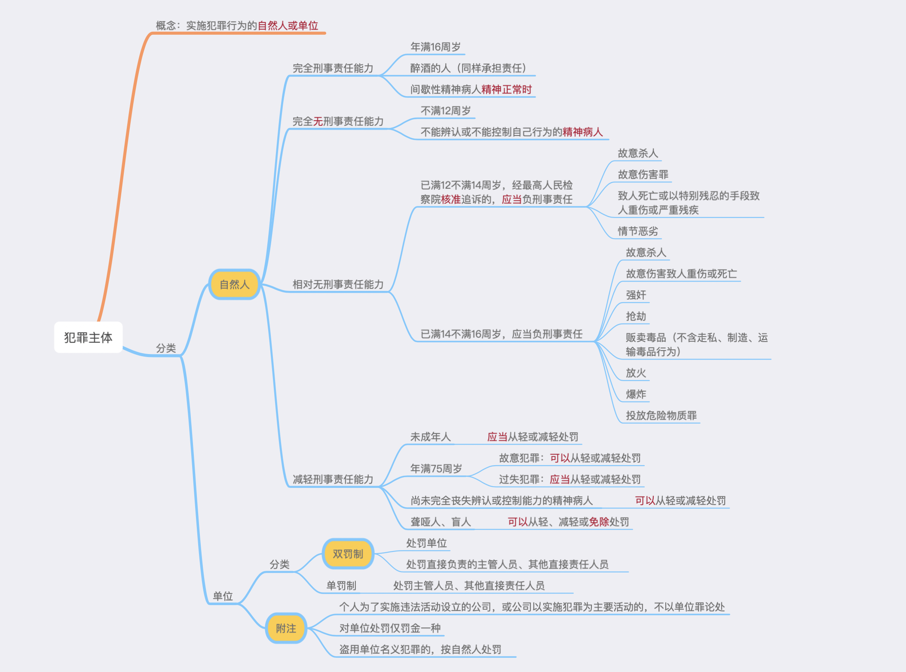

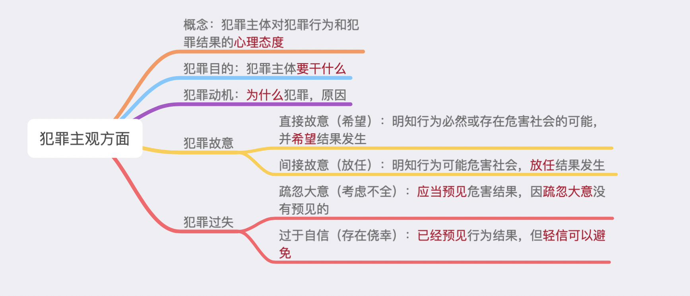

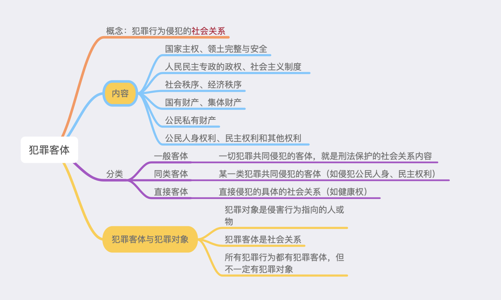

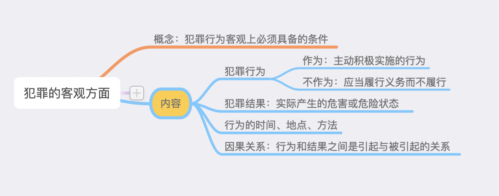

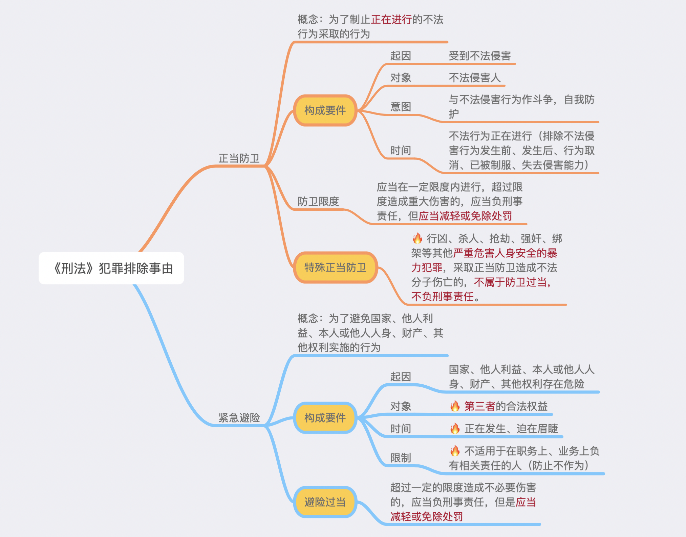

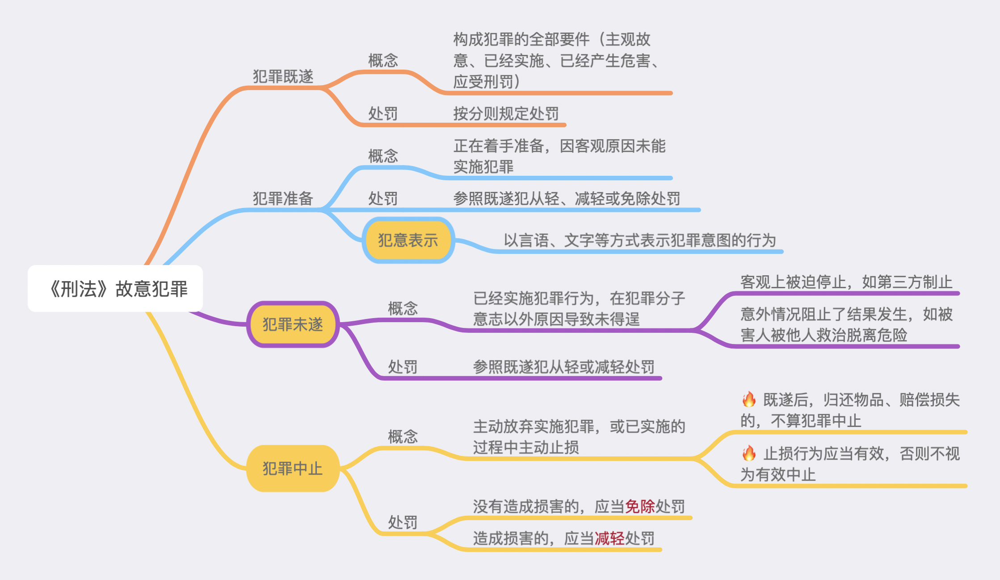

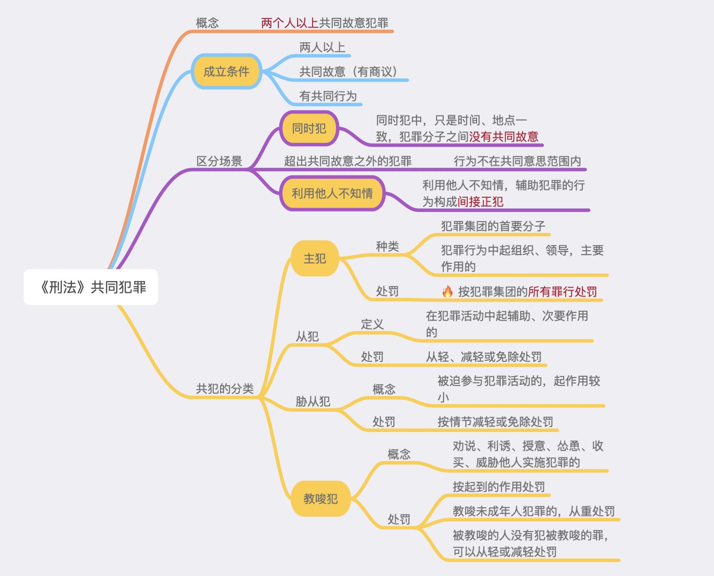

#### 犯罪

> 具有`严重的社会危害性`，`违反刑事法律`规范、`依法应当受刑罚处罚`的行为。

> 犯罪构成的要件包括：犯罪主体、犯罪主观方面、犯罪客体、犯罪客观方面，其中`核心要件`是犯罪的客观方面。

#### 犯罪主体

> 犯罪主体：实施犯罪行为的自然人、单位

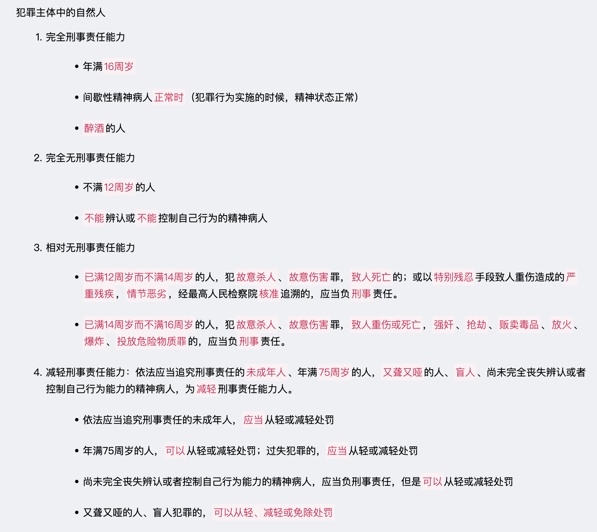

> 犯罪主体中的单位
> 1. 双罚制：处罚单位，也处罚直接负责的`主管人员和其他直接责任`人员
> 2. 单罚：单罚是例外，处罚直接负责的主管人员和其他直接责任人员。
>  * 个人为进行犯罪活动成立的公司，或者公司成立过后以实施犯罪为主，不以单位犯罪论处。
>  * 盗用公司名义实施犯罪的，不以公司犯罪论处。

#### 犯罪主观方面

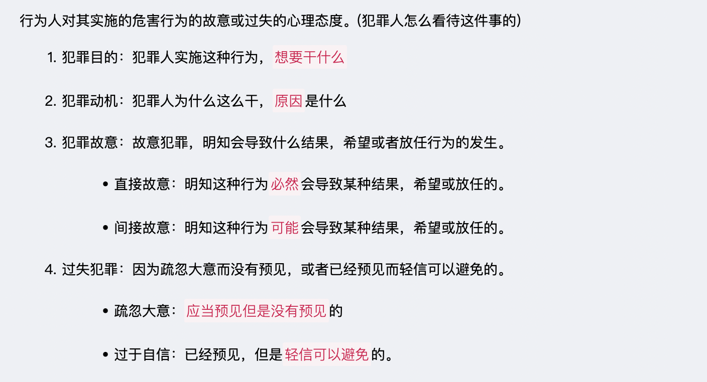

#### 犯罪客体

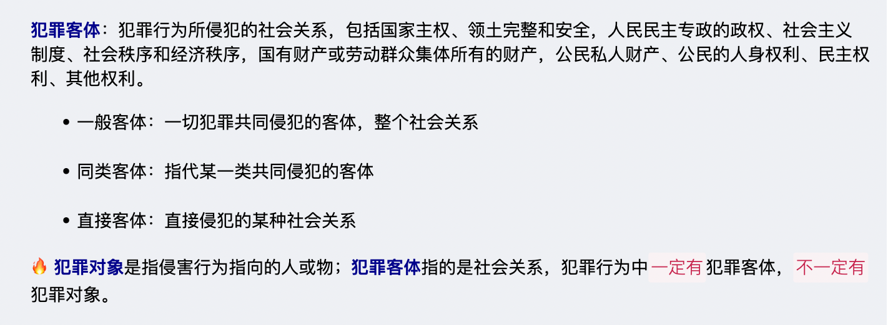

#### 犯罪的客观方面

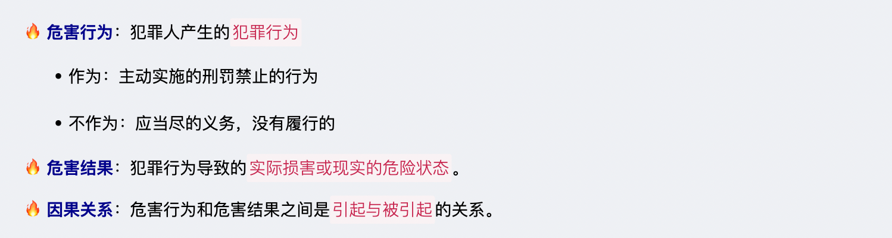

#### 犯罪排除的事由

> 某些行为虽然客观上造成了损害，表面上符合犯罪的客观要件，但是没有犯罪的社会危害性，不成立犯罪。

#### 正当防卫(犯罪人不法侵害)

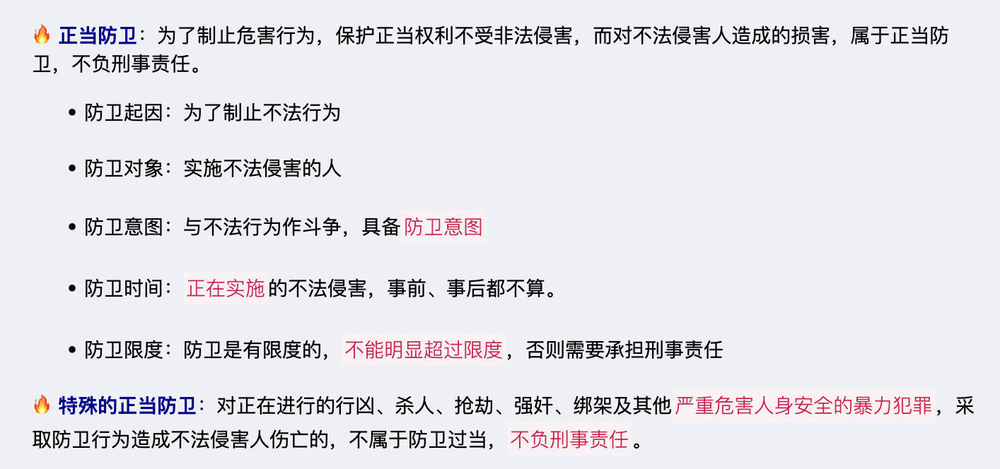

#### 紧急避险（不涉及犯罪人不法侵害）

#### 故意犯罪的形态

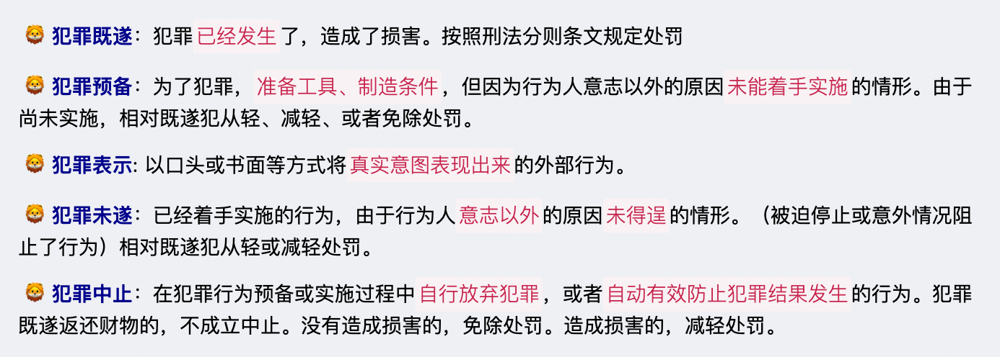

#### 共同犯罪

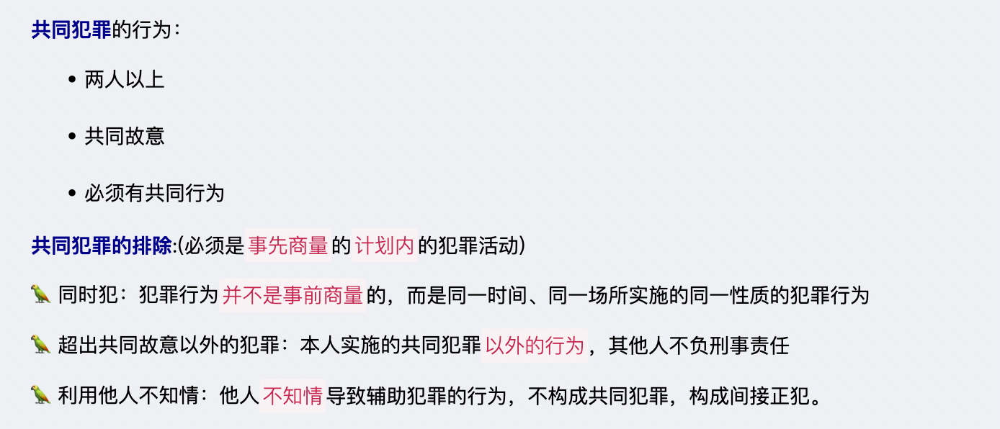

#### 共犯的分类

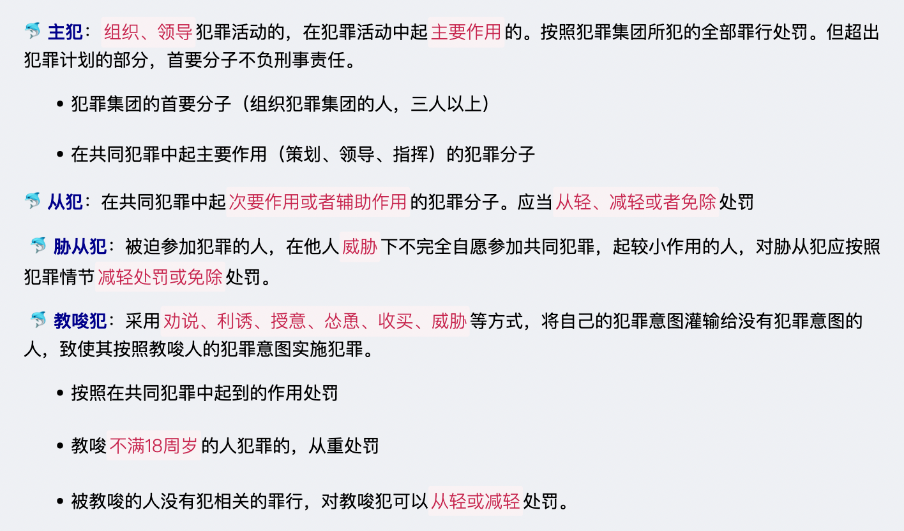
