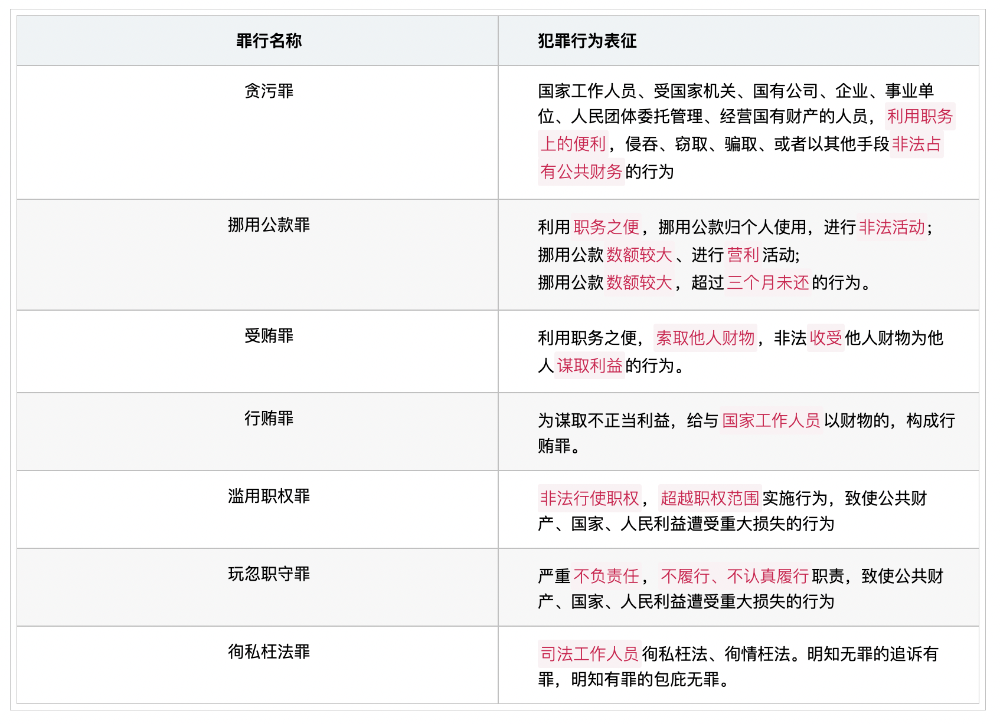
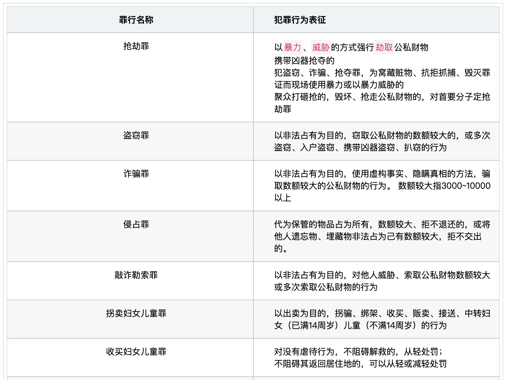
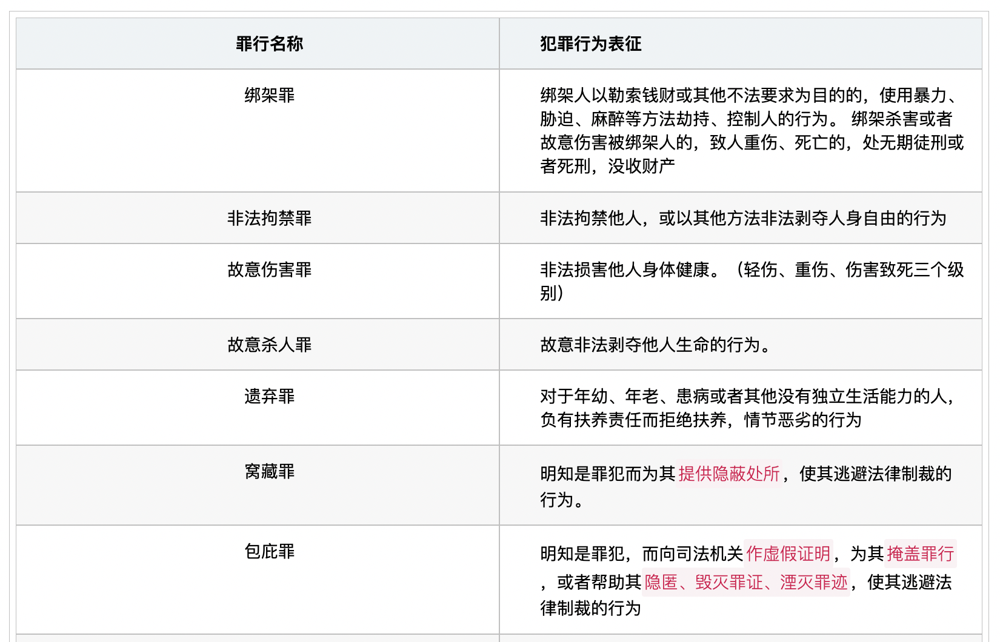
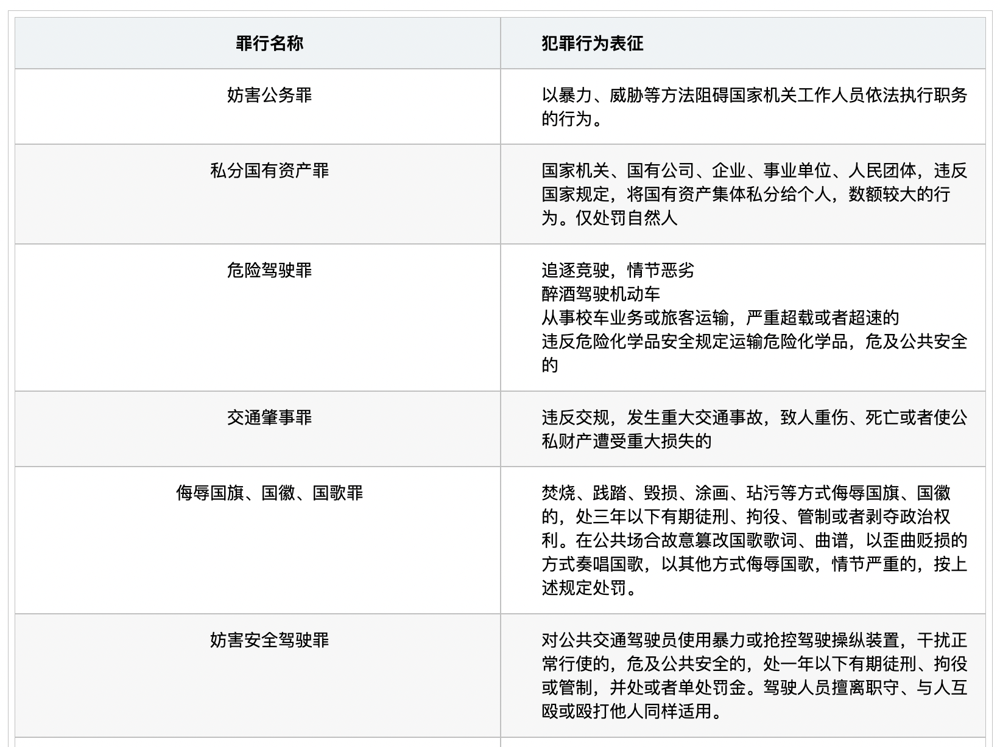
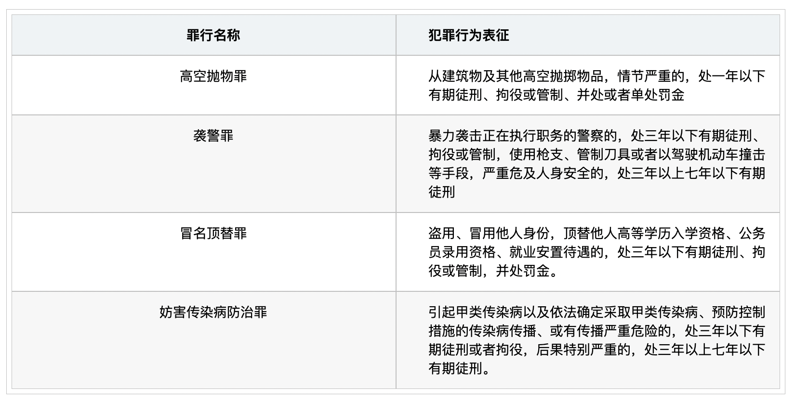

# 【法律】刑罚与量刑

`2023/04/02 22:23:09  by: 程序员·小李`

#### 主刑——拘役、管制、有期、无期、死刑

独立适用，一个罪行只能适用一个主刑。

>**拘役**：就近劳动改造，`看守所`执行，参加劳动的可酌量发给报酬，期限为`1~6个月`，数罪并罚`不得超过1年`
>
>**管制**：`社区矫正`，依然继续工作，同工同酬，期限为`3个月~2年`，数罪并罚`不得超过3年`。从判决执行之日起计算刑期，`先行羁押一日抵刑期2日`
>
>**有期徒刑**：强制劳动改造，`6个月~15年`，数罪并罚不超过35年的，执行`不超过20年`；数罪并罚35年以上的，执行`不超过25年`。
>
>**无期徒刑**：剥夺终身自由，强制劳动改造，先行羁押`不折抵刑期`。
>
>**死刑**：剥夺生命。

死刑仅适用罪大恶极犯罪分子；死刑必须`最高法`判决或核准，死缓可以由`高级人民法院`判决或核准。

犯罪时`不满18周岁`，审判时`怀孕的妇女`，不适用死刑；审判时`年满75周岁`，不适用死刑，特别残忍手段致人死亡的除外。

对判处死刑不是必须立即执行的，可以判处`缓刑2年`，缓刑期间没有故意犯罪，两年后减为`无期徒刑`；有重大立功表现的，减为`25年有期徒刑`；如故意犯罪，报请最高法核准死刑。对故意犯罪，并未执行死刑的，死缓期限重新计算，报最高法备案。

#### 附加刑——罚金、剥夺政治权利、没收财产、驱逐出境

附加刑可以附加于主刑，也可独立适用。

> 罚金：缴纳一定数额金钱，对未成年人应当从轻或减轻处罚，但不能少于500元
>
> 剥夺政治权利：选举与被选举权，言论、出版、集会、结社、游行、示威，担任国家机关职务，担任国企、企业、事业单位、人民团体领导职位。
>
> 没收财产：犯罪分子的部分或全部财产没收归国有，应对个人及其扶养的家属保留必须的生活费用
>
> 驱逐出境：强迫犯罪的外国人离开中国境内

>对危害国家安全的、判处死刑、无期徒刑的，`应当`剥夺政治权利终身；犯故意杀人、强奸、放火、爆炸、投毒、抢劫等严重破坏社会秩序的犯罪分子，`可以`剥夺政治权利终身

>判处管制+剥夺政治权利的，政治权利剥夺时间范围和管制`一致`；死刑减为有期徒刑、无期减为有期徒刑的，剥夺政治权利期限改为`3年以上10年以下`；除此之外，剥夺政治权利期限为`1年以上5年以下`

#### 累犯

>**一般累犯**：年满18周岁，故意犯罪处`有期徒刑`以上，执行完毕或赦免后`五年内`又故意犯罪处有期徒刑以上的。
>
>**特别累犯**：`危害国家安全、恐怖活动犯罪、黑社会性质犯罪`，在执行完毕或赦免后任何时候再犯的。

对累犯，从重处罚，`不得缓刑，不得假释`。

#### 自首、立功

>**自首**：犯罪后`主动投案`，或者被采取强制措施的犯罪嫌疑人、被告人、正在服刑的罪犯，如实供述司法机关`尚未掌握的其他罪行`，应当`从轻、减轻`处罚，罪行较轻的`可免除`处罚。
>
>**立功**：`揭发他人犯罪行为`，查证属实的；提供线索侦破其他案件的。应当`从轻、减轻`处罚，有重大立功表现的，可以`减轻或免除`处罚。

#### 缓刑(拘役、3年以下有期徒刑)

>被判处`拘役、3年以下有期徒刑`的，根据犯罪情节和表现，如没有再犯危险，规定一定的考验期，暂缓刑罚的执行。
>
>* 犯罪情节较轻
>
>* 确有悔改表现
>
>* 无再犯可能
>
>* 缓刑对社区没有重大不良影响

对不满18周岁、怀孕的人、满75周岁的人，符合条件`应当`缓刑，对累犯、犯罪集团首要分子`不适用`缓刑。

>适用缓刑的如有附加刑，附加刑继续执行，犯罪分子应当：
>
>* 遵守法律法规、服从监督；
>
>* 按规定报告自己的活动情况；
>
>* 遵守关于会客的规定；
>
>* 离开居住市县或迁居，应当经考察机关批准

缓刑考验期内遵守要求的，原刑罚不再执行，予以`公开宣告`。对缓刑期间`犯新罪或发现漏罪`的，违反法律法规的，`撤销`缓刑。

#### 减刑(管制、拘役、有期、无期)

>被判处`管制、拘役、有期、无期`的犯罪分子，接受教育`确有悔改表现或立功表现`的，适当减轻原判刑罚：
>
>* `阻止他人重大犯罪活动`；
>
>* `检举重大犯罪活动`属实的；
>
>* 有`发明创造或重大革新`；
>
>* `舍身救人`；
>
>* 在`抗御自然灾害、排除重大事故`中有突出表现；
>
>* 对国家、社会有其他重大贡献。

管制、拘役、有期减刑后实际执行时间不得少于原判刑期的`二分之一`；判处无期徒刑的`不得少于13年`

#### 假释（有期、无期）

>被判处`有期、无期`的部分罪犯，在执行一定刑期后，确有悔改的，不至于危害社会的，附条件地予以提前释放：
>
>* 对有期徒刑，执行`二分之一`以上的刑期后，剩余时间为考验期
>
>* 对无期徒刑，至少执行`13年后`，考验期为`10年`
>
> * 对`累犯`或因`故意杀人、抢劫、强奸、绑架、放火、爆炸、投放危险物质或有组织的暴力性犯罪`被判处`10年以上`有期徒刑、无期徒刑的，`不得假释`。

 
> 被假释的犯罪分子应当：
> * 遵守法律、法规，服从监督
> * 按规定报告自己的活动情况
> * 遵守关于会客的规定
> * 离开居住的市、县、或者迁居，应当经监督机关批准。
>
> 对假释期间`犯新罪或发现漏罪`的，`违反法律、法规`的，`撤销`假释。

#### 与公职人员相关的罪名

#### 其他常见罪行

#### 其他

> 违反狩猎法规，在禁猎区、禁猎期或者使用禁用的工具、方法进行狩猎，破坏野生动物资源，涉嫌下列情形之一的，应予立案追诉：（一）非法狩猎野生动物`二十只以上`的；（二）在`禁猎区内`使用`禁用的工具或者禁用的方法`狩猎的；（三）在`禁猎期内`使用禁用的工具或者禁用的方法狩猎的；（四）其他情节严重的情形。

> 违反国家规定，未经监管部门批准，或者超越经营范围，以`营利`为目的，经常性地向社会不特定对象发放贷款，扰乱金融市场秩序，情节严重的，以`非法经营罪`定罪处罚。

> 代替他人或者让他人代替自己参加第一款规定的考试的，处`拘役或者管制`，并处或者单处`罚金`。

> 单位犯罪既可以是`故意犯罪`，也可以是`过失犯罪`；单位`只可判处罚金`；单位犯罪的犯罪主体`只能是单位`，故在单位犯罪中不可能存在单位和单位成员之间的共同犯罪；单位犯罪以`双罚制`为原则，`单罚制`为例外（只罚自然人）。

> 🔥 罪刑法定原则`禁止类推适用`，要求合理地、客观地、准确地解释刑法，即罪刑法定原则要求刑法的解释不能超出刑法用于可能具有的含义，`允许扩大解释`

> **假想防卫**，是指行为人由于主观认识上的错误，`误认为有不法侵害的存在`，实施防卫行为结果造成损害的行为。对于假想防卫，应当根据认识错误的原理予以处理，有过失的以过失论，无过失的以意外事件论。

> **偶然防卫**，是指在客观上加害人正在或即将对被告人或他人的人身进行不法侵害，但被告人`主观上没有认识到这一点`，出于非法侵害的目的而对加害人使用了武力，`客观上起到了人身防卫的效果`。

> 由于犯罪行为而使被害人遭受经济损失的，对犯罪分子除依法给予刑事处罚外，并应根据情况判处赔偿经济损失。承担民事赔偿责任的犯罪分子，同时被判处罚金，其财产不足以全部支付的，或者被判处没收财产的，应当`先承担`对被害人的`民事赔偿责任`。

> 被宣告缓刑的犯罪分子，如果被判处附加刑，`附加刑仍须执行`。

> 有期徒刑的缓刑考验期限为`原判刑期以上五年以下`，但是`不能少于一年`。

> 对于累犯和犯罪集团的首要分子，`不适用缓刑`。

> 被宣告缓刑的犯罪分子，在缓刑考验期限内犯新罪或者发现判决宣告以前还有其他罪没有判决的，应当`撤销`缓刑，对新犯的罪或者新发现的罪作出判决，把前罪和后罪所判处的刑罚，`数罪并罚`。

> 缓刑的执行机关是`社区矫正机关`，而非公安机关。

> **实质的一罪**是指在外观上具有数罪的某些特征，但实质上构成一罪的犯罪形态。它包括`想象竞合犯、结果加重犯和继续犯`。

> **法定的一罪**指行为人基于多个罪过，实施了多个危害行为，侵犯多种法益，立法者本来可以将其规定为数个犯罪构成或者已经将其规定为数个犯罪构成，因为某种特定的理由，法律上将其规定为一罪的情形，包括`结合犯和集合犯`。

> **处断的一罪**，又称裁判的一罪，是指本来是符合数个犯罪构成的数罪，但因其固有的特征，在司法机关处理时将其规定为一罪。它包括`连续犯、牵连犯和吸收犯`。

> 🔥 人民法院审判第一审案件`应当公开`进行。但是涉及`国家机密或秘密`以及`个人隐私`的案件、`未成年人犯罪`案件、`离婚`案件和`涉及商业秘密`的案件可不公开审理。

> 🔥 **前科报告制度**依法受过刑事处罚的人，在`入伍、就业`的时候，应当如实向有关单位报告自己曾受过刑事处罚，不得隐瞒。犯罪的时候`不满十八周岁`被判处`五年`有期徒刑以下刑罚的人，免除前款规定的报告义务。

> 涉嫌巨额财产来源不明，数额在`30万元以上`的，应予立案。

> **连续犯**：指连续多次触犯相同的罪名；
>
> **继续犯（持续犯）**：是指行为一直处于持续状态的犯罪；
>
> **牵连犯**：单个犯罪行为牵连多个罪名；
>
> **吸收犯**：是指事实上存在数个不同的行为，其中一行为吸收其他行为，仅成立吸收行为一个罪名的犯罪。

> **重大责任事故案**：工厂、矿山、林场、建筑企业或者其他企业、事业单位的职工，以及群众合作经营组织或个体经营户的从业人员，由于不服管理、违反规章制度，或者强令工人违章冒险作业，因而发生重大伤亡事故，或者造成重大经济损失，具有下列行为之一的，应予立案：1．致人死亡`一人以上`，或者致人重伤`二人以上`的；2．造成直接经济损失`五万元以上`的；3．经济损失虽不足规定数额，但情节严重，使`生产、工作受到重大损害`的。

> 犯罪中止的要件？
>
> 1. 必须`自动`放弃犯罪
>
> 2. 必须是`彻底`放弃犯罪
>
> 3. 必须`有效防止犯罪结果发生`
>
> 4. 必须是在`危害结果产生之前`放弃犯罪

> **轻微伤与轻伤**
> 
> 1. 法律后果不同：
>  * 致人轻微伤，触犯`治安管理处罚法`；
>  * 致人轻伤，触犯`刑法`。
>
> 2. 鉴定标准不同：
>  * 轻伤，包括轻伤一级和轻伤二级，是指使`人肢体或者容貌损害`，`听觉、视觉或者其他器官功能部分障碍`或者其他对于人身健康`有中度伤害的损伤`。
>  * 轻微伤，是指各种致伤因素所致的`原发性损伤`，造成组织器官结构`轻微损害或者轻微功能障碍`。
>
> 3. 处罚不同：
>  * 致人轻微伤，需要承担`行政责任和民事赔偿责任`。殴打他人的，或者故意伤害他人身体的，处五日以上十日以下拘留，并处二百元以上五百元以下罚款；情节较轻的，处五日以下拘留或者五百元以下罚款。
>  * 致人轻伤的，需要承担`刑事责任`。故意伤害他人身体的，处三年以下有期徒刑、拘役或者管制。致人重伤的，处三年以上十年以下有期徒刑。

> 对被判处`死刑缓期执行`的`累犯`以及因`故意杀人、强奸、抢劫、绑架、放火、爆炸、投放危险物质或者有组织的暴力性犯罪`被判处死刑缓期执行的犯罪分子，人民法院根据犯罪情节等情况可以同时决定对其`限制减刑`。

> 冒充军人招摇撞骗的，处`三年以下`有期徒刑、拘役、管制或者剥夺政治权利；情节严重的，处`三年以上十年以下`有期徒刑。

> 信用卡诈骗罪：
>
> * 数额较大的，处`五年以下有期徒刑或者拘役`，并处`二万元以上二十万元以下`罚金；
> * 数额巨大或者有其他严重情节的，处`五年以上十年以下有期徒刑`，并处`五万元以上五十万元以下`罚金；
> * 数额特别巨大或者有其他特别严重情节的，处`十年以上有期徒刑或者无期徒刑`，并处`五万元以上五十万元以下`罚金或者没收财产
>
>  1. 使用伪造的信用卡，或者使用以虚假的身份证明骗领的信用卡的；
>
>  2. 使用作废的信用卡的；
>
>  3. 冒用他人信用卡的；
>
>  4. 恶意透支的。(持卡人以非法占有为目的，超过规定限额或者规定期限透支，并且经发卡银行催收后仍不归还的行为)。
>
> 盗窃信用卡并使用的，按`盗窃罪`定罪。

> 🔥 走私、贩卖、运输、制造毒品，无论数量多少，都`应当`追究刑事责任，予以刑事处罚。

> 故意传播新型冠状病毒感染肺炎病原体，具有下列情形之一，以危险方法危害公共安全罪定罪处罚：
> 1. `已经确诊`的新型冠状病毒感染肺炎病人、病原携带者，`拒绝隔离治疗或者隔离期未满擅自脱离隔离治疗`，并进入公共场所或者公共交通工具的；
> 2. 新型冠状病毒感染肺炎`疑似病人`拒绝隔离治疗或者隔离期未满擅自脱离隔离治疗，并进入公共场所或者公共交通工具，`造成新型冠状病毒传播`的。

> **妨害传染病防治罪**：违反传染病防治法规定，造成`甲类传染病传播或者有传播严重危险的行为`。

> **非法经营罪**：是指`未经许可经营`法律、行政法规规定的专营、专卖物品或其他限制买卖的物品，或是买卖进出口许可证、进出口原产地证明以及其他法律、行政法规规定的经营许可证或者批准文件，或是未经国家有关主管部门批准，非法经营证券、期货或者保险业务，或者非法从事资金支付结算业务，以及其他从事非法经营活动，扰乱市场秩序，情节严重的行为。

>**伪造事业单位印章罪**：`没有制作权限的人`，`擅自伪造`公司、企业、事业单位、人民团体的`印章`的行为。

> **袭警罪**：`暴力`袭击`正在依法`执行职务的`人民警察`的，处三年以下有期徒刑、拘役或者管制；使用枪支、管制刀具，或者以驾驶机动车撞击等手段，严重危及其人身安全的，处三年以上七年以下有期徒刑。袭警罪属于妨害社会管理秩序罪犯罪。

> **侵犯财产罪**：以转移财产、逃匿等方法`逃避支付劳动者的劳动报酬`或者有能力支付而不支付劳动者的劳动报酬，数额较大，经政府有关部门责令支付仍不支付的，处三年以下有期徒刑或者拘役，并处或者单处罚金；造成严重后果的，处三年以上七年以下有期徒刑，并处罚金。

> **保险诈骗罪**：以`非法获取保险金`为目的，采用`虚构`保险标的、保险事故或者`制造保险事故`等方法，向保险公司`骗取保险金`，数额较大的行为。

> **以危险方法危害公共安全罪**（如放火罪、决水罪、爆炸罪、投放危险物质罪）：放火、决水、爆炸以及投放毒害性、放射性、传染病病原体等物质或者以其他危险方法危害公共安全。
> * 尚未造成严重后果的，处`三年以上十年以下`有期徒刑。
> * 致人重伤、死亡或者使公私财产遭受重大损失的，处`十年以上有期徒刑、无期徒刑或者死刑`。

> **强迫交易罪**：自然人或者单位，以`暴力、胁迫`手段强迫他人`购买`、`出卖`商品、强迫他人`提供`、`接受`服务，情节严重的行为。

#### 故意杀人罪、故意伤害罪、寻衅滋事罪、过失致人死亡罪、意外事件

> 法律拟制为故意杀人的情形：
>
>（1）`非法拘禁`使用暴力致人死亡的；
>
>（2）`刑讯逼供`或`暴力取证`致人死亡的；
>
>（3）`虐待被监管人`致人死亡的；
>
>（4）`聚众“打砸抢”`致人死亡的；
>
>（5）`聚众斗殴`致人死亡的。

> **故意杀人罪**：`故意`非法`剥夺他人生命`的行为。
> * 直接故意：行为人`明知`自己的行为`会`发生危害社会的结果，并且`希望`这种结果发生
> * 间接故意：行为人`明知`自己的行为`可能`发生危害社会的结果，并且`放任`这种结果发生
>
> **故意伤害罪**：`故意`非法`损害他人身体健康`的行为（主观上没有致死期望）。
>
> **寻衅滋事罪**：恶意挑起事端，行为情节恶劣、情节严重或者造成`公共场所秩序严重混乱`的，构成犯罪。
>
> **过失致人死亡罪**：行为人`有预见危害结果发生的可能`，只因过于`轻视`而予以放任，致人死亡的。
>
> **意外事件**：客观上虽然造成了损害，但`不是`出于行为人的故意或者过失，而是`不能预见的原因`所引起。

#### 🔥 危险驾驶罪、交通肇事罪、妨害安全驾驶罪

> **危险驾驶罪**
> * 驾驶机动车`追逐竞驶，情节恶劣`
> * `醉酒驾驶`
> * 从事`校车业务或者旅客运输`，严重`超载`或者`超速`
> * `违反规定`运输`危险化学品，危及公共安全`的行为
>
> **交通肇事罪**：违反交规发生重大交通事故，致人重伤、死亡或者使公私财产遭受重大损失的行为。处三年以下有期徒刑或者拘役。`肇事后逃逸`或者有其他特别恶劣情节的，处三年以上七年以下有期徒刑；`因逃逸致人死亡`的，处七年以上有期徒刑。
>
> **妨害安全驾驶罪**：对行驶中的`公共交通工具`的驾驶人员使用`暴力`或者`抢控驾驶操纵装置`，干扰公共交通工具正常行驶，危及公共安全的，处一年以下有期徒刑、拘役或者管制，并处或者单处罚金。

#### 遗弃罪、虐待罪

> **遗弃罪**：对于年老、年幼、患病或者其他没有独立生活能力的人，`负有扶养义务而拒绝扶养`的行为。情节恶劣的，处五年以下有期徒刑、拘役或者管制。
> * 把受害人遗弃于`可能被救助`的地方，属于遗弃。把受害人遗弃于`无人救助`的地方，属于故意杀人

> **虐待罪**：行为人对共同生活的家庭成员的`身体或精神`进行`摧残、迫害`，情节恶劣的行为。

#### 🔥 受贿罪、行贿罪、单位行贿罪、对非国家工作人员行贿罪、对有影响力的人行贿罪、徇私枉法罪

行贿罪中行贿的对象、受贿罪中受贿的人都必须是`国家工作人员`。

徇私枉法罪中，犯罪主体是`司法工作人员`。

> **受贿罪**：`国家工作人员`利用职务便利`索取财物`或`非法收受`他人财物并`为他人谋取利益`的行为。
>
> **行贿罪**：为谋取`不正当利益`，给予`国家机关工作人员`财物的行为。
>
> **单位行贿罪**：`单位`为谋取`不正当利益`而行贿，或违反规定，给予国家工作人员以`回扣、手续费`，情节严重的，对单位判处罚金，并对其直接负责的主管人员和其他直接责任人员，处五年以下有期徒刑或者拘役，并处罚金。
>
> **对非国家工作人员行贿罪**：为谋取不正当利益，给予`公司、企业或者其他单位的工作人员`以财物
> * 数额较大的，处三年以下有期徒刑或者拘役，并处罚金
> * 数额巨大的，处三年以上十年以下有期徒刑，并处罚金。
>
> **对有影响力的人行贿罪**：为谋取不正当利益，向`国家工作人员的近亲属`或者其他与该国家工作人员`关系密切的人`，或者向`离职的`国家工作人员或者其`近亲属`以及其他与其`关系密切的人`行贿的，处三年以下有期徒刑或者拘役，并处罚金；
> * 情节严重的，或者使国家利益遭受重大损失的，处三年以上七年以下有期徒刑，并处罚金；
> * 情节特别严重的，或者使国家利益遭受特别重大损失的，处七年以上十年以下有期徒刑，并处罚金。
>
> **徇私枉法罪**： `司法工作人员`对明知是无罪的人而使他受追诉、对明知是有罪的人而故意包庇不使他受追诉，或者在刑事审判活动中故意违背事实和法律作枉法裁判的行为。有徇私枉法行为，同时又构成受贿罪的，依照处罚较重的规定定罪处罚。

#### 贪污罪、职务侵占罪、巨额财产来源不明罪

> **贪污罪**：`国家工作人员`利用`职务上的便利`，侵吞、窃取、骗取或者以其他手段非法占有公共财物的行为。
> * 管理、经营国有财产的人员，同样以贪污罪论。
> * 国家工作人员与非工作人员共同犯罪的，按贪污罪论处。
>
> **职务侵占罪**：`公司、企业或者其他单位的工作人员`，利用职务上的便利，将本单位财物非法占为己有。
> * 数额较大的，处`三年以下`有期徒刑或者拘役，并处罚金
> * 数额巨大的，处`三年以上十年以下`有期徒刑，并处罚金
> * 数额特别巨大的，处`十年以上`有期徒刑或者无期徒刑，并处罚金。
>
> **巨额财产来源不明罪**：`国家工作人员`的财产、支出明显超过合法收入，差额巨大不能说明来源的，差额部分以`非法所得论`，处五年以下有期徒刑或者拘役；差额特别巨大的，处五年以上十年以下有期徒刑。财产的差额部分予以追缴。

#### 挪用公款罪、私分国有资产罪、为亲友非法牟利罪

> 🔥 **挪用公款罪**：`国家工作人员`利用职务上的便利，
> * 挪用公款`进行非法活动`的，
> * 挪用公款`数额较大`并进行`营利活动`的
> * 挪用公款`数额较大`并`超过三个月未还`的行为。
>
>**私分国有资产罪**：国家机关、国有公司、企业、事业单位、人民团体，违反国家规定，`以单位名义`将`国有资产`集体私分给个人，且数额较大的行为。
>
> **为亲友非法牟利罪**：国有公司、企业、事业单位的工作人员，利用职务便利，有以下行为，使国家遭受损失：
> * 将本单位的`盈利业务交由自己的亲友进行经营的`；
> * 以`明显高于市场的价格`向自己的亲友经营管理的单位采购商品或者以`明显低于市场的价格`向自己的亲友经营管理的单位销售商品的；
> * 向自己的亲友经营管理的单位`采购不合格商品`的。

#### 滥用职权罪、玩忽职守罪、徇私枉法罪、徇私舞弊罪

> **滥用职权罪**：`国家机关工作人员`故意`逾越职权`，不按法律或违反法律决定、`处理其无权决定、处理的事项`，或者`违反规定处理公务`，致使侵吞公共财产、国家和人民遭受重大财产损失等行为。
>
> **玩忽职守罪**：`国家机关工作人员`严重`不负责任，不履行或不认真履行自己的工作职责`，致使公共财产、国家和人民利益遭受重大损失的行为，本罪侵犯的客体是国家机关的正常活动。
>
> **徇私枉法罪**：`司法工作人员`徇私枉法、徇情枉法，对明知是无罪的人而使他受追诉，对明知是有罪的人而故意包庇不使他受追诉，或者在刑事审判活动中故意违背事实和法律作枉法裁判的行为。
>
> **徇私舞弊罪**：`国家工作人员`利用职务上的便利，`以权谋私，弄虚作假，枉法包庇`，违法行使职权、职务，情节严重的行为。

#### 抢夺罪、抢劫罪、诈骗罪 、侵占罪、盗窃罪 

>
>**抢夺罪**：`直接暴力夺取`他人紧密占有的的公私财物，数额较大或者多次夺取的行为。暴力针对的是财物，不针对权利人。
>
> **抢劫罪**：通过暴力、胁迫`压制被害人`，从而达到`强行取财`的目的。(`抢劫过程中杀害他人，仍以抢劫罪定罪。`)
>
> **诈骗罪**：用虚构事实或者隐瞒真相的方法，`骗取`数额较大的公私财物的行为。
>
> **侵占罪**：将他人`交给自己保管的`财物、遗忘物或者埋藏物`非法占为己有`，数额较大，`拒不交还`的行为。
>
> **盗窃罪**：`盗窃公私财物`数额较大或者`多次盗窃、入户盗窃、携带凶器盗窃、扒窃`公私财物的行为。

#### 招摇撞骗罪、合同诈骗罪、敲诈勒索罪、非法拘禁罪、绑架罪

> **招摇撞骗罪**：`冒充国家机关工作人员`招摇撞骗的行为
>
> **合同诈骗罪**：以非法占有为目的，在`签订、履行合同过程中`，`骗取`对方当事人财物，数额较大的行为
>
> **敲诈勒索罪**：以非法占有为目的，对被害人使用`恐吓、威胁或要挟`的方法，非法占用被害人`公私财物`的行为。
>
> **非法拘禁罪**：以`拘押、禁闭或者其他强制方法`，非法`剥夺他人人身自由`的犯罪行为。具有殴打、侮辱情节的，从重处罚。
> * 致人重伤的，处三年以上十年以下有期徒刑；致人死亡的，处十年以上有期徒刑。
> * 使用`暴力致人伤残`的按`故意伤害罪`处理
> * 使用`暴力致人死亡`的按`故意杀人罪`处理
>
> 为`索取债务`非法扣押、拘禁他人的，按`非法拘禁罪`处理
>
> **绑架罪**：勒索财物或者其他为目的，使用`暴力、胁迫`或者其他方法，绑架他人的行为，或者绑架他人作为人质的行为。

#### 行为犯、结果犯、危险犯、举动犯

> **行为犯**：只要`实行行为完毕`，基本构成要件即为齐备的犯罪类型。行为犯要求行为人的行为达到一定程度，例如非法拘禁罪。

> **结果犯**：以`造成一定的危害结果`作为犯罪既遂标准的犯罪，大部分犯罪都是结果犯，比如故意杀人罪，故意伤害罪。

> **危险犯**：以能够创设对法益造成侵害`危险的风险`作为既遂标准的犯罪，典型的危险犯例如放火罪、危险驾驶罪等。

> **举动犯（即时犯）**：行为人`一着手犯罪实行行为`即告完成和完全符合构成要件，从而构成犯罪既遂的犯罪。例如侮辱国旗国歌罪。

#### 判决相关

> 判决宣告以后`发现新罪的`，应把前后两个判决所判处的刑罚，`“先并后减”`，决定执行的刑罚。已经执行的刑期，应当计算在新判决决定的刑期以内。

> 判决宣告以后`又犯新罪的`，应把前罪没有执行的刑罚和后罪所判处的刑罚，`“先减后并”`，决定执行的刑罚。

> 🔥 **“先减后并”的结果比“先并后减”的结果重**：一是实际执行的起点刑期提高了，二是实际执行的刑期可能超过刑法规定的数罪并罚法定最高刑的限制。

> 🔥 判决宣告以前一人犯数罪的，判处`死刑和无期徒刑`的，只执行死刑或者无期徒刑。

> 要切实防止`“谁能闹谁有理”“谁死伤谁有理”`的错误做法，坚决捍卫“法不能向不法让步”的法治精神

#### “可以”与“应当”

> 又聋又哑的人或者盲人犯罪，`可以`从轻、减轻或者免除处罚

> 对于故意杀人、强奸、放火、爆炸、投毒、抢劫等严重破坏社会秩序的犯罪分子，`可以`附加剥夺政治权利。

> 被判处`死刑、无期徒刑`的犯罪分子，`应当`剥夺政治权利终身。

> 对于危害国家安全的犯罪分子`应当`附加剥夺政治权利；

> 对不满十八周岁的人，`应当`从轻或者减轻处罚。
>
> * 已满`十六周岁`的人犯罪， `应当`负刑事责任。
>
> * 已满`十四周岁不满十六周岁`的人，犯故意杀人、故意伤害致人重伤或者死亡、强奸、抢劫、贩卖毒品、放火、爆炸、投放危险物质罪的，`应当`负刑事责任。
>
> * 已满`十二周岁不满十四周岁`的人，犯故意杀人、故意伤害罪，致人死亡或者以特别残忍手段致人重伤造成严重残疾，情节恶劣， 经最高人民检察院核准追诉的，`应当`负刑事责任。

> 对于被胁迫参加犯罪的，`应当`按照他的犯罪情节减轻处罚或者免除处罚。

> 正当防卫明显超过必要限度造成重大损害的，`应当`负刑事责任，但是`应当`减轻或者免除处罚。
