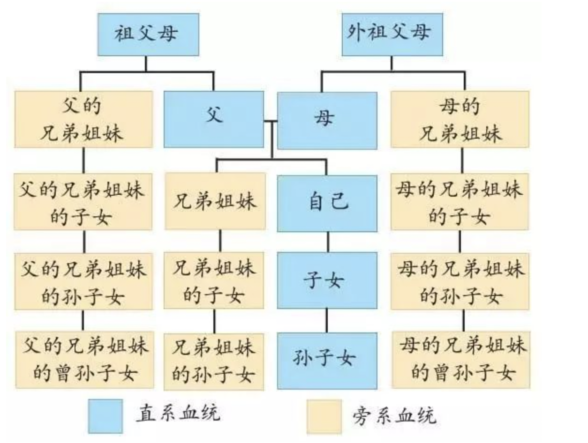
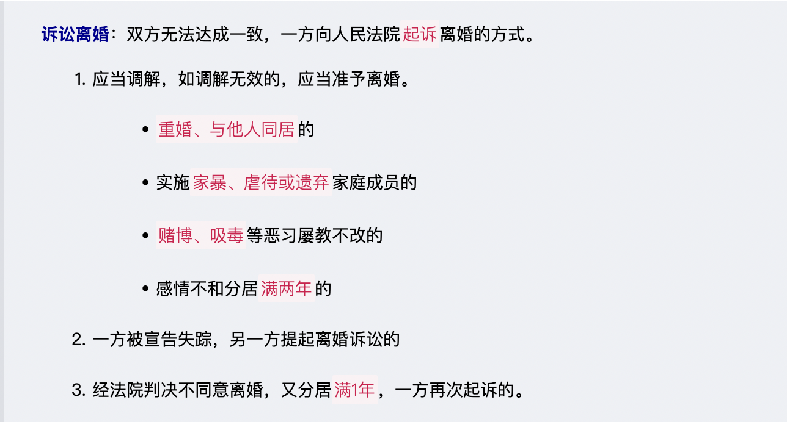
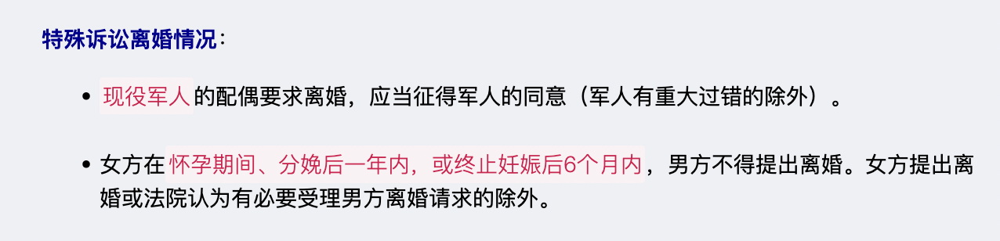
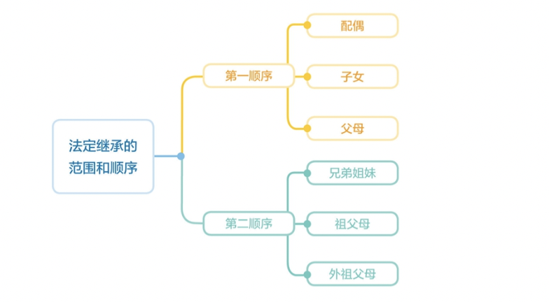
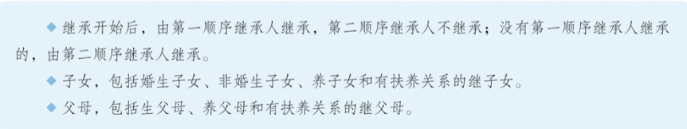

# 【法律】婚姻家庭、继承权

`2023/04/02 11:26:23  by: 程序员·小李`

#### 结婚的条件

> **结婚条件**：
> * 双方`自愿`
> * 男满`22`周岁，女满`20`周岁
> * 符合`一夫一妻`制

> **禁止结婚的情况**：禁止`直系血亲、三代以内旁系血亲`结婚
> * 直系血亲：有直接血缘关系的亲属，有生与被生的关系，包括父母、祖父母、外祖父母以及更上的长辈；子女、孙子女、外孙子女、更下的直接晚辈。
>
> * 三代以内旁系血亲：与己身同源于祖父母、外祖父母的各代旁系血亲。
>  1. 同源于父母的兄弟姐妹
>  2. 同源于祖父母、外祖父母的上下辈旁系亲属，包括叔、伯、姑与侄儿、侄女，舅、姨与外甥、外甥女；
>  3. 同源于祖父母、外祖父母的平辈旁系亲属，包括堂兄弟姐妹、表兄弟姐妹。

#### 无效婚姻、可撤销婚姻

> **无效婚姻**：不符合结婚条件的两性结合，法律上不具备效力：
> * `重婚`的(不符合一夫一妻制)
> * `直系血亲、三代以内旁系血亲`结合的（禁止直系血亲、三代以内旁系血亲结婚）
> * `不满足年龄`要求的（男满22周岁，女满20周岁）

> **可撤销婚姻**：违背当事人意愿成立的婚姻，或者已成立的婚姻缺乏某个要件，当事人可以撤销。
> * 以`胁迫的方式`结婚的。应当在胁迫行为终止或恢复人身自由起`一年内`申请。
> * `隐瞒身体疾病情况`的。一方患有重大疾病应当在登记前告知对方，隐瞒病情的，另一方可以起诉撤销婚姻。应当在知道撤销事由之日起`一年内`提出。

#### 夫妻关系

夫妻关系包括`人身关系和财产关系`，“夫妻地位平等”是夫妻关系的`核心`。夫妻在生活中平等行使权利、履行义务、共同承担家庭和社会的责任。

> **人身关系平等**： 强调`夫妻双方的人格独立`。
> * 夫妻双方都有`各自使用自己姓名`的权利，不因婚姻关系而发生变化。
> * 双方所生子女`可以随父姓，可以随母姓`。
> * 夫妻双方均有`参加生产，工作、学习和社会活动的自由`。(夫妻双方家庭地位平等的`重要标志`)。

> **日常生活的代理权**：夫妻一方因为日常生活实施的民事法律行为，对双方`均有法律效力`，与相对人有约定的除外。夫妻一方可以实施的法律行为范围的限制`不得对抗善意相对人`。

> **约定财产制**：双方可以以`书面形式`约定婚姻关系存续期间的财产归属，约定财产制比法定财产制`优先`。
> 
> 对夫妻约定双方存续期间的财产归各自所有的，一方所负的外债：
> * 相对人`知道此约定`的，以个人`一方`的财产清偿。
> * 相对人`不知道此约定`的，债务应当按照在夫妻`共同财产下的清偿原则`进行偿还。

>** 法定财产制**：
> 
> 1. 婚姻关系存续期间`共同财产`：
>  * 工资、奖金、劳务报酬
>  * 生产、经营、投资的收益
>  * 知识产权的收益
>  * 继承或受赠的财产（遗嘱中说明的除外）
>
> 2. 婚姻关系存续期间`个人财产`：
>  * 一方的婚前财产
>  * 一方因受人身损害获得的赔偿、补偿
>  * 遗嘱或者赠与合同中说明只归一方的财产。
>  * 一方专用的生活用品

> **夫妻共同债务**：双方`共同签名`，或者一方签名事后追认是`共同意思`的债务；夫妻一方在婚姻存续期间以`个人名义`为`家庭日常生活需要`所负债务，属于共同债务。

> **请求分割共同财产**：有以下情形的，可以请求法院分割共同财产，
> * 一方有`隐藏、转移、变卖、毁损、挥霍`夫妻共同财产的，或`伪造夫妻共同债务`的
> * 一方负有法定扶养任务的人患重大疾病需要医治，另一方`不同意支付相关医疗费用`的

> **人身关系平等**： 强调`夫妻双方的人格独立`。
> * 夫妻双方都有`各自使用自己姓名`的权利，不因婚姻关系而发生变化。
> * 双方所生子女可以随父姓，可以随母姓。
> * 夫妻双方均有参加生产，工作、学习和社会活动的自由。(这些自由是夫妻双方家庭地位平等的`重要标志`)。

#### 离婚

> **协议离婚**：双方`自愿`离婚的，签订`书面`协议，`亲自`到婚姻登记机关申请离婚登记。离婚协议应载明双方`自愿离婚的意思表示`、`对子女抚养`、`财产及债务处理`等事项的协商一致的意见。
>
> 自离婚登记申请`30日`内，任何一方不同意离婚的，可以向婚姻登记机关`撤销`申请。满30日后，双方应当`亲自`到婚姻登记机关申请发给离婚证，未申请的，视为`撤销`离婚申请。

#### 离婚后的子女关系

> **子女抚养**：父母与子女之间的关系`不会随着婚姻关系的破裂而消除`，仍有抚养、教育、保护子女的权利和义务。
> * 不满`2周岁`的孩子，由`母亲`直接抚养
> * 已满2周岁的孩子，双方协议不成的，由法院根据具体情况，按照`最有利于未成年子女`的原则判决
> * 已满8周岁的孩子，应当`尊重其真实意愿`
> * 离婚后，孩子归一方直接抚养的，另一方应负担`部分或者全部抚养费`。双方协议金额和期限，协议不成的由法院判决。

> **探望权**：不直接抚养的一方有`探望孩子`的权利，另一方有协助的义务。
> * 行使探望权的方式、时间又当事人`协定`，协议不成的，由`法院判决`。
> * 父/母探望孩子`不利于子女身心健康的`，由法院依法`终止`探望，终止事由消失后，应当`恢复探望`。

#### 离婚财产分割

> * 共同财产的分割双方协定，协议不成的，法院按照`照顾子女、女方、无过错方`权益原则判决。
> * 家庭`土地承包经营`中享有的权益，应当依法予以保护
> * 一方有隐藏、转移、变卖、毁损、挥霍夫妻共同财产的，或伪造夫妻共同债务的，可以`少分或不分`
> * 一方在抚育子女、照料老人等方面负担较重的，有权向另一方`请求补偿`。
> * 离婚时共同债务应当共同偿还。共同财产不足以偿还或财产归各自所有的，协议清偿，协议不成的，由人民法院判决。
> * 离婚时，若一方生活有困难，有负担能力的一方应当适当给与帮助。

> 以下情况导致离婚的，`无过错方`可以请求损害赔偿：
> * `重婚`
> * `非法同居`
> * `家暴、虐待或遗弃`家庭成员

#### 父母与子女的关系

> 父母对`未成年子女`不仅有`抚养义务`，也有`教育义务`。教育和保护未成年子女既是父母的义务，也是父母的权利。父母有权对子女的行为进行必要的约束和引导，并对子女进行批评教育和合理惩戒。
> * 不得虐待、遗弃未成年子女
> * 不得歧视女性未成年人或有残疾的未成年人
> * 不得有溺婴、弃婴和其他残害婴儿的行为
> * 应当让适龄子女按时人学，接受并完成义务教育，不得阻碍其入学或迫使其中途退学、辍学。
> * 必须履行对未成年子女的监护职责，保护未成年子女的人身安全和健康。在履行监护职责时，父母应当保护未成年子女的财产利益。未成年子女造成他人损害的，父母应当依法承担民事责任。

> `成年子女`对父母有`赡养的义务`。要求子女`经济上`供养父母、`生活上`照料父母、`精神上`慰藉父母，照顾父母的特殊需要。要求子女`尊重、体贴`父母，`不干涉`父母的婚姻自由，使父母幸福安度晚年。

> 为防止老年人的合法权益受损，民法典专门规定了`成年意定监护制度`。具有完全民事行为能力的成年人，可以与其近亲属、其他愿意担任监护人的个人或者组织事先协商，以`书面形式`确定自己的监护人。监护人在该成年人丧失或者部分丧失民事行为能力时，履行监护职责。

#### 收养

> **未成年人被收养的条件**：
> * `丧失父母`的孤儿
> * `查不到生父母`的未成年人
> * 生父母`有特殊困难无力抚养`的

> **收养人的条件**：
> * `无子女或只有一个子女`
> * 有抚养、教育、保护被收养人的`能力`
> * `没有`不应当收养子女的疾病
> * `无`不利于被收养人身心健康成长的`违法犯罪记录`
> * 年满`30周岁`
> * 无配偶收养`异性`子女的，收养人与被收养人年龄差距`40岁`以上

#### 继承

> 继承是指将自然人死亡后遗留的`个人合法财产`依法转移给他人所有。在继承关系中，死者是`被继承人`，被继承人死亡时遗留的个人合法财产是`遗产`；依法承受遗产的人是`继承人`，继承人享有的财产性权利称为`继承权`。

> 继承遗产需要先将个人合法财产从`家庭共有财产或者夫妻共同财产`中`析出`，析产以后确定的被继承人的个人合法财产才是遗产。

> 继承人不仅会获得被继承人的`遗产`，还需要承担被继承人未偿还的`债务`。本应由被继承人偿还的债务，应由继承人在继承的`遗产范围内`承担清偿责任，超过部分`不负清偿责任`，但继承人自愿偿还的除外。

> 取得继承权的根据有两种：一是基于法律的直接规定，称为`法定继承`，即基于婚姻关系、血缘关系、扶养关系获得继承权；二是基于合法有效遗嘱的指定，称为`遗嘱继承`。遗嘱继承只能在法定继承人范围内指定继承人。
>
> **丧失继承权的场景**：
> * `故意杀害`被继承人的
> * 为`争夺遗产`杀害其他继承人的
> * `遗弃或虐待`被继承人情节严重的（可恢复）
> * `伪造、篡改、隐匿、销毁`遗嘱，情节严重的（可恢复）
> * 以`欺诈、胁迫`手段迫使或妨碍被继承人设立、变更、撤回遗嘱的（可恢复）

#### 法定继承

> **法定继承顺序**：第一顺序继承人开始继承，第二顺序继承人不继承。没有第一顺序继承人继承的，第二顺序继承人继承。
> * 第一顺序继承人：配偶、子女、父母。丧偶儿媳对公婆，丧偶女婿对岳父母尽了主要赡养义务的，作为第一顺序继承人（`与是否再婚无关`）。
> * 第二顺序继承人：兄弟姐妹、祖父母、外祖父母
>

> **财产分配原则**：
> * 同一顺序继承人的财产份额，应当`均等`。
> * 有特殊困难又缺乏劳动能力的，应当`予以照顾`
> * 尽了主要扶养义务或与被继承人共同生活的继承人，可以`多分`
> * 有扶养能力和扶养条件的继承人，不尽扶养义务的，应当`不分或少分`
> * 继承人协议的，可以不均等。

> **代位继承**：顺序继承人先死亡的，由继承人的直系晚辈代位继承。

#### 遗嘱继承、遗赠

> 以所立遗嘱为依据的遗产处理方式。
> * 将遗产分给法定继承人的，为遗嘱继承。
> * 将遗产分给国家、集体、法定继承人以外的组织或个人的，为遗赠

> **实现形式**：
> 1. 自书遗嘱：亲笔所写遗嘱，签名、注明年月日
> 2. 代书遗嘱：两个以上见证人在场见证，由一人代书，由遗嘱人、代书人、见证人签名，注明年月日
> 3. 打印遗嘱：两个以上见证人在场见证，由遗嘱人、见证人在每一页签名，注明年月日
> 4. 录音录像遗嘱：两个以上见证人在场见证，遗嘱人、见证人在录音录像中记录其姓名或肖像，表明年月日
> 5. 口头遗嘱：两个以上见证人在场见证，后续有书面或录音录像形式遗嘱的，口头遗嘱失效
> 6. 公证遗嘱：经公证机构公证的遗嘱

> **遗嘱的撤回和变更**：
> * 遗嘱人实施与遗嘱内容相反的民事法律行为，视为撤回
> * 立数份遗嘱的，内容抵触的，以最后的遗嘱为准。

> **无效遗嘱**：
> * 无民事行为能力人、限制民事行为能力人的遗嘱`无效`
> * 必须表达真实意愿，`胁迫、欺诈`下的遗嘱无效
> * `伪造`的遗嘱无效
> * 遗嘱被`篡改`的，篡改的内容无效。

#### 遗赠抚养协议

遗赠人与扶养人订立的，遗赠人将部分或全部财产死后转移给扶养人所有，扶养人承担遗赠人的生养死葬义务的协议。`故意杀害`被继承人的丧失遗赠权。

#### 遗产处理

> * 夫妻共同财产，应当先把`共同财产分出一半给配偶后`，再行继承。
> * 继承开始后，按`法定继承顺序办理`；有遗嘱的`按遗嘱继承或遗赠`办理；有`遗赠抚养协议`的，按协议处理。
> * 遗产分割保留胎儿的权利，但胎儿必须是娩出时是`活体`。
> * 继承开始后，继承人在财产分割前死亡的，没有放弃继承的，应当继承的遗产`转给其继承人`
> * 遗产分割应当`有利于生产和生活需要`，不损害遗产的效用。不宜分割的遗产可以采用`折价、适当补偿、共有的方法`处理。
> * 继承人以`所得实际价值为限`，清偿被继承人的`税款和债务`，超过遗产实际价值的部分，继承人自愿偿还的不在此限。
> * 继承人`放弃继承`的，`不负`清偿税款和债务的责任
> * 有法定继承又有遗嘱继承的，由`法定继承人`清偿税款和债务，超出法定继承的实际价值的部分，由`遗嘱继承人、受遗赠人`按`比例`以所得遗产清偿。
> * 无人继承、无人受遗赠的遗产归`国家`，用于公益事业。死者生前是集体所有制组织成员的，归所在`集体所有制组织`所有。

#### 其他

> 养子女与生父母以及其他近亲属间的权利义务关系，因收养关系的成立而消除。

> 继子女可以继承生父母的遗产，也可以继承有扶养关系的继父母的遗产

> 非婚生子女享有继承父母遗产的权利。

> 对亲子关系有异议且有正当理由的，`父或者母`可以向人民法院提起诉讼，请求`确认或者否认`亲子关系。对亲子关系有异议且有正当理由的，`成年子女`可以向人民法院提起诉讼，请求`确认`亲子关系。

> 亲属包括`配偶、血亲和姻亲`。配偶、父母、子女、兄弟姐妹、祖父母、外祖父母、孙子女、外孙子女为近亲属。配偶、父母、子女和其他共同生活的近亲属为家庭成员

