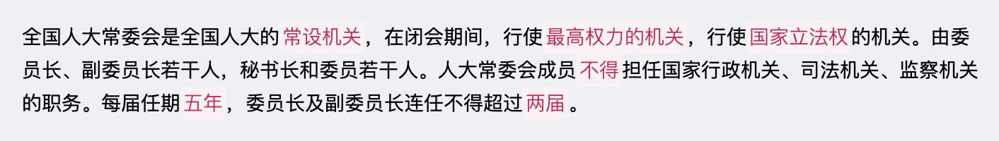
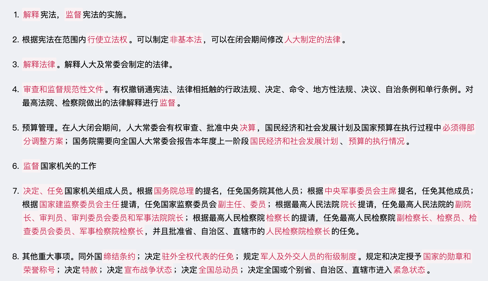
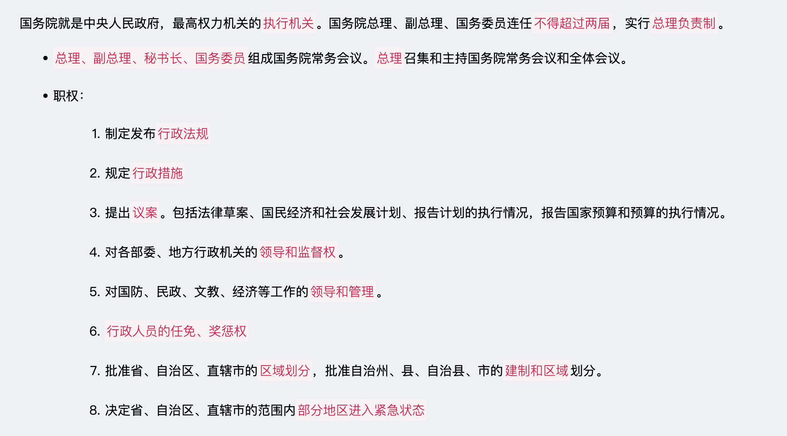
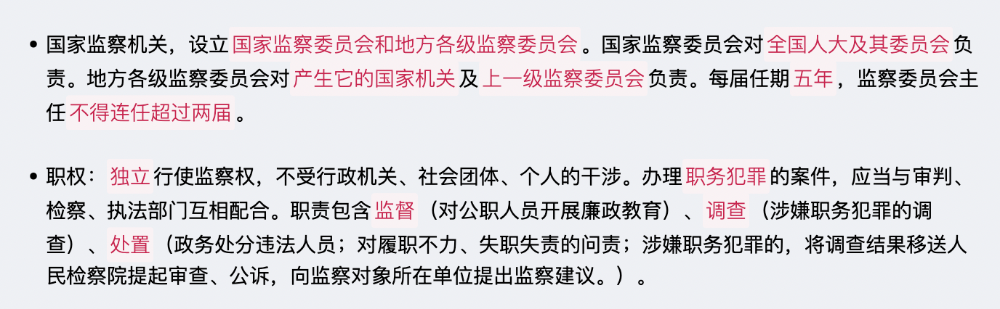

# 【法律】根本法
`2023/03/18 20:56:10  by: 程序员·小李`

#### 国家

马克思主义认为，国家是一种`历史现象`，不是从来就有的;国家是在原始社会瓦解、私有制出现、阶级形成以后产生的，是`阶级矛盾不可调和的产物和表现`。

🔥 国家的基本要素包括`人口、领土、政权和主权`，缺一不可。其中，最重要的要素是`主权`。

国家的性质，就是国家的阶级本质。它表明什么阶级是统治阶级，什么阶级是被统治阶级。`统治阶级的性质`决定着`国家的性质`。所有国家都是一定阶级对其他阶级的专政。专政就是统治阶级凭借国家权力，强制被统治阶级服从统治阶级的意志。民主实质是在统治阶级范围内，按照多数人的意志，实现国家职能。因此，民主具有鲜明的阶级性，是服务于统治阶级的。民主与专政相互依存，凡实行民主制度的国家，必然包括一定阶级的民主，同时包括对其他阶级的专政。

🔥 国体，反映`社会各阶级在国家中的地位`；政体，即国家政权的组织形式，也就是`国家管理形式`。国体`决定`政体，政体`体现`国体，一定的政体服务于一定的国体。

#### ☆ 概念与特征

宪法是规定国家的`根本制度及根本任务`，`保障公民基本权利`的根本法。

宪法具有`最高的`法律效力，制定和修改的程序也`更加严格`。

**无产阶级民主事实**是宪法产生的`前提条件`，宪法是无产阶级民主事实的`法律化`。

#### 宪法具有最高的法律效力

* 宪法是普通法律制定的`法律依据`，普通法律是宪法的具体化
* 任何法律`不得违背`宪法
* 宪法是一切国家机关、社会团体、公民的`最高行为准则`

#### 宪法是根本法

* 宪法规定了`最根本的问题`，规定了`根本制度`
* 宪法具有`最高的法律效力`
* 在制定和修改的`程序`上比一般法律`更加严格`

#### 分类

|分类标准 | 分类|
|:--:|:--:|
|是否具有统一法典| `成文法`、不成文法|
|有无严格的制定、修改程序 | `刚性宪法`、柔性宪法|
| 制定主体不同 | 钦定宪法（君主制定）、协定宪法（君主与国民商量）、`民定宪法`（公民制定）|
| 国家阶级本质不同 | 资本主义宪法、`社会主义宪法`|

#### 🔥 基本原则

* **人民主权**：一切权力属于人民
* **基本人权**：国家尊重保障人权
* **权力制约**：各权力机关彼此监督、相互制约，但不是三权分立
* **法治原则**：依法治国、法律面前人人平等

#### 法律渊源（表现形式）

* 宪法典
* 宪法性法律
* 宪法惯例
* 国际条约

#### 结构与内容

宪法包含`序言和正文`两部分；序言是对宪法精神的高度概括，正文包含：总纲、公民基本权利和义务、国家机构、国旗、国歌、国徽、首都。

> 在公共场合，故意`篡改国歌歌词、曲谱`，以`歪曲、贬损方式奏唱国歌`，或者以其他方式侮辱国歌的，由公安机关处以`警告或者十五日以下拘留`；构成犯罪的，依法追究刑事责任。

#### 宪法的历史

《中国人民政治协商会议共同纲领》是宪法性文件，不是宪法。

1954年，第一届人大一次会议通过了`第一部社会主义性质`的宪法。1975年、1978年、1982年均对其全面修改。

1982年，第五届全国人大第五次会议通过新中国`第四部`宪法，即现行法。1988年、1993年、1999年、2004年、2018年先后进行了五次修改，共52条修正案。

#### 1988年修正案

* `允许私营经济`，作为公有制经济的补充。保护私营经济的合法权利和利益，对其引导、监督、管理
* 任何组织、个人`不得侵占、买卖`或其他形式`非法转让`土地，土地使用权可以按规定转让。

#### 1993年修正案

* 我国正处于社会主义初级阶段；建设有中国特色社会主义；坚持改革开放；建设富强、民主、文明的社会主义国家，写入宪法。党的基本路线得到集中、完整表述
* 中国共产党领导的`多党合作和政治协商制度将长期存在和发展`
* `社会主义市场经济`作为基本经济制度
* `家庭联产承包责任制`作为农村集体经济的组织形式。
* 县级人大代表任期由三年`改到五年`

#### 1999年修正案

* 我国长期处于社会主义初级阶段；建设有中国特色的社会主义；邓小平理论；发展社会主义市场经济；写入序言
* 实行依法治国，建设社会主义法治国家
* 坚持公有制为主体、多种所有制经济共同发展；按劳分配为主体、多种分配方式并存
* 农村集体经济：以家庭联产承包责任制为基础，统分结合的双层经营体制
* 个体经济、私营经济合并为非公有制经济
* “镇压反革命活动”修改为“危害国家安全的犯罪活动”

#### 2004年修正案

* 增加`三个代表`重要思想
* 爱国统一战线增加`社会主义建设者`
* 国家征收、征用土地并`给予补偿`
* `鼓励、支持、引导`非公有制经济
* 保护`私有财产、继承权`
* 建立健全`社会保障`
* `尊重保障人权`
* 人大代表选举由省、自治区、直辖市、特别行政区、军队代表组成，各少数民族应有适当的名额
* 戒严改为`紧急状态`
* 国家主席增加`国事活动权力`
* 乡镇人大任期三年`改到五年`
* 国歌的规定

#### 2018年修正案

* 增加`科学发展观、习近平新时代社会主义思想`
* 新发展理念（创新、协调、绿色、开放、共享）
* 社会文明、生态文明协调发展，富强、民主、文明、和谐、`美丽`
* 经济建设、城乡建设、生态文明建设
* 健全社会主义`法制`修改为健全社会主义`法治`
* 国家工作人员就职进行`宪法宣誓`
* 革命建设过程中，修改为“革命、建设、`改革`过程中”
* 爱国统一战线增加“`致力于中华民族伟大复兴的爱国者`”
* 民族关系：平等团结互助`和谐`
* 外交：坚持`和平发展、互利共赢、推动人类命运共同体`
* `党的领导`是中国特色社会主义的最本质特征
* `社会主义核心价值观`
* 设区的市人大及其常委会可以制定地方性法规，报省或自治区人大常委会批准后实施
* 设民族委员会、宪法和法律委员会、财政经济委员会、教育科学文化卫生委员会、外事委员会、华侨会委员等，人大闭会期间受人大常委会领导
* 国家主席、副主席`连任不受限制`
* 增加`调整监察委员会`的规定

#### 国体——人民民主专政

**人民民主专政**：对人民民主，对敌对分子和犯罪分子实行专政，党和国家代表最广大人民的根本利益。

🔥 人民民主专政是我国的`国体`、`阶级本质`、`国家性质`

🔥 中国共产党领导的`多党合作与政治协商制度、爱国统一战线`是人民民主专政的主要特色。

> 中国共产党是社会主义事业的**领导核心**，是执政党，民主党派是参政党。共产党对其他党派是政治领导，即政治原则、政治方向、重大方针政策的领导。各民主党派政治自由、组织独立、法律地位平等。
>
> 🔥 多党合作的**基础**：`坚持中国共产党的领导`
>
> 🔥 多党合作的**基本方针**：`长期共存、互相监督、肝胆相照、荣誉与共`
>
> 人民政协是**爱国统一战线**的组织形式，包含社会主义劳动者、社会主义事业建设者（2004年写入宪法）、拥护社会主义的爱国者、拥护祖国统一和致力于中华民族伟大复兴的爱国者（2018年写入宪法）

#### 政体——人民代表大会制度

我国**政权组织形式**：人民代表大会制度

人民代表大会制度是我国的`政权组织形式、政体、根本政治制度`。

🔥 人民代表大会制度是`坚持党的领导、人民当家作主、依法治国的有机统一`的政治制度安排，保证党领导人民依法有效的治理国家。

🔥 人民根据`民主集中制`的原则，选举人大代表组成全国人民代表大会和地方各级人民代表大会，建立全部国家机构，`对人民负责，受人民监督，实现人民当家做主`。

>我国采用**单一制**的国家机构形式，
>* `只有一部宪法`；
>* `只有一套政府体制`；
>* 地方权力来自中央，国家权力重心在中央；
>* 只有一个国际法主体；
>* `公民具有统一的国籍`；
>* `地方作为行政单位，不具有独立性`

#### 经济

基本经济制度：`社会主义市场经济`。
* 所有制：公有制为主体，多种所有制经济共同发展；
* 分配制：按劳分配为主体，多种分配方式并存；

制度基础：`生产资料的社会主义公有制`，即全民所有和劳动者集体所有制。
* 全民所有制经济，就是国有经济（生产资料归国家）
* 劳动者集体所有制经济，就是集体经济（生产资料归劳动者集体）

>📣 扩展知识
>
> `旷藏、水流`一般归国有，森林、草原、山岭、荒地、滩涂等，归集体或国有。
>
> 城市土地归`国有`。
>
> 城市郊区、农村土地除特殊规定归`国有的`，均归`集体所有`。
>
> 自留地、自留山、宅基地归`集体`所有。

#### 选举原则

* **普遍性原则**：凡`满18周岁 + 中国国籍 + 有政治权利`，均享有选举权、被选举权。享有选举权的主体范围普遍。

* **平等原则**：一人一票

* **直接选举与间接选举相结合原则**：不设区的市、市辖区、县、自治县、乡、民族乡、镇`直接选举`；全国人大代表、省、自治区、直辖市、设区的市、自治州`间接选举`

* **秘密投票**（不记名投票）：对文盲、残疾、选举期间外出，委托他人投票的不视为违反秘密投票原则，每个人最多受委托`3人`的投票。

#### ☆ 选举程序

直接选举由`选举委员会`主持；间接选举由`人大常委会`主持，县级以上各级人大选举上一级人大代表时，由各级`人大主席团`主持。

按选取选举，每一选区1-3名代表。选民登记按选区进行，选民资格长期有效。

🔥 采用**差额选举法**，候选人应当多于应选名额。直接选举时应多出三分之一至一倍；间接选举应多出五分之一至二分之一。

🔥 直接选举需`全体选民过半数参加投票`，并且在参加投票人数中`获得过半数的票数`，才能当选；间接选举需获得`全体代表过半数的选票`，才能当选

#### 特别行政区自治

特别行政区`高度区域自治`，保持资本主义制度和生活方式50年不变，原有法律基本不变。

全国人民代表大会管理特别行政区：
* 有权决定特别行政区的`设立与基本制度`
* 制定、修改特别行政区`基本法`

全国人大常委管理特别行政区：
* 享有特别行政区基本法`解释权`
* 享有对特别行政区立法的`备案审查权`
* 可以决定特别行政区`进入紧急状态`

国务院管理特别行政区：
* 负责管理特别行政区有关外交事务
* 负责相关`防务`工作
* 任命`特别行政区行政长官`及主要行政官员

#### 特别行政区的高度自治

* 自主管理行政事务（防务、外交除外）
* 享有立法权（防务、外交、基本法除外）
* 独立审判权：独立审判不受干涉，终审权在特别行政区，不在最高人民法院
* 在中央政府授权下，自行处理有关对外事务，发展与各国的关系，签订履行协议等。

#### 民族区域自治

少数民族聚居的地方实行民族区域自治，包括自治区、自治州、自治县。

自治区、自治州、自治县人大常委应当有实行民族区域自治的公民担任`主任或副主任`，`自治区主席、自治州州长、自治县县长`由实行民族区域自治的公民担任。

* 自治地方的人大有权制定自治条例、单行条例（报请全国人大常委会批准）
* 根据实际情况贯彻国家法律和政策
* 自主管理财政、经济、科教文卫体事业
* 经国务院批准，可以组建公安部队维护治安
* 使用本民族语言文字
* 可以开展对外贸易

#### 基层群众自治制度——村民委员会、居民委员会

村民委员会由村民直接选举，
* 选举由选举委员会主持
* 户籍在本地，人也在本地；户籍在本地，人不在本地，但表示参加选举的；户籍不在本地，但居住满一年以上，经申请并批准后，均可作为选民
* 双过半：参加选举人数过半+获得过半数投票

村委会、居委会成员每届任期五年，可以连任

> 村民委员会成员中，应当有`妇女`成员，多民族村民居住的村应当有`人数较少的民族的`成员。

> 居民委员会根据居民居住状况，按照便于居民自治的原则，一般在`一百户至七百户`的范围内设立。

#### 公民的基本权利

**平等权**：公民平等享有权利，不受任何不合理的差别对待。
* 法律面前人人平等：享有权利、承担义务；不存在特权
* 禁止不合理的差别对待：身份、职业、出身等不可作为不平等对待的理由
* 允许合理差别：对特定人群的合理区别对待是允许的（例如人大代表在人大上的发言是免责的）

---

**政治权利和自由**：依法参加政治活动的权利、自由
* 选举与被选举权
* 言论、出版、集会、结社、游行、示威的自由

---

**监督权**：监督国家机关及其工作人员
* 批评建议：对工作中的问题提出批评的权利，提出相关建议的权利
* 控告检举权：对违法失职行为进行检举控告，请求处理
* 申诉权：因行政机关、司法机关、国家工作人员的错误、违法行为，导致利益受损的，可以提出申诉，要求重新处理。

---

**获得赔偿权**：公民合法权益因国家机关或其工作人员受到损害的，有权向国家提出赔偿

宗教信仰自由：公民信仰自由
* 不得强制他人信仰
* 不得歧视有信仰或无信仰的公民
* 不得利用宗教破坏社会秩序、损害公民身体健康、妨碍国家教育制度
* 不受外国势力的支配
* 自主、自办、自传

---

**人身自由**：身体不受侵犯、生命健康不受侵犯、人格尊严不受侵犯、住宅不受侵犯、通信自由、通信秘密。

---

**社会经济权利**：
* 财产权：合法财产不受侵犯；国家为了公共利益征收、征用私有财产的，应按规定给予补偿。
* 劳动权：从事劳动，获得报酬的权利。
* 休息权：劳动者有休息的权利
* 获得物质帮助的权利：在年老、疾病、丧失劳动能力时，有获取国家物质帮助的权利。

---

**文化教育权利**：受教育权、科学研究、文学创作、其他文化活动的权利

---

**特定人的权利**：
* 保障妇女权利：与男子平等享有权利、同工同酬
* 保障退休人员及军烈属的权利：退休有社会保障；保障残废军人的生活、抚恤烈士家属、优待军人家属
* 保护婚姻、家庭、母亲、儿童、老人。禁止破坏婚姻自由，禁止虐待老人、妇女、儿童
* 关怀未成年和儿童的成长：德智体美全面发展
* 保护华侨、归侨、侨眷的正当权利

#### 公民的基本义务

* 维护祖国统一、民族团结
* 遵守宪法和法律、公共秩序、社会公德
* 维护国家安全、荣誉和利益
* 保卫国家、抵抗侵略，按法律服兵役、参加民兵组织
* 依法纳税
* `劳动`
* `受教育`
* 计划生育
* 抚养未成年子女、成年子女赡养老人

> 国家秘密的密级分为`绝密、机密、秘密`三级。绝密级国家秘密是最重要的国家秘密，泄露会使国家安全和利益遭受`特别严重`的损害；机密级国家秘密是重要的国家秘密，泄露会使国家安全和利益遭受`严重的损害`；秘密级国家秘密是一般的国家秘密，泄露会使国家安全和利益`遭受损害`。

#### 国家机构的组织和活动原则

**根本组织原则**：采用`民主集中制`，少数服从多数。（民主基础上的集中，集中指导下的民主）

**社会主义法治原则**：国家机构`依法设立`；国家机关`权力来自于法律`；国家机关的工作必须符合法律要求；国家机关违反法律必将追究

**责任制原则**：各级人大及其常委会、监察委员会、人民法院、人民检察院实行`集体负责制`；国务院及其部委、地方各级人民政府、中央军委实行`个人负责制`。

**为人民服务原则**：依靠人民的支持，密切联系群众，听取意见和建议，`接受人民的监督，为人民服务`。

**精简效率原则**：`提高工作效率`，反对官僚主义。

#### 全国人民代表大会

全国人民代表大会：最高权力机关、最高立法机关。由省、自治区、直辖市、特别行政区、军队选出代表，每届任期`五年`。任期届满`两个月前`，必须完成下一届全国人大代表的选举。

全国人民代表大会`每年`举行一次，由`全国人大常委会`组织召集。如有五分之一以上的代表提议或全国人大常委会认为有必要，可以临时召集人大会议。大会选举`主席团`主持会议。

相关职权：
* **修改宪法、监督宪法实施**（全国人大常委会提议或全体代表五分之一以上的提议，全体代表三分之二以上多数通过）
* **制定和修改基本法律**（刑法、刑事诉讼法、民法、民事诉讼法、民族区域自治法、特别行政区基本法等）
* **选举、决定、罢免重要工作人员**。
* **决定国家重大问题**。有权审查、批准国民经济和社会发展计划及其执行情况报告；审查、批准国家预算及其执行报告；改变或撤销全国人大常委会关于预算、决算不适当的决议；批准省、自治区、直辖市的建置；决定特别行政区的设立及制度；决定战争与和平。
* **最高监督权**。全国人大常委会、国务院、最高人民法院、最高人民检察院对全国人大负责并汇报工作；中央军事委员会、国家监察委员会对全国人大负责。全国人大有权改变、撤销全国人大常委会不适当的决定。 

> 📣 扩展知识
> 
> 全国人大`有权选举`国家工作人员。选举全国人大常委会委员长、副委员长、秘书长、委员；选举国家主席、副主席；选举中央军事委员会主席；选举国家监察委员会主任；选举最高人民法院院长；选举最高人民检察院检察长；
>
> 全国人大`有权决定`相关提议，决定人选。根据国家主席的提名决定国务院总理；根据国务院总理提名决定国务院副总理、国务委员、各部长、各委员会主任、审计长、秘书长；根据中央军事委员会主席提名决定中央军事委员会副主席、委员；
>
> 全国人大`有权罢免`上述国家工作人员。全国人大主席团或三个以上代表团或十分之一以上代表提出，由主席团提请大会审议，经全体代表过半数通过，才能罢免。

> 设区的市的人民代表大会及其常务委员会根据本市的具体情况和实际需要，在不同宪法、法律、行政法规和本省、自治区的地方性法规相抵触的前提下，可以对`城乡建设与管理、生态文明建设、历史文化保护、基层治理`等方面的事项制定地方性法规，法律对设区的市制定地方性法规的事项另有规定的，从其规定。

#### ☆ 人大代表的权利

* 人大会议上，`言论免责`
* 县级以上人大代表，非经人大常委会或人大主席团批准，不得逮捕或刑事审判
* 出席人大会议，`审议各项议案、报告`，发表意见
* `提出议案权、质询权、罢免权`。一个代表团或30人以上人大代表可以联名提出议案；可以书面对国务院及其部委、国家监察委员会、最高人民法院、最高人民检察院提出质询案；三个以上代表团或者十分之一以上的人大代表联名，有权提出罢免。
* 对各方面工作`提出批评建议、意见`
* 参加各项`选举和表决`
* 信息、物质保障及其他权利

> 地方各级人民代表大会代表在任期内`调离或者迁出本行政区域`的，其代表资格`自行终止`，缺额另行补选。

#### 人大常务委员会

#### 国家主席

国家主席是国家元首，是`国家机构`之一。任职年龄不得低于`45周岁`，每届任期`五年`，无连任限制。

职权：
* 根据人大及其常委会决定，`公布`法律
* `任免`国务院总理、副总理、国务委员、各部长、各委员会主任、审计长、秘书长
* `授予`国家勋章、荣誉称号
* `发布`特赦（人大常委会决定特赦）
* `宣布`进入紧急状态
* `宣布`战争状态
* `发布`动员令
* 进行`国事访问、接受外国使节`
* 根据人大常委会的决定，`派遣或召回`驻外全权代表
* `批准或废除`缔结条约

#### Govern

#### 中央军事委员会

中央军事委员会领导全国武装力量，实行`主席负责制`，对`全国人大及其常委会`负责，每届任期`五年`。

#### 监察

监察机关的监察对象：
* 中国共产党机关、人民代表大会及其常务委员会机关、人民政府、监察委员会、人民法院、人民检察院、中国人民政治协商会议各级委员会机关、民主党派机关和工商业联合会机关的公务员，以及参照《中华人民共和国公务员法》管理的人员；
* 法律、法规授权或者受国家机关依法委托`管理公共事务的组织`中从事公务的人员；
* `国有企业`管理人员；
* 公办的教育、科研、文化、医疗卫生、体育等单位中`从事管理`的人员；
* `基层群众性自治组织`中从事管理的人员；
* 其他依法`履行公职`的人员。

#### 审判机关

审判机关：设最高人民法院、地方各级人民法院（高级人民法院、中级人民法院、基层人民法院）、专门人民法院；

上下级是`监督与被监督`的关系

#### 人民检察院

人民检察院是法律`监督机关`：
* 最高人民检察院、地方各级人民检察院、专门人民检察院
* 监督国家机关及其工作人员`是否违反刑法`
* 监督公安机关、人民法院、监狱的活动`是否合法`
* 人民法院的民事审判、行政审判活动的`事后监督`
* 人民检察院上下级之间是`领导与被领导`的关系

#### 其他

任何公民非经人民检察院决定或批准，或人民法院决定、公安机关执行，不受逮捕。

世界上首部成文宪法是美利坚合众国宪法。

我国第一个民族自治区——内蒙古自治区，1947年5月1日成立

国家权力来自公民的权利，这是民主和法治国家的重要理论基石。

居民委员会的设立、撤销、规模调整，由不设区的市、市辖区的人民政府决定。其经费来源、居委会成员生活补贴标准，由不设区的市、市辖区的人民政府或上级人民政府规定并划拨。居委会办公用房，由当地人民政府统筹解决。

公民是法律概念，人民是政治概念。公民包含人民，也包含被剥夺政治权利的人。

> `全国人大`具有批准省、自治区和直辖市`建置`的权限
>
> `国务院`有权批准省、自治区、直辖市的`区域划分`，批准自治州、县、自治县、市的`建置和区域划分`
>
> `省、直辖市`的人民政府有权决定乡、民族乡、镇的`建置和区域划分`。

> `设区的市`的`人民代表大会常务委员会`有权制定地方性法规，报本省、自治区人民代表大会常务委员会批准后施行。

八个参政党包括`中国国民党革命委员会、中国民主同盟、中国民主建国会、中国民主促进会、中国农工民主党、中国致公党、九三学社和台湾民主自治同盟`。

> 下列机构`应当悬挂国徽`：
> * 各级人民代表大会常务委员会；
> * 各级人民政府；
> * 中央军事委员会；
> * 各级监察委员会；
> * 各级人民法院和专门人民法院；
> * 各级人民检察院和专门人民检察院；
> * 外交部；
> * 国家驻外使馆、领馆和其他外交代表机构；
> * 中央人民政府驻香港特别行政区有关机构
> * 中央人民政府驻澳门特别行政区有关机构。

> 下列场所或者机构所在地，应当`每日升挂国旗`：
> * 北京天安门广场、新华门；
> * 全国人民代表大会常务委员会
> * 国务院
> * 中央军事委员会
> * 最高人民法院
> * 最高人民检察院； 
> * 中国人民政治协商会议全国委员会；
> * 外交部；
> * 出境入境的机场、港口、火车站和其他边境口岸
> * 边防海防哨所。

> 我国属于`立法机关`实施宪法保障的模式。

> 父母双方或一方为中国公民，本人出生在中国，具有中国国籍。
>
> 父母无国籍或国籍不明，定居在中国，本人出生在中国，具有中国国籍。
>
> 定居外国的中国公民，自愿加入或取得外国国籍的，即自动丧失中国国籍。
>
> 父母双方或一方为中国公民，本人出生在外国，具有中国国籍；但父母双方或一方为中国公民并定居在外国，本人出生时即具有外国国籍的，不具有中国国籍。