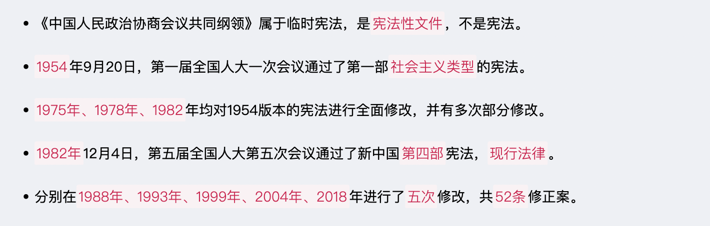
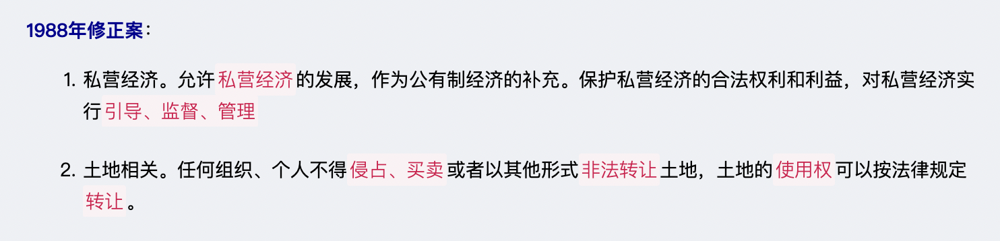
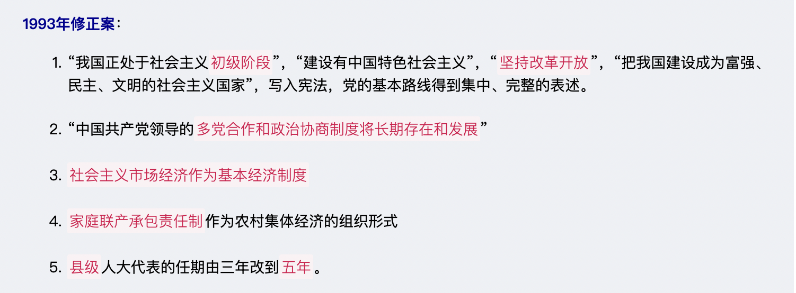
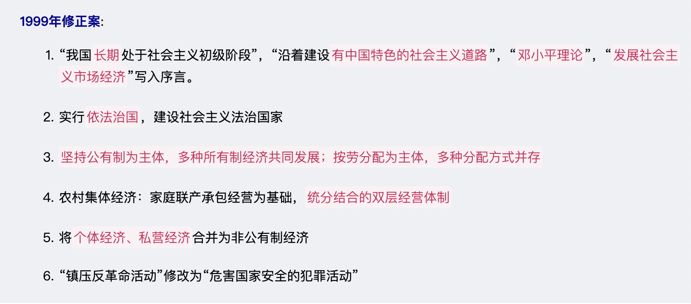

# 【法律】根本法
`2023/03/18 20:56:10  by: 程序员·小李`

#### ☆ 概念与特征

宪法是规定国家的`根本性质及根本任务`，`保障公民基本权利`的根本法。

宪法规定了一个国家`最根本`的问题，具有`最高的`法律效力，制定和修改的程序也`更加严格`。

无产阶级民主事实是社会主义宪法产生的`前提条件`，而社会主义宪法则是无产阶级民主事实的`法律化`。

#### 宪法具有最高的法律效力

* 宪法是普通法律制定的`法律依据`，普通法律上宪法的具体化
* 任何法律`不得违背`宪法
* 宪法是一切国家机关、社会团体、公民的`最高行为准则`

#### 宪法是根本法

* 宪法规定了`最根本的问题`，规定了`根本制度`
* 宪法具有`最高的法律效力`
* 在制定和修改的`程序`上比一般法律`更加严格`

#### 分类

|分类标准 | 分类|
|:--:|:--:|
|是否具有统一法典| `成文法`、不成文法|
|有无严格的制定、修改程序 | `刚性宪法`、柔性宪法|
| 制定主体不同 | 钦定宪法（君主制定）、协定宪法（君主与国民商量）、`民定宪法`（公民制定）|
| 国家阶级本质不同 | 资本主义宪法、`社会主义宪法`|

#### 🔥 基本原则

* `人民主权`：一切权力属于人民
* `基本人权`：国家尊重保障人权
* `权力制约`：各权力机关彼此监督、相互制约，但不是三权分立
* `法治原则`：依法治国、法律面前人人平等

#### 法律渊源（表现形式）

* 宪法典
* 宪法性法律
* 宪法惯例
* 国际条约

#### 结构与内容

宪法包含`序言和正文`两部分；序言是对宪法精神的高度概括，正文包含：总纲、公民基本权利和义务、国家机构、国旗、国歌、国徽、首都。

#### 历史

#### 国体

#### 政体

#### 经济

基本经济制度：`社会主义市场经济`。
* 所有制：公有制为主体，多种所有制经济共同发展；
* 分配制：按劳分配为主体，多种分配方式并存；

制度基础：`生产资料的社会主义公有制`，即全民所有和劳动者集体所有制。
* 全民所有制经济，就是国有经济（生产资料归国家）
* 劳动者集体所有制经济，就是集体经济（生产资料归劳动者集体）

> `旷藏、水流`一般归国有，森林、草原、山岭、荒地、滩涂等，归集体或国有。
>
> 城市土地归`国有`。
>
> 城市郊区、农村土地除特殊规定归`国有的`，均归`集体所有`。
>
> 自留地、自留山、宅基地归`集体`所有。

#### 选举原则

* **普遍性原则**：凡`满18周岁 + 中国国籍 + 有政治权利`，均享有选举权、被选举权。享有选举权的主体范围普遍。

* **平等原则**：一人一票

* **直接选举与间接选举相结合原则**：不设区的市、市辖区、县、自治县、乡、民族乡、镇`直接选举`；全国人大代表、省、自治区、直辖市、设区的市、自治州`间接选举`

* **秘密投票**（不记名投票）：对文盲、残疾、选举期间外出，委托他人投票的不视为违反秘密投票原则，每个人最多受委托`3人`的投票。

#### ☆ 选举程序

#### 自治区

#### 自治

#### 公民的基本权利

#### 公民的基本义务

* 维护祖国统一、民族团结
* 遵守宪法和法律、公共秩序、社会公德
* 维护国家安全、荣誉和利益
* 保卫国家、抵抗侵略，按法律服兵役、参加民兵组织
* 依法纳税
* `劳动`
* `受教育`
* 计划生育
* 抚养未成年子女、成年子女赡养老人

#### 机构的原则

#### 人大

#### ☆ 代表的权利

#### 常务

#### 国家主席

国家主席是国家元首，是`国家机构`之一。任职年龄不得低于`45周岁`，每届任期`五年`，无连任限制。

职权：
* 根据人大及其常委会决定，`公布`法律
* `任免`国务院总理、副总理、国务委员、各部长、各委员会主任、审计长、秘书长
* `授予`国家勋章、荣誉称号
* `发布`特赦（人大常委会决定特赦）
* `宣布`进入紧急状态
* `宣布`战争状态
* `发布`动员令
* 进行`国事访问、接受外国使节`
* 根据人大常委会的决定，`派遣或召回`驻外全权代表
* `批准或废除`缔结条约

#### Govern

#### 中央军事委员会

中央军事委员会领导全国武装力量，实行`主席负责制`，对`全国人大及其常委会`负责，每届任期`五年`。

#### 监察

监察机关的监察对象：
* 中国共产党机关、人民代表大会及其常务委员会机关、人民政府、监察委员会、人民法院、人民检察院、中国人民政治协商会议各级委员会机关、民主党派机关和工商业联合会机关的公务员，以及参照《中华人民共和国公务员法》管理的人员；
* 法律、法规授权或者受国家机关依法委托`管理公共事务的组织`中从事公务的人员；
* `国有企业`管理人员；
* 公办的教育、科研、文化、医疗卫生、体育等单位中`从事管理`的人员；
* `基层群众性自治组织`中从事管理的人员；
* 其他依法`履行公职`的人员。

#### 审判机关

审判机关：设最高人民法院、地方各级人民法院（高级人民法院、中级人民法院、基层人民法院）、专门人民法院；

上下级是`监督与被监督`的关系，不属于领导关系。

#### 检察

#### 其他

> `全国人大`具有批准省、自治区和直辖市`建置`的权限
>
> `国务院`有权批准省、自治区、直辖市的`区域划分`，批准自治州、县、自治县、市的`建置和区域划分`
>
> `省、直辖市`的人民政府有权决定乡、民族乡、镇的`建置和区域划分`。

> `设区的市`的`人民代表大会常务委员会`有权制定地方性法规，报本省、自治区人民代表大会常务委员会批准后施行。

八个参政党包括`中国国民党革命委员会、中国民主同盟、中国民主建国会、中国民主促进会、中国农工民主党、中国致公党、九三学社和台湾民主自治同盟`。

> 下列机构`应当悬挂国徽`：
> * 各级人民代表大会常务委员会；
> * 各级人民政府；
> * 中央军事委员会；
> * 各级监察委员会；
> * 各级人民法院和专门人民法院；
> * 各级人民检察院和专门人民检察院；
> * 外交部；
> * 国家驻外使馆、领馆和其他外交代表机构；
> * 中央人民政府驻香港特别行政区有关机构
> * 中央人民政府驻澳门特别行政区有关机构。

> 下列场所或者机构所在地，应当`每日升挂国旗`：
> * 北京天安门广场、新华门；
> * 全国人民代表大会常务委员会
> * 国务院
> * 中央军事委员会
> * 最高人民法院
> * 最高人民检察院； 
> * 中国人民政治协商会议全国委员会；
> * 外交部；
> * 出境入境的机场、港口、火车站和其他边境口岸
> * 边防海防哨所。

> 从宪法实施保障的机关来看，我国属于`立法机关`实施宪法保障的模式。