# 【法律】根本法
`2023/03/18 20:56:10  by: 程序员·小李`

#### ☆ 概念与特征

宪法是规定国家的`根本制度及根本任务`，`保障公民基本权利`的根本法。

宪法具有`最高的`法律效力，制定和修改的程序也`更加严格`。

**无产阶级民主事实**是社会主义宪法产生的`前提条件`，而社会主义宪法则是无产阶级民主事实的`法律化`。

#### 宪法具有最高的法律效力

* 宪法是普通法律制定的`法律依据`，普通法律上宪法的具体化
* 任何法律`不得违背`宪法
* 宪法是一切国家机关、社会团体、公民的`最高行为准则`

#### 宪法是根本法

* 宪法规定了`最根本的问题`，规定了`根本制度`
* 宪法具有`最高的法律效力`
* 在制定和修改的`程序`上比一般法律`更加严格`

#### 分类

|分类标准 | 分类|
|:--:|:--:|
|是否具有统一法典| `成文法`、不成文法|
|有无严格的制定、修改程序 | `刚性宪法`、柔性宪法|
| 制定主体不同 | 钦定宪法（君主制定）、协定宪法（君主与国民商量）、`民定宪法`（公民制定）|
| 国家阶级本质不同 | 资本主义宪法、`社会主义宪法`|

#### 🔥 基本原则

* `人民主权`：一切权力属于人民
* `基本人权`：国家尊重保障人权
* `权力制约`：各权力机关彼此监督、相互制约，但不是三权分立
* `法治原则`：依法治国、法律面前人人平等

#### 法律渊源（表现形式）

* 宪法典
* 宪法性法律
* 宪法惯例
* 国际条约

#### 结构与内容

宪法包含`序言和正文`两部分；序言是对宪法精神的高度概括，正文包含：总纲、公民基本权利和义务、国家机构、国旗、国歌、国徽、首都。

> 在公共场合，故意`篡改国歌歌词、曲谱`，以`歪曲、贬损方式奏唱国歌`，或者以其他方式侮辱国歌的，由公安机关处以`警告或者十五日以下拘留`；构成犯罪的，依法追究刑事责任。

#### 历史

《中国人民政治协商会议共同纲领》是宪法性文件，不是宪法。

1954年，第一届人大一次会议通过了`第一部社会主义性质`的宪法。1975年、1978年、1982年均对其全面修改。

1982年，第五届全国人大第五次会议通过新中国`第四部`宪法，即现行法。1988年、1993年、1999年、2004年、2018年先后进行了五次修改，共52条修正案。

#### 1988年修正案

* `允许私营经济`，作为公有制经济的补充。保护私营经济的合法权利和利益，对其引导、监督、管理
* 任何组织、个人`不得侵占、买卖`或其他形式`非法转让`土地，土地使用权可以按规定转让。

#### 1993年修正案

* 我国正处于社会主义初级阶段；建设有中国特色社会主义；坚持改革开放；建设富强、民主、文明的社会主义国家，写入宪法。党的基本路线得到集中、完整表述
* 中国共产党领导的`多党合作和政治协商制度将长期存在和发展`
* `社会主义市场经济`作为基本经济制度
* `家庭联产承包责任制`作为农村集体经济的组织形式。
* 县级人大代表任期由三年`改到五年`

#### 1999年修正案

* 我国长期处于社会主义初级阶段；建设有中国特色的社会主义；邓小平理论；发展社会主义市场经济；写入序言
* 实行依法治国，建设社会主义法治国家
* 坚持公有制为主体、多种所有制经济共同发展；按劳分配为主体、多种分配方式并存
* 农村集体经济：以家庭联产承包责任制为基础，统分结合的双层经营体制
* 个体经济、私营经济合并为非公有制经济
* “镇压反革命活动”修改为“危害国家安全的犯罪活动”

#### 2004年修正案

* 增加`三个代表`重要思想
* 爱国统一战线增加`社会主义建设者`
* 国家征收、征用土地并`给予补偿`
* `鼓励、支持、引导`非公有制经济
* 保护`私有财产、继承权`
* 建立健全`社会保障`
* `尊重保障人权`
* 人大代表选举由省、自治区、直辖市、特别行政区、军队代表组成，各少数民族应有适当的名额
* 戒严改为`紧急状态`
* 国家主席增加`国事活动权力`
* 乡镇人大任期三年`改到五年`
* 国歌的规定

#### 2018年修正案

* 增加`科学发展观、习近平新时代社会主义思想`
* 新发展理念（创新、协调、绿色、开放、共享）
* 社会文明、生态文明协调发展，富强、民主、文明、和谐、`美丽`
* 经济建设、城乡建设、生态文明建设
* 健全社会主义`法制`修改为健全社会主义`法治`
* 国家工作人员就职进行`宪法宣誓`
* 革命建设过程中，修改为“革命、建设、`改革`过程中”
* 爱国统一战线增加“`致力于中华民族伟大复兴的爱国者`”
* 民族关系：平等团结互助`和谐`
* 外交：坚持`和平发展、互利共赢、推动人类命运共同体`
* `党的领导`是中国特色社会主义的最本质特征
* `社会主义核心价值观`
* 设区的市人大及其常委会可以制定地方性法规，报省或自治区人大常委会批准后实施
* 设民族委员会、宪法和法律委员会、财政经济委员会、教育科学文化卫生委员会、外事委员会、华侨会委员等，人大闭会期间受人大常委会领导
* 国家主席、副主席`连任不受限制`
* 增加`调整监察委员会`的规定

#### 国体

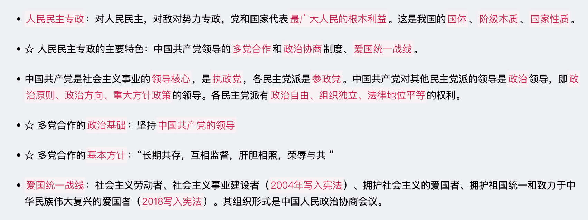

#### 政体

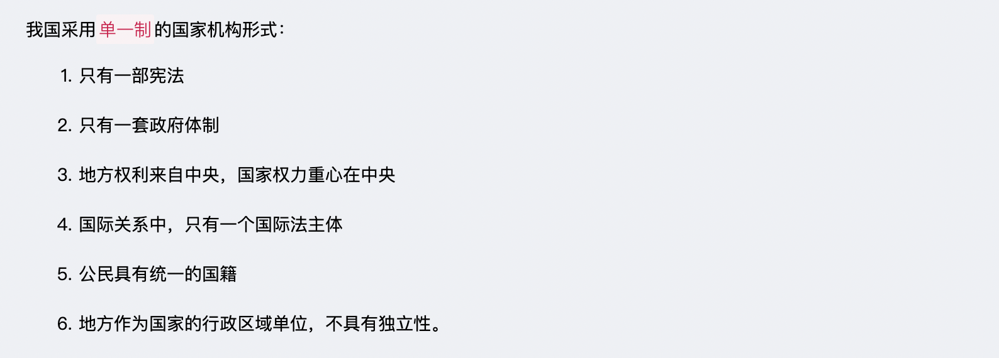

#### 经济

基本经济制度：`社会主义市场经济`。
* 所有制：公有制为主体，多种所有制经济共同发展；
* 分配制：按劳分配为主体，多种分配方式并存；

制度基础：`生产资料的社会主义公有制`，即全民所有和劳动者集体所有制。
* 全民所有制经济，就是国有经济（生产资料归国家）
* 劳动者集体所有制经济，就是集体经济（生产资料归劳动者集体）

> `旷藏、水流`一般归国有，森林、草原、山岭、荒地、滩涂等，归集体或国有。
>
> 城市土地归`国有`。
>
> 城市郊区、农村土地除特殊规定归`国有的`，均归`集体所有`。
>
> 自留地、自留山、宅基地归`集体`所有。

#### 选举原则

* **普遍性原则**：凡`满18周岁 + 中国国籍 + 有政治权利`，均享有选举权、被选举权。享有选举权的主体范围普遍。

* **平等原则**：一人一票

* **直接选举与间接选举相结合原则**：不设区的市、市辖区、县、自治县、乡、民族乡、镇`直接选举`；全国人大代表、省、自治区、直辖市、设区的市、自治州`间接选举`

* **秘密投票**（不记名投票）：对文盲、残疾、选举期间外出，委托他人投票的不视为违反秘密投票原则，每个人最多受委托`3人`的投票。

#### ☆ 选举程序

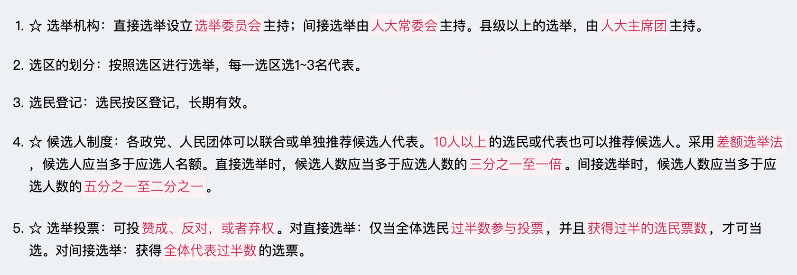

#### 特别行政区自治

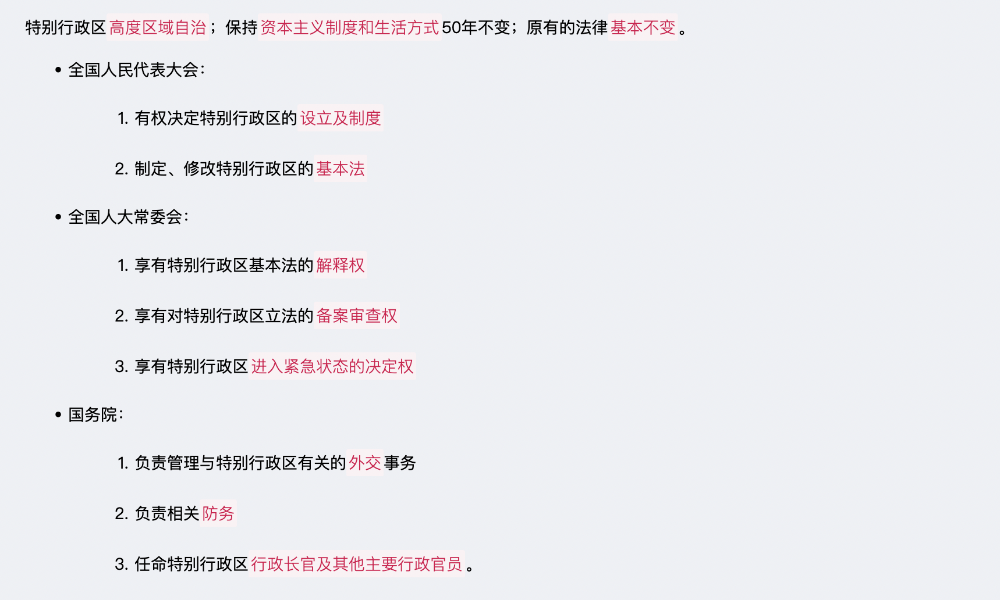

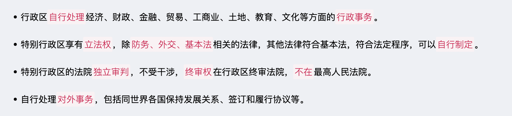

#### 民族区域自治

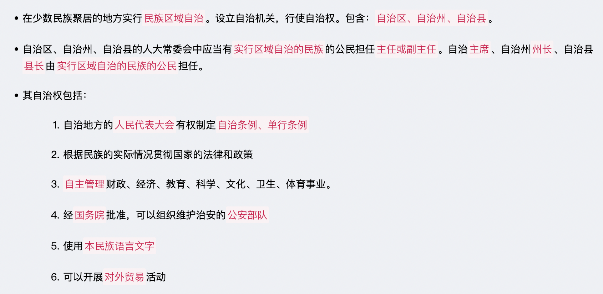

#### 基层群众自治制度

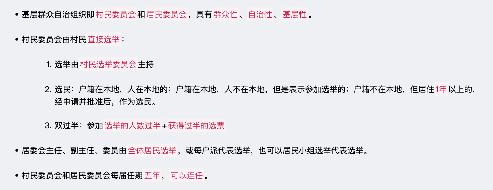

> 村民委员会成员中，应当有`妇女`成员，多民族村民居住的村应当有`人数较少的民族的`成员。

> 居民委员会根据居民居住状况，按照便于居民自治的原则，一般在`一百户至七百户`的范围内设立。

#### 公民的基本权利

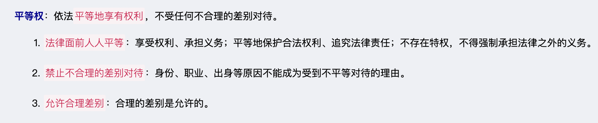

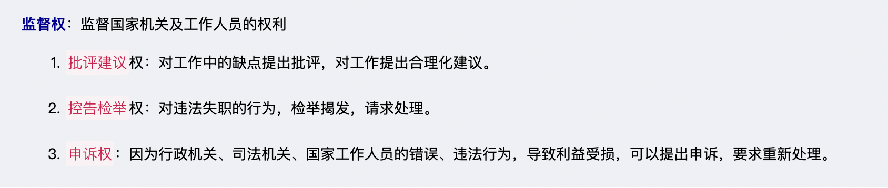

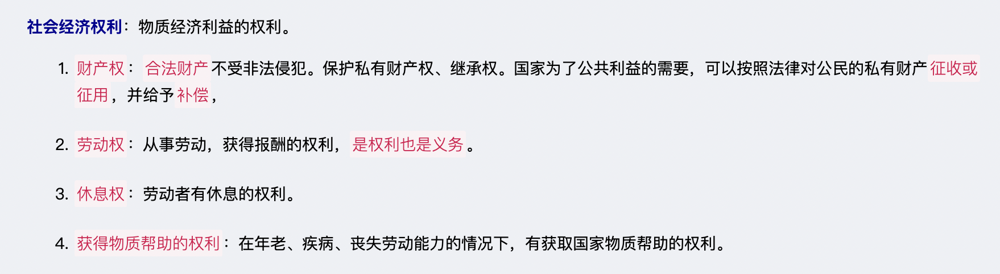

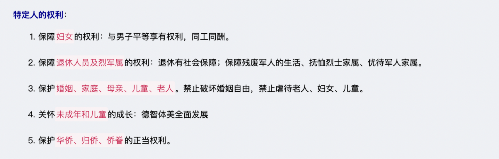

#### 公民的基本义务

* 维护祖国统一、民族团结
* 遵守宪法和法律、公共秩序、社会公德
* 维护国家安全、荣誉和利益
* 保卫国家、抵抗侵略，按法律服兵役、参加民兵组织
* 依法纳税
* `劳动`
* `受教育`
* 计划生育
* 抚养未成年子女、成年子女赡养老人

> 国家秘密的密级分为`绝密、机密、秘密`三级。绝密级国家秘密是最重要的国家秘密，泄露会使国家安全和利益遭受`特别严重`的损害；机密级国家秘密是重要的国家秘密，泄露会使国家安全和利益遭受`严重的损害`；秘密级国家秘密是一般的国家秘密，泄露会使国家安全和利益`遭受损害`。

#### 机构的原则

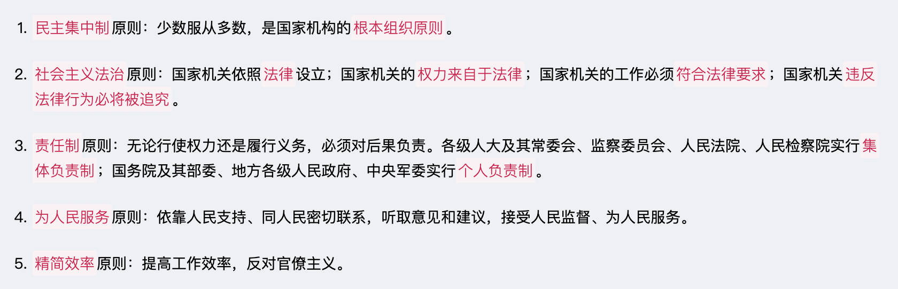

#### 人大

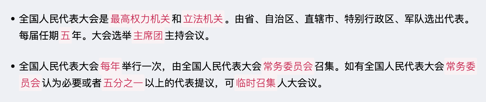

> 设区的市的人民代表大会及其常务委员会根据本市的具体情况和实际需要，在不同宪法、法律、行政法规和本省、自治区的地方性法规相抵触的前提下，可以对`城乡建设与管理、生态文明建设、历史文化保护、基层治理`等方面的事项制定地方性法规，法律对设区的市制定地方性法规的事项另有规定的，从其规定。

#### ☆ 人大代表的权利

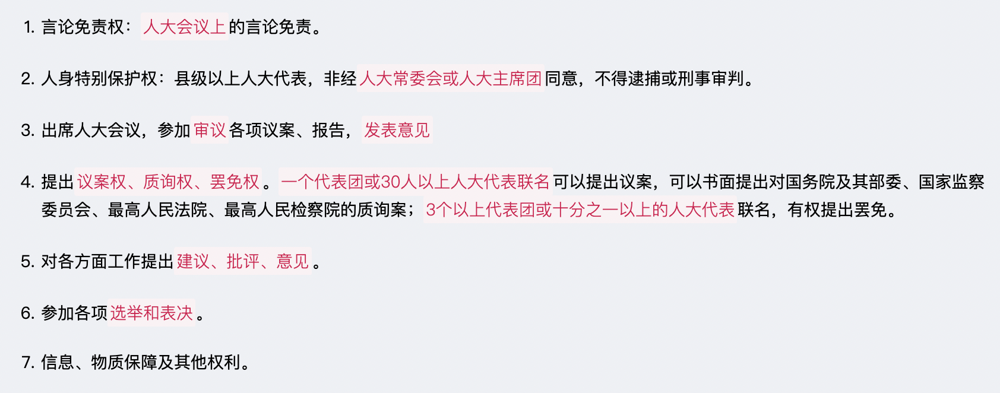

> 地方各级人民代表大会代表在任期内`调离或者迁出本行政区域`的，其代表资格`自行终止`，缺额另行补选。

#### 人大常务委员会

#### 国家主席

国家主席是国家元首，是`国家机构`之一。任职年龄不得低于`45周岁`，每届任期`五年`，无连任限制。

职权：
* 根据人大及其常委会决定，`公布`法律
* `任免`国务院总理、副总理、国务委员、各部长、各委员会主任、审计长、秘书长
* `授予`国家勋章、荣誉称号
* `发布`特赦（人大常委会决定特赦）
* `宣布`进入紧急状态
* `宣布`战争状态
* `发布`动员令
* 进行`国事访问、接受外国使节`
* 根据人大常委会的决定，`派遣或召回`驻外全权代表
* `批准或废除`缔结条约

#### Govern

#### 中央军事委员会

中央军事委员会领导全国武装力量，实行`主席负责制`，对`全国人大及其常委会`负责，每届任期`五年`。

#### 监察

监察机关的监察对象：
* 中国共产党机关、人民代表大会及其常务委员会机关、人民政府、监察委员会、人民法院、人民检察院、中国人民政治协商会议各级委员会机关、民主党派机关和工商业联合会机关的公务员，以及参照《中华人民共和国公务员法》管理的人员；
* 法律、法规授权或者受国家机关依法委托`管理公共事务的组织`中从事公务的人员；
* `国有企业`管理人员；
* 公办的教育、科研、文化、医疗卫生、体育等单位中`从事管理`的人员；
* `基层群众性自治组织`中从事管理的人员；
* 其他依法`履行公职`的人员。

#### 审判机关

审判机关：设最高人民法院、地方各级人民法院（高级人民法院、中级人民法院、基层人民法院）、专门人民法院；

上下级是`监督与被监督`的关系

#### 人民检察院

人民检察院是法律`监督机关`：
* 最高人民检察院、地方各级人民检察院、专门人民检察院
* 监督国家机关及其工作人员`是否违反刑法`
* 监督公安机关、人民法院、监狱的活动`是否合法`
* 人民法院的民事审判、行政审判活动的`事后监督`
* 人民检察院上下级之间是`领导与被领导`的关系

#### 其他

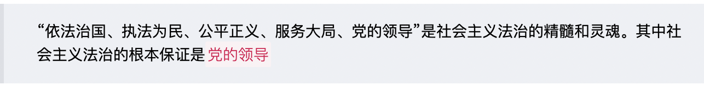

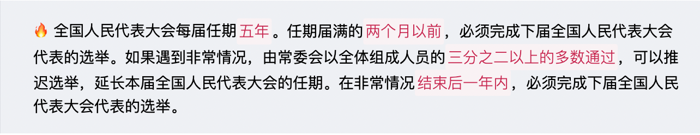

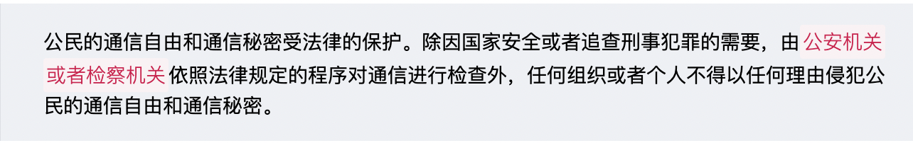

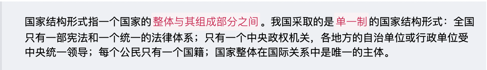

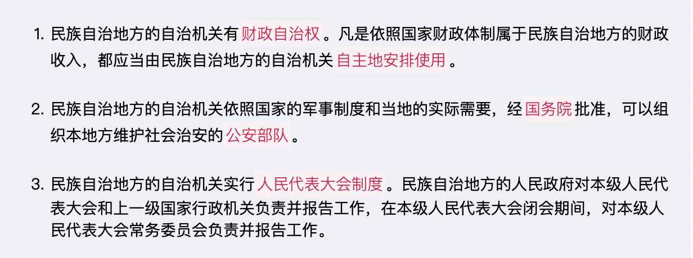

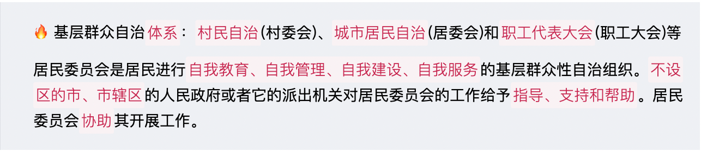

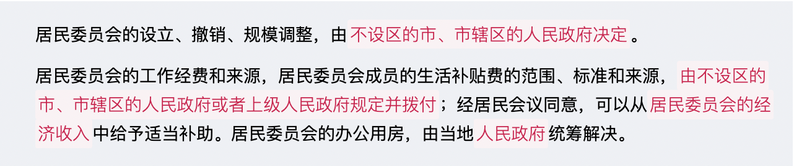

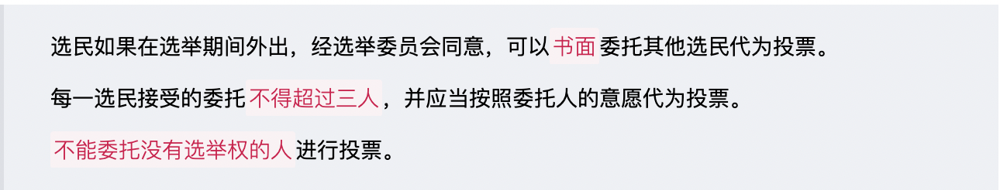

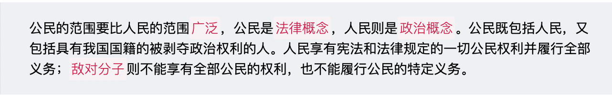

> `全国人大`具有批准省、自治区和直辖市`建置`的权限
>
> `国务院`有权批准省、自治区、直辖市的`区域划分`，批准自治州、县、自治县、市的`建置和区域划分`
>
> `省、直辖市`的人民政府有权决定乡、民族乡、镇的`建置和区域划分`。

> `设区的市`的`人民代表大会常务委员会`有权制定地方性法规，报本省、自治区人民代表大会常务委员会批准后施行。

八个参政党包括`中国国民党革命委员会、中国民主同盟、中国民主建国会、中国民主促进会、中国农工民主党、中国致公党、九三学社和台湾民主自治同盟`。

> 下列机构`应当悬挂国徽`：
> * 各级人民代表大会常务委员会；
> * 各级人民政府；
> * 中央军事委员会；
> * 各级监察委员会；
> * 各级人民法院和专门人民法院；
> * 各级人民检察院和专门人民检察院；
> * 外交部；
> * 国家驻外使馆、领馆和其他外交代表机构；
> * 中央人民政府驻香港特别行政区有关机构
> * 中央人民政府驻澳门特别行政区有关机构。

> 下列场所或者机构所在地，应当`每日升挂国旗`：
> * 北京天安门广场、新华门；
> * 全国人民代表大会常务委员会
> * 国务院
> * 中央军事委员会
> * 最高人民法院
> * 最高人民检察院； 
> * 中国人民政治协商会议全国委员会；
> * 外交部；
> * 出境入境的机场、港口、火车站和其他边境口岸
> * 边防海防哨所。

> 我国属于`立法机关`实施宪法保障的模式。

> 父母双方或一方为中国公民，本人出生在中国，具有中国国籍。
>
> 父母无国籍或国籍不明，定居在中国，本人出生在中国，具有中国国籍。
>
> 定居外国的中国公民，自愿加入或取得外国国籍的，即自动丧失中国国籍。
>
> 父母双方或一方为中国公民，本人出生在外国，具有中国国籍；但父母双方或一方为中国公民并定居在外国，本人出生时即具有外国国籍的，不具有中国国籍。