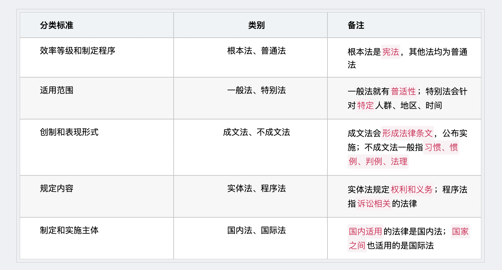
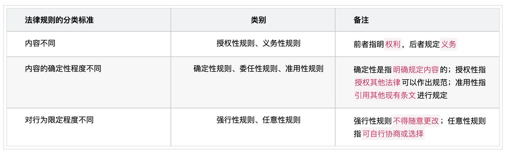
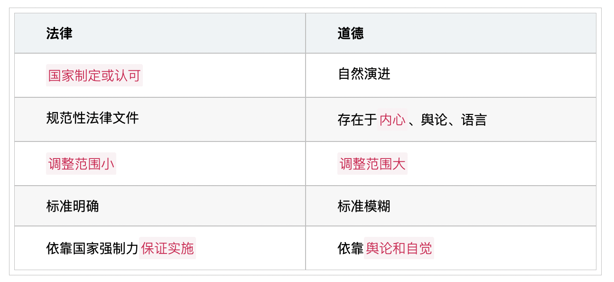
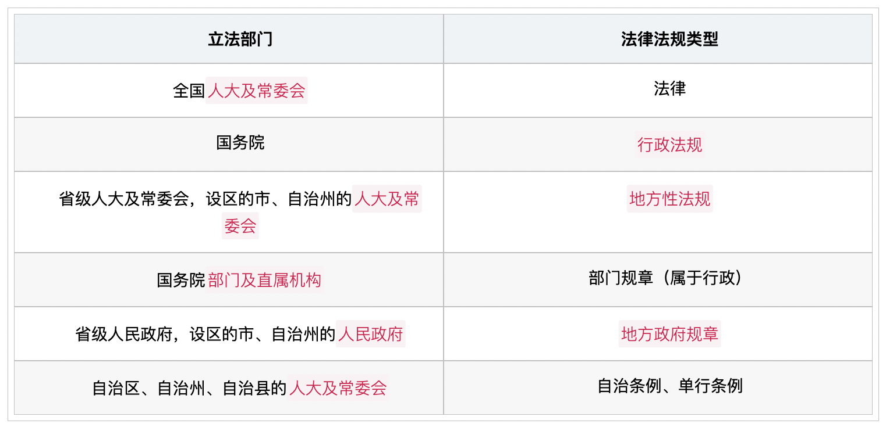
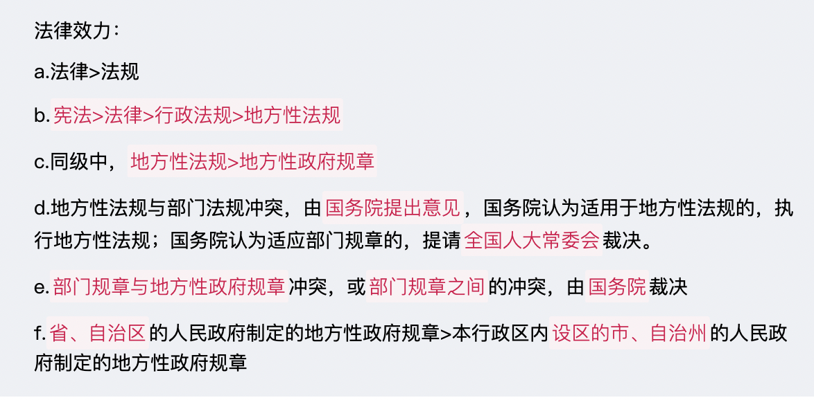

# 【法律】法理
`2023/03/16 23:51:20  by: 程序员·小李`

#### 法的概念与本质

法律是由国家`制定或认可`，由`国家强制力`保证实施，反映特定的物质生活条件决定的`统治阶级意志`，以`权利义务`为基础的行为规范体系。

> 📚 概念解析：
> 1. 国家强制力`不是`法实施的`唯一`保障，而是最后的保障。
> 2. 我国的统治阶级是`人民`。
> 3. 法的主要内容是`权利和义务`。
> 4. 法是`行为规范`，不调整人的`思想`。

#### 🔥 法的特征

* **规范性**：法律规定的是一种行为标准，是一种约束和规范，可以反复适用。
* **国家意志性**：法律体现的是国家意志，具有权威性
* **普遍性**：国土范围内，人人适用，有普遍适用性
* **强制性**：由国家强制力保证法律的实施，解决暴力抗法的现象
* **程序性**：法律的制定、修改、适用、监督等等都有一定的流程规范
* **可诉性**：可以作为起诉、辩护的依据；可以作为法律适用的依据

#### 🔥 法的作用

法律一方面用于`阶级统治`，另一方面用于`执行社会公务`。

* 教育作用：看到`他人`因为违法行为受到法律制裁，内心受到`教育和警示`。
* 指引作用：研读法律后，明确了哪些是违法行为，用于指导自己的行为
* 强制作用：对`违法行为`通过强制力保证制裁的实施
* 预测作用：依据法律对可能产生的后果和处罚有一定的预估
* 评价作用：使用法律作为标准或尺度评价他人的行为

#### 法的分类（主要是分类标准和类别的关系）

#### 法的要素

> 法律`规则`：具体、明确的法律规范  
> 法律`原则`：一般性的指导原则，如法律面前一律平等。

#### 法律规则的分类

#### 🔥 法律关系要素

* **法律主体**：自然人、机构与组织（国家机关、企事业组织、中外合资企业、中国合作经营企业和外资企业、政党和社会团体）、国家
* **法律客体**：人身、物、智力成果、行为结果
* **法律内容**：权利和义务

#### 🔥 法律关系形成条件

法律关系形成、变更、消灭需要两个条件：法律规范、法律事实。法律事实是基础，包括：
* **法律事件**：不以人的意志为准一的生老病死、战争、自然灾害等
* **法律行为**：当事人的行为，如合同签订、登记结婚

#### 法的效力范围

> 法律效力范围包含： 
> 1. 对`人`的效力：对谁适用
> 2. `空间`效力：本国领土、领水及底土、领空，以及本国驻外使领馆、在外船舶及航空器  
> 3. 🔥 `时间`效力：现代法治一般`不溯及既往`，对当事人有利除外，原则是`“从旧从轻”`。

#### 法与社会

* 法与经济：经济是`基础`，经济决定法
* 法与政治：政治`主导`法
* 法与道德：道德`促进`法律的实施，法律对道德有`促进、保障`作用。

#### 法与道德的异同

#### 法与执政的关系

党对法律制定和实施具有`指导`作用，党的政策是立法的指导思想，法律对党的政策具有`约束`作用。

社会主义立法原则：`宪法原则、法治原则、民主原则、科学原则`

#### 立法

#### 法律效力的优先级

#### 法的渊源

> 法的渊源指法的来源、依据：
> 
> `正式渊源`：明文规定的法律材料，如宪法、法律、法规、规章、自治条例、单行条例、国际条约、国际惯例。
>
> `非正式渊源`：法律人做出法律决定的大前提和准则，如习惯、判例、政策等。

#### 法的体系

按照调整的社会关系的不同，分为7个法律部门：`宪法及其相关法、刑法、经济法、行政法、民商法、诉讼与非诉讼程序法、社会法`。

#### 法的实施——法的执行

法的执行就是`国家机关及其工作人员`行使管理权，实施法律的行为。
* 执法活动具有**国家权威、强制性**：执法活动需要严格执行，受强制力保证实施。
* 执法**主体特定性**：只能是国家机关及其工作人员执法
* 执法**内容的广泛性**：执法内容就是相关的权利和义务，涉及范围很大
* 执法具有**单方性和主动性**：不以客体意志为转移，国家机关主动实施。

#### 法的实施——法的适用

法的适用就是`人民法院、人民检察院`应用法律处理案件。`法律面前人人平等`是司法的基本原则。
* 具有法律**权威性和国家强制性
* ** 符合**程序性、合法性**
* 必须有表明适用结果的**法律文书**

#### 法的实施——法的遵守

法的遵守就是法律关系的客体`行使权力、履行义务`的行为
* 所有人均应该守法
* 遵守宪法、法律、行政法规、地方性法规、行政规章等
* 守法的内容：行使权力、履行义务

#### 法的实施——法的监督

法的监督指的是受国家机关、政党、各社会组织、公民的合法监督
* **国家机关监督**：权力机关、司法机关、行政机关、监察机关
* **社会监督**：各政党、人民政协、人民团体、社会组织、舆论媒体、公民

#### 法律解释

法律解释：不同人或机构对法律的理解和说明
* **正式解释**：立法解释（全国人大常委的解释）、司法解释（最高人民法院、最高人民检察院的解释）、行政解释（国务院及其部门的解释）
* **非正式解释**：学理解释（专家、学者、其他组织对法律的学术性解释）、任意解释（当事人、公民对法律的理解）

#### 法律责任

> 法律责任包括`违法行为、违约行为、法律规定的某种不利后果`。包括：`行政责任`（行政违规）、`民事责任`（民法）、`刑事责任`（刑法）、`违宪责任`（宪法）。

#### 其它

> 法律的强制性：对合法性行为的`肯定和保护`，对违法犯罪行为的`否定和制裁`

> 法国启蒙思想家`孟德斯鸠`更进一步发展了分权理论，提出著名的`“三权分立”`理论。

> 法治的基本精神包括`良法之治、法律至上、权利本位、人权保障`等。社会主义民主法治精神的基本内容可概括为`依法治国、执法为民、公平正义、服务大局、党的领导`五个方面。其中，**依法治国**是社会主义法治的`核心内容`，**执法为民**是社会主义法治的`本质要求`，**公平正义**是社会主义法治的`价值追求`，**服务大局**是社会主义法治的`重要使命`，**党的领导**是社会主义法治的`根本保证`。

> **有法可依**是社会主义法制的`前提和基础`；**有法必依**是社会主义法制的`中心环节`；**执法必严**是社会主义法制的`关键`；**违法必究**是社会主义法制的`保障`。

>  违反道德的行为`不一定`违反法律；而违反法律也`不一定`违反道德.