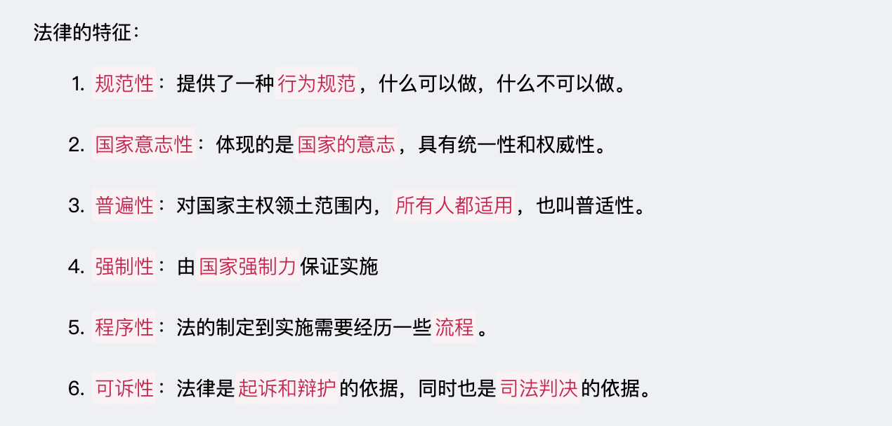
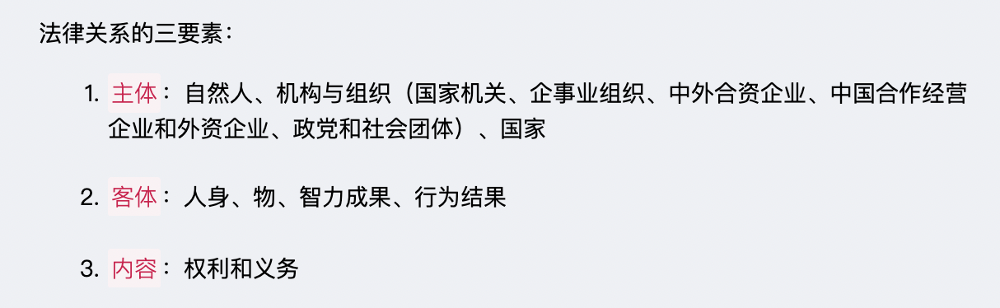
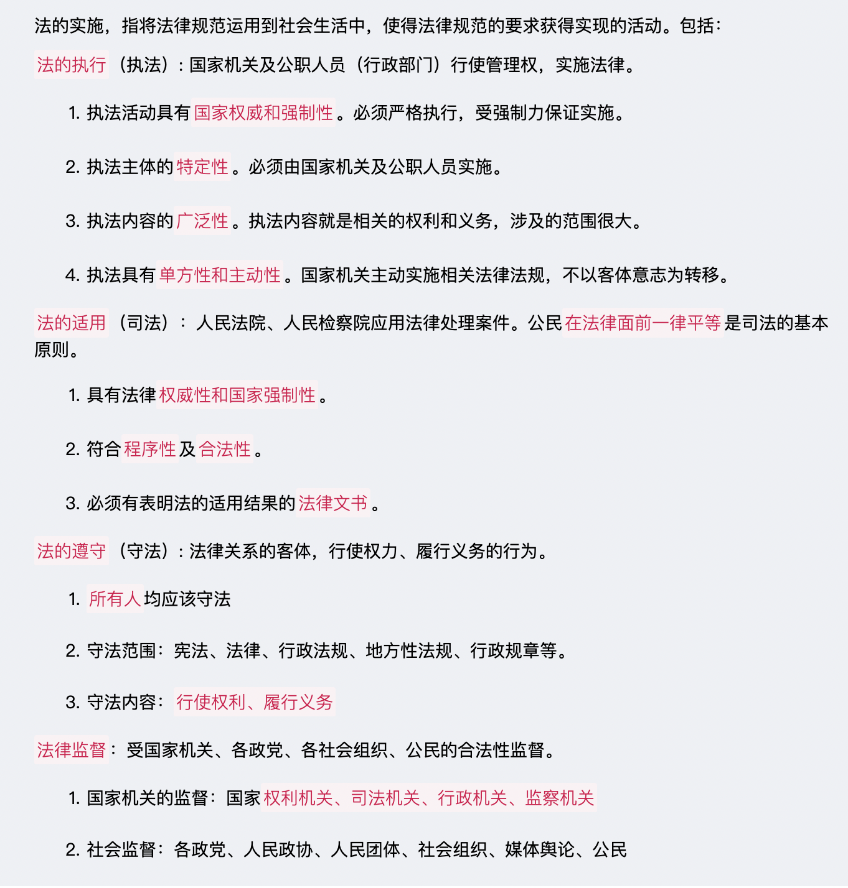
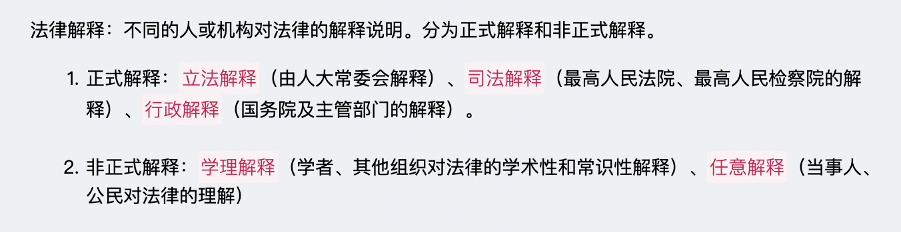

# 【法律】法理
`2023/03/16 23:51:20  by: 程序员·小李`

#### 法的概念与本质

> 📚 概念解析：
> 1. 国家强制力`不是`法实施的`唯一`保障，而是最后的保障。
> 2. 我国的统治阶级是`人民`。
> 3. 法的主要内容是`权利和义务`。
> 4. 法是`行为规范`，不调整人的`思想`。

#### 🔥 法的特征

#### 🔥 法的作用

#### 法的分类（主要是分类标准和类别的关系）

#### 法的要素

> 法律`规则`：具体、明确的法律规范  
> 法律`原则`：一般性的指导原则，如法律面前一律平等。

#### 法律规则的分类

#### 法律关系

#### 法的效力范围

> 法律效力范围包含： 
> 1. 对`人`的效力：对谁适用
> 2. `空间`效力：本国领土、领水及底土、领空，以及本国驻外使领馆、在外船舶及航空器  
> 3. `时间`效力：现代法治一般`不溯及既往`，对当事人有利除外，原则是`“从旧从轻”`。

>  违反道德的行为`不一定`违反法律；而违反法律也`不一定`违反道德.

#### 法与社会

#### 法与道德的异同

#### 法与执政的关系

#### 立法

#### 法律效力的优先级

#### 法的渊源

> 法的渊源指法的来源、依据：
> 
> `正式渊源`：明文规定的法律材料，如宪法、法律、法规、规章、自治条例、单行条例、国际条约、国际惯例。
>
> `非正式渊源`：法律人做出法律决定的大前提和准则，如习惯、判例、政策等。

#### 法的体系

#### 法的实施

#### 法律解释

#### 法律责任

> 法律责任包括违法行为、违约行为、法律规定的某种不利后果。分为：`行政责任`（行政违规）、`民事责任`（民法）、`刑事责任`（刑法）、`违宪责任`（宪法）。

#### 其它

> 法律的强制性：对合法性行为的`肯定和保护`，对违法犯罪行为的`否定和制裁`

> 法国启蒙思想家`孟德斯鸠`更进一步发展了分权理论，提出著名的`“三权分立”`理论。

> 法治的基本精神包括`良法之治、法律至上、权利本位、人权保障`等。社会主义民主法治精神的基本内容可概括为`依法治国、执法为民、公平正义、服务大局、党的领导`五个方面。其中，依法治国是社会主义法治的`核心内容`，执法为民是社会主义法治的`本质要求`，公平正义是社会主义法治的`价值追求`，服务大局是社会主义法治的`重要使命`，党的领导是社会主义法治的`根本保证`。

> 有法可依是社会主义法制的`前提和基础`；有法必依是社会主义法制的`中心环节`；执法必严是社会主义法制的`关键`；违法必究是社会主义法制的`保障`。