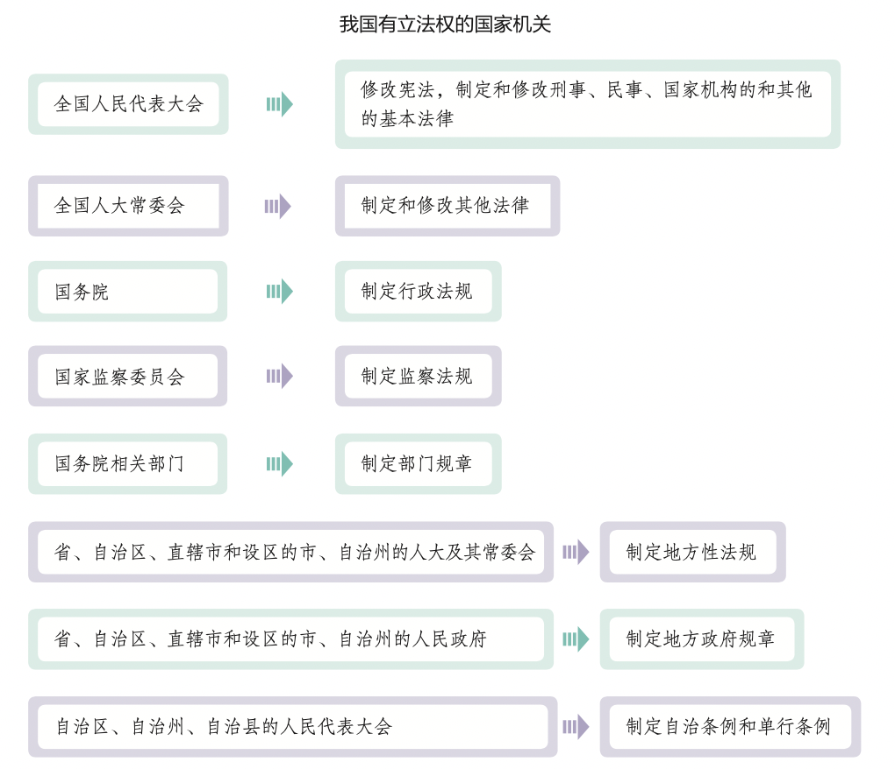
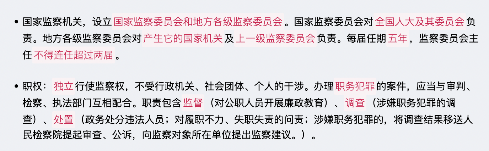

#【法律】法理
`2024/09/07 22:29:00  by: 程序员·小李`

#### 法律

法是由国家制定或认可，由国家强制力保证实施的，反映特定物质条件决定的统治阶级意志，以权利和义务为基础，以确认保护和发展统治阶级所期望的社会关系和社会秩序为目的的行为规范体系。

#### 法的特征

规范性：法律是一种行为规范，告知哪些可以做，哪些不能做。

国家意志性：法律体现的是国家意志，由国家制定或认可。

普遍性：也称普适性，在国家范围内普遍适用。

强制性：由国家强制力保证法律的实施。

程序性：法律的制定、执行、适用、监督都遵循一定的流程

可诉性：作为法院审判的依据，也作为起诉、辩解的根据。

#### 法律的作用

指引作用：法律对个人的言行起到威慑作用，指导个体的行为

评价作用：借助法律评价他人行为是否合法。

预测作用：凭借法律，预测行为后果。

强制作用：强制力对违法行为惩处。

教育作用：他人的违法犯罪行为得到严惩，自己引以为鉴，起到教育作用。

#### 全面依法治国

> **依法治国总目标**
>
>`建设中国特色社会主义法治体系、建设社会主义法治国家`。在中国共产党领导下，坚持中国特色社会主义制度，贯彻习近平法治思想，形成`完备的法律规范体系、高效的法治实施体系、严密的法治监督体系、有力的法治保障体系，形成完善的党内法规体系`，坚持`依法治国、依法执政、依法行政`共同推进，坚持`法治国家、法治政府、法治社会`一体建设，实现`科学立法、严格执法、公正司法、全民守法`，促进国家治理体系和治理能力现代化。

> **依法治国原则**
>
>1. 坚持中国共产党的领导。党的领导是中国特色社会主义最本质的特征，是社会主义法治`最根本的保证`。
>
>2. 坚持人民主体地位。人民是依法治国的主体和力量源泉，人民代表大会制度是保证人民当家作主的根本政治制度。必须坚持法治建设`为了人民、依靠人民、造福人民、保护人民`，以保障人民根本权益为出发点和落脚点，保证人民依法享有广泛的权利和自由、承担应尽的义务，维护社会公平正义，促进共同富裕。
>
>3. 坚持法律面前人人平等。任何组织和个人都必须在宪法法律范围内活动，都必须依照宪法法律行使权力或权利、履行职责或义务。
>
>4. 坚持依法治国和以德治国相结合。国家和社会治理需要法律和道德共同发挥作用。必须坚持一手抓法治、一手抓德治，大力弘扬社会主义核心价值观，弘扬中华传统美德，培育`社会公德、职业道德、家庭美德、个人品德`，既重视发挥法律的规范作用，又重视发挥道德的教化作用，以法治体现道德理念、强化法律对道德建设的促进作用，以道德滋养法治精神、强化道德对法治文化的支撑作用，实现法律和道德相辅相成、法治和德治相得益彰。
>
>5. 坚持从中国实际出发。必须从我国基本国情出发，总结和运用党领导人民实行法治的成功经验，围绕社会主义法治建设重大理论和实践问题，推进法治理论创新，发展符合中国实际、具有中国特色、体现社会发展规律的社会主义法治理论，为依法治国提供理论指导。

#### 法治国家

法治国家就是`依法治国、依宪治国、依法执政、依宪执政`的国家。

>**坚持宪法法律至上**。宪法法律是社会治理的最高准则。
>
>**坚持良法之治**。只有良法才能最大限度地得到民众的认同，才能最大程度地发挥法律的效力。一方面，良法应`内容合理`，在制定过程中应广泛听取各方意见，符合社会和人民的需要，符合社会公平正义的理念;另一方面，良法应`体系完备、规范系统、类别齐全、协调统一`，能够涵盖社会生活的各个方面。
>
>**尊重和保障公民权利**。公民依法享有广泛的权利，保护公民的各项权利是法治的主要功能。
>
>**规范国家权力的运行**。国家的各项权力都必须在法律之下运行。为了规范权力的运行，就需要通过完善的法律制度，加强对权力运行的制约和监督，把权力关进制度的笼子里，构建不敢腐、不能腐、不想腐的体制机制。

建设法治国家，既需要有完备的法律体系，更需要法律的严格实施。

>1. 推进宪法实施。依法治国首先要坚持`依宪治国`，依法执政首先要坚持`依宪执政`。加强宪法实施和监督，落实宪法解释程序机制，推进合宪性审查工作，加强备案审查制度和能力建设，依法撤销和纠正违宪违法的规范性文件。
>
>2. 建立完备的法律体系。完备的法律体系是法治国家的`制度前提`。在宪法之下，要不断建立和完善各项法律制度，形成一个部门齐全、层次分明、结构协调、体例科学的社会主义法律体系，实现国家治理有法可依。
>
>3. 完善法律实施机制。政府部门依法履行法定职责，为社会提供优良的公共服务;社会公众自觉遵守法律，依法行使权利、履行义务;司法机关严格公正司法，以事实为根据，以法律为准绳，定分止争，惩罚犯罪，化解矛盾，努力让人民群众感受到公平正义。建设法治国家具有重大意义。通过建设法治国家，能够有效规范权力运行，保障公民合法权益;能够推动实现国家治理现代化，实现长治久安。

#### 法治政府

法治政府就是职能科学、权责法定、执法严明、公开公正、智能高效、廉洁诚信、人民满意的政府。法治政府建设是全面依法治国的`重点任务和主体工程`。

>职能科学的政府。政府部门之间、上下级政府之间关系的配置必须科学合理。宏观调控、市场监管、社会管理、公共服务、环境保护等都是法治政府必须承担的基本职能。
>
>权责法定的政府。如果政府权力没有严格的法律界定，就会出现权力行使的错位、缺位和越位等现象。因此，需要完善行政组织和行政程序法律制度，推进机构、职能、权限、程序、责任法定化。
>
>执法严明的政府。执法严明重在`有法必依、执法必严、违法必究`，要求行政机关依照法定程序和方式从事执法活动。只有执法严明，才能保证政府有效履行职能，服务社会公众，确保宪法和法律的实施。
>
>公开公正的政府。全面推进政务公开，让权力在阳光下运行。公正执法要求将`公平正义`作为政务诚信的基本准则，将其贯彻于行政管理和公共服务的各个领域。通过公开公正执法，能够增强政府公信力和执行力，有效保障人民群众的`知情权、参与权、表达权和监督权`。
>
>智能高效的政府。政府要运用互联网、大数据、人工智能等技术手段促进依法行政，优化革新政府治理流程和方式，不断提高政务服务效能。
>
>廉洁诚信的政府。政府必须清廉，不得利用公权力谋求私人或团体利益;政府要做到诚实守信，不能朝令夕改、言而无信。要建立健全责任追究制度，加大对贪腐和失信行为的惩戒力度。
>
>人民满意的政府。政府要把党和人民赋予的权力`始终用来为人民谋幸福`，不断提升行政执法水平，努力让人民群众在每一个执法行为中都能看到风清气正、从每一项执法决定中都能感受到公平正义。

>建设法治政府，就要把政府工作全面`纳入法治轨道`，让政府用`法治思维和法治方式`履行职责，确保行政权在法治框架内运行。各级政府及其工作人员要坚持`有法必依、执法必严、违法必究`，严格规范公正文明执法，规范执法自由裁量权，加大关系群众切身利益的重点领域执法力度。

建设法治政府具有重大意义。通过建设法治政府，能够督促政府更好地行使权力，积极履行职责，提高行政服务水平，实现善政;能够更好地促进政府和公民、社会组织的沟通，形成互信互助的新型关系。

#### 法治社会

> 深入开展法治宣传教育，推动全社会`树立法治意识`。法治社会建设需要全社会共同参与，必须在全社会弘扬社会主义法治精神，传承中华优秀传统法律文化，建设社会主义法治文化，深入开展法治宣传教育，增强全社会法治观念，推动全社会树立法治意识。
>
>`提高社会治理法治化水平`。深化基层组织和部门、行业依法治理，支持各类社会主体自我约束、自我管理。发挥市民公约、乡规民约、行业规章、团体章程等社会规范在社会治理中的积极作用。
>
>`建设完备的法律服务体系`。推进覆盖城乡居民的公共法律服务体系建设，完善法律援助制度，扩大援助范围，健全司法救助体系，保证人民群众在遇到法律问题或者权利受到侵害时获得及时有效的法律帮助。
>
>健全社会矛盾纠纷预防化解机制。强化法律在维护群众权益、化解社会矛盾中的权威地位，引导和支持人们理性表达诉求、依法维护权益。完善调解、仲裁、行政裁决、行政复议、诉讼等有机衔接、相互协调的多元纠纷解决机制。

建设法治社会具有重大意义。通过建设法治社会，能够使全社会更好地形成尊法学法守法用法的氛围，增进社会共识，维护社会秩序;能够更好地协调各方利益关系，有效化解社会矛盾，实现社会和谐。

#### 科学立法

科学立法就是要尊重和体现社会发展的客观规律，不断提高法律的质量。

立法要`符合我国的政治制度和历史传统`，要与新时代中国特色社会主义伟大进程相适应，制定出适合中国的良法。

科学立法`符合国情和实际`。要立良善之法，立管用之法，使每项立法都能科学合理地规范国家机关的权力与责任，规范公民、法人和其他组织的权利与义务，使法律符合社会发展的需求。

立法必须遵循法律体系的内在逻辑和立法工作规律，遵循立法程序，注重立法技术，努力实现立法过程的科学化。要明确划分不同法律关系的调整对象和界限，形成符合国家发展目标的法律体系。

> 要做到`依法立法`。宪法和立法法是国家机关制定和修改法律的最基本的法律依据，应当按照法定职权、依据法定程序开展立法工作。
>
>要`充分发扬民主`。必须坚持民主立法，广开言路，集思广益。要健全立法机关和社会公众沟通机制，开展立法协商，充 分发挥社会各界在立法协商中的作用，拓宽公民有序参与立法途径，健全法律法规规章草案公开征求意见和公众意见采纳情况反馈 机制，广泛凝聚社会共识。
>
>要`合理设定权利与义务、权力与责任`。应在立法中客观地认识现实生活中的各种利益，并加以合理的确认和保护，做到 权利与义务相统一、相对应。立法还要科学合理地配置权力与责任，根据国家治理需求，授予国家机关必要的权力，并对其加以制约，明确权力行使不当应承担的法律责任。

#### 严格执法

行政机关是执法的最重要主体。

>严格执法，有助于`捍卫法律的权威和尊严`。政府必须带头严格执法，才能带动全社会尊崇和敬畏法律。
>
>严格执法，有助于`实现社会公平正义`。政府只有坚持严格执法，惩处违法违规行为，维护群众正当权益，才能彰显公平，伸张正义。
>
>严格执法，有助于`推进建设法治政府`。各级政府能否切实做到严格执法，体现国家法治文明程度，关系法治中国建设成效。只有不断推进各级政府依法行政、严格执法，才能实现建设法治政府的任务和目标。

>1.全面履行政府职能。行政机关要坚持`法定职责必须为、法无授权不可为`，勇于负责、敢于担当，坚决纠正不作为、乱作为，坚决克服懒政、怠政，坚决惩处失职、渎职。
>
>2.坚持规范执法。严密的执法程序是规范执法的重要前提，也是执法公开公正的重要保障。要完善执法程序，建立执法全过程记录制度。明确具体操作流程，重点规范行政许可、行政处罚等执法行为。
>
>3.坚持公正执法。行政执法要坚持公正，同等情况平等对待，不同情况差别对待。要恰当地行使自由裁量权，不得违背法律的精神和原则。要有效杜绝执法不公、随意执法，不断提升执法机关的公信力。
>
>4.坚持文明执法。执法部门要改进执法方式，做到语言、行为规范，融法、理、情于一体，坚持以法为据、以理服人、以情感人，争取当事人的理解和支持，力求实现执法效果最大化。

#### 公正司法

在司法活动的`过程和结果`中坚持和体现公平正义。公正司法是维护社会公平正义的`最后一道防线`。公正司法既要求审判过程做到平等和正当，也要求审判结果体现公平和正义。

>**司法的程序要公正**。当事人`诉讼地位平等、司法过程严格依据诉讼法进行`。通过程序公正，可以最大化实现结果公正，有效保护公民的程序权利，从而使得审判结果可以更好地得到人们的认可和尊重。
>
>**司法的结果要公正**。结果的公正意味着`法律适用准确、案件事实清楚、裁判结果合法合理`。只有结果公正，才能有效解决案件纠纷，惩罚违法者，救济受害者。法律的公平正义正是通过一个又一个公正的判决而得以实现的。

>`确保审判权和检察权依法独立行使`。各级党政机关和领导干部要支持法院、检察院依法独立公正行使职权。任何党政机关和领导干部都不得让司法机关做违反法定职责、有碍司法公正的事情，任何司法机关都不得执行党政机关和领导干部违法干预司法活动的要求。
>
>`坚持以事实为根据、以法律为准绳`，做到事实认定符合客观真相、办案结果公正、办案程序公正。
>
>`坚持人民司法为人民，依靠人民推进公正司法，通过公正司法维护人民权益`。构建`开放、动态、透明、便民`的阳光司法机制，推进审判公开、检务公开，依法及时公开司法依据、程序、流程、结果和生效法律文书，杜绝暗箱操作。
>
>`加强人权司法保障`。强化诉讼过程中当事人和其他诉讼参与人的`知情权、陈述权、辩护辩论权`等的制度保障。健全落实`罪刑法定、疑罪从无、非法证据排除`等法律原则的法律制度。

#### 全民守法

全民守法是指所有社会成员普遍尊重和信仰法律、依法行使权利和履行义务的状态。

>全民守法要求`依法行使权利`。在行使自由和权利的时候，不得损害国家的、社会的、集体的利益和其他公民的合法的自由和权利。
>
>全民守法要求`依法履行义务`。
>
>全民守法意味着`依法维护自己的正当权益`。当自己的合法权益遭受侵害时，应通过合法的手段，理性维权。

>推进全民守法，要`着力增强全民法治观念`，坚持把全民普法和守法作为依法治国的长期基础性工作，深入开展法治宣传教育，树立宪法法律至上、法律面前人人平等的法治理念，引导全民自觉守法、遇事找法、解决问题靠法。
>
>推进全民守法，要`调动人民群众投身依法治国实践的积极性和主动性`，使尊法守法成为全体人民的共同追求和自觉行动。
>
>推进全民守法，要不断`加强公民道德建设`，弘扬中华优秀传统文化，增强法治的道德底蕴，强化规则意识，倡导契约精神，弘扬公序良俗，引导人们自觉履行法定义务、社会责任、家庭责任。

#### ☆ 概念与特征

宪法是规定国家的`根本制度及根本任务`，`保障公民基本权利`的根本法。

宪法具有`最高的`法律效力，制定和修改的程序也`更加严格`。

**无产阶级民主事实**是宪法产生的`前提条件`，宪法是无产阶级民主事实的`法律化`。

#### 宪法具有最高的法律效力

* 宪法是普通法律制定的`法律依据`，普通法律是宪法的具体化
* 任何法律`不得违背`宪法
* 宪法是一切国家机关、社会团体、公民的`最高行为准则`

#### 宪法是根本法

* 宪法规定了`最根本的问题`，规定了`根本制度`
* 宪法具有`最高的法律效力`
* 在制定和修改的`程序`上比一般法律`更加严格`

#### 分类

|分类标准 | 分类|
|:--:|:--:|
|是否具有统一法典| `成文法`、不成文法|
|有无严格的制定、修改程序 | `刚性宪法`、柔性宪法|
| 制定主体不同 | 钦定宪法（君主制定）、协定宪法（君主与国民商量）、`民定宪法`（公民制定）|
| 国家阶级本质不同 | 资本主义宪法、`社会主义宪法`|

#### 🔥 基本原则

* **人民主权**：一切权力属于人民
* **基本人权**：国家尊重保障人权
* **权力制约**：各权力机关彼此监督、相互制约，但不是三权分立
* **法治原则**：依法治国、法律面前人人平等

#### 法律渊源（表现形式）

* 宪法典
* 宪法性法律
* 宪法惯例
* 国际条约

#### 结构与内容

宪法包含`序言和正文`两部分；序言是对宪法精神的高度概括，正文包含：总纲、公民基本权利和义务、国家机构、国旗、国歌、国徽、首都。

> 公共场合故意`篡改国歌歌词、曲谱`，以`歪曲、贬损方式奏唱国歌`，或者以其他方式侮辱国歌的，由公安机关处以`警告或者十五日以下拘留`；构成犯罪的，依法追究刑事责任。

#### 宪法的历史

《中国人民政治协商会议共同纲领》是宪法性文件。

1954年，第一届人大一次会议通过了`第一部社会主义性质`的宪法。1975年、1978年、1982年均对其全面修改。

1982年，第五届全国人大第五次会议通过新中国`第四部`宪法，即现行法。1988年、1993年、1999年、2004年、2018年先后进行了五次修改，共52条修正案。

#### 1988年修正案

* `允许私营经济`，作为公有制经济的补充。保护私营经济的合法权利和利益，对其引导、监督、管理
* 任何组织、个人`不得侵占、买卖`或其他形式`非法转让`土地，土地使用权可以按规定转让。

#### 1993年修正案

* 我国正处于社会主义初级阶段；建设有中国特色社会主义；坚持改革开放；建设富强、民主、文明的社会主义国家，写入宪法。党的基本路线得到集中、完整表述
* 中国共产党领导的`多党合作和政治协商制度将长期存在和发展`
* `社会主义市场经济`作为基本经济制度
* `家庭联产承包责任制`作为农村集体经济的组织形式。
* 县级人大代表任期由三年`改到五年`

#### 1999年修正案

* 我国长期处于社会主义初级阶段；建设有中国特色的社会主义；邓小平理论；发展社会主义市场经济；写入序言
* 实行依法治国，建设社会主义法治国家
* 坚持公有制为主体、多种所有制经济共同发展；按劳分配为主体、多种分配方式并存
* 农村集体经济：以家庭联产承包责任制为基础，统分结合的双层经营体制
* 个体经济、私营经济合并为非公有制经济
* “镇压反革命活动”修改为“危害国家安全的犯罪活动”

#### 2004年修正案

* 增加`三个代表`重要思想
* 爱国统一战线增加`社会主义建设者`
* 国家征收、征用土地并`给予补偿`
* `鼓励、支持、引导`非公有制经济
* 保护`私有财产、继承权`
* 建立健全`社会保障`
* `尊重保障人权`
* 人大代表选举由省、自治区、直辖市、特别行政区、军队代表组成，各少数民族应有适当的名额
* 戒严改为`紧急状态`
* 国家主席增加`国事活动权力`
* 乡镇人大任期三年`改到五年`
* 国歌的规定

#### 2018年修正案

* 增加`科学发展观、习近平新时代社会主义思想`
* 新发展理念（创新、协调、绿色、开放、共享）
* 社会文明、生态文明协调发展，富强、民主、文明、和谐、`美丽`
* 经济建设、城乡建设、生态文明建设
* 健全社会主义`法制`修改为健全社会主义`法治`
* 国家工作人员就职进行`宪法宣誓`
* 革命建设过程中，修改为“革命、建设、`改革`过程中”
* 爱国统一战线增加“`致力于中华民族伟大复兴的爱国者`”
* 民族关系：平等团结互助`和谐`
* 外交：坚持`和平发展、互利共赢、推动人类命运共同体`
* `党的领导`是中国特色社会主义的最本质特征
* `社会主义核心价值观`
* 设区的市人大及其常委会可以制定地方性法规，报省或自治区人大常委会批准后实施
* 设民族委员会、宪法和法律委员会、财政经济委员会、教育科学文化卫生委员会、外事委员会、华侨会委员等，人大闭会期间受人大常委会领导
* 国家主席、副主席`连任不受限制`
* 增加`调整监察委员会`的规定

#### 国体——人民民主专政

`人民民主专政`是我国的国体。工人阶级是`先进生产力`的代表，具有严格的组织性和纪律性，是领导阶级，是中国革命和社会主义建设事业的中坚力量。广大农民与工人阶级有着共同的利益和天然的联系，是工人阶级`可靠的同盟军`。

人民民主专政的本质是人民当家作主。保证人民当家作主，必须充分发扬社会主义民主。只有保证人民依法享有广泛的权利和自由，尊重和保障人权，才能调动亿万人民群众投身于社会主义现代化建设的积极性，使社会主义各项事业保持蓬勃的生机。

人民民主专政包含对广大人民实行民主和对极少数敌人实行专政两个方面。人民民主专政的国家政权担负着对极少数敌对分子实行专政，维护国内正常社会秩序，抵御国外敌对势力侵略和颠覆活动的历史任务。

>国家对内职能主要是`维护国家稳定，促进社会发展`。
>
>* 维护国家稳定。依法打击危害社会主义制度的各种破坏活动，打击危害国家安全和统一的各种颠覆破坏活动、暴力恐怖活动、民族分裂活动、宗教极端活动，打击危害人民群众生命财产安全的各 种犯罪活动，有效维护国家安全和公共秩序。
>
>* 促进社会发展。在中国共产党的领导下，制定和执行正确的路线、方针、政策，组织开展社会主义经济建设、政治建设、文化建设、社会建设和生态文明建设，把我国建成富强民主文明和谐美丽的社会主义现代化强国，实现中华民族的伟大复兴。
>
>国家对外职能主要是`防御外来侵略，保卫国家安全`。坚定维护国家的独立和主权，坚定维护国家的领土完整，坚定维护国家的各项安全和发展利益，坚定维护国家的尊严，构建和维护有利于我国社会主义现代化建设的国际环境。我国的国家职能与人民民主专政的国体相适应，为社会主义现代化建设提供可靠保障。

**人民民主专政**：对人民民主，对敌对分子和犯罪分子实行专政。

🔥 中国共产党领导的`多党合作与政治协商制度、爱国统一战线`是人民民主专政的主要特色。

> 中国共产党是社会主义事业的**领导核心**，是执政党，民主党派是参政党。共产党对其他党派是政治领导，即政治原则、政治方向、重大方针政策的领导。各民主党派政治自由、组织独立、法律地位平等。
>
> 🔥 多党合作的**基础**：`坚持中国共产党的领导`
>
> 🔥 多党合作的**基本方针**：`长期共存、互相监督、肝胆相照、荣誉与共`
>
> 人民政协是**爱国统一战线**的组织形式，包含社会主义劳动者、社会主义事业建设者（2004年写入宪法）、拥护社会主义的爱国者、拥护祖国统一和致力于中华民族伟大复兴的爱国者（2018年写入宪法）

>我国社会主义民主是`全过程人民民主`。全过程人民民主是社会主义民主政治的本质属性，是最广泛、最真实、最管用的民主。
>
>**最广泛的民主**。全过程人民民主是`全链条、全方位、全覆盖`的民主。我国全过程人民民主是14亿多人民共同持续参与，56个民族共同平等享有，不同地域、不同领域、不同层级、不同群体均实现全面覆盖的民主体系。
>
>**最真实的民主**。全过程人民民主不仅有完整的制度程序，而且有完整的参与实践，真正做到了人民当家作主。一方面，我国已经形成全面、广泛、有机衔接的人民当家作主制度体系，已经构建多样、畅通、有序的民主渠道，能够`确保人民有序政治参与`;另一方面，人民的意愿和呼声，经过民主决策程序顺利成为党和国家的方针政策，进而通过政权体系顺利转化为实现人民意愿的具体实践，能够`确保人民真正当家作主`。
>
>**最管用的民主**。民主不是装饰品，而是要用来解决人民需要解决的问题的。全过程人民民主既发扬民主，又正确集中，能够把党的主张、国家意志、人民意愿紧密融合在一起，实现各方面在共同思想、共同利益、共同目标基础上的团结一致，使党、国家和人民成为目标相同、利益一致、 相互交融、同心同向的整体。

#### 政体——人民代表大会制度

人民代表大会制度是我国的`政权组织形式、政体、根本政治制度`。

🔥 人民代表大会制度是`坚持党的领导、人民当家作主、依法治国的有机统一`的政治制度安排，保证党领导人民依法有效的治理国家。

🔥 人民根据`民主集中制`的原则，选举人大代表组成全国人民代表大会和地方各级人民代表大会，建立全部国家机构，`对人民负责，受人民监督，实现人民当家做主`。

>我国采用**单一制**的国家机构形式，
>* `只有一部宪法`；
>* `只有一套政府体制`；
>* 地方权力来自中央，国家权力重心在中央；
>* 只有一个国际法主体；
>* `公民具有统一的国籍`；
>* `地方作为行政单位，不具有独立性`

> 中国共产党领导的多党合作和政治协商制度、民族区域自治制度、基层群众自治制度是我国的三项`基本政治制度`。

#### 经济

基本经济制度：`社会主义市场经济`。
* 所有制：公有制为主体，多种所有制经济共同发展；
* 分配制：按劳分配为主体，多种分配方式并存；

制度基础：`生产资料的社会主义公有制`，即全民所有和劳动者集体所有制。
* 全民所有制经济，就是国有经济（生产资料归国家）
* 劳动者集体所有制经济，就是集体经济（生产资料归劳动者集体）

>📣 扩展知识
>
> `旷藏、水流`一般归国有，森林、草原、山岭、荒地、滩涂等，归集体或国有。
>
> 城市土地归`国有`。
>
> 城市郊区、农村土地除特殊规定归`国有的`，均归`集体所有`。
>
> 自留地、自留山、宅基地归`集体`所有。

#### 选举原则

* **普遍性原则**：凡`满18周岁 + 中国国籍 + 有政治权利`，均享有选举权、被选举权。

* **平等原则**：一人一票，强调实质平等，兼顾形式平等

* **直接选举与间接选举相结合原则**：不设区的市、市辖区、县、自治县、乡、民族乡、镇`直接选举`；全国人大代表、省、自治区、直辖市、设区的市、自治州`间接选举`

* **秘密投票**（不记名投票）：对文盲、残疾、选举期间外出，委托他人投票的不视为违反秘密投票原则，每个人最多受委托`3人`的投票。

#### ☆ 选举程序

直接选举由`选举委员会`主持；间接选举由`人大常委会`主持，县级以上各级人大选举上一级人大代表时，由各级`人大主席团`主持。

按选取选举，每一选区1-3名代表。选民登记按选区进行，选民资格长期有效。

🔥 采用**差额选举法**，候选人应当多于应选名额。直接选举时应多出三分之一至一倍；间接选举应多出五分之一至二分之一。

🔥 直接选举需`全体选民过半数参加投票`，并且在参加投票人数中`获得过半数的票数`，才能当选；间接选举需获得`全体代表过半数的选票`，才能当选

#### 特别行政区自治

特别行政区`高度区域自治`，保持资本主义制度和生活方式50年不变，原有法律基本不变。

全国人民代表大会管理特别行政区：
* 有权决定特别行政区的`设立与基本制度`
* 制定、修改特别行政区`基本法`

全国人大常委管理特别行政区：
* 享有特别行政区基本法`解释权`
* 享有对特别行政区立法的`备案审查权`
* 可以决定特别行政区`进入紧急状态`

国务院管理特别行政区：
* 负责管理特别行政区有关外交事务
* 负责相关`防务`工作
* 任命`特别行政区行政长官`及主要行政官员（当地选举或协商人选，国务院任命）

#### 特别行政区的高度自治

* 自主管理行政事务（防务、外交除外）
* 享有立法权（防务、外交、基本法除外）
* 独立审判权：独立审判不受干涉，终审权在特别行政区
* 在中央政府授权下，自行处理有关对外事务，发展与各国的关系，签订履行协议等。

#### 民族区域自治

我国始终坚持`民族平等、民族团结和各民族共同繁荣`的方针，

少数民族聚居的地方实行民族区域自治，包括自治区、自治州、自治县。

自治区、自治州、自治县人大常委应当有实行民族区域自治的公民担任`主任或副主任`，`自治区主席、自治州州长、自治县县长`由实行民族区域自治的公民担任。

* 自治地方的人大有权制定自治条例、单行条例（报请全国人大常委会批准）
* 根据实际情况贯彻国家法律和政策
* 自主管理财政、经济、科教文卫体事业
* 经国务院批准，可以组建公安部队维护治安
* 使用本民族语言文字
* 可以开展对外贸易

#### 基层群众自治制度——村民委员会、居民委员会

我国的基层群众自治是指人民群众在城乡基层党组织领导下，在居住地范围内，依托基层群众性自治组织，依法直接行使民主权利，实行`自我管理、自我服务、自我教育、自我监督`的民主制度和治理模式。

`村民委员会`是农村基层群众性自治组织。村民委员会办理本村的公共事务和公益事业，调解民间纠纷，协助维护社会治安，向人民政府反映村民的意见、要求和提出建议。村民委员会成员由村民选举产生，向村民会议、村民代表会议负责并报告工作。在农村基层治理实践中，制定`村民自治章程或村规民约`，是村民规范自己和村干部的行为，运用民主的办法来管理本村的日常事务，实现自己的事情自己办、自己的难题自己解的有效途径。

居民委员会是城市基层群众性自治组织，其任务是维护居民的合法权益，办理本居住地区居民的公共事务和公益事业，调解民间纠纷，协助维护社会治安，向人民政府反映居民的意见、要求和提出建议等。居民委员会成员由居民选举产生，向居民会议负责并报告工作。居委会成员居民选，社区大事居民定，日常事务居民管。这大大调动了广大居民参与社区建设的积极性，也有效提高了居民参与政治生活的素质和能力。

村民委员会由村民直接选举，
* 选举由选举委员会主持
* 户籍在本地，人也在本地；户籍在本地，人不在本地，但表示参加选举的；户籍不在本地，但居住满一年以上，经申请并批准后，均可作为选民
* 双过半：参加选举人数过半+获得过半数投票

村委会、居委会成员每届任期五年，可以连任

> 村民委员会成员中，应当有`妇女`成员，多民族村民居住的村应当有`人数较少的民族的`成员。

> 居民委员会根据居民居住状况，按照便于居民自治的原则，一般在`一百户至七百户`的范围内设立。

民主选举。村委会、居委会，均由本居住地的村民或居民选举产生。村委会主任、副主任和委员的产生采取`村民直接选举`的办法，实行`无记名投票、公开计票`，选举结果`当场公布`。

民主协商。只有本着有序参与的原则，让居民或村民合理表达意见和建议，求同存异，才能找出解决问题的好方案，促进基层社会的和谐。我国城乡的基层民主协商，贯穿基层治理的全过程。

民主决策。凡关系村民公共利益的事项都要由村民以直接或间接参与的方式集体作出决定。社区公共事务的民主决策通过召开居民会议进行。

民主管理。在法律上，基层公共事务的管理权属于本村的全体村民或本社区的全体居民;在现实运作中，一般要通过一定的程序，授权给基层群众性自治组织来进行。依法制定自治章程和议事规则，推动日常管理工作的制度化、规范化和程序化，是做好基层民主管理工作的关键。

民主监督。凡是与基层群众利益密切相关和需要让基层群众知晓的事项都应公开，让每个居民或村民了解，还应对基层群众性自治组织的实际管理工作进行评议。

#### 公民的基本权利

**平等权**：公民平等享有权利。
* 法律面前人人平等：享有权利、承担义务；不存在特权
* 禁止不合理的差别对待：身份、职业、出身等不可作为不平等对待的理由
* 允许合理差别：对特定人群的合理区别对待是允许的（例如人大代表在人大上的发言是免责的）

---

**政治权利和自由**：依法参加政治活动的权利、自由
* 选举与被选举权
* 言论、出版、集会、结社、游行、示威的自由

---

**监督权**：监督国家机关及其工作人员
* 批评建议：对工作中的问题提出批评的权利，提出相关建议的权利
* 控告检举权：对违法失职行为进行检举控告，请求处理
* 申诉权：因行政机关、司法机关、国家工作人员的错误、违法行为，导致利益受损的，可以提出申诉，要求重新处理。

---

**获得赔偿权**：公民合法权益因国家机关或其工作人员受到损害的，有权向国家提出赔偿

宗教信仰自由：公民信仰自由
* 不得强制他人信仰
* 不得歧视有信仰或无信仰的公民
* 不得利用宗教破坏社会秩序、损害公民身体健康、妨碍国家教育制度
* 不受外国势力的支配
* 自主、自办、自传

---

**人身自由**：身体不受侵犯、生命健康不受侵犯、人格尊严不受侵犯、住宅不受侵犯、通信自由、通信秘密。

---

**社会经济权利**：
* 财产权：合法财产不受侵犯；国家为了公共利益征收、征用私有财产的，应按规定给予补偿。
* 劳动权：从事劳动，获得报酬的权利。
* 休息权：劳动者有休息的权利
* 获得物质帮助的权利：在年老、疾病、丧失劳动能力时，有获取国家物质帮助的权利。

---

**文化教育权利**：受教育权、科学研究、文学创作、其他文化活动的权利

---

**特定人的权利**：
* 保障妇女权利：与男子平等享有权利、同工同酬
* 保障退休人员及军烈属的权利：退休有社会保障；保障残废军人的生活、抚恤烈士家属、优待军人家属
* 保护婚姻、家庭、母亲、儿童、老人。禁止破坏婚姻自由，禁止虐待老人、妇女、儿童
* 关怀未成年和儿童的成长：德智体美全面发展
* 保护华侨、归侨、侨眷的正当权利

#### 公民的基本义务

* 维护祖国统一、民族团结
* 遵守宪法和法律、公共秩序、社会公德
* 维护国家安全、荣誉和利益
* 保卫国家、抵抗侵略，按法律服兵役、参加民兵组织
* 依法纳税
* `劳动`
* `受教育`
* 计划生育
* 抚养未成年子女、成年子女赡养老人

> 国家秘密的密级分为`绝密、机密、秘密`三级。绝密级最重要，泄露会使国家安全和利益遭受`特别严重`的损害；机密级是重要的国家秘密，泄露会使国家安全和利益遭受`严重的损害`；秘密级国家秘密是一般的国家秘密，泄露会使国家安全和利益`遭受损害`。

#### 国家机构的组织和活动原则

**根本组织原则**：采用`民主集中制`，少数服从多数。（民主基础上的集中，集中指导下的民主）

**社会主义法治原则**：国家机构`依法设立`；国家机关`权力来自于法律`；国家机关的工作必须符合法律要求；国家机关违反法律必将追究

**责任制原则**：各级人大及其常委会、监察委员会、人民法院、人民检察院实行`集体负责制`；国务院及其部委、地方各级人民政府、中央军委实行`个人负责制`。

**为人民服务原则**：依靠人民的支持，密切联系群众，听取意见和建议，`接受人民的监督，为人民服务`。

**精简效率原则**：`提高工作效率`，反对官僚主义。

#### 全国人民代表大会

全国人民代表大会：最高权力机关、立法机关。有最高的`立法权、决定权、任免权和监督权`。国家行政机关、监察机关、审判机关、检察机关都由人民代表大会产生，对它负责，受它监督。由省、自治区、直辖市、特别行政区、军队选出代表，每届任期`五年`。任期届满`两个月前`，必须完成下一届全国人大代表的选举。

全国人民代表大会`每年`举行一次，由`全国人大常委会`组织召集。如有五分之一以上的代表提议或全国人大常委会认为有必要，可以临时召集人大会议。大会选举`主席团`主持会议。

相关职权：
* **修改宪法、监督宪法实施**（全国人大常委会提议或全体代表五分之一以上的提议，全体代表三分之二以上多数通过）
* **制定和修改基本法律**（刑法、刑事诉讼法、民法、民事诉讼法、民族区域自治法、特别行政区基本法等）
* **选举、决定、罢免重要工作人员**。
* **决定国家重大问题**。有权审查、批准国民经济和社会发展计划及其执行情况报告；审查、批准国家预算及其执行报告；改变或撤销全国人大常委会关于预算、决算不适当的决议；批准省、自治区、直辖市的建置；决定特别行政区的设立及制度；决定战争与和平。
* **最高监督权**。全国人大常委会、国务院、最高人民法院、最高人民检察院对全国人大负责并汇报工作；中央军事委员会、国家监察委员会对全国人大负责。全国人大有权改变、撤销全国人大常委会不适当的决定。 

> 📣 扩展知识
> 
> 全国人大`有权选举`国家工作人员。选举全国人大常委会委员长、副委员长、秘书长、委员；选举国家主席、副主席；选举中央军事委员会主席；选举国家监察委员会主任；选举最高人民法院院长；选举最高人民检察院检察长；
>
> 全国人大`有权决定`相关提议，决定人选。根据国家主席的提名决定国务院总理；根据国务院总理提名决定国务院副总理、国务委员、各部长、各委员会主任、审计长、秘书长；根据中央军事委员会主席提名决定中央军事委员会副主席、委员；
>
> 全国人大`有权罢免`上述国家工作人员。全国人大主席团或三个以上代表团或十分之一以上代表提出，由主席团提请大会审议，经全体代表过半数通过，才能罢免。

> 设区的市的人民代表大会及其常务委员会根据本市的具体情况和实际需要，在不同宪法、法律、行政法规和本省、自治区的地方性法规相抵触的前提下，可以对`城乡建设与管理、生态文明建设、历史文化保护、基层治理`等方面的事项制定地方性法规，法律对设区的市制定地方性法规的事项另有规定的，从其规定。

#### ☆ 人大代表的权利

* 人大会议上，`言论免责`
* 县级以上人大代表，非经人大常委会或人大主席团批准，不得逮捕或刑事审判
* 出席人大会议，`审议各项议案、报告`，发表意见
* `提出议案权、质询权、罢免权`。一个代表团或30人以上人大代表可以联名提出议案；可以书面对国务院及其部委、国家监察委员会、最高人民法院、最高人民检察院提出质询案；三个以上代表团或者十分之一以上的人大代表联名，有权提出罢免。
* 对各方面工作`提出批评建议、意见`
* 参加各项`选举和表决`
* 信息、物质保障及其他权利

> 地方各级人民代表大会代表在任期内`调离或者迁出本行政区域`的，其代表资格`自行终止`，缺额另行补选。

#### 人大常务委员会

全国人大的`常设机关`，最高国家权力机关的组成部分。它由全国人大选举产生，对全国人大负责并报告工作，行使`立法权、决定权、任免权、监督权`，以及全国人大授予的其他职权。

全国人大常委会委员长、副委员长、秘书长组成委员长会议，处理全国人大常委会的重要日常工作，设立各专门委员会。在全国人大闭会期间，各专门委员会受全国人大常委会的领导。

人大常委会成员不得担任国家行政机关、司法机关、监察机关职务，每届任期`五年`，委员长及副委员长连任不得超过两届。

#### 国家主席

国家主席是国家元首，是`国家机构`之一。任职年龄不得低于`45周岁`，每届任期`五年`，无连任限制。

职权：
* 根据人大及其常委会决定，`公布`法律
* `任免`国务院总理、副总理、国务委员、各部长、各委员会主任、审计长、秘书长
* `授予`国家勋章、荣誉称号
* `发布`特赦（人大常委会决定特赦）
* `宣布`进入紧急状态
* `宣布`战争状态
* `发布`动员令
* 进行`国事访问、接受外国使节`
* 根据人大常委会的决定，`派遣或召回`驻外全权代表
* `批准或废除`缔结条约

#### Govern

#### 中央军事委员会

中央军事委员会领导全国武装力量，实行`主席负责制`，对`全国人大及其常委会`负责，每届任期`五年`。

#### 监察

设国家监察委员会、地方各级监察委员会。

国家监察委员会对`全国人大及其委员会`负责，地方各级监察委员会对`产生它的国家机关`及`上一级监察委员会`负责。每届任期`五年`，监察委员会主任连任不得超过`两届`。

监察机关的监察对象：
* 中国共产党机关、人民代表大会及其常务委员会机关、人民政府、监察委员会、人民法院、人民检察院、中国人民政治协商会议各级委员会机关、民主党派机关和工商业联合会机关的公务员，以及参照《中华人民共和国公务员法》管理的人员；
* 法律、法规授权或者受国家机关依法委托`管理公共事务的组织`中从事公务的人员；
* `国有企业`管理人员；
* 公办的教育、科研、文化、医疗卫生、体育等单位中`从事管理`的人员；
* `基层群众性自治组织`中从事管理的人员；
* 其他依法`履行公职`的人员。

#### 审判机关

设最高人民法院、地方各级人民法院（高级人民法院、中级人民法院、基层人民法院）、专门人民法院；

上下级是`监督与被监督`的关系

#### 人民检察院

人民检察院是法律`监督机关`：
* 设最高人民检察院、地方各级人民检察院、专门人民检察院
* 监督国家机关及其工作人员`是否违反刑法`
* 监督公安机关、人民法院、监狱的活动`是否合法`
* 民事审判、行政审判的`事后监督`

人民检察院上下级之间是`领导与被领导`的关系

#### 宗教政策

我国实行`宗教信仰自由`政策，依法管理宗教事务，坚持`独立自主自办`的原则，积极引导宗教与社会主义社会相适应。

宗教活动`不能干预国家行政和司法`，不得妨碍国家教育制度。我国的宗教事务管理坚持“保护合法、制止非法、遏制极端、抵御渗透、打击犯罪”的原则。

任何境外组织和个人`不得干预`我国的宗教事务。我国政府支持宗教界在平等友好的基础上开展对外交往，严格禁止境外宗教的渗透和发展，坚决打击宗教极端思想的传播，严密防范宗教极端行为的发生。积极引导宗教与社会主义社会相适应。支持我国宗教坚持中国化方向是引导宗教与社会主义社会相适应的重要任务，要用社会主义核心价值观引领宗教，用中华优秀文化浸润宗教，不断推动我国宗教的中国化。积极引导宗教与社会主义社会相适应，要求他们热爱祖国、拥护社会主义制度、拥护中国共产党的领导，遵守国家的法律、法规和方针政策;要求他们从事宗教活动要服从和服务于国家的最高利益与中华民族的整体利益;支持他们努力对宗教教义作出符合社会进步要求的阐释;支持他们与各族人民一道反对一切利用宗教进行危害社会主义祖国和人民利益的非法活动，为民族团结、经济发展、社会和谐和祖国统一多作贡献。

#### 其他

公民非经`人民检察院决定或批准`，或`人民法院决定`、`公安机关执行`，不受逮捕。

世界上首部成文宪法是`美利坚合众国宪法`。

国家权力来自`公民的权利`，这是民主和法治国家的重要理论基石。

居民委员会的设立、撤销、规模调整，由不设区的市、市辖区的人民政府决定。其经费来源、居委会成员生活补贴标准，由不设区的市、市辖区的人民政府或上级人民政府规定并划拨。居委会办公用房，由当地人民政府统筹解决。

公民是法律概念，人民是政治概念。公民包含人民，也包含被剥夺政治权利的人。

> `全国人大`具有批准省、自治区和直辖市`建置`的权限
>
> `国务院`有权批准省、自治区、直辖市的`区域划分`，批准自治州、县、自治县、市的`建置和区域划分`
>
> `省、直辖市`的人民政府有权决定乡、民族乡、镇的`建置和区域划分`。

> `设区的市`的`人民代表大会常务委员会`有权制定地方性法规，报本省、自治区人民代表大会常务委员会批准后施行。

八个参政党包括`中国国民党革命委员会、中国民主同盟、中国民主建国会、中国民主促进会、中国农工民主党、中国致公党、九三学社和台湾民主自治同盟`。

> 下列机构`应当悬挂国徽`：
> * 各级人民代表大会常务委员会；
> * 各级人民政府；
> * 中央军事委员会；
> * 各级监察委员会；
> * 各级人民法院和专门人民法院；
> * 各级人民检察院和专门人民检察院；
> * 外交部；
> * 国家驻外使馆、领馆和其他外交代表机构；
> * 中央人民政府驻香港特别行政区有关机构
> * 中央人民政府驻澳门特别行政区有关机构。

> 下列场所或者机构所在地，应当`每日升挂国旗`：
> * 北京天安门广场、新华门；
> * 全国人民代表大会常务委员会
> * 国务院
> * 中央军事委员会
> * 最高人民法院
> * 最高人民检察院； 
> * 中国人民政治协商会议全国委员会；
> * 外交部；
> * 出境入境的机场、港口、火车站和其他边境口岸
> * 边防海防哨所。

> 我国属于`立法机关`实施宪法保障的模式。

> 父母双方或一方为中国公民，本人出生在中国，具有中国国籍。
>
> 父母无国籍或国籍不明，定居在中国，本人出生在中国，具有中国国籍。
>
> 定居外国的中国公民，自愿加入或取得外国国籍的，即自动丧失中国国籍。
>
> 父母双方或一方为中国公民，本人出生在外国，具有中国国籍；但父母双方或一方为中国公民并定居在外国，本人出生时即具有外国国籍的，不具有中国国籍。