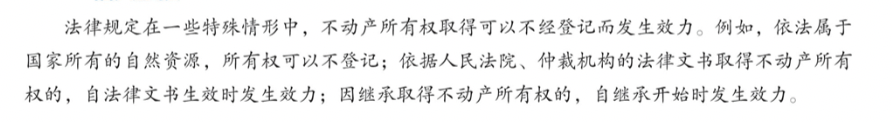
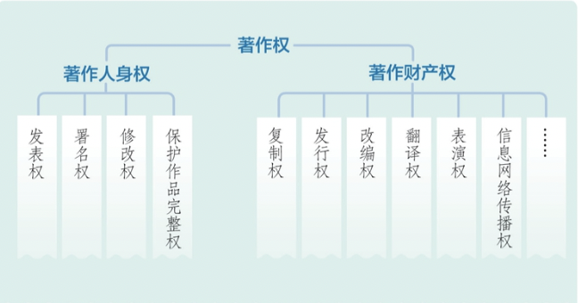

# 【法律】物权、合同

`2023/04/01 20:41:46  by: 程序员·小李`

#### 物权的概念

> 物权是对物品的直接`支配`和`排他`的权利，包括`所有权、用益物权、担保物权`。

#### 物品的所有权

> 所有权：`最重要`的一个物权，对动产和不动产的`占有、使用、处分、收益`的权利。
>
> **动产**：移动物品不会对其价值、经济用途产生影响的物品，如冰箱、汽车；
>
> **不动产**：移动物品会改变性质、损害其价值的有形财产，如房屋、土地。

#### 🔥 所有权的变更

> **不动产**：采用`登记`的方式进行。**动产**：`交付`时产生法律效力。

#### 国有财产

> * `旷藏、水流、海域`
> * `无居民海岛`
> * `城市土地`、法律规定的部分农村土地和城市郊区土地
> * `无线电频谱`
> * `国防资产`

#### 业主的建筑物区分所有权

> 业主对住宅、经营性用房等专有部分享有`所有权`，对共有部分，`共同享有、共同管理`。共有部分相关事项共同决定，专有部分面积占三分之二以上的业主、人数占三分之二以上的业主参与表决：
> * 制定和修改业主大会`议事规则`（过半）
> * 制定、修改`管理规约`（过半）
> * 选举`业主委员会`或更换`业主委员会成员`（过半）
> * 选聘、解聘`物业服务企业`或者其他`管理人`（过半）
> * 使用建筑物及其附属设施的`维修资金`（过半）
> * 筹集建筑物及其附属设施的`维修资金`(四分之三)
> * 改建、重建建筑物及其附属设施(四分之三)
> * 改变共有部分的用途，利用共有部分从事经营性活动(四分之三)

#### 相邻关系

> 不动产的相邻关系应当按照`有利生产、方便生活、团结互助、公平合理`的原则正确处理。（所有权在地理位置上的毗邻）

#### 共有

> 对物品共同所有的权利，包括`按份共有、共同共有`。
> * **按份共有**：物品可以分割或量化，共有人各占一部分。
> * **共同共有**：基于共同生活、共同劳动产生的，例如夫妻共有，家庭共有等。
>
> 当共有人`处分`自己所属的财产时，共有人有`优先购买`的权利。

#### 善意取得

> `无处分权人`转让标的物给第三人时，`善意第三人`一般可取得所有权，所有权人`不得`请求善意第三人返还原物品，只能向无处分权人请求赔偿损失。
> * `善意`的取得
> * `合理价格`进行转让
> * 所有权`已经生效`（不动产已经登记、动产已经交付）

#### 用益物权——强调使用价值

> 用益物权：非所有权人对他人的物品享有`占有、使用、收益`的权利。
> * **土地承包经营权**：对承包的耕地、林地、草地享有占有、使用、收益的权利；可以自主决定采用出租、入股等其他方式流转土地的经营权。
> * **建设土地使用权**：享有占有、使用、收益的权利，有权建造建筑物、构筑物、附属设施。对住宅用地的使用权期届满的，自动续期。
> * **宅基地使用权**：享有占有、使用的权利，有权依法建造住宅及其附属设施。
> * **地役权**：地役权人有权按合同约定，利用他人的不动产，提高自己的不动产效益。
> * **居住权**：出于生活居住的需要，对他人所有的住宅占有、使用的用益物权。

#### 居住权

出于生活居住的需要，对他人所有的住宅`占有、使用`的用益物权。

> 应当以`书面形式`订立居住权合同。
> * 居住权`无偿设立`，当时另有约定的除外。
> * 设立居住权应当向登记机构`申请居住权登记`，居住权自`登记日`生效
> * 居住权`不得转让、继承`。设立居住权的住宅`不得出租`，但是当事人另有约定的除外。
> * 居住权`期限届满`或`居住权人死亡`的，居住权消灭，应及时办理`注销登记`。

#### 担保物权——强调交换价值

> 为了担保债务，设置担保物品，债务不能履行时，优先就担保财产受偿。包括抵押权、质权、留置权。设立担保物权的，应当签订`担保合同`，担保合同是主债权债务合同的`从合同`。以下情况担保物权消灭：
> * 主债权消灭（还完债了）
> * 担保物权实现（已经受偿了）
> * 债权人放弃担保物权（债主不要了）
>
> **抵押**：债务人或第三人`不将财产进行转移`，而是`抵押`给债权人的，债务不能履行的时候，优先受偿。
>
> **质权**：债务人或第三人将动产或权利`转移给债权人占有`，债务不能履行的时候，优先受偿。
>
> **留置**：债权人按照合同占有债务人的财产，在债务人预期不履行债务时，有权`留置财产迫使其履行债务`，在债务人仍不履行是，就该财产优先受偿。

> `可以抵押的物品、权利`：
> * 建筑物、土地附着物
> * 建设用地使用权
> * 海域使用权
> * 生产设备、原材料、半成品、产品
> * 正在建造的建筑物、船舶、航空器
> * 交通运输工具
> 
> `禁止抵押的物品、权利`：
> * 土地所有权
> * 宅基地、自留地、自留山等集体所有的土地使用权（法律规定的除外）
> * 学校、幼儿园、医疗机构等公益性教育设施、医疗卫生设施。
> * 所有权、使用权不明确、有争议的财产
> * 依法被查封、扣押、监管的财产

> 抵押财产在抵押期间`可以转让`，应当`通知债权人`。债权人认为转让给别人可能损害自己利益的，可以请求担保人将转让的收益`清偿债务或提存`，超出欠款的部分归担保人所有，不足的部分由欠钱的人清偿。

> 抵押权的`保全`：抵押人的行为足以让抵押财产减少价值的，债主有权请求抵押人停止行为；抵押的物品价值已经减少的，可以要求抵押人恢复其价值，不能恢复的，可以要求提供减少部分的担保。拒不恢复，也不提供减少部分的担保的，可以要求债务人提前还债。

| | 抵押权| 质权| 留置权|
| :-:| :-:| :-:| :-:|
| 财产类型|动产、不动产、权利 | 动产、权利| 动产|
| 是否转移| 否| 是| 是|
| 权利类型| 约定| 约定| 法定|

#### 合同

> 合同是`民事主体`之间设立、变更、终止民事法律关系的协议。婚姻、收养、监护等身份关系适用有关该身份关系的法律法规。合同仅对`当事人`有法律约束力。
> * 合同的设立采用`书面、口头、或其他形式`
> * 可以采用`要约、承诺、或者其他方式`

> **口头合同**：通过`口头语言达成意思表示一致`所形成的合同。用在一些`金额较小、即时清结、权利义务关系相对简单`的民事法律关系中。
>
> 口头合同的问题在于当事人的`权利义务多不明确`，发生纠纷时`难以举证`。合同的履行期限越长，当事人忘记约定内容或者条件发生变化的`可能性就越大`，当事人对合同的理解和执行就越`容易产生争议`。履行期限较长的合同不宜采用口头形式。

> **书面合同**是以`合同书、信件、电报、电传、传真`等可以有形地表现所载内容的形式订立的合同。以电子数据交换、电子邮件等方式能够有形地表现所载内容，并可以随时调取查用的数据电文，视为书面形式。
>
> 书面合同`内容清晰`，有利于督促各方当事人根据确定的义务履行合同，有利于守约方根据约定追究违约责任。书面合同`有据可查`，能够为处理合同纠纷提供明确的证据，有利于案件的公正裁决。因此，对于权利义务关系复杂、金额较大以及履行期限较长的合同，应当采用书面形式，如房屋租赁合同、建设工程合同等。

> 要约：希望与他人订立合同。主动发起的叫做要约人，被动接受要约的叫受要约人。要约应当具备以下条件：
> * 内容`具体确定`
> * 受要约人`承诺`，要约人即刻受该意思表示`约束`
>
> 承诺：受要约人`同意要约`，即视为承诺。

> 要约是希望`与别人订立合同`，要约邀请是希望`别人发起要约`。拍卖公告、招标公告、招股说明书、债券募集办法、基金招募说明书、商业广告和宣传、寄送的价目表是`要约邀请`。

> 合同的设定可以使用格式条款，格式条款是为了重复使用而事先拟定的，在订立合同时未与对方协商的条款。
> 应当遵循`公平原则`，做好相关说明。如`未进行说明和提示的`，致使对方没有理解到位与其有重大利益关系的条款，对方可以主张此条款不成为合同内容。

> 缔约过失责任：在订立合同的过程中，造成对方损失的，应当承担赔偿责任：
> * 假借订立合同，`恶意磋商`的
> * 故意`隐瞒`事实，提供`虚假`情况的
> * 泄露、不正当使用`商业秘密`的
> * 其他`违背诚信`的行为

> 履行合同的关键是`明确合同内容`。当事人的`权利和义务`通过合同的条款来体现。合同内容由当事人约定，一般包括：当事人的姓名或者名称、住所，标的，数量，质量，价款或者报酬，履行期限、地点和方式，违约责任，解决争议的方法。

> 合同订立后，当事人协商一致，可以变更合同。除法律另有规定或者当事人另有约定外，合同的一方当事人不能单方面变更或者解除合同，否则须承担违约责任。

#### 债权与债务的转让

> **债权的转让**：债权人可以转让部分或全部债权给第三人，需要`通知债务人`，否则不予生效，且以下情况不得转让：
> * 按债权性质不得转让
> * 按当事人约定不得转让的
> * 按法律规定不得转让的
>
> **债务的转让**：债务人将债务的全部或部分转移给第三人的，应当`经债权人同意`。债务人、第三人可以催债权人予以同意，债权人未作表示的，`视为不同意`。

> **合同的权利义务终止**：合同解除的，该合同的权利义务关系终止
> * 债务已经履行、相互抵消（已经赔偿完了）
> * 债务人依法将标的物提存（相关物品提存了）
> * 债务人免除债务（不用偿还了）
> * 债权、债务同归一人（欠钱的和被欠钱的属于同一人）

#### 违约责任

> 当事人一方不履行合同或者不符合规定的，应当承担民事责任。
> * 存在`有效的合同`（有合同）
> * `有违约行为`（有违约）
> * `不存在免责`事由(如不可抗力)（无免责）

> 对于违约行为，有`继续履行、采取补救措施、赔偿损失、支付违约金或定金`方式。
>
> 定金：当事人可以约定一方给付定金作为债务担保，自`实际交付定金时`成立。
> * 定金数额由当事人约定，`不得超过`合同标的的`20%`，超过部分不产生定金的效力。
> * 债务人履行约定的时候，定金应当`抵押债务或退回`。
> * 给付定金的一方违约的，`无权请求`返还定金。
> * 收受定金的一方违约的，应当`双倍返还`定金。

> 既约定违约金，又约定定金的，一方违约时，对方可以选择`适用违约金或定金`。

#### 典型合同

> **保证合同（担保合同）**：债务人不履行到期债务或者发生约定情形时，保证人履行债务或者承担合同责任。
> 1. 一般保证：主合同未经审判或者仲裁，就债务人的财产依法强制执行前，有权拒绝承担责任，以下情形除外：
>  * 债务人`下落不明，且无财产可执行`
>  * 法院已经受理债务人`破产`的案件
>  * 债权人有证据证明债务人的财产`不足以履行`全部债务或者`丧失履行债务的能力`
>  * 保证人书面`放弃`本权利的
> 2. 连带责任保证：当债务人不履行到期债务时，债权人可以请求债务人或保证人承担责任。
>
>> 约定的保证期间`早于`主债务履行期限的或与主债务履行期限`同时届满`的，视为没有约定。没有约定或者约定不明确的，保证期间为主债务履行期限届满之日起`6个月`。
>
> **租赁合同**：出租人与被出租人之间以租赁物的使用、收益权和租金为合同内容的。
> * 租赁期限`不得超过20年`，超过20年的部分无效
> * 租赁`6个月`以上的，应当以`书面形式`签订。没有书面形式进行的，无法确定租赁期限的，视为`不定期租赁`。
> * 承租人经出租人同意，`可以`转租给第三人。承租人转租的，承租人与出租人之间的租赁合同仍然有效，第三人造成的相关损失，`承租人`应当赔偿。承租人未经出租人同意转租的，出租人`可以解除合同`
> * 租赁物在合同期内`所有权`发生变动的，`不影响`租赁合同的效力
> * 出租人出卖租赁房屋的，应当在`合理期限内`通知承租人，承租人享有以相同条件`优先购买`的权利，优先购买权在知晓`15日内`有效；（按份共有人和近亲属的除外）
> * 合同期满的，承租人继续使用租赁物，出租人没有异议的，原租赁合同继续有效，但租赁期限为`不定期`。承租人有`优先承租`的权利
>
> **保管合同**：寄存保管物并返还保管物的合同
> * 自保管物品`交付时`成立
> * 因保管人保管不善损毁、灭失的，保管人`应当赔偿`；`无偿`保管人没有故意或重大过失的，不承担责任
> * 贵重物品应当向保管人`声明`，由保管人验收、封存；寄存人未声明的，按`一般物品`赔偿。
>
> **准合同**
> * 无因管理：管理人`没有法定的义务`，为避免他人利益受损而管理他人事务的行为。管理人可以请求受益人因管理事务支出的`必要费用`；管理人因为管理行为`受损`的，也可以`请求补偿`。
> * 不当得利：得利人`没有法律依据`得到的利益，致使他人受损失。受损人可以请求得利人`返还`。

#### 知识产权

> `知识产权`是权利人依法就作品、发明创造等智力成果或商标、地理标志等工商业标记享有的专有性权利。包括著作权、专利权、商标权等。

> 著作权：针对作品依法享有的`支配和获取利益`的权利，未经著作权人的许可，使用著作权人的作品，就可能构成侵权。

> 著作的`发表权`保护是有期限的，著作权属于个人的，保护期限为有生之年+去世后50年，著作权属于法人、非法人组织的，保护期限为作品完成后50年。著作完成超过50年尚未发表的，也不再保护。著作权保护期满，进入公共领域，所有人免费使用，但`署名权、修改权、保护作品完整权`仍受法律保护。

> 专利权：权利人在一定的期限内享有的发明创造专有权。可以向国家知识产权局申请专利权，经审核通过后，颁发专利证书，授予专利权。未经专利权人同意，不得实施专利的发明创造。专利权保护期满，进入公共领域，所有人免费使用。

> 专利权包括：发明（保护期限20年）、实用新型（保护期限10年）、外观（保护期限15年）。

> 商标权：用于区分不同商品的标记，可保护文字、图形、字母、数字、三维标志、颜色组合、声音等。未经他人允许使用商标、或使用类似商标，容易产生混淆的，构成侵权。注册商标的`有效期为10年`，自`核准注册`之日起计算。商标注册人应当在期满前`十二个月内`按照规定办理续展手续；在此期间未能办理的，可以给予`六个月`的宽展期。每次续展注册的有效期为十年，自该商标`上一届有效期满次日起计算`。期满未办理续展手续的，`注销`其注册商标。

> 以三维标志申请注册商标的，仅由商品自身的性质产生的形状、为获得技术效果而需有的商品形状或者使商品具有实质性价值的形状，`不得注册`

> 两个或者两个以上的商标注册申请人，在同一种商品或者类似商品上，以相同或者近似的商标申请注册的，初步审定并公告`申请在先`的商标；`同一天申请的`，初步审定并公告`使用在先`的商标，驳回其他人的申请，不予公告。

> **著作财产权**包括：（1）复制权；（2）发行权；（3）出租权；（4）展览权；（5）表演权；（6）放映权；（7）广播权；（8）信息网络传播权；（9）摄制权；（10）改编权；（11）翻译权；（12）汇编权；（13）应当由著作权人享有的使用作品的其他权利。

> **著作人身权**包括发表权、署名权、修改权、保护作品完整权四项权利。

> `不以使用为目的的恶意商标注册`申请，应当予以`驳回`。

> 驰名商标所有者，在非类似商品上将其商标分别注册，该种商标称之为`防御商标`。同一商标所有人在相同或类似商品上注册的几个相同或者近似的商标，称为`联合商标`。`证明商标`是指由对某种商品或者服务具有监督能力的组织所控制，而由该组织以外的单位或者个人使用于其商品或者服务，用以证明该商品或者服务的原产地、原料、制造方法、质量或者其他特定品质的标志。`集体商标`是指以团体、协会或者其他组织名义注册，供该组织成员在商事活动中使用，以表明使用者在该组织中的成员资格的标志。

> 对下列各项，不授予专利权：（一）科学发现；（二）智力活动的规则和方法；（三）疾病的诊断和治疗方法；（四）动物和植物品种；（五）原子核变换方法以及用原子核变换方法获得的物质；（六）对平面印刷品的图案、色彩或者二者的结合作出的主要起标识作用的设计。

> 世界知识产权组织成立于1967年，自1974年起成为自筹资金的联合国专门机构，总部设在瑞士`日内瓦`。

> 🔥 自然人为完成`工作任务`所创作的作品是`职务作品`，除特殊规定的，著作权由`作者享有`，但法人或者非法人组织有权在其业务范围内`优先使用`。作品完成`两年内`，未经单位同意，作者不得许可第三人以与单位使用的相同方式使用该作品。

> 📌 负责专利执法的部门根据已经取得的证据，对涉嫌假冒专利行为进行查处时，有权采取下列措施：（一）询问有关当事人，调查与涉嫌违法行为有关的情况；（二）对当事人涉嫌违法行为的场所实施现场检查；（三）查阅、复制与涉嫌违法行为有关的合同、发票、账簿以及其他有关资料；（四）检查与涉嫌违法行为有关的产品；（五）对有证据证明是假冒专利的产品，可以查封或者扣押。