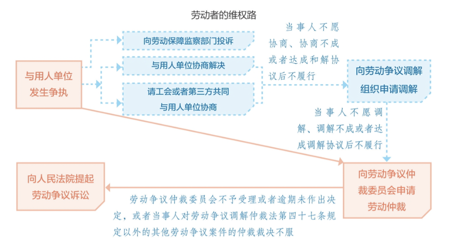
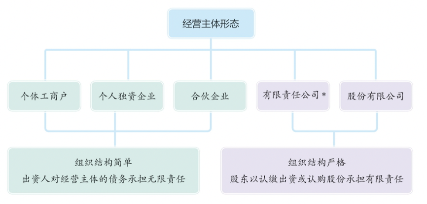

# 【法律】经济法与社会法

`2023/03/28 22:17:01  by: 程序员·小李`

#### 不正当竞争行为

> 不正当竞争：`经营者`在生产经营活动中，`扰乱市场竞争秩序`，损害其他`经营者`或`消费者`的合法权益的行为。我国《反不正当竞争法》中规定了七种不正当行为。

> **混淆行为**：
> * 使用与人近似的`包装、名称、装潢、标识`
> * 擅用他人`企业名称、社会组织名称、姓名、简称、笔名、艺名、译名`等
> * 擅用他人`域名、网站名称、网页`
> * 其他足以让人误会的行为

> **商业贿赂**
> * 贿赂对方工作人员、对方委托的单位或个人
> * 贿赂可能影响到交易的单位或个人

以明示的方式向交易对方`支付折扣`，或向中间人`支付佣金`不算贿赂；经营双方均应`如实入账`。

> **虚假宣传**
> * 不得对商品性能、功能、质量、销售状况、用户评价、荣誉等虚假宣传
> * 不得组织虚假交易

> **侵犯商业秘密**
> * 以不正当手段获取商业机密
> * 披露、使用、允许他人使用商业秘密
> * 违反保密要求，披露商业秘密
> * 教唆、引诱、帮助他人违反保密义务，获取、披露、使用、允许他人使用商业机密

> **不正当有奖销售**
> * 奖品信息不明确
> * 谎称有奖
> * 抽奖式有奖销售，最高奖励达5万元的

> **商业诋毁**
> * 不得编造、传播虚假信息，损害对手的商业信誉

> **网络不正当竞争**
> * 未经同意插入链接、强制跳转的
> * 误导、欺骗、强迫用户修改、关闭、卸载其他合法经营的网络产品、服务
> * 恶意对其他经营者不兼容

#### 产品质量法

> 产品：经过`生产、加工`，用于`销售`的物品。
>
> `市场监督管理部门`主管全国的产品质量监督，`县级以上地方市场监督管理部门`主管本行政区域的产品质量监督工作。
>
> 产品质量检查以`抽查`的方式实现，从`市场上或成品仓库`待销产品中`随机`抽取，`不得`超过合理的数量，`不得`收取检查费。

#### 产品质量要求

* 不得存在`人身、财产`安全风险
* 具备使用性能，对瑕疵作出说明的除外
* 符合包装注明的产品标准、质量状况
* 特殊物品有包装标识要求（易燃、易碎、易爆、有腐蚀性、有放射性等危险品，不可倒置等），做出`警示标记或说明`，标明储运注意事项

#### 产品瑕疵及其处理（有功能性缺失）

> 销售者负责`修理、更换、退货`；造成损失的应当`赔偿损失`；对责任不在本方的，可以`追偿`。
> * `不具备使用性能`并且未说明情况的
> * 不符合包装注明的`产品标准`的
> * 不符合产品说明、实物样品的`质量状况`的

#### 产品缺陷及其处理（存在不合理的危险）

> 因为产品缺陷造成人身、财产损害的，可以向销售方或生产方索赔，对应的责任人可以被追偿。诉讼时效自当事人知道权益受损时`两年`，赔偿请求权自产品最初交付消费者起有效时间为10年，尚未超过明示的安全使用期的除外。下述情况不赔偿：
> * `未将产品投入流通`的（还没上市的）
> * 投入流通时，缺陷`尚不存在`的
> * 投入流通时，现有科技`无法发现缺陷`的

#### 消费者权益保护法

> **消费者权利**
> * 安全保障权利：在购买、使用、被服务时，不得存在`人身、财产安全`损害。
> * 自主选择权：`自主选择`商品和服务的权利，自主决定买或不买，买哪个
> * 公平交易权：质量保证、价格合理、计量准确，有权拒绝`强制交易`。
> * 人格尊严权：`人格尊严、民族风俗`的尊重
> * 知情权：有权知道`真实情况`，不得隐瞒
> * 获得知识权：获得`消费和消费者权益保护`方面的知识的权利
> * 获得赔偿权：人、财受损的，可以`索赔`
> * 结社权：如`消费者协会`，保护消费者合法权益
> * 监督批评权：对商品、服务，消费者权益保护工作的`监督`
> * 个人信息权：`个人信息`依法受保护

> **经营者义务**
> * `依法`、`诚信`经营：依法履行义务，恪守公德，`诚信经营`，不设定不合理的交易条件，`不得强制交易`
> * 接受`监督`：听取消费者意见，接受消费者`监督`
> * `安全`保障：对消费者人身、财产的安全保障；有安全隐患，应及时报告有关部门、告知消费者，停止销售、警示、召回、无害化处理、销毁、停产。对于召回的，经营者承担相关费用。
> * 提供`真实信息`：提供质量、性能、用途、有效期限等信息，应当真实、全面，不得作虚假或者引人误解的宣传。对消费者就质量和使用方法等提出的询问，经营者应当作出真实、明确的答复。
> * 标明`真实`名称和标记：经营者应当明码标价，还应当标明其真实名称和标记。
> * 出具`凭证或单据`：应按规定出具凭证和服务单据，必须满足消费者需要出具`发票`。
> * 保证`质量`：保证产品的质量，对机动车、计算机、电视机、电冰箱、空调器、洗衣机等耐用商品或装修装饰服务，应当在六个月内发现瑕疵出现争议时，经营者举证。
> * 更换、修理、退货：因质量问题，自收到商品`7日内`退货，七日后，符合解除合同条件的可以退货，不予退货的需要`更换、修理`，`经营者`承担费用。对于`7天无理由退货`，`消费者`承担运输费用，商品`应当完好`（对定制、鲜活易腐、在线下载或音像制品、计算机软件、报纸、期刊除外）。
> * 正确使用格式条款：格式条款不得`排除或限制`消费者权利，`减轻或免除`经营者责任，`加重`消费者责任，`强制交易`，否则无效。
> * 不得侵犯消费者人格权：不得侮辱、诽谤消费者
> * 尊重消费者信息自由：严格遵守规定收集消费者信息，不得`泄露、出售`。未经同意或请求，`不得`发送商业性信息。
> 经营者应当尊重消费者的自主选择权：消费者有权自主选择经营者，自主选择商品品种或者服务方式，有权进行比较、鉴别和挑选。

#### 消费问题争议的解决

> * 协商`和解`
> * 请求消费者协会或其他调解组织`调解`
> * 向有关部门`投诉`
> * 向仲裁机构申请`仲裁`
> * 向人民法院提起`诉讼`

#### 消费问题的赔偿

> * 对于合法权益受损的，可以向`销售者`索赔，销售者可以追偿。
> * 对产品缺陷造成的损害，可以向`销售者或生产者`索赔，对应人可以追偿。
> * 可以对`服务者`索赔
> * 对原企业合并的，向`变更后`的企业索赔
> * 对使用他人营业执照经营的，可以向`本人或持有者`索赔
> * 对展会、租赁柜台的，可以向`销售者和服务者`索赔；若展会结束、租赁期满，可以向`举办者、出租者`索赔，对应可以追偿。
> * 网络平台同样担责，对`销售者`优先索赔，若没有联系方式的，`网络交易平台`担责。网络交易平台放纵侵害消费者的，负`连带`责任。
> * 虚假广告造成损害的，`经营者`担责。广告经营者、发布者发布虚假广告的，可以到`行政主管部门投诉`。广告经营者、发布者设计、`制作有关生命健康的虚假广告`的，应当与提供服务的经营者承担`连带责任`。社团、个人`推荐生命健康相关`的产品导致受损的，与商品经营者承担`连带责任`。
> * 欺诈赔偿：出现欺诈行为的，`额外赔偿3倍`，不满`500元`的按500计算。

#### 依法纳税

> 个人、企业均应当`依法履行纳税义务`。我国主要有`增值税、企业所得税、个人所得税`等税种。
>
> * **增值税**是以商品流转过程中产生的增值额为计税依据而征收的一种税。增值额就是生产经营者在一定期间的生产经营过程中新创造的价值。
>
> * **企业所得税**是对我国境内的企业和其他取得收入组织的生产经营、其他所得征收的一种税。除`个人独资企业与合伙企业`外，其他企业统一适用《中华人民共和国企业所得税法》。
>
> * **个人所得税**是针对`居民个人`在境内外取得的收人或者非居民个人从境内取得的收人而依法征收的一种税。

#### 劳动法和劳动合同法

> 劳动法主要调整`劳动者`与`用人单位`在`劳动过程中`发生的社会关系，即劳动关系。劳动者是指具有劳动能力、以从事某种社会劳动获得收入为主要生活来源、在用人单位的管理下从事劳动并获取劳动报酬的人。除特殊情况外，禁止用人单位招用`未满十六周岁`的未成年人。

> 劳动法的首要原则是`保护劳动者的合法权益`。劳动法体现了`劳动者平等竞争`的原则。劳动法明确规定，劳动者享有`平等就业和选择职业`的权利；劳动者就业，不因`民族、种族、性别、宗教信仰`不同而受歧视。

> 企业、个体组织与其劳动者适用劳动法，国家机关、事业组织、社团依照劳动法执行

#### 劳动者权利

> 劳动者主要享有以下权利：
> * **取得劳动报酬**。劳动报酬（工资）是用人单位依据国家有关规定或劳动合同的约定，以`货币形式`直接支付给劳动者的报酬。劳动者有权要求用人单位按照劳动合同的约定支付报酬。工资一般包括`计时工资、计件工资、奖金、津贴和补贴、延长工作时间的工资报酬以及特殊情况下支付的工资`等。劳动法规定，工资分配应当遵循`按劳分配`原则，实行`同工同酬`；用人单位支付劳动者的工资`不得低于`当地最低工资标准；`不得克扣或者无故拖欠`劳动者的工资。
> * **休息休假**。休息权是宪法规定的劳动者的基本权利，职工每日工作八小时、每周工作四十小时。用人单位应当保证劳动者每周`至少休息一日`。我国还实行`带薪年休假`制度，单位应当保证职工享受年休假，年休假期间享受正常工资收入。
> * **劳动安全卫生保护**。用人单位必须建立、健全劳动安全卫生制度，并为劳动者提供符合国家规定的劳动安全`卫生条件`和必要的劳动`防护用品`，对从事有职业危害作业的劳动者应当`定期进行健康检查`。
> * **社会保险和福利**。劳动者在职业生涯中会出现年老、患病、工伤、失业、生育等情况，为了确保劳动者获得基本的生活保障，国家和社会为劳动者提供必要的物质帮助，这就是社会保险。
> * **平等就业和选择职业**、**接受职业技能培训**、**参加和组织工会**、**参与民主管理**、**提请劳动争议处理**等权利。

#### 劳动合同订立原则

> * 合法：不得违背法律规定，需要`依法`订立
> * 公平：双方`利益均衡`，不得使一方利益过于失衡
> * 平等自愿、协商一致：地位`平等`，合同订立出于`自愿`，不得`强制、胁迫`
> * 诚实守信：应`诚实守信`、符合公德，不得恶意`隐瞒、欺骗`。

#### 劳动合同订立要求

> 建立劳动关系，应当订立`书面劳动合同`。已经建立劳动关系的，应及时订立合同，最迟从用工开始`一个月`。在用工前签订合同的，自`用工之日起`生效。

#### 劳动合同类型

> * `固定期限`劳动合同
> * `无固定期限`劳动合同：没有固定终止时间的合同。适用于连续工作满10年的；用人单位初次实行劳动合同制或国企改制重订合同时，已经连续工作满10年且距离退休不满10年的；连续订立两次固定期限期限合同，第三次续签的。
> * 完成`一定工作任务为期限`的劳动合同

#### 劳动合同效力

> 经协商一致，用人单位及劳动者在劳动合同文本上`签字或盖章`生效。以下情况合同无效或部分无效：
> * 以`欺诈、胁迫手段或趁人之危`，在对方违背真实意思情况下订立或修改的
> * 用人单位`免除`自己责任，`排除`劳动者权利的
> * `违法、违规`的

> 对劳动合同无效或部分无效有争议的，由`劳动争议仲裁机构`或`人民法院`确认。

#### 劳动合同条款

> 必备条款
> * 用人单位的名称、住所、法定代表人、主要负责人
> * 劳动者姓名、住址、居民身份证、其他有效身份证号码
> * 劳动合同期限
> * 工作内容、工作地点
> * 工作时间、休息休假
> * 劳动报酬
> * 社会保险
> * 劳动保护、劳动条件、职业危害防护
> * 法律法规规定应当纳入劳动合同的其他事项

> 约定条款
> * 试用期
> * 培训
> * 保密
> * 竞业
> * 补充保险
> * 福利待遇

#### 试用期规定

> * 合同满3个月不足一年的，试用期不得超过`1个月`
> * 合同一年以上不满三年的，适应期不得超过`2个月`
> * 合同三年以上和无固定期限的，试用期不得超过`6个月`

> 试用期的工资不得低于本单位相同岗位`最低档的工资`或`劳动合同的80%`，不得低于用人单位所在地的`最低工资标准`。试用期也`应当缴纳社保`。

#### 违约金

> 用人单位专项培训的，可以`约定服务期`，劳动者违反约定服务期的需要缴纳`违约金`，数额不得超过实际培训费用，要求支付的违约金不得超过服务期`尚未履行的部分所分摊的培训费用`。

#### 竞业条款

对负有保守秘密的劳动者，可以签订保密协议或竞业限制条款，在竞业期限内按月给劳动者经济补偿，劳动者违反竞业协议的，需要支付违约金，竞业限制最长期限`2年`。

#### 劳动基准制度

> **工作时间**：国家实行每日`8小时`工作制，平均每周不得超过`44小时`。用人单位由于生产需要，经与工会、劳动者协商后可以延长工作时间，一般`不超过一个小时`；因特殊原因需要延长的，每日`不得超过3小时`，每月不得超过`36小时`。

> **休息休假**：劳动者每周`至少休息一天`，应当按照`法定节假日`安排休假，元旦、春节、劳动节、国庆节等。

> **带薪年假**：劳动者连续工作`一年以上`的，享受带薪休假。累计工作`满一年不满十年`的，年休假5天；`满十年但不满二十年`的，年休假10天；`满二十年的`，休假15天。

> 安排劳动者加班的，支付不低于1.5倍的工资；休息日加班的又不能调休的，支付2倍工资；法定节假日加班的，不低于3倍工资。

#### 劳动合同的解除

> 用人单位与劳动者协商一致的，可以解除合同。

> **劳动者单方提前通知解除**：
> * `提前30日`书面形式通知用人单位，可以解除劳动合同
> * 在试用期内，`提前3日`通知用人单位，可以解除劳动合同
>
> **劳动者单方立即通知解除**：
> * 用人单位未按合同提供`劳动保护或者劳动条件`的
> * 未及时足额支付`劳动报酬`的
> * 未依法`缴纳社保`的
> * 单位违法、违规，损害`劳动者权益`的
> * 劳动合同`无效`的
>
> **劳动者单方不需要通知解除**：用人单位以暴力、威胁、非法限制人身自由的，强迫劳动者劳动的；违章指挥、强令冒险，危及人身安全的。

> **用人单位立即通知解除的**：
> * 在试用期期间被证明不符合录用条件的
> * 严重违反规章制度的
> * 严重失职，营私舞弊，给用人单位造成重大损害的
> * 劳动者同时与其他用人单位建立劳动关系，对完成本单位的工作任务造成严重影响，或者经单位提出拒不改正的
> * 以欺诈、胁迫等手段签订无效合同的
> * 劳动者被依法追究刑事责任的
>
> **提前30日通知解除合同的**（提前30日书面形式通知或额外支付一个月工资）：
> * 患病非因公伤不能从事原工作，也不能从事另行安排工作的。
> * 不能胜任工作，经培训仍不能胜任工作的
> * 客观情况发生变化，不能履行合同的
>
> **用人单位不得解除合同的**：
> * 从事接触职业病危害作业的劳动者尚未进行离岗前职业健康检查的，或者疑似职业病在诊断或医学观察期的
> * 在本单位患病或因公负伤并确认丧失或部分丧失劳动能力的
> * 患病或非因工伤，在规定的医疗期的
> * 女职工孕期、产期、哺乳期的
> * 本单位连续工作15年，并且距离退休不足5年的

> **经济补偿金**：单位解除或终止合同时，给予劳动者一次性货币补偿
> * 每满一年支付一个月的工资标准；
> * 6个月以上不满一年的，按一年计算
> * 不满6个月的，支付半个月
>
> **以下场景用人单位需要支付经济补偿金**：
> * 单位违法、违约导致合同解除的
> * 用人单位提出解除劳动合同的并经协商一致的
> * 用人单位主动辞退的
> * 以裁员形式解除合同的
> * 合同期满，以低于原合同约定条件续订合同的，劳动者不同意续签的。
> * 单位依法宣告破产、吊销营业执照、责令关闭、撤销或者用人单位决定提前解散的。
> * 以完成一定工作任务为期限的劳动合同，双方履行完毕的

> 用人单位违反劳动合同法接触或者终止合同的，应当按照规定经济补偿的两倍支付补偿金。

#### 劳动合同终止

> * 劳动合同期满的
> * 开始依法享受养老保险的
> * 劳动者死亡，或被法院宣告死亡或失踪的
> * 用人单位被依法宣告破产的
> * 用人单位被吊销营业执照、责令关闭、撤销或用人单位提前解散的

#### 劳动争议

> **劳动争议范围**
> * 因`确认劳动关系`发生的争议
> * 因订立、履行、变更、解除、终止`合同`发生的争议
> * 因`除名、辞退、辞职、离职`发生的争议
> * 因`工作时间、休息休假、社会保险、福利、培训及劳动保护`发生的争议
> * 因`劳动报酬、工伤医疗费、经济补偿、赔偿金`发生的争议

> **劳动争议解决**
> * 当事人可以`协商`解决，也可以向本单位劳动争议调解委员会申请`调解`
> * 调解不成，一方要求`仲裁`的，可以向劳动争议仲裁委员会申请仲裁
> * 当事人一方也可以直接向劳动争议仲裁委员会申请仲裁
> * 对仲裁不服的，可以向人民法院提起`诉讼`

#### 小时工

> 非全日制用工以`小时`计酬为主，劳动者在同一用人单位一般平均每日工作时间`不超过四小时`，每周工作时间累计不超过`二十四小时`的用工形式

> 非全日制用工双方当事人`不得`约定试用期

> 非全日制用工当事人`任何一方`都可以随时通知对方终止用工。用人单位`不向劳动者支付经济补偿`。

> 非全日制用工小时计酬标准不得低于用人单位所在地人民政府规定的`最低小时工资标准`。非全日制用工劳动报酬结算支付周期最长`不得超过十五日`。

#### 失业保险

> * 失业人员失业前累计缴费时间`满1年不足5年`的，领取失业保险金的期限最长为`12个月`；
> * 累计缴费时间`满5年不足10年`的，最长为`18个月`；
> * 累计缴费时间`10年以上`的，最长为`24个月`。

重新就业后，再次失业的，缴费时间重新计算，领取失业保险金的期限可以与前次失业应领取而尚未领取的失业保险金的期限合并计算，但是最长不得超过24个月。

#### 企业类型与创业

不同类型的经营主体，在成立条件和出资人责任承担上有不同的要求。

> 创办企业应在相关`主管部门`办理企业登记，领取`营业执照`。企业发生`变更、终止`的，也应当办理相应的`登记`。

> 国家实行`企业信息公示制度`，企业登记的相关信息应当`依法及时公示`。企业从事生产经营活动过程中形成的信息，以及政府部门在履行职责过程中产生的`能够反映企业状况的信息`，应当通过企业信用信息公示系统向社会公开。

