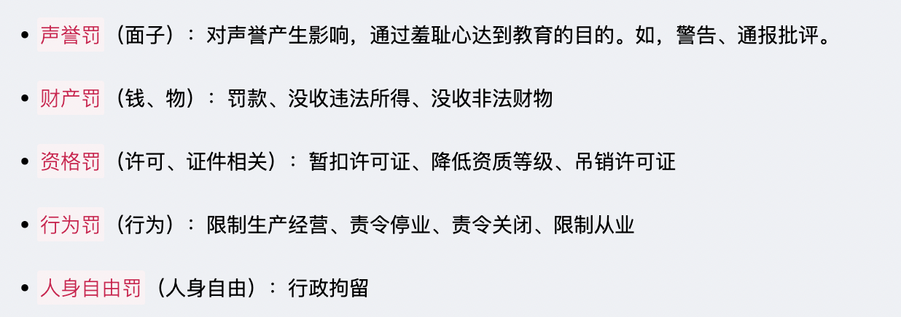
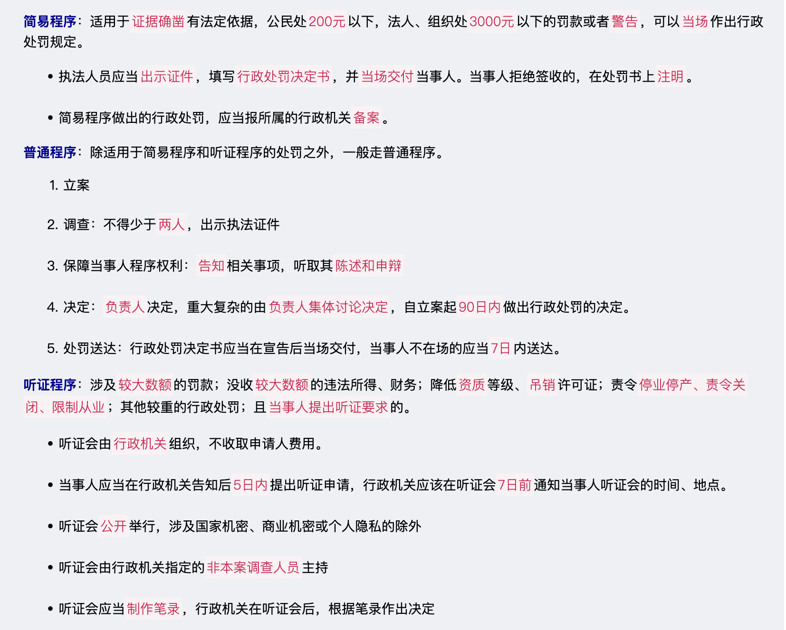
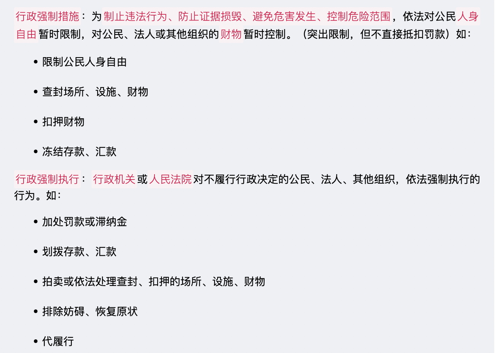

# 【法律】行政法

`2023/03/25 10:52:28  by: 程序员·小李`

#### 行政法概述

行政法调整的是行政关系，是`国家行政机关`实施`行政行为`过程期间发生的社会关系，以服从和命令为主，属于不平等主体之间的法律关系。

#### 行政法的基本原则

合法行政：必须依照`法律依据`执法

🔥 合理行政：考虑执法行为的`合理性`，例如比例原则（选择权益损害最小的方案）

🔥 程序正当：除特殊情况，执法行为应当`公开`；作出重大决定时，应当`听取公众意见`；作出处罚前`听取陈诉和申辩`；对可能影响公正的执法人员应当`回避`。

高效便民：减轻程序负担，提高效率

🔥 诚实守信：行政信息需要真实，`保护公民信赖利益`（不得随意撤销、变更已经生效的决定）

权责统一：行使权力与履行义务相统一

#### 行政主体

* 一级人民政府
* 专门负责相关事务的职能部门，如公安局、教育局、税务局
* 派出机关：地方人民政府派出的机构，代表政府执法。包括行政公署（省、自治区）、区公所（县、自治县）、街道办（直辖市、不设区的市）
* 派出机构：职能部门派出的机构，如派出所、税务所
* 非政府组织：以自己名义从事行政管理的国有事业单位或企业

#### 行政行为的效力

公定力：一旦做出，就必须`遵守、执行`（执法地位）

确定力：不得随意撤销、`变更`（不能说变就变）

约束力：行政行为生效产生的`约束力`需要遵守和服从（存在限制或约束的）

执行力：对无故不履行义务的，有权`强制执行`（保证实施的强制力）

#### 行政行为分类

> 抽象行政行为、具体行政行为：抽象的面对的是`大众`，不针对某个人，或某类人，具体的具体针对`某个人或某类人`。

> 羁束行政行为、自由裁量行政行为：有`明确法律规定`的属于羁束行政行为，可`自主决定`的属于自由裁量行政行为

> 依职权、依申请的行政行为：依职权的行政行为可有行政机关`主动进行`，依申请的行政行为需相对人`申请`。

> 内部行政行为、外部行政行为：针对的对象是`内部工作人员还是社会大众`。

#### 行政处罚的类型

不同的设定权限：

#### 行政处罚的管辖

#### 行政处罚的裁量情节

#### 行政处罚的程序分类及流程

#### 行政处罚的执行

#### 行政强制

#### 行政许可及其分类

#### 行政许可实施流程

#### 行政许可的监督检查

#### ☆ 其他具体行政行为

#### 行政复议的概念

#### 复议机关的确定

#### 行政复议的程序

#### 行政诉讼原则

#### 行政诉讼制度

#### 行政诉讼受案范围

#### 行政诉讼受案排除范围

#### 行政诉讼的级别管辖

#### 行政诉讼的地域管辖

#### 行政诉讼案件中的原告与被告

#### 行政诉讼的证据

#### 行政诉讼的程序

#### 国家赔偿

#### 国家赔偿的义务机关

#### 赔偿方式

#### 其他

