# 【法律】行政法

`2023/03/25 10:52:28  by: 程序员·小李`

#### 行政法概述

行政法调整的是行政关系，是`行政机关`实施`行政行为`期间产生的社会关系，以服从和命令为主，属于`不平等主体`之间的法律关系。

#### 行政法的基本原则

* **合法行政**：必须依照`法律依据`执法

* 🔥 **合理行政**：考虑执法行为的`合理性`，例如比例原则（选择权益损害最小的方案）

* 🔥 **程序正当**：除特殊情况，执法行为应当`公开`；作出重大决定时，应当`听取公众意见`；作出处罚前`听取陈诉和申辩`；对可能影响公正的执法人员应当`回避`。

* 🔥 **高效便民**：减轻程序负担，提高效率

* 🔥 **诚实守信**：行政信息需要真实，`保护公民信赖利益`（不得随意撤销、变更已经生效的决定）

* **权责统一**：行使权力与履行义务相统一

#### 🔥 行政主体

* **一级人民政府**
* **政府职能部门**（公安局、税务局、教育局等等）
* **政府派出机关**：地方人民政府派出的机构，代表政府执法。包括行政公署（省、自治区）、区公所（县、自治县）、街道办（直辖市、不设区的市）
* **部门派出机构**：职能部门派出的机构，如派出所、税务所
* **非政府组织**：以自己名义从事行政管理的国有事业单位或企业（如高等院校）

#### 行政行为的效力

>**公定力**：一旦做出，就必须`遵守、执行`（执法地位）
>
> **确定力**：不得随意撤销、`变更`（不能说变就变）
>
> **约束力**：行政行为生效产生的`约束力`需要遵守和服从（存在限制或约束的）
>
> **执行力**：对无故不履行义务的，有权`强制执行`（保证实施的强制力）

#### 行政行为分类

> **抽象行政行为、具体行政行为**：前者面对的是`大众`，不具有针对性；后者针对`某个人或某类人`。
>
> **羁束行政行为、自由裁量行政行为**：前者有`明确法律规定`；后者可`自主决定`
>
> **依职权、依申请的行政行为**：前者可由行政机关`主动进行`；后者需相对人`申请`。
>
> **内部行政行为、外部行政行为**：针对的对象是`内部工作人员还是社会大众`。

#### 🔥 行政处罚的类型

* **声誉罚**：警告、通报批评

* **财产罚**：罚款、没收违法所得

* **资格罚**：暂扣许可证、降低资质、吊销许可

* **行为罚**：限制生产、责令停业、责令关闭、限制从业等

* **人身自由罚**：行拘

不同的设定权限：

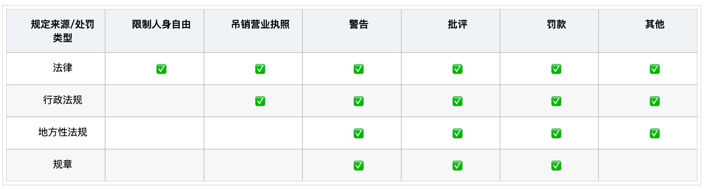

#### 行政处罚的管辖

🔥 行政处罚由`违法行为发生地`的县级以上人民政府管辖，包括实施地、经过地、结果地。省、自治区、直辖市可以下放权力到`乡镇人民政府、街道办`。

#### 🔥 行政处罚的裁量情节

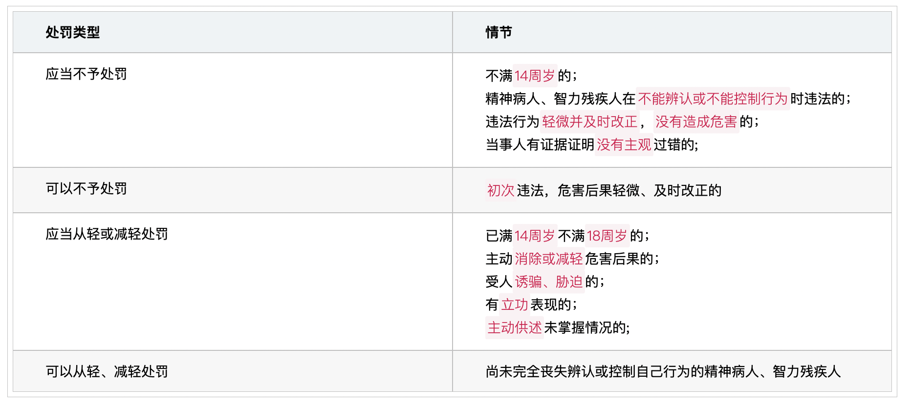

行政违法行为`超出两年`没有处罚的，不再进行处罚。涉及生命健康、金融安全、有危害后果的，可以适当延长至`五年`。

对相同的当事人，同一违法行为`不得处罚多次`。

#### 行政处罚的程序分类及流程

> **简易程序**：对`证据确凿`、普通公民处`200元`以下，法人或组织处`3000元`以下罚款或警告的情况，可以当场作出处罚决定。
> * 执法人员应当`出示证件`，填写`行政处罚决定`书，`当场交付`当事人。当事人拒绝接收的，在处罚书上`注明`。
> * 简易程序处罚应报行政机关`备案`

> **普通程序**：除简易程序和听证程序以外的处罚程序
> * 立案
> * 调查：不得少于`两人`，出示执法证件
> * 保障当事人程序权利：告知相关事项，允许起`辩解、陈述`
> * 决定：`负责人`决定处罚，或负责人集体讨论决定（重大复杂的情形），`立案90日内`作出处罚决定。
> * 处罚送达：处罚当场交付或`7日内`送达。

> **听证程序**：涉及较大数额罚款、没收违法所得、降低资质等级、吊销许可、责令停业停产、责令关闭、限制从业等较重的处罚，当事人`提出听证要求`的。
> * 由`行政机关`组织听证会，不收取当事人费用
> * 当事人应当在被告知处罚后`5日内申请听证`，行政机构应当在听证会`7日前通知`当事人时间、地点
> * 听证会公开举行，涉及国家机密、商业机密、个人隐私的除外
> * 听证会由`非本案调查人员`主持
> * 听证会应当`制作笔录`，行政机构根据笔录作出决定

#### 行政处罚的执行

>**罚缴分离**：作出行政处罚的机关与收缴罚款的机构分离；除当场收缴罚款的，执法人员不得擅自收缴罚款；当事人应当到指定银行或电子支付系统缴纳。

>**当场收缴**：简易程序中，罚款金额在100元以下的；不当场收缴事后难以执行的；交通不便，通过银行或电子系统支付有困难的，由当事人提出，可以当场缴纳。
>
>对当场缴纳的，需使用`统一制发的专用票据`，否则当事人有权拒绝缴纳；需在收缴之日或抵岸后`两日内`交至行政机关，行政机构在`两日内`缴付指定银行。

#### 行政强制

>**行政强制措施**：为制止违法行为、防止证据损毁、避免危害发生、控制危险范围依法对公民人身自由`暂时限制`，对公民、法人、组织的财物`暂时控制`。如：限制人身自由；查封场所、设施、财物；扣押财物；冻结存款、汇款

>**行政强制执行**：行政机构或人民法院对不履行行政决定的公民、法人、组织，依法`强制执行`。如：加处罚款或滞纳金；划拨存款、汇款；拍卖场所、设施、财物；排除妨碍、恢复原状；代履行

#### 行政许可及其分类

>行政许可需要相对人申请，依法审查后颁发许可，准许特定的活动。
>
>**普通许可**：直接涉及公共利益、个人重大利益的活动
>
>**特许**：有限的自然资源使用，公共资源配置，特定行业准入
>
>**认可**：`职业或行业资格、资质`
>
>**核准**：`设备、设施、产品、物品检验、检测、检疫`
>
>**登记**：`企业或组织`成立

#### 行政许可实施流程

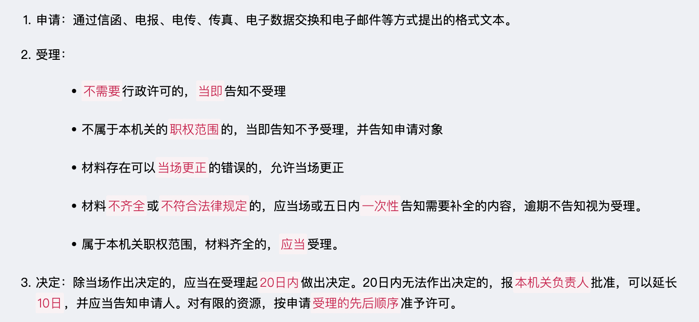

#### 行政许可的监督检查

#### ☆ 其他具体行政行为

#### 行政复议的概念

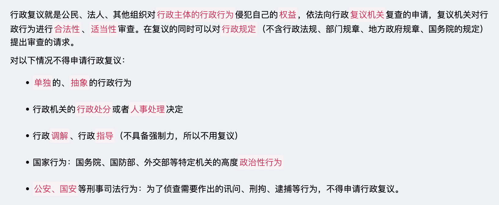

#### 复议机关的确定

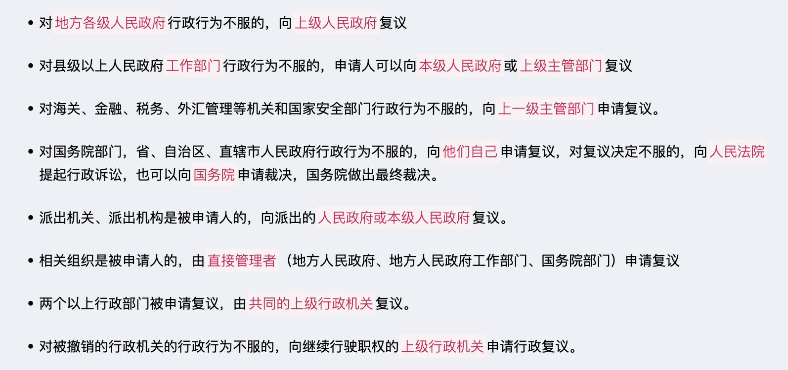

#### 行政复议的程序

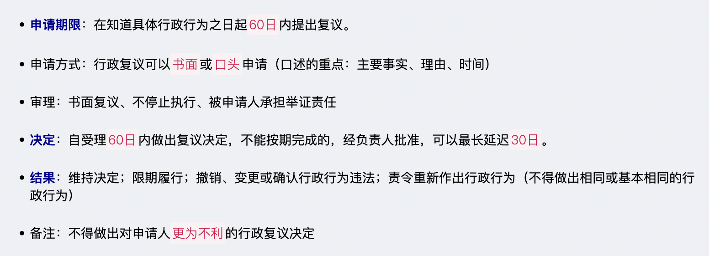

#### 行政诉讼原则

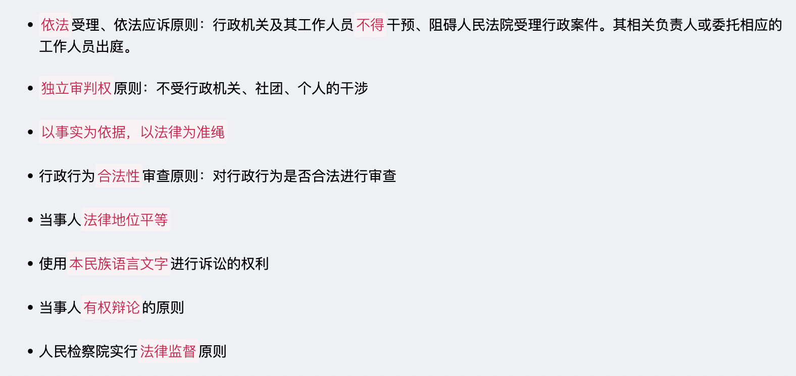

#### 行政诉讼制度

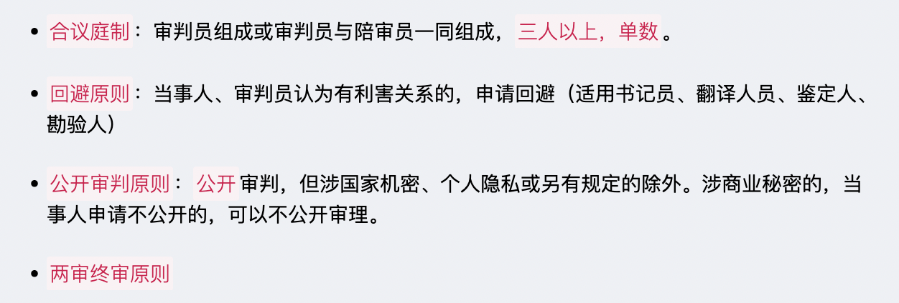

#### 行政诉讼受案范围

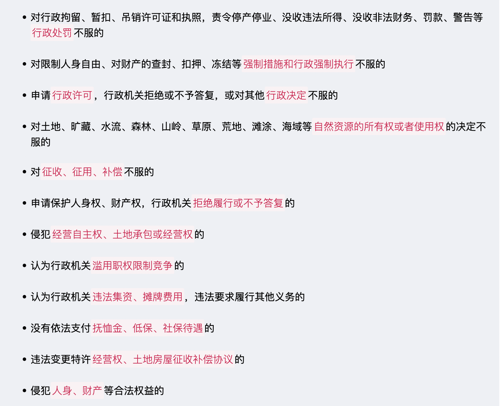

#### 行政诉讼受案排除范围

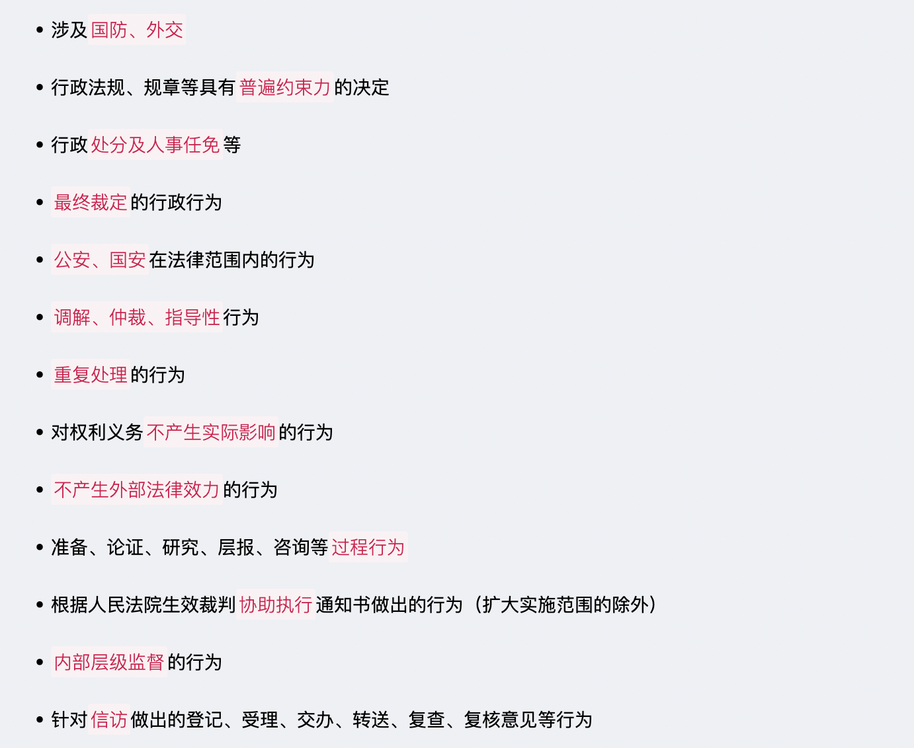

#### 行政诉讼的级别管辖

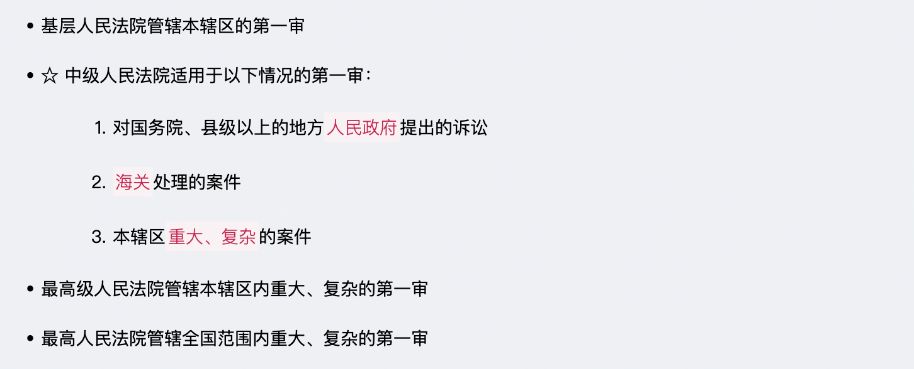

#### 行政诉讼的地域管辖

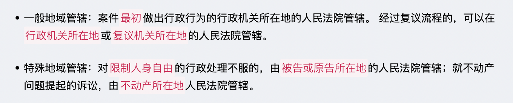

#### 行政诉讼案件中的原告与被告

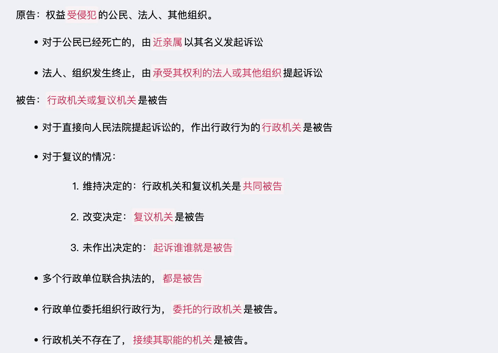

#### 行政诉讼的证据

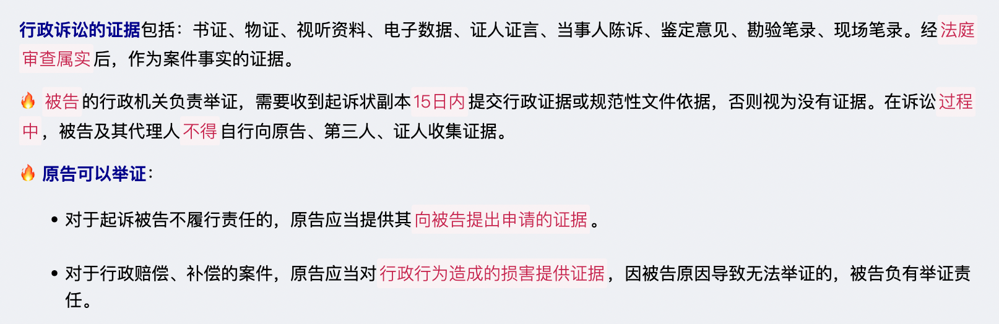

#### 行政诉讼的程序

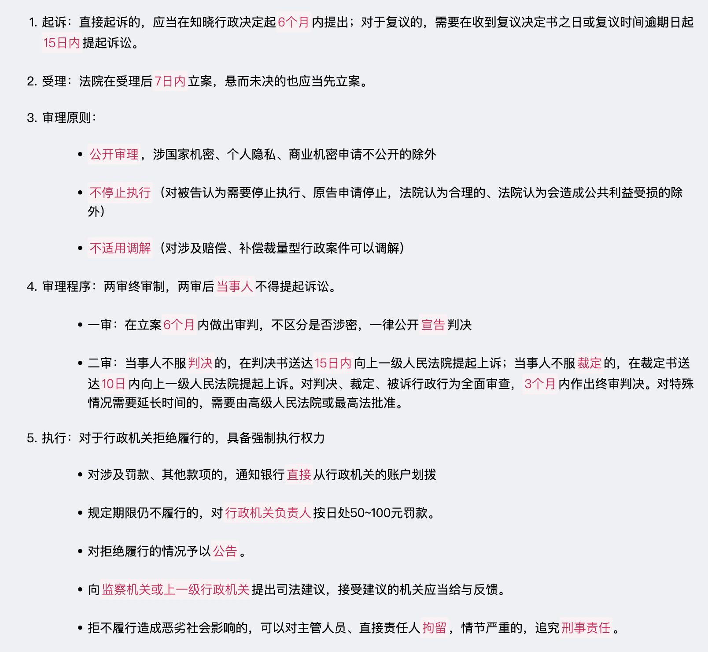

#### 国家赔偿

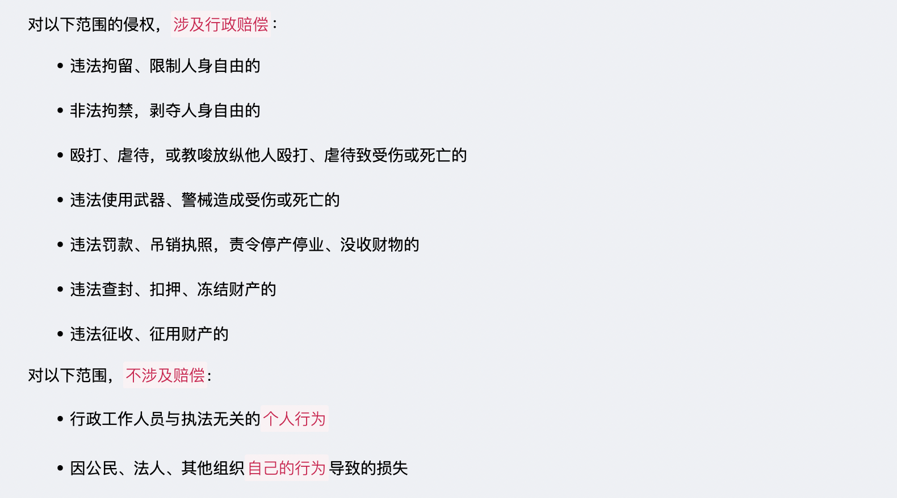

#### 国家赔偿的义务机关

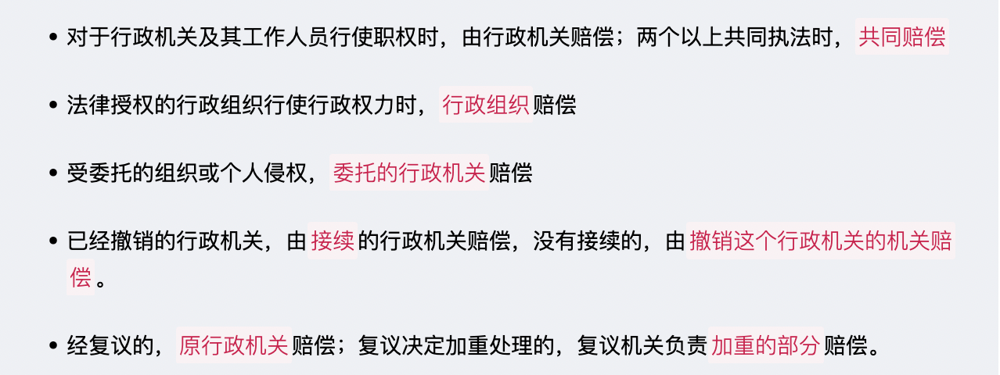

#### 赔偿方式

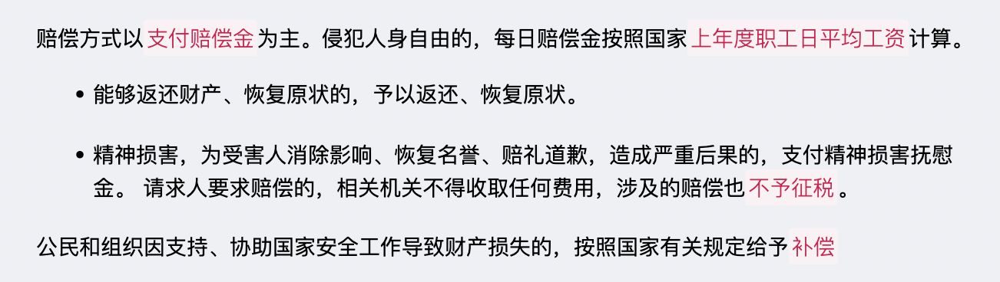

#### 其他

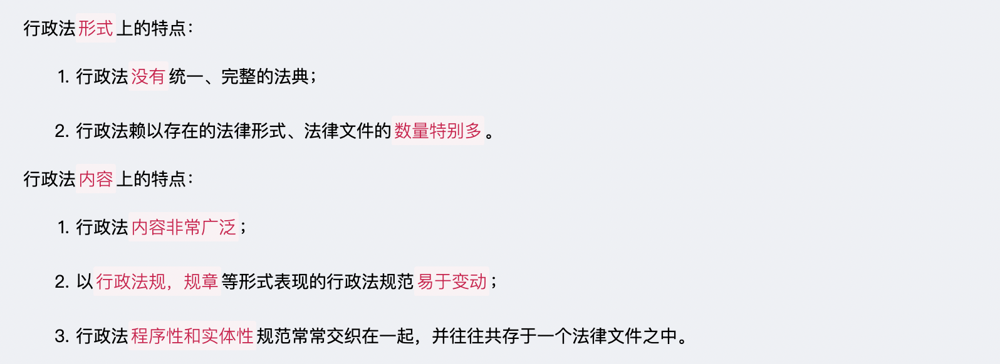

发生重大传染病疫情等突发事件，为了控制、减轻和消除突发事件引起的社会危害，行政机关对违反突发事件应对措施的行为依法`快速从重处罚`

行政处罚决定依法作出后，当事人应当在行政处罚决定书载明的期限内，予以履行。当事人确有经济困难，需要延期或者分期缴纳罚款的，经当事人申请和行政机关批准，可以`暂缓或者分期缴纳`

下列情形从重处罚：（一）有较严重后果的；（二）教唆、胁迫、诱骗他人违反治安管理的；（三）对报案人、控告人、举报人、证人打击报复的；（四）六个月内曾受过治安管理处罚的。

到期不缴纳罚款的，每日按罚款数额的`百分之三`加处罚款，加处罚款的数额`不得超出罚款的数额`