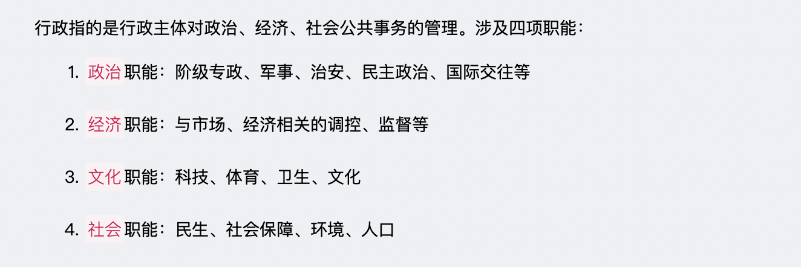
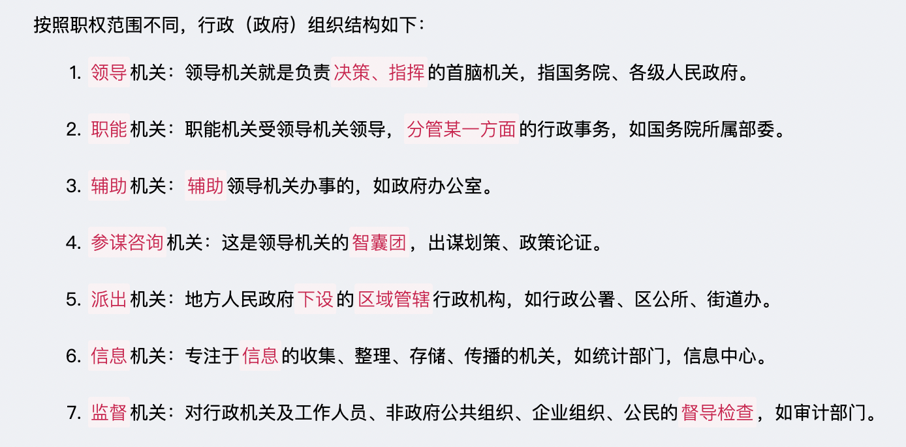
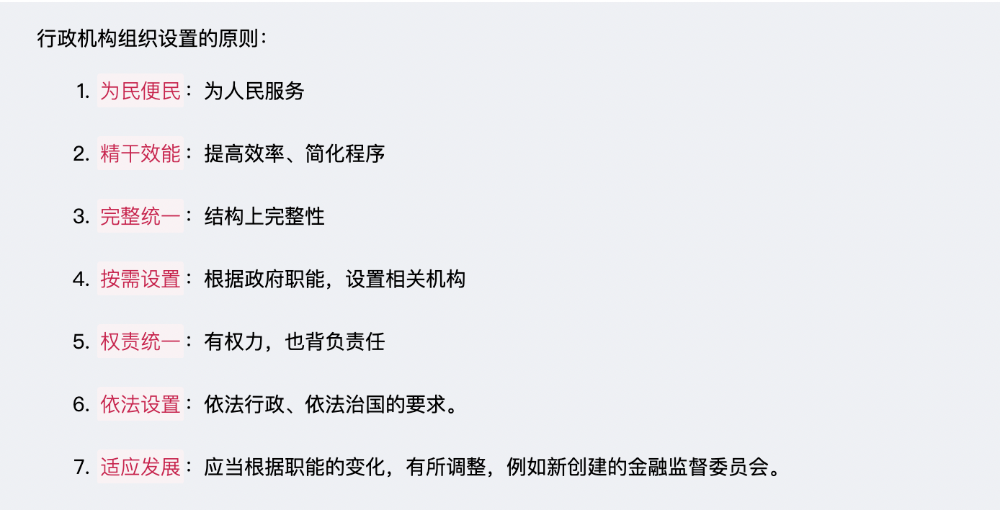
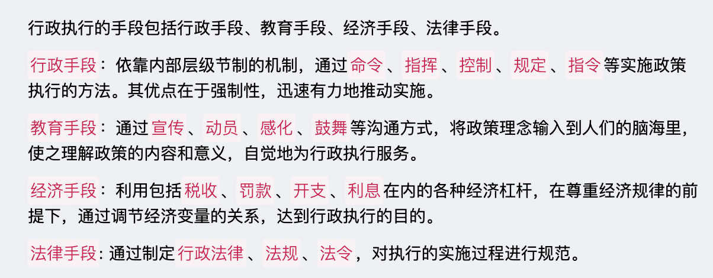
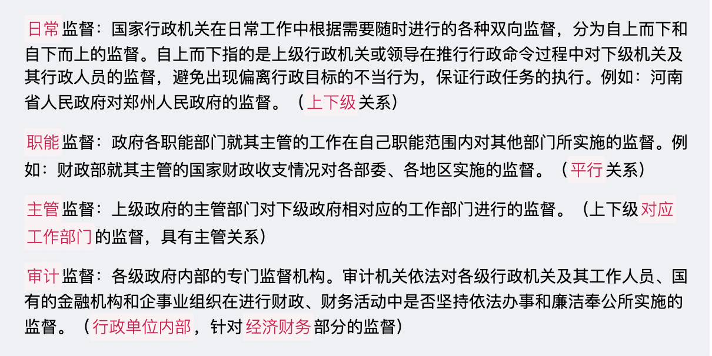
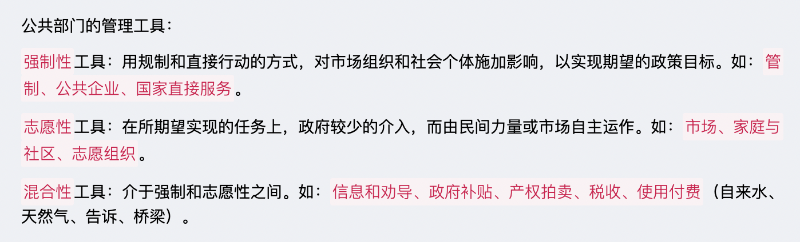
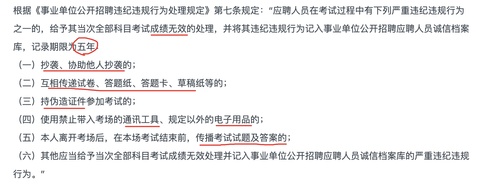
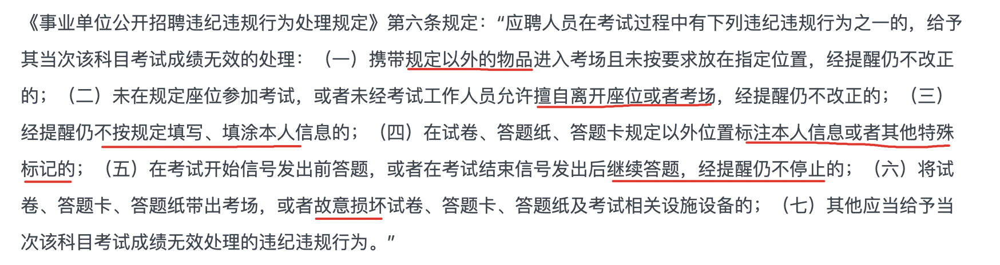
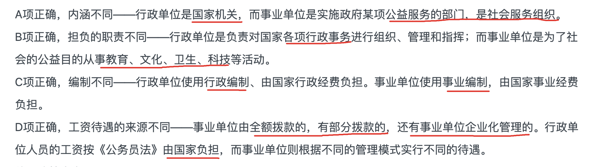

# 管理
`2023/03/07 07:33:06  by: 程序员·小李`

#### 事业单位人事管理原则

党管干部、党管人才

#### 事业单位人事管理方针

`民主、公平、竞争、择优`，实行分级分类管理

#### 事业单位岗位分类、分级

> 事业单位岗位分为`管理岗位、专业技术岗位、工勤技能岗位`
> * 🔥 管理岗位分为`10`个等级，即一至十级职员岗位。
> * 🔥 专业技术岗分`13`个等级，一至七级为高级岗位，八至十级为中级岗位，十一至十三级为初级岗位。
> * 🔥 工勤技能岗分技术工岗位和普通工岗位，技术工岗位分为`5`级，普通工岗位不分级。
>
> 各等级岗位基本任职条件：(简记为：**四六级停两年，其他停三年**)
> * 9级升8级，8级升7级，7级升6级，间隔三年
> * 5级升4级，间隔三年
> * 6级升5级，4级升3级，间隔两年

#### 🔥 事业单位分类

**按照经费来源分**：`自收自支`单位、`全额拨款`单位、`差额拨款`单位

**按社会功能分**：`行政职能`单位、`生产经营活动`单位、`公益服务`单位

**按单位性质和特点分**：`非政府公共机构`性质（社科院、图书馆、博物馆、基础理论研究所）、`有一定经济效益`的单位（中小学、考试院、养老院）、`生产经营性`事业单位

#### 事业单位岗位招聘

> 事业单位设置岗位，应当明确`岗位名称、职责任务、工作标准、任职要求`，事业单位`拟定`岗位设置方案，报人事综合管理部门`备案`。

> 事业单位新聘用工作人员，应当`面向社会`公开招聘，`政策性安置、上级任命、涉密岗位`除外。

> **公开招聘的流程**：制定招聘方案->公布招聘信息（不少于7个工作日）->资格审查->考试、考察->体检->公示拟聘名单->签订合同，办理手续
>
> **竞聘上岗流程**：制定竞聘方案->本单位公布招聘信息->资格审查->考评->本单位公示拟聘名单->办理聘任手续
>
> 🔥 有四种情况可以直接`考核`招聘：  
> 1. 研究生学历或者硕士以上学位的人员  
> 2. 中级及以上专业技术职称的人员  
> 3. 技师及以上工人技术职务的人员  
> 4. 按照单位经费来源平行流动和顺向流动的人员
>
> 对`急需的高学历人才`、`科技人才`、`管理人才`、`学术和技术带头人`的工资，单位可根据工作需要和人才创造的业绩，根据市场及行业情况，与本人协商确定

> 对违反公开招聘纪律的应聘人员，视情节轻重`取消考试或聘用资格`；对违反本规定招聘的受聘人员，一经查实，应当`解除聘用合同`，予以清退。

#### 事业单位聘用合同

> 🔥 聘任合同期限一般`不低于三年`，初次就业的试用期为`12个月`。  
> 🔥 事业单位与聘用人员应当在报到之日起`一个月内`签订聘用合同。    
> 🔥 已经`连续工作满10年`的，距离法定退休年龄`不足10年`的，可提出签订`聘用至退休的合同`。

> **单位**解除合同的场景：
> * `年度考核不合格不同意调整工作岗位`，或者`连续两年`年度考核不合格的，单位提前30日书面通知，可以`解除聘用合同`。  
> * 对`连续旷工超过15个工作日`，或一年内`累计旷工超过30个工作日`的，单位可以解除聘用合同。  
> * 受到`开除`处分的，解除聘用合同。

> **受聘人员**可以随时单方面解除合同的场景：  
> 1. 试用期内；  
> 2. 考入普通高等院校；  
> 3. 被录用或者选调国家机关工作的；  
> 4. 依法服兵役的。 

> **聘用合同类型**：
> * 3年（含）以下的合同为`短期合同`，对流动性强、技术含量低的岗位一般签订短期合同；
> * 3年（不含）以上的合同为`中期合同`；
> * 至职工退休的合同为`长期合同`；
> * 以完成一定工作为期限的合同为`项目合同`。

#### 事业单位考核与培训

> 考核的重点是`工作绩效`，考核时应当听取服务对象的意见及评价。考核结果作为`岗位、工资、续订合同`的依据。  
> 1. `平时考核`
> 2. `年度考核`: 分为`优秀`、`合格`、`基本合格`、`不合格`等档次
> 3. `聘期考核`: 分为`合格`和`不合格`等档次。

> 工作人员应当按照要求，参加`岗前培训`，`在岗培训`，`转岗培训`，和为完成特定任务的`专项培训`。

#### 事业单位奖惩

> 🔥 坚持`物质和精神`相结合，以精神奖励为主。坚持`定期奖励和及时奖励`相结合，以定期奖励为主。奖励分为`嘉奖、记功、记大功、授予荣誉称号`。对获得嘉奖、记功、记大功的事业单位工作人员，应给予`一次性奖金`。
>
> 在奖励决定单位管辖范围内对拟奖励名单进行公示。公示期不少于`5个`工作日，因涉密的，可以不公示。

>  🔥 处分分为：警告（6个月）、记过（12个月）、降低岗位等级（24个月）、撤职（24个月）、开除。  
> 除`开除`处分以外，处分期内无其他违纪行为的，在处分期满后，由处分决定单位`书面形式`解除处分。
>
> 处分应当自批准立案之日起`6个月内`作出决定；特殊情形的可以延长，但最长`不得超过12个月`。

#### 事业单位薪资与福利

> 🔥 建立`激励与约束`相结合的工资制度，工资包含：
> * `基本工资（含岗位工资和薪级工资）`
> * `绩效工资`
> * `津贴补贴`。
>
>事业单位的工资正常增长，应当与`国民经济发展`协调，与社会进步相适应。
>
> 享受国家规定的福利待遇，执行`工时制度和休假制度`，参加`社保`，符合退休条件的应当退休。

#### 事业单位人事争议

>  🔥 人事争议依照《中华人民共和国劳动争议调解仲裁法》处理，对`考核结果、处分`决定不服的，可以以`书面`形式`申请复核、提出申诉`（自知道处分决定之日起`三十日内`向`原处分决定单位`申请）。  
>
>  🔥 在复核、申诉、再申诉期间`不停止人事处理`的执行，也`不`因提起复核或申诉加重处分。
>   
> 复核及申诉应当由`本人`申请。本人丧失行为能力、部分丧失行为能力、死亡的，可以由亲属或监护人代为申请。

>   🔥 处理人事争议，应当注重`调解`, 遵循`合法`、`公正`、`及时`的原则。
> 
> 2019年10月发布的`《事业单位人事管理回避规定》`，建立了统一的事业单位人事管理`回避`制度。  
> 1. 与本人有利害关系的  
> 2. 与本人近亲属有利害关系的  
> 3. 可能影响公正的

#### 行政管理与行政职能

#### 行政结构

#### 行政设置原则

#### 行政监督
 

#### 行政执行的手段

  

#### 其他
> 企业目标是企业各项活动所要达到的总体的效果。依据`权变性`原则，企业目标要根据外部环境的变化`及时调整`与`修正`。企业的长期目标应保持一定的`稳定性`，短期目标应保持一定的`灵活性`。

>   🔥 组织管理运行中常见的职能有:
>
> `计划`: 确定目标，制定计划
> 
> `组织`: 建立组织机构，确定职位、职责、职权，协调组织职能的相互关系。
> 
> `领导`: 运用权力，组织、指挥、协调、监督下属人员。
> 
> `控制`: 衡量计划完成情况并纠正偏差，确保目标实现。

>   🔥 行政组织设置的原则：`精干效能原则、依法设置原则、按需设置原则、职责权统一原则、适应发展原则、为民便民原则、完整统一原则`。

> 行政组织体制分为：首长制、委员会制、混合制。

> **直线制**：从上到下垂直领导，下属部门只接受一个上级的指令，各级主管负责人全盘负责。
>
> **职能制**：在主管负责人之外，设立一些职能机构，多头领导容易产生混乱。
>
> **直线-职能制**：直线制和职能制的结合。
>
> **事业部制**：高度集权下的分权管理体制，适用于规模庞大的公司，下设事业部分别管理。
>
> **矩阵制**：按职能划分的部门和以项目划分的小组结合成矩阵。

> 网络型结构是一种很小的中心组织，依靠其他组织以合同为基础实施经营活动。

> 突发公共事件是指突然发生的，造成或可能造成重大人员伤亡、财产损失、生态破坏和严重社会危害，危及公共安全的紧急事件。对此类事件做出的决策具有`公共性、突发性、紧急性，不确定性`等特点，同时可能具有广泛的社会影响性。

> 公共突发事件分为四级：一级（特别重大）、二级（重大）、三级（较大）、四级（一般）。

> 突发事件处理原则：`时间性原则、效率性原则、协同性原则、科学性原则`。首要原则是`迅速性(时间性)`原则。

> 个人权力指的是个人特殊的品质产生的全力，让下属自觉地跟随自己，这种权力影响更具有持久性，如`模范权`和`专长权`。

> 实行目标管理的逻辑步骤是：制定目标-实施目标-评价目标。

> 领导的本质是`影响力`

> 按决策的作用不同分：`战略决策、战术决策`。

> 战略决策: 解决全局性、长远性、战略性的重大决策问题的决策，一般由高层次决策者作出。

> 战术决策: 针对某一具体问题做出的决策，以战略决策规定的目标作为决策标准。

> `公共物品`是供社会成员`共同享用`的物品，公共物品具有`非竞争性`和`非排他性`。纯公共物品：国防、外交、环保、法律。

> 激励理论的类型包含：内容型激励理论、过程型激励理论、综合型激励理论。

> ☆ 事业单位应聘人员对`公开招聘违纪违规`处理决定不服的，可以依法申请`行政复议`或者提起`行政诉讼`。

> 主动交代违法违纪行为的；主动采取措施有效避免或挽回损失的；检举他人重大违法违纪行为情况属实的；可从轻处分。

> 目标管理以目标为导向，以人为中心，以成果为标准，分为`计划阶段、执行阶段、检查阶段、检讨和改进阶段`。

> 目标明确后，分析矛盾、拟定方案的要求：
> 
> 所拟定的方案必须`明确具体`
>
> 所拟定的方案必须`多样化`
>
> 所拟定的方案必须具有`创造性`

> 人事处理争议是针对因`解除人事关系、履行聘用合同`发生的争议。适用于军队文职、事业单位、机关单位。

> 从事生产经营活动事业单位，转为企业的，实行`劳动合同`制度。

> 事业单位在把社会效益放在第一位的前提下，要处理好`社会效益`和`经济效益`的关系。

> 命令型领导：让你干啥就干啥，`服从命令`听指挥！
>
> 说服型领导：对下属`一定的指导`，保护又注意保护和鼓励下属的积极性。
>
> 参与型领导：着重给予`支持和协调`，跟下属`一起参与决策`，增强下属的参与感和主人翁感。
>
> 授权型领导：`简政放权`，几乎不干预下属的工作，授权并兜底。

> 例外管理：将常规工作向下授权，自己处理规范化以外的事项，保留监督能力。
>
> 动态管理：根据数据对运营策略及时调整的模式
>
> 参与管理：让下属参与组织的决策过程及各级管理工作。
>
> 走动管理：接近一线员工，走动走动，及时了解他们的工作困境。

> 三个和尚没水喝，主要原因是`职责不清`。

> `内部监督`是第一道防线，也是最直接、最迅速的监督。

> 危机式管理：企业为`应对各种危机情景`所进行的`规划决策、动态调整、化解处理及员工培训`等活动过程，其目的在于`消除或降低危机`所带来的威胁和损失。

> 破格式管理：不单单看工作年限作为晋升的条件，`也根据工作能力和工作成果`决定升降职务。

> 抽屉式管理：每个管理人员办公桌的抽屉里都有一个明确的职务工作规范，不能有职无权、有责无权、有权无责，`必须职、责、权、利相互结合`。

> 和拢式管理：管理必须强调`个人和整体的配合`，个人和集体高度和谐。

> “一山容不得二虎”：需要集权管理的组织不能允许有多个直线领导核心。

> 按决策的重要程度划分：战略决策、战术决策

> 按决策的重复程度划分：程序化决策、非程序化决策

> 按决策问题可控程度划分：确定型决策、风险型决策、非确定型决策。

> 职工退休后按月领取基本养老金，需要个人缴费年限（含视同缴费年限）累计满`15年`。

> 监督最根本的特征是`依法监督`。

> 有效的制约和监督权力的`关键`是健全权力运行制约和监督机制，一靠民主，二靠法制，同时还要建立健全全面的监督体系。

> 集权的缺点：不利于发展个性和特色；缺少弹性和活力；降低应变能力；下级容易思想依赖，没有主动性和创造性；容易导致个人专制。

> 行政干预分为`预防性干预、事中干预、事后干预`。

> 公共管理的对象是：`公共项目`、`公共资源`、`社会问题`。

> `中层及基层`管理人员主要从事`例行的、程序性`的控制活动。

> 公共政策的功能：
>
> `导向`功能：提高正向激励，指明行动方向，使政策对象朝着决策者所期望的方向努力和行动。
>
> `调控`功能：通过规范制约的方式，约束决策者不希望的行动。
>
> `分配`功能：利益在不同地区、部门、群体之间发生变化。

> `定性决策分析`又叫`主观决策方法`，指利用`知识和经验`对决策内容进行分析，包括价值分析、可行性分析、德尔菲法、主观概率预测法、超理性分析法等。

> 决策`是行政管理的`核心`，它是行政管理的`起点`，是行政执行和行政监督的`依据`。行政执行应当忠于行政决策；`行政监督`是确保行政执行`不偏离行政决策目标`的`根本保证`。行政决策、行政执行、行政监督三者有机统一，构成完整的行政过程。

> `服务性`是办公室管理的基本特征。

> 招聘外籍人员的，需要报`省级`以上人事行政部门核准，并按照规定进行招聘。

> 行政效率的`总体原则`：效率优先，兼顾公平。

> 对违法违纪行为`情节轻微`，经过批评教育后改正的，可以`免予处分`。

> 在管理活动中，经济方法的特点是`利益性`、`关联性`、`灵活性`、`平等性`。

> 管理是一项重要的生产要素，在生产经营活动中，主要表现为`组织协调`和`指挥运筹`才能。在分配形式上包含`职务工资制、承包制、年薪制、津贴制`等。

> `临时方案`：为了解决在实施决策的过程中出现的而一时又难以查清原因的决策方案。

> `一票否决制`的决策原则是`全体一致原则`，所有成员必须完全一致同意。

> 决策是一个`动态`的，实现目标的过程，包括决策前的`准备活动`，`做出决策`的活动，决策后的`实施、反馈、纠偏`的活动。

> 人事管理的基本要素`人`和`事`。

> 将`职能部门和小组进行组合`，以`完成某项工作`为核心的新型组织结构成为`矩阵式结构`。

> 根据风格，分为专断型、放任型、民主性。根据行为方式分为：`强制式、说服式、激励式、示范式`。

> 决策的规则：`全体一致规则、少数决策规则、简单多数规则、绝对多数规则`。

> 决策按风险程度分：确定性决策、不确定性决策、风险决策。

> 按决策问题的类型分：程序性决策、非程序性决策。

> 群体决策常见的方法：德尔菲法（不断匿名反馈咨询专家的意见，直到达成一致）、头脑风暴（畅所欲言、互相启发）、名义小组法（像参会一样，对沟通稍加限制，强调先个人决策）。

> 根据控制活动的阶段分：`预先控制、过程控制、事后控制`。

> 男士接待女士，男接待人先行。其他都是被接待人先行。

> `教育事业单位`是我国事业单位的主体，目前其工作人员大约占目前我国事业单位工作人员规模的一半.

> 有下列行为之一的，给予警告或者记过处分；情节较重的，给予降低岗位等级或者撤职处分；情节严重的，给予开除处分：（一）利用专业技术违法违纪的；（二）有抄袭、剽窃、侵吞他人学术成果，伪造、篡改数据文献，或者捏造事实等学术不端行为的；（三）利用职业身份进行利诱、威胁或者误导，损害他人合法权益的；（四）利用权威、地位或者掌控的资源，压制不同观点，限制学术自由，造成重大损失或者不良影响的；（五）在申报岗位、项目、荣誉等过程中弄虚作假的；（六）工作态度恶劣，造成不良社会影响的；（七）其他严重违反职业道德的行为。

> 事业单位人事制度改革的目标包括`建立全面的职员聘用制度`；建立`“脱钩、分类、放权、搞活”`制度；建立富有活力的`激励竞争机制`和`多样化的工资分配制度`；建立`社会化的就业、医疗、退休养老`等社会保障制度。

> 事业单位`转让无形资产`，取得的收入`按照国家有关规定处理`。事业单位`取得无形资产`发生的支出，应当`计入事业支出`。

> 聘用合同是按照用人方式不同来划分，劳动合同可以分为`录用合同`、`聘用合同`和`借调合同`。

> 事业单位培训经费属于职工教育经费，从`教育经费`中列支，而`不是`从事业费中列支。

> 事业单位改革的基本思路是：确立`科学化`的总体布局、坚持`社会化`的发展方向、实行`制度化`的总量控制。

> 对经费完全自理的，允许自主决定内部分配。简言之，自负盈亏，你们自己爱咋玩咋玩。

> 事业单位财务管理的基本原则是：执行国家有关法律、法规和财务`规章制度`；坚持`勤俭办事业`的方针；正确处理事业发展`需要`和资金`供给`的关系，`社会效益和经济效益`的关系，`国家、单位和个人`三者利益的关系。

> 事业单位根据年度事业发展目标和计划以及预算编制的规定，提出预算建议数，经主管部门审核汇总报财政部门（一级预算单位直接报财政部门，下同）。事业单位根据财政部门下达的预算控制数编制预算，由`主管部门审核`汇总报`财政部门`，经法定程序审核批复后执行。

> 人事争议仲裁委员会由`主管部门代表`、`聘任（用）单位代表`、`工会组织代表`、`受聘人员代表`以及`人事、法律专家`组成。

> ☆ 事业单位`人事争议`诉讼属于`民事`诉讼

> ☆ 事业单位机构管理包括：事业单位的布局结构；事业单位的设立、调整和撤销；事业单位的职责任务、名称、类别、规格、隶属关系以及内设机构的确定及调整。

> 事业单位`备案`的，登记管理机关应当在收到备案文件`30日内`发给《事业单位法人证书》。事业单位应当在清算结束起`15日内`，向登记管理机关办理`注销`登记，事业单位应当提交撤销或者解散该事业单位的`文件`和`清算报告`，登记管理机关收缴`《事业单位法人证书》和印章`。

> 改革重点是`创新体制机制，理顺同主管部门的关系，强化公益属性`。

> 承担`义务教育、基础性科研、公共文化、公共卫生及基层的基本医疗服务`等基本公益服务，不能或不宜由市场配置资源的，划入公益一类；承担`高等教育、非营利医疗`等公益服务，可部分由市场配置资源的，划入公益二类。

> 事业单位具有以下特征：
> * `服务性`（为全社会服务）
> * `公益性`（以社会效益为主要目的）
> * `公有性`
> * `实体性`
> * `文化性`（以脑力劳动为主，以专业技术人员为主，实行专业技术人员聘任制）

> 董事、高级管理人员不得兼任监事。