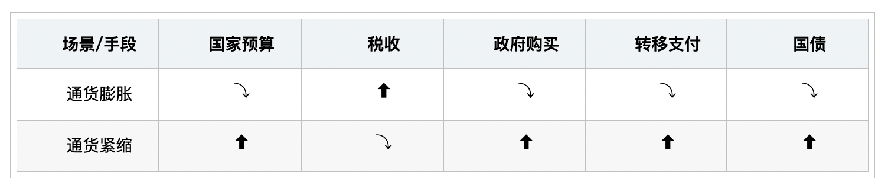
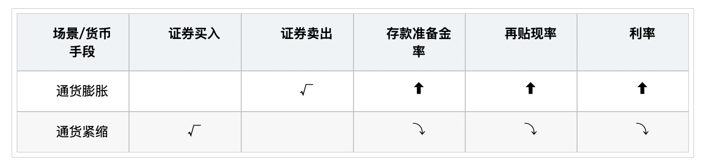
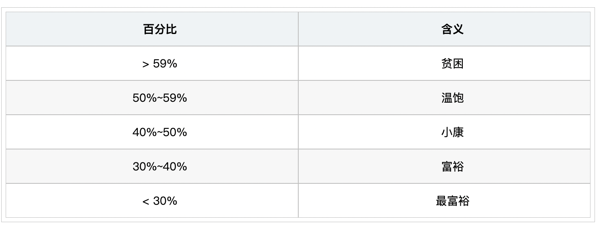

# 【经济学】宏观经济

`2023/03/26 22:55:57  by: 程序员·小李`

#### 宏观调控

> **“宏观调控”**：国家综合运用各种手段对`经济运行状态和经济关系`进行`干预、调整`
>
> 宏观调控由`约翰-梅纳德-凯恩斯`提出，被称为“宏观经济学之父”

#### 宏观调控的目标

> `促进经济增长`、`增加就业`、 `稳定物价`、保持国际`收支平衡`

> 【名词解释】常见的失业类型
> * 摩擦性失业：正常的流动
> * 🔥 结构性失业：劳动力供给和需求不匹配（职业、技能、产业、区域等）
> * 季节性失业：随着季节变化导致的失业，如农业和建筑业
> * 🔥 周期性失业：凯恩斯提出的失业类型，经济周期导致的失业。

> 【名词解释】
> * **通货膨胀**：货币发行量`超过`所需，导致物价上涨；`供不应求`导致。
> * **通货紧缩**：货币发行量`少于`所需。

> 【名词解释】
> * **国际收支顺差**：出口`大于`进口
> * **国籍收支逆差**：出口`小于`进口

#### 宏观调控政策

> * `经济`手段：财政政策、货币政策、收入分配政策、产业政策
> * `法律`手段：指定和实施经济法
> * `行政`手段：通过行政指令、指示、规定、指标、禁止、整顿等，最有强制力的手段

#### 财政政策

> 利用`国家预算`和`税收`等政策，对国民收入`分配和再分配`，实现供需平衡。主要包含财政收入和财政支出。

> 财政收入：政府所需要的资金的总和。
> * 税：税收，具有强制性、无偿性、固定性，`最主要`的收入部分。
> * 利：利润，包括利润、租金、股息、红利、资金使用费等收入。
> * 债：公债，弥补财政赤字的手段，对方释放国债或地方公债。
> * 费：费用，提供公共服务时收取一定的费用，如高速公路的过路费。

> 财政支出：用于各方面的支付。
> * 政府购买：对商品的购买，如军装、政府办公用品、工资、项目支出等，属于实际交易，花出去可以得到`等价补偿`。
> * 转移支付：对社会福利的支出，如社保、卫生保健支持、失业救济等，属于`无偿支付`。

#### 财政政策分类

> **扩张性财政政策**：增加、刺激社会总需求（适用于经济萧条)
>
> **紧缩性财政政策**：减少、抑制社会总需求（适用于通货膨胀） 
>
> **中性财政政策**：保持中性。

#### 货币政策

> 中央银行是最高的货币金融管理机构，管理全国金融活动，实施货币政策影响经济，我国的央行是`中国人民银行`。
> * 发行国家的货币
> * 为商业银行提供贷款、集中管理存款准备金、集中办理全国的结算业务。
> * 代理国库，提供政府所需的资金，代表政府与外国发生金融业务关系，执行货币政策。

> 货币政策工具：
> * **公开市场业务**：通过`买卖有价证券`，调整货币的供应量。
> * **存款准备金率**：商业银行按比例提取一部分存款存到央行，这个比例叫做存款准备金率。
> * **再贴现率**：商业银行将其贴现的未到期票据向央行申请再贴现时预扣的利率。
> * **利率**：利息和本金的比率，包括存款利率和贷款利率。

> 利率是国家的`宏观调控`手段，提高利率能吸储

#### 汇率

汇率降低，增加出口，抑制进口；汇率增高，增加进口，抑制出口。

> * 直接标价(常用)：1美元=6.76人民币
> * 间接标价：1人民币=19.98日元

#### GDP

> 国内生产总值（GDP）：`一定时期`内一个`国家`或地区生产出的全部`最终产品`和`劳务`的价值。用来衡量`经济状态`的最佳指标，反映国力和财富。
>
> GDP = C + I + G + NX
> * C: 老百姓消费水平
> * I: 外国或中国企业、公司在中国境内的投资
> * G: 政府消费
> * NX: 净出口，等于出口总额-进口总额 

#### CPI

> 消费者物价指数（CPI）：居民生活有关的商品及劳务价格变动的指标，用于观察通货膨胀情况，警戒值为3%，大于警戒值视为通货膨胀。

#### 财政赤字

>政府收入大于支出叫做财政盈余，收入小于支持叫财政赤字。赤字增加容易导致通货膨胀。
>
> 赤字率 = 财政赤字 / GDP * 100%
>
> 警戒值为3%
>
> 弥补财政赤字的方法：动用历年结余；增加税收；增发货币；发行公债（最佳）。

#### 基尼系数

收入分配差异的程度表示，最大为1，最小0，越大收入差距越大，警戒值0.4

#### 恩格尔系数

>食品支出占总支出的百分比，表示生活水平的高低。恩格尔系数与生活水平成反比。
>
> 恩格尔系数 = 食品支出 / 总支出 * 100%

进行比对时，需要综合考虑消费品价格比价不同，居民生活习惯，社会经济制度差异等。