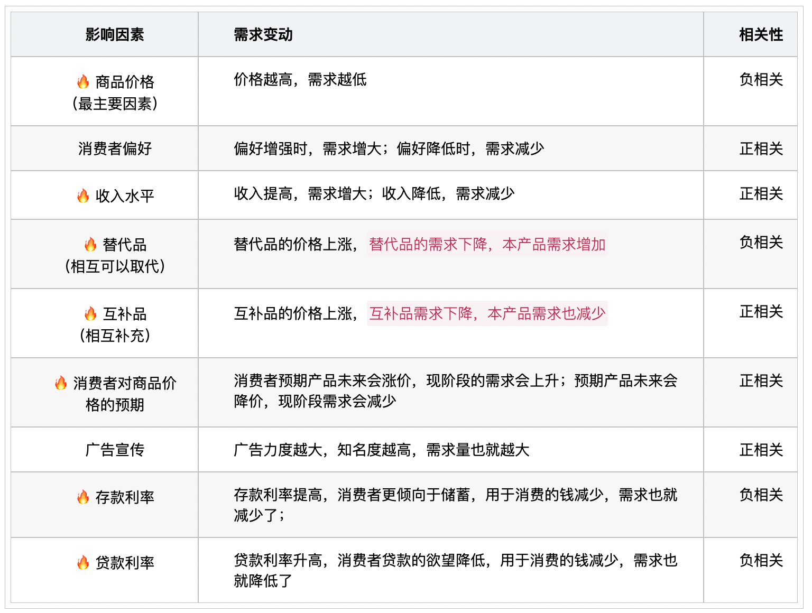
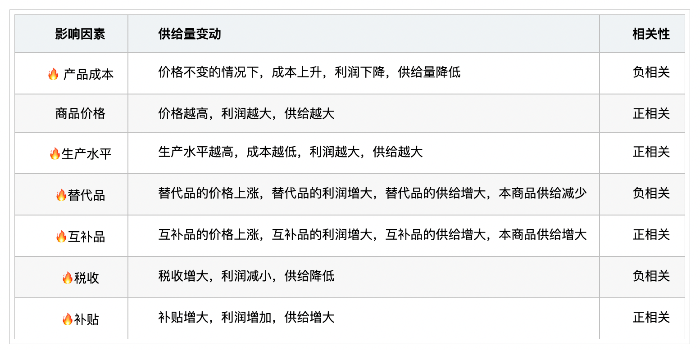

# 【经济学】微观经济

`2023/04/12 18:23:37  by: 程序员·小李`

#### 经济人假定

> 经济人是理性的人，是利己主义者，力图以最小的代价`追求最大的利益`。

#### 需求及影响因素

> 需求：一定的时期内`愿意`并`能够`购买某种商品的数量。

#### 需求法则

> **需求法则**：其他条件不变的情况下，商品或服务的`需求量与价格成反比`（价格越高，需求越低）。

> **需求价格弹性**：价格变化引起需求变化的大小。
> * 需求缺乏弹性：价格变动很大都不能引起需求的变化。（不敏感）
> * 需求富有弹性：价格稍有变化，需求就会有很大的变化。（很敏感）

> **需求收入弹性**：收入变动引起需求变化的大小。
> * 正常品：收入提高，需求变大的商品是正常品。如果需求上升幅度大于收入增加的幅度（收入很大程度影响这种产品的需求量），是`奢侈品`；如果需求上升幅度小于收入增加的幅度（说明收入提高很多，也不会买太多），是`必需品`；
> * 劣等品：收入提高，劣等品的需求变少。

#### 影响供给的因素

#### 供给法则

> 供给法则：供给量随价格上涨而增大，与价格正相关。

#### 需求法则相关名词

> **总效用**：消费一定量的物品所得到的满足程度。（满足感）
>
> **边际效用**：消费量每增加一个单位，满足感提升的增加量。（满足感的加速度）
>
> 🔥 **边际效用递减**：随着消费数量的增加，边际效用是递减的。（同样的消费量，一开始会比较有满足感，后面满足感逐次降低）

#### 供给法则相关名词

> 🔥 **边际成本**：在一定的产量下，增加单位产量，所增加的成本大小。一般而言，随着产量增大，边际成本降低，也就是规模经济。
>
> 🔥 **机会成本（择一成本、替代性成本）**：面临多种方案选其一，`被放弃的方案`中所能获得的最大利益，叫做机会成本。
>
> **沉没成本**：`已经付出无法回收`的成本。
>
> 🔥 **边际收益（产量）递减**：其他因素不变的情况下，把一种可变的生产要素连续投入生产，前期可能会带来很好的产量增加，后期收益下降。

#### 🔥 市场的类型

* 完全竞争市场：公平竞争，大家都没有控制力，`商品等质`，信息完全，进出市场`自由`。
* 垄断竞争市场：存在`不同品质的商品`，存在竞争因素、垄断因素，常出现在轻工业领域。进出市场`相对容易`。
* 寡头垄断市场：`少数几个厂商控制市场`，入场困难，常出现在重工业领域。产品同质的叫纯粹寡头，产品异质的叫差别寡头。
* 完全垄断市场：`整个行业就一个厂商`，无替代品，不允许新的厂商入市，常出现在公用事业。

#### 🔥 市场失灵

市场失灵就是市场不再能够很好起到资源配置的作用。

1. `垄断`：一旦发生垄断，资源牢牢掌握在少数人的手中，控制产量，打破供求关系（供不应求），就会出现价格上涨，市场调节失效。
2. `外部性`：外部的经济活动会对其他人带来影响，分为正外部性（为他人带来利益）和负外部性（为他人带来坏的影响）
3. `公共物品`：公共物品或服务是非竞争、非排他的，容易出现搭便车的情况，因此也不会出现公用产品进入市场交易，一般由政府提供。
4. `信息不对称`：信息不对称容易导致信息差，交易各方掌握的信息不一致，容易出现劣币驱逐良币、逆向选择等现象。

#### 其他

公司制的核心是：`企业法人治理结构`

资源的稀缺性是指：相对于人类社会无穷尽的欲望，资源总是不足的。

`生产的外部经济、生产的外部不经济、消费的外部经济、消费的外部不经济`：生产的还是消费的，指的是行为来自生产者还是消费者；外部指的是行为的外部性，对他人产生好的或不好的影响；经济与不经济，指的是是他人受益或受损

>**黑天鹅事件**：非常难以预测，通常会引起市场的连锁负面反应。
>
>**灰犀牛事件**：可以预测的、大概率发生的、潜在的危机。
>
>**独角兽**：有发展前景、速度快、是投资目标的企业。
>
>**老鼠仓**：金融领域中，基金经理在利用公共资金拉升股价前，自己在低位建仓，待股价提升后，率先抛售获利的仓位。

**吉芬效应**：某些产品在价格上升时，销量增加；价格下降时，销量减少；`买贵不买贱，买涨不买落`的现象。

>**路径依赖**：技术演进或制度变迁有惯性，一般会在同一方向持续强化，轻易不会发生改变。
>
>**价格歧视**：商品或服务的提供者在向不同的接受者提供相同等级、相同质量的商品或服务时，在接受者之间实行不同的销售价格或收费标准。价格歧视区分为三个等级：一级价格歧视，又称完全价格歧视，就是`每一单位产品都有不同的价格`，即假定垄断者知道每一个消费者对任何数量的产品所要支付的最大货币量，并以此决定其价格。二级价格歧视是指垄断厂商`按不同的价格出售不同单位的产品`，但是购买相同数量产品的每个人都支付相同的价格。三级价格歧视即对于同一商品，完全垄断厂商`根据不同市场上的需求价格弹性不同`，实施不同的价格。
>
>**劣币驱逐良币**：劣质商品逐步替代优质商品。（信息不对称导致）
>
>**边际变动**：许多决策涉及对现有行动计划进行微小的增量调整。

**挤出效应**：增加政府投资对私人投资产生的挤占效应,增加政府投资所增加的国民收入可能因为私人投资减少而被全部或部分地抵消。 

**替代效应**：由商品的价格变动所引起的`商品相对价格的变动`，进而由商品的相对价格变动所引起的`商品需求量`的变动。

**收入效应**：由商品的价格变动所引起的`实际收入水平变动`，进而由实际收入水平变动所引起的`商品需求量`的变动。

**外部效应（外部性）**：指一个人或一群人的行动和决策使另一个人或一群人受损或受益的情况。

> **营销一体化**：在市场竞争加剧和战略调整条件下，在产品的设计、分销、促销、地面保障、客户服务、客户维系等方面，围绕产品的设计价值，通过调整内部营销单元的资源配置和营销标准，以有效的价值链运作方式提升营销竞争力，并产生、维持和扩大公司运作所需的资金和资本。
>
>**差异性市场营销**：企业把产品的整体市场划分为若干个细分市场，针对各个细分客户市场的需要而刻意设计适合他们的产品和服务，并在渠道、促销和定价等方面有相应的改变，以适应各个分市场的需要。
>
>**无差异性营销策略**：企业将产品的整个市场视为一个目标市场，用单一的营销策略开拓市场，即用一种产品和一套营销方案吸引尽可能多的购买者的营销策略。
>
> **集中市场营销**：企业选择一个细分市场，并对之进行密集的营销活动，这种方式特别适合于企业资源有限的情况，根据这种战略，企业将放弃一个市场中的小份额，而去争取一个或几个亚市场中的大份额。

`倾销`是指一国（地区）的生产商或出口商低于其`国内市场（或成本）的价格`出口

🔥 垄断竞争市场与完全竞争市场的根本区别是`产品差别`

充分的市场竞争有以下作用：
1. 对生产经营者形成外在压力，使其改进技术，提高效率。
2. 保证价格灵敏性，调整供求关系，优化资源配置

与货币市场相比，**资本市场**特点主要有：（1）`融资期限长`：时间至少在1年以上，最长可达几十年，甚至无到期日。（2）`流动性相对较差`：筹到的资金多用于解决中长期融资需求，因此流动性相对较弱。（3）`风险大而收益较高`：因融资期限较长，在融资期间发生重大变故的可能较大，投资者需承担的风险较大；同时，作为对风险的报酬，其收益也较高。（4）`资金借贷量大`。（5）`价格变动幅度大`。

金融市场在市场中发挥的作用，主要体现在：促成金融资产的买卖交易、提高金融证券的流动性、发挥中央银行宏观调控作用、为市场货币供应创造条件。

🔥 科层制组织指的是一种权力依职能和职位进行分工和分层，以规则为管理主体的组织体系和管理方式。产生科层组织的原因有三个，分别为：`企业规模扩张`、`专业化分工区域强化`、`市场内部化要求`。

🔥 自主品牌，是指由企业自主开发，拥有自主知识产权的品牌。它有三个主要衡量因素：`市场保有量、生产研发的历史及其在整个行业中的地位`。

🔥 市场主体成熟的标志之一就是`企业之间地位是否平等`。 

经济学上常把`投资、消费、出口`比喻为拉动GDP增长的“三驾马车”  

供求机制的直接作用具体表现为：第一，调节总量平衡。供不应求时，价格上涨，从而吸收更多的投资；供过于求时，一部分商品的价值得不到实现，迫使部分滞销企业压缩或退出生产。第二，调节结构平衡。供求机制通过“看不见的手”使生产资料和劳动力在不同部门之间合理转移，导致经济结构的平衡运动。第三，调节地区之间的平衡。它促使统一大市场的各个地区调剂余缺，互通有无，使总量平衡和结构平衡得到具体落实。第四，调节时间上的平衡，它促使部分劳动者从事跨季节、跨时令的生产经营活动（如温室种植、跨季节仓储等），在一定程度上满足了市场需求，缓解了供求矛盾。

竞争机制是市场竞争与价格、供求等因素之间相互制约和联系而发挥作用的机制，是通过竞争实现优胜劣汰的一种内在功能。在市场经济中，商品价值由社会必要劳动量决定，生产条件好、技术先进、管理有序的企业产品质量好、成本低，因而产品销路好、获利多；而落后企业产品质量差、成本高，销路就差、获利就少，最终优者胜，劣者被淘汰。

风险机制是市场机制的基础机制。在市场经营中，任何企业在从事生产经营中都会面临着盈利、亏损和破产的风险。价格机制能影响风险机制，价格涨落能推动企业敢冒风险，去追逐利润。

LAC为**长期平均成本**，是一条U型的曲线；如果一个企业经历规模报酬递减的阶段,则 LAC 曲线是上升的；如果一个企业经历规模报酬递增的阶段,则 LAC 曲线是下降的；如果一个企业经历规模报酬不变阶段,则 LAC 曲线是水平的。