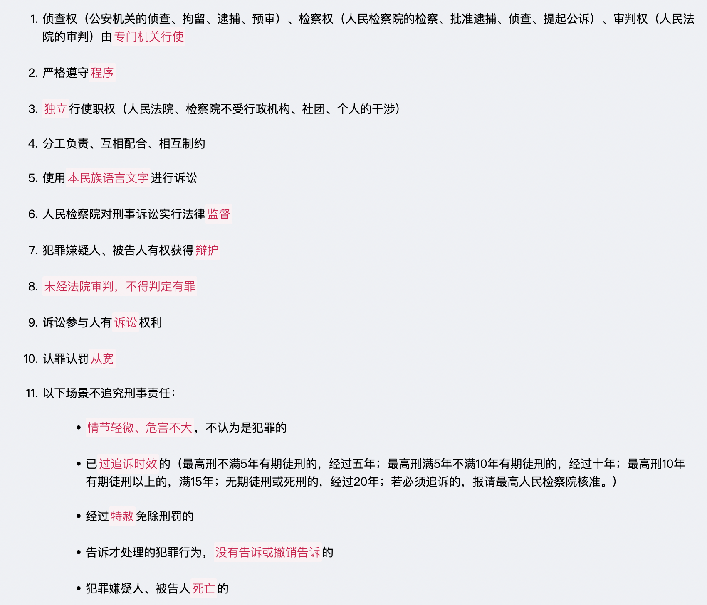
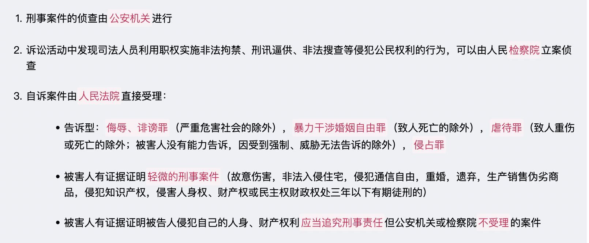
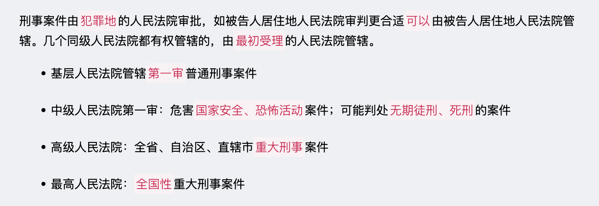
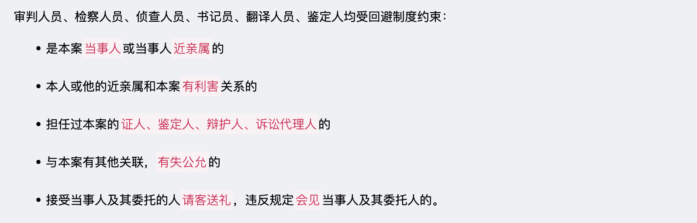
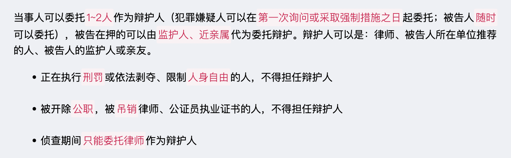
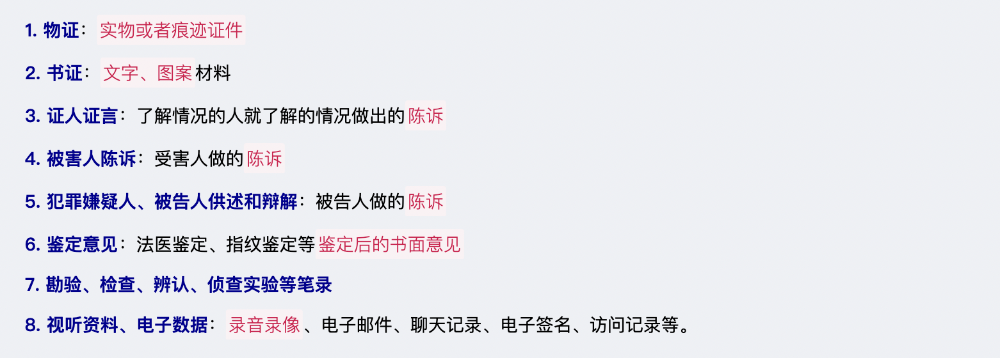
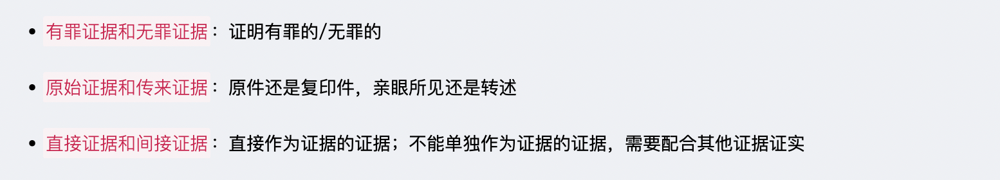
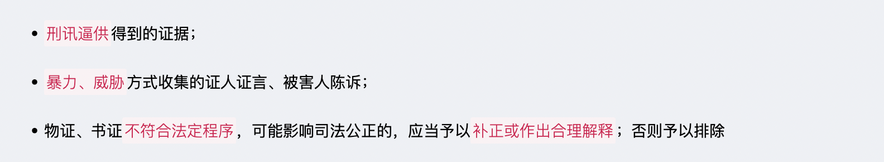
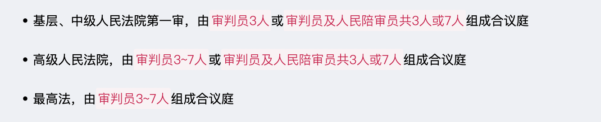
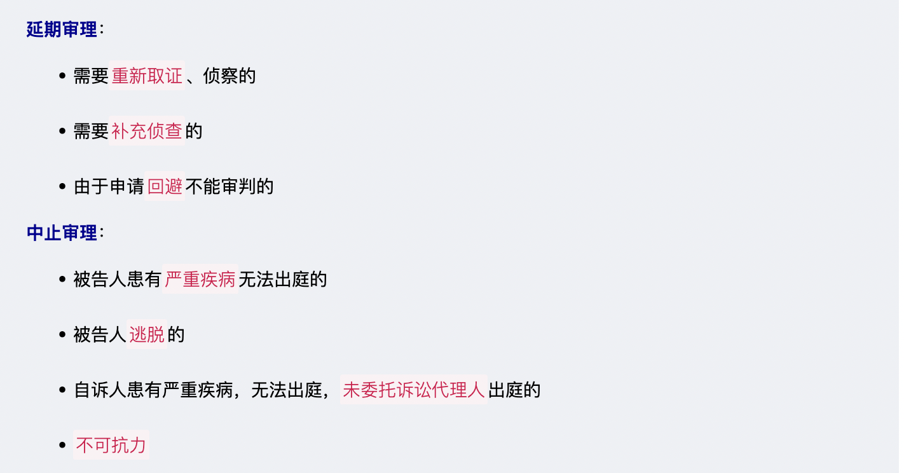

# 【诉讼法】刑事诉讼法

`2023/03/29 22:51:26  by: 程序员·小李`

#### 刑事诉讼基本原则

#### 刑事案件立案管辖

#### 刑事案件审判管辖

#### 回避制度

#### 委托辩护

#### 指定辩护

#### 证据的类型（谁起诉谁举证）

#### 证据的分类

#### 非法证据

#### 刑事强制措施

#### 刑事案件一审

#### 刑事案件简易程序

#### 刑事案件速裁程序

#### 二审提起

#### 二审审理

#### 刑罚

