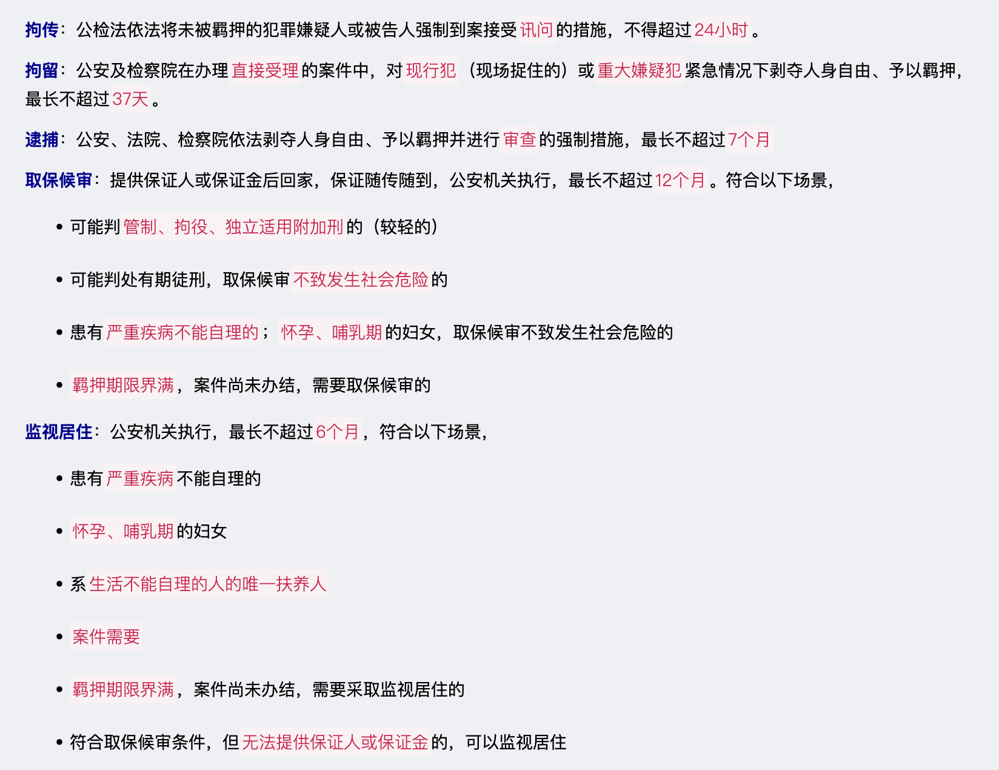
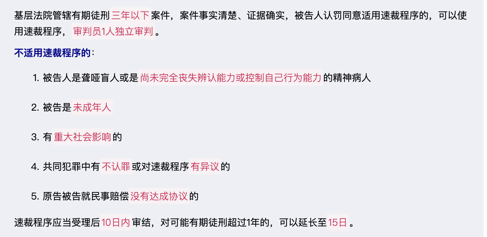
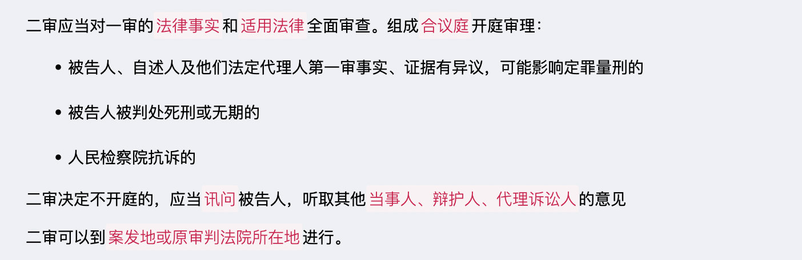
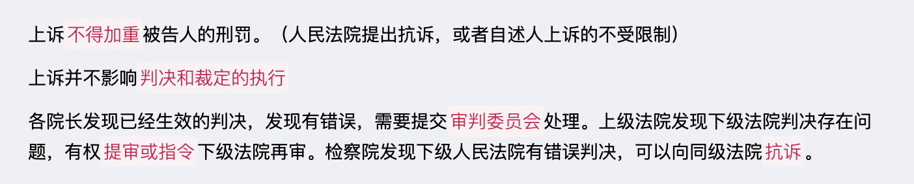
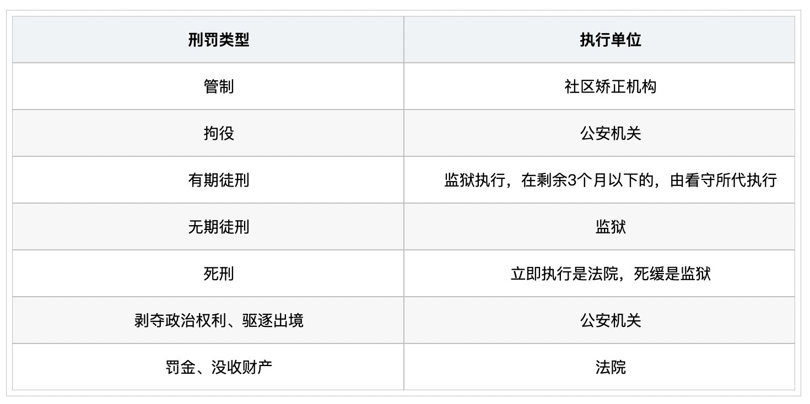

# 【诉讼法】刑事诉讼法

`2023/03/29 22:51:26  by: 程序员·小李`

#### 刑事诉讼基本原则

1. 侦查、检察、审判由专门的机关行使
2. 一切均需遵循法定程序
3. 🔥 人民法院、检察院行使权力时，不受行政机构、社团、个人的干涉
4. 公安机关、法院、检察院之间相互配合、互不干涉
5. 允许少数民族使用自己的语言文字诉讼，相关机关需要提供帮助。
6. 人民检察院对刑事案件具有监督权
7. 🔥 犯罪嫌疑人、被告人有辩护的权利
8. 🔥 未经法院审判，不得判定有罪
9. 诉讼参与人有诉讼的权利
10. 认罪认罚从宽

> 📚 侦查、检察、审判
>
> 侦查权：`公安机关`实施案件侦查、拘留、逮捕、预审等
>
> 检察权：`人民检察院`的检察、批准逮捕、侦查、公诉
>
> 审判权：`人民法院`进行的审判

> 为了查明案情，必要时，经`公安机关负责人决定`，可以由有关人员`隐匿身份实施侦查`，但不得诱导他人犯罪，不得采用可能危害公共安全或者发生重大人身危险的方法。

#### 不追究刑事责任的情形

1. 情节轻微，危害不大，不认为是犯罪的（需认定是犯罪）
2. 已过追诉时效的
3. 已经被特赦的
4. 经告诉才处理的场景中，没有告诉或撤诉的（不告诉不处理）
5. 犯罪嫌疑人、被告死亡的（人死为大）

> 📚 追诉时效：超过追诉期不予追诉，必须追诉的，需要`最高人民检察院`核准
>
> * 最高刑不足5年有期徒刑，经过5年的
> 
> * 最高刑满5年不足10年，经过10年的
>
> * 最高刑10年有期徒刑以上，经过15年的
>
> * 无期或死刑，经过20年的

#### 刑事案件立案管辖

刑事案件的侦查工作`一般由公安机关执行`；

人民检察院发现`司法人员存在非法拘禁、刑讯逼供、非法搜查等侵权行为`，可以由`人民检察院`立案侦查；

`自诉案件`，由人民法院直接受理；

> 📚 人民法院受理的自诉案件：
>
> * 告诉型：侮辱、诽谤（严重危害社会的除外）、暴力干涉婚姻自由（致人死亡的除外）、虐待（致人重伤或死亡的除外，被害人没有告诉能力的除外，受威胁无法告诉的除外）、侵占罪
>
> * 有证据证明的轻微刑事案件（故意伤害、非法入侵住宅、侵犯通信自由、重婚、遗弃、生产销售伪劣商品、侵犯知识产权、侵犯人身权、侵犯财产权、侵犯民主权、侵犯财政权，可能判处三年以下有期徒刑的）
>
> * 有证据证明被侵犯人身或财产权，但公安机关、检察院不受理的案件

#### 刑事案件审判管辖

刑事案件由`犯罪地（含预备地、发生地、结果地、销赃地）`的人民法院管辖，如被告人居住地的法院审判更合适可以由其管辖。

几个同级人民法院均有管辖权的，由`先受理的`人民法院进行管辖。

> 基层人民法院第一审普通刑事案件
>
> 中级人民法院第一审涉及国家安全、恐怖活动的案件，可能判处无期、死刑的案件
>
> 高级人民法院第一审全省、自治区、直辖市重大刑事案件
>
> 最高人民法院第一审全国性重大刑事案件

#### 回避制度

🔥 涉及人员：`审判员、检察员、侦查人员、书记员、翻译人员、鉴定人员`

涉及回避的关系：
1. 是`当事人`或当事人`近亲属`的
2. 与本人或近亲属`有利害关系`的
3. 担任过本案的`证人、鉴定人、辩护人、诉讼代理人`的
4. 与本案有其他关联，`可能有失公允的`
5. 接受当事人或其委托人`请客送礼`，`违反规定会见`当事人或其委托人的

#### 委托辩护

当事人可以委托1-2人进行辩护（犯罪嫌疑人在首次被询问或采取强制措施之日起委托，被告人可以随时委托），在押人员可以由近亲属或监护人委托辩护。

> 📚 可以作为辩护人：
> * 律师
> * 被告人所在单位的推荐人
> * 被告人的监护人或亲友

> 📚 不可以作为辩护人：
> * 正在执行`刑罚`、依法`剥夺或限制人身自由`的人
> * 被开除`公职`、被`吊销律师证`、被`吊销公证员执业证书`的人
> * `侦查期间`仅可委托`律师`进行辩护

#### 指定辩护

以下场景没有委托辩护人的，由人民法院、检察院、公安机关通知法律援助机构指派律师辩护：
1. 被告是聋、哑、盲人，或尚未丧失辨认能力或控制能力的精神病人
2. 被告`可能判处无期、死刑`的
3. `未成年人`犯罪的
4. 缺席审判案件，被告人及其亲属没有委托辩护人的

#### 证据的类型（谁起诉谁举证）

物证：实物、痕迹

书证：文字、图案材料

证人证言：了解情况的人就了解的事实进行的陈述

被害人陈述：受害人做出的陈述

犯罪嫌疑人、被告人供述或辩解：被告人的陈述

鉴定意见：法医鉴定、指纹鉴定等鉴定书面意见

勘验、检查、辨认、侦查实验等笔录

视听材料、电子数据：录音录像、聊天记录、电邮、电子签名、访问记录等

#### 证据的分类

有罪证据、无罪证据：能辅助证明有罪的，叫有罪证据；能辅助洗清嫌疑的，叫无罪证据

原始证据、传来证据：证据原件、实际证物等一手材料都是原始证据，证物图片、复制品都是传来证据。

直接证据、间接证据：能直接证明的叫直接证据，只能起到辅助作用的叫间接证据

#### 非法证据

刑讯逼供的证据

暴力威胁的方式收集的证人证言、被害人陈述

物证书证不符合法定程序，可能影响公正的，应当予以补正或做出合理解释，否则予以排除

#### 刑事强制措施

#### 刑事案件一审

基层人民法院、中级人民法院由`审判员3人`，或`审判员+人民陪审员3人`，或`审判员+人民陪审员7人`，组成合议庭

高级人民法院由`审判员3~7人`，或`审判员+人民陪审员3人`，或`审判员+人民陪审员7人`，组成合议庭

最高人民法院由`审判员3-7人`组成合议庭

#### 刑事案件延期审理

对以下场景，可以延期审理：
1. 需要重新取证、鉴定、勘验的
2. 需要补充侦查的
3. 由于申请回避不能审判的

#### 刑事案件中止审理

1. 被告患有严重疾病，无法出庭的
2. 被告人不在案，逃脱的
3. 自诉人患有严重疾病，无法出庭，未委托诉讼代理人的
4. 不可抗力

#### 刑事案件简易程序

#### 刑事案件速裁程序

#### 二审提起

#### 二审审理

#### 刑罚

