# 【诉讼法】民事诉讼法

`2023/03/30 20:44:53  by: 程序员·小李`

#### 诉讼的类型

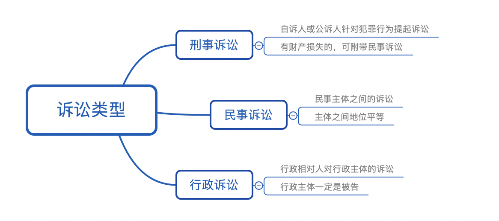

> 诉讼分为`民事诉讼、行政诉讼、刑事诉讼`三种。它们在案件性质、诉讼目的、提起诉讼的主体、诉讼内容和程序、适用法律等方面，均存在显著差异。

> 在刑事诉讼中，被害人遭受`物质损失`的，有权提起`附带民事诉讼`。如果是国家财产、集体财产遭受损失，由人民检察院提起附带民事诉讼。

#### 民事诉讼的原则

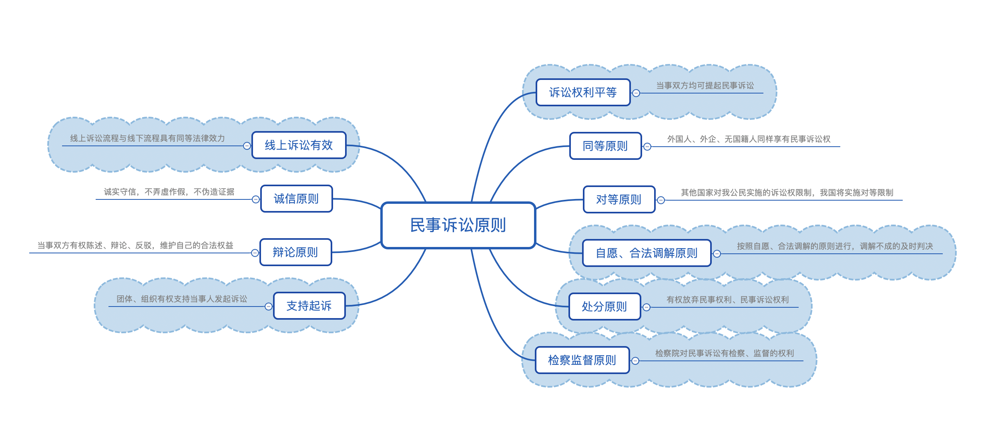

诉讼权利平等原则：双方当事人均有委托代理、申请回避、提供证据、请求调解、进行辩论、提起上诉、申请执行等权利。

#### 民事诉讼的基本制度

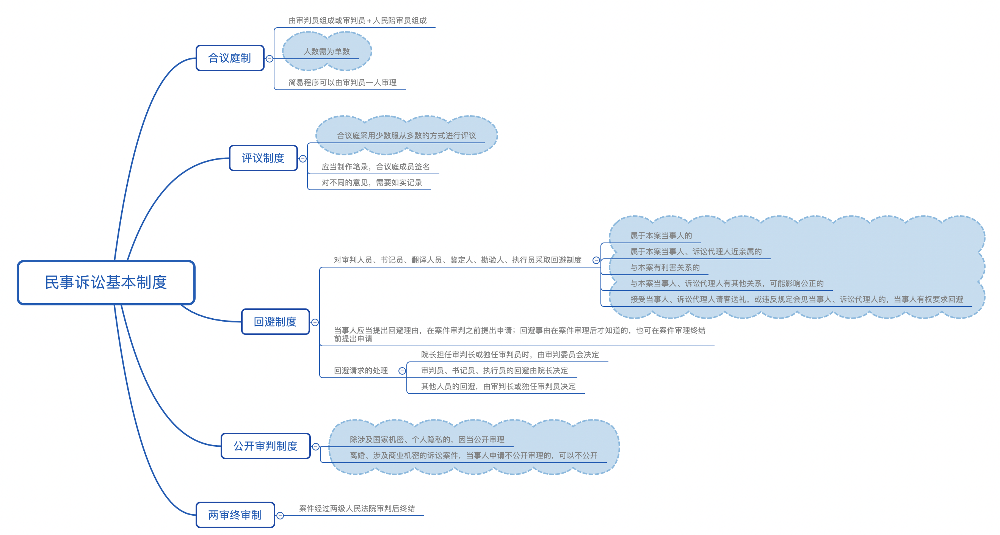

公开审判：除法律规定的情况外，审判过程与结果应当向群众、社会公开。

无论是否公开审判，`宣判结果一律公开`。

#### 民事诉讼的级别管辖权

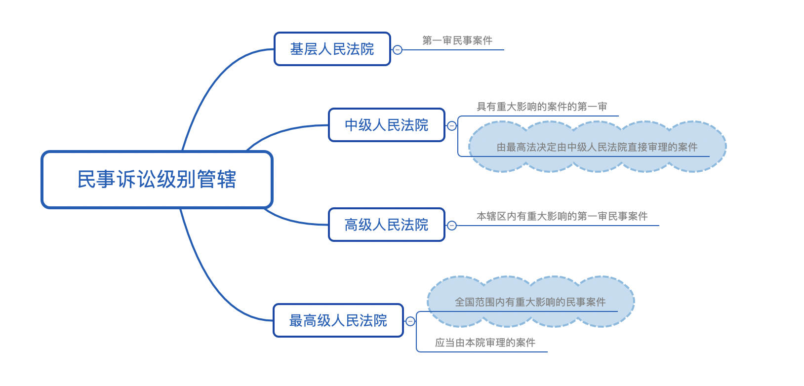

#### 民事诉讼的地域管辖权

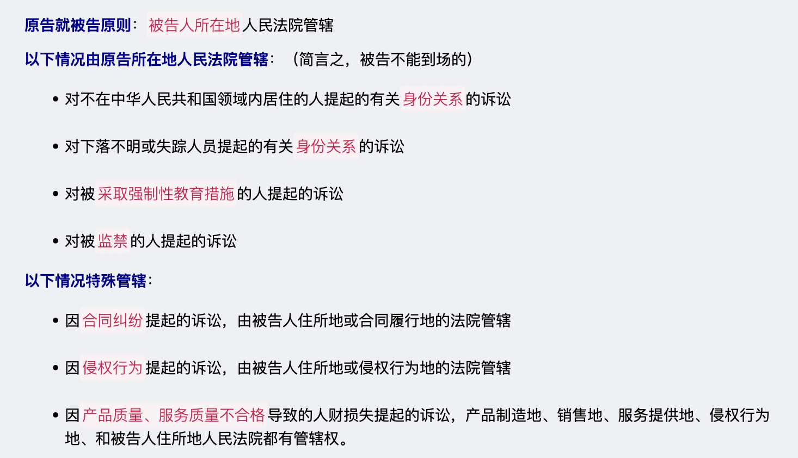

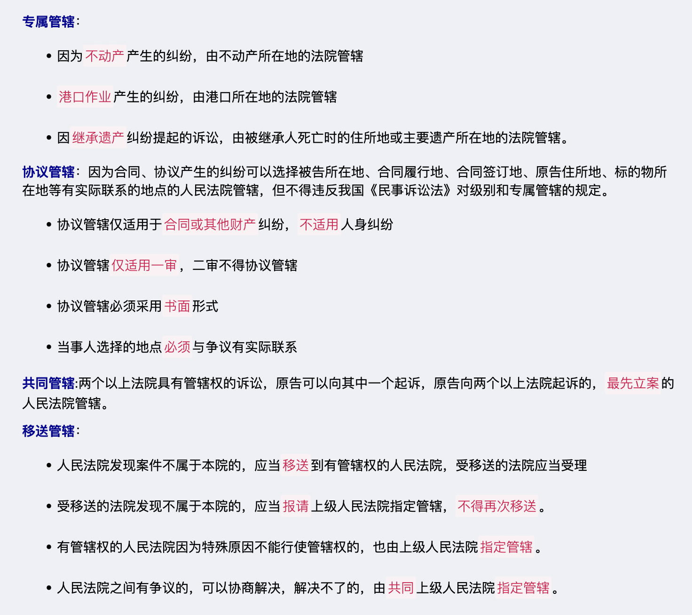

#### 民事诉讼的参加人

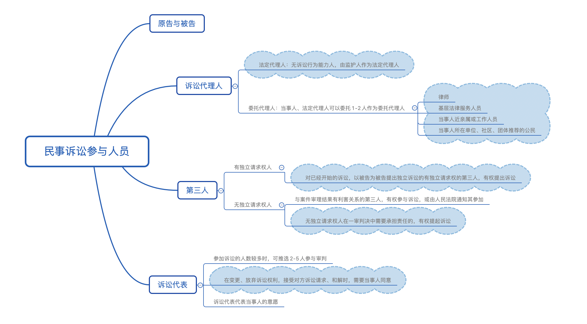

#### 证据类型

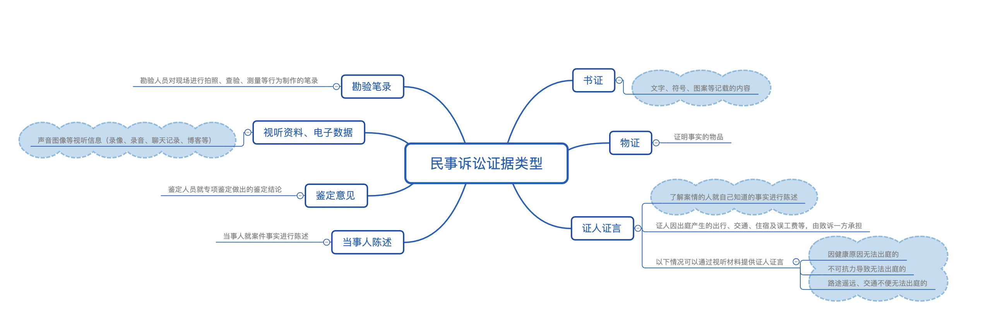

> 当事人对自己`提出的主张`，`需要给与证明`。因客观原因不能收集证据的，人民法院应当调查并收集。全面客观地审查核实证据。

#### 民事案件的和解、调解

> 当事人双方可以`自行和解`，达成和解协议。
>
> 也可以`调解`：
> * 原则：当事人自愿原则；查清事实、分清是非原则；合法原则
> * 主持：可以`审判员一人`主持，也可以`合议庭`主持
> * 结果：若达成协议应当`制作调解书`，写明诉讼请求、案件的调解结果，双方`签收后`具有法律效力。对`调解和好的离婚案件`、`调解维持收养关系的案件`、`能够及时履行`的案件`不制作调解书`。未达成协议的，或者调解书送达前一方反悔的，应当及时判决。

> 通过第三方的排解疏导、说服教育，促使发生纠纷的当事人自愿达成协议，从而解决纠纷的活动就是`调解`，包括人民调解、行政调解、仲裁调解、诉讼调解等。

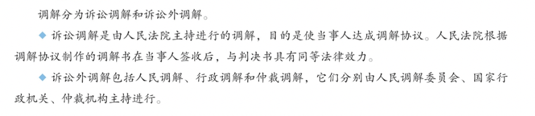

> **人民调解**是在`人民调解委员会`的组织下进行的调解，被誉为伟大的“东方经验”。人民调解要尊重当事人的权利，不得违背法律、法规和国家政策，不收取任何费用。双方当事人还可以自调解协议生效之日起三十日内共同向人民法院申请司法确认。经`人民法院依法确认有效`的调解协议，具有强制执行效力。

> **仲裁**是解决纠纷的一种有效途径，包括商事仲裁、劳动争议仲裁、农村承包合同纠纷仲裁等。当平等主体当事人之间发生`合同纠纷`或者其他`财产权益纠纷`时，双方可以将其提交仲裁机构进行商事仲裁。在商事仲裁与诉讼之间，当事人只能选择其一加以适用。
> * 当事人申请仲裁，须以双方自愿订立的有效仲裁协议为前提;
> * 仲裁程序比较灵活，仲裁审理一般不公开进行，而且`一裁终局`;
> * 仲裁裁决`一经作出，即发生法律效力`。

#### 保全与先予执行

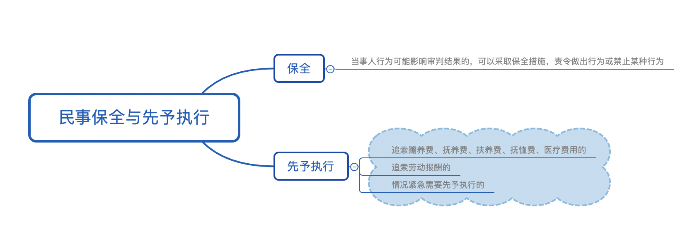

#### 一审普通程序

#### 简易程序与特别程序

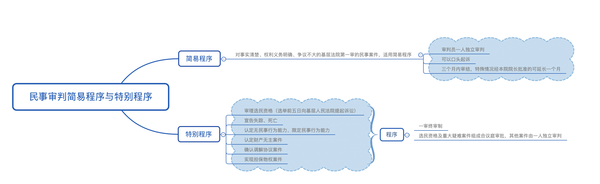

#### 二审

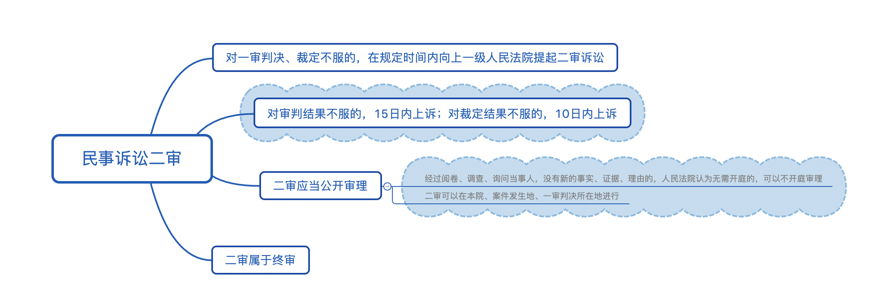

#### 再审

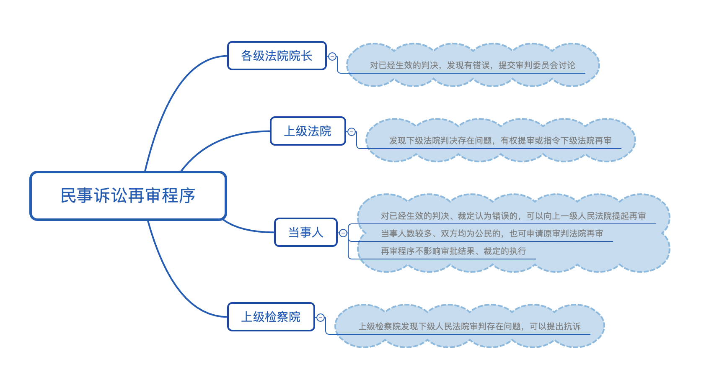

#### 其他

> * 被执行人未按判决、裁定和其他法律文书指定的期间履行`给付金钱义务的`，应当`加倍支付`迟延履行期间的`债务利息`。
>* 被执行人未履行其他义务的，应当支付`迟延履行金`。

人民法院对公开审理或者不公开审理的案件，`一律公开宣告判决`。但是无论是否公开审理民事案合议庭的`评议过程一律不公开`。

> 民事诉讼参与人包括：
>
>（1）诉讼参加人，包括当事人（原告、被告、共同诉讼人、第三人）和诉讼代理人（法定代理人、委托代理人）；
>
>（2）其他诉讼参与人（证人、鉴定人、勘验人员和翻译人员）。