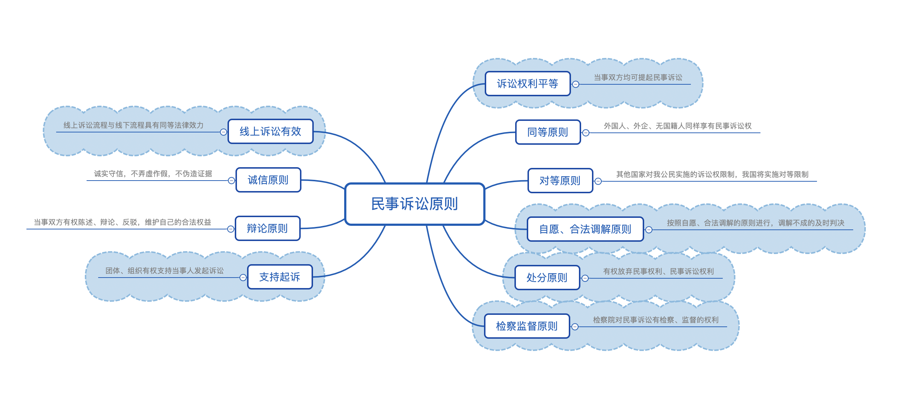
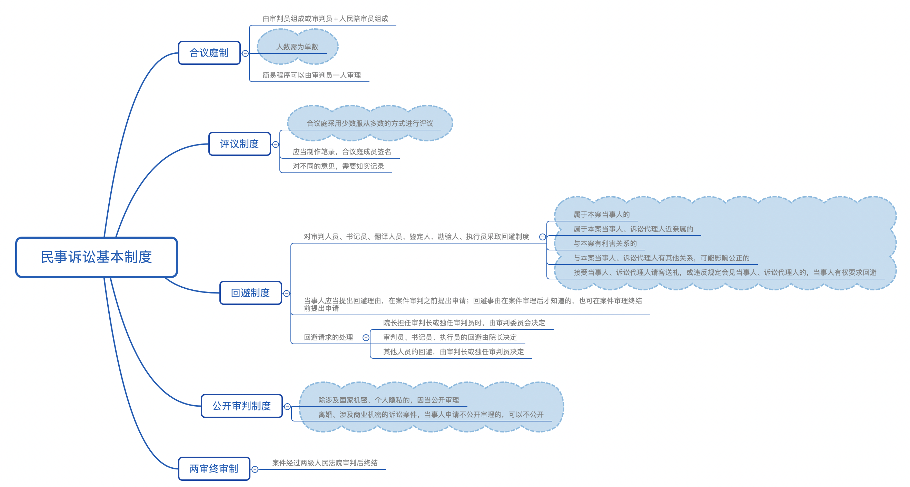
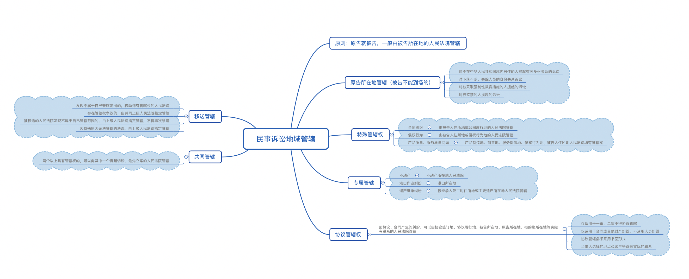
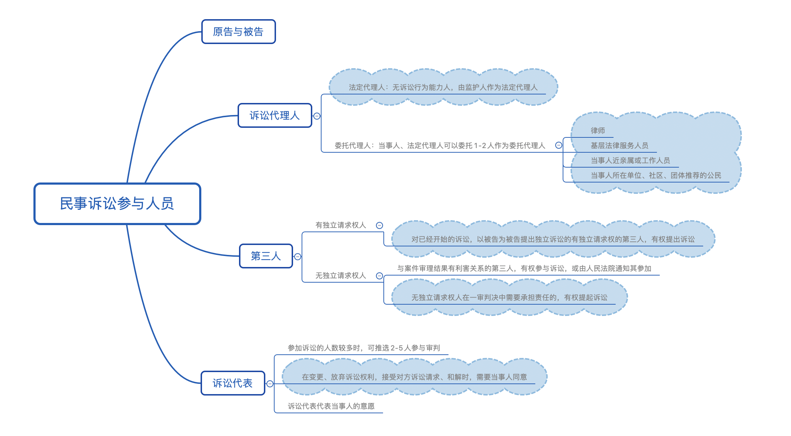
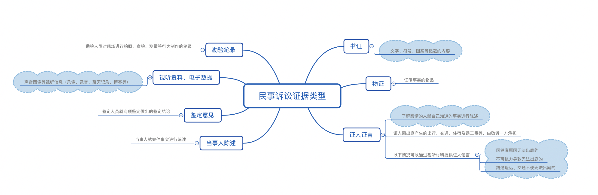
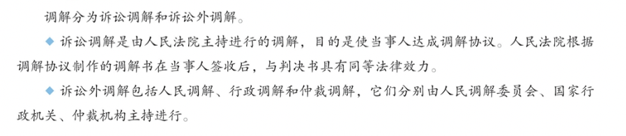
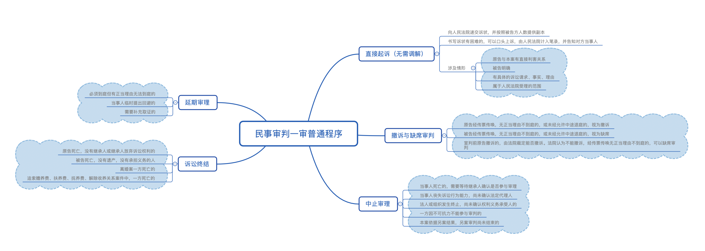
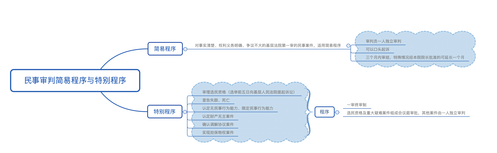

# 【诉讼法】民事诉讼法

`2023/03/30 20:44:53  by: 程序员·小李`

#### 诉讼的类型

> **刑事诉讼**：针对犯罪行为提起的诉讼
> 
> **民事诉讼**：民事主体之间的诉讼
> 
> **行政诉讼**：行政主体与相对人之间的诉讼（行政主体是被告）

> 在刑事诉讼中，被害人遭受物质损失的，有权提起`附带民事诉讼`。如果是国家财产、集体财产遭受损失，由人民检察院提起。

#### 民事诉讼的原则

诉讼权利平等原则：双方当事人均有委托代理、申请回避、提供证据、请求调解、进行辩论、提起上诉、申请执行等权利。

#### 民事诉讼的基本制度

公开审判：除法律规定的情况外，审判过程与结果应当向群众、社会公开。

无论是否公开审判，`宣判结果一律公开`。

#### 民事诉讼的级别管辖权

* 基层人民法院管辖本辖区内第一审民事案件
* 对`重大涉外案件`、具有`重大影响`的案件第一审、由`最高法指定`由中级人民法院直接审理的案件，由中级人民法院审理
* 高级人民法院审理本辖区`重大影响`的第一审民事案件
* 最高人民法院审理`全国`范围内有重大影响的民事案件。

#### 民事诉讼的地域管辖权

#### 民事诉讼的参加人

#### 证据类型

> 当事人对自己`提出的主张`，`需要给与证明`。因客观原因不能收集证据的，人民法院应当调查并收集。全面客观地审查核实证据。

#### 民事案件的和解、调解

> 当事人双方可以`自行和解`，达成和解协议。
>
> 也可以`调解`：
> * 原则：当事人自愿原则；查清事实、分清是非原则；合法原则
> * 主持：可以`审判员一人`主持，也可以`合议庭`主持
> * 结果：若达成协议应当`制作调解书`，写明诉讼请求、案件的调解结果，双方`签收后`具有法律效力。对`调解和好的离婚案件`、`调解维持收养关系的案件`、`能够及时履行`的案件`不制作调解书`。未达成协议的，或者调解书送达前一方反悔的，应当及时判决。

> 通过第三方的排解疏导、说服教育，促使发生纠纷的当事人自愿达成协议，从而解决纠纷的活动就是`调解`，包括人民调解、行政调解、仲裁调解、诉讼调解等。

> **人民调解**是在`人民调解委员会`的组织下进行的调解，被誉为伟大的“东方经验”。人民调解要尊重当事人的权利，不得违背法律、法规和国家政策，不收取任何费用。双方当事人还可以自调解协议生效之日起三十日内共同向人民法院申请司法确认。经`人民法院依法确认有效`的调解协议，具有强制执行效力。

> **仲裁**是解决纠纷的一种有效途径，包括商事仲裁、劳动争议仲裁、农村承包合同纠纷仲裁等。当平等主体当事人之间发生`合同纠纷`或者其他`财产权益纠纷`时，双方可以将其提交仲裁机构进行商事仲裁。在商事仲裁与诉讼之间，当事人只能选择其一加以适用。
> * 当事人申请仲裁，须以双方自愿订立的有效仲裁协议为前提;
> * 仲裁程序比较灵活，仲裁审理一般不公开进行，而且`一裁终局`;
> * 仲裁裁决`一经作出，即发生法律效力`。

#### 保全与先予执行

当事人行为可能影响审判结果的，可以采取**保全**措施，责令做出行为或禁止某种行为。

对以下情况可以**先予执行**：
1. 追索赡养费、抚养费、扶养费、抚恤费、医疗费用的
2. 追索劳动报酬的
3. 情况紧急需要先予执行的

#### 一审普通程序

#### 简易程序与特别程序

#### 二审

对一审判决、裁定不服的，可以向上级人民法院提起诉讼。对审判结果不服的，`15日内`上诉，对裁定结果不服的，`10日内`上诉。

二审经过阅卷、调查、询问当事人，`没有新的事实证据、理由的`，人民法院认为无需开庭审理的，可以不开庭审理。

二审属于终审。

#### 再审

* `各级法院院长`对已经生效的判决发现错误，有权提交审判委员会讨论
* `上级法院`发现下级法院存在问题，有权提审要指令下级法院再审
* `当事人`对已经生效的判决、裁定不服，可以向上一级人民法院提起再审。双方均为公民且涉及人数较多时，也可申请原法院再审；再审程序不影响执行。
* `上级检察院`发现下级人民法院的判决存在问题，可以提出抗诉

#### 其他

> * 被执行人未按期`给付金钱的`，应当`加倍支付`迟延履行期间的`债务利息`。
>* 被执行人未履行其他义务的，应当支付`迟延履行金`。

民事案一律`公开宣告判决`，但合议庭的`评议过程`一律不公开。

未成年人遭受性侵害的损害赔偿请求权的诉讼时效期间，自受害人`年满十八周岁`之日起计算。
