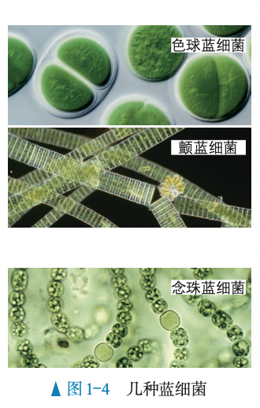
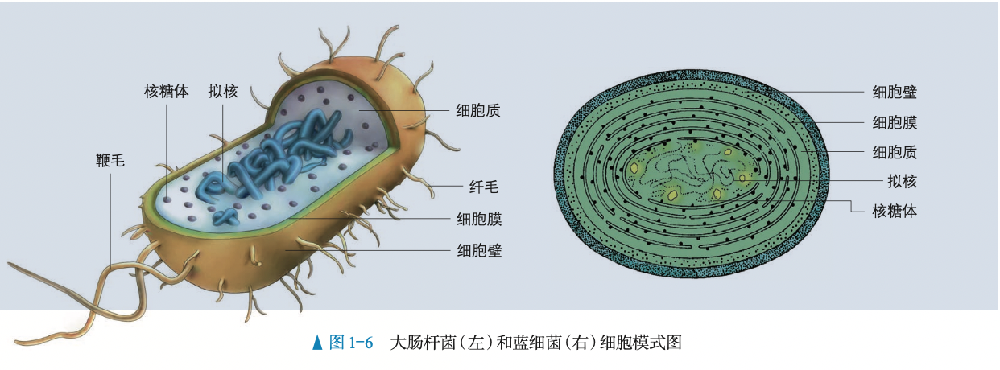
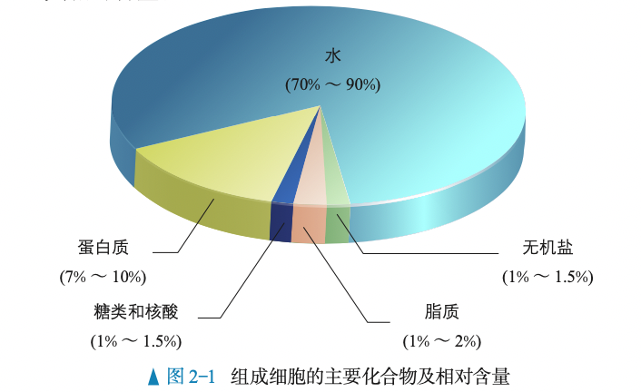
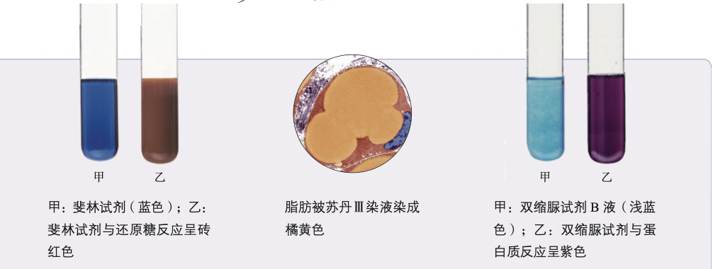
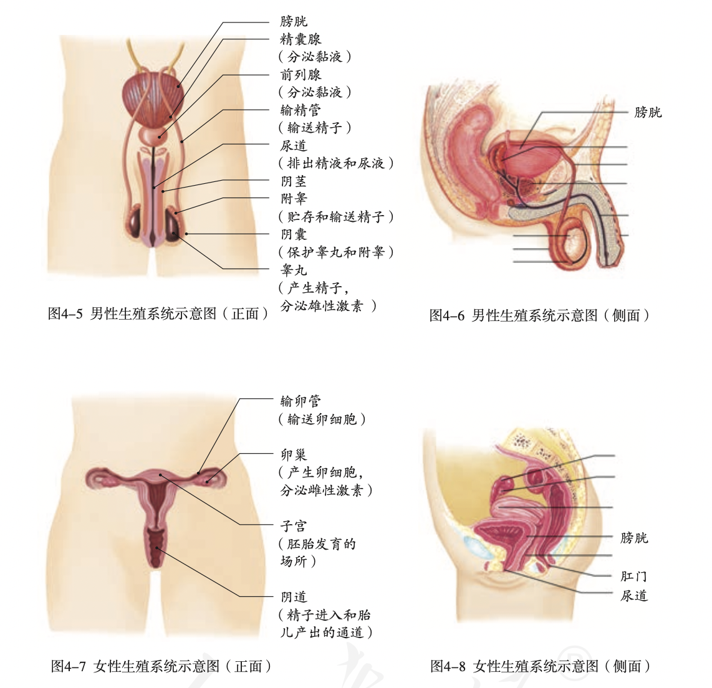
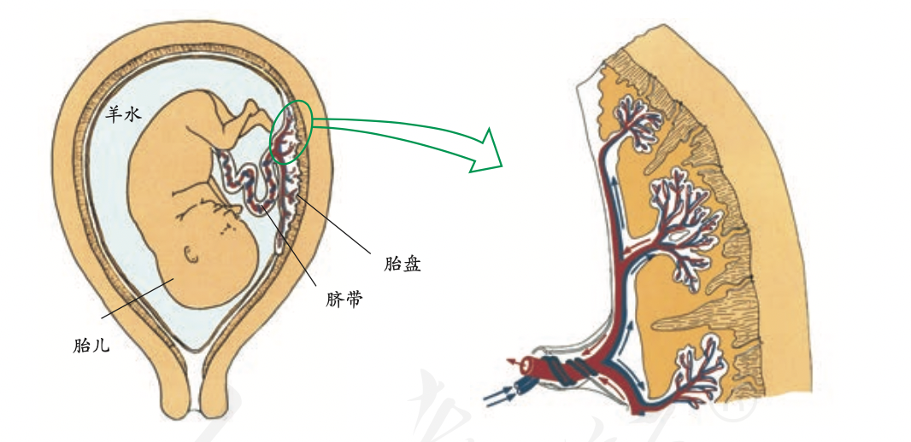
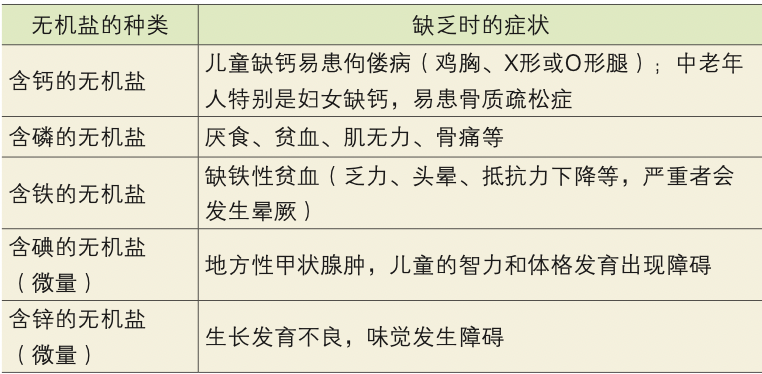
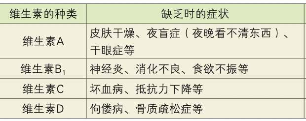
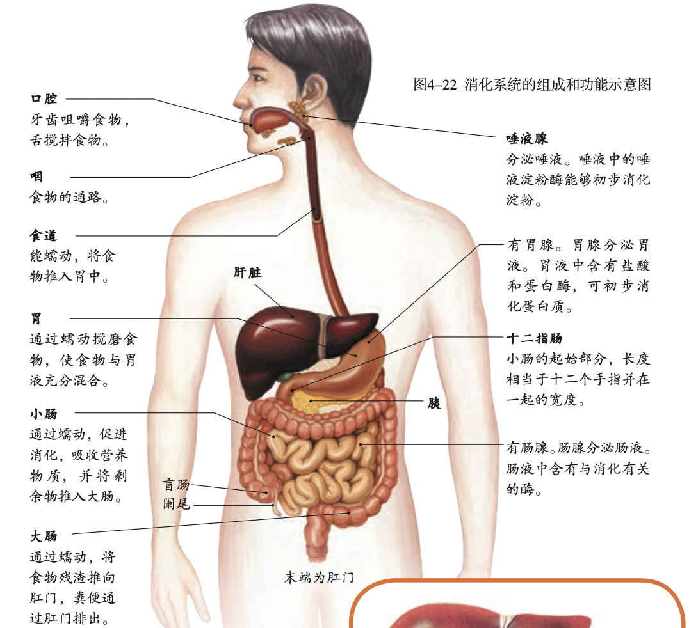
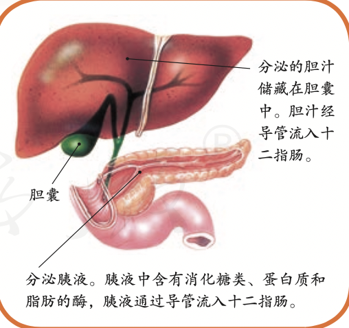

# 生物知识
`2023/07/24 22:11:18  by: 程序员·小李`

#### 生物的特征

1. 生物的生活`需要营养`
2. 生物能进行呼吸
3. 生物能排出体内的废物
4. 生物能`对外界刺激做出反应`
5. 生物能够进行生长和繁殖
6. 生物都有`遗传和变异`的特性
7. 除`病毒`外，生物都是由`细胞`构成的

#### 生物圈

`生物及其环境的组合`称为**生物圈**。生物圈的范围是大气圈的底部、水圈的大部、岩石圈的表面。

环境中影响生物`生活和分布`的因素叫做`生态因素`。

> 生态因素分为`生物因素`和`非生物因素`。非生物因素如阳光、空气、水等，生物因素指的是影响某种生物生活的其他生物。

生物与生物之间的关系包含`捕食、合作、竞争、寄生`等

#### 生态系统

一定的空间范围内，生物与其生存的环境共同构成**生态系统**。

生态系统中的生物部分包含**生产者、消费者、分解者**。非生物部分包含`阳光、空气、水`等。

> 植物可以通过光合作用`制造有机物`，因而是典型的`生产者`。动物不能制造有机物，只能直接或间接地以植物为食，因而是典型的`消费者`。`细菌、真菌`将有机物分解为无机物，充当`分解者`的角色。

生态系统中，由`吃与被吃的关系`构成的链状结构叫做**食物链**，错综复杂的食物链相互交错构成**食物网**。

生态系统具有`自净能力`（自我调节能力），使得各种生物和环境之间存在平衡和稳定，但这种自我调节能力是`有限度的`，超出限度就会破坏生态系统。

生物圈是`最大的生态系统`。

> 典型的生态系统
>
> 草原生态系统：多分布在干旱地区，没有高大的植被，草原具有保持水土、防风固沙的作用。
>
> 湿地生态系统：多水、过湿的条件下形成的，如沼泽。具有净化水质、蓄洪抗旱的作用。又被称为“地球之肾”
>
> 海洋生态系统：海洋中生活着很多微小的浮游植物，海平面能够`吸收大量二氧化碳`，海洋植物制造的氧气占70%
>
> 森林生态系统：分布在湿润的地区，动植物种类繁多。有调节气候、防风固沙、涵养水源、保持水土、净化空气的作用。称为“地球之肺”，“绿色水库”。
>
> 淡水生态系统：包含河流、湖泊、池塘等生态系统。对提供饮用水、灌溉、工业用水、调节气候有重要作用。
>
> 农田生态系统：以农作物为主，其他动植物很少。抵抗旱涝、病虫害的能力较差。
>
> 城市生态系统：以人为主，动植物很少。人口密集，排放的污染物较多，容易导致环境污染。

#### 细胞

> **细胞学说**
>
>德国科学家`施莱登`和施旺建立细胞学说，揭示了`动物和植物的统一性`，从而阐明了`生物界的统一性`。
>* 细胞是一个有机体，一切`动植物`都由细胞发育而来，并由细胞和细胞产物所构成;
>* 细胞是一个`相对独立的单位`，既有它自己的生命，又对与其他细胞共同组成的整体生命起作用;
>* 新细胞是由老细胞`分裂`产生的。

> **细胞观察史**
>
>1543年，比利时的`维萨里`通过大量的尸体解剖研究，指出器官由低一层次的结构——`组织`构成。
>
>1665年，英国科学家`罗伯特·胡克`用显微镜观察植物的`木栓组织`，发现这些木栓组织由许多规则的小室组成，他把观察到的图像画了下来，并把“小室” 称为 cell——细胞。
>
>荷兰著名磨镜技师`列文虎克`用自制的显微镜，观察到不同形态的`细菌、红细胞和精子`等。
>
>意大利的`马尔比基`用显微镜广泛观察了动植物的微细结构，如细胞壁和细胞质。
>
> 植物学家施莱登通过对花粉、胚珠和柱头组织的观察，发现这些组织都是由细胞构成的，而且细胞中都有细胞核。在此基础上，提出了`植物细胞学说`，即植物体都是由细胞构成的，细胞是植物体的基本单位，新细胞从老细胞中产生。 
>
> 施旺主要研究了动物细胞的形成机理和个体发育过程，他认为:动物体也是由`细胞`构成的，一切动物的个体发育过程，都是从`受精卵`这个单细胞开始的。
>
> 1858年，德国的`魏尔肖`总结出`“细胞通过分裂产生新细胞”`。他的名言是:“所有的细胞都来源于先前存在的细胞。”

> 📣 扩展知识
>
> 病毒`没有细胞结构`，一般由`核酸和蛋白质`组成。但是，病毒的生活离不开细胞，

> **细胞-组织-器官-个体**
>
>`细胞是生命活动的基本单位`，细胞是基本的生命系统。在多细胞生物体内，细胞又是构成组织的组分，组织是构成器官的组分，器官是构成个体的组分。组织、器官、个体都是有生命活动的整体，因此是不同层次的生命系统。

> **个体-种群-群落-生态系统-生物圈**
>
>在一定的空间范围内，`同种生物的所有个体`形成一个整体——种群，`不同种群`相互作用形成更大的整体——群落，群落与无机环境相互作用形成更大的整体——`生态系统`，地球上所有的生态系统相互关联构成更大的整体——`生物圈`。

> **显微镜使用**
>
> 转动反光镜使视野明亮。 
> 
> 在低倍镜下观察清楚后，把要放大观察的物像移至视野中央。
>
> 转动转换器，换成高倍物镜。 
>
> 用细准焦螺旋调焦并观察。

> **真核细胞与原核细胞、真核生物与原核生物**
>
>细胞都有相似的基本结构，如`细胞膜、细胞质和细胞核`。有一类细胞`没有成形的细胞核`，如大肠杆菌和其他细菌细胞。科学家根据`细胞内有无以核膜为界限的细胞核`，把细胞分为`真核细胞`和`原核细胞`两大类。
>
>由真核细胞构成的生物叫作`真核生物`，如植物、动物、真菌等。由原核细胞构成的生物叫作`原核生物`。原核生物主要是分布广泛的各种细菌。

> 淡水水域污染后富营养化，导致`蓝细菌和绿藻`等大量繁殖，会形成水华，影响水质和水生动物的生活。

蓝细菌细胞内含有`藻蓝素和叶绿素`，是`能进行光合作用`的自养生物。细菌中的多数种类是营腐生或寄生生活的异养生物。细菌的细胞都有`细胞壁、细胞膜和细胞质`，都没有由核膜包被的细胞核，也没有染色体，但有`环状的DNA分子`，位于细胞内特定的区域，这个区域叫作`拟核`。 

原核细胞和真核细胞具有相似的细胞膜和细胞质，它们都以`DNA作为遗传物质`，这让我们再一次看到了原核细 胞和真核细胞的统一性。

#### 分子——组成细胞的物质

细胞生命活动所需要的物质，归根结底是从无机自然界中获取的。因此，组成细胞的化学元素，没有一种化学元素为细胞所特有。细胞中常见的化学元素中，含量较多的有C、H、O、N、P、S、K、Ca、Mg等元素，称为大量元素;有些元素含量很少，如Fe、Mn、Zn、Cu、B、Mo等，称为微量元素。

组成细胞的各种元素大多以化合物的形式存在，如`水、糖类、蛋白质、脂质、核酸`等等，细胞内含量最多的化合物是`水`，含量最多的有机化合物是`蛋白质`

> **还原性糖、蛋白质、脂肪检测试剂**
>
> 糖类中的还原糖，如葡萄糖，与`斐林试剂`发生作用，生成`砖红色沉淀`。脂肪可以被`苏丹III染液`染成`橘黄色`。蛋白质与`双缩脲试剂`发生作用，产生`紫色`反应。

人们普遍认为，地球上最早的生命孕育在海洋中，生命从一开始就离不开水。生物体的含水量随着生物种类的不同有所差别，一般为60%~95%，水母的含水量达到97%。
* 水是构成细胞的重要成分，也是活细胞中`含量最多的化合物`。
* 水是细胞内`良好的溶剂`，许多种物质能够在水中溶解；
* `参与细胞内的生化反应`
* 多细胞生物体的绝大多数细胞，必须浸润在以水为基础的液体环境中。
* 水在生物体内的流动，可以`运送营养物质及代谢废物`。

水在细胞中以两种形式存在，绝大部分的水呈游离状态，可以自由流动，叫作`自由水`;一部分水与细胞内的其 他物质相结合，叫作`结合水`。自由水是细胞内良好的`溶剂`;结合水是细胞结构的`重要组成部分`，大约占细胞内全部水分的4.5%。细胞内结合水的存在形式主要是水与蛋白质、多糖等物质结合，这样水就失去流动性和溶解性，成为生物体的构成成分。

细胞内自由水所占的比例越大，细胞的`代谢就越旺盛`;而结合水越多，细胞抵抗干旱和寒冷等不良环境的能力就越强。将种子晒干就是`减少自由水`而降低代谢，便于储藏;北方冬小麦在冬天来临前，自由水的比例会逐渐降低，而结合水的比例会逐渐上升，以避免气温下降时自由水过多导致结冰而损害自身。

无机盐是细胞中含量很少的无机物，仅占细胞鲜重的1%~1.5%。Mg是构成`叶绿素`的元素，Fe是构成`血红素`的元素。P是组成`细胞膜、细胞核`的重要成分。人体内Na离子缺乏会引起神经、肌肉细胞的`兴奋性降低`，最终引发`肌肉酸痛、无力`等，因此，当大量出汗排出过多的无机盐后，应`多喝淡盐水`。哺乳动物的血液中必须含有一定量的Ca离子，如果Ca离子的含量太低，动物会出现`抽搐`等症状。

此外，生物体内的某些无机盐离子，必须保持一定的量，这对维持细胞的酸碱平衡也非常重要。可见，许多种无 机盐对于`维持细胞和生物体的生命活动`都有重要作用。

#### 人的来源、生殖

现代类人猿和人类的共同祖先是`森林古猿`。

男性主要生殖器官是`睾丸`（产生精子，分泌雄性激素）。附睾是`贮存精子`的器官。精子从附睾通过`输精管`输送到`尿道`，通过尿道排出体外。

女性的主要生殖器官是`卵巢`（产生卵细胞，分泌雌性激素）。卵细胞从卵巢中排出后会沿着`输卵管`向子宫方向移动。子宫是胚胎发育的场所。

精子和卵细胞都是生殖细胞，精液进入阴道后，精子游动进入子宫，进而进入输卵管内与卵细胞相遇。只有一个精子能够进入卵细胞结合形成受精卵。受精卵不断进行细胞分裂，逐渐发育成`胚泡`。胚泡缓慢地移动到子宫中，最终附着在`子宫内膜`上。胚泡中的细胞继续进行分裂和分化，逐渐发育成胚胎，在8周左右时发育成胎儿。

胎儿生活在`羊水`中，通过`胎盘、脐带`从母体获得所需要的营养物质和氧;胎儿产生的二氧化碳等废物，通过`胎盘`经母体排出。`胎盘`是胎儿和母体交换物质的器官。胎盘靠近胎儿的一面附有脐带与胎儿相连，靠近母体的一面与母体的子宫内膜相连。胎儿和母体通过胎盘上的`绒毛`进行物质交换。

一般来说，从形成受精卵开始到`第38周`(266天)时，胎儿就发育成熟了。成熟的胎儿和胎盘从母体的阴道产出，这个过程叫做`分娩`。

**罗伯特·爱德华兹**因发明了`体外受精技术`而获得这一年度的诺贝尔生理学或医学奖。

**“试管婴儿”**是指利用人工方法，让卵细胞和精子在体外受精，受精卵在体外形成早期胚胎后再植入子宫，胚胎在子宫内完成发育。1978年7月25日，在该诊所诞生了世界上第一个“试管婴儿”——英国的路易斯·布朗。这是不孕不育治疗方面的一场革命。这项技术适用于因输卵管堵塞阻碍受精而不孕的妇女，也适用于因精子数量少，或精子活动能力弱而需在体外用单精子注射完成受精的男性。

#### 青春期

青春期是一生中身体发育和智力发展的黄金时期，与性激素分泌有关，青春期会有一些变化：
* `身高突增`
* `神经系统以及心脏和肺`等器官的功能明显增强。
* 性器官迅速发育，男孩出现遗精，女孩会来月经。
* 第二性征。男性主要表现为`胡须、腋毛`等的生长，`喉结突出`，`声音变粗，声调较低`等；女性主要表现为`骨盆宽大`，`乳房增大，声调较高`等。

#### 营养物质

>六大营养素：`糖类、脂肪、蛋白质、水、无机盐和维生素`

糖类、脂肪和蛋白质都是组成细胞的主要有机物，并且能为生命活动提供能量。

>人体生命活动所需要的能量，主要是由**糖类**提供的。葡萄糖、蔗糖、淀粉都属于糖类。
>
>肥肉、大豆、花生等食物含有较多的**脂肪**。贮存在人体内的脂肪是重要的`备用能源物质`。病人几天吃不下食物，身体就会明显消瘦，这是因为贮存在体内的脂肪等物质消耗多而补充少。
>
>奶、蛋、鱼、肉等食物含有丰富的**蛋白质**。蛋白质是建造和修复身体的重要原料，人体的`生长发育`以及`受损细胞的修复和更新`，都离不开蛋白质。蛋白质也能被分解，为人体的生命活动提供能量。

含铁的有机分子是`红细胞`的重要组成成分。铁摄入不足会影响红细胞的形成，引起缺铁性贫血。

>水是人体细胞的主要成分之一，占体重的60%~70%。人体的各项生命活动离不开水。人体内的营养物质以及尿素等废物，只有溶解在水中才能运输。
>
>无机盐的作用多种多样。例如，含**钙**的无机盐是`骨骼和牙齿`的重要组成成分。

大多数维生素是人体自身不能制造的，只能从食物中摄取。维生素不是构成细胞的主要原料，不为人体提供能量，人体每日对它们的需要量也很小，但影响生长发育。

`芹菜、柑橘、玉米、甘薯`等食物中含有许多**膳食纤维**。膳食纤维是指除淀粉外的复杂糖类，包括纤维素、果胶等，它们是植物细胞的细胞壁的主要成分。膳食纤维大量存在于蔬菜、水果、海藻和粮食(特别是粗粮)等植物性食物中。人无法消化纤维素的，纤维素能够`促进胃肠的蠕动和排空`，排便就会通畅，减少患大肠癌的机会。有利于`降低人体内过高的血脂和血糖`等，从而有利于维护心脑血管的健康，有利于预防糖尿病，有利于维持正常体重。由于膳食纤维具有如此重要的保健作用，一些科学家把它称作人体的`“第七类营养素”`。

#### 消化、吸收

小分子物质能够直接被细胞吸收，大分子有机物，须先分解成小分子的有机物，才能被细胞吸收。食物在消化道内分解成可以被细胞吸收的物质的过程叫做**消化**。

>食物的消化是靠`消化系统`来完成的。人体的消化系统是由`消化道`（口腔、咽、食道、胃、小肠、大肠、肛门等器官）和`消化腺`（唾液腺、肝、胰等器官以及分布在消化道壁内的小腺体）组成的。

口腔里面有`牙齿、舌和唾液腺导管的开口`。吃东西的时候，牙齿将食物切断、磨碎;唾液腺大量分泌唾液;舌一方面配合牙齿的咀嚼，另一方面通过搅拌将食物与唾液充分混合。

唾液中的唾液淀粉酶才能充分发挥作用，可以使淀粉分解为`麦芽糖`。在口腔中，淀粉只有一小部分被分解为麦芽糖，还未变成可吸收的葡萄糖。蛋白质和脂肪则没有分解。口腔里的食物通过吞咽，进入食道，再到胃里。胃里有胃腺分泌的大量胃液。胃不停地收缩和蠕动，使食物与胃液混合，变成像黏稠的糨糊一样的食糜，胃液中的`蛋白酶`对蛋白质进行初步分解。随着胃的蠕动，食糜下行，分批进入小肠。小肠中有`胰腺和肠腺`分泌的大量的消化液，在多种消化酶的作用下，淀粉、脂肪和蛋白质分解为可以被细胞直接吸收的小分子有机物。

>**小肠**是人体吸收营养物质的主要器官。葡萄糖、氨基酸以及大量的水和无机盐等物质，被构成`小肠绒毛壁`的一层上皮细胞所吸收，然后转运到小肠绒毛腔内的毛细血管中，随着血液运往全身各处。未被小肠消化和吸收的物质下行到大肠，其中一部分水、无机盐和维生素被大肠吸收，剩余的残渣形成粪便，通过肛门排出体外。粪便中往往含有病菌、虫卵等有害物质，不加以处理可能会污染土壤、水源，甚至传播疾病;如果通过高温堆肥、沼气发酵等方式进行无害化处理，可以“变废为宝”，成为农业生产上的有机肥。

肝脏分泌的胆汁中`没有消化酶`，但它能使脂肪变成微小的颗粒，从而增加脂肪酶与脂肪的接触面积，起到促进脂肪分解的作用。脂肪最终被分解为`甘油和脂肪酸`。