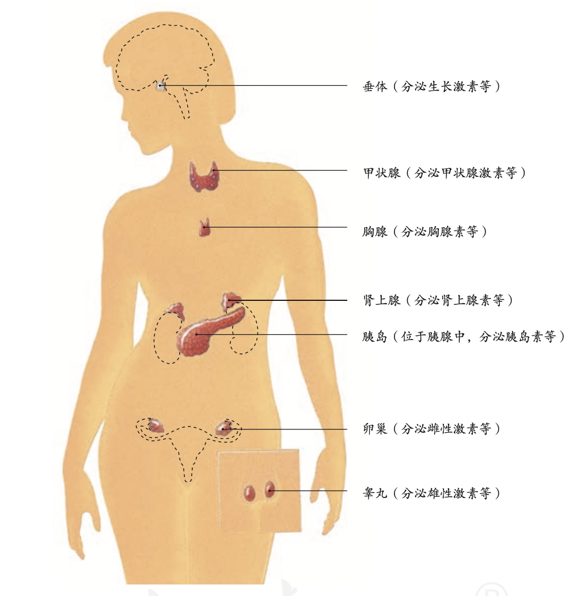

# 生物知识
`2023/07/24 22:11:18  by: 程序员·小李`

#### 生物的特征

1. 生物的生活`需要营养`
2. 生物能进行呼吸
3. 生物能排出体内的废物
4. 生物能`对外界刺激做出反应`
5. 生物能够进行生长和繁殖
6. 生物都有`遗传和变异`的特性
7. 除`病毒`外，生物都是由`细胞`构成的

#### 生物圈

`生物及其环境的组合`称为**生物圈**。生物圈的范围是大气圈的底部、水圈的大部、岩石圈的表面。

环境中影响生物`生活和分布`的因素叫做`生态因素`。

> 生态因素分为`生物因素`和`非生物因素`。非生物因素如阳光、空气、水等，生物因素指的是影响某种生物生活的其他生物。

生物与生物之间的关系包含`捕食、合作、竞争、寄生`等

#### 生态系统

一定的空间范围内，生物与其生存的环境共同构成**生态系统**。

生态系统中的生物部分包含**生产者、消费者、分解者**。非生物部分包含`阳光、空气、水`等。

> 植物可以通过光合作用`制造有机物`，因而是典型的`生产者`。动物不能制造有机物，只能直接或间接地以植物为食，因而是典型的`消费者`。`细菌、真菌`将有机物分解为无机物，充当`分解者`的角色。

生态系统中，由`吃与被吃的关系`构成的链状结构叫做**食物链**，错综复杂的食物链相互交错构成**食物网**。

生态系统具有`自净能力`（自我调节能力），使得各种生物和环境之间存在平衡和稳定，但这种自我调节能力是`有限度的`，超出限度就会破坏生态系统。

生物圈是`最大的生态系统`。

> 典型的生态系统
>
> 草原生态系统：多分布在干旱地区，没有高大的植被，草原具有保持水土、防风固沙的作用。
>
> 湿地生态系统：多水、过湿的条件下形成的，如沼泽。具有净化水质、蓄洪抗旱的作用。又被称为“地球之肾”
>
> 海洋生态系统：海洋中生活着很多微小的浮游植物，海平面能够`吸收大量二氧化碳`，海洋植物制造的氧气占70%
>
> 森林生态系统：分布在湿润的地区，动植物种类繁多。有调节气候、防风固沙、涵养水源、保持水土、净化空气的作用。称为“地球之肺”，“绿色水库”。
>
> 淡水生态系统：包含河流、湖泊、池塘等生态系统。对提供饮用水、灌溉、工业用水、调节气候有重要作用。
>
> 农田生态系统：以农作物为主，其他动植物很少。抵抗旱涝、病虫害的能力较差。
>
> 城市生态系统：以人为主，动植物很少。人口密集，排放的污染物较多，容易导致环境污染。

#### 细胞

> **细胞学说**
>
>德国科学家`施莱登`和施旺建立细胞学说，揭示了`动物和植物的统一性`，从而阐明了`生物界的统一性`。
>* 细胞是一个有机体，一切`动植物`都由细胞发育而来，并由细胞和细胞产物所构成;
>* 细胞是一个`相对独立的单位`，既有它自己的生命，又对与其他细胞共同组成的整体生命起作用;
>* 新细胞是由老细胞`分裂`产生的。

> **细胞观察史**
>
>1543年，比利时的`维萨里`通过大量的尸体解剖研究，指出器官由低一层次的结构——`组织`构成。
>
>1665年，英国科学家`罗伯特·胡克`用显微镜观察植物的`木栓组织`，发现这些木栓组织由许多规则的小室组成，他把观察到的图像画了下来，并把“小室” 称为 cell——细胞。
>
>荷兰著名磨镜技师`列文虎克`用自制的显微镜，观察到不同形态的`细菌、红细胞和精子`等。
>
>意大利的`马尔比基`用显微镜广泛观察了动植物的微细结构，如细胞壁和细胞质。
>
> 植物学家施莱登通过对花粉、胚珠和柱头组织的观察，发现这些组织都是由细胞构成的，而且细胞中都有细胞核。在此基础上，提出了`植物细胞学说`，即植物体都是由细胞构成的，细胞是植物体的基本单位，新细胞从老细胞中产生。 
>
> 施旺主要研究了动物细胞的形成机理和个体发育过程，他认为:动物体也是由`细胞`构成的，一切动物的个体发育过程，都是从`受精卵`这个单细胞开始的。
>
> 1858年，德国的`魏尔肖`总结出`“细胞通过分裂产生新细胞”`。他的名言是:“所有的细胞都来源于先前存在的细胞。”

> 📣 扩展知识
>
> 病毒`没有细胞结构`，一般由`核酸和蛋白质`组成。但是，病毒的生活离不开细胞，

> **细胞-组织-器官-个体**
>
>`细胞是生命活动的基本单位`，细胞是基本的生命系统。在多细胞生物体内，细胞又是构成组织的组分，组织是构成器官的组分，器官是构成个体的组分。组织、器官、个体都是有生命活动的整体，因此是不同层次的生命系统。

> **个体-种群-群落-生态系统-生物圈**
>
>在一定的空间范围内，`同种生物的所有个体`形成一个整体——种群，`不同种群`相互作用形成更大的整体——群落，群落与无机环境相互作用形成更大的整体——`生态系统`，地球上所有的生态系统相互关联构成更大的整体——`生物圈`。

> **显微镜使用**
>
> 转动反光镜使视野明亮。 
> 
> 在低倍镜下观察清楚后，把要放大观察的物像移至视野中央。
>
> 转动转换器，换成高倍物镜。 
>
> 用细准焦螺旋调焦并观察。

> **真核细胞与原核细胞、真核生物与原核生物**
>
>细胞都有相似的基本结构，如`细胞膜、细胞质和细胞核`。有一类细胞`没有成形的细胞核`，如大肠杆菌和其他细菌细胞。科学家根据`细胞内有无以核膜为界限的细胞核`，把细胞分为`真核细胞`和`原核细胞`两大类。
>
>由真核细胞构成的生物叫作`真核生物`，如植物、动物、真菌等。由原核细胞构成的生物叫作`原核生物`。原核生物主要是分布广泛的各种细菌。

> 淡水水域污染后富营养化，导致`蓝细菌和绿藻`等大量繁殖，会形成水华，影响水质和水生动物的生活。

蓝细菌细胞内含有`藻蓝素和叶绿素`，是`能进行光合作用`的自养生物。细菌中的多数种类是营腐生或寄生生活的异养生物。细菌的细胞都有`细胞壁、细胞膜和细胞质`，都没有由核膜包被的细胞核，也没有染色体，但有`环状的DNA分子`，位于细胞内特定的区域，这个区域叫作`拟核`。 

原核细胞和真核细胞具有相似的细胞膜和细胞质，它们都以`DNA作为遗传物质`，这让我们再一次看到了原核细 胞和真核细胞的统一性。

#### 分子——组成细胞的物质

细胞生命活动所需要的物质，归根结底是从无机自然界中获取的。因此，组成细胞的化学元素，没有一种化学元素为细胞所特有。细胞中常见的化学元素中，含量较多的有C、H、O、N、P、S、K、Ca、Mg等元素，称为大量元素;有些元素含量很少，如Fe、Mn、Zn、Cu、B、Mo等，称为微量元素。

组成细胞的各种元素大多以化合物的形式存在，如`水、糖类、蛋白质、脂质、核酸`等等，细胞内含量最多的化合物是`水`，含量最多的有机化合物是`蛋白质`

> **还原性糖、蛋白质、脂肪检测试剂**
>
> 糖类中的还原糖，如葡萄糖，与`斐林试剂`发生作用，生成`砖红色沉淀`。脂肪可以被`苏丹III染液`染成`橘黄色`。蛋白质与`双缩脲试剂`发生作用，产生`紫色`反应。

人们普遍认为，地球上最早的生命孕育在海洋中，生命从一开始就离不开水。生物体的含水量随着生物种类的不同有所差别，一般为60%~95%，水母的含水量达到97%。
* 水是构成细胞的重要成分，也是活细胞中`含量最多的化合物`。
* 水是细胞内`良好的溶剂`，许多种物质能够在水中溶解；
* `参与细胞内的生化反应`
* 多细胞生物体的绝大多数细胞，必须浸润在以水为基础的液体环境中。
* 水在生物体内的流动，可以`运送营养物质及代谢废物`。

水在细胞中以两种形式存在，绝大部分的水呈游离状态，可以自由流动，叫作`自由水`;一部分水与细胞内的其 他物质相结合，叫作`结合水`。自由水是细胞内良好的`溶剂`;结合水是细胞结构的`重要组成部分`，大约占细胞内全部水分的4.5%。细胞内结合水的存在形式主要是水与蛋白质、多糖等物质结合，这样水就失去流动性和溶解性，成为生物体的构成成分。

细胞内自由水所占的比例越大，细胞的`代谢就越旺盛`;而结合水越多，细胞抵抗干旱和寒冷等不良环境的能力就越强。将种子晒干就是`减少自由水`而降低代谢，便于储藏;北方冬小麦在冬天来临前，自由水的比例会逐渐降低，而结合水的比例会逐渐上升，以避免气温下降时自由水过多导致结冰而损害自身。

无机盐是细胞中含量很少的无机物，仅占细胞鲜重的1%~1.5%。Mg是构成`叶绿素`的元素，Fe是构成`血红素`的元素。P是组成`细胞膜、细胞核`的重要成分。人体内Na离子缺乏会引起神经、肌肉细胞的`兴奋性降低`，最终引发`肌肉酸痛、无力`等，因此，当大量出汗排出过多的无机盐后，应`多喝淡盐水`。哺乳动物的血液中必须含有一定量的Ca离子，如果Ca离子的含量太低，动物会出现`抽搐`等症状。

此外，生物体内的某些无机盐离子，必须保持一定的量，这对维持细胞的酸碱平衡也非常重要。可见，许多种无 机盐对于`维持细胞和生物体的生命活动`都有重要作用。

#### 人的来源、生殖

现代类人猿和人类的共同祖先是`森林古猿`。

男性主要生殖器官是`睾丸`（产生精子，分泌雄性激素）。附睾是`贮存精子`的器官。精子从附睾通过`输精管`输送到`尿道`，通过尿道排出体外。

女性的主要生殖器官是`卵巢`（产生卵细胞，分泌雌性激素）。卵细胞从卵巢中排出后会沿着`输卵管`向子宫方向移动。子宫是胚胎发育的场所。

精子和卵细胞都是生殖细胞，精液进入阴道后，精子游动进入子宫，进而进入输卵管内与卵细胞相遇。只有一个精子能够进入卵细胞结合形成受精卵。受精卵不断进行细胞分裂，逐渐发育成`胚泡`。胚泡缓慢地移动到子宫中，最终附着在`子宫内膜`上。胚泡中的细胞继续进行分裂和分化，逐渐发育成胚胎，在8周左右时发育成胎儿。

胎儿生活在`羊水`中，通过`胎盘、脐带`从母体获得所需要的营养物质和氧;胎儿产生的二氧化碳等废物，通过`胎盘`经母体排出。`胎盘`是胎儿和母体交换物质的器官。胎盘靠近胎儿的一面附有脐带与胎儿相连，靠近母体的一面与母体的子宫内膜相连。胎儿和母体通过胎盘上的`绒毛`进行物质交换。

一般来说，从形成受精卵开始到`第38周`(266天)时，胎儿就发育成熟了。成熟的胎儿和胎盘从母体的阴道产出，这个过程叫做`分娩`。

**罗伯特·爱德华兹**因发明了`体外受精技术`而获得这一年度的诺贝尔生理学或医学奖。

**“试管婴儿”**是指利用人工方法，让卵细胞和精子在体外受精，受精卵在体外形成早期胚胎后再植入子宫，胚胎在子宫内完成发育。1978年7月25日，在该诊所诞生了世界上第一个“试管婴儿”——英国的路易斯·布朗。这是不孕不育治疗方面的一场革命。这项技术适用于因输卵管堵塞阻碍受精而不孕的妇女，也适用于因精子数量少，或精子活动能力弱而需在体外用单精子注射完成受精的男性。

#### 青春期

青春期是一生中身体发育和智力发展的黄金时期，与性激素分泌有关，青春期会有一些变化：
* `身高突增`
* `神经系统以及心脏和肺`等器官的功能明显增强。
* 性器官迅速发育，男孩出现遗精，女孩会来月经。
* 第二性征。男性主要表现为`胡须、腋毛`等的生长，`喉结突出`，`声音变粗，声调较低`等；女性主要表现为`骨盆宽大`，`乳房增大，声调较高`等。

#### 营养物质

>六大营养素：`糖类、脂肪、蛋白质、水、无机盐和维生素`

糖类、脂肪和蛋白质都是组成细胞的主要有机物，并且能为生命活动提供能量。

>人体生命活动所需要的能量，主要是由**糖类**提供的。葡萄糖、蔗糖、淀粉都属于糖类。
>
>肥肉、大豆、花生等食物含有较多的**脂肪**。贮存在人体内的脂肪是重要的`备用能源物质`。病人几天吃不下食物，身体就会明显消瘦，这是因为贮存在体内的脂肪等物质消耗多而补充少。
>
>奶、蛋、鱼、肉等食物含有丰富的**蛋白质**。蛋白质是建造和修复身体的重要原料，人体的`生长发育`以及`受损细胞的修复和更新`，都离不开蛋白质。蛋白质也能被分解，为人体的生命活动提供能量。

含铁的有机分子是`红细胞`的重要组成成分。铁摄入不足会影响红细胞的形成，引起缺铁性贫血。

>水是人体细胞的主要成分之一，人体的各项生命活动离不开水。人体内的营养物质以及尿素等废物，只有溶解在水中才能运输。
>
>无机盐的作用多种多样。例如，含**钙**的无机盐是`骨骼和牙齿`的重要组成成分。

大多数维生素只能从食物中摄取。维生素不是构成细胞的主要原料，不为人体提供能量，人体每日对它们的需要量也很小，但影响生长发育。

> **膳食纤维**大量存在于蔬菜、水果、海藻和粮食(特别是粗粮)等植物性食物中，包括纤维素、果胶等。膳食纤维是植物`细胞壁`的主要成分。人无法消化纤维素的，纤维素能够`促进胃肠的蠕动和排空`，减少患大肠癌的机会。有利于`降低血脂和血糖`，从而维护心脑血管的健康，有利于预防糖尿病、维持正常体重。一些科学家把它称作人体的`“第七类营养素”`。

#### 消化、吸收

小分子物质能够直接被细胞吸收，大分子有机物须先分解成小分子的有机物，才能被细胞吸收。食物在消化道内分解成可以被细胞吸收的物质的过程叫做**消化**。

>食物的消化是靠`消化系统`来完成的。人体的消化系统是由`消化道`（口腔、咽、食道、胃、小肠、大肠、肛门等器官）和`消化腺`（唾液腺、肝、胰等器官以及分布在消化道壁内的小腺体）组成的。

唾液中的唾液淀粉酶可以使淀粉分解为`麦芽糖`。在口腔中，淀粉只有一小部分被分解为麦芽糖，蛋白质和脂肪则没有分解。胃里有胃腺分泌的大量胃液，胃液中的`蛋白酶`对蛋白质进行初步分解。小肠中有`胰腺和肠腺`分泌的大量的消化液，在多种消化酶的作用下，淀粉、脂肪和蛋白质分解为可以被细胞直接吸收的小分子有机物。

>**小肠**是人体吸收营养物质的主要器官。葡萄糖、氨基酸以及大量的水和无机盐等物质，被构成`小肠绒毛壁`的一层上皮细胞所吸收，然后转运到小肠绒毛腔内的毛细血管中，随着血液运往全身各处。未被小肠消化和吸收的物质下行到大肠，其中一部分水、无机盐和维生素被大肠吸收，剩余的残渣形成粪便，通过肛门排出体外。粪便中往往含有病菌、虫卵等有害物质，通过高温堆肥、沼气发酵等方式进行无害化处理，可以“变废为宝”，成为农业生产上的有机肥。

胆汁中`没有消化酶`，但它能使脂肪变成微小的颗粒，起到促进脂肪分解的作用。脂肪最终被分解为`甘油和脂肪酸`。

#### 呼吸系统

人体的呼吸系统是由`呼吸道`（鼻、咽、喉、气管、支气管）和`肺`组成的。

鼻腔前部生有鼻毛;鼻腔内表面的黏膜可以分泌黏液，黏膜中还分布着丰富的毛细血管。

* 哮喘是`支气管感染`或者`过敏`引起的一种疾病，常由于吸入花粉、灰尘等物质引起。患哮喘时，由于气体进出肺的通道变窄，会出现呼吸困难。
* 肺炎是一种由`细菌、病毒`等感染引起的严重疾病，常表现为发烧、胸 部疼痛、咳嗽、呼吸急促等。
* 尘肺是长期在粉尘比较多的场所工作的人容易患的一种职业病。患者会出现胸闷、呼吸困难等症状。
* 发生沙尘暴时，戴口罩以减少尘埃的吸入。重污染天气应尽量减少户外活动。

呼吸道能对吸入的气体进行处理，使到达肺部的气体`温暖、湿润、清洁`。人们吃进去的食物和吸入的空气都要经过`咽`。空气通过喉进入气管，而食物进入食道。呼吸时，喉口开放，空气畅通无阻;吞咽时，`会厌软骨`像盖子一样盖住喉口，以免食物进入气管。

空气在肺里与血液进行气体交换。肺是呼吸系统的主要器官，它位于胸腔内，左右各一个，左肺有`两叶`，右肺有`三叶`，一分钟大约呼吸16次。

胸廓容积的扩大和缩小，还与膈的运动有关。膈位于胸腔的底部，将胸腔和腹腔分隔开，主要由肌肉组织构成。在吸气时，膈肌收缩，膈顶部下降，使胸廓的上下径增大;呼气时正好相反，膈肌舒张，膈顶部回升，胸廓的上下径缩小

气体顺着支气管在肺里的各级分支，到达肺泡。肺泡外面包绕着丰富的毛细血管。肺泡壁和毛细血管壁都是一层扁平的上皮细胞，吸气时，肺泡都像小气球似的鼓了起来，肺泡中的氧气透过肺泡壁和毛细血管壁进入血液;同时血液中的二氧化碳也通过这些毛细血管壁和肺泡壁进入肺泡，然后随着呼气的过程排出体外。进入血液中的氧，通过血液循环输送到全身各处的组织细胞里。

#### 循环系统

血液有明显的分层现象。上层淡黄色半透明的液体是`血浆`；下层红色部分是`红细胞`。交界面的白色物质是`白细胞与血小板`。血液就是由`血浆和血细胞`(包括红细胞、白细胞、血小板)构成的。

| 成分| 含量| 特点| 作用|
| :-:| :-:| :-:| :-:| 
| 血浆| 55%| 90%是水，还包含营养成分、代谢废物、血浆蛋白| 运载血细胞，运输养料和废物 | 
| 红细胞| 数量最多| 两面凹的圆盘状，成熟的红细胞没有细胞核，生存120天左右，富含血红蛋白| 运输氧 | 
| 白细胞| 数量比较少| 体积比较大，有细胞核| 与疾病斗争的“卫士”，吞噬病菌，发炎与白细胞有关 | 
| 血小板 | 数量比较少| 最小，没有细胞核，形状不规则| 伤口快速凝固 | 

血液从心脏流出血管叫做**动脉**。动脉的管壁较厚，弹性大，血流速度快。动脉一般分布较深，也有些分布较浅，比如颈部及腕部能够摸到搏动的血管就是分布较浅的动脉。与心脏相连的动脉较粗，远离心脏后动脉不断分支变细，管径也由大变小，最小的小动脉再分支成毛细血管

**毛细血管**是连通于最小的动脉与静脉之间的血管。它数量多，分布广，遍布全身各处组织中;它的内径很小，只允许红细胞单行通过;管壁非常薄，只由一层扁平上皮细胞构成;管内血流的速度最慢。毛细血管的这些特点，便于血液与组织细胞充分地进行物质交换。血液中的营养物质与氧，可穿过毛细血管壁到达组织细胞，最后被细胞利用;组织细胞产生的二氧化碳与其他废物，可穿过毛细血管壁而进入血液被运走

**静脉**是将血液从身体各部分送回心脏的血管。静脉的管壁较薄，弹性较小，且血液经过毛细血管汇入静脉时压力较低，因此管内的血流速度较慢。 手臂上的“青筋”就是分布较浅的静脉。

在四肢静脉的内表面，通常具有防止血液倒流的`静脉瓣`。如果静脉瓣膜老化失去功能，血流变慢，血液在静脉中滞留，静脉就会膨胀，这种情形叫静脉曲张，多出现于老年人的腿部。中青年人长期从事重体力劳动，长时间站立或久坐不动，也可能出现静脉曲张。

#### 心脏

心脏是一个主要由肌肉组成的中空的器官，内部有一道厚厚的肌肉壁将心脏分隔成`左右不相通`的两个部分。上面的空腔叫`心房`，下面的空腔叫`心室`。与左心室相连的是`主动脉`，与右心室相连的是`肺动脉`，与左心房相连的是`肺静脉`，与右心房相连的是`上腔静脉和下腔静脉`。心房与心室之间、心室与动脉之间都具有能开闭的瓣膜，能够防止血液的倒流。

当心房收缩时，血液从心房穿过瓣膜进入心室。接着心室收缩，瓣膜关闭，左心室的血液从主动脉泵出流向全身各处，右心室的血液从肺动脉泵出流向肺部。然后动脉瓣关闭，心房和心室均舒张，肺部的血液经肺静脉回流入左心房; 全身各处的血液经上腔静脉、下腔静脉回流入右心房

> **体循环**：血液由左心室进入主动脉，再经过全身的各级动脉、毛细血管网、各级静脉，最后汇集到上腔、下腔静脉，流回到右心房，称为体循环。血液由动脉血变成了静脉血
> 
> **肺循环**：血液从右心室进入肺动脉，经过肺部的毛细血管网，再由肺静脉流回左心房，这一循环途径称为肺循环。血液与肺泡交换物质，由静脉血变成了动脉血。

**冠脉循环** ：心肌所需要的营养物质和氧需要通过冠脉循环。冠脉循环是指血液由主动脉基部的冠状动脉流向心肌内部的毛细血管网，再由静脉流回右心房的循环。如果冠状动脉发生病变(如动脉硬化、管腔变窄等)致使心肌缺血，就会引起冠心病。冠状动脉发生梗塞，就会危及生命。

#### 输血

成年人体内的血量大致相当于本人体重的`7%~8%`。正常情况下少量失血可以在短时间内得到补充而恢复，但如果一次失血超过800〜1000毫升，就会出现`头晕、心跳加快、眼前发黑和出冷汗`等症状；如果一次失血超过1 200〜1 500毫升，就会发生生命危险，需要及时输血。

1900年，奥地利科学家`卡尔·兰德斯坦纳`在实验中发现，一个人的红细胞，在遇到某些人的血浆时发生凝集;遇到另一些人的血浆时，却不会发生凝集。他发现血液有不同的类型，将它们分为A型、B型、AB型和O型。（除了ABO血型外，还有其他血型系统。 Rh血型就是常见的人类血型系统之一。）

安全输血应以`输同型血`为原则。在没有同型血可输而且情况紧急时，任何血型的人都可以缓慢地输入少量的O型血;AB型血的人，除可输入少量O型血外，也可缓慢地输入少量的A型或B型血。大量输血时，仍需实行同型输血。

**成分输血**：根据病人的需要，“缺什么补什么”，选择性地输入血液的某一成分，从而大大提高了病人输血治疗的效果，降低了输血不良反应的发生率，也避免了大量的血液浪费。

从1998年起，我国实行`无偿献血制度`，提倡18~55周岁的健康公民自愿献血。健康成年人每次献血200~300毫升不影响健康。

#### 泌尿系统

生命活动中会产生许多代谢废物，须及时排出体外。人体将二氧化碳、尿素，以及多余的水和无机盐等排出体外的过程叫做**排泄**，主要是通过`泌尿系统`完成。

肾脏是形成尿液的器官，每个肾脏包括大约100万个结构和功能单位，叫做肾单位。每个肾单位由`肾小球、肾小囊和肾小管`等部分组成。肾小球由入球小动脉分出的许多毛细血管相互缠绕而成，这些毛细血管汇集成出球小动脉。肾小囊套在肾小球的外面，下接肾小管。肾小管细长而曲折，周围缠绕着大量的毛细血管。

肾小球和肾小囊内壁起`过滤`作用。当血液流经肾小球时，除血细胞和大分子的蛋白质以外，血浆中的一部分`水、无机盐、葡萄糖和尿素`等物质，都可以经过肾小球过滤到肾小囊中，形成原尿（人体每天形成的原尿大约有180升）。当原尿流经肾小管时，`全部葡萄糖、大部分的水和部分无机盐`等被肾小管重新吸收。这些被重新吸收的物质进入包绕在肾小管外面的毛细血管中，送回到血液里，而剩下的水和无机盐、尿素等就形成了尿液。人体每天排出的尿液约1.5升。

肾脏中形成的尿液，经输尿管流入`膀胱`暂时储存。当膀胱内的尿液储存到一定量时，人就产生尿意。排尿时，尿液经尿道排出体外。排尿起到`排出废物`、调节体内`水和无机盐的平衡`、维持组织细胞的`正常生理功能`的作用。

尿素、多余的水分和无机盐，也能通过皮肤中的汗腺分泌汗液排出。汗液的主要成分是水，还有少量的尿素和无 机盐等物质。汗腺分布于人的全身皮肤，在腋窝、掌心、足底等处分布较多。

汗腺分为分泌部和导管，分泌部位于真皮或皮下组织内，产生的汗液经导管排到皮肤的表面。

#### 感觉与感官

人的眼球近似球体，由眼球壁和眼球的内容物构成。

物体反射来的光线进入你的眼睛，依次经过角膜、瞳孔、晶状体和玻璃体，经过晶状体等的折射，落在视网膜上形成一个物像。当视网膜上对光线敏感的细胞获得图像信息时，会通过视觉神经将信息传给大脑的特定区域，大脑立即处理有关信息，形成视觉。

如果眼球的前后径过长，或者晶状体曲度过大且不易恢复原大小，远处物体反射来的光线通过晶状体等折射所形成的物像，就会落到`视网膜的前方`，这样看到的是一个模糊不清的物像，叫做近视眼。可以通过配戴近视镜——凹透镜加以矫正。

听觉的形成过程大致是:外界的声波经过`外耳道`传到`鼓膜`，鼓膜的振动通过`听小骨`传到内耳，刺激了`耳蜗`内相应的感觉细胞，这些细胞就将声音信息通过`听觉神经`传给`大脑`的一定区域，人就产生了听觉。

如果突然暴露在极强的噪声下，鼓膜会破裂，甚至会因此失去听觉。除减少和消除噪声外，还应当注意:避免长时间使用耳机；不要用尖锐的东西挖耳朵，以免戳伤外耳道或鼓膜;遇到巨大声响时，迅速张开口，使咽鼓管张开，或闭嘴、堵耳，以保持鼓膜两侧大气压力平衡；鼻咽部有炎症时，要及时治疗，避免引起中耳炎;不让脏水进入外耳道，避免外耳道感染。

#### 神经系统

神经系统是由`脑、脊髓、神经`组成的

脑和脊髓是神经系统的`中枢部分`， 脑神经和脊神经是神经系统的`周围部分`。

人的神经系统含有大量神经元，又叫神经细胞，是神经系统结构和功能的`基本单位`，包括`细胞体和突起`两部分。长的突起外表大都套有一层鞘，组成`神经纤维`。神经纤维集结成束，外面包有膜，构成一条神经。神经纤维末端的细小分支叫做`神经末梢`，它们分布在全身各处。

无论是简单的还是复杂的活动，都是主要靠神经系统来调节的，基本方式是`反射`。人体通过神经系统，对外界或内部的各种刺激所发生的有规律的反应叫反射，反射的结构基础是`反射弧`。

`缩手反射、眨眼反射、排尿反射和膝跳反射`等，都是人生来就有的反射。就这类反射来说，只要出现刺激，正常的人体都会作出相应的反应，而不需要先经过大脑的分析和判断，是一类简单的反射。

人通过学习还能形成复杂的反射，例如行人听到身后汽车喇叭声，迅速躲避等。对于某些语言刺激，也能形成复杂的反射。“望梅止渴”就是一个典型的例子。与语言文字有关的反射是最复杂的，也是人类所特有的。

人体通过各种简单或复杂的反射，从而能够对体内外的刺激迅速做出适当的反应，来调节自身的生命活动和适应各种环境变化。

#### 内分泌系统

人体的生命活动主要受到神经系统的调节，但也受到激素调节的影响。睾丸和卵巢都是内分泌腺。内分泌腺没有导管，分泌物激素，直接进入腺体内的毛细血管，随着血液循环输送到全身各处。

人体主要的内分泌腺有`垂体、甲状腺、肾上腺、胰岛和性腺`等，它们共同组成人体的内分泌系统，分泌许多 种激素。在内分泌系统中，垂体具有重要的作用。它位于脑的下方，因此也叫脑下垂体。成人的垂体能分泌多种激素，其中有的激素还能调节其他内分泌腺(如性腺、甲状腺)的活动，进而影响其他激素的分泌。

> * 年幼的`侏儒症患者`只需每周注射很少的**生长激素**，生长发育速度就会明显加快。
> * **甲状腺激素**可以`促进代谢`、`生长发育`，提高神经系统的兴奋性。如果体内甲状腺激素过多，人就会消瘦，且情绪容易激动。
> * **胰岛素**的主要功能`是调节糖类`在体内的吸收、利用和转化等。当人体内胰岛素分泌不足时，细胞吸收和利用血糖的能力就会减弱，部分血糖就会进入尿液，形成糖尿。糖尿病患者可以通过注射胰岛素进行治疗，患者的典型表现是`多尿、多饮、多食`等。
> * `地方性甲状腺肿`：脖子肿大，呼吸困难，劳动时心跳快、气短等，患者因缺碘而造成体内**甲状腺激素**分泌不足，从而导致甲状腺代偿性增生。食用加碘食盐可以防治这种疾病。此外，常吃海带、紫菜等含碘丰富的海产品，对于防治这种疾病也有很好的效果。
> * 情绪激动时，你的大脑皮层就会特别兴奋，因而促使肾上腺分泌较多的**肾上腺素**等。肾上腺素能够促使`心跳加快、血压升高、血流加快`，也会引起面部的血流量增加，因而显得面红耳赤。在紧急情况下，肾上腺素的分泌增加，可以增加中枢神经系统的兴奋性，使人体反应灵敏，还能充分调动人体的潜力，以应对紧急情况。

任何溶液都有一定的pH，其范围在0〜14之间。pH等于7的溶液呈中性，pH小于7的溶液呈酸性。pH`小于5.6`的雨水则是**酸雨**。酸雨主要是人为地向大气中排放大量的酸性物质造成的。酸雨可以使土壤中的养分发生化学变化，从而不能被植物吸收利用;酸雨可以使河流和湖泊酸化，从而影响鱼虾等水生生物的生长发育，甚至造成水生生物死亡;酸雨可以引起水源酸化，影响饮用，威胁人们的健康;酸雨直接危害植物的芽和叶，严重时使成片的植物死亡。

控制酸雨的根本措施，是通过净化装置，减少燃烧煤、石油等燃料时污染物的排放。